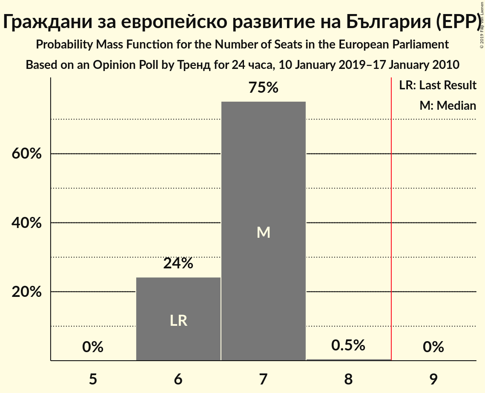
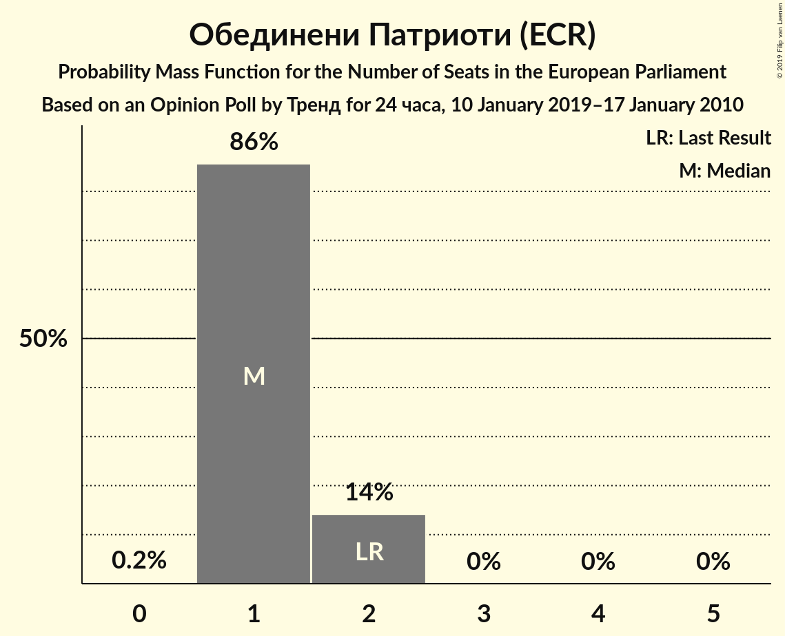

# Opinion Poll by Тренд for 24 часа, 10 January 2019–17 January 2010

<a href="#voting-intentions">Voting Intentions</a> | <a href="#seats">Seats</a> | <a href="#coalitions">Coalitions</a> | <a href="#technical-information">Technical Information</a>

## Voting Intentions

### Confidence Intervals

| Party | Last Result | Poll Result | 80% Confidence Interval | 90% Confidence Interval | 95% Confidence Interval | 99% Confidence Interval |
|:-----:|:-----------:|:-----------:|:-----------------------:|:-----------------------:|:-----------------------:|:-----------------------:|
| Граждани за европейско развитие на България (EPP) | 30.4% | 36.0% | 34.1–38.0% |33.6–38.5% |33.1–39.0% |32.2–40.0% |
| Българска социалистическа партия (S&D) | 18.9% | 34.0% | 32.1–36.0% |31.6–36.5% |31.2–37.0% |30.3–38.0% |
| Движение за права и свободи (ALDE) | 17.3% | 14.0% | 12.7–15.5% |12.3–15.9% |12.0–16.3% |11.4–17.0% |
| Обединени Патриоти (ECR) | 10.7% | 7.0% | 6.1–8.2% |5.8–8.5% |5.6–8.8% |5.2–9.4% |
| Демократична България (EPP) | 0.0% | 4.0% | 3.3–4.9% |3.1–5.1% |2.9–5.4% |2.6–5.8% |
| Воля (*) | 0.0% | 3.0% | 2.4–3.8% |2.2–4.0% |2.1–4.2% |1.8–4.6% |

*Note:* The poll result column reflects the actual value used in the calculations. Published results may vary slightly, and in addition be rounded to fewer digits.

## Seats

### Confidence Intervals

| Party | Last Result | Median | 80% Confidence Interval | 90% Confidence Interval | 95% Confidence Interval | 99% Confidence Interval |
|:-----:|:-----------:|:------:|:-----------------------:|:-----------------------:|:-----------------------:|:-----------------------:|
| <a href="#граждани-за-европейско-развитие-на-българия-(epp)">Граждани за европейско развитие на България (EPP)</a> | 6 | 7 | 6–7 |6–7 |6–7 |6–7 |
| <a href="#българска-социалистическа-партия-(s&d)">Българска социалистическа партия (S&D)</a> | 4 | 6 | 6–7 |6–7 |6–7 |6–7 |
| <a href="#движение-за-права-и-свободи-(alde)">Движение за права и свободи (ALDE)</a> | 4 | 3 | 2–3 |2–3 |2–3 |2–3 |
| <a href="#обединени-патриоти-(ecr)">Обединени Патриоти (ECR)</a> | 2 | 1 | 1–2 |1–2 |1–2 |1–2 |
| <a href="#демократична-българия-(epp)">Демократична България (EPP)</a> | 0 | 0 | 0 |0–1 |0–1 |0–1 |
| <a href="#воля-(*)">Воля (*)</a> | 0 | 0 | 0 |0 |0 |0 |

### Граждани за европейско развитие на България (EPP)

*For a full overview of the results for this party, see the [Граждани за европейско развитие на България (EPP)](party-гражданизаевропейскоразвитиенабългарияepp.html) page.*

| Number of Seats | Probability | Accumulated | Special Marks |
|:---------------:|:-----------:|:-----------:|:-------------:|
| 6 | 22% | 100% | Last Result |
| 7 | 77% | 78% | Median |
| 8 | 0.4% | 0.4% |  |
| 9 | 0% | 0% | Majority |

### Българска социалистическа партия (S&D)

*For a full overview of the results for this party, see the [Българска социалистическа партия (S&D)](party-българскасоциалистическапартияsd.html) page.*

| Number of Seats | Probability | Accumulated | Special Marks |
|:---------------:|:-----------:|:-----------:|:-------------:|
| 4 | 0% | 100% | Last Result |
| 5 | 0.3% | 100% |  |
| 6 | 72% | 99.7% | Median |
| 7 | 27% | 27% |  |
| 8 | 0% | 0% |  |

### Движение за права и свободи (ALDE)

*For a full overview of the results for this party, see the [Движение за права и свободи (ALDE)](party-движениезаправаисвободиalde.html) page.*

| Number of Seats | Probability | Accumulated | Special Marks |
|:---------------:|:-----------:|:-----------:|:-------------:|
| 2 | 25% | 100% |  |
| 3 | 75% | 75% | Median |
| 4 | 0% | 0% | Last Result |

### Обединени Патриоти (ECR)

*For a full overview of the results for this party, see the [Обединени Патриоти (ECR)](party-обединенипатриотиecr.html) page.*

| Number of Seats | Probability | Accumulated | Special Marks |
|:---------------:|:-----------:|:-----------:|:-------------:|
| 0 | 0.2% | 100% |  |
| 1 | 87% | 99.8% | Median |
| 2 | 13% | 13% | Last Result |
| 3 | 0% | 0% |  |

### Демократична България (EPP)

*For a full overview of the results for this party, see the [Демократична България (EPP)](party-демократичнабългарияepp.html) page.*

| Number of Seats | Probability | Accumulated | Special Marks |
|:---------------:|:-----------:|:-----------:|:-------------:|
| 0 | 93% | 100% | Last Result, Median |
| 1 | 7% | 7% |  |
| 2 | 0% | 0% |  |

### Воля (*)

*For a full overview of the results for this party, see the [Воля (*)](party-воля.html) page.*

| Number of Seats | Probability | Accumulated | Special Marks |
|:---------------:|:-----------:|:-----------:|:-------------:|
| 0 | 99.9% | 100% | Last Result, Median |
| 1 | 0.1% | 0.1% |  |
| 2 | 0% | 0% |  |

## Coalitions

### Confidence Intervals

| Coalition | Last Result | Median | Majority? | 80% Confidence Interval | 90% Confidence Interval | 95% Confidence Interval | 99% Confidence Interval |
|:---------:|:-----------:|:------:|:---------:|:-----------------------:|:-----------------------:|:-----------------------:|:-----------------------:|
| Българска социалистическа партия (S&D) | 4 | 6 | 0% | 6–7 | 6–7 | 6–7 | 6–7 |
| Движение за права и свободи (ALDE) | 4 | 3 | 0% | 2–3 | 2–3 | 2–3 | 2–3 |
| Обединени Патриоти (ECR) | 2 | 1 | 0% | 1–2 | 1–2 | 1–2 | 1–2 |

### Българска социалистическа партия (S&D)

| Number of Seats | Probability | Accumulated | Special Marks |
|:---------------:|:-----------:|:-----------:|:-------------:|
| 4 | 0% | 100% | Last Result |
| 5 | 0.3% | 100% |  |
| 6 | 72% | 99.7% | Median |
| 7 | 27% | 27% |  |
| 8 | 0% | 0% |  |

### Движение за права и свободи (ALDE)

| Number of Seats | Probability | Accumulated | Special Marks |
|:---------------:|:-----------:|:-----------:|:-------------:|
| 2 | 25% | 100% |  |
| 3 | 75% | 75% | Median |
| 4 | 0% | 0% | Last Result |

### Обединени Патриоти (ECR)

| Number of Seats | Probability | Accumulated | Special Marks |
|:---------------:|:-----------:|:-----------:|:-------------:|
| 0 | 0.2% | 100% |  |
| 1 | 87% | 99.8% | Median |
| 2 | 13% | 13% | Last Result |
| 3 | 0% | 0% |  |

## Technical Information

### Opinion Poll

+ **Polling firm:** Тренд
+ **Commissioner(s):** 24 часа
+ **Fieldwork period:** 10 January 2019–17 January 2010

### Calculations

+ **Sample size:** 1008
+ **Simulations done:** 131,072
+ **Error estimate:** 1.31%

