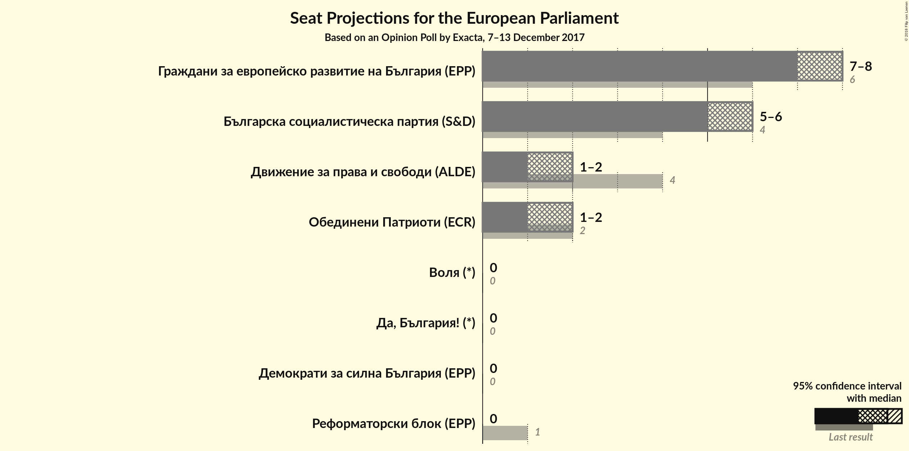
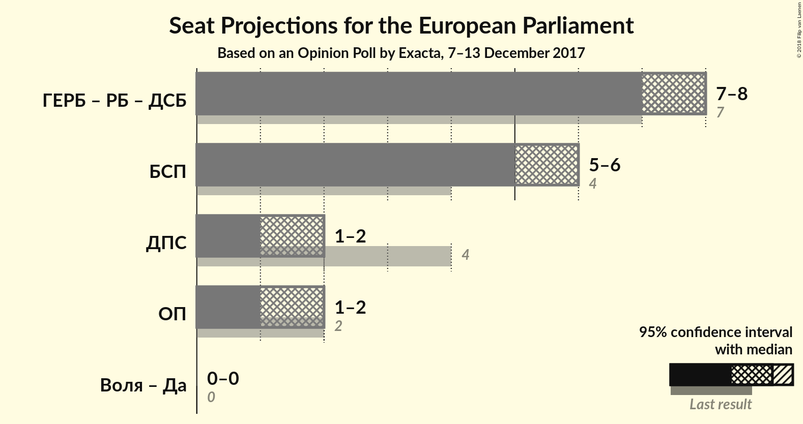

# Opinion Poll by Exacta, 7–13 December 2017

<a href="#voting-intentions">Voting Intentions</a> | <a href="#seats">Seats</a> | <a href="#coalitions">Coalitions</a> | <a href="#technical-information">Technical Information</a>

## Voting Intentions

### Confidence Intervals

| Party | Last Result | Poll Result | 80% Confidence Interval | 90% Confidence Interval | 95% Confidence Interval | 99% Confidence Interval |
|:-----:|:-----------:|:-----------:|:-----------------------:|:-----------------------:|:-----------------------:|:-----------------------:|
| Граждани за европейско развитие на България (EPP) | 30.4% | 41.3% | 38.9–43.8% |38.3–44.5% |37.7–45.1% |36.5–46.3% |
| Българска социалистическа партия (S&D) | 18.9% | 30.7% | 28.5–33.0% |27.8–33.7% |27.3–34.3% |26.3–35.4% |
| Обединени Патриоти (ECR) | 10.7% | 9.0% | 7.8–10.6% |7.4–11.1% |7.1–11.4% |6.5–12.2% |
| Движение за права и свободи (ALDE) | 17.3% | 8.4% | 7.2–10.0% |6.9–10.4% |6.6–10.8% |6.0–11.6% |
| Воля (*) | 0.0% | 2.7% | 2.0–3.7% |1.8–3.9% |1.7–4.2% |1.4–4.7% |
| Реформаторски блок (EPP) | 6.4% | 2.1% | 1.5–3.0% |1.4–3.2% |1.2–3.5% |1.0–3.9% |
| Демократи за силна България (EPP) | 0.0% | 1.9% | 1.4–2.8% |1.2–3.0% |1.1–3.3% |0.9–3.7% |
| Да, България! (*) | 0.0% | 1.0% | 0.7–1.7% |0.6–2.0% |0.5–2.1% |0.4–2.5% |

*Note:* The poll result column reflects the actual value used in the calculations. Published results may vary slightly, and in addition be rounded to fewer digits.

## Seats

### Confidence Intervals

| Party | Last Result | Median | 80% Confidence Interval | 90% Confidence Interval | 95% Confidence Interval | 99% Confidence Interval |
|:-----:|:-----------:|:------:|:-----------------------:|:-----------------------:|:-----------------------:|:-----------------------:|
| <a href="#граждани-за-европейско-развитие-на-българия-(epp)">Граждани за европейско развитие на България (EPP)</a> | 6 | 8 | 7–8 |7–8 |7–8 |7–9 |
| <a href="#българска-социалистическа-партия-(s&d)">Българска социалистическа партия (S&D)</a> | 4 | 6 | 5–6 |5–6 |5–6 |5–7 |
| <a href="#обединени-патриоти-(ecr)">Обединени Патриоти (ECR)</a> | 2 | 2 | 1–2 |1–2 |1–2 |1–2 |
| <a href="#движение-за-права-и-свободи-(alde)">Движение за права и свободи (ALDE)</a> | 4 | 2 | 1–2 |1–2 |1–2 |1–2 |
| <a href="#воля-(*)">Воля (*)</a> | 0 | 0 | 0 |0 |0 |0 |
| <a href="#реформаторски-блок-(epp)">Реформаторски блок (EPP)</a> | 1 | 0 | 0 |0 |0 |0 |
| <a href="#демократи-за-силна-българия-(epp)">Демократи за силна България (EPP)</a> | 0 | 0 | 0 |0 |0 |0 |
| <a href="#да,-българия!-(*)">Да, България! (*)</a> | 0 | 0 | 0 |0 |0 |0 |

### Граждани за европейско развитие на България (EPP)

*For a full overview of the results for this party, see the [Граждани за европейско развитие на България (EPP)](party-гражданизаевропейскоразвитиенабългарияepp.html) page.*

| Number of Seats | Probability | Accumulated | Special Marks |
|:---------------:|:-----------:|:-----------:|:-------------:|
| 6 | 0% | 100% | Last Result |
| 7 | 22% | 100% |  |
| 8 | 76% | 78% | Median |
| 9 | 2% | 2% | Majority |
| 10 | 0% | 0% |  |

### Българска социалистическа партия (S&D)

*For a full overview of the results for this party, see the [Българска социалистическа партия (S&D)](party-българскасоциалистическапартияsd.html) page.*

| Number of Seats | Probability | Accumulated | Special Marks |
|:---------------:|:-----------:|:-----------:|:-------------:|
| 4 | 0% | 100% | Last Result |
| 5 | 27% | 100% |  |
| 6 | 71% | 73% | Median |
| 7 | 2% | 2% |  |
| 8 | 0% | 0% |  |

### Обединени Патриоти (ECR)

*For a full overview of the results for this party, see the [Обединени Патриоти (ECR)](party-обединенипатриотиecr.html) page.*

| Number of Seats | Probability | Accumulated | Special Marks |
|:---------------:|:-----------:|:-----------:|:-------------:|
| 1 | 25% | 100% |  |
| 2 | 75% | 75% | Last Result, Median |
| 3 | 0.1% | 0.1% |  |
| 4 | 0% | 0% |  |

### Движение за права и свободи (ALDE)

*For a full overview of the results for this party, see the [Движение за права и свободи (ALDE)](party-движениезаправаисвободиalde.html) page.*

| Number of Seats | Probability | Accumulated | Special Marks |
|:---------------:|:-----------:|:-----------:|:-------------:|
| 1 | 30% | 100% |  |
| 2 | 70% | 70% | Median |
| 3 | 0% | 0% |  |
| 4 | 0% | 0% | Last Result |

### Воля (*)

*For a full overview of the results for this party, see the [Воля (*)](party-воля.html) page.*

| Number of Seats | Probability | Accumulated | Special Marks |
|:---------------:|:-----------:|:-----------:|:-------------:|
| 0 | 99.9% | 100% | Last Result, Median |
| 1 | 0.1% | 0.1% |  |
| 2 | 0% | 0% |  |

### Реформаторски блок (EPP)

*For a full overview of the results for this party, see the [Реформаторски блок (EPP)](party-реформаторскиблокepp.html) page.*

| Number of Seats | Probability | Accumulated | Special Marks |
|:---------------:|:-----------:|:-----------:|:-------------:|
| 0 | 100% | 100% | Median |
| 1 | 0% | 0% | Last Result |

### Демократи за силна България (EPP)

*For a full overview of the results for this party, see the [Демократи за силна България (EPP)](party-демократизасилнабългарияepp.html) page.*

| Number of Seats | Probability | Accumulated | Special Marks |
|:---------------:|:-----------:|:-----------:|:-------------:|
| 0 | 100% | 100% | Last Result, Median |

### Да, България! (*)

*For a full overview of the results for this party, see the [Да, България! (*)](party-дабългария.html) page.*

| Number of Seats | Probability | Accumulated | Special Marks |
|:---------------:|:-----------:|:-----------:|:-------------:|
| 0 | 100% | 100% | Last Result, Median |

## Coalitions

### Confidence Intervals

| Coalition | Last Result | Median | Majority? | 80% Confidence Interval | 90% Confidence Interval | 95% Confidence Interval | 99% Confidence Interval |
|:---------:|:-----------:|:------:|:---------:|:-----------------------:|:-----------------------:|:-----------------------:|:-----------------------:|
| Граждани за европейско развитие на България (EPP) – Реформаторски блок (EPP) – Демократи за силна България (EPP) | 7 | 8 | 2% | 7–8 | 7–8 | 7–8 | 7–9 |
| Българска социалистическа партия (S&D) | 4 | 6 | 0% | 5–6 | 5–6 | 5–6 | 5–7 |
| Движение за права и свободи (ALDE) | 4 | 2 | 0% | 1–2 | 1–2 | 1–2 | 1–2 |
| Обединени Патриоти (ECR) | 2 | 2 | 0% | 1–2 | 1–2 | 1–2 | 1–2 |
| Воля (*) – Да, България! (*) | 0 | 0 | 0% | 0 | 0 | 0 | 0 |

### Граждани за европейско развитие на България (EPP) – Реформаторски блок (EPP) – Демократи за силна България (EPP)

| Number of Seats | Probability | Accumulated | Special Marks |
|:---------------:|:-----------:|:-----------:|:-------------:|
| 7 | 22% | 100% | Last Result |
| 8 | 76% | 78% | Median |
| 9 | 2% | 2% | Majority |
| 10 | 0% | 0% |  |

### Българска социалистическа партия (S&D)

| Number of Seats | Probability | Accumulated | Special Marks |
|:---------------:|:-----------:|:-----------:|:-------------:|
| 4 | 0% | 100% | Last Result |
| 5 | 27% | 100% |  |
| 6 | 71% | 73% | Median |
| 7 | 2% | 2% |  |
| 8 | 0% | 0% |  |

### Движение за права и свободи (ALDE)

| Number of Seats | Probability | Accumulated | Special Marks |
|:---------------:|:-----------:|:-----------:|:-------------:|
| 1 | 30% | 100% |  |
| 2 | 70% | 70% | Median |
| 3 | 0% | 0% |  |
| 4 | 0% | 0% | Last Result |

### Обединени Патриоти (ECR)

| Number of Seats | Probability | Accumulated | Special Marks |
|:---------------:|:-----------:|:-----------:|:-------------:|
| 1 | 25% | 100% |  |
| 2 | 75% | 75% | Last Result, Median |
| 3 | 0.1% | 0.1% |  |
| 4 | 0% | 0% |  |

### Воля (*) – Да, България! (*)

| Number of Seats | Probability | Accumulated | Special Marks |
|:---------------:|:-----------:|:-----------:|:-------------:|
| 0 | 99.9% | 100% | Last Result, Median |
| 1 | 0.1% | 0.1% |  |
| 2 | 0% | 0% |  |

## Technical Information

### Opinion Poll

+ **Polling firm:** Exacta
+ **Commissioner(s):** —
+ **Fieldwork period:** 7–13 December 2017

### Calculations

+ **Sample size:** 675
+ **Simulations done:** 1,048,576
+ **Error estimate:** 2.13%

