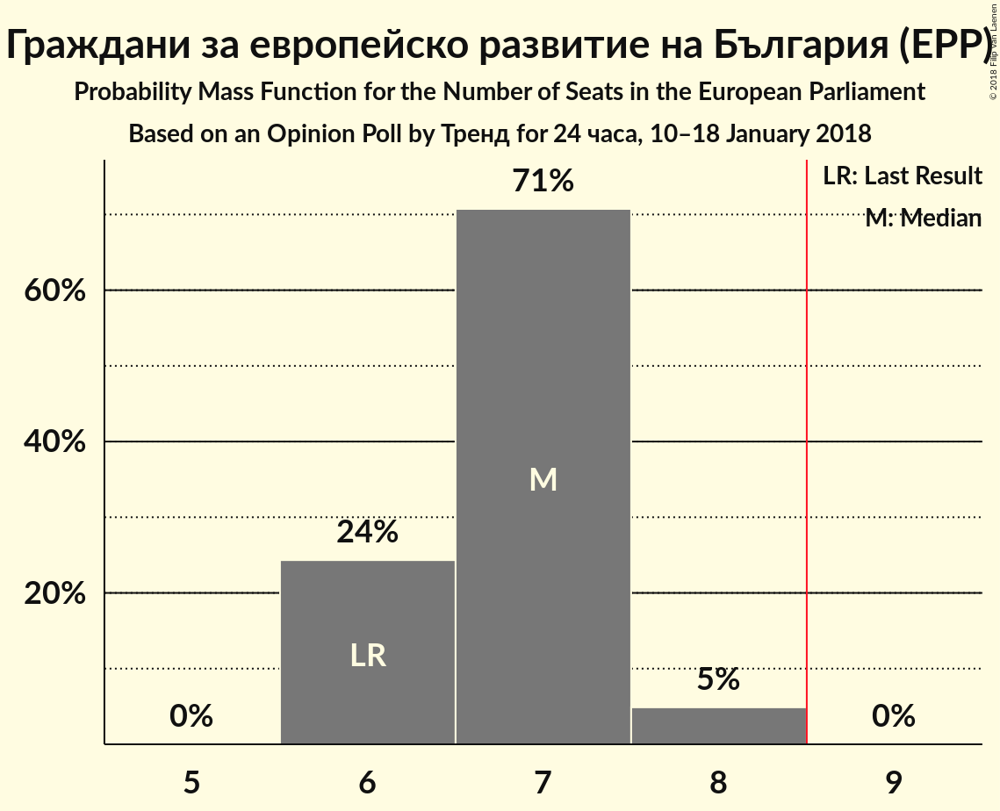
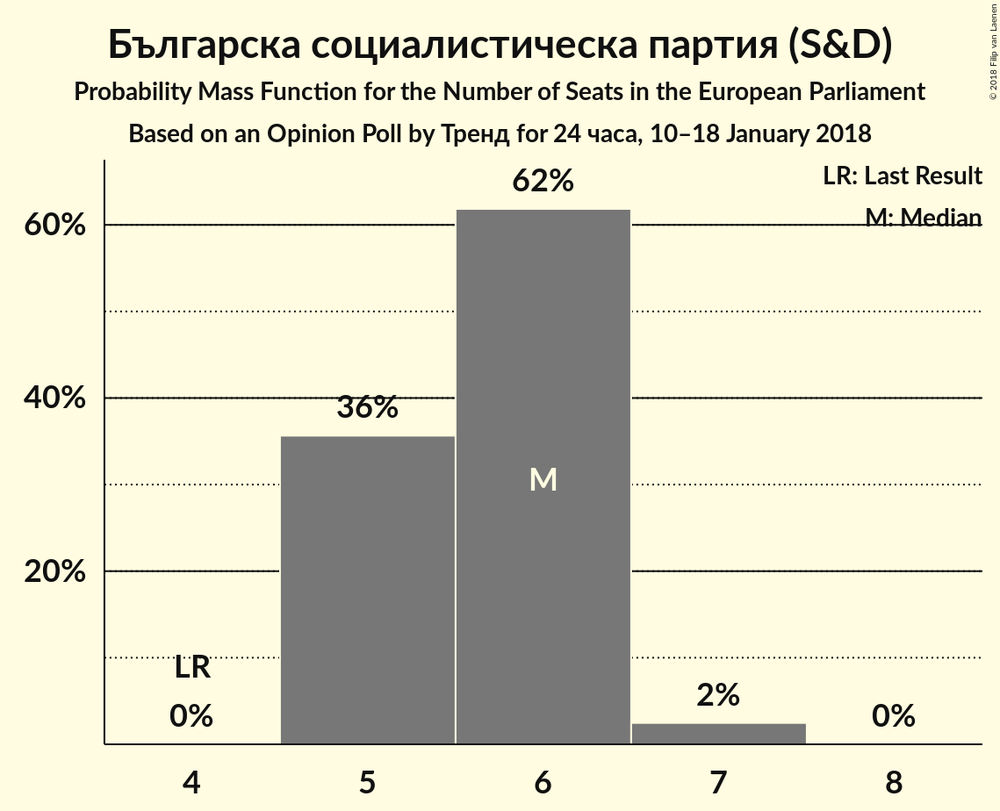
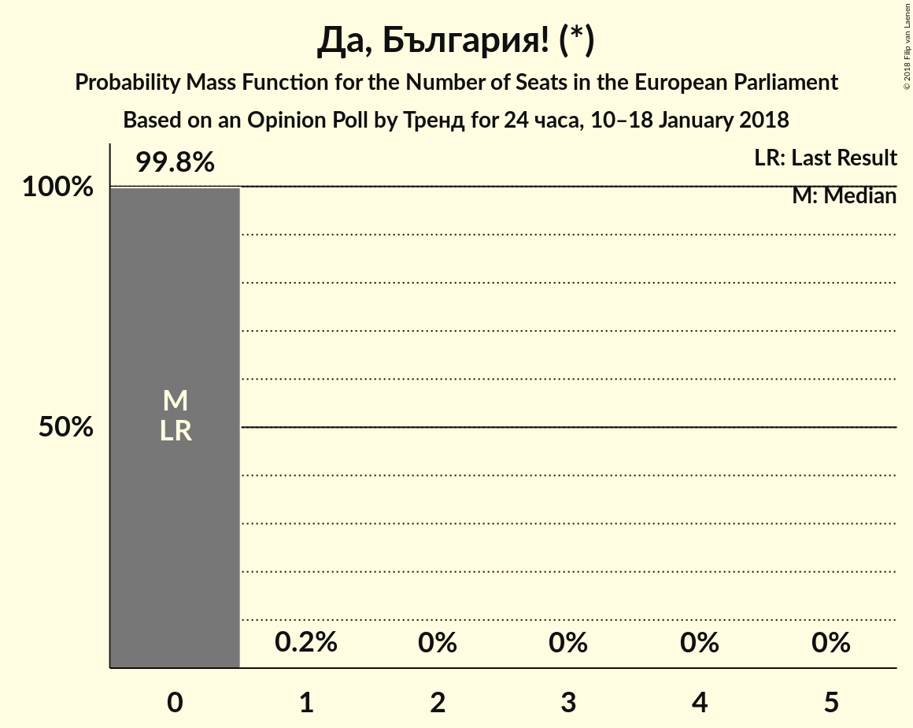

# Opinion Poll by Тренд for 24 часа, 10–18 January 2018

<a href="#voting-intentions">Voting Intentions</a> | <a href="#seats">Seats</a> | <a href="#coalitions">Coalitions</a> | <a href="#technical-information">Technical Information</a>

## Voting Intentions

### Confidence Intervals

| Party | Last Result | Poll Result | 80% Confidence Interval | 90% Confidence Interval | 95% Confidence Interval | 99% Confidence Interval |
|:-----:|:-----------:|:-----------:|:-----------------------:|:-----------------------:|:-----------------------:|:-----------------------:|
| Граждани за европейско развитие на България (EPP) | 30.4% | 35.7% | 33.3–38.3% |32.6–39.0% |32.0–39.6% |30.9–40.9% |
| Българска социалистическа партия (S&D) | 18.9% | 30.0% | 27.7–32.5% |27.1–33.2% |26.5–33.8% |25.4–35.0% |
| Движение за права и свободи (ALDE) | 17.3% | 10.0% | 8.6–11.7% |8.2–12.2% |7.9–12.7% |7.2–13.5% |
| Обединени Патриоти (ECR) | 10.7% | 8.7% | 7.4–10.3% |7.0–10.8% |6.7–11.2% |6.1–12.0% |
| Реформаторски блок (EPP) | 6.5% | 3.1% | 2.4–4.2% |2.2–4.5% |2.0–4.8% |1.7–5.4% |
| Воля (*) | 0.0% | 2.6% | 2.0–3.7% |1.8–4.0% |1.6–4.2% |1.4–4.8% |
| Да, България! (*) | 0.0% | 2.6% | 2.0–3.7% |1.8–4.0% |1.6–4.2% |1.4–4.8% |
| Демократи за силна България (EPP) | 0.0% | 1.6% | 1.1–2.5% |1.0–2.8% |0.9–3.0% |0.7–3.5% |

*Note:* The poll result column reflects the actual value used in the calculations. Published results may vary slightly, and in addition be rounded to fewer digits.

## Seats

### Confidence Intervals

| Party | Last Result | Median | 80% Confidence Interval | 90% Confidence Interval | 95% Confidence Interval | 99% Confidence Interval |
|:-----:|:-----------:|:------:|:-----------------------:|:-----------------------:|:-----------------------:|:-----------------------:|
| <a href="#Граждани-за-европейско-развитие-на-България-(epp)">Граждани за европейско развитие на България (EPP)</a> | 6 | 7 | 6–7 |6–7 |6–8 |6–8 |
| <a href="#Българска-социалистическа-партия-(s&d)">Българска социалистическа партия (S&D)</a> | 4 | 6 | 5–6 |5–6 |5–6 |5–7 |
| <a href="#Движение-за-права-и-свободи-(alde)">Движение за права и свободи (ALDE)</a> | 4 | 2 | 2 |2 |1–2 |1–3 |
| <a href="#Обединени-Патриоти-(ecr)">Обединени Патриоти (ECR)</a> | 2 | 2 | 1–2 |1–2 |1–2 |1–2 |
| <a href="#Реформаторски-блок-(epp)">Реформаторски блок (EPP)</a> | 1 | 0 | 0 |0 |0 |0–1 |
| <a href="#Воля-(*)">Воля (*)</a> | 0 | 0 | 0 |0 |0 |0 |
| <a href="#Да,-България!-(*)">Да, България! (*)</a> | 0 | 0 | 0 |0 |0 |0 |
| <a href="#Демократи-за-силна-България-(epp)">Демократи за силна България (EPP)</a> | 0 | 0 | 0 |0 |0 |0 |

### Граждани за европейско развитие на България (EPP)

*For a full overview of the results for this party, see the [Граждани за европейско развитие на България (EPP)](party-ГражданизаевропейскоразвитиенаБългарияepp.html) page.*

| Number of Seats | Probability | Accumulated | Special Marks |
|:---------------:|:-----------:|:-----------:|:-------------:|
| 6 | 24% | 100% | Last Result |
| 7 | 71% | 76% | Median |
| 8 | 5% | 5% |  |
| 9 | 0% | 0% | Majority |

### Българска социалистическа партия (S&D)

*For a full overview of the results for this party, see the [Българска социалистическа партия (S&D)](party-Българскасоциалистическапартияsd.html) page.*

| Number of Seats | Probability | Accumulated | Special Marks |
|:---------------:|:-----------:|:-----------:|:-------------:|
| 4 | 0% | 100% | Last Result |
| 5 | 36% | 100% |  |
| 6 | 62% | 64% | Median |
| 7 | 2% | 2% |  |
| 8 | 0% | 0% |  |

### Движение за права и свободи (ALDE)

*For a full overview of the results for this party, see the [Движение за права и свободи (ALDE)](party-Движениезаправаисвободиalde.html) page.*

| Number of Seats | Probability | Accumulated | Special Marks |
|:---------------:|:-----------:|:-----------:|:-------------:|
| 1 | 4% | 100% |  |
| 2 | 94% | 96% | Median |
| 3 | 1.4% | 1.4% |  |
| 4 | 0% | 0% | Last Result |

### Обединени Патриоти (ECR)

*For a full overview of the results for this party, see the [Обединени Патриоти (ECR)](party-ОбединениПатриотиecr.html) page.*

| Number of Seats | Probability | Accumulated | Special Marks |
|:---------------:|:-----------:|:-----------:|:-------------:|
| 1 | 23% | 100% |  |
| 2 | 77% | 77% | Last Result, Median |
| 3 | 0.1% | 0.1% |  |
| 4 | 0% | 0% |  |

### Реформаторски блок (EPP)

*For a full overview of the results for this party, see the [Реформаторски блок (EPP)](party-Реформаторскиблокepp.html) page.*

| Number of Seats | Probability | Accumulated | Special Marks |
|:---------------:|:-----------:|:-----------:|:-------------:|
| 0 | 98.8% | 100% | Median |
| 1 | 1.2% | 1.2% | Last Result |
| 2 | 0% | 0% |  |

### Воля (*)

*For a full overview of the results for this party, see the [Воля (*)](party-Воля.html) page.*

| Number of Seats | Probability | Accumulated | Special Marks |
|:---------------:|:-----------:|:-----------:|:-------------:|
| 0 | 99.8% | 100% | Last Result, Median |
| 1 | 0.2% | 0.2% |  |
| 2 | 0% | 0% |  |

### Да, България! (*)

*For a full overview of the results for this party, see the [Да, България! (*)](party-ДаБългария.html) page.*

| Number of Seats | Probability | Accumulated | Special Marks |
|:---------------:|:-----------:|:-----------:|:-------------:|
| 0 | 99.8% | 100% | Last Result, Median |
| 1 | 0.2% | 0.2% |  |
| 2 | 0% | 0% |  |

### Демократи за силна България (EPP)

*For a full overview of the results for this party, see the [Демократи за силна България (EPP)](party-ДемократизасилнаБългарияepp.html) page.*

| Number of Seats | Probability | Accumulated | Special Marks |
|:---------------:|:-----------:|:-----------:|:-------------:|
| 0 | 100% | 100% | Last Result, Median |

## Coalitions

### Confidence Intervals

| Coalition | Last Result | Median | Majority? | 80% Confidence Interval | 90% Confidence Interval | 95% Confidence Interval | 99% Confidence Interval |
|:---------:|:-----------:|:------:|:---------:|:-----------------------:|:-----------------------:|:-----------------------:|:-----------------------:|
| Граждани за европейско развитие на България (EPP) – Реформаторски блок (EPP) – Демократи за силна България (EPP) | 7 | 7 | 0% | 6–7 | 6–8 | 6–8 | 6–8 |
| Българска социалистическа партия (S&D) | 4 | 6 | 0% | 5–6 | 5–6 | 5–6 | 5–7 |
| Движение за права и свободи (ALDE) | 4 | 2 | 0% | 2 | 2 | 1–2 | 1–3 |
| Обединени Патриоти (ECR) | 2 | 2 | 0% | 1–2 | 1–2 | 1–2 | 1–2 |
| Воля (*) – Да, България! (*) | 0 | 0 | 0% | 0 | 0 | 0 | 0 |

### Граждани за европейско развитие на България (EPP) – Реформаторски блок (EPP) – Демократи за силна България (EPP)

| Number of Seats | Probability | Accumulated | Special Marks |
|:---------------:|:-----------:|:-----------:|:-------------:|
| 6 | 24% | 100% |  |
| 7 | 71% | 76% | Last Result, Median |
| 8 | 5% | 5% |  |
| 9 | 0% | 0% | Majority |

### Българска социалистическа партия (S&D)

| Number of Seats | Probability | Accumulated | Special Marks |
|:---------------:|:-----------:|:-----------:|:-------------:|
| 4 | 0% | 100% | Last Result |
| 5 | 36% | 100% |  |
| 6 | 62% | 64% | Median |
| 7 | 2% | 2% |  |
| 8 | 0% | 0% |  |

### Движение за права и свободи (ALDE)

| Number of Seats | Probability | Accumulated | Special Marks |
|:---------------:|:-----------:|:-----------:|:-------------:|
| 1 | 4% | 100% |  |
| 2 | 94% | 96% | Median |
| 3 | 1.4% | 1.4% |  |
| 4 | 0% | 0% | Last Result |

### Обединени Патриоти (ECR)

| Number of Seats | Probability | Accumulated | Special Marks |
|:---------------:|:-----------:|:-----------:|:-------------:|
| 1 | 23% | 100% |  |
| 2 | 77% | 77% | Last Result, Median |
| 3 | 0.1% | 0.1% |  |
| 4 | 0% | 0% |  |

### Воля (*) – Да, България! (*)

| Number of Seats | Probability | Accumulated | Special Marks |
|:---------------:|:-----------:|:-----------:|:-------------:|
| 0 | 99.5% | 100% | Last Result, Median |
| 1 | 0.5% | 0.5% |  |
| 2 | 0% | 0% |  |

## Technical Information

### Opinion Poll

+ **Polling firm:** Тренд
+ **Commissioner(s):** 24 часа
+ **Fieldwork period:** 10–18 January 2018

### Calculations

+ **Sample size:** 610
+ **Simulations done:** 1,048,576
+ **Error estimate:** 0.73%

