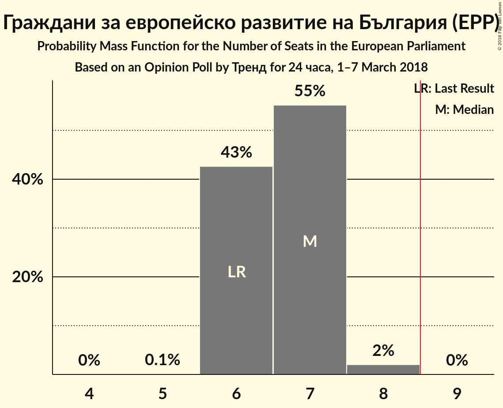
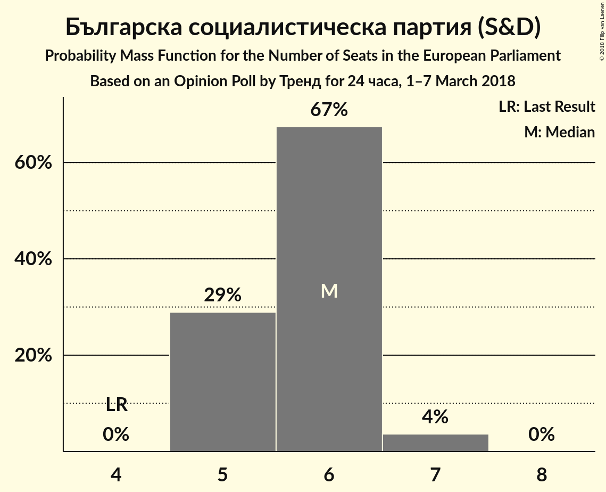
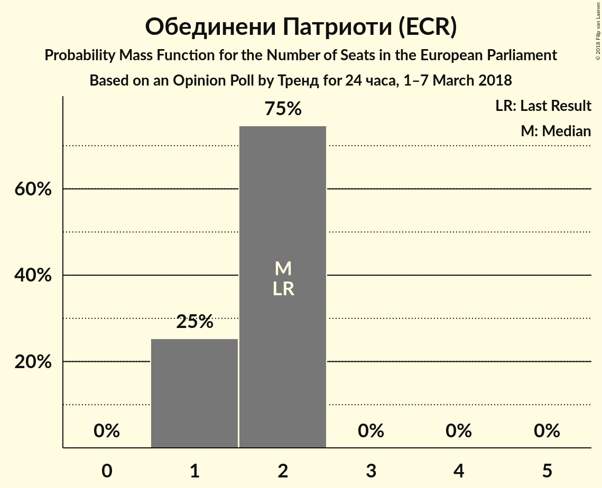
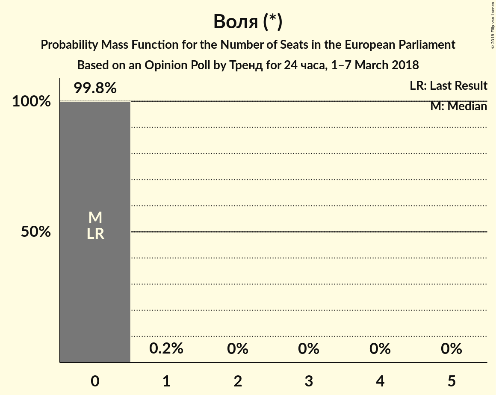
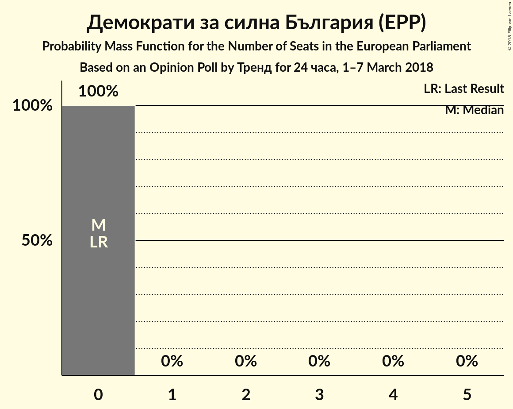

# Opinion Poll by Тренд for 24 часа, 1–7 March 2018

<a href="#voting-intentions">Voting Intentions</a> | <a href="#seats">Seats</a> | <a href="#coalitions">Coalitions</a> | <a href="#technical-information">Technical Information</a>

## Voting Intentions

### Confidence Intervals

| Party | Last Result | Poll Result | 80% Confidence Interval | 90% Confidence Interval | 95% Confidence Interval | 99% Confidence Interval |
|:-----:|:-----------:|:-----------:|:-----------------------:|:-----------------------:|:-----------------------:|:-----------------------:|
| Граждани за европейско развитие на България (EPP) | 30.4% | 35.0% | 32.6–37.5% |31.9–38.2% |31.3–38.9% |30.1–40.1% |
| Българска социалистическа партия (S&D) | 18.9% | 30.5% | 28.2–33.0% |27.6–33.7% |27.0–34.3% |25.9–35.5% |
| Движение за права и свободи (ALDE) | 17.3% | 10.9% | 9.4–12.7% |9.0–13.2% |8.7–13.6% |8.0–14.5% |
| Обединени Патриоти (ECR) | 10.7% | 8.4% | 7.1–10.0% |6.8–10.5% |6.5–10.9% |5.9–11.7% |
| Воля (*) | 0.0% | 2.6% | 2.0–3.7% |1.8–4.0% |1.6–4.3% |1.4–4.8% |
| Реформаторски блок (EPP) | 6.5% | 2.6% | 2.0–3.7% |1.8–4.0% |1.6–4.3% |1.4–4.8% |
| Да, България! (*) | 0.0% | 2.5% | 1.8–3.5% |1.6–3.8% |1.5–4.1% |1.2–4.6% |
| Демократи за силна България (EPP) | 0.0% | 1.7% | 1.2–2.5% |1.0–2.8% |0.9–3.0% |0.7–3.5% |

*Note:* The poll result column reflects the actual value used in the calculations. Published results may vary slightly, and in addition be rounded to fewer digits.

## Seats

### Confidence Intervals

| Party | Last Result | Median | 80% Confidence Interval | 90% Confidence Interval | 95% Confidence Interval | 99% Confidence Interval |
|:-----:|:-----------:|:------:|:-----------------------:|:-----------------------:|:-----------------------:|:-----------------------:|
| <a href="#Граждани-за-европейско-развитие-на-България-(epp)">Граждани за европейско развитие на България (EPP)</a> | 6 | 6 | 6–7 |6–7 |6–7 |6–8 |
| <a href="#Българска-социалистическа-партия-(s&d)">Българска социалистическа партия (S&D)</a> | 4 | 6 | 5–6 |5–6 |5–7 |5–7 |
| <a href="#Движение-за-права-и-свободи-(alde)">Движение за права и свободи (ALDE)</a> | 4 | 2 | 2 |2–3 |2–3 |1–3 |
| <a href="#Обединени-Патриоти-(ecr)">Обединени Патриоти (ECR)</a> | 2 | 2 | 1–2 |1–2 |1–2 |1–2 |
| <a href="#Воля-(*)">Воля (*)</a> | 0 | 0 | 0 |0 |0 |0 |
| <a href="#Реформаторски-блок-(epp)">Реформаторски блок (EPP)</a> | 1 | 0 | 0 |0 |0 |0 |
| <a href="#Да,-България!-(*)">Да, България! (*)</a> | 0 | 0 | 0 |0 |0 |0 |
| <a href="#Демократи-за-силна-България-(epp)">Демократи за силна България (EPP)</a> | 0 | 0 | 0 |0 |0 |0 |

### Граждани за европейско развитие на България (EPP)

*For a full overview of the results for this party, see the [Граждани за европейско развитие на България (EPP)](party-ГражданизаевропейскоразвитиенаБългарияepp.html) page.*

| Number of Seats | Probability | Accumulated | Special Marks |
|:---------------:|:-----------:|:-----------:|:-------------:|
| 5 | 0.2% | 100% |  |
| 6 | 53% | 99.8% | Last Result, Median |
| 7 | 46% | 47% |  |
| 8 | 0.9% | 0.9% |  |
| 9 | 0% | 0% | Majority |

### Българска социалистическа партия (S&D)

*For a full overview of the results for this party, see the [Българска социалистическа партия (S&D)](party-Българскасоциалистическапартияsd.html) page.*

| Number of Seats | Probability | Accumulated | Special Marks |
|:---------------:|:-----------:|:-----------:|:-------------:|
| 4 | 0% | 100% | Last Result |
| 5 | 26% | 100% |  |
| 6 | 70% | 74% | Median |
| 7 | 4% | 4% |  |
| 8 | 0% | 0% |  |

### Движение за права и свободи (ALDE)

*For a full overview of the results for this party, see the [Движение за права и свободи (ALDE)](party-Движениезаправаисвободиalde.html) page.*

| Number of Seats | Probability | Accumulated | Special Marks |
|:---------------:|:-----------:|:-----------:|:-------------:|
| 1 | 2% | 100% |  |
| 2 | 92% | 98% | Median |
| 3 | 6% | 6% |  |
| 4 | 0% | 0% | Last Result |

### Обединени Патриоти (ECR)

*For a full overview of the results for this party, see the [Обединени Патриоти (ECR)](party-ОбединениПатриотиecr.html) page.*

| Number of Seats | Probability | Accumulated | Special Marks |
|:---------------:|:-----------:|:-----------:|:-------------:|
| 1 | 18% | 100% |  |
| 2 | 82% | 82% | Last Result, Median |
| 3 | 0% | 0% |  |

### Воля (*)

*For a full overview of the results for this party, see the [Воля (*)](party-Воля.html) page.*

| Number of Seats | Probability | Accumulated | Special Marks |
|:---------------:|:-----------:|:-----------:|:-------------:|
| 0 | 99.7% | 100% | Last Result, Median |
| 1 | 0.3% | 0.3% |  |
| 2 | 0% | 0% |  |

### Реформаторски блок (EPP)

*For a full overview of the results for this party, see the [Реформаторски блок (EPP)](party-Реформаторскиблокepp.html) page.*

| Number of Seats | Probability | Accumulated | Special Marks |
|:---------------:|:-----------:|:-----------:|:-------------:|
| 0 | 99.8% | 100% | Median |
| 1 | 0.2% | 0.2% | Last Result |
| 2 | 0% | 0% |  |

### Да, България! (*)

*For a full overview of the results for this party, see the [Да, България! (*)](party-ДаБългария.html) page.*

| Number of Seats | Probability | Accumulated | Special Marks |
|:---------------:|:-----------:|:-----------:|:-------------:|
| 0 | 99.9% | 100% | Last Result, Median |
| 1 | 0.1% | 0.1% |  |
| 2 | 0% | 0% |  |

### Демократи за силна България (EPP)

*For a full overview of the results for this party, see the [Демократи за силна България (EPP)](party-ДемократизасилнаБългарияepp.html) page.*

| Number of Seats | Probability | Accumulated | Special Marks |
|:---------------:|:-----------:|:-----------:|:-------------:|
| 0 | 100% | 100% | Last Result, Median |

## Coalitions

### Confidence Intervals

| Coalition | Last Result | Median | Majority? | 80% Confidence Interval | 90% Confidence Interval | 95% Confidence Interval | 99% Confidence Interval |
|:---------:|:-----------:|:------:|:---------:|:-----------------------:|:-----------------------:|:-----------------------:|:-----------------------:|
| Граждани за европейско развитие на България (EPP) – Реформаторски блок (EPP) – Демократи за силна България (EPP) | 7 | 6 | 0% | 6–7 | 6–7 | 6–7 | 6–8 |
| Българска социалистическа партия (S&D) | 4 | 6 | 0% | 5–6 | 5–6 | 5–7 | 5–7 |
| Движение за права и свободи (ALDE) | 4 | 2 | 0% | 2 | 2–3 | 2–3 | 1–3 |
| Обединени Патриоти (ECR) | 2 | 2 | 0% | 1–2 | 1–2 | 1–2 | 1–2 |
| Воля (*) – Да, България! (*) | 0 | 0 | 0% | 0 | 0 | 0 | 0 |

### Граждани за европейско развитие на България (EPP) – Реформаторски блок (EPP) – Демократи за силна България (EPP)

| Number of Seats | Probability | Accumulated | Special Marks |
|:---------------:|:-----------:|:-----------:|:-------------:|
| 5 | 0.2% | 100% |  |
| 6 | 53% | 99.8% | Median |
| 7 | 46% | 47% | Last Result |
| 8 | 1.0% | 1.0% |  |
| 9 | 0% | 0% | Majority |

### Българска социалистическа партия (S&D)

| Number of Seats | Probability | Accumulated | Special Marks |
|:---------------:|:-----------:|:-----------:|:-------------:|
| 4 | 0% | 100% | Last Result |
| 5 | 26% | 100% |  |
| 6 | 70% | 74% | Median |
| 7 | 4% | 4% |  |
| 8 | 0% | 0% |  |

### Движение за права и свободи (ALDE)

| Number of Seats | Probability | Accumulated | Special Marks |
|:---------------:|:-----------:|:-----------:|:-------------:|
| 1 | 2% | 100% |  |
| 2 | 92% | 98% | Median |
| 3 | 6% | 6% |  |
| 4 | 0% | 0% | Last Result |

### Обединени Патриоти (ECR)

| Number of Seats | Probability | Accumulated | Special Marks |
|:---------------:|:-----------:|:-----------:|:-------------:|
| 1 | 18% | 100% |  |
| 2 | 82% | 82% | Last Result, Median |
| 3 | 0% | 0% |  |

### Воля (*) – Да, България! (*)

| Number of Seats | Probability | Accumulated | Special Marks |
|:---------------:|:-----------:|:-----------:|:-------------:|
| 0 | 99.6% | 100% | Last Result, Median |
| 1 | 0.4% | 0.4% |  |
| 2 | 0% | 0% |  |

## Technical Information

### Opinion Poll

+ **Polling firm:** Тренд
+ **Commissioner(s):** 24 часа
+ **Fieldwork period:** 1–7 March 2018

### Calculations

+ **Sample size:** 606
+ **Simulations done:** 131,072
+ **Error estimate:** 4.77%

