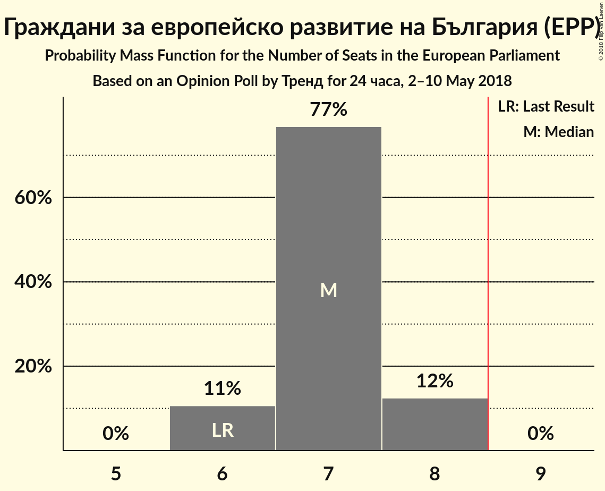

# Opinion Poll by Тренд for 24 часа, 2–10 May 2018

<a href="#voting-intentions">Voting Intentions</a> | <a href="#seats">Seats</a> | <a href="#coalitions">Coalitions</a> | <a href="#technical-information">Technical Information</a>

## Voting Intentions

### Confidence Intervals

| Party | Last Result | Poll Result | 80% Confidence Interval | 90% Confidence Interval | 95% Confidence Interval | 99% Confidence Interval |
|:-----:|:-----------:|:-----------:|:-----------------------:|:-----------------------:|:-----------------------:|:-----------------------:|
| Граждани за европейско развитие на България (EPP) | 30.4% | 37.0% | 34.6–39.6% |33.9–40.3% |33.3–40.9% |32.2–42.1% |
| Българска социалистическа партия (S&D) | 18.9% | 31.1% | 28.8–33.5% |28.1–34.2% |27.6–34.8% |26.5–36.0% |
| Движение за права и свободи (ALDE) | 17.3% | 10.5% | 9.0–12.2% |8.6–12.7% |8.3–13.1% |7.7–14.0% |
| Обединени Патриоти (ECR) | 10.7% | 8.7% | 7.4–10.3% |7.0–10.8% |6.7–11.2% |6.1–12.0% |
| Демократична България (EPP) | 0.0% | 3.7% | 2.9–4.9% |2.7–5.2% |2.5–5.5% |2.1–6.1% |
| Воля (*) | 0.0% | 2.7% | 2.1–3.8% |1.9–4.1% |1.7–4.3% |1.4–4.9% |
| Реформаторски блок (EPP) | 6.4% | 2.1% | 1.5–3.0% |1.4–3.3% |1.2–3.6% |1.0–4.1% |

*Note:* The poll result column reflects the actual value used in the calculations. Published results may vary slightly, and in addition be rounded to fewer digits.

## Seats

### Confidence Intervals

| Party | Last Result | Median | 80% Confidence Interval | 90% Confidence Interval | 95% Confidence Interval | 99% Confidence Interval |
|:-----:|:-----------:|:------:|:-----------------------:|:-----------------------:|:-----------------------:|:-----------------------:|
| <a href="#граждани-за-европейско-развитие-на-българия-(epp)">Граждани за европейско развитие на България (EPP)</a> | 6 | 7 | 6–8 |6–8 |6–8 |6–8 |
| <a href="#българска-социалистическа-партия-(s&d)">Българска социалистическа партия (S&D)</a> | 4 | 6 | 5–6 |5–7 |5–7 |5–7 |
| <a href="#движение-за-права-и-свободи-(alde)">Движение за права и свободи (ALDE)</a> | 4 | 2 | 2 |2 |2–3 |1–3 |
| <a href="#обединени-патриоти-(ecr)">Обединени Патриоти (ECR)</a> | 2 | 2 | 1–2 |1–2 |1–2 |1–2 |
| <a href="#демократична-българия-(epp)">Демократична България (EPP)</a> | 0 | 0 | 0 |0–1 |0–1 |0–1 |
| <a href="#воля-(*)">Воля (*)</a> | 0 | 0 | 0 |0 |0 |0 |
| <a href="#реформаторски-блок-(epp)">Реформаторски блок (EPP)</a> | 1 | 0 | 0 |0 |0 |0 |

### Граждани за европейско развитие на България (EPP)

*For a full overview of the results for this party, see the [Граждани за европейско развитие на България (EPP)](party-гражданизаевропейскоразвитиенабългарияepp.html) page.*

| Number of Seats | Probability | Accumulated | Special Marks |
|:---------------:|:-----------:|:-----------:|:-------------:|
| 6 | 11% | 100% | Last Result |
| 7 | 77% | 89% | Median |
| 8 | 12% | 13% |  |
| 9 | 0% | 0% | Majority |

### Българска социалистическа партия (S&D)

*For a full overview of the results for this party, see the [Българска социалистическа партия (S&D)](party-българскасоциалистическапартияsd.html) page.*

| Number of Seats | Probability | Accumulated | Special Marks |
|:---------------:|:-----------:|:-----------:|:-------------:|
| 4 | 0% | 100% | Last Result |
| 5 | 14% | 100% |  |
| 6 | 79% | 86% | Median |
| 7 | 7% | 7% |  |
| 8 | 0% | 0% |  |

### Движение за права и свободи (ALDE)

*For a full overview of the results for this party, see the [Движение за права и свободи (ALDE)](party-движениезаправаисвободиalde.html) page.*

| Number of Seats | Probability | Accumulated | Special Marks |
|:---------------:|:-----------:|:-----------:|:-------------:|
| 1 | 2% | 100% |  |
| 2 | 95% | 98% | Median |
| 3 | 3% | 3% |  |
| 4 | 0% | 0% | Last Result |

### Обединени Патриоти (ECR)

*For a full overview of the results for this party, see the [Обединени Патриоти (ECR)](party-обединенипатриотиecr.html) page.*

| Number of Seats | Probability | Accumulated | Special Marks |
|:---------------:|:-----------:|:-----------:|:-------------:|
| 1 | 21% | 100% |  |
| 2 | 79% | 79% | Last Result, Median |
| 3 | 0.1% | 0.1% |  |
| 4 | 0% | 0% |  |

### Демократична България (EPP)

*For a full overview of the results for this party, see the [Демократична България (EPP)](party-демократичнабългарияepp.html) page.*

| Number of Seats | Probability | Accumulated | Special Marks |
|:---------------:|:-----------:|:-----------:|:-------------:|
| 0 | 94% | 100% | Last Result, Median |
| 1 | 6% | 6% |  |
| 2 | 0% | 0% |  |

### Воля (*)

*For a full overview of the results for this party, see the [Воля (*)](party-воля.html) page.*

| Number of Seats | Probability | Accumulated | Special Marks |
|:---------------:|:-----------:|:-----------:|:-------------:|
| 0 | 99.7% | 100% | Last Result, Median |
| 1 | 0.3% | 0.3% |  |
| 2 | 0% | 0% |  |

### Реформаторски блок (EPP)

*For a full overview of the results for this party, see the [Реформаторски блок (EPP)](party-реформаторскиблокepp.html) page.*

| Number of Seats | Probability | Accumulated | Special Marks |
|:---------------:|:-----------:|:-----------:|:-------------:|
| 0 | 100% | 100% | Median |
| 1 | 0% | 0% | Last Result |

## Coalitions

### Confidence Intervals

| Coalition | Last Result | Median | Majority? | 80% Confidence Interval | 90% Confidence Interval | 95% Confidence Interval | 99% Confidence Interval |
|:---------:|:-----------:|:------:|:---------:|:-----------------------:|:-----------------------:|:-----------------------:|:-----------------------:|
| Българска социалистическа партия (S&D) | 4 | 6 | 0% | 5–6 | 5–7 | 5–7 | 5–7 |
| Движение за права и свободи (ALDE) | 4 | 2 | 0% | 2 | 2 | 2–3 | 1–3 |
| Обединени Патриоти (ECR) | 2 | 2 | 0% | 1–2 | 1–2 | 1–2 | 1–2 |

### Българска социалистическа партия (S&D)

| Number of Seats | Probability | Accumulated | Special Marks |
|:---------------:|:-----------:|:-----------:|:-------------:|
| 4 | 0% | 100% | Last Result |
| 5 | 14% | 100% |  |
| 6 | 79% | 86% | Median |
| 7 | 7% | 7% |  |
| 8 | 0% | 0% |  |

### Движение за права и свободи (ALDE)

| Number of Seats | Probability | Accumulated | Special Marks |
|:---------------:|:-----------:|:-----------:|:-------------:|
| 1 | 2% | 100% |  |
| 2 | 95% | 98% | Median |
| 3 | 3% | 3% |  |
| 4 | 0% | 0% | Last Result |

### Обединени Патриоти (ECR)

| Number of Seats | Probability | Accumulated | Special Marks |
|:---------------:|:-----------:|:-----------:|:-------------:|
| 1 | 21% | 100% |  |
| 2 | 79% | 79% | Last Result, Median |
| 3 | 0.1% | 0.1% |  |
| 4 | 0% | 0% |  |

## Technical Information

### Opinion Poll

+ **Polling firm:** Тренд
+ **Commissioner(s):** 24 часа
+ **Fieldwork period:** 2–10 May 2018

### Calculations

+ **Sample size:** 621
+ **Simulations done:** 1,048,576
+ **Error estimate:** 1.08%

