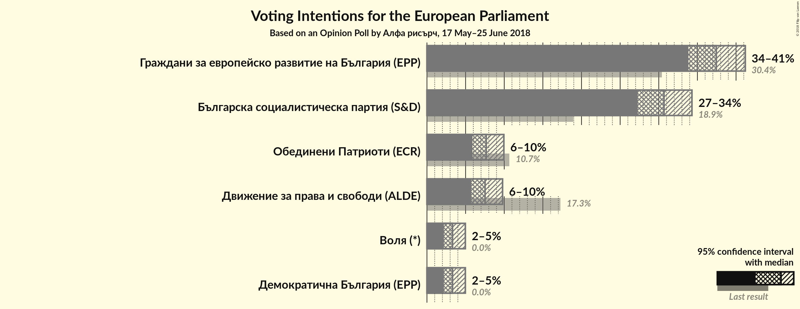
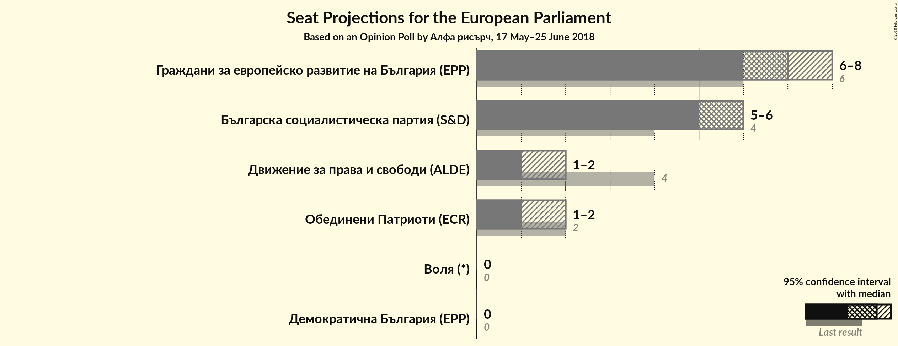
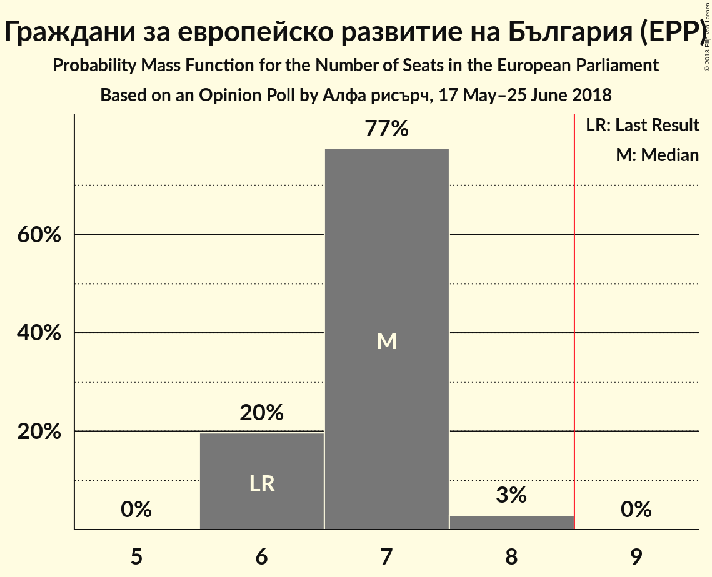
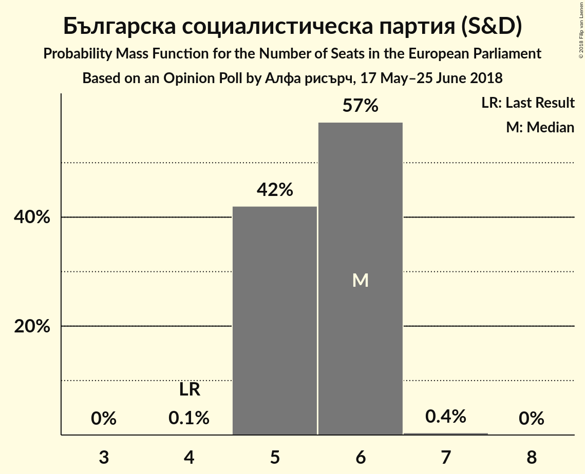
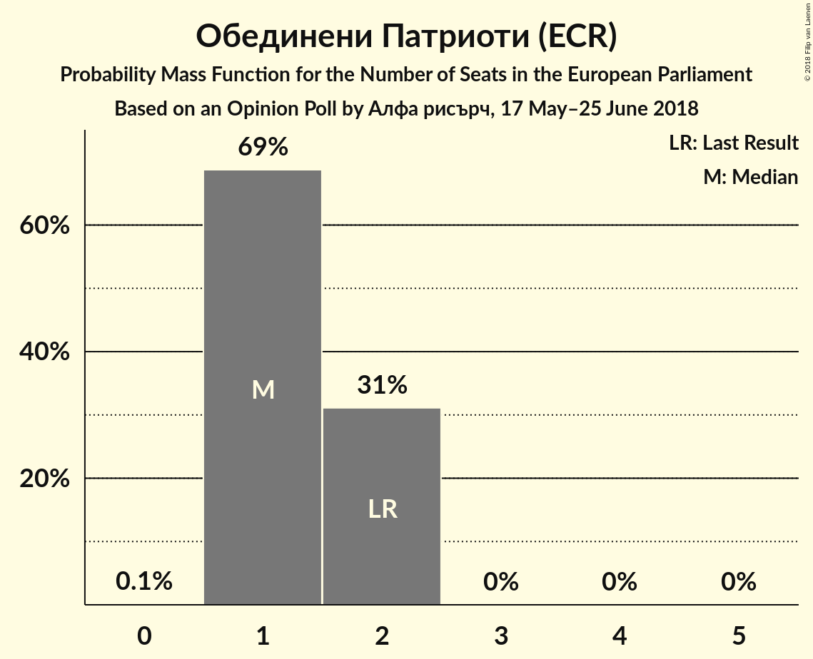
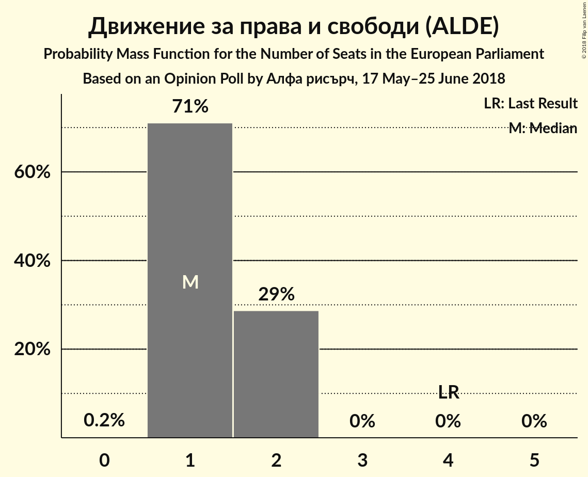
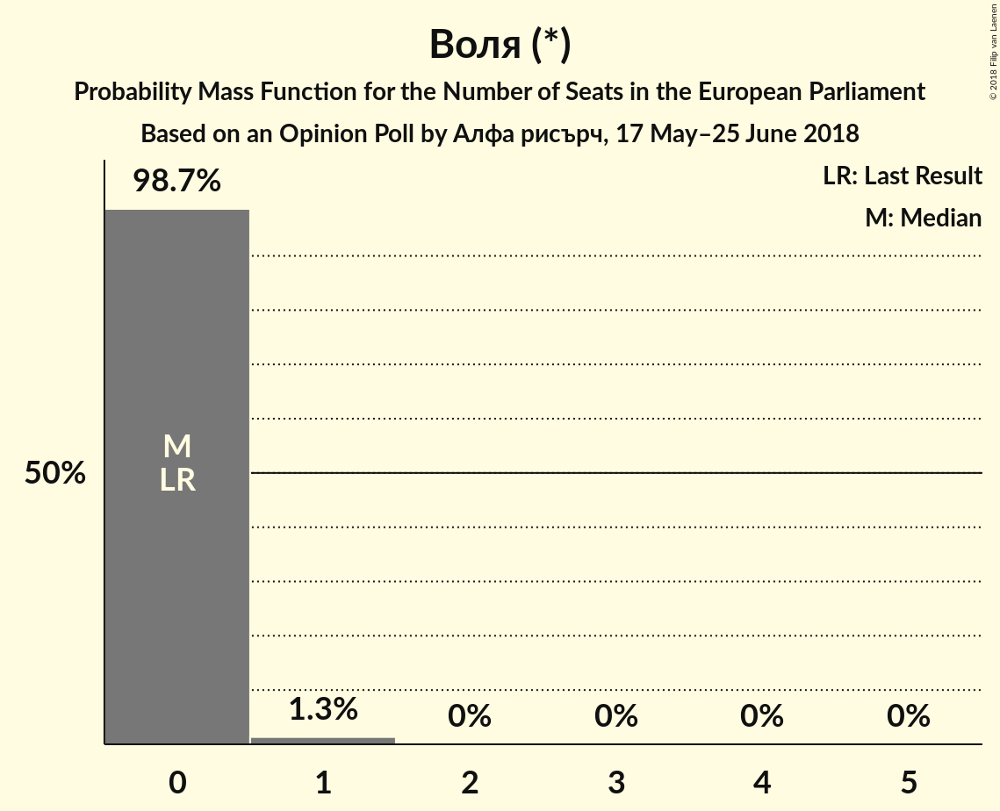
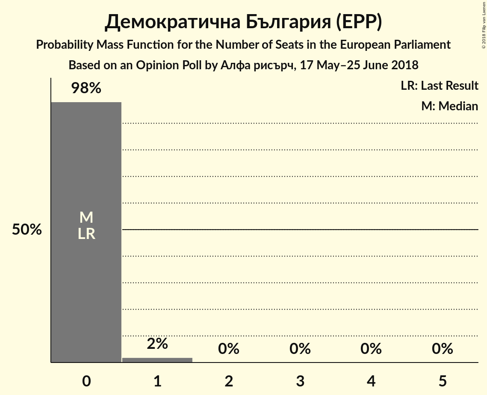
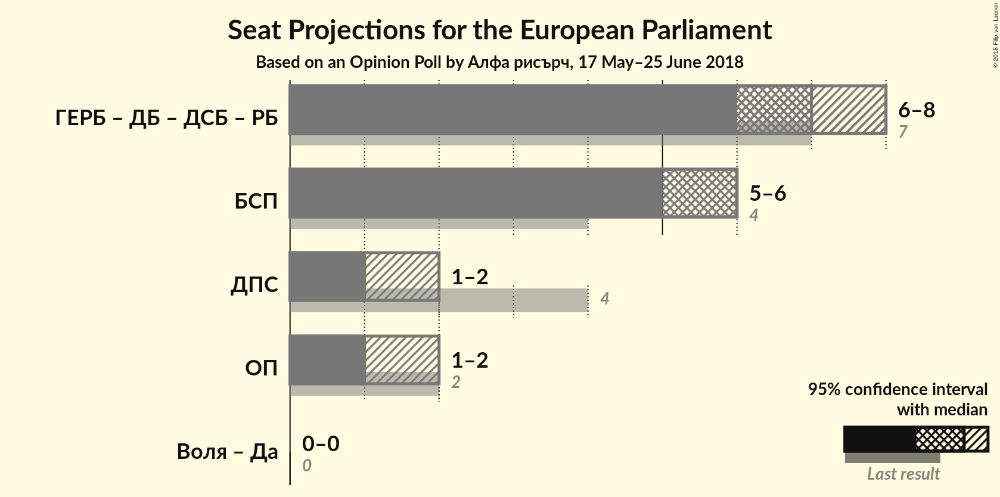

# Opinion Poll by Алфа рисърч, 17 May–25 June 2018

<a href="#voting-intentions">Voting Intentions</a> | <a href="#seats">Seats</a> | <a href="#coalitions">Coalitions</a> | <a href="#technical-information">Technical Information</a>

## Voting Intentions

### Confidence Intervals

| Party | Last Result | Poll Result | 80% Confidence Interval | 90% Confidence Interval | 95% Confidence Interval | 99% Confidence Interval |
|:-----:|:-----------:|:-----------:|:-----------------------:|:-----------------------:|:-----------------------:|:-----------------------:|
| Граждани за европейско развитие на България (EPP) | 30.4% | 37.4% | 35.1–39.9% |34.4–40.6% |33.8–41.2% |32.7–42.4% |
| Българска социалистическа партия (S&D) | 18.9% | 30.7% | 28.5–33.0% |27.8–33.7% |27.3–34.3% |26.2–35.4% |
| Обединени Патриоти (ECR) | 10.7% | 7.7% | 6.5–9.2% |6.2–9.6% |5.9–10.0% |5.4–10.7% |
| Движение за права и свободи (ALDE) | 17.3% | 7.5% | 6.4–9.0% |6.0–9.4% |5.7–9.8% |5.2–10.5% |
| Воля (*) | 0.0% | 3.3% | 2.6–4.4% |2.4–4.7% |2.2–5.0% |1.9–5.5% |
| Демократична България (EPP) | 0.0% | 3.3% | 2.6–4.4% |2.4–4.7% |2.2–5.0% |1.9–5.5% |

*Note:* The poll result column reflects the actual value used in the calculations. Published results may vary slightly, and in addition be rounded to fewer digits.

## Seats

### Confidence Intervals

| Party | Last Result | Median | 80% Confidence Interval | 90% Confidence Interval | 95% Confidence Interval | 99% Confidence Interval |
|:-----:|:-----------:|:------:|:-----------------------:|:-----------------------:|:-----------------------:|:-----------------------:|
| <a href="#граждани-за-европейско-развитие-на-българия-(epp)">Граждани за европейско развитие на България (EPP)</a> | 6 | 7 | 6–7 |6–7 |6–8 |6–8 |
| <a href="#българска-социалистическа-партия-(s&d)">Българска социалистическа партия (S&D)</a> | 4 | 6 | 5–6 |5–6 |5–6 |5–6 |
| <a href="#обединени-патриоти-(ecr)">Обединени Патриоти (ECR)</a> | 2 | 1 | 1–2 |1–2 |1–2 |1–2 |
| <a href="#движение-за-права-и-свободи-(alde)">Движение за права и свободи (ALDE)</a> | 4 | 1 | 1–2 |1–2 |1–2 |1–2 |
| <a href="#воля-(*)">Воля (*)</a> | 0 | 0 | 0 |0 |0 |0–1 |
| <a href="#демократична-българия-(epp)">Демократична България (EPP)</a> | 0 | 0 | 0 |0 |0 |0–1 |

### Граждани за европейско развитие на България (EPP)

*For a full overview of the results for this party, see the [Граждани за европейско развитие на България (EPP)](party-гражданизаевропейскоразвитиенабългарияepp.html) page.*

| Number of Seats | Probability | Accumulated | Special Marks |
|:---------------:|:-----------:|:-----------:|:-------------:|
| 6 | 20% | 100% | Last Result |
| 7 | 77% | 80% | Median |
| 8 | 3% | 3% |  |
| 9 | 0% | 0% | Majority |

### Българска социалистическа партия (S&D)

*For a full overview of the results for this party, see the [Българска социалистическа партия (S&D)](party-българскасоциалистическапартияsd.html) page.*

| Number of Seats | Probability | Accumulated | Special Marks |
|:---------------:|:-----------:|:-----------:|:-------------:|
| 4 | 0.1% | 100% | Last Result |
| 5 | 42% | 99.9% |  |
| 6 | 57% | 58% | Median |
| 7 | 0.4% | 0.4% |  |
| 8 | 0% | 0% |  |

### Обединени Патриоти (ECR)

*For a full overview of the results for this party, see the [Обединени Патриоти (ECR)](party-обединенипатриотиecr.html) page.*

| Number of Seats | Probability | Accumulated | Special Marks |
|:---------------:|:-----------:|:-----------:|:-------------:|
| 0 | 0.1% | 100% |  |
| 1 | 69% | 99.9% | Median |
| 2 | 31% | 31% | Last Result |
| 3 | 0% | 0% |  |

### Движение за права и свободи (ALDE)

*For a full overview of the results for this party, see the [Движение за права и свободи (ALDE)](party-движениезаправаисвободиalde.html) page.*

| Number of Seats | Probability | Accumulated | Special Marks |
|:---------------:|:-----------:|:-----------:|:-------------:|
| 0 | 0.2% | 100% |  |
| 1 | 71% | 99.8% | Median |
| 2 | 29% | 29% |  |
| 3 | 0% | 0% |  |
| 4 | 0% | 0% | Last Result |

### Воля (*)

*For a full overview of the results for this party, see the [Воля (*)](party-воля.html) page.*

| Number of Seats | Probability | Accumulated | Special Marks |
|:---------------:|:-----------:|:-----------:|:-------------:|
| 0 | 98.7% | 100% | Last Result, Median |
| 1 | 1.3% | 1.3% |  |
| 2 | 0% | 0% |  |

### Демократична България (EPP)

*For a full overview of the results for this party, see the [Демократична България (EPP)](party-демократичнабългарияepp.html) page.*

| Number of Seats | Probability | Accumulated | Special Marks |
|:---------------:|:-----------:|:-----------:|:-------------:|
| 0 | 98% | 100% | Last Result, Median |
| 1 | 2% | 2% |  |
| 2 | 0% | 0% |  |

## Coalitions

### Confidence Intervals

| Coalition | Last Result | Median | Majority? | 80% Confidence Interval | 90% Confidence Interval | 95% Confidence Interval | 99% Confidence Interval |
|:---------:|:-----------:|:------:|:---------:|:-----------------------:|:-----------------------:|:-----------------------:|:-----------------------:|
| Българска социалистическа партия (S&D) | 4 | 6 | 0% | 5–6 | 5–6 | 5–6 | 5–6 |
| Движение за права и свободи (ALDE) | 4 | 1 | 0% | 1–2 | 1–2 | 1–2 | 1–2 |
| Обединени Патриоти (ECR) | 2 | 1 | 0% | 1–2 | 1–2 | 1–2 | 1–2 |

### Българска социалистическа партия (S&D)

| Number of Seats | Probability | Accumulated | Special Marks |
|:---------------:|:-----------:|:-----------:|:-------------:|
| 4 | 0.1% | 100% | Last Result |
| 5 | 42% | 99.9% |  |
| 6 | 57% | 58% | Median |
| 7 | 0.4% | 0.4% |  |
| 8 | 0% | 0% |  |

### Движение за права и свободи (ALDE)

| Number of Seats | Probability | Accumulated | Special Marks |
|:---------------:|:-----------:|:-----------:|:-------------:|
| 0 | 0.2% | 100% |  |
| 1 | 71% | 99.8% | Median |
| 2 | 29% | 29% |  |
| 3 | 0% | 0% |  |
| 4 | 0% | 0% | Last Result |

### Обединени Патриоти (ECR)

| Number of Seats | Probability | Accumulated | Special Marks |
|:---------------:|:-----------:|:-----------:|:-------------:|
| 0 | 0.1% | 100% |  |
| 1 | 69% | 99.9% | Median |
| 2 | 31% | 31% | Last Result |
| 3 | 0% | 0% |  |

## Technical Information

### Opinion Poll

+ **Polling firm:** Алфа рисърч
+ **Commissioner(s):** —
+ **Fieldwork period:** 17 May–25 June 2018

### Calculations

+ **Sample size:** 665
+ **Simulations done:** 1,048,576
+ **Error estimate:** 1.31%

