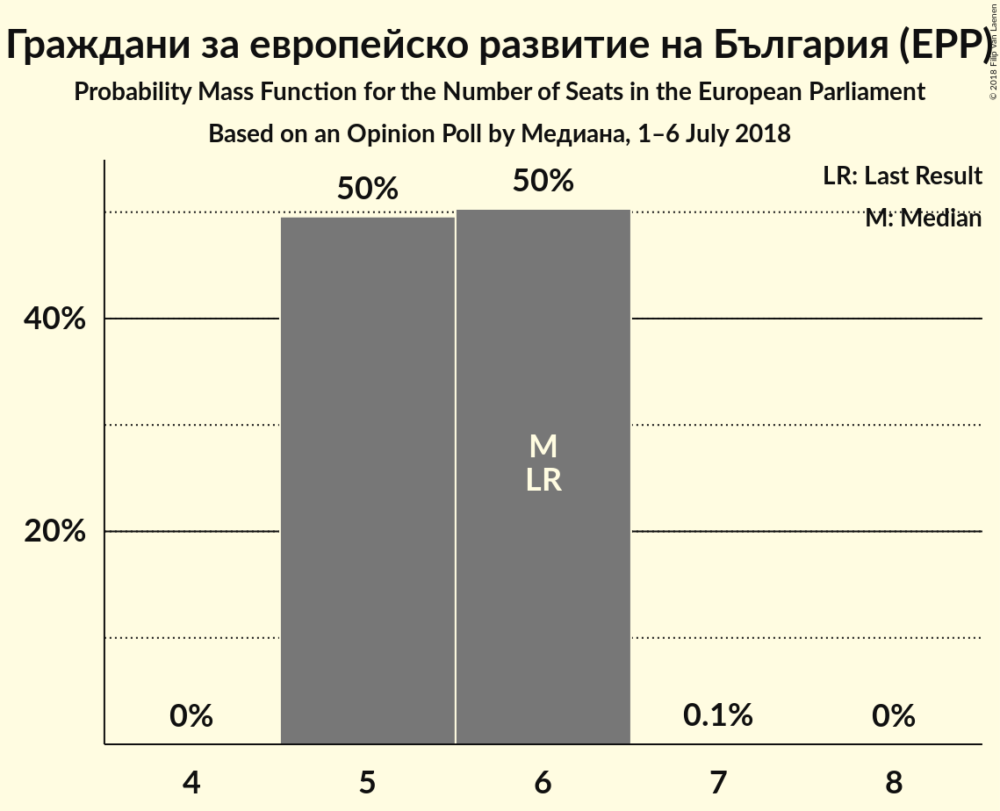
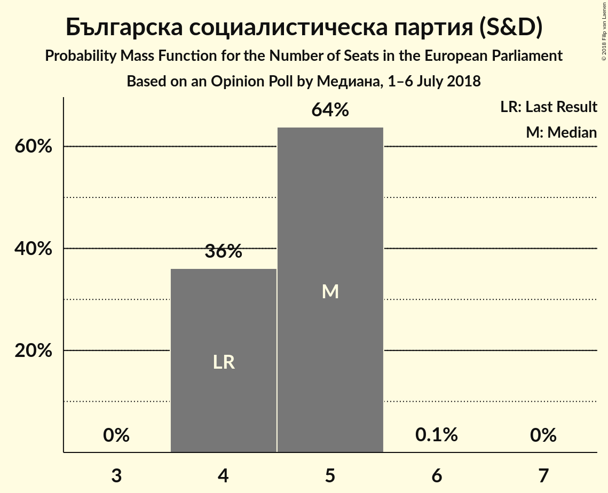
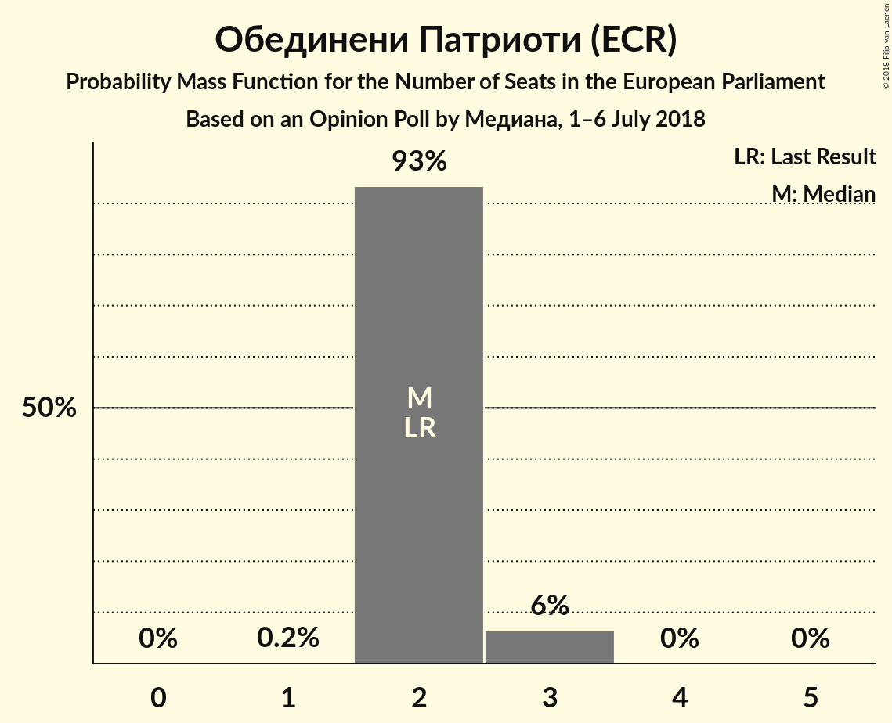
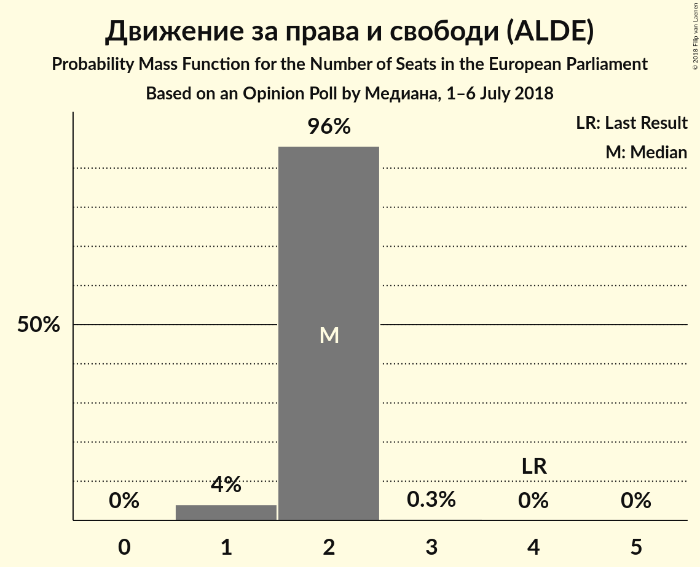
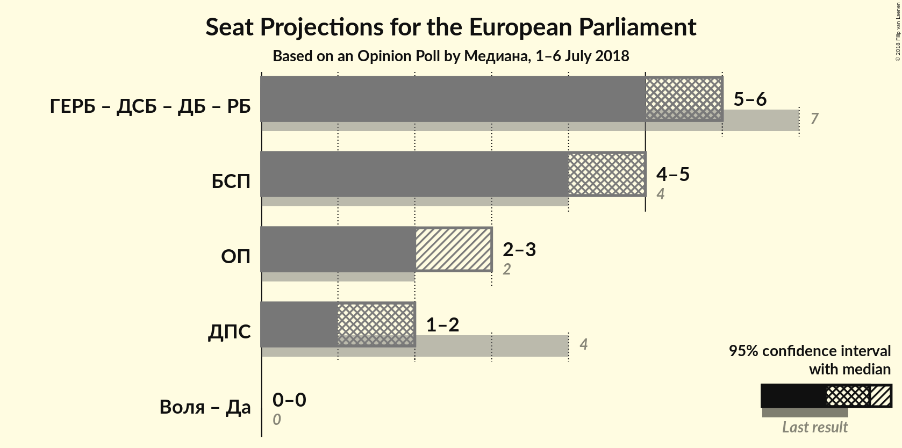

# Opinion Poll by Медиана, 1–6 July 2018

<a href="#voting-intentions">Voting Intentions</a> | <a href="#seats">Seats</a> | <a href="#coalitions">Coalitions</a> | <a href="#technical-information">Technical Information</a>

## Voting Intentions

### Confidence Intervals

| Party | Last Result | Poll Result | 80% Confidence Interval | 90% Confidence Interval | 95% Confidence Interval | 99% Confidence Interval |
|:-----:|:-----------:|:-----------:|:-----------------------:|:-----------------------:|:-----------------------:|:-----------------------:|
| Граждани за европейско развитие на България (EPP) | 30.4% | 31.9% | 29.8–34.1% |29.3–34.8% |28.7–35.3% |27.8–36.4% |
| Българска социалистическа партия (S&D) | 18.9% | 26.4% | 24.5–28.5% |23.9–29.1% |23.5–29.6% |22.6–30.7% |
| Обединени Патриоти (ECR) | 10.7% | 12.5% | 11.1–14.2% |10.7–14.6% |10.4–15.0% |9.7–15.8% |
| Движение за права и свободи (ALDE) | 17.3% | 10.7% | 9.4–12.3% |9.1–12.7% |8.7–13.1% |8.2–13.9% |
| Воля (*) | 0.0% | 2.7% | 2.1–3.6% |1.9–3.8% |1.8–4.1% |1.5–4.5% |

*Note:* The poll result column reflects the actual value used in the calculations. Published results may vary slightly, and in addition be rounded to fewer digits.

## Seats

### Confidence Intervals

| Party | Last Result | Median | 80% Confidence Interval | 90% Confidence Interval | 95% Confidence Interval | 99% Confidence Interval |
|:-----:|:-----------:|:------:|:-----------------------:|:-----------------------:|:-----------------------:|:-----------------------:|
| <a href="#граждани-за-европейско-развитие-на-българия-(epp)">Граждани за европейско развитие на България (EPP)</a> | 6 | 6 | 5–6 |5–6 |5–6 |5–6 |
| <a href="#българска-социалистическа-партия-(s&d)">Българска социалистическа партия (S&D)</a> | 4 | 5 | 4–5 |4–5 |4–5 |4–5 |
| <a href="#обединени-патриоти-(ecr)">Обединени Патриоти (ECR)</a> | 2 | 2 | 2 |2–3 |2–3 |2–3 |
| <a href="#движение-за-права-и-свободи-(alde)">Движение за права и свободи (ALDE)</a> | 4 | 2 | 2 |2 |1–2 |1–2 |
| <a href="#воля-(*)">Воля (*)</a> | 0 | 0 | 0 |0 |0 |0 |

### Граждани за европейско развитие на България (EPP)

*For a full overview of the results for this party, see the [Граждани за европейско развитие на България (EPP)](party-гражданизаевропейскоразвитиенабългарияepp.html) page.*

| Number of Seats | Probability | Accumulated | Special Marks |
|:---------------:|:-----------:|:-----------:|:-------------:|
| 5 | 50% | 100% |  |
| 6 | 50% | 50% | Last Result, Median |
| 7 | 0.1% | 0.1% |  |
| 8 | 0% | 0% |  |

### Българска социалистическа партия (S&D)

*For a full overview of the results for this party, see the [Българска социалистическа партия (S&D)](party-българскасоциалистическапартияsd.html) page.*

| Number of Seats | Probability | Accumulated | Special Marks |
|:---------------:|:-----------:|:-----------:|:-------------:|
| 4 | 36% | 100% | Last Result |
| 5 | 64% | 64% | Median |
| 6 | 0.1% | 0.1% |  |
| 7 | 0% | 0% |  |

### Обединени Патриоти (ECR)

*For a full overview of the results for this party, see the [Обединени Патриоти (ECR)](party-обединенипатриотиecr.html) page.*

| Number of Seats | Probability | Accumulated | Special Marks |
|:---------------:|:-----------:|:-----------:|:-------------:|
| 1 | 0.2% | 100% |  |
| 2 | 93% | 99.8% | Last Result, Median |
| 3 | 6% | 6% |  |
| 4 | 0% | 0% |  |

### Движение за права и свободи (ALDE)

*For a full overview of the results for this party, see the [Движение за права и свободи (ALDE)](party-движениезаправаисвободиalde.html) page.*

| Number of Seats | Probability | Accumulated | Special Marks |
|:---------------:|:-----------:|:-----------:|:-------------:|
| 1 | 4% | 100% |  |
| 2 | 96% | 96% | Median |
| 3 | 0.3% | 0.3% |  |
| 4 | 0% | 0% | Last Result |

### Воля (*)

*For a full overview of the results for this party, see the [Воля (*)](party-воля.html) page.*

| Number of Seats | Probability | Accumulated | Special Marks |
|:---------------:|:-----------:|:-----------:|:-------------:|
| 0 | 99.9% | 100% | Last Result, Median |
| 1 | 0.1% | 0.1% |  |
| 2 | 0% | 0% |  |

## Coalitions

### Confidence Intervals

| Coalition | Last Result | Median | Majority? | 80% Confidence Interval | 90% Confidence Interval | 95% Confidence Interval | 99% Confidence Interval |
|:---------:|:-----------:|:------:|:---------:|:-----------------------:|:-----------------------:|:-----------------------:|:-----------------------:|
| Българска социалистическа партия (S&D) | 4 | 5 | 0% | 4–5 | 4–5 | 4–5 | 4–5 |
| Обединени Патриоти (ECR) | 2 | 2 | 0% | 2 | 2–3 | 2–3 | 2–3 |
| Движение за права и свободи (ALDE) | 4 | 2 | 0% | 2 | 2 | 1–2 | 1–2 |

### Българска социалистическа партия (S&D)

| Number of Seats | Probability | Accumulated | Special Marks |
|:---------------:|:-----------:|:-----------:|:-------------:|
| 4 | 36% | 100% | Last Result |
| 5 | 64% | 64% | Median |
| 6 | 0.1% | 0.1% |  |
| 7 | 0% | 0% |  |

### Обединени Патриоти (ECR)

| Number of Seats | Probability | Accumulated | Special Marks |
|:---------------:|:-----------:|:-----------:|:-------------:|
| 1 | 0.2% | 100% |  |
| 2 | 93% | 99.8% | Last Result, Median |
| 3 | 6% | 6% |  |
| 4 | 0% | 0% |  |

### Движение за права и свободи (ALDE)

| Number of Seats | Probability | Accumulated | Special Marks |
|:---------------:|:-----------:|:-----------:|:-------------:|
| 1 | 4% | 100% |  |
| 2 | 96% | 96% | Median |
| 3 | 0.3% | 0.3% |  |
| 4 | 0% | 0% | Last Result |

## Technical Information

### Opinion Poll

+ **Polling firm:** Медиана
+ **Commissioner(s):** —
+ **Fieldwork period:** 1–6 July 2018

### Calculations

+ **Sample size:** 783
+ **Simulations done:** 1,048,576
+ **Error estimate:** 0.98%

