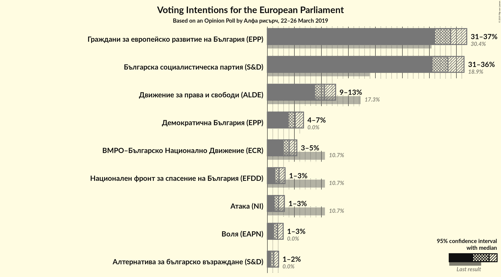
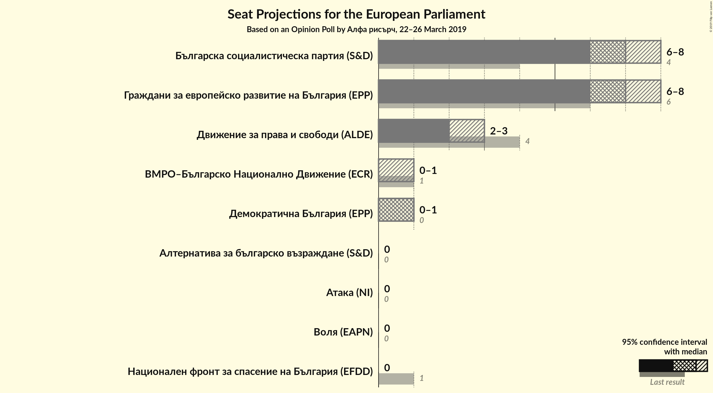
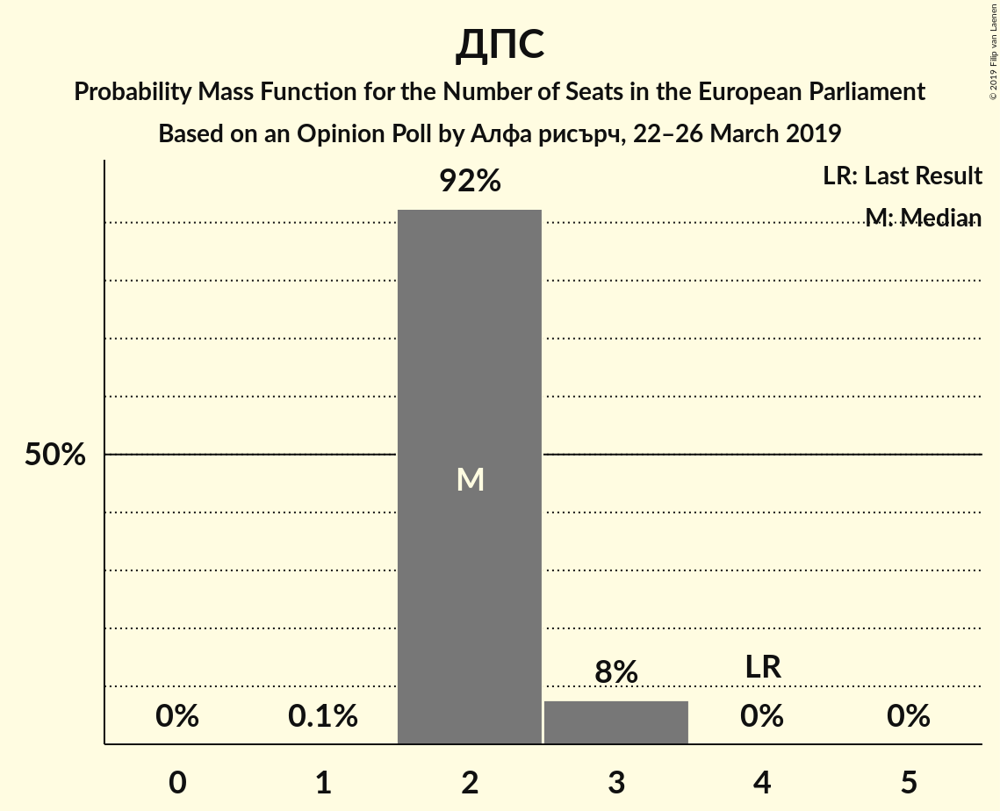

# Opinion Poll by Алфа рисърч, 22–26 March 2019

<a href="#voting-intentions">Voting Intentions</a> | <a href="#seats">Seats</a> | <a href="#coalitions">Coalitions</a> | <a href="#technical-information">Technical Information</a>

## Voting Intentions

### Confidence Intervals

| Party | Last Result | Poll Result | 80% Confidence Interval | 90% Confidence Interval | 95% Confidence Interval | 99% Confidence Interval |
|:-----:|:-----------:|:-----------:|:-----------------------:|:-----------------------:|:-----------------------:|:-----------------------:|
| Граждани за европейско развитие на България (EPP) | 30.4% | 33.9% | 32.1–35.9% |31.5–36.4% |31.1–36.9% |30.2–37.8% |
| Българска социалистическа партия (S&D) | 18.9% | 33.4% | 31.6–35.4% |31.0–35.9% |30.6–36.4% |29.7–37.3% |
| Движение за права и свободи (ALDE) | 17.3% | 10.6% | 9.4–11.9% |9.1–12.3% |8.8–12.6% |8.3–13.3% |
| Демократична България (EPP) | 0.0% | 5.1% | 4.3–6.2% |4.1–6.4% |3.9–6.7% |3.6–7.2% |
| ВМРО–Българско Национално Движение (ECR) | 10.7% | 4.1% | 3.4–5.0% |3.2–5.2% |3.0–5.5% |2.7–5.9% |
| Национален фронт за спасение на България (EFDD) | 10.7% | 2.2% | 1.7–2.9% |1.6–3.1% |1.4–3.3% |1.2–3.7% |
| Атака (NI) | 10.7% | 2.1% | 1.6–2.8% |1.5–3.0% |1.4–3.2% |1.2–3.5% |
| Воля (EAPN) | 0.0% | 1.9% | 1.4–2.6% |1.3–2.7% |1.2–2.9% |1.0–3.3% |
| Алтернатива за българско възраждане (S&D) | 0.0% | 1.2% | 0.9–1.8% |0.7–1.9% |0.7–2.1% |0.5–2.4% |

*Note:* The poll result column reflects the actual value used in the calculations. Published results may vary slightly, and in addition be rounded to fewer digits.

## Seats

### Confidence Intervals

| Party | Last Result | Median | 80% Confidence Interval | 90% Confidence Interval | 95% Confidence Interval | 99% Confidence Interval |
|:-----:|:-----------:|:------:|:-----------------------:|:-----------------------:|:-----------------------:|:-----------------------:|
| <a href="#граждани-за-европейско-развитие-на-българия-(epp)">Граждани за европейско развитие на България (EPP)</a> | 6 | 7 | 6–7 |6–8 |6–8 |6–8 |
| <a href="#българска-социалистическа-партия-(s&d)">Българска социалистическа партия (S&D)</a> | 4 | 7 | 6–7 |6–7 |6–8 |6–8 |
| <a href="#движение-за-права-и-свободи-(alde)">Движение за права и свободи (ALDE)</a> | 4 | 2 | 2 |2–3 |2–3 |2–3 |
| <a href="#демократична-българия-(epp)">Демократична България (EPP)</a> | 0 | 1 | 0–1 |0–1 |0–1 |0–2 |
| <a href="#вмро–българско-национално-движение-(ecr)">ВМРО–Българско Национално Движение (ECR)</a> | 1 | 0 | 0 |0–1 |0–1 |0–1 |
| <a href="#национален-фронт-за-спасение-на-българия-(efdd)">Национален фронт за спасение на България (EFDD)</a> | 1 | 0 | 0 |0 |0 |0 |
| <a href="#атака-(ni)">Атака (NI)</a> | 0 | 0 | 0 |0 |0 |0 |
| <a href="#воля-(eapn)">Воля (EAPN)</a> | 0 | 0 | 0 |0 |0 |0 |
| <a href="#алтернатива-за-българско-възраждане-(s&d)">Алтернатива за българско възраждане (S&D)</a> | 0 | 0 | 0 |0 |0 |0 |

### Граждани за европейско развитие на България (EPP)

*For a full overview of the results for this party, see the [Граждани за европейско развитие на България (EPP)](party-гражданизаевропейскоразвитиенабългарияepp.html) page.*

| Number of Seats | Probability | Accumulated | Special Marks |
|:---------------:|:-----------:|:-----------:|:-------------:|
| 6 | 27% | 100% | Last Result |
| 7 | 68% | 73% | Median |
| 8 | 5% | 5% |  |
| 9 | 0% | 0% | Majority |

### Българска социалистическа партия (S&D)

*For a full overview of the results for this party, see the [Българска социалистическа партия (S&D)](party-българскасоциалистическапартияsd.html) page.*

| Number of Seats | Probability | Accumulated | Special Marks |
|:---------------:|:-----------:|:-----------:|:-------------:|
| 4 | 0% | 100% | Last Result |
| 5 | 0% | 100% |  |
| 6 | 29% | 100% |  |
| 7 | 67% | 71% | Median |
| 8 | 4% | 4% |  |
| 9 | 0% | 0% | Majority |

### Движение за права и свободи (ALDE)

*For a full overview of the results for this party, see the [Движение за права и свободи (ALDE)](party-движениезаправаисвободиalde.html) page.*

| Number of Seats | Probability | Accumulated | Special Marks |
|:---------------:|:-----------:|:-----------:|:-------------:|
| 1 | 0.1% | 100% |  |
| 2 | 92% | 99.9% | Median |
| 3 | 8% | 8% |  |
| 4 | 0% | 0% | Last Result |

### Демократична България (EPP)

*For a full overview of the results for this party, see the [Демократична България (EPP)](party-демократичнабългарияepp.html) page.*

| Number of Seats | Probability | Accumulated | Special Marks |
|:---------------:|:-----------:|:-----------:|:-------------:|
| 0 | 41% | 100% | Last Result |
| 1 | 59% | 59% | Median |
| 2 | 0.5% | 0.5% |  |
| 3 | 0% | 0% |  |

### ВМРО–Българско Национално Движение (ECR)

*For a full overview of the results for this party, see the [ВМРО–Българско Национално Движение (ECR)](party-вмро–българсконационалнодвижениеecr.html) page.*

| Number of Seats | Probability | Accumulated | Special Marks |
|:---------------:|:-----------:|:-----------:|:-------------:|
| 0 | 93% | 100% | Median |
| 1 | 7% | 7% | Last Result |
| 2 | 0% | 0% |  |

### Национален фронт за спасение на България (EFDD)

*For a full overview of the results for this party, see the [Национален фронт за спасение на България (EFDD)](party-националенфронтзаспасениенабългарияefdd.html) page.*

| Number of Seats | Probability | Accumulated | Special Marks |
|:---------------:|:-----------:|:-----------:|:-------------:|
| 0 | 100% | 100% | Median |
| 1 | 0% | 0% | Last Result |

### Атака (NI)

*For a full overview of the results for this party, see the [Атака (NI)](party-атакаni.html) page.*

| Number of Seats | Probability | Accumulated | Special Marks |
|:---------------:|:-----------:|:-----------:|:-------------:|
| 0 | 100% | 100% | Last Result, Median |

### Воля (EAPN)

*For a full overview of the results for this party, see the [Воля (EAPN)](party-воляeapn.html) page.*

| Number of Seats | Probability | Accumulated | Special Marks |
|:---------------:|:-----------:|:-----------:|:-------------:|
| 0 | 100% | 100% | Last Result, Median |

### Алтернатива за българско възраждане (S&D)

*For a full overview of the results for this party, see the [Алтернатива за българско възраждане (S&D)](party-алтернативазабългарсковъзражданеsd.html) page.*

| Number of Seats | Probability | Accumulated | Special Marks |
|:---------------:|:-----------:|:-----------:|:-------------:|
| 0 | 100% | 100% | Last Result, Median |

## Coalitions

### Confidence Intervals

| Coalition | Last Result | Median | Majority? | 80% Confidence Interval | 90% Confidence Interval | 95% Confidence Interval | 99% Confidence Interval |
|:---------:|:-----------:|:------:|:---------:|:-----------------------:|:-----------------------:|:-----------------------:|:-----------------------:|
| Българска социалистическа партия (S&D) – Алтернатива за българско възраждане (S&D) | 4 | 7 | 0% | 6–7 | 6–7 | 6–8 | 6–8 |
| Движение за права и свободи (ALDE) | 4 | 2 | 0% | 2 | 2–3 | 2–3 | 2–3 |
| Атака (NI) | 0 | 0 | 0% | 0 | 0 | 0 | 0 |
| Воля (EAPN) | 0 | 0 | 0% | 0 | 0 | 0 | 0 |
| Национален фронт за спасение на България (EFDD) | 1 | 0 | 0% | 0 | 0 | 0 | 0 |

### Българска социалистическа партия (S&D) – Алтернатива за българско възраждане (S&D)

| Number of Seats | Probability | Accumulated | Special Marks |
|:---------------:|:-----------:|:-----------:|:-------------:|
| 4 | 0% | 100% | Last Result |
| 5 | 0% | 100% |  |
| 6 | 29% | 100% |  |
| 7 | 67% | 71% | Median |
| 8 | 4% | 4% |  |
| 9 | 0% | 0% | Majority |

### Движение за права и свободи (ALDE)

| Number of Seats | Probability | Accumulated | Special Marks |
|:---------------:|:-----------:|:-----------:|:-------------:|
| 1 | 0.1% | 100% |  |
| 2 | 92% | 99.9% | Median |
| 3 | 8% | 8% |  |
| 4 | 0% | 0% | Last Result |

### Атака (NI)

| Number of Seats | Probability | Accumulated | Special Marks |
|:---------------:|:-----------:|:-----------:|:-------------:|
| 0 | 100% | 100% | Last Result, Median |

### Воля (EAPN)

| Number of Seats | Probability | Accumulated | Special Marks |
|:---------------:|:-----------:|:-----------:|:-------------:|
| 0 | 100% | 100% | Last Result, Median |

### Национален фронт за спасение на България (EFDD)

| Number of Seats | Probability | Accumulated | Special Marks |
|:---------------:|:-----------:|:-----------:|:-------------:|
| 0 | 100% | 100% | Median |
| 1 | 0% | 0% | Last Result |

## Technical Information

### Opinion Poll

+ **Polling firm:** Алфа рисърч
+ **Commissioner(s):** —
+ **Fieldwork period:** 22–26 March 2019

### Calculations

+ **Sample size:** 1011
+ **Simulations done:** 1,048,576
+ **Error estimate:** 0.61%

