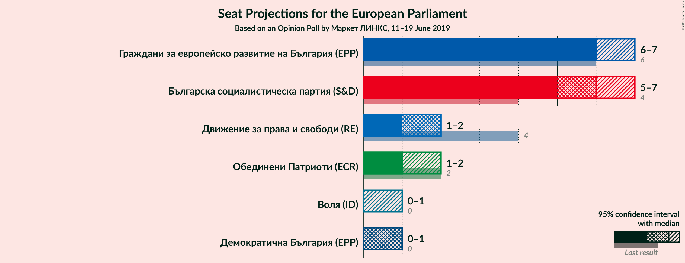
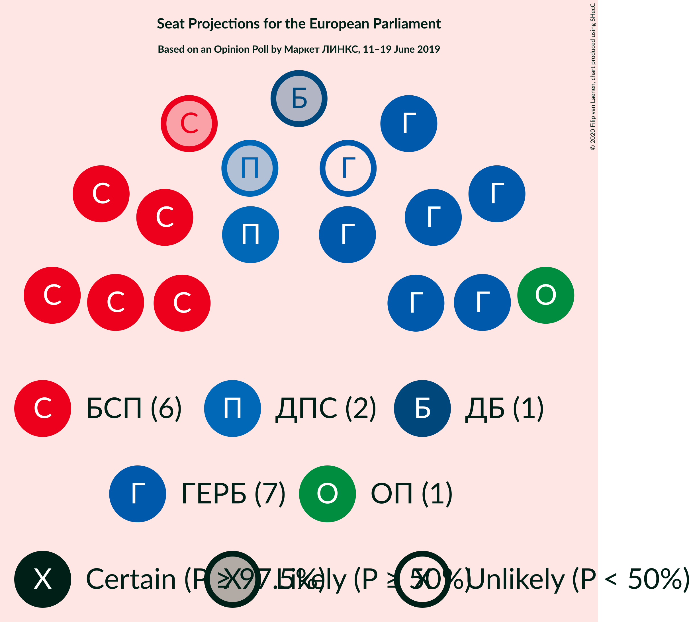
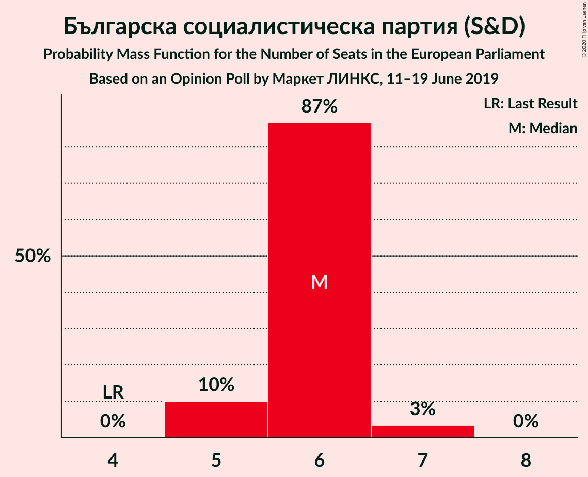
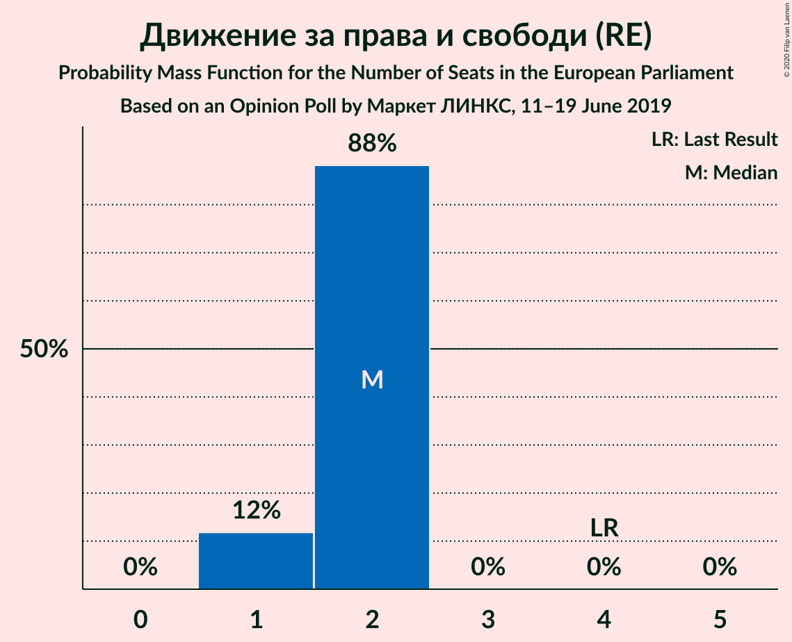
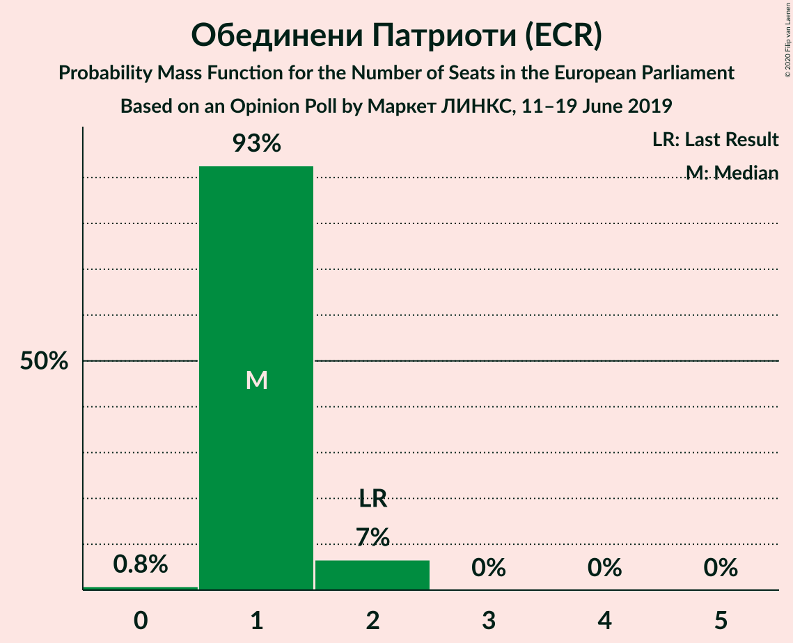
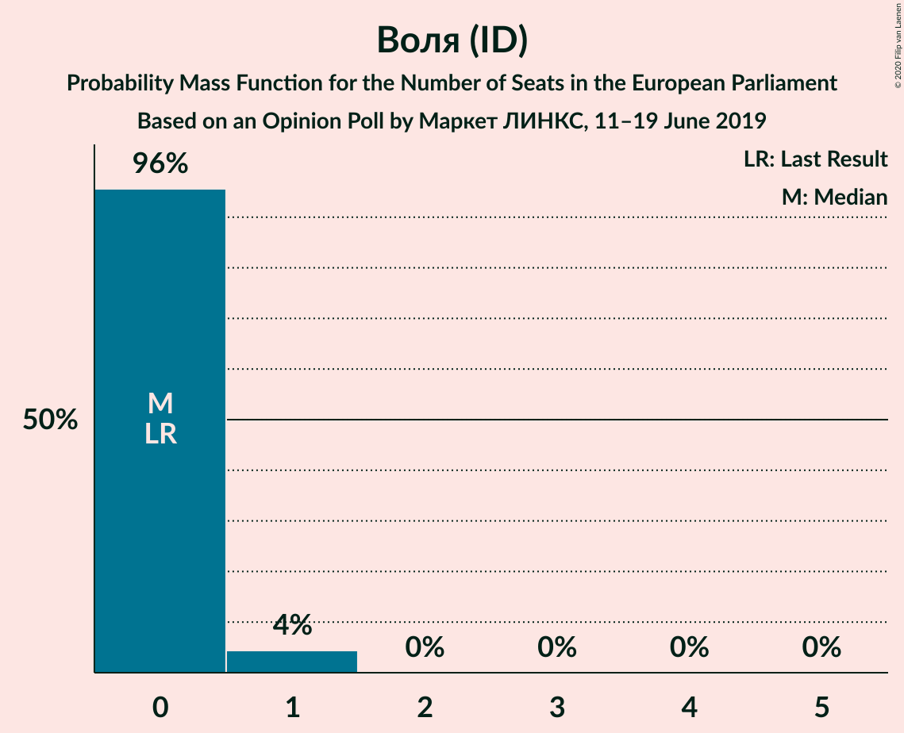
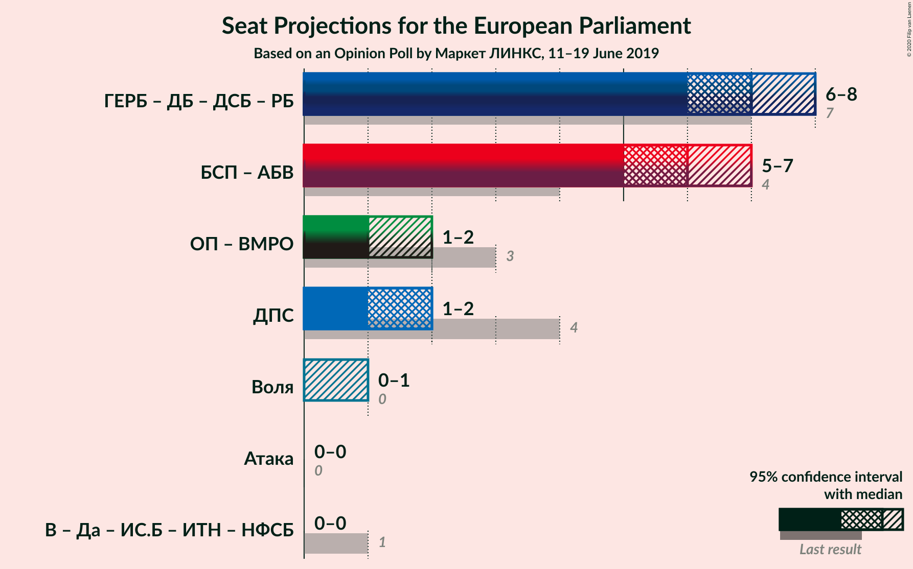
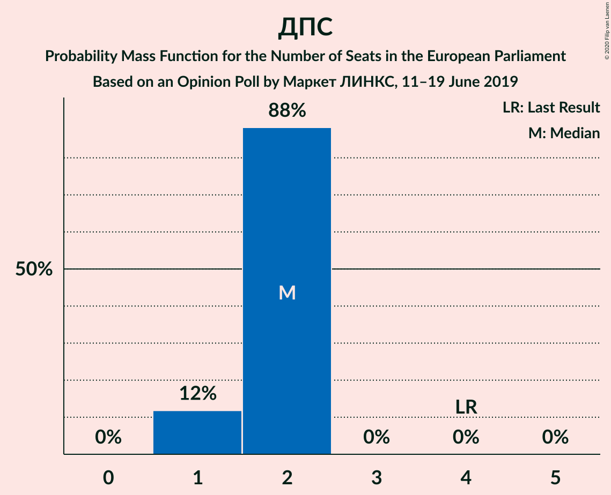
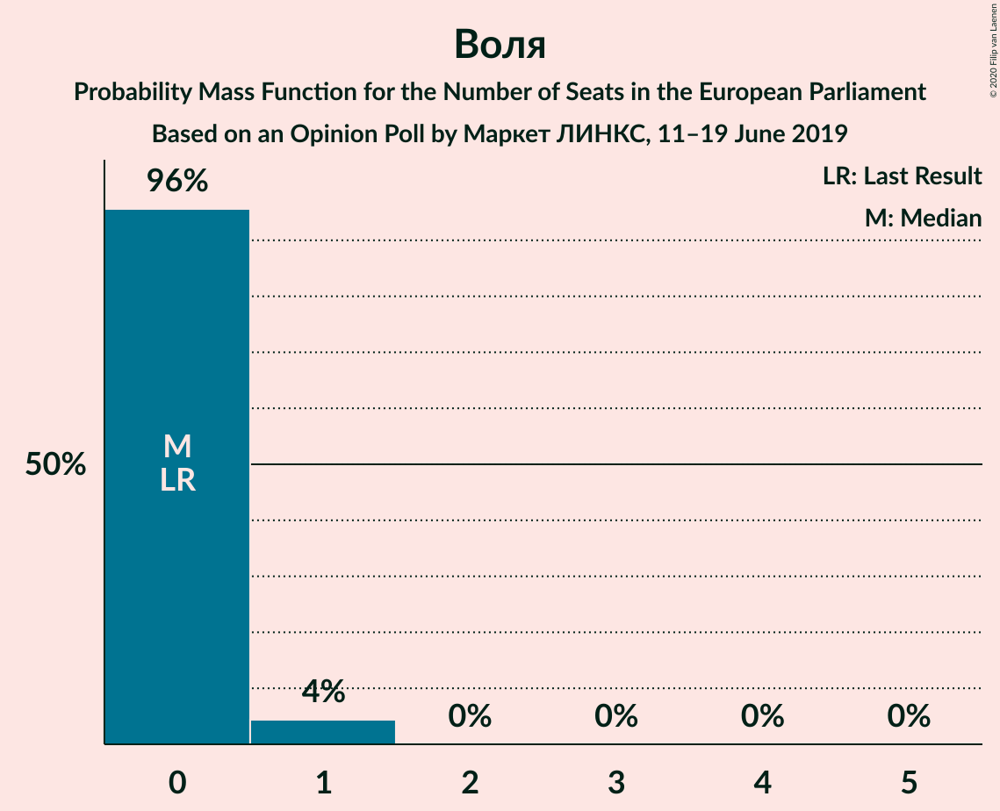

# Opinion Poll by Маркет ЛИНКС, 11–19 June 2019

<a href="#voting-intentions">Voting Intentions</a> | <a href="#seats">Seats</a> | <a href="#coalitions">Coalitions</a> | <a href="#technical-information">Technical Information</a>

## Voting Intentions

### Confidence Intervals

| Party | Last Result | Poll Result | 80% Confidence Interval | 90% Confidence Interval | 95% Confidence Interval | 99% Confidence Interval |
|:-----:|:-----------:|:-----------:|:-----------------------:|:-----------------------:|:-----------------------:|:-----------------------:|
| Граждани за европейско развитие на България (EPP) | 30.4% | 34.9% | 32.8–37.0% |32.3–37.6% |31.8–38.1% |30.8–39.1% |
| Българска социалистическа партия (S&D) | 18.9% | 33.0% | 31.0–35.1% |30.5–35.7% |30.0–36.2% |29.1–37.2% |
| Движение за права и свободи (RE) | 17.3% | 9.1% | 8.0–10.5% |7.7–10.9% |7.4–11.2% |6.9–11.9% |
| Обединени Патриоти (ECR) | 10.7% | 6.8% | 5.9–8.0% |5.6–8.4% |5.3–8.7% |4.9–9.3% |
| Демократична България (EPP) | 0.0% | 6.0% | 5.1–7.2% |4.9–7.5% |4.6–7.8% |4.2–8.4% |
| Воля (ID) | 0.0% | 3.8% | 3.0–4.7% |2.9–5.0% |2.7–5.2% |2.4–5.7% |

*Note:* The poll result column reflects the actual value used in the calculations. Published results may vary slightly, and in addition be rounded to fewer digits.

## Seats

### Confidence Intervals

| Party | Last Result | Median | 80% Confidence Interval | 90% Confidence Interval | 95% Confidence Interval | 99% Confidence Interval |
|:-----:|:-----------:|:------:|:-----------------------:|:-----------------------:|:-----------------------:|:-----------------------:|
| <a href="#граждани-за-европейско-развитие-на-българия-(epp)">Граждани за европейско развитие на България (EPP)</a> | 6 | 6 | 6–7 |6–7 |6–7 |5–7 |
| <a href="#българска-социалистическа-партия-(s&d)">Българска социалистическа партия (S&D)</a> | 4 | 6 | 5–6 |5–6 |5–7 |5–7 |
| <a href="#движение-за-права-и-свободи-(re)">Движение за права и свободи (RE)</a> | 4 | 2 | 1–2 |1–2 |1–2 |1–2 |
| <a href="#обединени-патриоти-(ecr)">Обединени Патриоти (ECR)</a> | 2 | 1 | 1 |1–2 |1–2 |0–2 |
| <a href="#демократична-българия-(epp)">Демократична България (EPP)</a> | 0 | 1 | 1 |0–1 |0–1 |0–2 |
| <a href="#воля-(id)">Воля (ID)</a> | 0 | 0 | 0 |0 |0–1 |0–1 |

### Граждани за европейско развитие на България (EPP)

*For a full overview of the results for this party, see the [Граждани за европейско развитие на България (EPP)](party-гражданизаевропейскоразвитиенабългарияepp.html) page.*

| Number of Seats | Probability | Accumulated | Special Marks |
|:---------------:|:-----------:|:-----------:|:-------------:|
| 5 | 1.1% | 100% |  |
| 6 | 82% | 98.9% | Last Result, Median |
| 7 | 17% | 17% |  |
| 8 | 0% | 0% |  |

### Българска социалистическа партия (S&D)

*For a full overview of the results for this party, see the [Българска социалистическа партия (S&D)](party-българскасоциалистическапартияsd.html) page.*

| Number of Seats | Probability | Accumulated | Special Marks |
|:---------------:|:-----------:|:-----------:|:-------------:|
| 4 | 0% | 100% | Last Result |
| 5 | 10% | 100% |  |
| 6 | 87% | 90% | Median |
| 7 | 3% | 3% |  |
| 8 | 0% | 0% |  |

### Движение за права и свободи (RE)

*For a full overview of the results for this party, see the [Движение за права и свободи (RE)](party-движениезаправаисвободиre.html) page.*

| Number of Seats | Probability | Accumulated | Special Marks |
|:---------------:|:-----------:|:-----------:|:-------------:|
| 1 | 12% | 100% |  |
| 2 | 88% | 88% | Median |
| 3 | 0% | 0% |  |
| 4 | 0% | 0% | Last Result |

### Обединени Патриоти (ECR)

*For a full overview of the results for this party, see the [Обединени Патриоти (ECR)](party-обединенипатриотиecr.html) page.*

| Number of Seats | Probability | Accumulated | Special Marks |
|:---------------:|:-----------:|:-----------:|:-------------:|
| 0 | 0.8% | 100% |  |
| 1 | 93% | 99.2% | Median |
| 2 | 7% | 7% | Last Result |
| 3 | 0% | 0% |  |

### Демократична България (EPP)

*For a full overview of the results for this party, see the [Демократична България (EPP)](party-демократичнабългарияepp.html) page.*

| Number of Seats | Probability | Accumulated | Special Marks |
|:---------------:|:-----------:|:-----------:|:-------------:|
| 0 | 8% | 100% | Last Result |
| 1 | 91% | 92% | Median |
| 2 | 1.0% | 1.0% |  |
| 3 | 0% | 0% |  |

### Воля (ID)

*For a full overview of the results for this party, see the [Воля (ID)](party-воляid.html) page.*

| Number of Seats | Probability | Accumulated | Special Marks |
|:---------------:|:-----------:|:-----------:|:-------------:|
| 0 | 96% | 100% | Last Result, Median |
| 1 | 4% | 4% |  |
| 2 | 0% | 0% |  |

## Coalitions

### Confidence Intervals

| Coalition | Last Result | Median | Majority? | 80% Confidence Interval | 90% Confidence Interval | 95% Confidence Interval | 99% Confidence Interval |
|:---------:|:-----------:|:------:|:---------:|:-----------------------:|:-----------------------:|:-----------------------:|:-----------------------:|
| Движение за права и свободи (RE) | 4 | 2 | 0% | 1–2 | 1–2 | 1–2 | 1–2 |
| Воля (ID) | 0 | 0 | 0% | 0 | 0 | 0–1 | 0–1 |

### Движение за права и свободи (RE)

| Number of Seats | Probability | Accumulated | Special Marks |
|:---------------:|:-----------:|:-----------:|:-------------:|
| 1 | 12% | 100% |  |
| 2 | 88% | 88% | Median |
| 3 | 0% | 0% |  |
| 4 | 0% | 0% | Last Result |

### Воля (ID)

| Number of Seats | Probability | Accumulated | Special Marks |
|:---------------:|:-----------:|:-----------:|:-------------:|
| 0 | 96% | 100% | Last Result, Median |
| 1 | 4% | 4% |  |
| 2 | 0% | 0% |  |

## Technical Information

### Opinion Poll

+ **Polling firm:** Маркет ЛИНКС
+ **Commissioner(s):** —
+ **Fieldwork period:** 11–19 June 2019

### Calculations

+ **Sample size:** 878
+ **Simulations done:** 1,048,576
+ **Error estimate:** 0.35%

