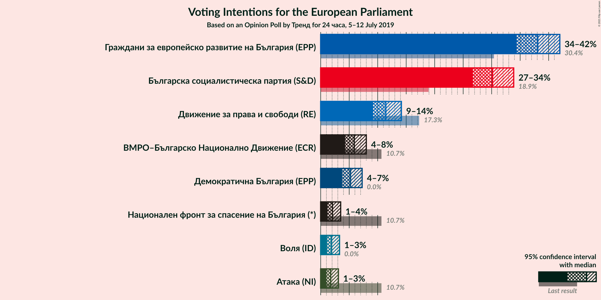
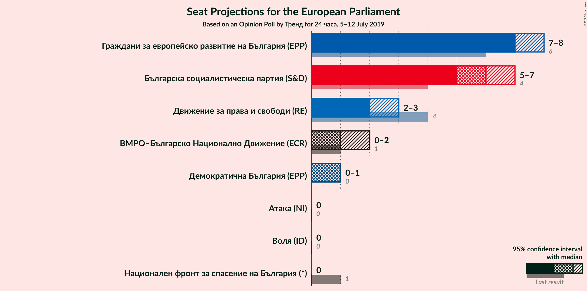
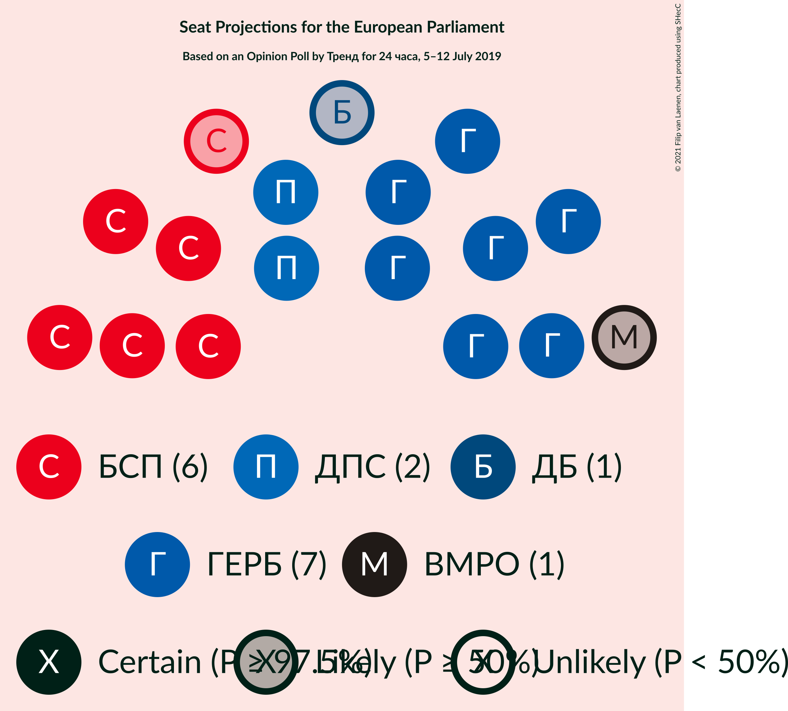
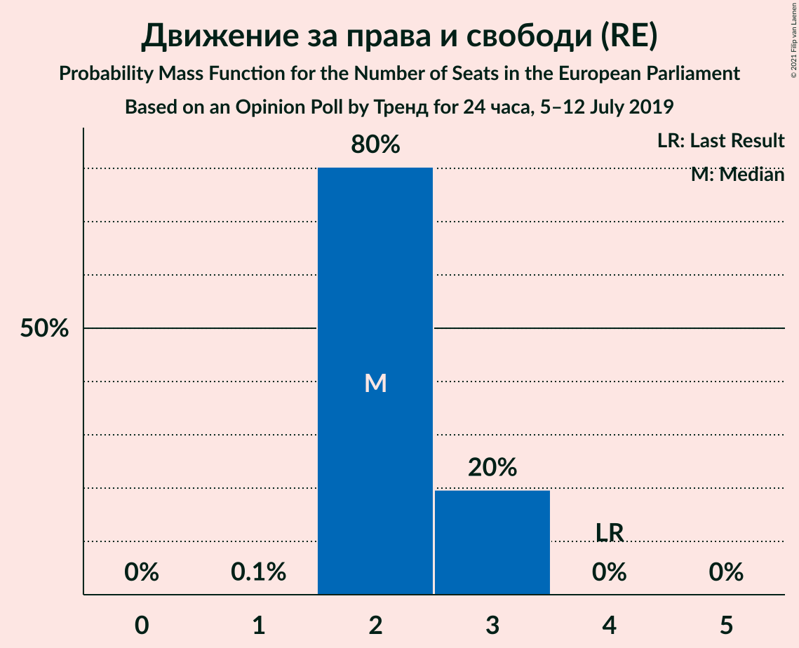
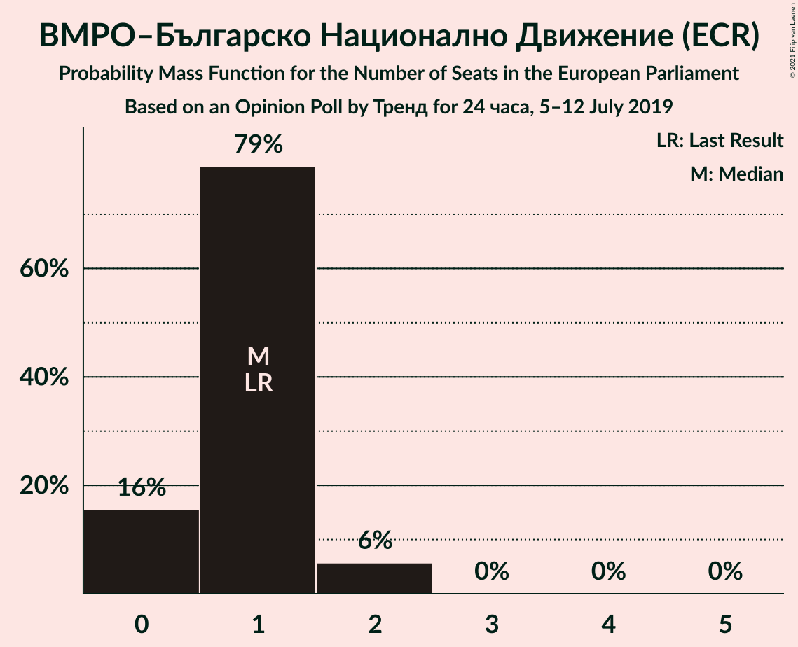
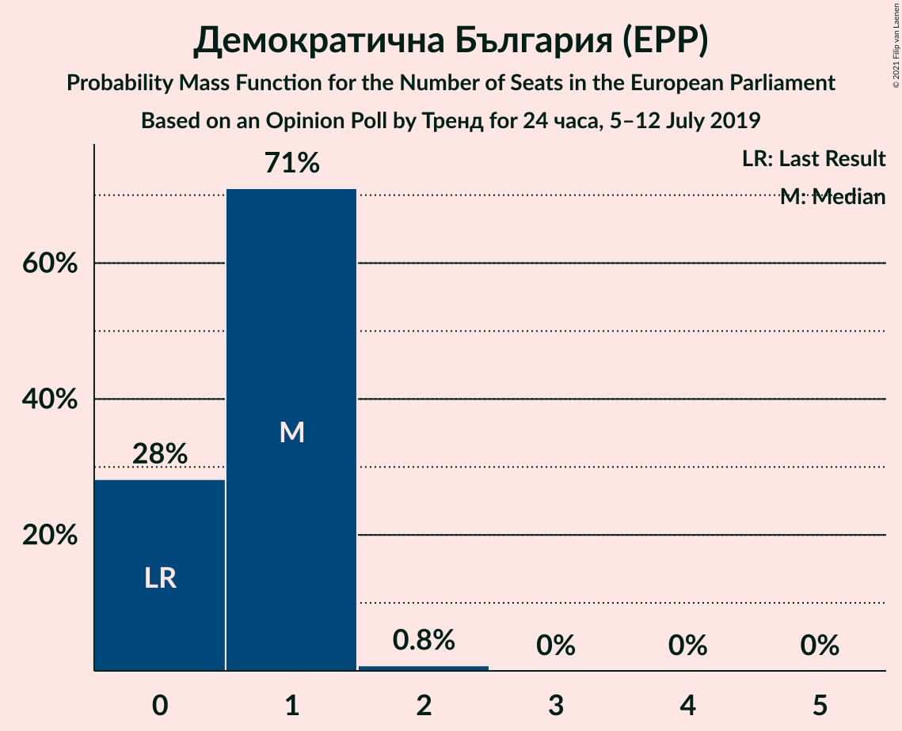
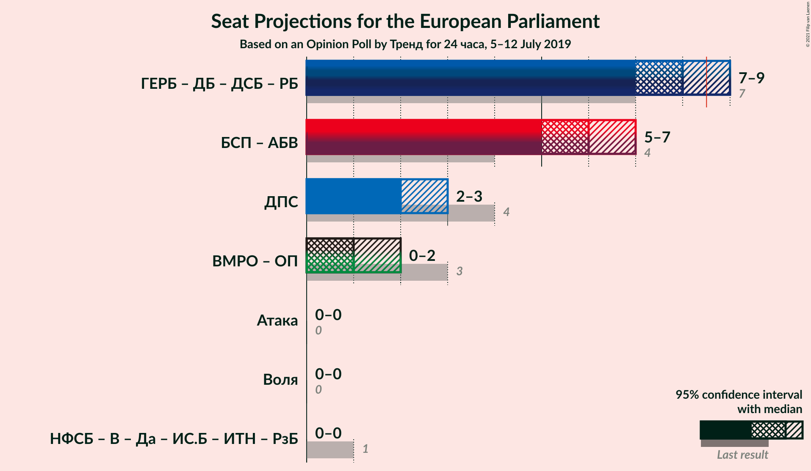
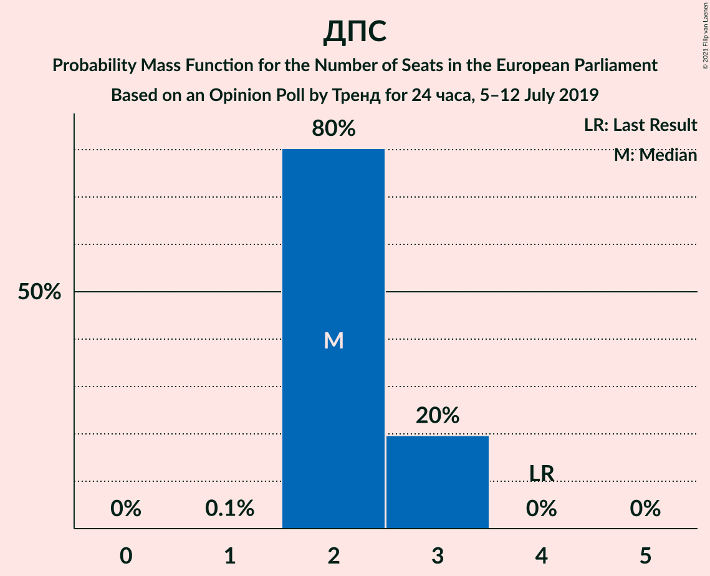

# Opinion Poll by Тренд for 24 часа, 5–12 July 2019

<a href="#voting-intentions">Voting Intentions</a> | <a href="#seats">Seats</a> | <a href="#coalitions">Coalitions</a> | <a href="#technical-information">Technical Information</a>

## Voting Intentions

### Confidence Intervals

| Party | Last Result | Poll Result | 80% Confidence Interval | 90% Confidence Interval | 95% Confidence Interval | 99% Confidence Interval |
|:-----:|:-----------:|:-----------:|:-----------------------:|:-----------------------:|:-----------------------:|:-----------------------:|
| Граждани за европейско развитие на България (EPP) | 30.4% | 38.1% | 35.7–40.6% |35.0–41.3% |34.4–42.0% |33.2–43.2% |
| Българска социалистическа партия (S&D) | 18.9% | 30.2% | 27.9–32.6% |27.3–33.3% |26.7–33.9% |25.6–35.0% |
| Движение за права и свободи (RE) | 17.3% | 11.4% | 9.9–13.2% |9.5–13.7% |9.2–14.2% |8.5–15.1% |
| ВМРО–Българско Национално Движение (ECR) | 10.7% | 5.9% | 4.8–7.3% |4.5–7.7% |4.3–8.0% |3.8–8.7% |
| Демократична България (EPP) | 0.0% | 5.2% | 4.3–6.6% |4.0–6.9% |3.7–7.3% |3.3–8.0% |
| Обединени Патриоти (ECR) | 10.7% | 2.1% | 1.5–3.0% |1.3–3.3% |1.2–3.5% |1.0–4.0% |
| Воля (ID) | 0.0% | 1.9% | 1.4–2.8% |1.2–3.1% |1.1–3.3% |0.9–3.8% |
| Атака (NI) | 10.7% | 1.7% | 1.2–2.6% |1.1–2.9% |1.0–3.1% |0.8–3.6% |

*Note:* The poll result column reflects the actual value used in the calculations. Published results may vary slightly, and in addition be rounded to fewer digits.

## Seats

### Confidence Intervals

| Party | Last Result | Median | 80% Confidence Interval | 90% Confidence Interval | 95% Confidence Interval | 99% Confidence Interval |
|:-----:|:-----------:|:------:|:-----------------------:|:-----------------------:|:-----------------------:|:-----------------------:|
| <a href="#граждани-за-европейско-развитие-на-българия-(epp)">Граждани за европейско развитие на България (EPP)</a> | 6 | 7 | 7–8 |7–8 |6–8 |6–9 |
| <a href="#българска-социалистическа-партия-(s&d)">Българска социалистическа партия (S&D)</a> | 4 | 6 | 5–6 |5–6 |5–7 |5–7 |
| <a href="#движение-за-права-и-свободи-(re)">Движение за права и свободи (RE)</a> | 4 | 2 | 2–3 |2–3 |2–3 |2–3 |
| <a href="#вмро–българско-национално-движение-(ecr)">ВМРО–Българско Национално Движение (ECR)</a> | 1 | 1 | 0–2 |0–2 |0–2 |0–2 |
| <a href="#демократична-българия-(epp)">Демократична България (EPP)</a> | 0 | 1 | 0–1 |0–1 |0–1 |0–2 |
| <a href="#обединени-патриоти-(ecr)">Обединени Патриоти (ECR)</a> | 2 | 0 | 0 |0 |0 |0 |
| <a href="#воля-(id)">Воля (ID)</a> | 0 | 0 | 0 |0 |0 |0 |
| <a href="#атака-(ni)">Атака (NI)</a> | 0 | 0 | 0 |0 |0 |0 |

### Граждани за европейско развитие на България (EPP)

*For a full overview of the results for this party, see the [Граждани за европейско развитие на България (EPP)](party-гражданизаевропейскоразвитиенабългарияepp.html) page.*

| Number of Seats | Probability | Accumulated | Special Marks |
|:---------------:|:-----------:|:-----------:|:-------------:|
| 6 | 4% | 100% | Last Result |
| 7 | 81% | 96% | Median |
| 8 | 15% | 16% |  |
| 9 | 1.1% | 1.1% | Majority |
| 10 | 0% | 0% |  |

### Българска социалистическа партия (S&D)

*For a full overview of the results for this party, see the [Българска социалистическа партия (S&D)](party-българскасоциалистическапартияsd.html) page.*

| Number of Seats | Probability | Accumulated | Special Marks |
|:---------------:|:-----------:|:-----------:|:-------------:|
| 4 | 0% | 100% | Last Result |
| 5 | 26% | 100% |  |
| 6 | 70% | 74% | Median |
| 7 | 4% | 4% |  |
| 8 | 0% | 0% |  |

### Движение за права и свободи (RE)

*For a full overview of the results for this party, see the [Движение за права и свободи (RE)](party-движениезаправаисвободиre.html) page.*

| Number of Seats | Probability | Accumulated | Special Marks |
|:---------------:|:-----------:|:-----------:|:-------------:|
| 2 | 80% | 100% | Median |
| 3 | 20% | 20% |  |
| 4 | 0% | 0% | Last Result |

### ВМРО–Българско Национално Движение (ECR)

*For a full overview of the results for this party, see the [ВМРО–Българско Национално Движение (ECR)](party-вмро–българсконационалнодвижениеecr.html) page.*

| Number of Seats | Probability | Accumulated | Special Marks |
|:---------------:|:-----------:|:-----------:|:-------------:|
| 0 | 12% | 100% |  |
| 1 | 76% | 88% | Last Result, Median |
| 2 | 12% | 12% |  |
| 3 | 0% | 0% |  |

### Демократична България (EPP)

*For a full overview of the results for this party, see the [Демократична България (EPP)](party-демократичнабългарияepp.html) page.*

| Number of Seats | Probability | Accumulated | Special Marks |
|:---------------:|:-----------:|:-----------:|:-------------:|
| 0 | 17% | 100% | Last Result |
| 1 | 81% | 83% | Median |
| 2 | 2% | 2% |  |
| 3 | 0% | 0% |  |

### Обединени Патриоти (ECR)

*For a full overview of the results for this party, see the [Обединени Патриоти (ECR)](party-обединенипатриотиecr.html) page.*

| Number of Seats | Probability | Accumulated | Special Marks |
|:---------------:|:-----------:|:-----------:|:-------------:|
| 0 | 100% | 100% | Median |
| 1 | 0% | 0% |  |
| 2 | 0% | 0% | Last Result |

### Воля (ID)

*For a full overview of the results for this party, see the [Воля (ID)](party-воляid.html) page.*

| Number of Seats | Probability | Accumulated | Special Marks |
|:---------------:|:-----------:|:-----------:|:-------------:|
| 0 | 100% | 100% | Last Result, Median |

### Атака (NI)

*For a full overview of the results for this party, see the [Атака (NI)](party-атакаni.html) page.*

| Number of Seats | Probability | Accumulated | Special Marks |
|:---------------:|:-----------:|:-----------:|:-------------:|
| 0 | 100% | 100% | Last Result, Median |

## Coalitions

### Confidence Intervals

| Coalition | Last Result | Median | Majority? | 80% Confidence Interval | 90% Confidence Interval | 95% Confidence Interval | 99% Confidence Interval |
|:---------:|:-----------:|:------:|:---------:|:-----------------------:|:-----------------------:|:-----------------------:|:-----------------------:|
| Движение за права и свободи (RE) | 4 | 2 | 0% | 2–3 | 2–3 | 2–3 | 2–3 |
| ВМРО–Българско Национално Движение (ECR) – Обединени Патриоти (ECR) | 3 | 1 | 0% | 0–2 | 0–2 | 0–2 | 0–2 |
| Атака (NI) | 0 | 0 | 0% | 0 | 0 | 0 | 0 |
| Воля (ID) | 0 | 0 | 0% | 0 | 0 | 0 | 0 |

### Движение за права и свободи (RE)

| Number of Seats | Probability | Accumulated | Special Marks |
|:---------------:|:-----------:|:-----------:|:-------------:|
| 2 | 80% | 100% | Median |
| 3 | 20% | 20% |  |
| 4 | 0% | 0% | Last Result |

### ВМРО–Българско Национално Движение (ECR) – Обединени Патриоти (ECR)

| Number of Seats | Probability | Accumulated | Special Marks |
|:---------------:|:-----------:|:-----------:|:-------------:|
| 0 | 12% | 100% |  |
| 1 | 76% | 88% | Median |
| 2 | 12% | 12% |  |
| 3 | 0% | 0% | Last Result |

### Атака (NI)

| Number of Seats | Probability | Accumulated | Special Marks |
|:---------------:|:-----------:|:-----------:|:-------------:|
| 0 | 100% | 100% | Last Result, Median |

### Воля (ID)

| Number of Seats | Probability | Accumulated | Special Marks |
|:---------------:|:-----------:|:-----------:|:-------------:|
| 0 | 100% | 100% | Last Result, Median |

## Technical Information

### Opinion Poll

+ **Polling firm:** Тренд
+ **Commissioner(s):** 24 часа
+ **Fieldwork period:** 5–12 July 2019

### Calculations

+ **Sample size:** 630
+ **Simulations done:** 131,072
+ **Error estimate:** 1.42%

