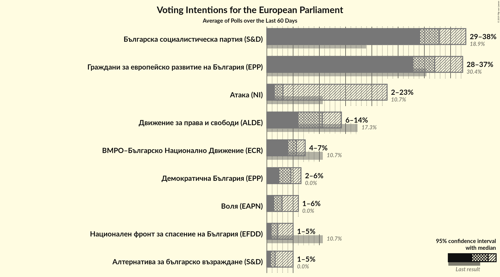
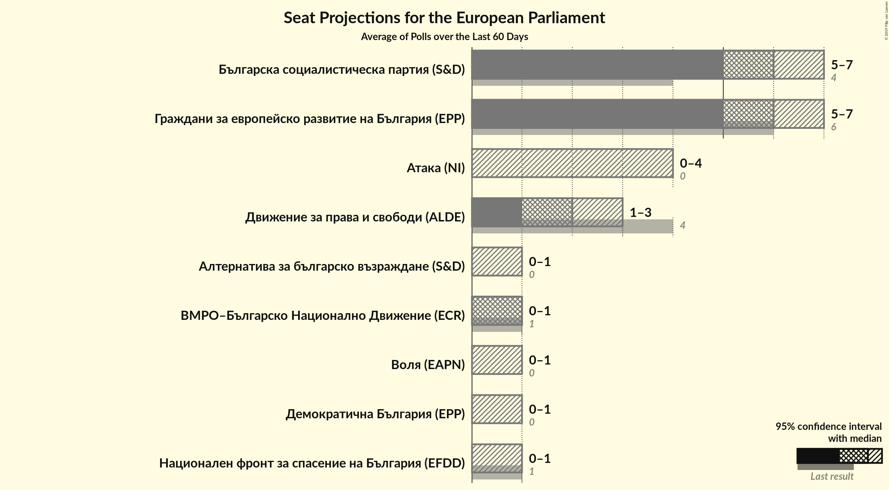
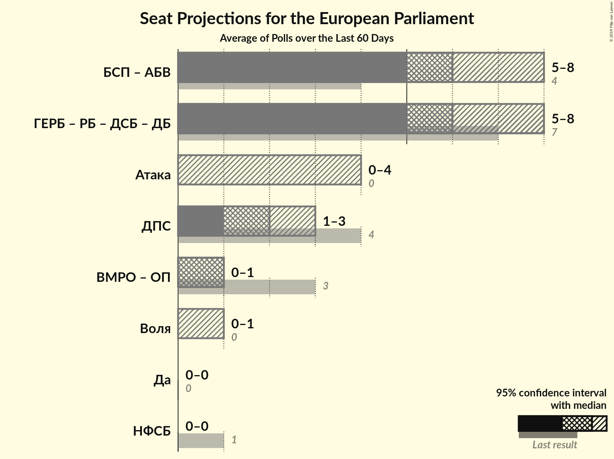

# Overview

The table below lists the most recent polls (less than 60 days old) registered and analyzed so far.

| Period     | Polling firm/Commissioner(s) | ГЕРБ | БСП | ДПС | ОП | ВМРО | НФСБ | Атака | РБ | Воля | ДБ | ДСБ | Да | АБВ |
|:----------:|:----------------------------:|:--:|:--:|:--:|:--:|:--:|:--:|:--:|:--:|:--:|:--:|:--:|:--:|:--:|
| 25 May 2014 | General Election | 30.4%   6 | 18.9%   4 | 17.3%   4 | 10.7%   2 | 10.7%   1 | 10.7%   1 | 10.7%   0 | 6.4%   1 | 0.0%   0 | 0.0%   0 | 0.0%   0 | 0.0%   0 | 0.0%   0 |
| N/A | [Poll Average](average.html) | 28–37%   5–7 | 29–38%   5–7 | 6–14%   1–3 | N/A   N/A | 4–7%   0–1 | 1–5%   0–1 | 2–23%   0–4 | N/A   N/A | 1–6%   0–1 | 2–6%   0–1 | N/A   N/A | N/A   N/A | 1–5%   0–1 |
| [2–7 May 2019](2019-05-07-Mediana.html) | Mediana | 27–33%   6–7 | 29–35%   6–8 | 9–13%   2–3 | N/A   N/A | 4–6%   0–1 | 3–5%   0–1 | 2–4%   0 | N/A   N/A | 4–6%   0–1 | 2–4%   0 | N/A   N/A | N/A   N/A | 3–5%   0–1 |
| [20–30 April 2019](2019-04-30-Алфарисърч.html) | Алфа рисърч | 30–36%   5–6 | 30–36%   5–6 | 8–12%   1–2 | N/A   N/A | 5–8%   0–1 | 1–3%   0 | 19–24%   3–4 | N/A   N/A | 1–3%   0 | 4–7%   0–1 | N/A   N/A | N/A   N/A | 1–2%   0 |
| [12–22 April 2019](2019-04-22-МаркетЛИНКС.html) | Маркет ЛИНКС | 33–38%   6–7 | 33–39%   6–7 | 6–9%   1–2 | N/A   N/A | 4–7%   0–1 | N/A   N/A | N/A   N/A | N/A   N/A | 1–3%   0 | 4–7%   0–1 | N/A   N/A | N/A   N/A | N/A   N/A |
| [5–12 April 2019](2019-04-12-Тренд.html) | Тренд | 28–33%   5–7 | 29–34%   5–7 | 11–15%   2–3 | N/A   N/A | 4–7%   0–1 | 1–2%   0 | 1–3%   0 | N/A   N/A | 3–5%   0 | 3–6%   0–1 | N/A   N/A | N/A   N/A | 1–2%   0 |
| 25 May 2014 | General Election | 30.4%   6 | 18.9%   4 | 17.3%   4 | 10.7%   2 | 10.7%   1 | 10.7%   1 | 10.7%   0 | 6.4%   1 | 0.0%   0 | 0.0%   0 | 0.0%   0 | 0.0%   0 | 0.0%   0 |

Only polls for which at least the sample size has been published are included in the table above.

**Legend:**
+ **Top half of each row:** Voting intentions (95% confidence interval)
+ **Bottom half of each row:** Seat projections for the European Parliament (95% confidence interval)
+ **ГЕРБ:** Граждани за европейско развитие на България (EPP)
+ **БСП:** Българска социалистическа партия (S&D)
+ **ДПС:** Движение за права и свободи (ALDE)
+ **ОП:** Обединени Патриоти (ECR)
+ **ВМРО:** ВМРО–Българско Национално Движение (ECR)
+ **НФСБ:** Национален фронт за спасение на България (EFDD)
+ **Атака:** Атака (NI)
+ **РБ:** Реформаторски блок (EPP)
+ **Воля:** Воля (EAPN)
+ **ДБ:** Демократична България (EPP)
+ **ДСБ:** Демократи за силна България (EPP)
+ **Да:** Да, България! (*)
+ **АБВ:** Алтернатива за българско възраждане (S&D)
+ **N/A (single party):** Party not included the published results
+ **N/A (entire row):** Calculation for this opinion poll not started yet

