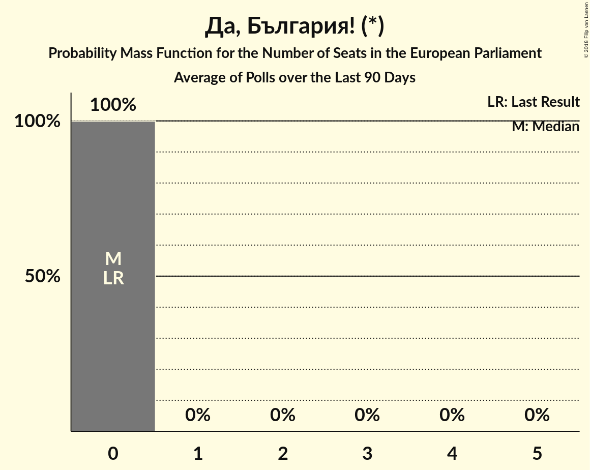

# Да, България! (*)

<a href="#voting-intentions">Voting Intentions</a> | <a href="#seats">Seats</a>

## Voting Intentions

Last result: **0.0%** (General Election of 25 May 2014)

### Confidence Intervals

| Period     | Polling firm/Commissioner(s) | Median | 80% Confidence Interval | 90% Confidence Interval | 95% Confidence Interval | 99% Confidence Interval |
|:----------:|:----------------:|:-----------:|:-----------------------:|:-----------------------:|:-----------------------:|:-----------------------:|
| N/A | [Poll Average](average.html) | 1.8% | 0.8–3.2% | 0.7–3.5% | 0.6–3.8% | 0.4–4.4% |
| [1–7 March 2018](2018-03-07-Тренд.html) | Тренд   24 часа | 2.5% | 1.8–3.5% | 1.6–3.8% | 1.5–4.1% | 1.2–4.6% |
| [10–18 January 2018](2018-01-18-Тренд.html) | Тренд   24 часа | 2.6% | 2.0–3.7% | 1.8–4.0% | 1.6–4.2% | 1.4–4.8% |
| [7–13 December 2017](2017-12-13-Exacta.html) | Exacta | 1.0% | 0.7–1.7% | 0.6–2.0% | 0.5–2.1% | 0.4–2.5% |

### Probability Mass Function

The following table shows the probability mass function per percentage block of voting intentions for the [poll average](average.html) for Да, България! (*).

| Voting Intentions | Probability | Accumulated | Special Marks |
|:-----------------:|:-----------:|:-----------:|:-------------:|
| 0.0–0.5% | 2% | 100% | Last Result |
| 0.5–1.5% | 41% | 98% |  |
| 1.5–2.5% | 31% | 57% | Median |
| 2.5–3.5% | 22% | 26% |  |
| 3.5–4.5% | 4% | 4% |  |
| 4.5–5.5% | 0.3% | 0.3% |  |
| 5.5–6.5% | 0% | 0% |  |

## Seats

Last result: **0** seats (General Election of 25 May 2014)

### Confidence Intervals

| Period     | Polling firm/Commissioner(s) | Median | 80% Confidence Interval | 90% Confidence Interval | 95% Confidence Interval | 99% Confidence Interval |
|:----------:|:----------------:|:------:|:-----------------------:|:-----------------------:|:-----------------------:|:-----------------------:|
| N/A | [Poll Average](average.html) | 0 | 0 | 0 | 0 | 0 |
| [1–7 March 2018](2018-03-07-Тренд.html) | Тренд   24 часа | 0 | 0 | 0 | 0 | 0 |
| [10–18 January 2018](2018-01-18-Тренд.html) | Тренд   24 часа | 0 | 0 | 0 | 0 | 0 |
| [7–13 December 2017](2017-12-13-Exacta.html) | Exacta | 0 | 0 | 0 | 0 | 0 |

### Probability Mass Function

The following table shows the probability mass function per seat for the [poll average](average.html) for Да, България! (*).

| Number of Seats | Probability | Accumulated | Special Marks |
|:---------------:|:-----------:|:-----------:|:-------------:|
| 0 | 100% | 100% | Last Result, Median |

