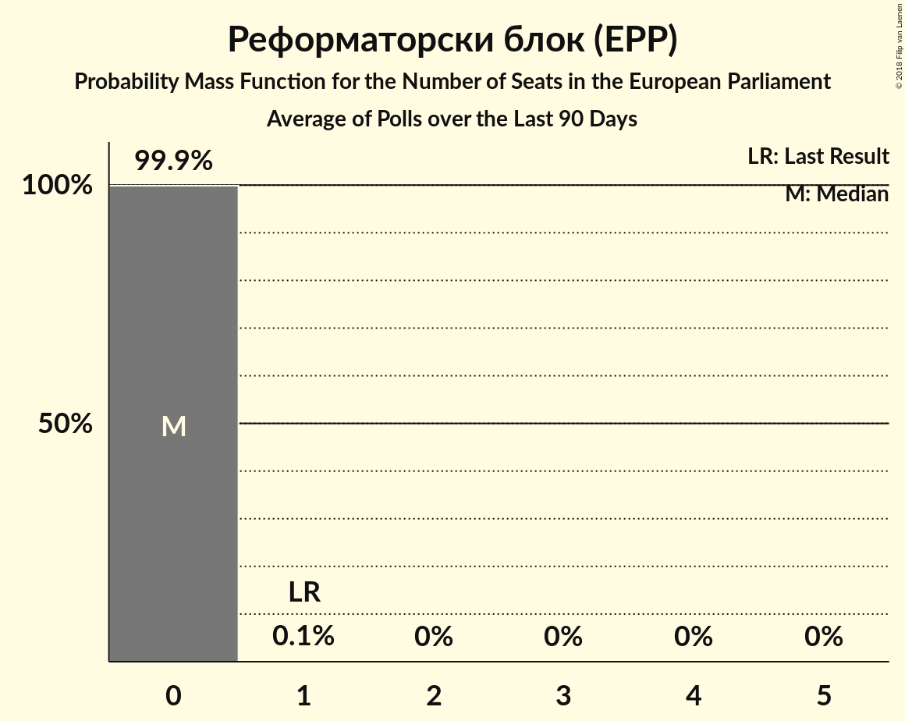

# Реформаторски блок (EPP)

<a href="#voting-intentions">Voting Intentions</a> | <a href="#seats">Seats</a>

## Voting Intentions

Last result: **6.5%** (General Election of 25 May 2014)

### Confidence Intervals

| Period     | Polling firm/Commissioner(s) | Median | 80% Confidence Interval | 90% Confidence Interval | 95% Confidence Interval | 99% Confidence Interval |
|:----------:|:----------------:|:-----------:|:-----------------------:|:-----------------------:|:-----------------------:|:-----------------------:|
| N/A | [Poll Average](average.html) | 2.4% | 1.7–3.4% | 1.5–3.7% | 1.3–4.0% | 1.1–4.6% |
| [1–7 March 2018](2018-03-07-Тренд.html) | Тренд   24 часа | 2.6% | 2.0–3.7% | 1.8–4.0% | 1.6–4.3% | 1.4–4.8% |
| [10–18 January 2018](2018-01-18-Тренд.html) | Тренд   24 часа | 3.1% | 2.4–4.2% | 2.2–4.5% | 2.0–4.8% | 1.7–5.4% |
| [7–13 December 2017](2017-12-13-Exacta.html) | Exacta | 2.1% | 1.5–3.0% | 1.4–3.2% | 1.2–3.5% | 1.0–3.9% |

### Probability Mass Function

The following table shows the probability mass function per percentage block of voting intentions for the [poll average](average.html) for Реформаторски блок (EPP).

| Voting Intentions | Probability | Accumulated | Special Marks |
|:-----------------:|:-----------:|:-----------:|:-------------:|
| 0.0–0.5% | 0% | 100% |  |
| 0.5–1.5% | 6% | 100% |  |
| 1.5–2.5% | 50% | 94% | Median |
| 2.5–3.5% | 37% | 44% |  |
| 3.5–4.5% | 7% | 7% |  |
| 4.5–5.5% | 0.5% | 0.5% |  |
| 5.5–6.5% | 0% | 0% | Last Result |

## Seats

Last result: **1** seats (General Election of 25 May 2014)

### Confidence Intervals

| Period     | Polling firm/Commissioner(s) | Median | 80% Confidence Interval | 90% Confidence Interval | 95% Confidence Interval | 99% Confidence Interval |
|:----------:|:----------------:|:------:|:-----------------------:|:-----------------------:|:-----------------------:|:-----------------------:|
| N/A | [Poll Average](average.html) | 0 | 0 | 0 | 0 | 0 |
| [1–7 March 2018](2018-03-07-Тренд.html) | Тренд   24 часа | 0 | 0 | 0 | 0 | 0 |
| [10–18 January 2018](2018-01-18-Тренд.html) | Тренд   24 часа | 0 | 0 | 0 | 0 | 0–1 |
| [7–13 December 2017](2017-12-13-Exacta.html) | Exacta | 0 | 0 | 0 | 0 | 0 |

### Probability Mass Function

The following table shows the probability mass function per seat for the [poll average](average.html) for Реформаторски блок (EPP).

| Number of Seats | Probability | Accumulated | Special Marks |
|:---------------:|:-----------:|:-----------:|:-------------:|
| 0 | 99.9% | 100% | Median |
| 1 | 0.1% | 0.1% | Last Result |
| 2 | 0% | 0% |  |

