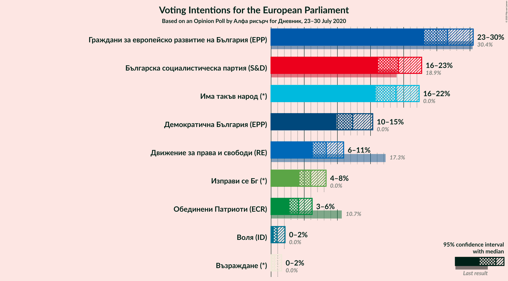
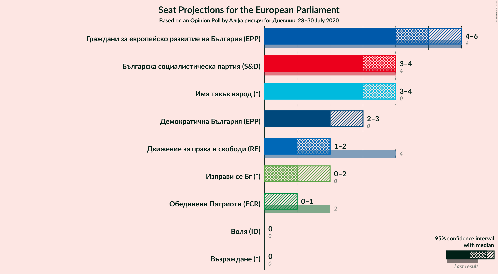
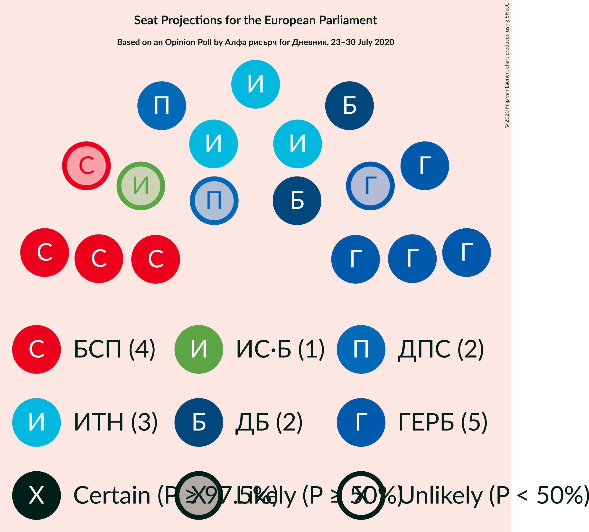
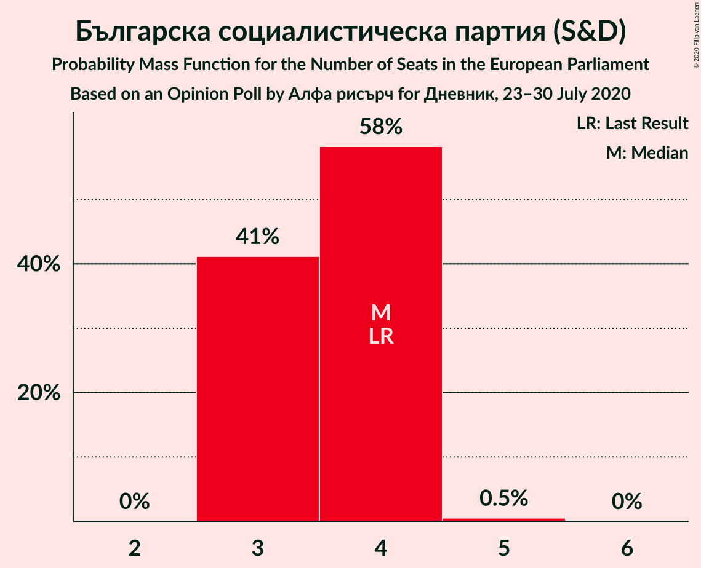
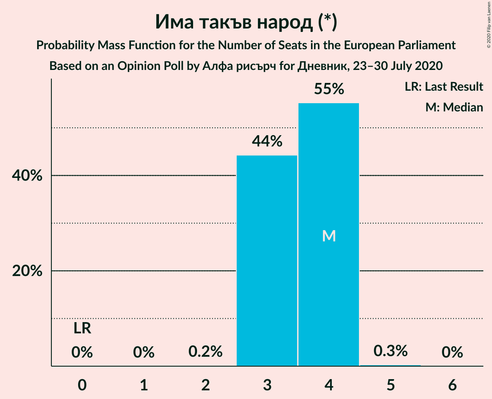
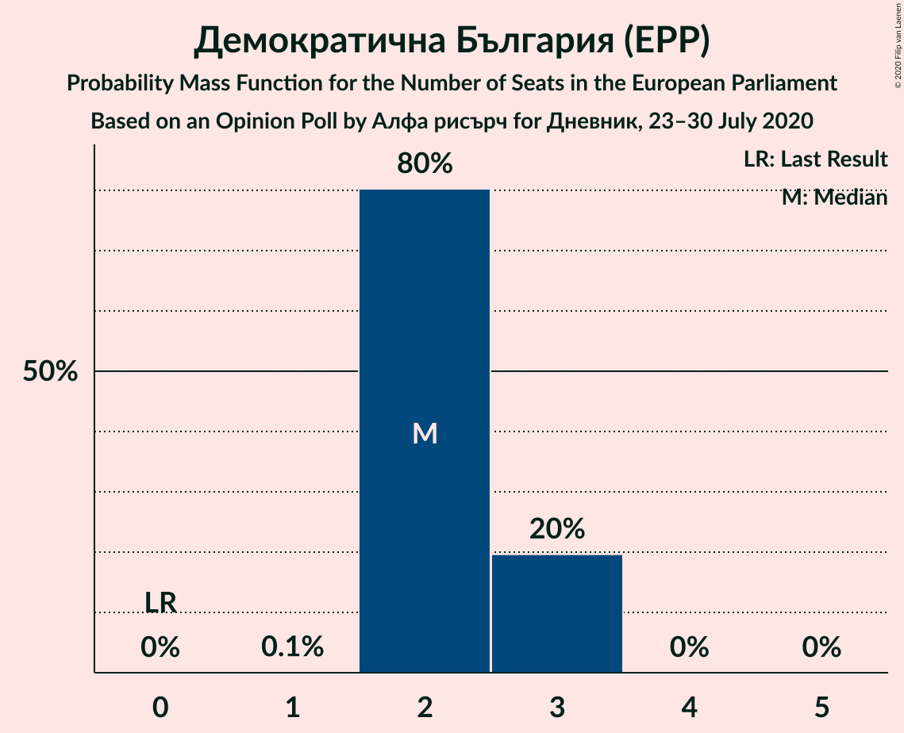
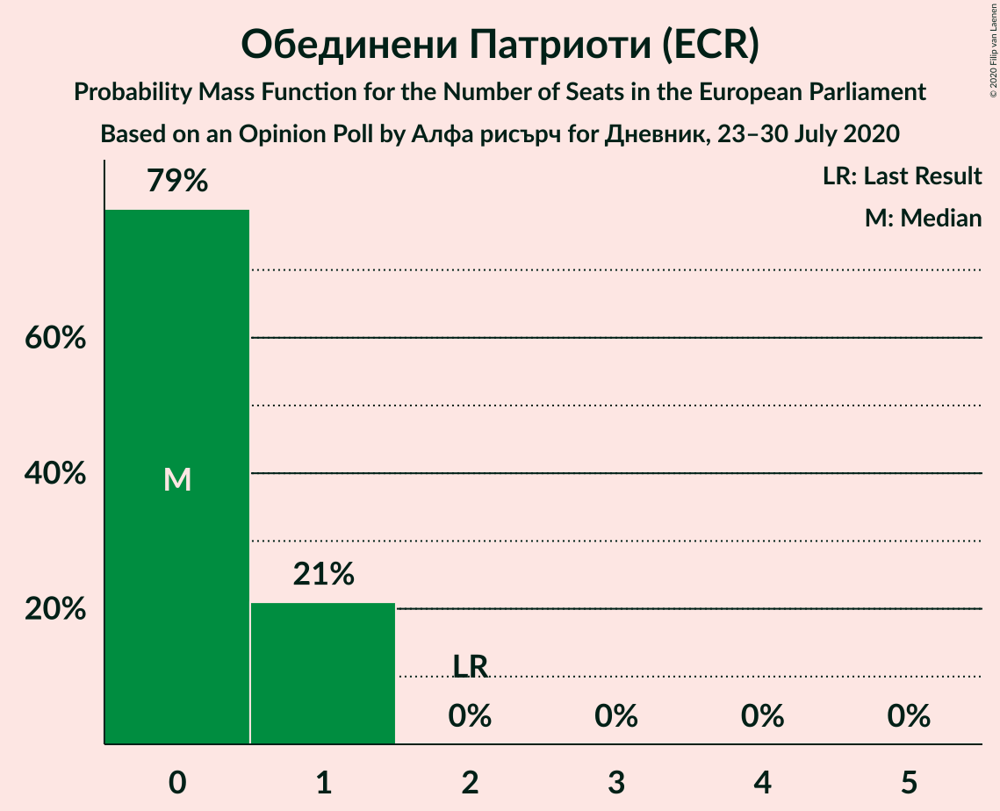
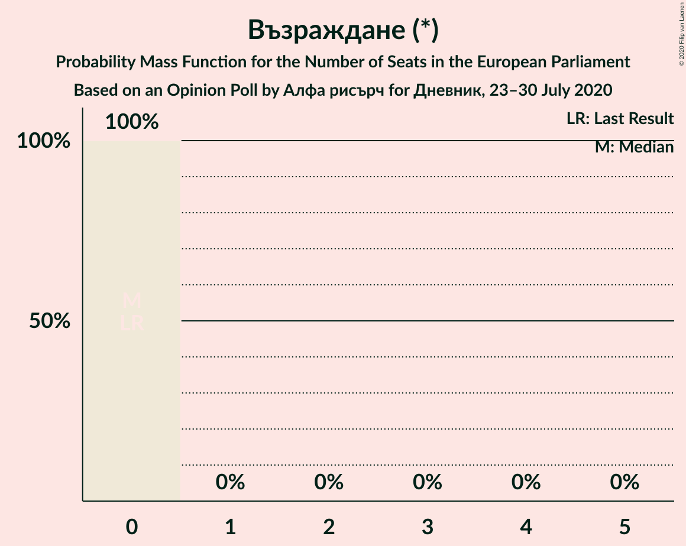
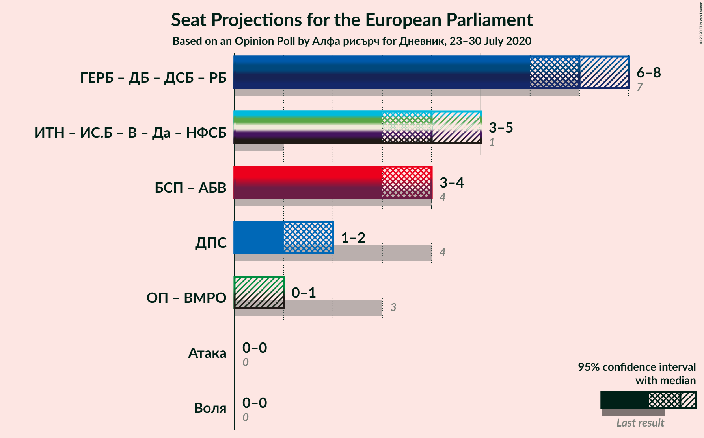
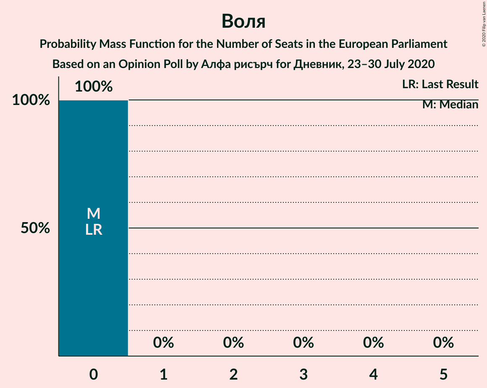

# Opinion Poll by Алфа рисърч for Дневник, 23–30 July 2020

<a href="#voting-intentions">Voting Intentions</a> | <a href="#seats">Seats</a> | <a href="#coalitions">Coalitions</a> | <a href="#technical-information">Technical Information</a>

## Voting Intentions

### Confidence Intervals

| Party | Last Result | Poll Result | 80% Confidence Interval | 90% Confidence Interval | 95% Confidence Interval | 99% Confidence Interval |
|:-----:|:-----------:|:-----------:|:-----------------------:|:-----------------------:|:-----------------------:|:-----------------------:|
| Граждани за европейско развитие на България (EPP) | 30.4% | 26.6% | 24.3–29.1% |23.7–29.9% |23.1–30.5% |22.0–31.7% |
| Българска социалистическа партия (S&D) | 18.9% | 19.2% | 17.2–21.5% |16.6–22.1% |16.1–22.7% |15.2–23.8% |
| Има такъв народ (*) | 0.0% | 18.8% | 16.8–21.1% |16.3–21.8% |15.8–22.3% |14.9–23.4% |
| Демократична България (EPP) | 0.0% | 12.3% | 10.7–14.3% |10.2–14.8% |9.8–15.3% |9.1–16.3% |
| Движение за права и свободи (RE) | 17.3% | 8.3% | 7.0–10.0% |6.6–10.5% |6.3–10.9% |5.7–11.8% |
| Изправи се Бг (*) | 0.0% | 6.0% | 4.9–7.5% |4.5–7.9% |4.3–8.3% |3.8–9.1% |
| Обединени Патриоти (ECR) | 10.7% | 4.2% | 3.3–5.5% |3.0–5.9% |2.8–6.2% |2.4–6.9% |
| Воля (ID) | 0.0% | 0.9% | 0.6–1.7% |0.5–1.9% |0.4–2.1% |0.3–2.5% |
| Възраждане (*) | 0.0% | 0.5% | 0.3–1.2% |0.2–1.4% |0.2–1.6% |0.1–2.0% |

*Note:* The poll result column reflects the actual value used in the calculations. Published results may vary slightly, and in addition be rounded to fewer digits.

## Seats

### Confidence Intervals

| Party | Last Result | Median | 80% Confidence Interval | 90% Confidence Interval | 95% Confidence Interval | 99% Confidence Interval |
|:-----:|:-----------:|:------:|:-----------------------:|:-----------------------:|:-----------------------:|:-----------------------:|
| <a href="#граждани-за-европейско-развитие-на-българия-(epp)">Граждани за европейско развитие на България (EPP)</a> | 6 | 5 | 4–5 |4–6 |4–6 |4–6 |
| <a href="#българска-социалистическа-партия-(s&d)">Българска социалистическа партия (S&D)</a> | 4 | 4 | 3–4 |3–4 |3–4 |3–5 |
| <a href="#има-такъв-народ-(*)">Има такъв народ (*)</a> | 0 | 4 | 3–4 |3–4 |3–4 |3–4 |
| <a href="#демократична-българия-(epp)">Демократична България (EPP)</a> | 0 | 2 | 2–3 |2–3 |2–3 |2–3 |
| <a href="#движение-за-права-и-свободи-(re)">Движение за права и свободи (RE)</a> | 4 | 2 | 1–2 |1–2 |1–2 |1–2 |
| <a href="#изправи-се-бг-(*)">Изправи се Бг (*)</a> | 0 | 1 | 0–1 |0–1 |0–2 |0–2 |
| <a href="#обединени-патриоти-(ecr)">Обединени Патриоти (ECR)</a> | 2 | 0 | 0–1 |0–1 |0–1 |0–1 |
| <a href="#воля-(id)">Воля (ID)</a> | 0 | 0 | 0 |0 |0 |0 |
| <a href="#възраждане-(*)">Възраждане (*)</a> | 0 | 0 | 0 |0 |0 |0 |

### Граждани за европейско развитие на България (EPP)

*For a full overview of the results for this party, see the [Граждани за европейско развитие на България (EPP)](party-гражданизаевропейскоразвитиенабългарияepp.html) page.*

| Number of Seats | Probability | Accumulated | Special Marks |
|:---------------:|:-----------:|:-----------:|:-------------:|
| 4 | 15% | 100% |  |
| 5 | 76% | 85% | Median |
| 6 | 9% | 9% | Last Result |
| 7 | 0% | 0% |  |

### Българска социалистическа партия (S&D)

*For a full overview of the results for this party, see the [Българска социалистическа партия (S&D)](party-българскасоциалистическапартияsd.html) page.*

| Number of Seats | Probability | Accumulated | Special Marks |
|:---------------:|:-----------:|:-----------:|:-------------:|
| 3 | 41% | 100% |  |
| 4 | 58% | 59% | Last Result, Median |
| 5 | 0.5% | 0.5% |  |
| 6 | 0% | 0% |  |

### Има такъв народ (*)

*For a full overview of the results for this party, see the [Има такъв народ (*)](party-иматакъвнарод.html) page.*

| Number of Seats | Probability | Accumulated | Special Marks |
|:---------------:|:-----------:|:-----------:|:-------------:|
| 0 | 0% | 100% | Last Result |
| 1 | 0% | 100% |  |
| 2 | 0.2% | 100% |  |
| 3 | 44% | 99.8% |  |
| 4 | 55% | 56% | Median |
| 5 | 0.3% | 0.3% |  |
| 6 | 0% | 0% |  |

### Демократична България (EPP)

*For a full overview of the results for this party, see the [Демократична България (EPP)](party-демократичнабългарияepp.html) page.*

| Number of Seats | Probability | Accumulated | Special Marks |
|:---------------:|:-----------:|:-----------:|:-------------:|
| 0 | 0% | 100% | Last Result |
| 1 | 0.1% | 100% |  |
| 2 | 80% | 99.9% | Median |
| 3 | 20% | 20% |  |
| 4 | 0% | 0% |  |

### Движение за права и свободи (RE)

*For a full overview of the results for this party, see the [Движение за права и свободи (RE)](party-движениезаправаисвободиre.html) page.*

| Number of Seats | Probability | Accumulated | Special Marks |
|:---------------:|:-----------:|:-----------:|:-------------:|
| 0 | 0.1% | 100% |  |
| 1 | 39% | 99.9% |  |
| 2 | 61% | 61% | Median |
| 3 | 0% | 0% |  |
| 4 | 0% | 0% | Last Result |

### Изправи се Бг (*)

*For a full overview of the results for this party, see the [Изправи се Бг (*)](party-изправисебг.html) page.*

| Number of Seats | Probability | Accumulated | Special Marks |
|:---------------:|:-----------:|:-----------:|:-------------:|
| 0 | 18% | 100% | Last Result |
| 1 | 77% | 82% | Median |
| 2 | 5% | 5% |  |
| 3 | 0% | 0% |  |

### Обединени Патриоти (ECR)

*For a full overview of the results for this party, see the [Обединени Патриоти (ECR)](party-обединенипатриотиecr.html) page.*

| Number of Seats | Probability | Accumulated | Special Marks |
|:---------------:|:-----------:|:-----------:|:-------------:|
| 0 | 79% | 100% | Median |
| 1 | 21% | 21% |  |
| 2 | 0% | 0% | Last Result |

### Воля (ID)

*For a full overview of the results for this party, see the [Воля (ID)](party-воляid.html) page.*

| Number of Seats | Probability | Accumulated | Special Marks |
|:---------------:|:-----------:|:-----------:|:-------------:|
| 0 | 100% | 100% | Last Result, Median |

### Възраждане (*)

*For a full overview of the results for this party, see the [Възраждане (*)](party-възраждане.html) page.*

| Number of Seats | Probability | Accumulated | Special Marks |
|:---------------:|:-----------:|:-----------:|:-------------:|
| 0 | 100% | 100% | Last Result, Median |

## Coalitions

### Confidence Intervals

| Coalition | Last Result | Median | Majority? | 80% Confidence Interval | 90% Confidence Interval | 95% Confidence Interval | 99% Confidence Interval |
|:---------:|:-----------:|:------:|:---------:|:-----------------------:|:-----------------------:|:-----------------------:|:-----------------------:|
| Движение за права и свободи (RE) | 4 | 2 | 0% | 1–2 | 1–2 | 1–2 | 1–2 |
| Воля (ID) | 0 | 0 | 0% | 0 | 0 | 0 | 0 |

### Движение за права и свободи (RE)

| Number of Seats | Probability | Accumulated | Special Marks |
|:---------------:|:-----------:|:-----------:|:-------------:|
| 0 | 0.1% | 100% |  |
| 1 | 39% | 99.9% |  |
| 2 | 61% | 61% | Median |
| 3 | 0% | 0% |  |
| 4 | 0% | 0% | Last Result |

### Воля (ID)

| Number of Seats | Probability | Accumulated | Special Marks |
|:---------------:|:-----------:|:-----------:|:-------------:|
| 0 | 100% | 100% | Last Result, Median |

## Technical Information

### Opinion Poll

+ **Polling firm:** Алфа рисърч
+ **Commissioner(s):** Дневник
+ **Fieldwork period:** 23–30 July 2020

### Calculations

+ **Sample size:** 552
+ **Simulations done:** 1,048,576
+ **Error estimate:** 2.38%

