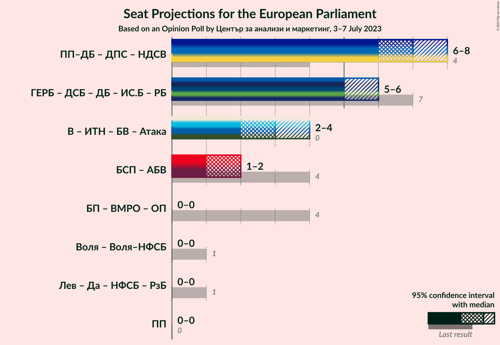

# Opinion Poll by Център за анализи и маркетинг, 3–7 July 2023

<a href="#voting-intentions">Voting Intentions</a> | <a href="#seats">Seats</a> | <a href="#coalitions">Coalitions</a> | <a href="#technical-information">Technical Information</a>

## Voting Intentions

### Confidence Intervals

| Party | Last Result | Poll Result | 80% Confidence Interval | 90% Confidence Interval | 95% Confidence Interval | 99% Confidence Interval |
|:-----:|:-----------:|:-----------:|:-----------------------:|:-----------------------:|:-----------------------:|:-----------------------:|
| Граждани за европейско развитие на България (EPP) | 30.4% | 27.4% | 25.6–29.3% |25.1–29.8% |24.7–30.3% |23.8–31.2% |
| Продължаваме промяната–Демократична България (RE) | 0.0% | 22.5% | 20.8–24.2% |20.3–24.8% |20.0–25.2% |19.2–26.1% |
| Възраждане (NI) | 0.0% | 15.1% | 13.7–16.6% |13.3–17.1% |13.0–17.5% |12.3–18.2% |
| Движение за права и свободи (RE) | 17.3% | 14.1% | 12.7–15.6% |12.3–16.0% |12.0–16.4% |11.4–17.1% |
| Българска социалистическа партия (S&D) | 18.9% | 9.4% | 8.3–10.7% |8.0–11.1% |7.8–11.4% |7.3–12.1% |
| Има такъв народ (NI) | 0.0% | 3.9% | 3.2–4.8% |3.0–5.1% |2.9–5.3% |2.5–5.8% |
| Български възход (NI) | 0.0% | 1.9% | 1.5–2.7% |1.4–2.9% |1.2–3.0% |1.1–3.4% |
| Левицата! (*) | 0.0% | 1.9% | 1.5–2.7% |1.4–2.9% |1.2–3.0% |1.1–3.4% |

*Note:* The poll result column reflects the actual value used in the calculations. Published results may vary slightly, and in addition be rounded to fewer digits.

## Seats

### Confidence Intervals

| Party | Last Result | Median | 80% Confidence Interval | 90% Confidence Interval | 95% Confidence Interval | 99% Confidence Interval |
|:-----:|:-----------:|:------:|:-----------------------:|:-----------------------:|:-----------------------:|:-----------------------:|
| <a href="#граждани-за-европейско-развитие-на-българия-(epp)">Граждани за европейско развитие на България (EPP)</a> | 6 | 5 | 5–6 |5–6 |5–6 |4–6 |
| <a href="#продължаваме-промяната–демократична-българия-(re)">Продължаваме промяната–Демократична България (RE)</a> | 0 | 4 | 4–5 |4–5 |4–5 |4–5 |
| <a href="#възраждане-(ni)">Възраждане (NI)</a> | 0 | 3 | 3 |2–3 |2–3 |2–3 |
| <a href="#движение-за-права-и-свободи-(re)">Движение за права и свободи (RE)</a> | 4 | 3 | 2–3 |2–3 |2–3 |2–3 |
| <a href="#българска-социалистическа-партия-(s&d)">Българска социалистическа партия (S&D)</a> | 4 | 2 | 2 |1–2 |1–2 |1–2 |
| <a href="#има-такъв-народ-(ni)">Има такъв народ (NI)</a> | 0 | 0 | 0 |0–1 |0–1 |0–1 |
| <a href="#български-възход-(ni)">Български възход (NI)</a> | 0 | 0 | 0 |0 |0 |0 |
| <a href="#левицата!-(*)">Левицата! (*)</a> | 0 | 0 | 0 |0 |0 |0 |

### Граждани за европейско развитие на България (EPP)

*For a full overview of the results for this party, see the [Граждани за европейско развитие на България (EPP)](party-гражданизаевропейскоразвитиенабългарияepp.html) page.*

| Number of Seats | Probability | Accumulated | Special Marks |
|:---------------:|:-----------:|:-----------:|:-------------:|
| 4 | 1.2% | 100% |  |
| 5 | 88% | 98.8% | Median |
| 6 | 11% | 11% | Last Result |
| 7 | 0% | 0% |  |

### Продължаваме промяната–Демократична България (RE)

*For a full overview of the results for this party, see the [Продължаваме промяната–Демократична България (RE)](party-продължавамепромяната–демократичнабългарияre.html) page.*

| Number of Seats | Probability | Accumulated | Special Marks |
|:---------------:|:-----------:|:-----------:|:-------------:|
| 0 | 0% | 100% | Last Result |
| 1 | 0% | 100% |  |
| 2 | 0% | 100% |  |
| 3 | 0.4% | 100% |  |
| 4 | 86% | 99.6% | Median |
| 5 | 14% | 14% |  |
| 6 | 0% | 0% |  |

### Възраждане (NI)

*For a full overview of the results for this party, see the [Възраждане (NI)](party-възражданеni.html) page.*

| Number of Seats | Probability | Accumulated | Special Marks |
|:---------------:|:-----------:|:-----------:|:-------------:|
| 0 | 0% | 100% | Last Result |
| 1 | 0% | 100% |  |
| 2 | 6% | 100% |  |
| 3 | 93% | 94% | Median |
| 4 | 0.5% | 0.5% |  |
| 5 | 0% | 0% |  |

### Движение за права и свободи (RE)

*For a full overview of the results for this party, see the [Движение за права и свободи (RE)](party-движениезаправаисвободиre.html) page.*

| Number of Seats | Probability | Accumulated | Special Marks |
|:---------------:|:-----------:|:-----------:|:-------------:|
| 2 | 22% | 100% |  |
| 3 | 78% | 78% | Median |
| 4 | 0% | 0% | Last Result |

### Българска социалистическа партия (S&D)

*For a full overview of the results for this party, see the [Българска социалистическа партия (S&D)](party-българскасоциалистическапартияsd.html) page.*

| Number of Seats | Probability | Accumulated | Special Marks |
|:---------------:|:-----------:|:-----------:|:-------------:|
| 1 | 6% | 100% |  |
| 2 | 94% | 94% | Median |
| 3 | 0% | 0% |  |
| 4 | 0% | 0% | Last Result |

### Има такъв народ (NI)

*For a full overview of the results for this party, see the [Има такъв народ (NI)](party-иматакъвнародni.html) page.*

| Number of Seats | Probability | Accumulated | Special Marks |
|:---------------:|:-----------:|:-----------:|:-------------:|
| 0 | 94% | 100% | Last Result, Median |
| 1 | 6% | 6% |  |
| 2 | 0% | 0% |  |

### Български възход (NI)

*For a full overview of the results for this party, see the [Български възход (NI)](party-българскивъзходni.html) page.*

| Number of Seats | Probability | Accumulated | Special Marks |
|:---------------:|:-----------:|:-----------:|:-------------:|
| 0 | 100% | 100% | Last Result, Median |

### Левицата! (*)

*For a full overview of the results for this party, see the [Левицата! (*)](party-левицата.html) page.*

| Number of Seats | Probability | Accumulated | Special Marks |
|:---------------:|:-----------:|:-----------:|:-------------:|
| 0 | 100% | 100% | Last Result, Median |

## Coalitions

### Confidence Intervals

| Coalition | Last Result | Median | Majority? | 80% Confidence Interval | 90% Confidence Interval | 95% Confidence Interval | 99% Confidence Interval |
|:---------:|:-----------:|:------:|:---------:|:-----------------------:|:-----------------------:|:-----------------------:|:-----------------------:|

## Technical Information

### Opinion Poll

+ **Polling firm:** Център за анализи и маркетинг
+ **Commissioner(s):** —
+ **Fieldwork period:** 3–7 July 2023

### Calculations

+ **Sample size:** 975
+ **Simulations done:** 1,048,576
+ **Error estimate:** 1.28%

