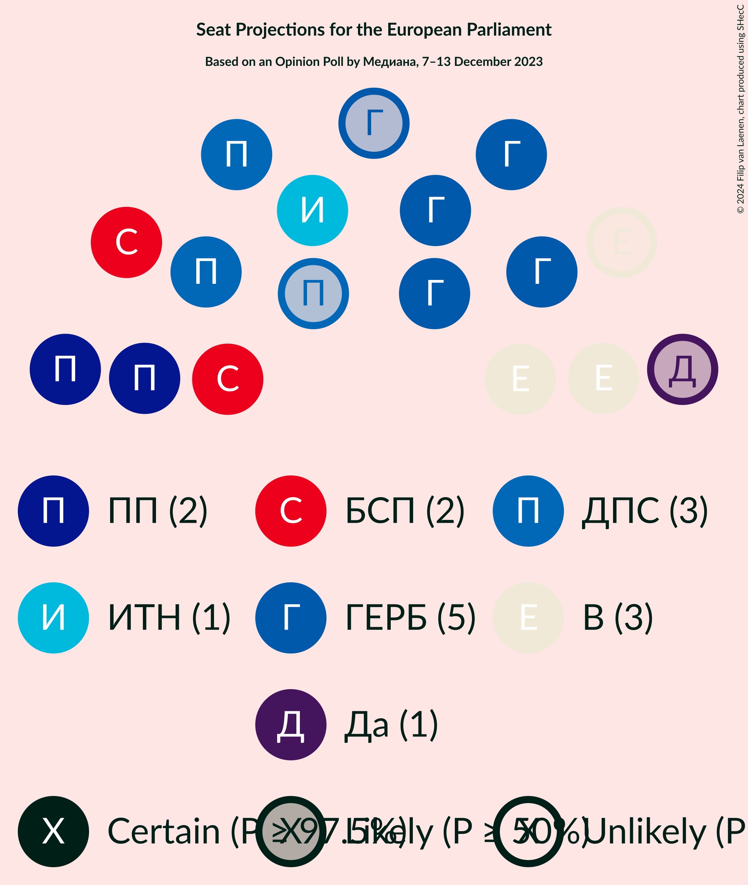
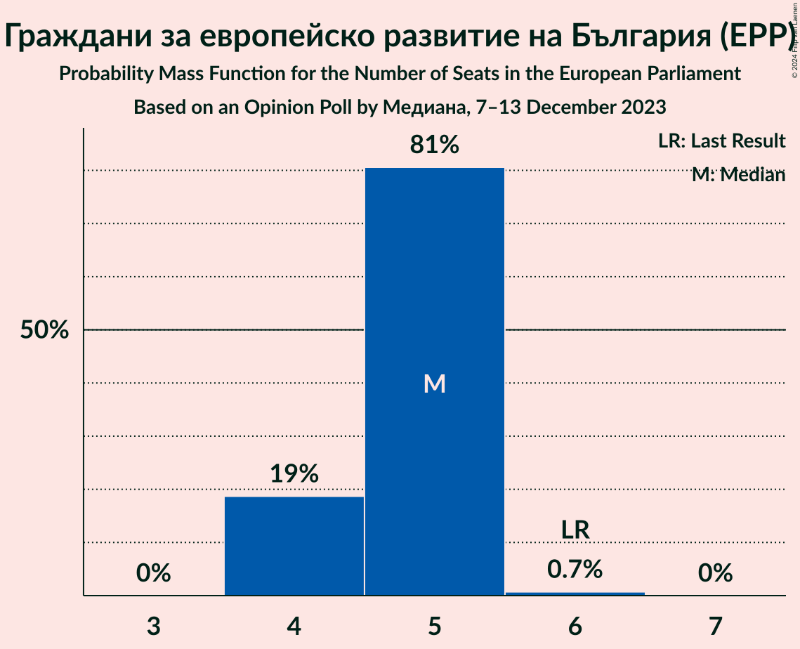
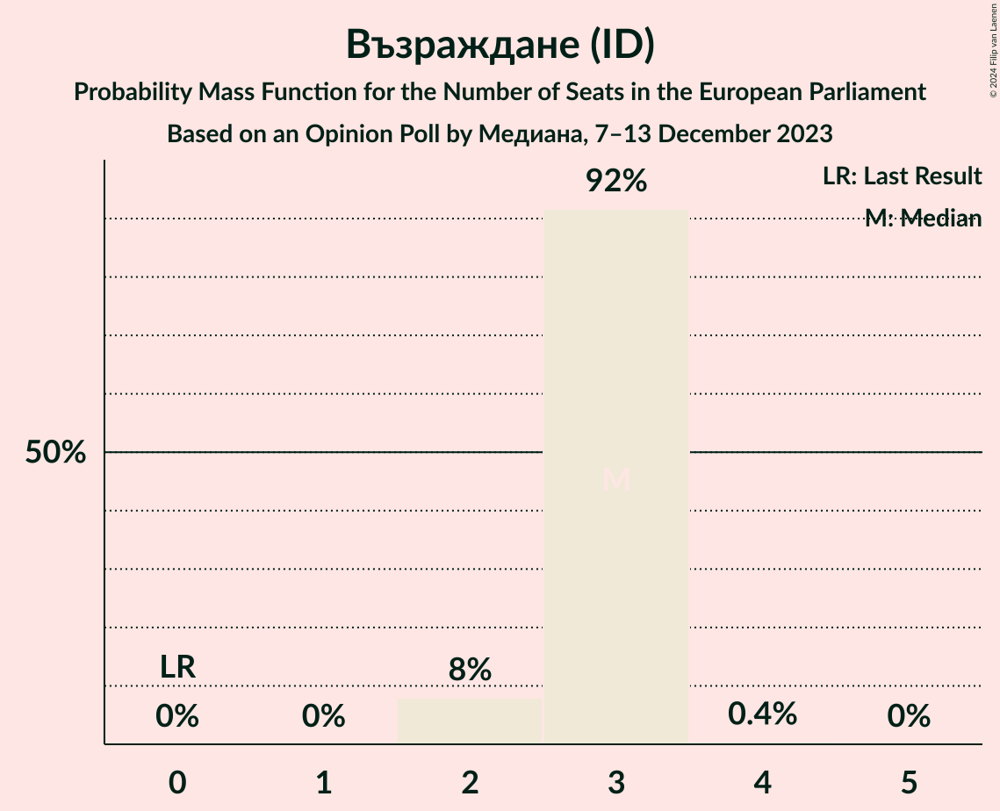
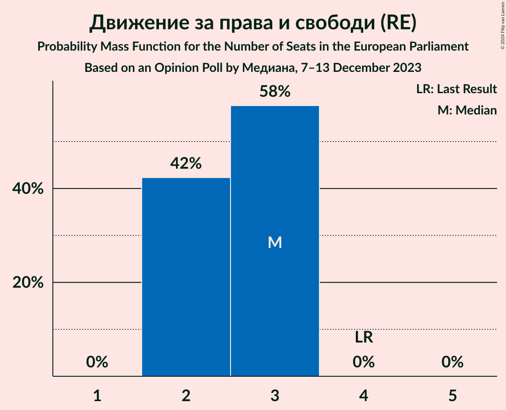
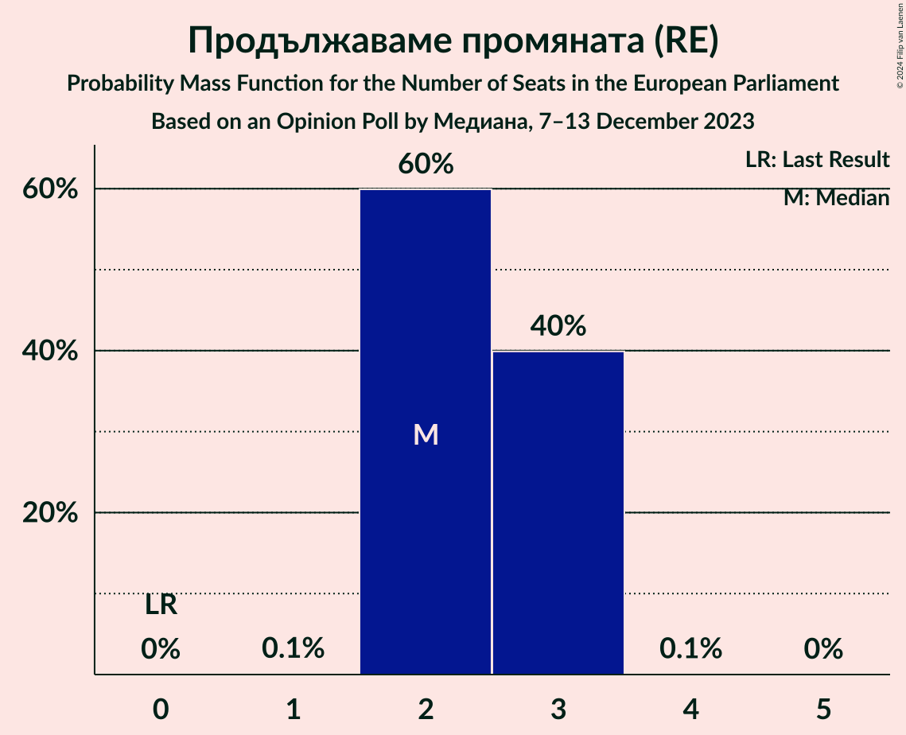
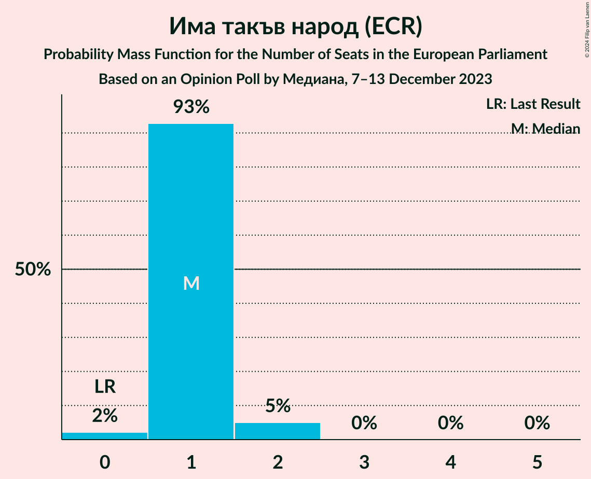
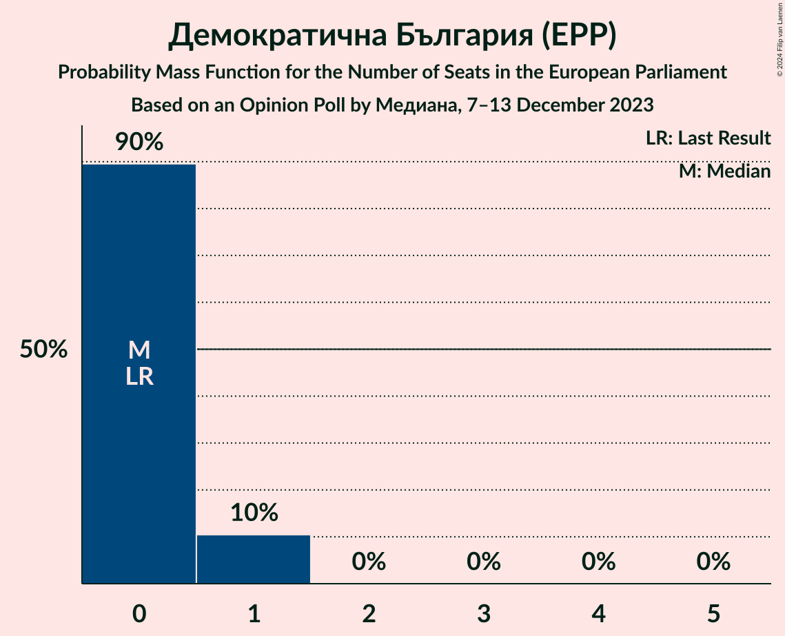
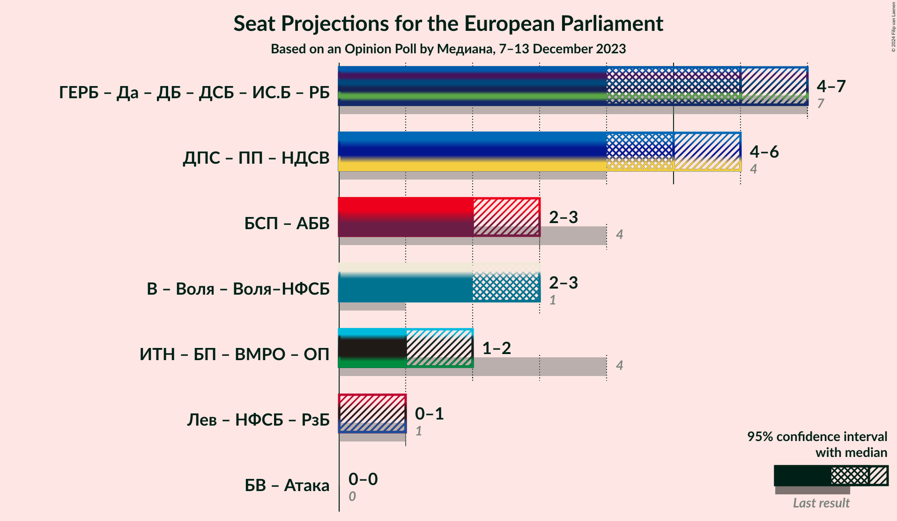

# Opinion Poll by Медиана, 7–13 December 2023

<a href="#voting-intentions">Voting Intentions</a> | <a href="#seats">Seats</a> | <a href="#coalitions">Coalitions</a> | <a href="#technical-information">Technical Information</a>

## Voting Intentions

### Confidence Intervals

| Party | Last Result | Poll Result | 80% Confidence Interval | 90% Confidence Interval | 95% Confidence Interval | 99% Confidence Interval |
|:-----:|:-----------:|:-----------:|:-----------------------:|:-----------------------:|:-----------------------:|:-----------------------:|
| Граждани за европейско развитие на България (EPP) | 30.4% | 25.5% | 23.6–27.4% |23.1–28.0% |22.7–28.4% |21.8–29.4% |
| Възраждане (ID) | 0.0% | 15.0% | 13.5–16.6% |13.1–17.1% |12.8–17.5% |12.1–18.3% |
| Движение за права и свободи (RE) | 17.3% | 13.5% | 12.1–15.1% |11.8–15.6% |11.4–16.0% |10.8–16.7% |
| Българска социалистическа партия (S&D) | 18.9% | 12.6% | 11.3–14.2% |10.9–14.6% |10.6–15.0% |10.0–15.7% |
| Продължаваме промяната (RE) | 0.0% | 10.5% | 9.2–11.9% |8.9–12.3% |8.6–12.7% |8.0–13.4% |
| Има такъв народ (ECR) | 0.0% | 6.6% | 5.6–7.8% |5.3–8.1% |5.1–8.4% |4.7–9.0% |
| Да, България! (EPP) | 0.0% | 4.0% | 3.2–5.0% |3.0–5.2% |2.9–5.5% |2.6–6.0% |
| Левицата! (*) | 0.0% | 3.9% | 3.1–4.8% |2.9–5.1% |2.8–5.4% |2.5–5.9% |
| Демократична България (EPP) | 0.0% | 3.0% | 2.3–3.8% |2.2–4.1% |2.0–4.3% |1.8–4.8% |
| Български възход (NI) | 0.0% | 1.7% | 1.3–2.4% |1.1–2.6% |1.0–2.8% |0.9–3.2% |

*Note:* The poll result column reflects the actual value used in the calculations. Published results may vary slightly, and in addition be rounded to fewer digits.

## Seats

### Confidence Intervals

| Party | Last Result | Median | 80% Confidence Interval | 90% Confidence Interval | 95% Confidence Interval | 99% Confidence Interval |
|:-----:|:-----------:|:------:|:-----------------------:|:-----------------------:|:-----------------------:|:-----------------------:|
| <a href="#граждани-за-европейско-развитие-на-българия-(epp)">Граждани за европейско развитие на България (EPP)</a> | 6 | 5 | 4–5 |4–5 |4–5 |4–5 |
| <a href="#възраждане-(id)">Възраждане (ID)</a> | 0 | 3 | 3 |2–3 |2–3 |2–4 |
| <a href="#движение-за-права-и-свободи-(re)">Движение за права и свободи (RE)</a> | 4 | 3 | 2–3 |2–3 |2–3 |2–3 |
| <a href="#българска-социалистическа-партия-(s&d)">Българска социалистическа партия (S&D)</a> | 4 | 2 | 2–3 |2–3 |2–3 |2–3 |
| <a href="#продължаваме-промяната-(re)">Продължаваме промяната (RE)</a> | 0 | 2 | 2–3 |2–3 |2–3 |2–3 |
| <a href="#има-такъв-народ-(ecr)">Има такъв народ (ECR)</a> | 0 | 1 | 1 |1–2 |1–2 |0–2 |
| <a href="#да,-българия!-(epp)">Да, България! (EPP)</a> | 0 | 1 | 0–1 |0–1 |0–1 |0–1 |
| <a href="#левицата!-(*)">Левицата! (*)</a> | 0 | 0 | 0 |0–1 |0–1 |0–1 |
| <a href="#демократична-българия-(epp)">Демократична България (EPP)</a> | 0 | 0 | 0–1 |0–1 |0–1 |0–1 |
| <a href="#български-възход-(ni)">Български възход (NI)</a> | 0 | 0 | 0 |0 |0 |0 |

### Граждани за европейско развитие на България (EPP)

*For a full overview of the results for this party, see the [Граждани за европейско развитие на България (EPP)](party-гражданизаевропейскоразвитиенабългарияepp.html) page.*

| Number of Seats | Probability | Accumulated | Special Marks |
|:---------------:|:-----------:|:-----------:|:-------------:|
| 4 | 15% | 100% |  |
| 5 | 85% | 85% | Median |
| 6 | 0.4% | 0.4% | Last Result |
| 7 | 0% | 0% |  |

### Възраждане (ID)

*For a full overview of the results for this party, see the [Възраждане (ID)](party-възражданеid.html) page.*

| Number of Seats | Probability | Accumulated | Special Marks |
|:---------------:|:-----------:|:-----------:|:-------------:|
| 0 | 0% | 100% | Last Result |
| 1 | 0% | 100% |  |
| 2 | 9% | 100% |  |
| 3 | 91% | 91% | Median |
| 4 | 0.5% | 0.5% |  |
| 5 | 0% | 0% |  |

### Движение за права и свободи (RE)

*For a full overview of the results for this party, see the [Движение за права и свободи (RE)](party-движениезаправаисвободиre.html) page.*

| Number of Seats | Probability | Accumulated | Special Marks |
|:---------------:|:-----------:|:-----------:|:-------------:|
| 2 | 44% | 100% |  |
| 3 | 56% | 56% | Median |
| 4 | 0% | 0% | Last Result |

### Българска социалистическа партия (S&D)

*For a full overview of the results for this party, see the [Българска социалистическа партия (S&D)](party-българскасоциалистическапартияsd.html) page.*

| Number of Seats | Probability | Accumulated | Special Marks |
|:---------------:|:-----------:|:-----------:|:-------------:|
| 2 | 76% | 100% | Median |
| 3 | 24% | 24% |  |
| 4 | 0% | 0% | Last Result |

### Продължаваме промяната (RE)

*For a full overview of the results for this party, see the [Продължаваме промяната (RE)](party-продължавамепромянатаre.html) page.*

| Number of Seats | Probability | Accumulated | Special Marks |
|:---------------:|:-----------:|:-----------:|:-------------:|
| 0 | 0% | 100% | Last Result |
| 1 | 0.1% | 100% |  |
| 2 | 64% | 99.9% | Median |
| 3 | 35% | 36% |  |
| 4 | 0% | 0% |  |

### Има такъв народ (ECR)

*For a full overview of the results for this party, see the [Има такъв народ (ECR)](party-иматакъвнародecr.html) page.*

| Number of Seats | Probability | Accumulated | Special Marks |
|:---------------:|:-----------:|:-----------:|:-------------:|
| 0 | 2% | 100% | Last Result |
| 1 | 93% | 98% | Median |
| 2 | 6% | 6% |  |
| 3 | 0% | 0% |  |

### Да, България! (EPP)

*For a full overview of the results for this party, see the [Да, България! (EPP)](party-дабългарияepp.html) page.*

| Number of Seats | Probability | Accumulated | Special Marks |
|:---------------:|:-----------:|:-----------:|:-------------:|
| 0 | 20% | 100% | Last Result |
| 1 | 80% | 80% | Median |
| 2 | 0% | 0% |  |

### Левицата! (*)

*For a full overview of the results for this party, see the [Левицата! (*)](party-левицата.html) page.*

| Number of Seats | Probability | Accumulated | Special Marks |
|:---------------:|:-----------:|:-----------:|:-------------:|
| 0 | 95% | 100% | Last Result, Median |
| 1 | 5% | 5% |  |
| 2 | 0% | 0% |  |

### Демократична България (EPP)

*For a full overview of the results for this party, see the [Демократична България (EPP)](party-демократичнабългарияepp.html) page.*

| Number of Seats | Probability | Accumulated | Special Marks |
|:---------------:|:-----------:|:-----------:|:-------------:|
| 0 | 90% | 100% | Last Result, Median |
| 1 | 10% | 10% |  |
| 2 | 0% | 0% |  |

### Български възход (NI)

*For a full overview of the results for this party, see the [Български възход (NI)](party-българскивъзходni.html) page.*

| Number of Seats | Probability | Accumulated | Special Marks |
|:---------------:|:-----------:|:-----------:|:-------------:|
| 0 | 100% | 100% | Last Result, Median |

## Coalitions

### Confidence Intervals

| Coalition | Last Result | Median | Majority? | 80% Confidence Interval | 90% Confidence Interval | 95% Confidence Interval | 99% Confidence Interval |
|:---------:|:-----------:|:------:|:---------:|:-----------------------:|:-----------------------:|:-----------------------:|:-----------------------:|

## Technical Information

### Opinion Poll

+ **Polling firm:** Медиана
+ **Commissioner(s):** —
+ **Fieldwork period:** 7–13 December 2023

### Calculations

+ **Sample size:** 880
+ **Simulations done:** 1,048,576
+ **Error estimate:** 1.39%

