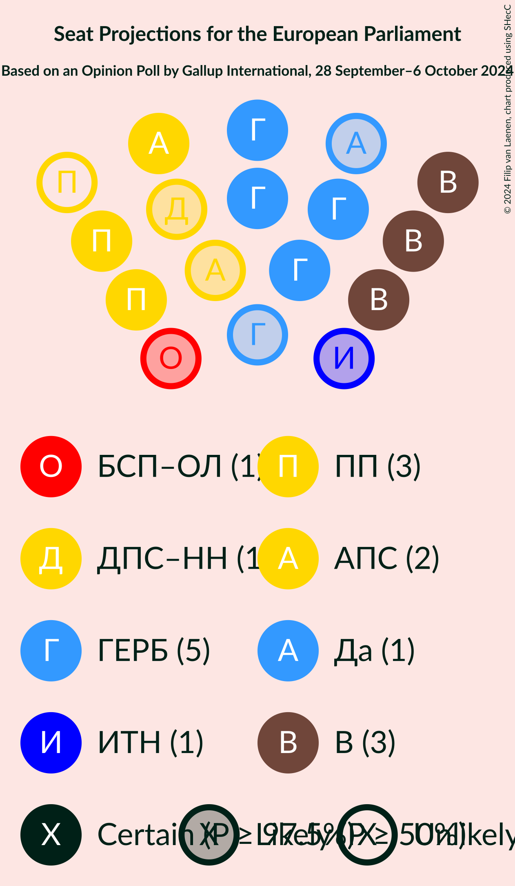
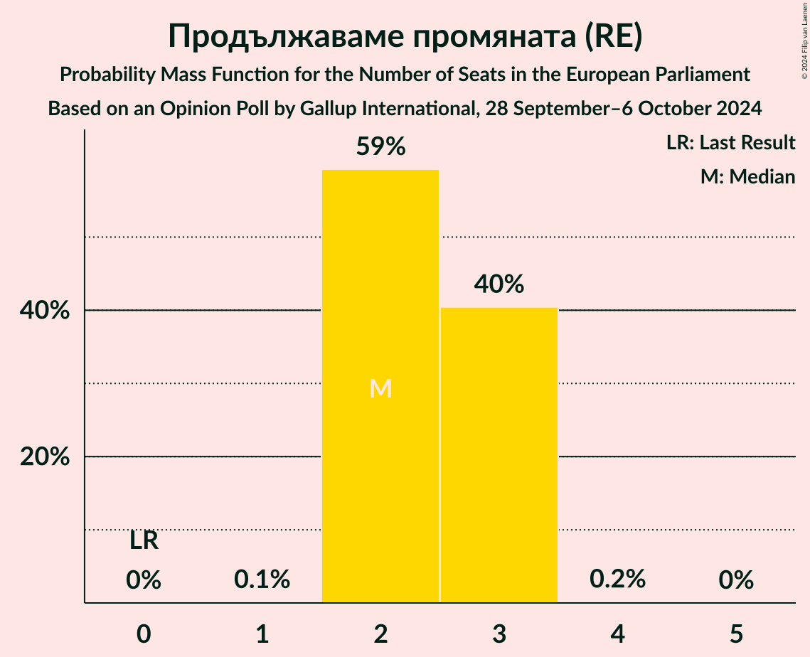
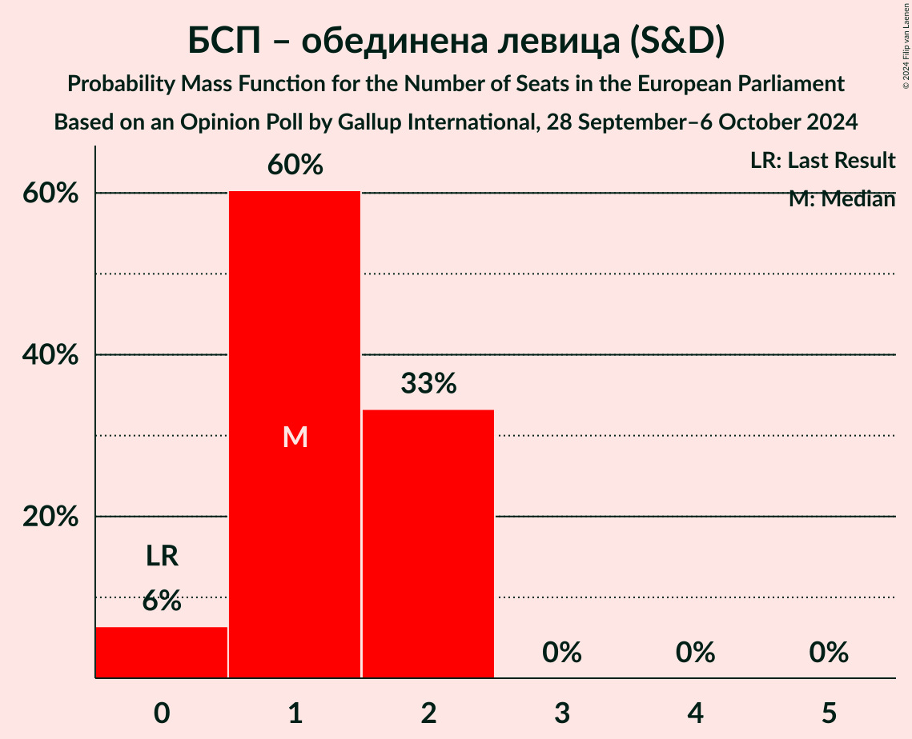
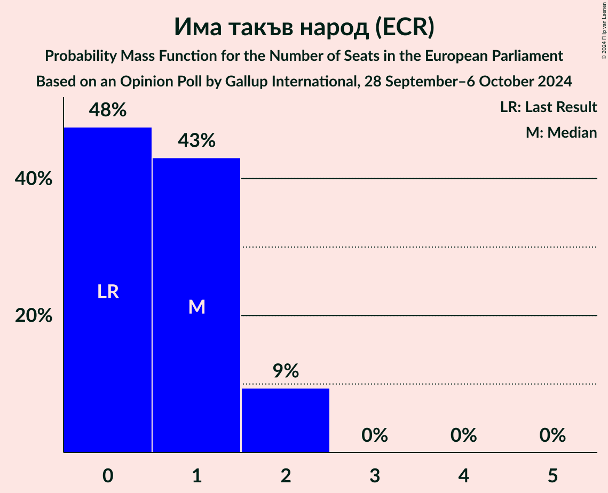
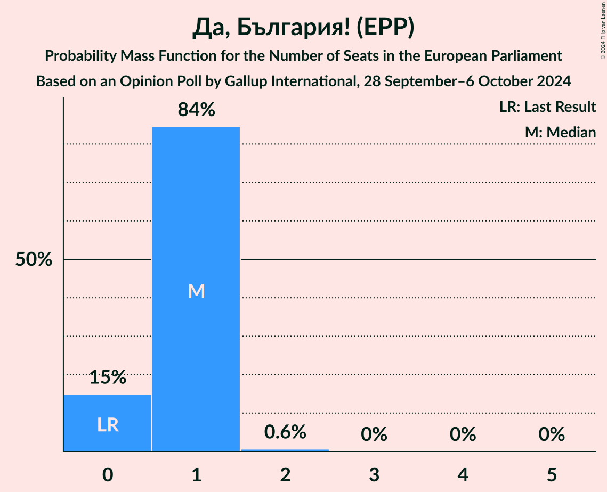
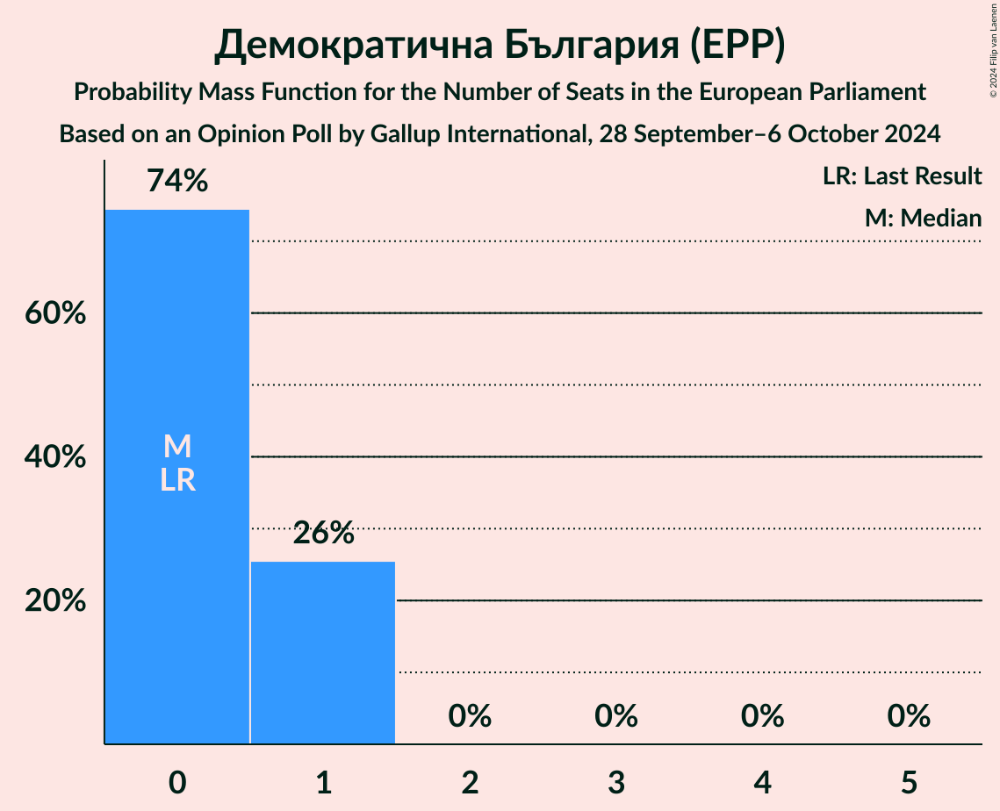

# Opinion Poll by Gallup International, 28 September–6 October 2024

<a href="#voting-intentions">Voting Intentions</a> | <a href="#seats">Seats</a> | <a href="#coalitions">Coalitions</a> | <a href="#technical-information">Technical Information</a>

## Voting Intentions

### Confidence Intervals

| Party | Last Result | Poll Result | 80% Confidence Interval | 90% Confidence Interval | 95% Confidence Interval | 99% Confidence Interval |
|:-----:|:-----------:|:-----------:|:-----------------------:|:-----------------------:|:-----------------------:|:-----------------------:|
| Граждани за европейско развитие на България (EPP) | 0.0% | 25.7% | 23.8–27.7% |23.2–28.3% |22.8–28.8% |21.9–29.8% |
| Възраждане (ESN) | 0.0% | 15.4% | 13.9–17.1% |13.4–17.6% |13.0–18.0% |12.3–18.9% |
| Продължаваме промяната (RE) | 0.0% | 9.9% | 8.7–11.4% |8.3–11.8% |8.0–12.2% |7.5–12.9% |
| Алианс за права и свободи (RE) | 0.0% | 8.3% | 7.2–9.7% |6.9–10.1% |6.6–10.4% |6.1–11.1% |
| БСП – обединена левица (S&D) | 0.0% | 7.1% | 6.0–8.4% |5.7–8.7% |5.5–9.1% |5.0–9.7% |
| Движение за права и свободи – Ново начало (RE) | 0.0% | 6.9% | 5.9–8.2% |5.6–8.6% |5.4–8.9% |4.9–9.6% |
| Има такъв народ (ECR) | 0.0% | 6.3% | 5.3–7.6% |5.1–7.9% |4.8–8.2% |4.4–8.9% |
| Морал, Единство, Чест (*) | 0.0% | 3.8% | 3.1–4.9% |2.9–5.2% |2.7–5.4% |2.4–5.9% |
| Да, България! (EPP) | 0.0% | 3.8% | 3.1–4.9% |2.9–5.2% |2.7–5.4% |2.4–5.9% |
| Величие (*) | 0.0% | 3.2% | 2.5–4.2% |2.4–4.5% |2.2–4.7% |1.9–5.2% |
| Демократична България (EPP) | 0.0% | 2.9% | 2.2–3.8% |2.1–4.0% |1.9–4.3% |1.6–4.7% |
| Синя България (ECR) | 0.0% | 1.1% | 0.8–1.8% |0.7–2.0% |0.6–2.1% |0.5–2.5% |

*Note:* The poll result column reflects the actual value used in the calculations. Published results may vary slightly, and in addition be rounded to fewer digits.

## Seats

### Confidence Intervals

| Party | Last Result | Median | 80% Confidence Interval | 90% Confidence Interval | 95% Confidence Interval | 99% Confidence Interval |
|:-----:|:-----------:|:------:|:-----------------------:|:-----------------------:|:-----------------------:|:-----------------------:|
| <a href="#граждани-за-европейско-развитие-на-българия-(epp)">Граждани за европейско развитие на България (EPP)</a> | 0 | 5 | 5–6 |5–6 |4–6 |4–6 |
| <a href="#възраждане-(esn)">Възраждане (ESN)</a> | 0 | 3 | 3–4 |3–4 |2–4 |2–4 |
| <a href="#продължаваме-промяната-(re)">Продължаваме промяната (RE)</a> | 0 | 2 | 2–3 |2–3 |2–3 |2–3 |
| <a href="#алианс-за-права-и-свободи-(re)">Алианс за права и свободи (RE)</a> | 0 | 2 | 1–2 |1–2 |1–2 |1–2 |
| <a href="#бсп-–-обединена-левица-(s&d)">БСП – обединена левица (S&D)</a> | 0 | 1 | 1–2 |1–2 |0–2 |0–2 |
| <a href="#движение-за-права-и-свободи-–-ново-начало-(re)">Движение за права и свободи – Ново начало (RE)</a> | 0 | 1 | 0–2 |0–2 |0–2 |0–2 |
| <a href="#има-такъв-народ-(ecr)">Има такъв народ (ECR)</a> | 0 | 1 | 0–1 |0–2 |0–2 |0–2 |
| <a href="#морал,-единство,-чест-(*)">Морал, Единство, Чест (*)</a> | 0 | 0 | 0 |0 |0 |0–1 |
| <a href="#да,-българия!-(epp)">Да, България! (EPP)</a> | 0 | 1 | 0–1 |0–1 |0–1 |0–1 |
| <a href="#величие-(*)">Величие (*)</a> | 0 | 0 | 0 |0 |0 |0 |
| <a href="#демократична-българия-(epp)">Демократична България (EPP)</a> | 0 | 0 | 0–1 |0–1 |0–1 |0–1 |
| <a href="#синя-българия-(ecr)">Синя България (ECR)</a> | 0 | 0 | 0 |0 |0 |0 |

### Граждани за европейско развитие на България (EPP)

*For a full overview of the results for this party, see the [Граждани за европейско развитие на България (EPP)](party-гражданизаевропейскоразвитиенабългарияepp.html) page.*

| Number of Seats | Probability | Accumulated | Special Marks |
|:---------------:|:-----------:|:-----------:|:-------------:|
| 0 | 0% | 100% | Last Result |
| 1 | 0% | 100% |  |
| 2 | 0% | 100% |  |
| 3 | 0% | 100% |  |
| 4 | 4% | 100% |  |
| 5 | 69% | 96% | Median |
| 6 | 27% | 27% |  |
| 7 | 0% | 0% |  |

### Възраждане (ESN)

*For a full overview of the results for this party, see the [Възраждане (ESN)](party-възражданеesn.html) page.*

| Number of Seats | Probability | Accumulated | Special Marks |
|:---------------:|:-----------:|:-----------:|:-------------:|
| 0 | 0% | 100% | Last Result |
| 1 | 0% | 100% |  |
| 2 | 3% | 100% |  |
| 3 | 84% | 97% | Median |
| 4 | 13% | 13% |  |
| 5 | 0% | 0% |  |

### Продължаваме промяната (RE)

*For a full overview of the results for this party, see the [Продължаваме промяната (RE)](party-продължавамепромянатаre.html) page.*

| Number of Seats | Probability | Accumulated | Special Marks |
|:---------------:|:-----------:|:-----------:|:-------------:|
| 0 | 0% | 100% | Last Result |
| 1 | 0.1% | 100% |  |
| 2 | 79% | 99.9% | Median |
| 3 | 21% | 21% |  |
| 4 | 0.1% | 0.1% |  |
| 5 | 0% | 0% |  |

### Алианс за права и свободи (RE)

*For a full overview of the results for this party, see the [Алианс за права и свободи (RE)](party-алиансзаправаисвободиre.html) page.*

| Number of Seats | Probability | Accumulated | Special Marks |
|:---------------:|:-----------:|:-----------:|:-------------:|
| 0 | 0.1% | 100% | Last Result |
| 1 | 27% | 99.9% |  |
| 2 | 73% | 73% | Median |
| 3 | 0% | 0% |  |

### БСП – обединена левица (S&D)

*For a full overview of the results for this party, see the [БСП – обединена левица (S&D)](party-бсп–обединеналевицаsd.html) page.*

| Number of Seats | Probability | Accumulated | Special Marks |
|:---------------:|:-----------:|:-----------:|:-------------:|
| 0 | 5% | 100% | Last Result |
| 1 | 55% | 95% | Median |
| 2 | 40% | 40% |  |
| 3 | 0% | 0% |  |

### Движение за права и свободи – Ново начало (RE)

*For a full overview of the results for this party, see the [Движение за права и свободи – Ново начало (RE)](party-движениезаправаисвободи–новоначалоre.html) page.*

| Number of Seats | Probability | Accumulated | Special Marks |
|:---------------:|:-----------:|:-----------:|:-------------:|
| 0 | 12% | 100% | Last Result |
| 1 | 55% | 88% | Median |
| 2 | 33% | 33% |  |
| 3 | 0% | 0% |  |

### Има такъв народ (ECR)

*For a full overview of the results for this party, see the [Има такъв народ (ECR)](party-иматакъвнародecr.html) page.*

| Number of Seats | Probability | Accumulated | Special Marks |
|:---------------:|:-----------:|:-----------:|:-------------:|
| 0 | 45% | 100% | Last Result |
| 1 | 48% | 55% | Median |
| 2 | 7% | 7% |  |
| 3 | 0% | 0% |  |

### Морал, Единство, Чест (*)

*For a full overview of the results for this party, see the [Морал, Единство, Чест (*)](party-моралединствочест.html) page.*

| Number of Seats | Probability | Accumulated | Special Marks |
|:---------------:|:-----------:|:-----------:|:-------------:|
| 0 | 99.4% | 100% | Last Result, Median |
| 1 | 0.6% | 0.6% |  |
| 2 | 0% | 0% |  |

### Да, България! (EPP)

*For a full overview of the results for this party, see the [Да, България! (EPP)](party-дабългарияepp.html) page.*

| Number of Seats | Probability | Accumulated | Special Marks |
|:---------------:|:-----------:|:-----------:|:-------------:|
| 0 | 17% | 100% | Last Result |
| 1 | 83% | 83% | Median |
| 2 | 0.1% | 0.1% |  |
| 3 | 0% | 0% |  |

### Величие (*)

*For a full overview of the results for this party, see the [Величие (*)](party-величие.html) page.*

| Number of Seats | Probability | Accumulated | Special Marks |
|:---------------:|:-----------:|:-----------:|:-------------:|
| 0 | 100% | 100% | Last Result, Median |

### Демократична България (EPP)

*For a full overview of the results for this party, see the [Демократична България (EPP)](party-демократичнабългарияepp.html) page.*

| Number of Seats | Probability | Accumulated | Special Marks |
|:---------------:|:-----------:|:-----------:|:-------------:|
| 0 | 61% | 100% | Last Result, Median |
| 1 | 39% | 39% |  |
| 2 | 0% | 0% |  |

### Синя България (ECR)

*For a full overview of the results for this party, see the [Синя България (ECR)](party-синябългарияecr.html) page.*

| Number of Seats | Probability | Accumulated | Special Marks |
|:---------------:|:-----------:|:-----------:|:-------------:|
| 0 | 100% | 100% | Last Result, Median |

## Coalitions

### Confidence Intervals

| Coalition | Last Result | Median | Majority? | 80% Confidence Interval | 90% Confidence Interval | 95% Confidence Interval | 99% Confidence Interval |
|:---------:|:-----------:|:------:|:---------:|:-----------------------:|:-----------------------:|:-----------------------:|:-----------------------:|
| Възраждане (ESN) | 0 | 3 | 0% | 3–4 | 3–4 | 2–4 | 2–4 |

### Възраждане (ESN)

| Number of Seats | Probability | Accumulated | Special Marks |
|:---------------:|:-----------:|:-----------:|:-------------:|
| 0 | 0% | 100% | Last Result |
| 1 | 0% | 100% |  |
| 2 | 3% | 100% |  |
| 3 | 84% | 97% | Median |
| 4 | 13% | 13% |  |
| 5 | 0% | 0% |  |

## Technical Information

### Opinion Poll

+ **Polling firm:** Gallup International
+ **Commissioner(s):** —
+ **Fieldwork period:** 28 September–6 October 2024

### Calculations

+ **Sample size:** 806
+ **Simulations done:** 1,048,576
+ **Error estimate:** 1.77%

