# Poll Average

<a href="#voting-intentions">Voting Intentions</a> | <a href="#seats">Seats</a> | <a href="#coalitions">Coalitions</a> | <a href="#technical-information">Technical Information</a>

## Summary

The table below lists the polls on which the average is based. They are the most recent polls (less than 90 days old) registered and analyzed so far.

| Period     | Polling firm/Commissioner(s) | ГЕРБ | БСП | ДПС | ОП | ВМРО | НФСБ | Атака | РБ | Воля | ДБ | ДСБ | Да | АБВ | НТД |
|:----------:|:----------------------------:|:--:|:--:|:--:|:--:|:--:|:--:|:--:|:--:|:--:|:--:|:--:|:--:|:--:|:--:|
| 26 May 2019 | General Election | 30.4%   6 | 18.9%   4 | 17.3%   4 | 10.7%   2 | 10.7%   1 | 10.7%   1 | 10.7%   0 | 6.4%   1 | 0.0%   0 | 0.0%   0 | 0.0%   0 | 0.0%   0 | 0.0%   0 | 0.0%   0 |
| N/A | Poll Average | 28–38%   5–7 | 24–30%   4–6 | 10–15%   2–3 | 4–8%   0–2 | 4–6%   0–1 | N/A   N/A | 2–4%   0 | N/A   N/A | 1–4%   0 | 4–9%   0–2 | N/A   N/A | N/A   N/A | N/A   N/A | 7–15%   1–3 |
| [21–28 November 2019](2019-11-28-МаркетЛИНКС.html) | Маркет ЛИНКС | 27–33%   5–6 | 24–30%   4–5 | 11–15%   2–3 | 6–9%   1–2 | N/A   N/A | N/A   N/A | N/A   N/A | N/A   N/A | 1–3%   0 | 6–10%   1–2 | N/A   N/A | N/A   N/A | N/A   N/A | 11–15%   2–3 |
| [7–15 November 2019](2019-11-15-Тренд.html) | Тренд | 33–39%   6–8 | 25–31%   5–6 | 10–14%   2–3 | N/A   N/A | 4–6%   0–1 | N/A   N/A | N/A   N/A | N/A   N/A | 1–3%   0 | 4–6%   0–1 | N/A   N/A | N/A   N/A | N/A   N/A | 7–10%   1–2 |
| [10–16 September 2019](2019-09-16-Алфарисърч.html) | Алфа рисърч | 28–33%   5–7 | 24–29%   5–6 | 10–14%   2–3 | 4–6%   0–1 | N/A   N/A | N/A   N/A | 2–4%   0 | N/A   N/A | 2–4%   0 | 4–7%   0–2 | N/A   N/A | N/A   N/A | N/A   N/A | 9–13%   2–3 |
| 26 May 2019 | General Election | 30.4%   6 | 18.9%   4 | 17.3%   4 | 10.7%   2 | 10.7%   1 | 10.7%   1 | 10.7%   0 | 6.4%   1 | 0.0%   0 | 0.0%   0 | 0.0%   0 | 0.0%   0 | 0.0%   0 | 0.0%   0 |

Only polls for which at least the sample size has been published are included in the table above.

**Legend:**
+ **Top half of each row:** Voting intentions (95% confidence interval)
+ **Bottom half of each row:** Seat projections for the European Parliament (95% confidence interval)
+ **ГЕРБ:** Граждани за европейско развитие на България (EPP)
+ **БСП:** Българска социалистическа партия (S&D)
+ **ДПС:** Движение за права и свободи (RE)
+ **ОП:** Обединени Патриоти (ECR)
+ **ВМРО:** ВМРО–Българско Национално Движение (ECR)
+ **НФСБ:** Национален фронт за спасение на България (*)
+ **Атака:** Атака (NI)
+ **РБ:** Реформаторски блок (EPP)
+ **Воля:** Воля (ID)
+ **ДБ:** Демократична България (EPP)
+ **ДСБ:** Демократи за силна България (EPP)
+ **Да:** Да, България! (*)
+ **АБВ:** Алтернатива за българско възраждане (S&D)
+ **НТД:** Няма такава държава (*)
+ **N/A (single party):** Party not included the published results
+ **N/A (entire row):** Calculation for this opinion poll not started yet

## Voting Intentions

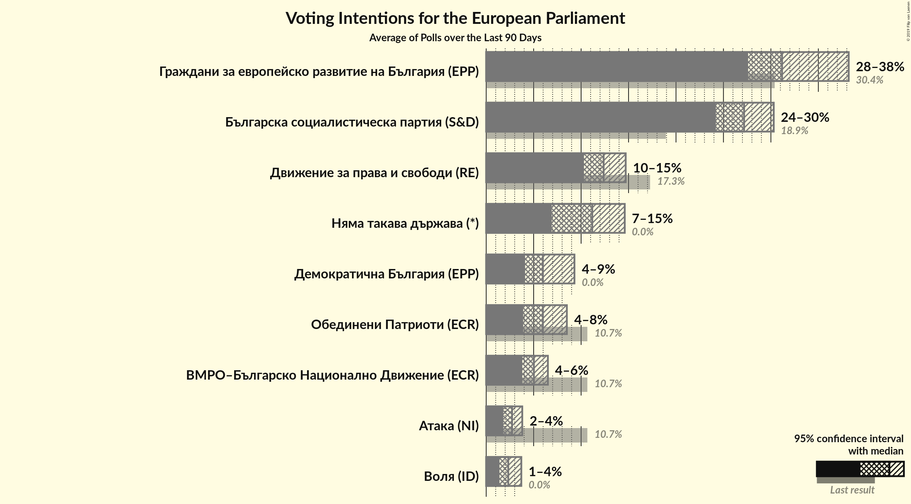

### Confidence Intervals

| Party | Last Result | Median | 80% Confidence Interval | 90% Confidence Interval | 95% Confidence Interval | 99% Confidence Interval |
|:-----:|:-----------:|:------:|:-----------------------:|:-----------------------:|:-----------------------:|:-----------------------:|
| <a href="#граждани-за-европейско-развитие-на-българия-(epp)">Граждани за европейско развитие на България (EPP)</a> | 30.4% | 31.2% | 28.7–36.8% |28.1–37.6% | 27.6–38.2% | 26.7–39.3% |
| <a href="#българска-социалистическа-партия-(s&d)">Българска социалистическа партия (S&D)</a> | 18.9% | 27.2% | 25.2–29.2% |24.7–29.8% | 24.2–30.3% | 23.4–31.2% |
| <a href="#движение-за-права-и-свободи-(re)">Движение за права и свободи (RE)</a> | 17.3% | 12.4% | 11.0–13.9% |10.7–14.3% | 10.3–14.7% | 9.8–15.5% |
| <a href="#обединени-патриоти-(ecr)">Обединени Патриоти (ECR)</a> | 10.7% | 6.0% | 4.4–7.8% |4.1–8.2% | 3.9–8.5% | 3.5–9.2% |
| <a href="#вмро–българско-национално-движение-(ecr)">ВМРО–Българско Национално Движение (ECR)</a> | 10.7% | 5.0% | 4.2–6.0% |4.0–6.2% | 3.8–6.5% | 3.5–7.0% |
| <a href="#национален-фронт-за-спасение-на-българия-(*)">Национален фронт за спасение на България (*)</a> | 10.7% | N/A | N/A |N/A | N/A | N/A |
| <a href="#атака-(ni)">Атака (NI)</a> | 10.7% | 2.7% | 2.1–3.4% |1.9–3.6% | 1.8–3.8% | 1.6–4.2% |
| <a href="#реформаторски-блок-(epp)">Реформаторски блок (EPP)</a> | 6.4% | N/A | N/A |N/A | N/A | N/A |
| <a href="#воля-(id)">Воля (ID)</a> | 0.0% | 2.3% | 1.6–3.2% |1.5–3.5% | 1.4–3.7% | 1.2–4.2% |
| <a href="#демократична-българия-(epp)">Демократична България (EPP)</a> | 0.0% | 6.0% | 4.6–8.5% |4.3–8.9% | 4.1–9.3% | 3.7–10.0% |
| <a href="#демократи-за-силна-българия-(epp)">Демократи за силна България (EPP)</a> | 0.0% | N/A | N/A |N/A | N/A | N/A |
| <a href="#да,-българия!-(*)">Да, България! (*)</a> | 0.0% | N/A | N/A |N/A | N/A | N/A |
| <a href="#алтернатива-за-българско-възраждане-(s&d)">Алтернатива за българско възраждане (S&D)</a> | 0.0% | N/A | N/A |N/A | N/A | N/A |
| <a href="#няма-такава-държава-(*)">Няма такава държава (*)</a> | 0.0% | 11.2% | 7.6–13.6% |7.2–14.2% | 6.9–14.6% | 6.4–15.5% |

### Граждани за европейско развитие на България (EPP)

*For a full overview of the results for this party, see the [Граждани за европейско развитие на България (EPP)](party-гражданизаевропейскоразвитиенабългарияepp.html) page.*

| Voting Intentions | Probability | Accumulated | Special Marks |
|:-----------------:|:-----------:|:-----------:|:-------------:|
| 24.5–25.5% | 0% | 100% |  |
| 25.5–26.5% | 0.3% | 100% |  |
| 26.5–27.5% | 2% | 99.6% |  |
| 27.5–28.5% | 6% | 98% |  |
| 28.5–29.5% | 14% | 91% |  |
| 29.5–30.5% | 18% | 78% | Last Result |
| 30.5–31.5% | 15% | 60% | Median |
| 31.5–32.5% | 8% | 45% |  |
| 32.5–33.5% | 4% | 37% |  |
| 33.5–34.5% | 4% | 32% |  |
| 34.5–35.5% | 7% | 28% |  |
| 35.5–36.5% | 9% | 21% |  |
| 36.5–37.5% | 7% | 12% |  |
| 37.5–38.5% | 4% | 5% |  |
| 38.5–39.5% | 1.3% | 2% |  |
| 39.5–40.5% | 0.3% | 0.4% |  |
| 40.5–41.5% | 0% | 0.1% |  |
| 41.5–42.5% | 0% | 0% |  |

### Българска социалистическа партия (S&D)

*For a full overview of the results for this party, see the [Българска социалистическа партия (S&D)](party-българскасоциалистическапартияsd.html) page.*

| Voting Intentions | Probability | Accumulated | Special Marks |
|:-----------------:|:-----------:|:-----------:|:-------------:|
| 18.5–19.5% | 0% | 100% | Last Result |
| 19.5–20.5% | 0% | 100% |  |
| 20.5–21.5% | 0% | 100% |  |
| 21.5–22.5% | 0.1% | 100% |  |
| 22.5–23.5% | 0.7% | 99.9% |  |
| 23.5–24.5% | 3% | 99.3% |  |
| 24.5–25.5% | 10% | 96% |  |
| 25.5–26.5% | 20% | 85% |  |
| 26.5–27.5% | 25% | 65% | Median |
| 27.5–28.5% | 21% | 40% |  |
| 28.5–29.5% | 12% | 19% |  |
| 29.5–30.5% | 5% | 7% |  |
| 30.5–31.5% | 1.4% | 2% |  |
| 31.5–32.5% | 0.2% | 0.3% |  |
| 32.5–33.5% | 0% | 0% |  |

### Движение за права и свободи (RE)

*For a full overview of the results for this party, see the [Движение за права и свободи (RE)](party-движениезаправаисвободиre.html) page.*

| Voting Intentions | Probability | Accumulated | Special Marks |
|:-----------------:|:-----------:|:-----------:|:-------------:|
| 7.5–8.5% | 0% | 100% |  |
| 8.5–9.5% | 0.3% | 100% |  |
| 9.5–10.5% | 4% | 99.7% |  |
| 10.5–11.5% | 18% | 96% |  |
| 11.5–12.5% | 33% | 78% | Median |
| 12.5–13.5% | 29% | 45% |  |
| 13.5–14.5% | 13% | 16% |  |
| 14.5–15.5% | 3% | 4% |  |
| 15.5–16.5% | 0.4% | 0.5% |  |
| 16.5–17.5% | 0% | 0% | Last Result |

### Обединени Патриоти (ECR)

*For a full overview of the results for this party, see the [Обединени Патриоти (ECR)](party-обединенипатриотиecr.html) page.*

| Voting Intentions | Probability | Accumulated | Special Marks |
|:-----------------:|:-----------:|:-----------:|:-------------:|
| 1.5–2.5% | 0% | 100% |  |
| 2.5–3.5% | 0.6% | 100% |  |
| 3.5–4.5% | 13% | 99.4% |  |
| 4.5–5.5% | 27% | 86% |  |
| 5.5–6.5% | 20% | 59% | Median |
| 6.5–7.5% | 24% | 38% |  |
| 7.5–8.5% | 12% | 15% |  |
| 8.5–9.5% | 2% | 2% |  |
| 9.5–10.5% | 0.2% | 0.2% |  |
| 10.5–11.5% | 0% | 0% | Last Result |

### ВМРО–Българско Национално Движение (ECR)

*For a full overview of the results for this party, see the [ВМРО–Българско Национално Движение (ECR)](party-вмро–българсконационалнодвижениеecr.html) page.*

| Voting Intentions | Probability | Accumulated | Special Marks |
|:-----------------:|:-----------:|:-----------:|:-------------:|
| 1.5–2.5% | 0% | 100% |  |
| 2.5–3.5% | 0.9% | 100% |  |
| 3.5–4.5% | 24% | 99.1% |  |
| 4.5–5.5% | 53% | 76% | Median |
| 5.5–6.5% | 21% | 23% |  |
| 6.5–7.5% | 2% | 2% |  |
| 7.5–8.5% | 0.1% | 0.1% |  |
| 8.5–9.5% | 0% | 0% |  |
| 9.5–10.5% | 0% | 0% |  |
| 10.5–11.5% | 0% | 0% | Last Result |

### Атака (NI)

*For a full overview of the results for this party, see the [Атака (NI)](party-атакаni.html) page.*

| Voting Intentions | Probability | Accumulated | Special Marks |
|:-----------------:|:-----------:|:-----------:|:-------------:|
| 0.0–0.5% | 0% | 100% |  |
| 0.5–1.5% | 0.4% | 100% |  |
| 1.5–2.5% | 37% | 99.6% |  |
| 2.5–3.5% | 56% | 62% | Median |
| 3.5–4.5% | 6% | 6% |  |
| 4.5–5.5% | 0.1% | 0.1% |  |
| 5.5–6.5% | 0% | 0% |  |
| 6.5–7.5% | 0% | 0% |  |
| 7.5–8.5% | 0% | 0% |  |
| 8.5–9.5% | 0% | 0% |  |
| 9.5–10.5% | 0% | 0% |  |
| 10.5–11.5% | 0% | 0% | Last Result |

### Воля (ID)

*For a full overview of the results for this party, see the [Воля (ID)](party-воляid.html) page.*

| Voting Intentions | Probability | Accumulated | Special Marks |
|:-----------------:|:-----------:|:-----------:|:-------------:|
| 0.0–0.5% | 0% | 100% | Last Result |
| 0.5–1.5% | 7% | 100% |  |
| 1.5–2.5% | 57% | 93% | Median |
| 2.5–3.5% | 32% | 36% |  |
| 3.5–4.5% | 4% | 4% |  |
| 4.5–5.5% | 0.1% | 0.1% |  |
| 5.5–6.5% | 0% | 0% |  |

### Демократична България (EPP)

*For a full overview of the results for this party, see the [Демократична България (EPP)](party-демократичнабългарияepp.html) page.*

| Voting Intentions | Probability | Accumulated | Special Marks |
|:-----------------:|:-----------:|:-----------:|:-------------:|
| 0.0–0.5% | 0% | 100% | Last Result |
| 0.5–1.5% | 0% | 100% |  |
| 1.5–2.5% | 0% | 100% |  |
| 2.5–3.5% | 0.3% | 100% |  |
| 3.5–4.5% | 9% | 99.7% |  |
| 4.5–5.5% | 28% | 91% |  |
| 5.5–6.5% | 24% | 63% | Median |
| 6.5–7.5% | 14% | 38% |  |
| 7.5–8.5% | 15% | 24% |  |
| 8.5–9.5% | 8% | 9% |  |
| 9.5–10.5% | 1.4% | 2% |  |
| 10.5–11.5% | 0.1% | 0.1% |  |
| 11.5–12.5% | 0% | 0% |  |

### Няма такава държава (*)

*For a full overview of the results for this party, see the [Няма такава държава (*)](party-няматакавадържава.html) page.*

| Voting Intentions | Probability | Accumulated | Special Marks |
|:-----------------:|:-----------:|:-----------:|:-------------:|
| 0.0–0.5% | 0% | 100% | Last Result |
| 0.5–1.5% | 0% | 100% |  |
| 1.5–2.5% | 0% | 100% |  |
| 2.5–3.5% | 0% | 100% |  |
| 3.5–4.5% | 0% | 100% |  |
| 4.5–5.5% | 0% | 100% |  |
| 5.5–6.5% | 0.9% | 100% |  |
| 6.5–7.5% | 8% | 99.1% |  |
| 7.5–8.5% | 15% | 91% |  |
| 8.5–9.5% | 9% | 77% |  |
| 9.5–10.5% | 8% | 67% |  |
| 10.5–11.5% | 15% | 59% | Median |
| 11.5–12.5% | 18% | 44% |  |
| 12.5–13.5% | 15% | 26% |  |
| 13.5–14.5% | 8% | 11% |  |
| 14.5–15.5% | 2% | 3% |  |
| 15.5–16.5% | 0.4% | 0.4% |  |
| 16.5–17.5% | 0% | 0% |  |

## Seats

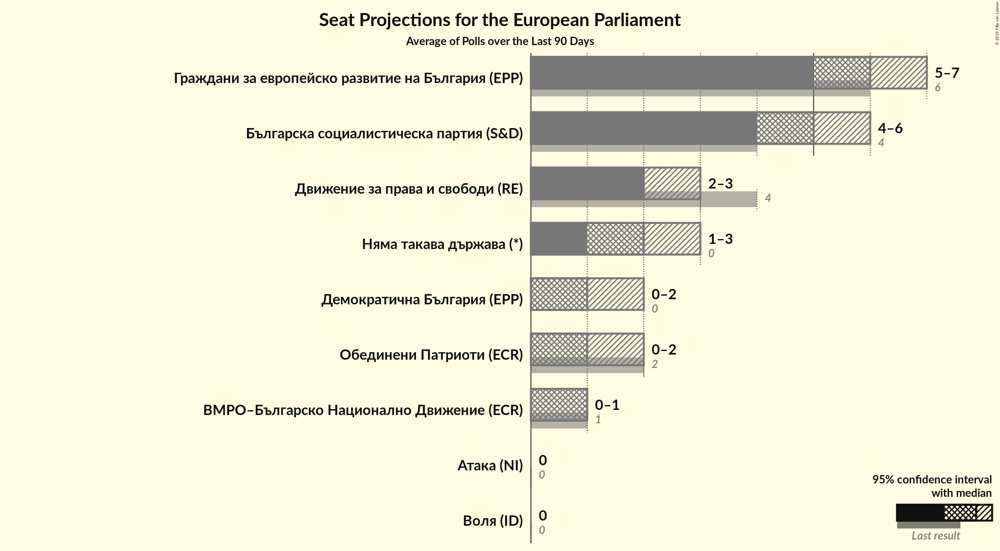

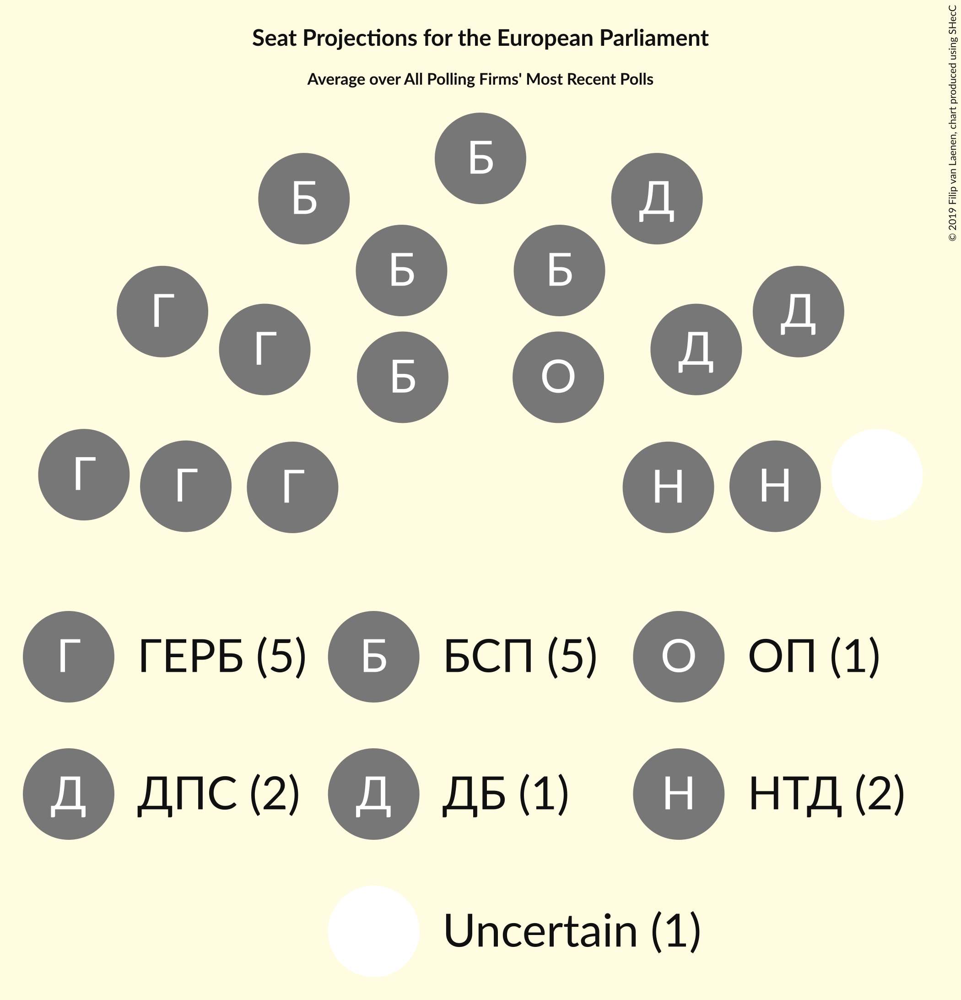

### Confidence Intervals

| Party | Last Result | Median | 80% Confidence Interval | 90% Confidence Interval | 95% Confidence Interval | 99% Confidence Interval |
|:-----:|:-----------:|:------:|:-----------------------:|:-----------------------:|:-----------------------:|:-----------------------:|
| <a href="#граждани-за-европейско-развитие-на-българия-(epp)">Граждани за европейско развитие на България (EPP)</a> | 6 | 6 | 5–7 |5–7 | 5–7 | 5–8 |
| <a href="#българска-социалистическа-партия-(s&d)">Българска социалистическа партия (S&D)</a> | 4 | 5 | 5–6 |4–6 | 4–6 | 4–6 |
| <a href="#движение-за-права-и-свободи-(re)">Движение за права и свободи (RE)</a> | 4 | 2 | 2–3 |2–3 | 2–3 | 2–3 |
| <a href="#обединени-патриоти-(ecr)">Обединени Патриоти (ECR)</a> | 2 | 1 | 0–1 |0–1 | 0–2 | 0–2 |
| <a href="#вмро–българско-национално-движение-(ecr)">ВМРО–Българско Национално Движение (ECR)</a> | 1 | 1 | 0–1 |0–1 | 0–1 | 0–1 |
| <a href="#национален-фронт-за-спасение-на-българия-(*)">Национален фронт за спасение на България (*)</a> | 1 | N/A | N/A |N/A | N/A | N/A |
| <a href="#атака-(ni)">Атака (NI)</a> | 0 | 0 | 0 |0 | 0 | 0 |
| <a href="#реформаторски-блок-(epp)">Реформаторски блок (EPP)</a> | 1 | N/A | N/A |N/A | N/A | N/A |
| <a href="#воля-(id)">Воля (ID)</a> | 0 | 0 | 0 |0 | 0 | 0 |
| <a href="#демократична-българия-(epp)">Демократична България (EPP)</a> | 0 | 1 | 0–2 |0–2 | 0–2 | 0–2 |
| <a href="#демократи-за-силна-българия-(epp)">Демократи за силна България (EPP)</a> | 0 | N/A | N/A |N/A | N/A | N/A |
| <a href="#да,-българия!-(*)">Да, България! (*)</a> | 0 | N/A | N/A |N/A | N/A | N/A |
| <a href="#алтернатива-за-българско-възраждане-(s&d)">Алтернатива за българско възраждане (S&D)</a> | 0 | N/A | N/A |N/A | N/A | N/A |
| <a href="#няма-такава-държава-(*)">Няма такава държава (*)</a> | 0 | 2 | 1–3 |1–3 | 1–3 | 1–3 |

### Граждани за европейско развитие на България (EPP)

*For a full overview of the results for this party, see the [Граждани за европейско развитие на България (EPP)](party-гражданизаевропейскоразвитиенабългарияepp.html) page.*

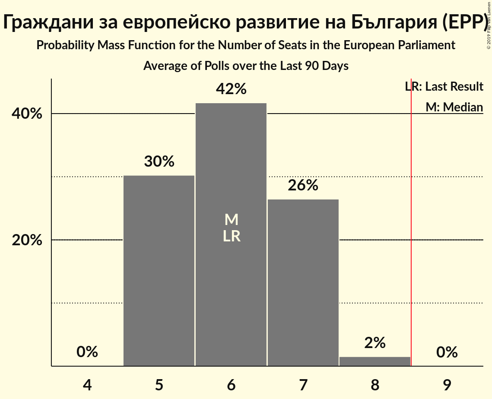

| Number of Seats | Probability | Accumulated | Special Marks |
|:---------------:|:-----------:|:-----------:|:-------------:|
| 5 | 30% | 100% |  |
| 6 | 42% | 70% | Last Result, Median |
| 7 | 26% | 28% |  |
| 8 | 2% | 2% |  |
| 9 | 0% | 0% | Majority |

### Българска социалистическа партия (S&D)

*For a full overview of the results for this party, see the [Българска социалистическа партия (S&D)](party-българскасоциалистическапартияsd.html) page.*

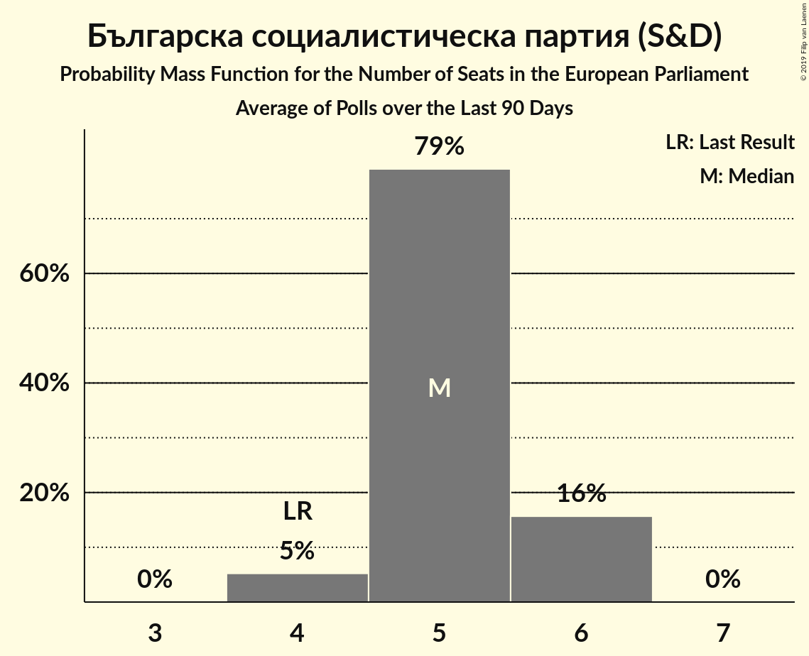

| Number of Seats | Probability | Accumulated | Special Marks |
|:---------------:|:-----------:|:-----------:|:-------------:|
| 4 | 5% | 100% | Last Result |
| 5 | 79% | 95% | Median |
| 6 | 16% | 16% |  |
| 7 | 0% | 0% |  |

### Движение за права и свободи (RE)

*For a full overview of the results for this party, see the [Движение за права и свободи (RE)](party-движениезаправаисвободиre.html) page.*

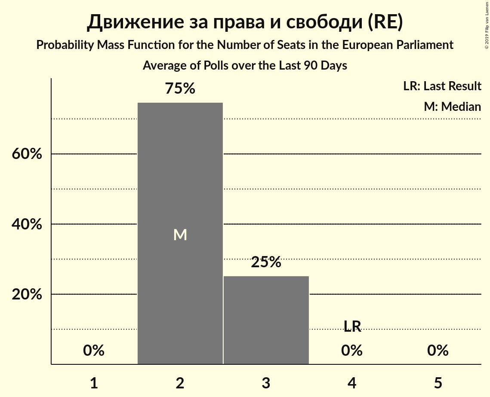

| Number of Seats | Probability | Accumulated | Special Marks |
|:---------------:|:-----------:|:-----------:|:-------------:|
| 2 | 75% | 100% | Median |
| 3 | 25% | 25% |  |
| 4 | 0% | 0% | Last Result |

### Обединени Патриоти (ECR)

*For a full overview of the results for this party, see the [Обединени Патриоти (ECR)](party-обединенипатриотиecr.html) page.*

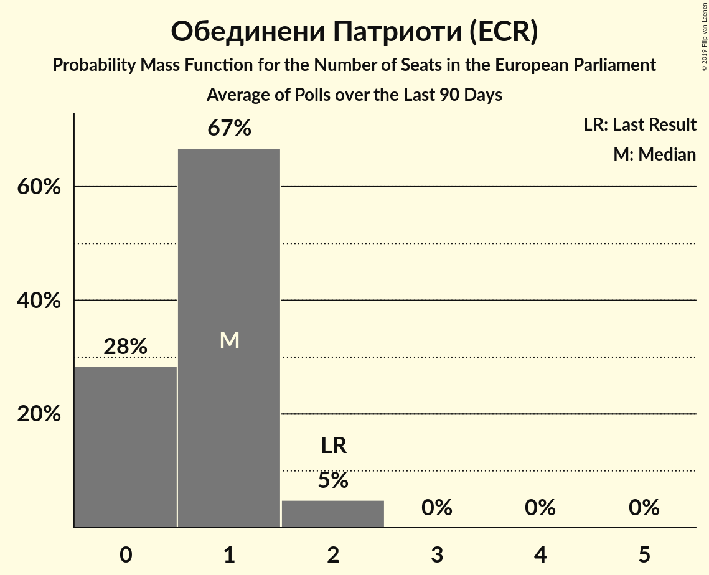

| Number of Seats | Probability | Accumulated | Special Marks |
|:---------------:|:-----------:|:-----------:|:-------------:|
| 0 | 28% | 100% |  |
| 1 | 67% | 72% | Median |
| 2 | 5% | 5% | Last Result |
| 3 | 0% | 0% |  |

### ВМРО–Българско Национално Движение (ECR)

*For a full overview of the results for this party, see the [ВМРО–Българско Национално Движение (ECR)](party-вмро–българсконационалнодвижениеecr.html) page.*

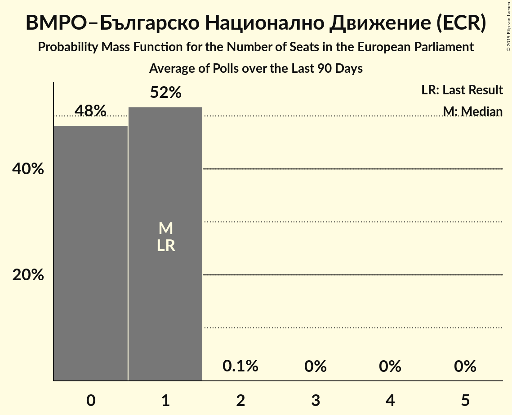

| Number of Seats | Probability | Accumulated | Special Marks |
|:---------------:|:-----------:|:-----------:|:-------------:|
| 0 | 48% | 100% |  |
| 1 | 52% | 52% | Last Result, Median |
| 2 | 0.1% | 0.1% |  |
| 3 | 0% | 0% |  |

### Атака (NI)

*For a full overview of the results for this party, see the [Атака (NI)](party-атакаni.html) page.*

| Number of Seats | Probability | Accumulated | Special Marks |
|:---------------:|:-----------:|:-----------:|:-------------:|
| 0 | 100% | 100% | Last Result, Median |

### Воля (ID)

*For a full overview of the results for this party, see the [Воля (ID)](party-воляid.html) page.*

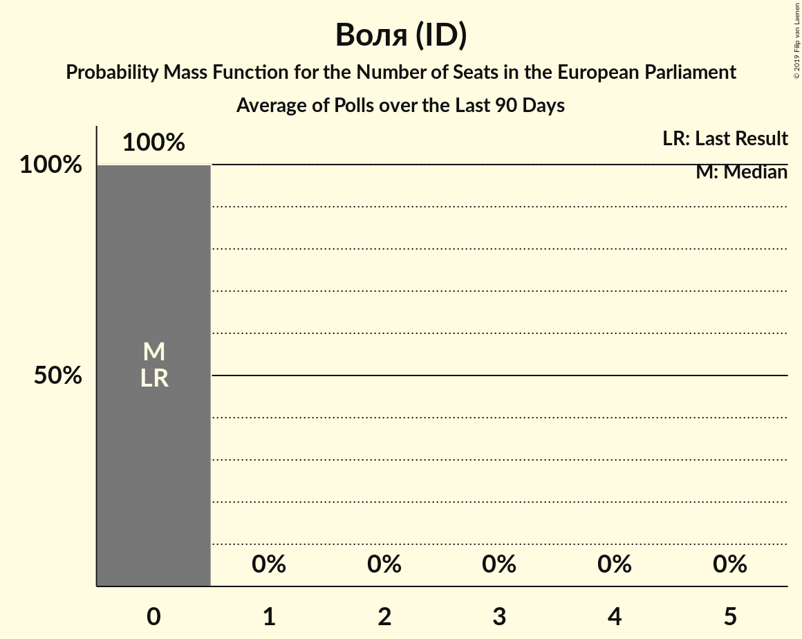

| Number of Seats | Probability | Accumulated | Special Marks |
|:---------------:|:-----------:|:-----------:|:-------------:|
| 0 | 100% | 100% | Last Result, Median |

### Демократична България (EPP)

*For a full overview of the results for this party, see the [Демократична България (EPP)](party-демократичнабългарияepp.html) page.*

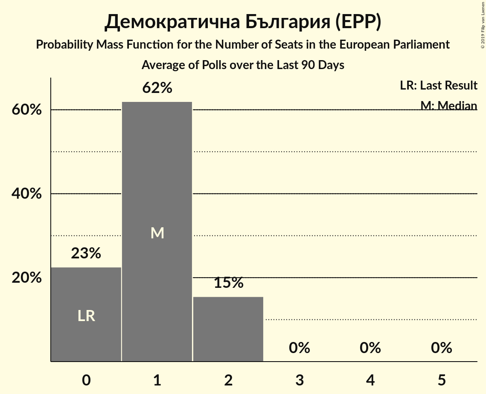

| Number of Seats | Probability | Accumulated | Special Marks |
|:---------------:|:-----------:|:-----------:|:-------------:|
| 0 | 23% | 100% | Last Result |
| 1 | 62% | 77% | Median |
| 2 | 15% | 15% |  |
| 3 | 0% | 0% |  |

### Няма такава държава (*)

*For a full overview of the results for this party, see the [Няма такава държава (*)](party-няматакавадържава.html) page.*

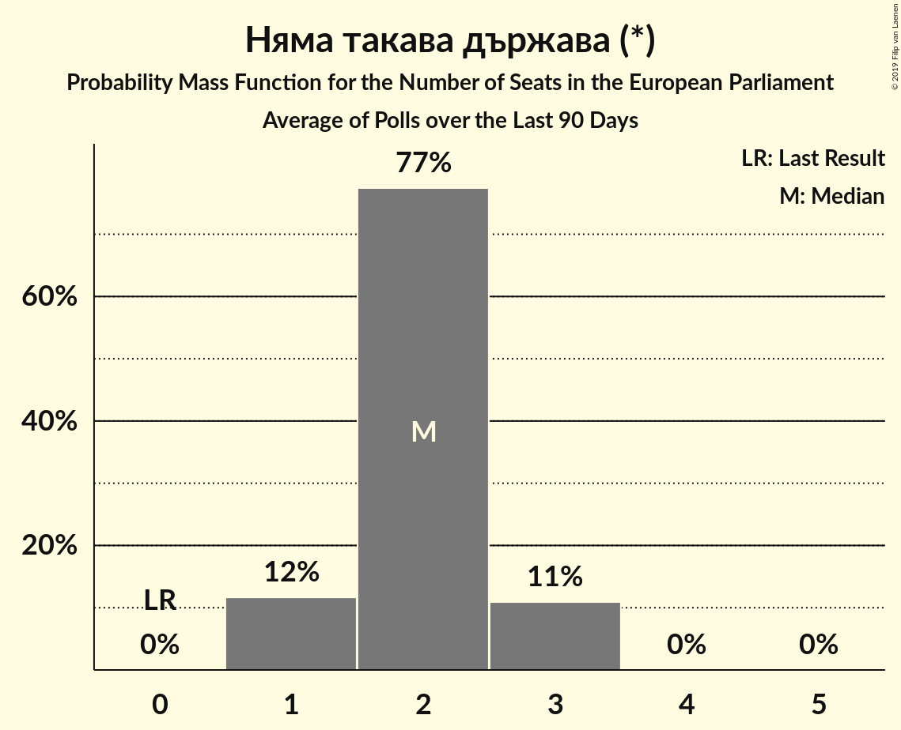

| Number of Seats | Probability | Accumulated | Special Marks |
|:---------------:|:-----------:|:-----------:|:-------------:|
| 0 | 0% | 100% | Last Result |
| 1 | 12% | 100% |  |
| 2 | 77% | 88% | Median |
| 3 | 11% | 11% |  |
| 4 | 0% | 0% |  |

## Coalitions

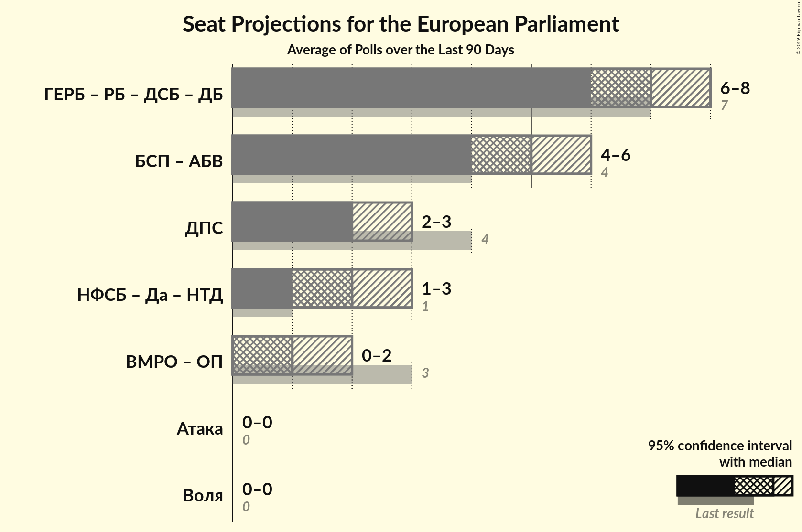

### Confidence Intervals

| Coalition | Last Result | Median | Majority? | 80% Confidence Interval | 90% Confidence Interval | 95% Confidence Interval | 99% Confidence Interval |
|:---------:|:-----------:|:------:|:---------:|:-----------------------:|:-----------------------:|:-----------------------:|:-----------------------:|
| Граждани за европейско развитие на България (EPP) – Реформаторски блок (EPP) – Демократи за силна България (EPP) – Демократична България (EPP) | 7 | 7 | 0.1% | 6–8 | 6–8 | 6–8 | 6–8 |
| Българска социалистическа партия (S&D) – Алтернатива за българско възраждане (S&D) | 4 | 5 | 0% | 5–6 | 4–6 | 4–6 | 4–6 |
| Движение за права и свободи (RE) | 4 | 2 | 0% | 2–3 | 2–3 | 2–3 | 2–3 |
| Национален фронт за спасение на България (*) – Да, България! (*) – Няма такава държава (*) | 1 | 2 | 0% | 1–3 | 1–3 | 1–3 | 1–3 |
| ВМРО–Българско Национално Движение (ECR) – Обединени Патриоти (ECR) | 3 | 1 | 0% | 0–1 | 0–1 | 0–2 | 0–2 |
| Атака (NI) | 0 | 0 | 0% | 0 | 0 | 0 | 0 |
| Воля (ID) | 0 | 0 | 0% | 0 | 0 | 0 | 0 |

### Граждани за европейско развитие на България (EPP) – Реформаторски блок (EPP) – Демократи за силна България (EPP) – Демократична България (EPP)

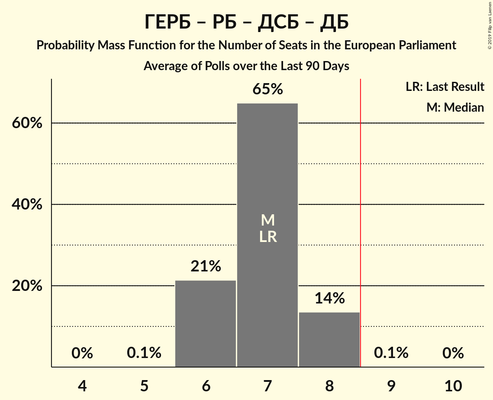

| Number of Seats | Probability | Accumulated | Special Marks |
|:---------------:|:-----------:|:-----------:|:-------------:|
| 5 | 0.1% | 100% |  |
| 6 | 21% | 99.9% |  |
| 7 | 65% | 79% | Last Result, Median |
| 8 | 14% | 14% |  |
| 9 | 0.1% | 0.1% | Majority |
| 10 | 0% | 0% |  |

### Българска социалистическа партия (S&D) – Алтернатива за българско възраждане (S&D)

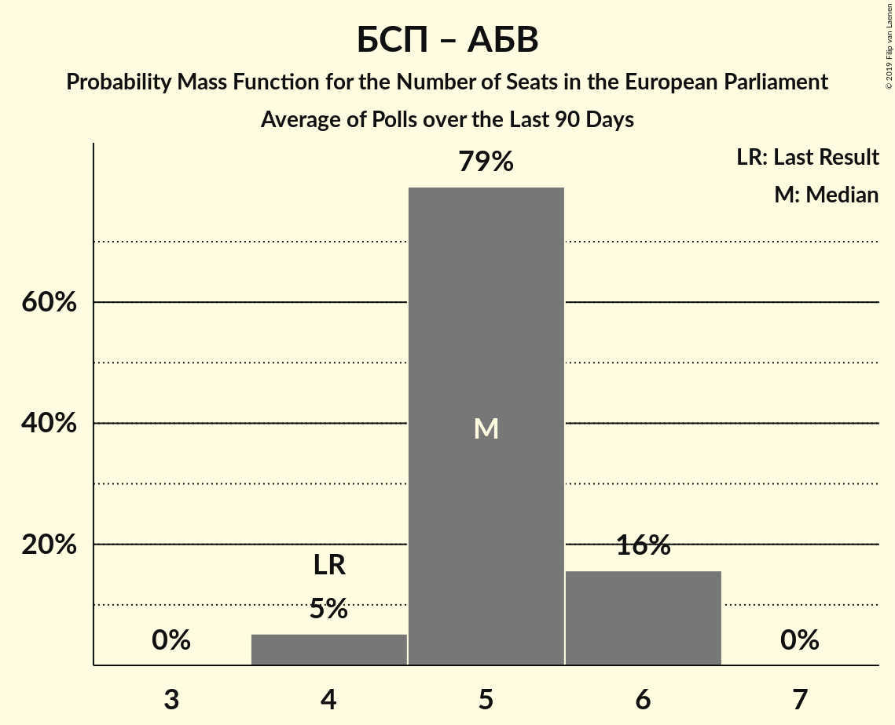

| Number of Seats | Probability | Accumulated | Special Marks |
|:---------------:|:-----------:|:-----------:|:-------------:|
| 4 | 5% | 100% | Last Result |
| 5 | 79% | 95% | Median |
| 6 | 16% | 16% |  |
| 7 | 0% | 0% |  |

### Движение за права и свободи (RE)

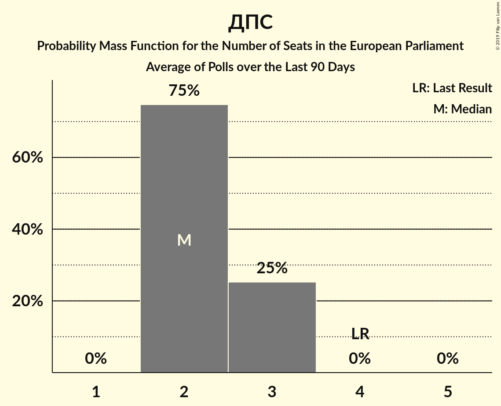

| Number of Seats | Probability | Accumulated | Special Marks |
|:---------------:|:-----------:|:-----------:|:-------------:|
| 2 | 75% | 100% | Median |
| 3 | 25% | 25% |  |
| 4 | 0% | 0% | Last Result |

### Национален фронт за спасение на България (*) – Да, България! (*) – Няма такава държава (*)

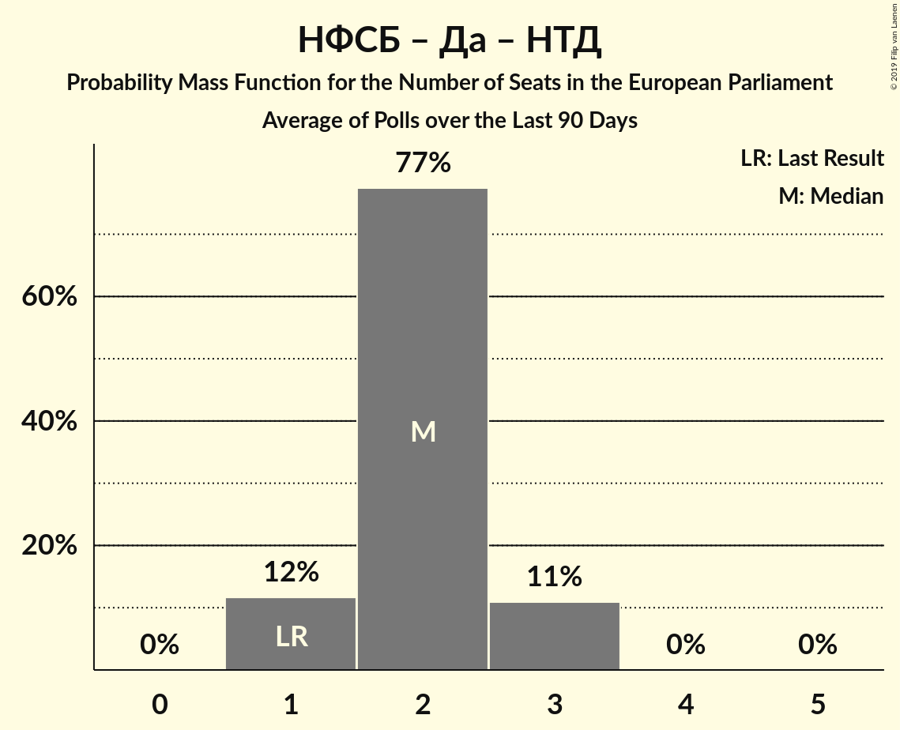

| Number of Seats | Probability | Accumulated | Special Marks |
|:---------------:|:-----------:|:-----------:|:-------------:|
| 1 | 12% | 100% | Last Result |
| 2 | 77% | 88% | Median |
| 3 | 11% | 11% |  |
| 4 | 0% | 0% |  |

### ВМРО–Българско Национално Движение (ECR) – Обединени Патриоти (ECR)

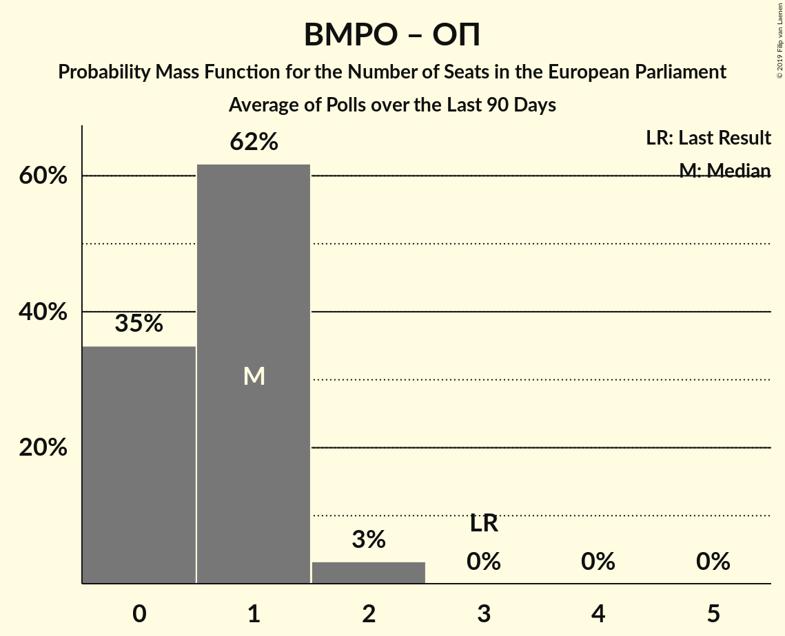

| Number of Seats | Probability | Accumulated | Special Marks |
|:---------------:|:-----------:|:-----------:|:-------------:|
| 0 | 35% | 100% |  |
| 1 | 62% | 65% |  |
| 2 | 3% | 3% | Median |
| 3 | 0% | 0% | Last Result |

### Атака (NI)

| Number of Seats | Probability | Accumulated | Special Marks |
|:---------------:|:-----------:|:-----------:|:-------------:|
| 0 | 100% | 100% | Last Result, Median |

### Воля (ID)

| Number of Seats | Probability | Accumulated | Special Marks |
|:---------------:|:-----------:|:-----------:|:-------------:|
| 0 | 100% | 100% | Last Result, Median |

## Technical Information

+ **Number of polls included in this average:** 3
+ **Lowest number of simulations done in a poll included in this average:** 1,048,576
+ **Total number of simulations done in the polls included in this average:** 3,145,728
+ **Error estimate:** 1.72%
