# Poll Average

<a href="#voting-intentions">Voting Intentions</a> | <a href="#seats">Seats</a> | <a href="#coalitions">Coalitions</a> | <a href="#technical-information">Technical Information</a>

## Summary

The table below lists the polls on which the average is based. They are the most recent polls (less than 90 days old) registered and analyzed so far.

| Period     | Polling firm/Commissioner(s) | ГЕРБ | БСП | ДПС | ОП | ВМРО | НФСБ | Атака | РБ | Воля | ДБ | ДСБ | Да | АБВ | ИТН | В | ИС.Б |
|:----------:|:----------------------------:|:--:|:--:|:--:|:--:|:--:|:--:|:--:|:--:|:--:|:--:|:--:|:--:|:--:|:--:|:--:|:--:|
| 26 May 2019 | General Election | 30.4%   6 | 18.9%   4 | 17.3%   4 | 10.7%   2 | 10.7%   1 | 10.7%   1 | 10.7%   0 | 6.4%   1 | 0.0%   0 | 0.0%   0 | 0.0%   0 | 0.0%   0 | 0.0%   0 | 0.0%   0 | 0.0%   0 | 0.0%   0 |
| N/A | Poll Average | 24–40%   4–8 | 17–28%   3–5 | 6–13%   1–2 | 3–12%   0–2 | 3–9%   0–2 | 0–2%   0 | 1–2%   0 | N/A   N/A | 0–6%   0 | 3–14%   0–3 | N/A   N/A | N/A   N/A | 1–3%   0 | 3–21%   0–4 | 0–4%   0 | 1–8%   0–1 |
| [23–30 July 2020](2020-07-30-Алфарисърч.html) | Алфа рисърч   Дневник | 23–30%   4–6 | 16–23%   3–4 | 6–11%   1–2 | 3–6%   0–1 | N/A   N/A | N/A   N/A | N/A   N/A | N/A   N/A | 0–2%   0 | 10–15%   2–3 | N/A   N/A | N/A   N/A | N/A   N/A | 16–22%   3–4 | 0–2%   0 | 4–8%   0–2 |
| [26 June–1 July 2020](2020-07-01-SovaHarris.html) | Sova Harris | 33–41%   7–8 | 18–25%   4–5 | 6–10%   1–2 | N/A   N/A | 5–9%   1–2 | 0–2%   0 | 1–3%   0 | N/A   N/A | 3–6%   0–1 | 3–6%   0–1 | N/A   N/A | N/A   N/A | 1–3%   0 | 7–12%   1–2 | 2–5%   0 | 2–4%   0 |
| [20–25 June 2020](2020-06-25-БарометърБългария.html) | Барометър България | 34–41%   6–8 | 18–23%   3–4 | 9–14%   2–3 | 8–12%   2 | N/A   N/A | N/A   N/A | N/A   N/A | N/A   N/A | 1–3%   0 | 2–5%   0 | N/A   N/A | N/A   N/A | N/A   N/A | 3–5%   0–1 | N/A   N/A | 1–3%   0 |
| [27 May–3 June 2020](2020-06-03-МаркетЛИНКС.html) | Маркет ЛИНКС | 31–37%   5–7 | 23–29%   4–5 | 8–12%   1–2 | N/A   N/A | 3–5%   0–1 | N/A   N/A | N/A   N/A | N/A   N/A | N/A   N/A | 7–11%   1–2 | N/A   N/A | N/A   N/A | N/A   N/A | 8–12%   1–2 | N/A   N/A | N/A   N/A |
| 26 May 2019 | General Election | 30.4%   6 | 18.9%   4 | 17.3%   4 | 10.7%   2 | 10.7%   1 | 10.7%   1 | 10.7%   0 | 6.4%   1 | 0.0%   0 | 0.0%   0 | 0.0%   0 | 0.0%   0 | 0.0%   0 | 0.0%   0 | 0.0%   0 | 0.0%   0 |

Only polls for which at least the sample size has been published are included in the table above.

**Legend:**
+ **Top half of each row:** Voting intentions (95% confidence interval)
+ **Bottom half of each row:** Seat projections for the European Parliament (95% confidence interval)
+ **ГЕРБ:** Граждани за европейско развитие на България (EPP)
+ **БСП:** Българска социалистическа партия (S&D)
+ **ДПС:** Движение за права и свободи (RE)
+ **ОП:** Обединени Патриоти (ECR)
+ **ВМРО:** ВМРО–Българско Национално Движение (ECR)
+ **НФСБ:** Национален фронт за спасение на България (*)
+ **Атака:** Атака (NI)
+ **РБ:** Реформаторски блок (EPP)
+ **Воля:** Воля (ID)
+ **ДБ:** Демократична България (EPP)
+ **ДСБ:** Демократи за силна България (EPP)
+ **Да:** Да, България! (*)
+ **АБВ:** Алтернатива за българско възраждане (S&D)
+ **ИТН:** Има такъв народ (*)
+ **В:** Възраждане (*)
+ **ИС.Б:** Изправи се Бг (*)
+ **N/A (single party):** Party not included the published results
+ **N/A (entire row):** Calculation for this opinion poll not started yet

## Voting Intentions

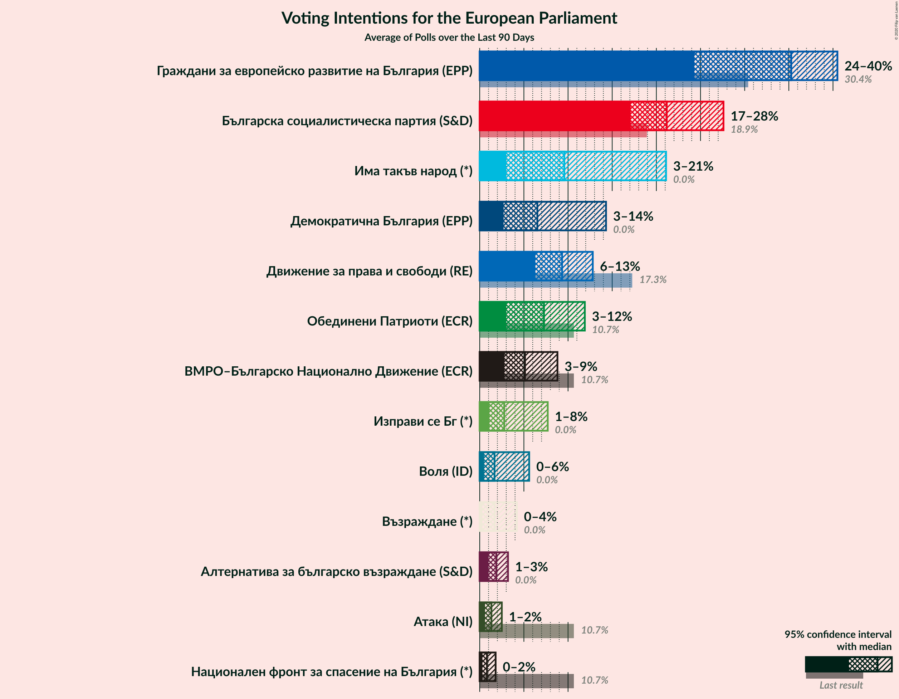

### Confidence Intervals

| Party | Last Result | Median | 80% Confidence Interval | 90% Confidence Interval | 95% Confidence Interval | 99% Confidence Interval |
|:-----:|:-----------:|:------:|:-----------------------:|:-----------------------:|:-----------------------:|:-----------------------:|
| <a href="#граждани-за-европейско-развитие-на-българия-(epp)">Граждани за европейско развитие на България (EPP)</a> | 30.4% | 35.3% | 26.2–39.0% |25.1–39.8% | 24.3–40.5% | 22.9–41.8% |
| <a href="#българска-социалистическа-партия-(s&d)">Българска социалистическа партия (S&D)</a> | 18.9% | 21.2% | 18.4–26.1% |17.7–27.0% | 17.1–27.6% | 16.0–28.9% |
| <a href="#движение-за-права-и-свободи-(re)">Движение за права и свободи (RE)</a> | 17.3% | 9.3% | 7.2–11.7% |6.7–12.3% | 6.3–12.8% | 5.6–13.7% |
| <a href="#обединени-патриоти-(ecr)">Обединени Патриоти (ECR)</a> | 10.7% | 7.3% | 3.6–11.0% |3.3–11.5% | 3.0–11.9% | 2.6–12.7% |
| <a href="#вмро–българско-национално-движение-(ecr)">ВМРО–Българско Национално Движение (ECR)</a> | 10.7% | 5.1% | 3.2–7.9% |3.0–8.4% | 2.8–8.8% | 2.4–9.7% |
| <a href="#национален-фронт-за-спасение-на-българия-(*)">Национален фронт за спасение на България (*)</a> | 10.7% | 0.8% | 0.4–1.4% |0.3–1.6% | 0.3–1.8% | 0.2–2.2% |
| <a href="#атака-(ni)">Атака (NI)</a> | 10.7% | 1.3% | 0.8–2.0% |0.7–2.3% | 0.6–2.5% | 0.4–3.0% |
| <a href="#реформаторски-блок-(epp)">Реформаторски блок (EPP)</a> | 6.4% | N/A | N/A |N/A | N/A | N/A |
| <a href="#воля-(id)">Воля (ID)</a> | 0.0% | 1.7% | 0.8–4.8% |0.6–5.3% | 0.5–5.6% | 0.4–6.4% |
| <a href="#демократична-българия-(epp)">Демократична България (EPP)</a> | 0.0% | 6.5% | 3.2–12.8% |2.9–13.6% | 2.7–14.3% | 2.3–15.5% |
| <a href="#демократи-за-силна-българия-(epp)">Демократи за силна България (EPP)</a> | 0.0% | N/A | N/A |N/A | N/A | N/A |
| <a href="#да,-българия!-(*)">Да, България! (*)</a> | 0.0% | N/A | N/A |N/A | N/A | N/A |
| <a href="#алтернатива-за-българско-възраждане-(s&d)">Алтернатива за българско възраждане (S&D)</a> | 0.0% | 1.9% | 1.2–2.7% |1.1–2.9% | 1.0–3.2% | 0.8–3.7% |
| <a href="#има-такъв-народ-(*)">Има такъв народ (*)</a> | 0.0% | 9.6% | 3.7–19.3% |3.3–20.3% | 3.0–21.1% | 2.6–22.5% |
| <a href="#възраждане-(*)">Възраждане (*)</a> | 0.0% | 1.7% | 0.4–3.5% |0.3–3.9% | 0.3–4.2% | 0.1–4.9% |
| <a href="#изправи-се-бг-(*)">Изправи се Бг (*)</a> | 0.0% | 2.8% | 1.4–6.6% |1.2–7.2% | 1.1–7.7% | 0.9–8.5% |

### Граждани за европейско развитие на България (EPP)

*For a full overview of the results for this party, see the [Граждани за европейско развитие на България (EPP)](party-гражданизаевропейскоразвитиенабългарияepp.html) page.*

| Voting Intentions | Probability | Accumulated | Special Marks |
|:-----------------:|:-----------:|:-----------:|:-------------:|
| 20.5–21.5% | 0% | 100% |  |
| 21.5–22.5% | 0.2% | 99.9% |  |
| 22.5–23.5% | 0.8% | 99.7% |  |
| 23.5–24.5% | 2% | 98.9% |  |
| 24.5–25.5% | 4% | 97% |  |
| 25.5–26.5% | 5% | 93% |  |
| 26.5–27.5% | 5% | 88% |  |
| 27.5–28.5% | 4% | 83% |  |
| 28.5–29.5% | 2% | 79% |  |
| 29.5–30.5% | 1.4% | 77% | Last Result |
| 30.5–31.5% | 2% | 75% |  |
| 31.5–32.5% | 3% | 74% |  |
| 32.5–33.5% | 6% | 70% |  |
| 33.5–34.5% | 8% | 65% |  |
| 34.5–35.5% | 10% | 57% | Median |
| 35.5–36.5% | 11% | 47% |  |
| 36.5–37.5% | 12% | 36% |  |
| 37.5–38.5% | 10% | 24% |  |
| 38.5–39.5% | 7% | 14% |  |
| 39.5–40.5% | 4% | 6% |  |
| 40.5–41.5% | 2% | 2% |  |
| 41.5–42.5% | 0.6% | 0.7% |  |
| 42.5–43.5% | 0.1% | 0.2% |  |
| 43.5–44.5% | 0% | 0% |  |

### Българска социалистическа партия (S&D)

*For a full overview of the results for this party, see the [Българска социалистическа партия (S&D)](party-българскасоциалистическапартияsd.html) page.*

| Voting Intentions | Probability | Accumulated | Special Marks |
|:-----------------:|:-----------:|:-----------:|:-------------:|
| 13.5–14.5% | 0% | 100% |  |
| 14.5–15.5% | 0.2% | 100% |  |
| 15.5–16.5% | 1.0% | 99.8% |  |
| 16.5–17.5% | 3% | 98.8% |  |
| 17.5–18.5% | 7% | 96% |  |
| 18.5–19.5% | 12% | 89% | Last Result |
| 19.5–20.5% | 16% | 76% |  |
| 20.5–21.5% | 15% | 60% | Median |
| 21.5–22.5% | 11% | 45% |  |
| 22.5–23.5% | 7% | 34% |  |
| 23.5–24.5% | 6% | 27% |  |
| 24.5–25.5% | 7% | 20% |  |
| 25.5–26.5% | 6% | 14% |  |
| 26.5–27.5% | 4% | 7% |  |
| 27.5–28.5% | 2% | 3% |  |
| 28.5–29.5% | 0.6% | 0.8% |  |
| 29.5–30.5% | 0.1% | 0.2% |  |
| 30.5–31.5% | 0% | 0% |  |

### Движение за права и свободи (RE)

*For a full overview of the results for this party, see the [Движение за права и свободи (RE)](party-движениезаправаисвободиre.html) page.*

| Voting Intentions | Probability | Accumulated | Special Marks |
|:-----------------:|:-----------:|:-----------:|:-------------:|
| 3.5–4.5% | 0% | 100% |  |
| 4.5–5.5% | 0.4% | 100% |  |
| 5.5–6.5% | 4% | 99.6% |  |
| 6.5–7.5% | 12% | 96% |  |
| 7.5–8.5% | 19% | 84% |  |
| 8.5–9.5% | 20% | 66% | Median |
| 9.5–10.5% | 19% | 46% |  |
| 10.5–11.5% | 15% | 27% |  |
| 11.5–12.5% | 8% | 12% |  |
| 12.5–13.5% | 3% | 4% |  |
| 13.5–14.5% | 0.6% | 0.7% |  |
| 14.5–15.5% | 0.1% | 0.1% |  |
| 15.5–16.5% | 0% | 0% |  |
| 16.5–17.5% | 0% | 0% | Last Result |

### Обединени Патриоти (ECR)

*For a full overview of the results for this party, see the [Обединени Патриоти (ECR)](party-обединенипатриотиecr.html) page.*

| Voting Intentions | Probability | Accumulated | Special Marks |
|:-----------------:|:-----------:|:-----------:|:-------------:|
| 0.5–1.5% | 0% | 100% |  |
| 1.5–2.5% | 0.5% | 100% |  |
| 2.5–3.5% | 9% | 99.5% |  |
| 3.5–4.5% | 22% | 91% |  |
| 4.5–5.5% | 14% | 69% |  |
| 5.5–6.5% | 4% | 54% |  |
| 6.5–7.5% | 0.7% | 51% | Median |
| 7.5–8.5% | 3% | 50% |  |
| 8.5–9.5% | 12% | 47% |  |
| 9.5–10.5% | 18% | 35% |  |
| 10.5–11.5% | 12% | 17% | Last Result |
| 11.5–12.5% | 4% | 4% |  |
| 12.5–13.5% | 0.6% | 0.7% |  |
| 13.5–14.5% | 0.1% | 0.1% |  |
| 14.5–15.5% | 0% | 0% |  |

### ВМРО–Българско Национално Движение (ECR)

*For a full overview of the results for this party, see the [ВМРО–Българско Национално Движение (ECR)](party-вмро–българсконационалнодвижениеecr.html) page.*

| Voting Intentions | Probability | Accumulated | Special Marks |
|:-----------------:|:-----------:|:-----------:|:-------------:|
| 0.5–1.5% | 0% | 100% |  |
| 1.5–2.5% | 1.0% | 100% |  |
| 2.5–3.5% | 18% | 99.0% |  |
| 3.5–4.5% | 25% | 81% |  |
| 4.5–5.5% | 10% | 56% | Median |
| 5.5–6.5% | 14% | 46% |  |
| 6.5–7.5% | 18% | 32% |  |
| 7.5–8.5% | 11% | 15% |  |
| 8.5–9.5% | 3% | 4% |  |
| 9.5–10.5% | 0.6% | 0.7% |  |
| 10.5–11.5% | 0.1% | 0.1% | Last Result |
| 11.5–12.5% | 0% | 0% |  |

### Национален фронт за спасение на България (*)

*For a full overview of the results for this party, see the [Национален фронт за спасение на България (*)](party-националенфронтзаспасениенабългария.html) page.*

| Voting Intentions | Probability | Accumulated | Special Marks |
|:-----------------:|:-----------:|:-----------:|:-------------:|
| 0.0–0.5% | 21% | 100% |  |
| 0.5–1.5% | 74% | 79% | Median |
| 1.5–2.5% | 6% | 6% |  |
| 2.5–3.5% | 0.1% | 0.1% |  |
| 3.5–4.5% | 0% | 0% |  |
| 4.5–5.5% | 0% | 0% |  |
| 5.5–6.5% | 0% | 0% |  |
| 6.5–7.5% | 0% | 0% |  |
| 7.5–8.5% | 0% | 0% |  |
| 8.5–9.5% | 0% | 0% |  |
| 9.5–10.5% | 0% | 0% |  |
| 10.5–11.5% | 0% | 0% | Last Result |

### Атака (NI)

*For a full overview of the results for this party, see the [Атака (NI)](party-атакаni.html) page.*

| Voting Intentions | Probability | Accumulated | Special Marks |
|:-----------------:|:-----------:|:-----------:|:-------------:|
| 0.0–0.5% | 1.5% | 100% |  |
| 0.5–1.5% | 65% | 98.5% | Median |
| 1.5–2.5% | 31% | 34% |  |
| 2.5–3.5% | 2% | 2% |  |
| 3.5–4.5% | 0.1% | 0.1% |  |
| 4.5–5.5% | 0% | 0% |  |
| 5.5–6.5% | 0% | 0% |  |
| 6.5–7.5% | 0% | 0% |  |
| 7.5–8.5% | 0% | 0% |  |
| 8.5–9.5% | 0% | 0% |  |
| 9.5–10.5% | 0% | 0% |  |
| 10.5–11.5% | 0% | 0% | Last Result |

### Воля (ID)

*For a full overview of the results for this party, see the [Воля (ID)](party-воляid.html) page.*

| Voting Intentions | Probability | Accumulated | Special Marks |
|:-----------------:|:-----------:|:-----------:|:-------------:|
| 0.0–0.5% | 3% | 100% | Last Result |
| 0.5–1.5% | 43% | 97% |  |
| 1.5–2.5% | 20% | 54% | Median |
| 2.5–3.5% | 6% | 34% |  |
| 3.5–4.5% | 15% | 28% |  |
| 4.5–5.5% | 10% | 13% |  |
| 5.5–6.5% | 3% | 3% |  |
| 6.5–7.5% | 0.3% | 0.4% |  |
| 7.5–8.5% | 0% | 0% |  |

### Демократична България (EPP)

*For a full overview of the results for this party, see the [Демократична България (EPP)](party-демократичнабългарияepp.html) page.*

| Voting Intentions | Probability | Accumulated | Special Marks |
|:-----------------:|:-----------:|:-----------:|:-------------:|
| 0.0–0.5% | 0% | 100% | Last Result |
| 0.5–1.5% | 0% | 100% |  |
| 1.5–2.5% | 2% | 100% |  |
| 2.5–3.5% | 17% | 98% |  |
| 3.5–4.5% | 21% | 82% |  |
| 4.5–5.5% | 9% | 61% |  |
| 5.5–6.5% | 2% | 52% |  |
| 6.5–7.5% | 4% | 50% | Median |
| 7.5–8.5% | 9% | 46% |  |
| 8.5–9.5% | 9% | 37% |  |
| 9.5–10.5% | 5% | 28% |  |
| 10.5–11.5% | 5% | 24% |  |
| 11.5–12.5% | 7% | 18% |  |
| 12.5–13.5% | 6% | 12% |  |
| 13.5–14.5% | 4% | 5% |  |
| 14.5–15.5% | 1.3% | 2% |  |
| 15.5–16.5% | 0.4% | 0.4% |  |
| 16.5–17.5% | 0.1% | 0.1% |  |
| 17.5–18.5% | 0% | 0% |  |

### Има такъв народ (*)

*For a full overview of the results for this party, see the [Има такъв народ (*)](party-иматакъвнарод.html) page.*

| Voting Intentions | Probability | Accumulated | Special Marks |
|:-----------------:|:-----------:|:-----------:|:-------------:|
| 0.0–0.5% | 0% | 100% | Last Result |
| 0.5–1.5% | 0% | 100% |  |
| 1.5–2.5% | 0.4% | 100% |  |
| 2.5–3.5% | 8% | 99.6% |  |
| 3.5–4.5% | 13% | 91% |  |
| 4.5–5.5% | 3% | 79% |  |
| 5.5–6.5% | 0.4% | 75% |  |
| 6.5–7.5% | 2% | 75% |  |
| 7.5–8.5% | 8% | 73% |  |
| 8.5–9.5% | 15% | 66% |  |
| 9.5–10.5% | 15% | 50% | Median |
| 10.5–11.5% | 8% | 35% |  |
| 11.5–12.5% | 2% | 27% |  |
| 12.5–13.5% | 0.3% | 25% |  |
| 13.5–14.5% | 0.1% | 25% |  |
| 14.5–15.5% | 0.4% | 25% |  |
| 15.5–16.5% | 1.4% | 25% |  |
| 16.5–17.5% | 3% | 23% |  |
| 17.5–18.5% | 5% | 20% |  |
| 18.5–19.5% | 6% | 15% |  |
| 19.5–20.5% | 5% | 9% |  |
| 20.5–21.5% | 3% | 4% |  |
| 21.5–22.5% | 1.1% | 2% |  |
| 22.5–23.5% | 0.3% | 0.5% |  |
| 23.5–24.5% | 0.1% | 0.1% |  |
| 24.5–25.5% | 0% | 0% |  |

### Изправи се Бг (*)

*For a full overview of the results for this party, see the [Изправи се Бг (*)](party-изправисебг.html) page.*

| Voting Intentions | Probability | Accumulated | Special Marks |
|:-----------------:|:-----------:|:-----------:|:-------------:|
| 0.0–0.5% | 0% | 100% | Last Result |
| 0.5–1.5% | 14% | 100% |  |
| 1.5–2.5% | 30% | 86% |  |
| 2.5–3.5% | 17% | 55% | Median |
| 3.5–4.5% | 6% | 38% |  |
| 4.5–5.5% | 8% | 32% |  |
| 5.5–6.5% | 13% | 24% |  |
| 6.5–7.5% | 8% | 11% |  |
| 7.5–8.5% | 2% | 3% |  |
| 8.5–9.5% | 0.4% | 0.5% |  |
| 9.5–10.5% | 0% | 0.1% |  |
| 10.5–11.5% | 0% | 0% |  |

### Възраждане (*)

*For a full overview of the results for this party, see the [Възраждане (*)](party-възраждане.html) page.*

| Voting Intentions | Probability | Accumulated | Special Marks |
|:-----------------:|:-----------:|:-----------:|:-------------:|
| 0.0–0.5% | 18% | 100% | Last Result |
| 0.5–1.5% | 31% | 82% |  |
| 1.5–2.5% | 15% | 51% | Median |
| 2.5–3.5% | 26% | 36% |  |
| 3.5–4.5% | 9% | 10% |  |
| 4.5–5.5% | 1.0% | 1.1% |  |
| 5.5–6.5% | 0.1% | 0.1% |  |
| 6.5–7.5% | 0% | 0% |  |

### Алтернатива за българско възраждане (S&D)

*For a full overview of the results for this party, see the [Алтернатива за българско възраждане (S&D)](party-алтернативазабългарсковъзражданеsd.html) page.*

| Voting Intentions | Probability | Accumulated | Special Marks |
|:-----------------:|:-----------:|:-----------:|:-------------:|
| 0.0–0.5% | 0% | 100% | Last Result |
| 0.5–1.5% | 28% | 100% |  |
| 1.5–2.5% | 58% | 72% | Median |
| 2.5–3.5% | 13% | 14% |  |
| 3.5–4.5% | 0.8% | 0.8% |  |
| 4.5–5.5% | 0% | 0% |  |

## Seats

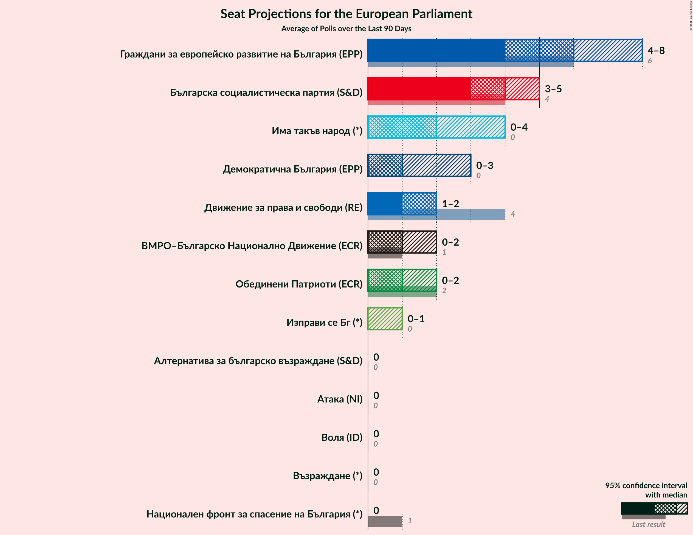

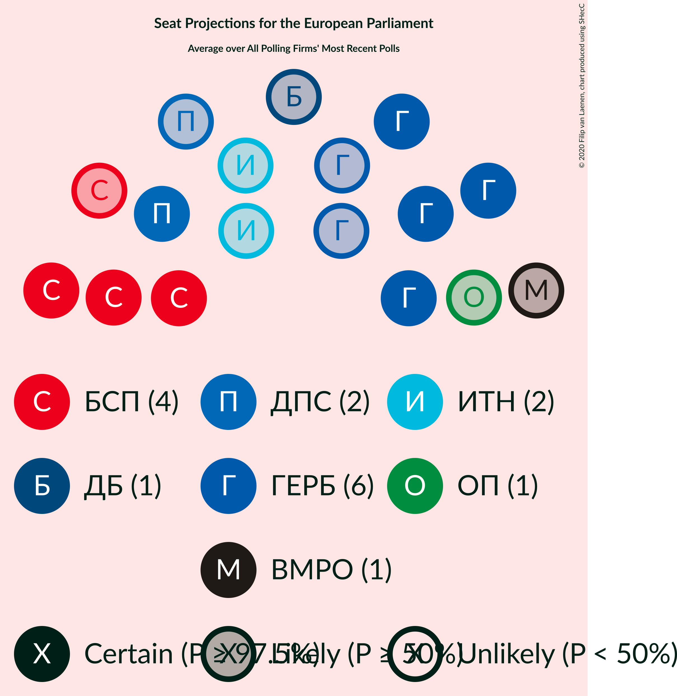

### Confidence Intervals

| Party | Last Result | Median | 80% Confidence Interval | 90% Confidence Interval | 95% Confidence Interval | 99% Confidence Interval |
|:-----:|:-----------:|:------:|:-----------------------:|:-----------------------:|:-----------------------:|:-----------------------:|
| <a href="#граждани-за-европейско-развитие-на-българия-(epp)">Граждани за европейско развитие на България (EPP)</a> | 6 | 6 | 5–7 |5–7 | 4–8 | 4–8 |
| <a href="#българска-социалистическа-партия-(s&d)">Българска социалистическа партия (S&D)</a> | 4 | 4 | 3–5 |3–5 | 3–5 | 3–5 |
| <a href="#движение-за-права-и-свободи-(re)">Движение за права и свободи (RE)</a> | 4 | 2 | 1–2 |1–2 | 1–2 | 1–3 |
| <a href="#обединени-патриоти-(ecr)">Обединени Патриоти (ECR)</a> | 2 | 1 | 0–2 |0–2 | 0–2 | 0–2 |
| <a href="#вмро–българско-национално-движение-(ecr)">ВМРО–Българско Национално Движение (ECR)</a> | 1 | 1 | 0–2 |0–2 | 0–2 | 0–2 |
| <a href="#национален-фронт-за-спасение-на-българия-(*)">Национален фронт за спасение на България (*)</a> | 1 | 0 | 0 |0 | 0 | 0 |
| <a href="#атака-(ni)">Атака (NI)</a> | 0 | 0 | 0 |0 | 0 | 0 |
| <a href="#реформаторски-блок-(epp)">Реформаторски блок (EPP)</a> | 1 | N/A | N/A |N/A | N/A | N/A |
| <a href="#воля-(id)">Воля (ID)</a> | 0 | 0 | 0 |0 | 0 | 0–1 |
| <a href="#демократична-българия-(epp)">Демократична България (EPP)</a> | 0 | 1 | 0–2 |0–2 | 0–3 | 0–3 |
| <a href="#демократи-за-силна-българия-(epp)">Демократи за силна България (EPP)</a> | 0 | N/A | N/A |N/A | N/A | N/A |
| <a href="#да,-българия!-(*)">Да, България! (*)</a> | 0 | N/A | N/A |N/A | N/A | N/A |
| <a href="#алтернатива-за-българско-възраждане-(s&d)">Алтернатива за българско възраждане (S&D)</a> | 0 | 0 | 0 |0 | 0 | 0 |
| <a href="#има-такъв-народ-(*)">Има такъв народ (*)</a> | 0 | 2 | 0–4 |0–4 | 0–4 | 0–4 |
| <a href="#възраждане-(*)">Възраждане (*)</a> | 0 | 0 | 0 |0 | 0 | 0 |
| <a href="#изправи-се-бг-(*)">Изправи се Бг (*)</a> | 0 | 0 | 0–1 |0–1 | 0–1 | 0–2 |

### Граждани за европейско развитие на България (EPP)

*For a full overview of the results for this party, see the [Граждани за европейско развитие на България (EPP)](party-гражданизаевропейскоразвитиенабългарияepp.html) page.*

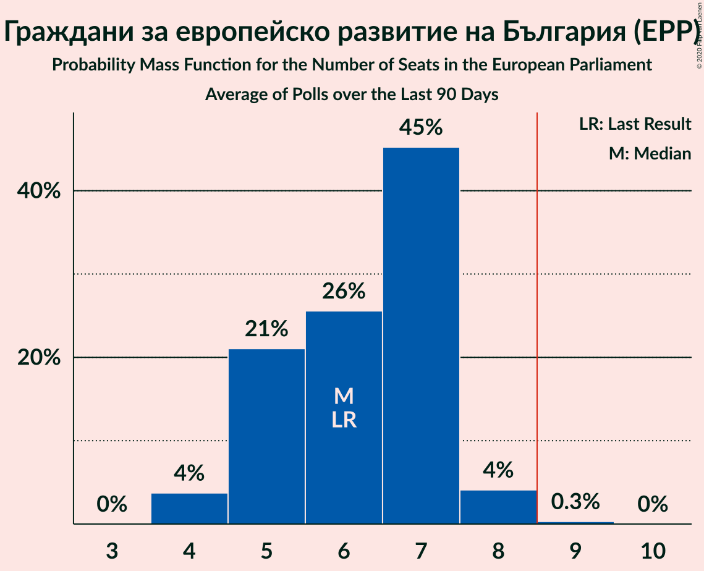

| Number of Seats | Probability | Accumulated | Special Marks |
|:---------------:|:-----------:|:-----------:|:-------------:|
| 4 | 4% | 100% |  |
| 5 | 21% | 96% |  |
| 6 | 26% | 75% | Last Result, Median |
| 7 | 45% | 50% |  |
| 8 | 4% | 4% |  |
| 9 | 0.3% | 0.3% | Majority |
| 10 | 0% | 0% |  |

### Българска социалистическа партия (S&D)

*For a full overview of the results for this party, see the [Българска социалистическа партия (S&D)](party-българскасоциалистическапартияsd.html) page.*

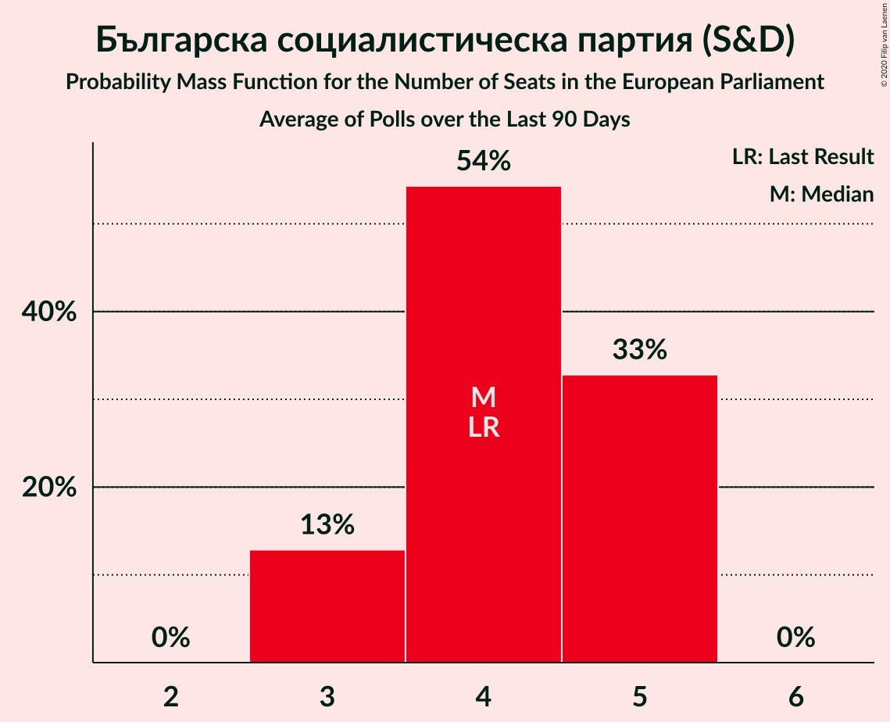

| Number of Seats | Probability | Accumulated | Special Marks |
|:---------------:|:-----------:|:-----------:|:-------------:|
| 3 | 13% | 100% |  |
| 4 | 54% | 87% | Last Result, Median |
| 5 | 33% | 33% |  |
| 6 | 0% | 0% |  |

### Движение за права и свободи (RE)

*For a full overview of the results for this party, see the [Движение за права и свободи (RE)](party-движениезаправаисвободиre.html) page.*

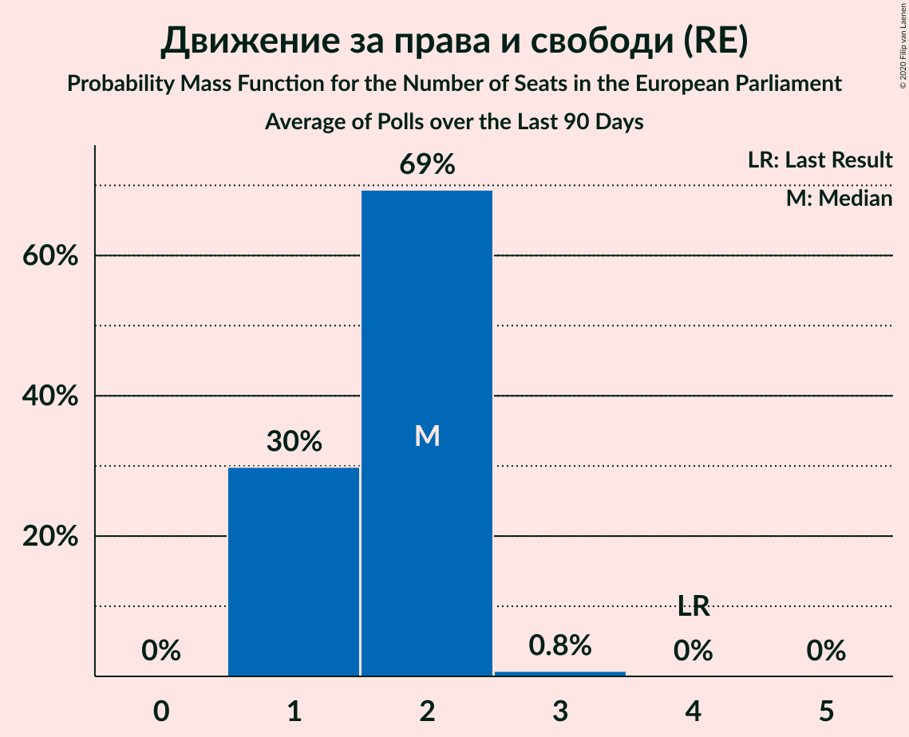

| Number of Seats | Probability | Accumulated | Special Marks |
|:---------------:|:-----------:|:-----------:|:-------------:|
| 1 | 30% | 100% |  |
| 2 | 69% | 70% | Median |
| 3 | 0.8% | 0.8% |  |
| 4 | 0% | 0% | Last Result |

### Обединени Патриоти (ECR)

*For a full overview of the results for this party, see the [Обединени Патриоти (ECR)](party-обединенипатриотиecr.html) page.*

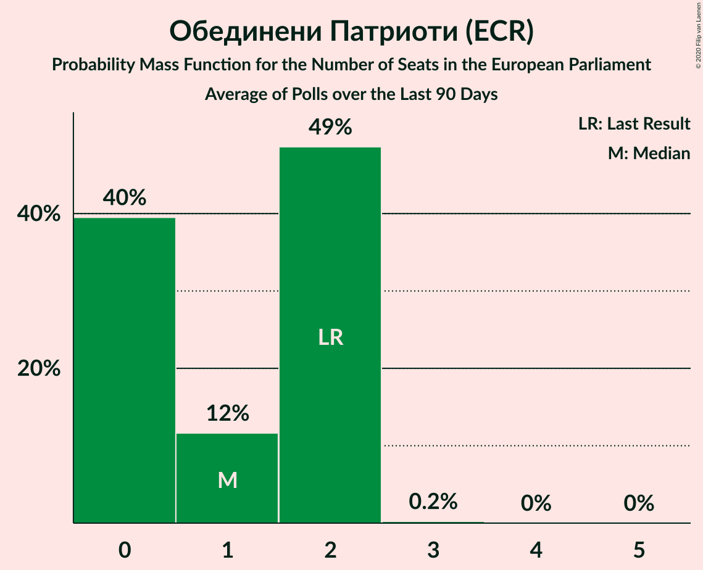

| Number of Seats | Probability | Accumulated | Special Marks |
|:---------------:|:-----------:|:-----------:|:-------------:|
| 0 | 40% | 100% |  |
| 1 | 12% | 60% | Median |
| 2 | 49% | 49% | Last Result |
| 3 | 0.2% | 0.2% |  |
| 4 | 0% | 0% |  |

### ВМРО–Българско Национално Движение (ECR)

*For a full overview of the results for this party, see the [ВМРО–Българско Национално Движение (ECR)](party-вмро–българсконационалнодвижениеecr.html) page.*

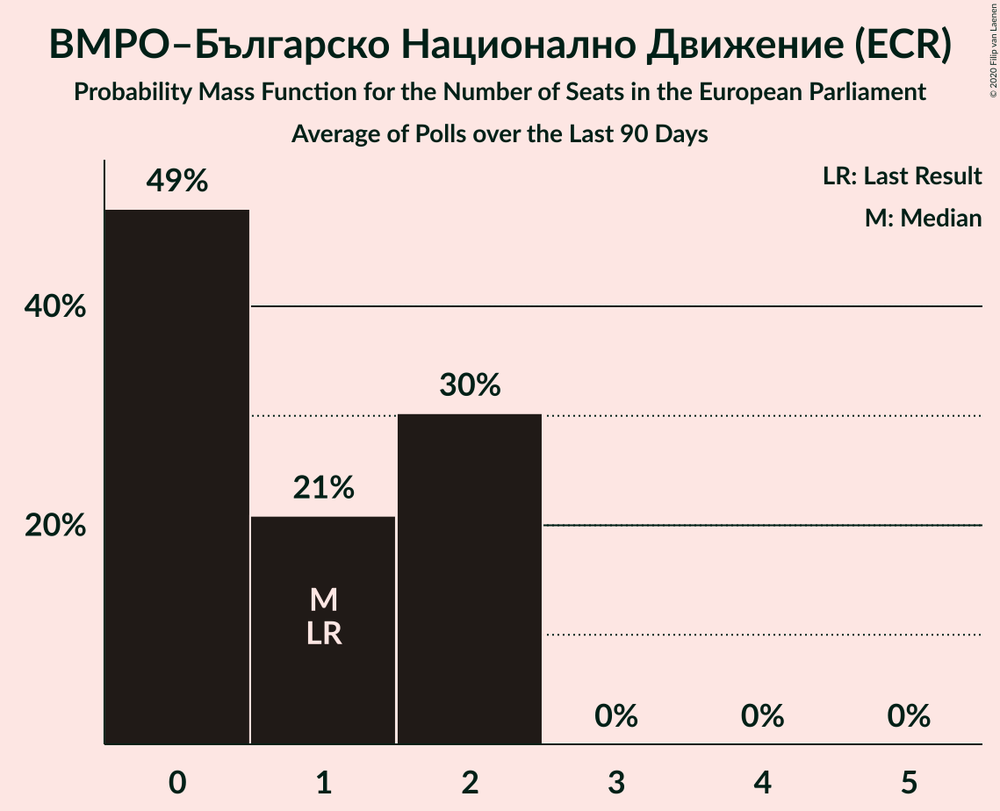

| Number of Seats | Probability | Accumulated | Special Marks |
|:---------------:|:-----------:|:-----------:|:-------------:|
| 0 | 49% | 100% |  |
| 1 | 21% | 51% | Last Result, Median |
| 2 | 30% | 30% |  |
| 3 | 0% | 0% |  |

### Национален фронт за спасение на България (*)

*For a full overview of the results for this party, see the [Национален фронт за спасение на България (*)](party-националенфронтзаспасениенабългария.html) page.*

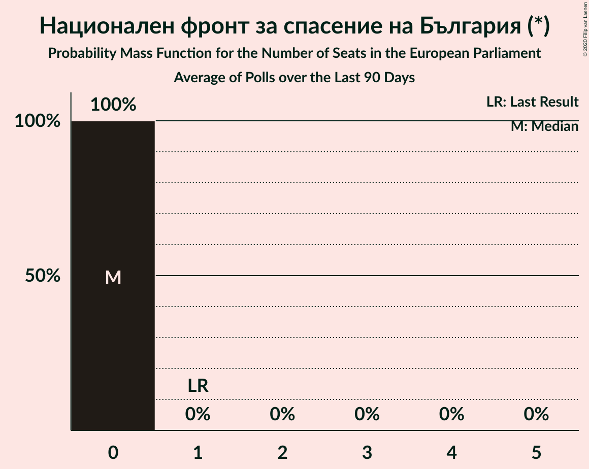

| Number of Seats | Probability | Accumulated | Special Marks |
|:---------------:|:-----------:|:-----------:|:-------------:|
| 0 | 100% | 100% | Median |
| 1 | 0% | 0% | Last Result |

### Атака (NI)

*For a full overview of the results for this party, see the [Атака (NI)](party-атакаni.html) page.*

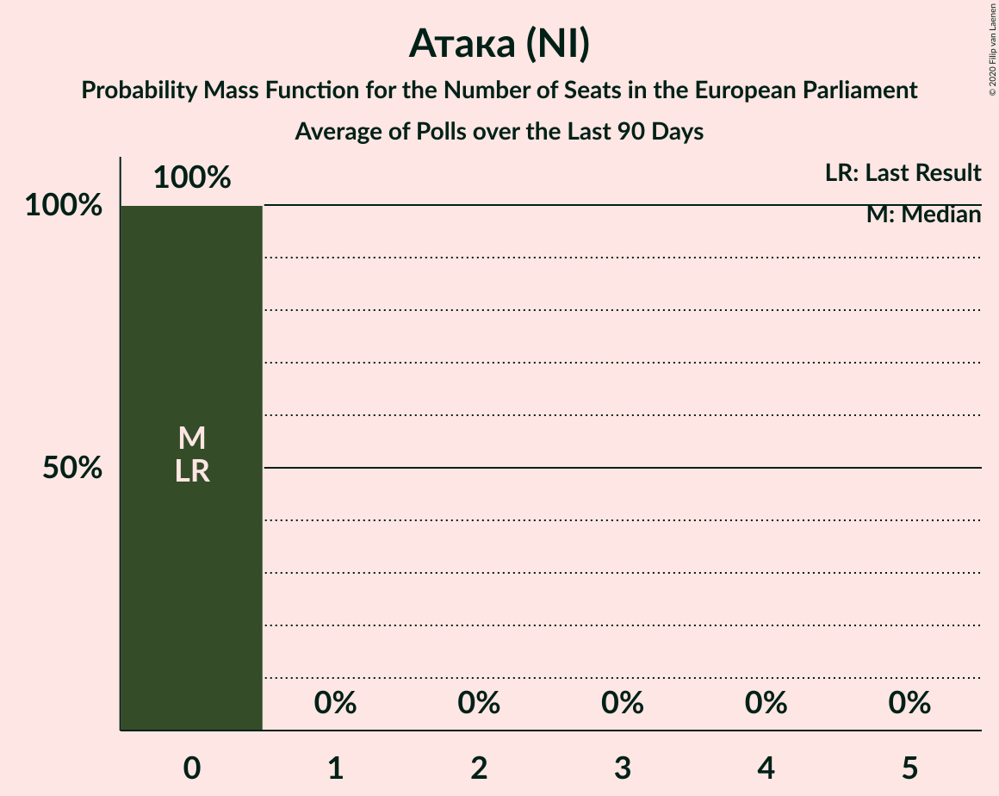

| Number of Seats | Probability | Accumulated | Special Marks |
|:---------------:|:-----------:|:-----------:|:-------------:|
| 0 | 100% | 100% | Last Result, Median |

### Реформаторски блок (EPP)

*For a full overview of the results for this party, see the [Реформаторски блок (EPP)](party-реформаторскиблокepp.html) page.*

### Воля (ID)

*For a full overview of the results for this party, see the [Воля (ID)](party-воляid.html) page.*

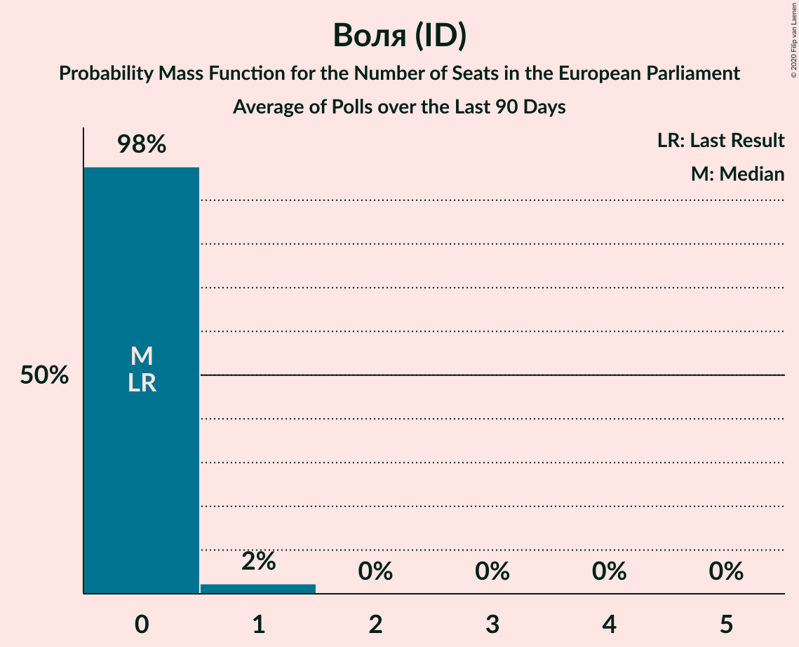

| Number of Seats | Probability | Accumulated | Special Marks |
|:---------------:|:-----------:|:-----------:|:-------------:|
| 0 | 98% | 100% | Last Result, Median |
| 1 | 2% | 2% |  |
| 2 | 0% | 0% |  |

### Демократична България (EPP)

*For a full overview of the results for this party, see the [Демократична България (EPP)](party-демократичнабългарияepp.html) page.*

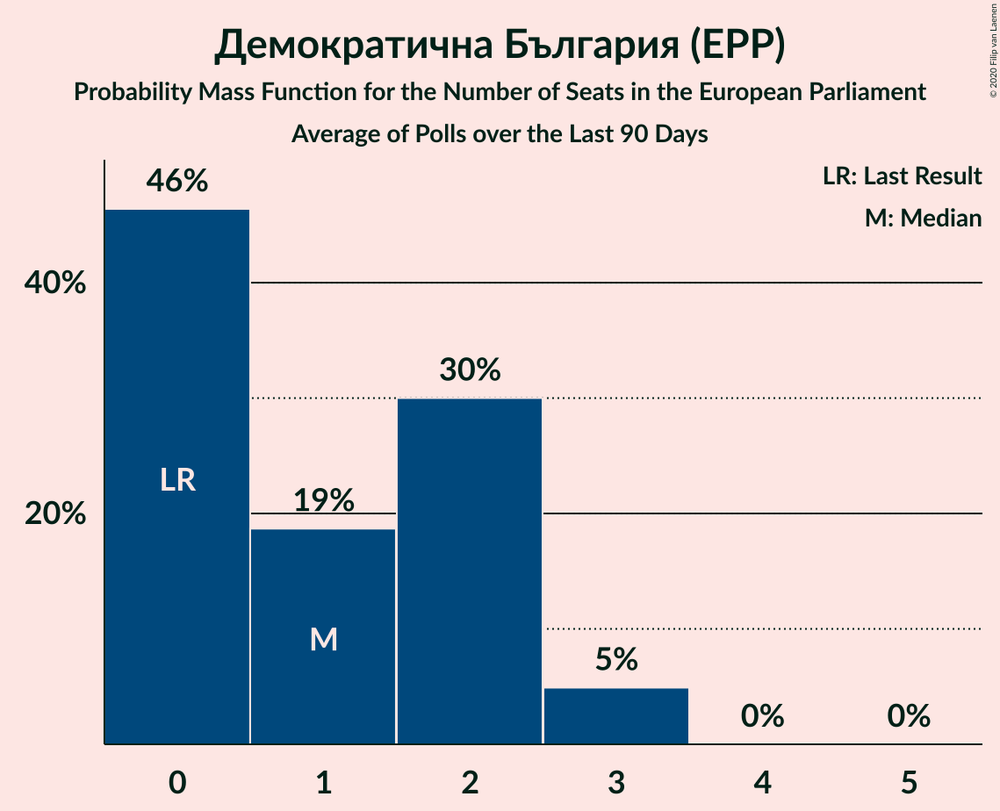

| Number of Seats | Probability | Accumulated | Special Marks |
|:---------------:|:-----------:|:-----------:|:-------------:|
| 0 | 46% | 100% | Last Result |
| 1 | 19% | 54% | Median |
| 2 | 30% | 35% |  |
| 3 | 5% | 5% |  |
| 4 | 0% | 0% |  |

### Демократи за силна България (EPP)

*For a full overview of the results for this party, see the [Демократи за силна България (EPP)](party-демократизасилнабългарияepp.html) page.*

### Да, България! (*)

*For a full overview of the results for this party, see the [Да, България! (*)](party-дабългария.html) page.*

### Алтернатива за българско възраждане (S&D)

*For a full overview of the results for this party, see the [Алтернатива за българско възраждане (S&D)](party-алтернативазабългарсковъзражданеsd.html) page.*

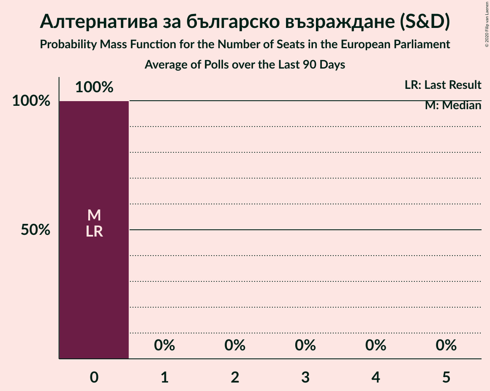

| Number of Seats | Probability | Accumulated | Special Marks |
|:---------------:|:-----------:|:-----------:|:-------------:|
| 0 | 100% | 100% | Last Result, Median |

### Има такъв народ (*)

*For a full overview of the results for this party, see the [Има такъв народ (*)](party-иматакъвнарод.html) page.*

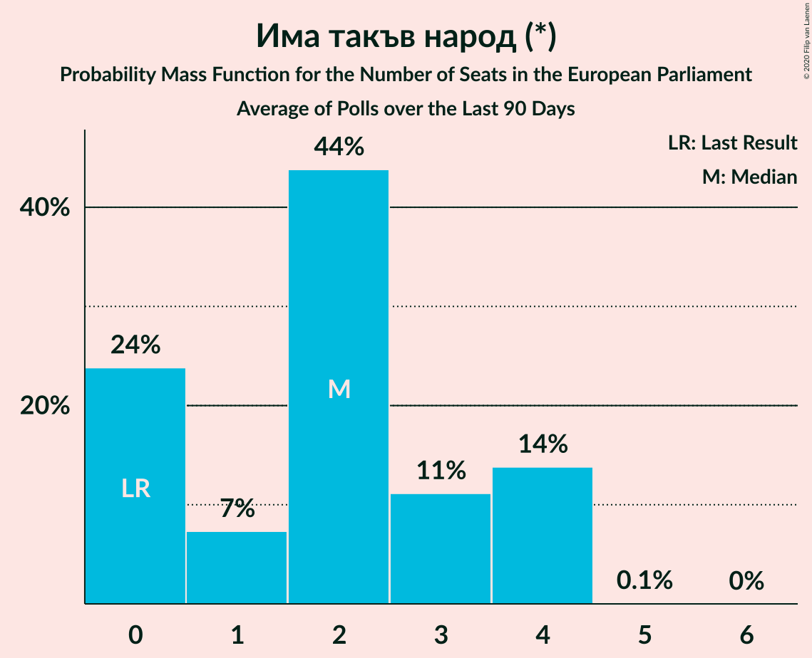

| Number of Seats | Probability | Accumulated | Special Marks |
|:---------------:|:-----------:|:-----------:|:-------------:|
| 0 | 24% | 100% | Last Result |
| 1 | 7% | 76% |  |
| 2 | 44% | 69% | Median |
| 3 | 11% | 25% |  |
| 4 | 14% | 14% |  |
| 5 | 0.1% | 0.1% |  |
| 6 | 0% | 0% |  |

### Възраждане (*)

*For a full overview of the results for this party, see the [Възраждане (*)](party-възраждане.html) page.*

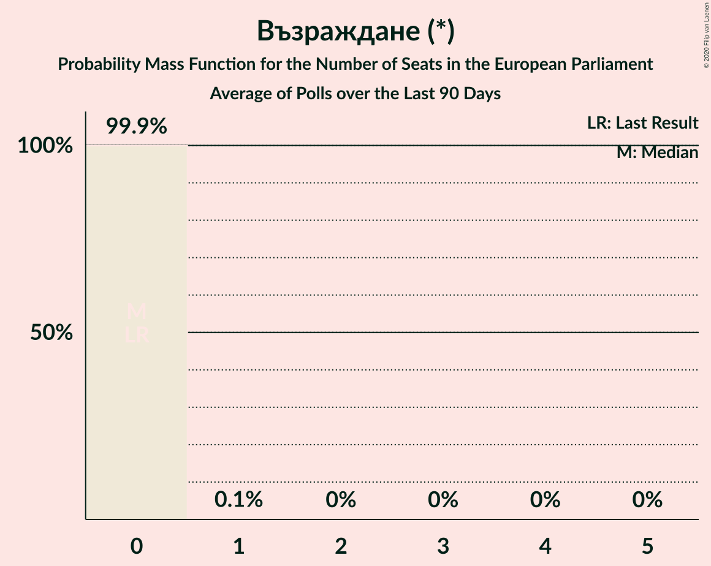

| Number of Seats | Probability | Accumulated | Special Marks |
|:---------------:|:-----------:|:-----------:|:-------------:|
| 0 | 99.9% | 100% | Last Result, Median |
| 1 | 0.1% | 0.1% |  |
| 2 | 0% | 0% |  |

### Изправи се Бг (*)

*For a full overview of the results for this party, see the [Изправи се Бг (*)](party-изправисебг.html) page.*

| Number of Seats | Probability | Accumulated | Special Marks |
|:---------------:|:-----------:|:-----------:|:-------------:|
| 0 | 73% | 100% | Last Result, Median |
| 1 | 26% | 27% |  |
| 2 | 2% | 2% |  |
| 3 | 0% | 0% |  |

## Coalitions

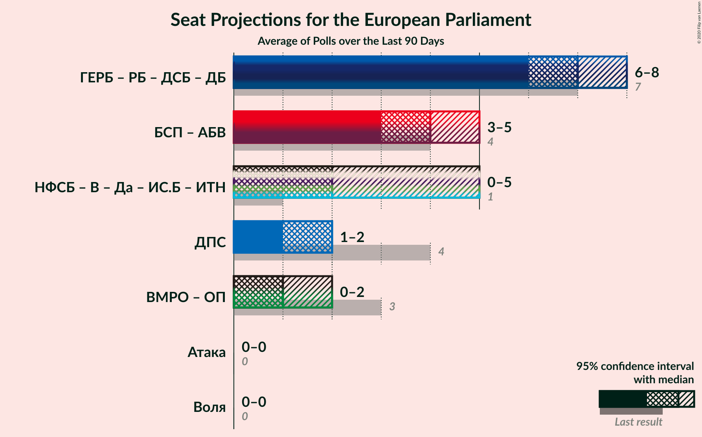

### Confidence Intervals

| Coalition | Last Result | Median | Majority? | 80% Confidence Interval | 90% Confidence Interval | 95% Confidence Interval | 99% Confidence Interval |
|:---------:|:-----------:|:------:|:---------:|:-----------------------:|:-----------------------:|:-----------------------:|:-----------------------:|
| Граждани за европейско развитие на България (EPP) – Реформаторски блок (EPP) – Демократи за силна България (EPP) – Демократична България (EPP) | 7 | 7 | 1.4% | 7–8 | 7–8 | 6–8 | 6–9 |
| Българска социалистическа партия (S&D) – Алтернатива за българско възраждане (S&D) | 4 | 4 | 0% | 3–5 | 3–5 | 3–5 | 3–5 |
| Национален фронт за спасение на България (*) – Възраждане (*) – Да, България! (*) – Изправи се Бг (*) – Има такъв народ (*) | 1 | 2 | 0% | 0–5 | 0–5 | 0–5 | 0–5 |
| Движение за права и свободи (RE) | 4 | 2 | 0% | 1–2 | 1–2 | 1–2 | 1–3 |
| ВМРО–Българско Национално Движение (ECR) – Обединени Патриоти (ECR) | 3 | 1 | 0% | 0–2 | 0–2 | 0–2 | 0–2 |
| Атака (NI) | 0 | 0 | 0% | 0 | 0 | 0 | 0 |
| Воля (ID) | 0 | 0 | 0% | 0 | 0 | 0 | 0–1 |

### Граждани за европейско развитие на България (EPP) – Реформаторски блок (EPP) – Демократи за силна България (EPP) – Демократична България (EPP)

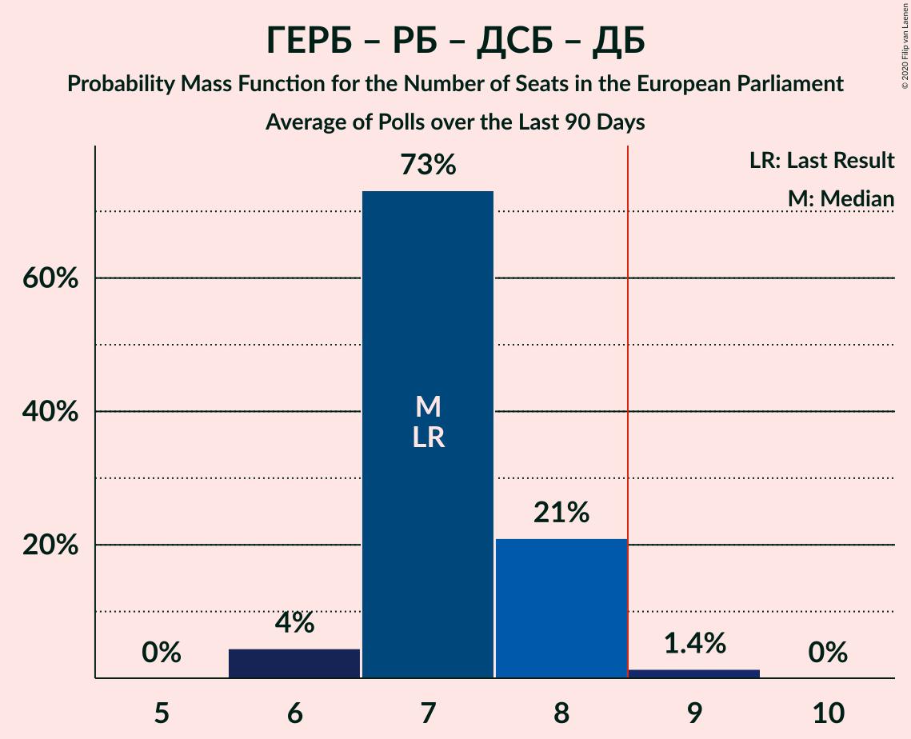

| Number of Seats | Probability | Accumulated | Special Marks |
|:---------------:|:-----------:|:-----------:|:-------------:|
| 6 | 4% | 100% |  |
| 7 | 73% | 96% | Last Result, Median |
| 8 | 21% | 22% |  |
| 9 | 1.4% | 1.4% | Majority |
| 10 | 0% | 0% |  |

### Българска социалистическа партия (S&D) – Алтернатива за българско възраждане (S&D)

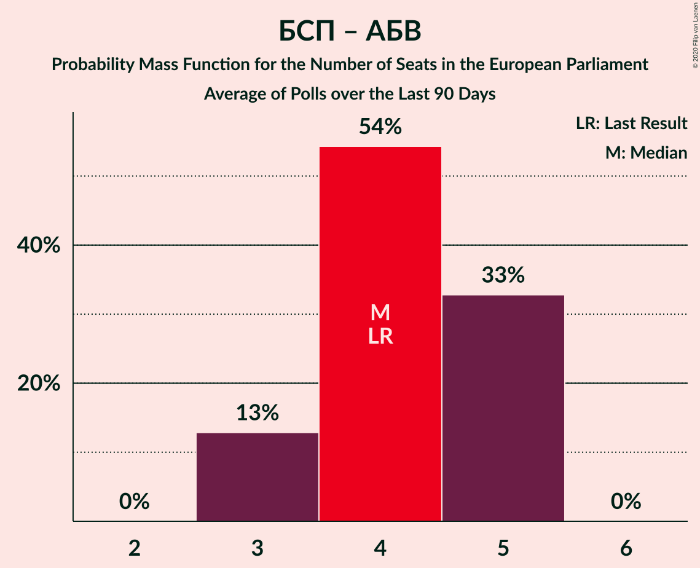

| Number of Seats | Probability | Accumulated | Special Marks |
|:---------------:|:-----------:|:-----------:|:-------------:|
| 3 | 13% | 100% |  |
| 4 | 54% | 87% | Last Result, Median |
| 5 | 33% | 33% |  |
| 6 | 0% | 0% |  |

### Национален фронт за спасение на България (*) – Възраждане (*) – Да, България! (*) – Изправи се Бг (*) – Има такъв народ (*)

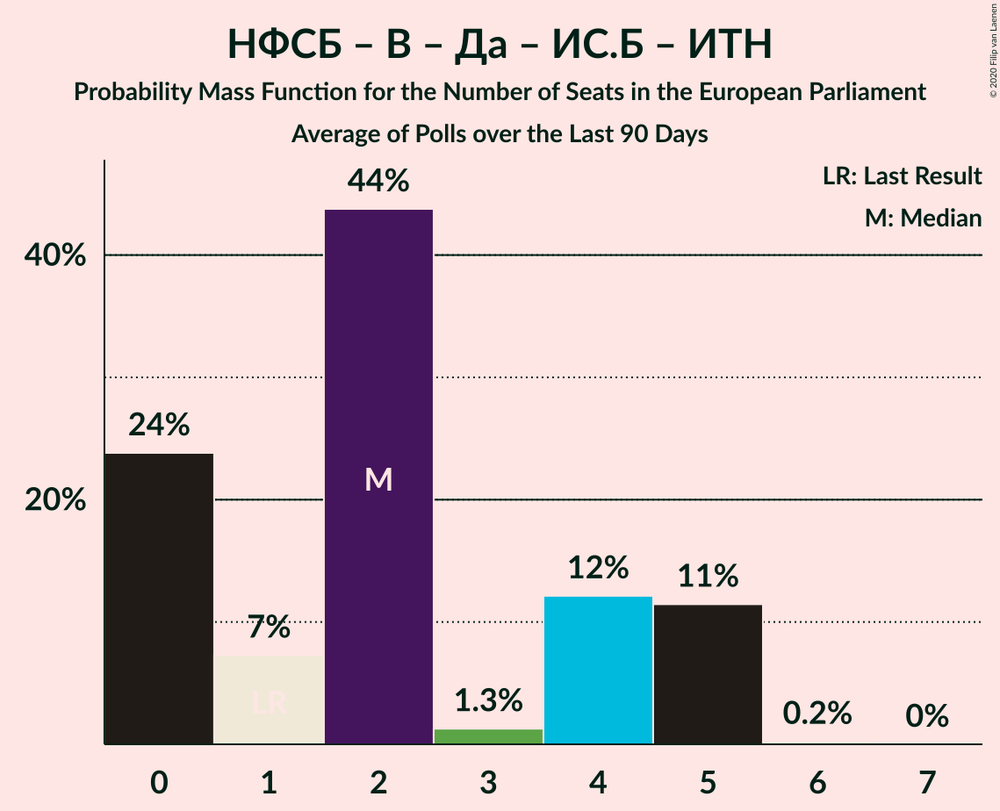

| Number of Seats | Probability | Accumulated | Special Marks |
|:---------------:|:-----------:|:-----------:|:-------------:|
| 0 | 24% | 100% |  |
| 1 | 7% | 76% | Last Result |
| 2 | 44% | 69% | Median |
| 3 | 1.3% | 25% |  |
| 4 | 12% | 24% |  |
| 5 | 11% | 12% |  |
| 6 | 0.2% | 0.2% |  |
| 7 | 0% | 0% |  |

### Движение за права и свободи (RE)

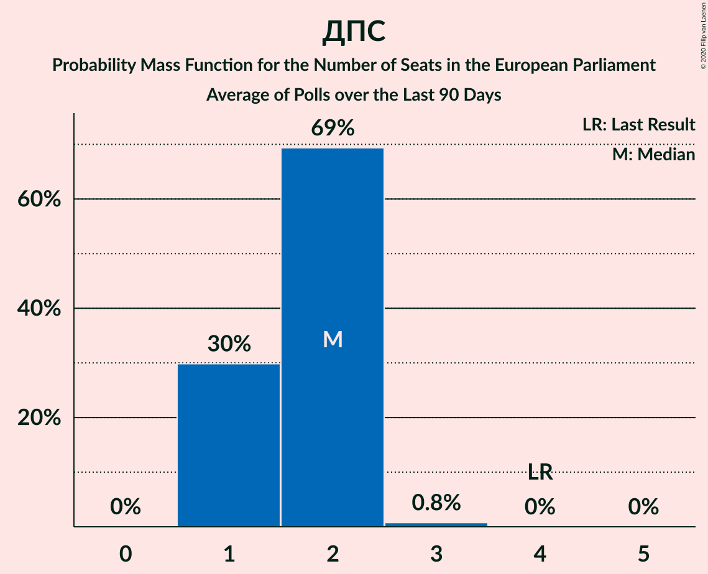

| Number of Seats | Probability | Accumulated | Special Marks |
|:---------------:|:-----------:|:-----------:|:-------------:|
| 1 | 30% | 100% |  |
| 2 | 69% | 70% | Median |
| 3 | 0.8% | 0.8% |  |
| 4 | 0% | 0% | Last Result |

### ВМРО–Българско Национално Движение (ECR) – Обединени Патриоти (ECR)

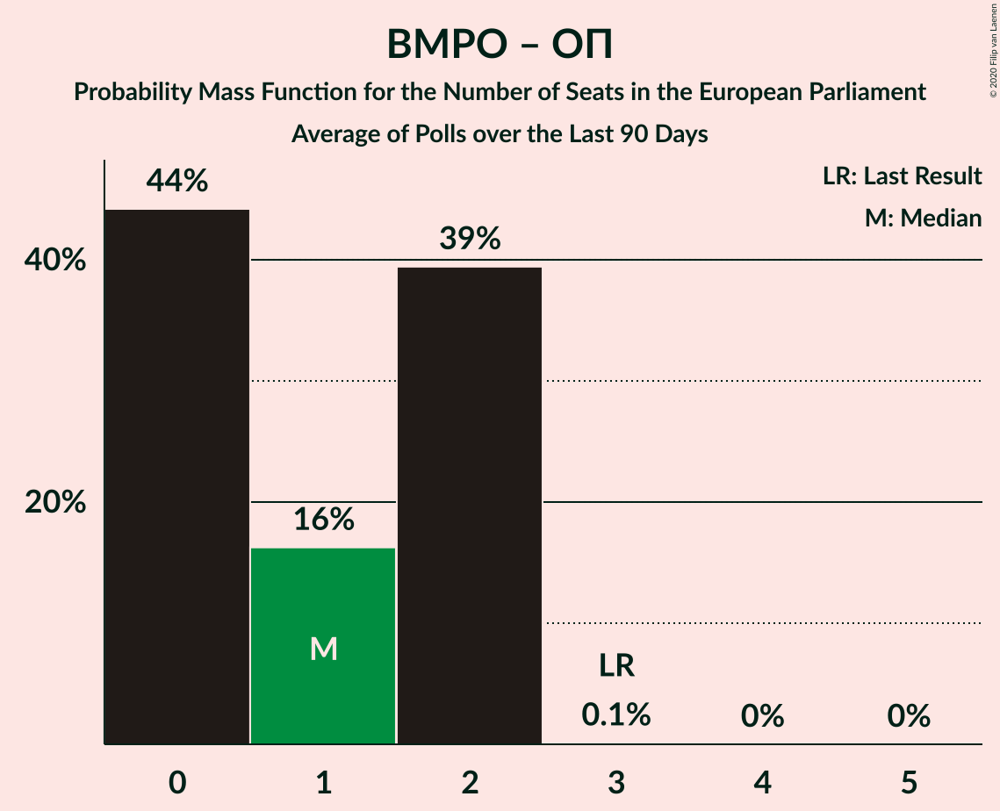

| Number of Seats | Probability | Accumulated | Special Marks |
|:---------------:|:-----------:|:-----------:|:-------------:|
| 0 | 44% | 100% |  |
| 1 | 16% | 56% |  |
| 2 | 39% | 40% | Median |
| 3 | 0.1% | 0.1% | Last Result |
| 4 | 0% | 0% |  |

### Атака (NI)

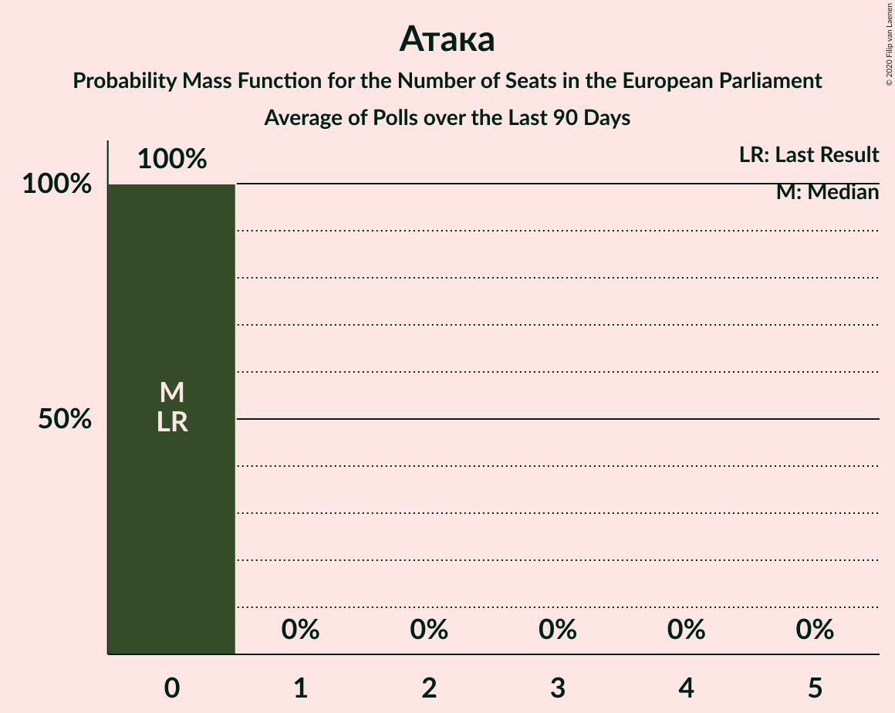

| Number of Seats | Probability | Accumulated | Special Marks |
|:---------------:|:-----------:|:-----------:|:-------------:|
| 0 | 100% | 100% | Last Result, Median |

### Воля (ID)

| Number of Seats | Probability | Accumulated | Special Marks |
|:---------------:|:-----------:|:-----------:|:-------------:|
| 0 | 98% | 100% | Last Result, Median |
| 1 | 2% | 2% |  |
| 2 | 0% | 0% |  |

## Technical Information

+ **Number of polls included in this average:** 4
+ **Lowest number of simulations done in a poll included in this average:** 1,048,576
+ **Total number of simulations done in the polls included in this average:** 4,194,304
+ **Error estimate:** 2.45%
