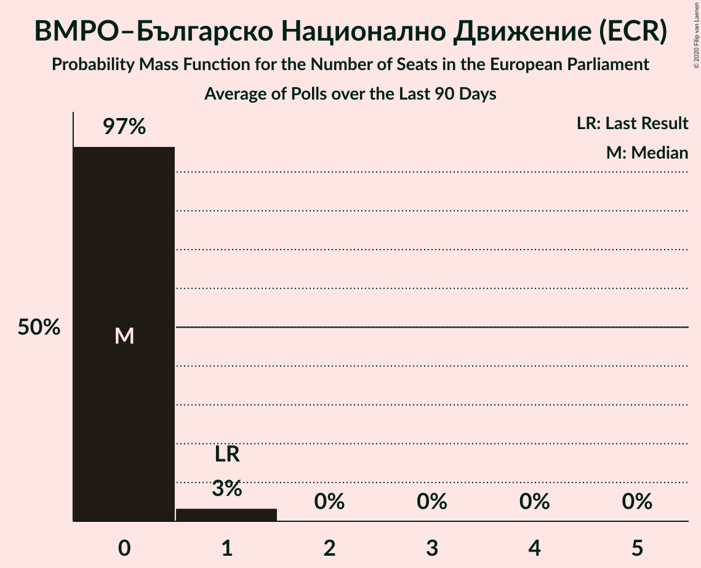

# Poll Average

<a href="#voting-intentions">Voting Intentions</a> | <a href="#seats">Seats</a> | <a href="#coalitions">Coalitions</a> | <a href="#technical-information">Technical Information</a>

## Summary

The table below lists the polls on which the average is based. They are the most recent polls (less than 90 days old) registered and analyzed so far.

| Period     | Polling firm/Commissioner(s) | ГЕРБ | БСП | ДПС | ОП | ВМРО | НФСБ | Атака | РБ | Воля | ДБ | ДСБ | Да | АБВ | ИТН | В | ИС.Б |
|:----------:|:----------------------------:|:--:|:--:|:--:|:--:|:--:|:--:|:--:|:--:|:--:|:--:|:--:|:--:|:--:|:--:|:--:|:--:|
| 26 May 2019 | General Election | 30.4%   6 | 18.9%   4 | 17.3%   4 | 10.7%   2 | 10.7%   1 | 10.7%   1 | 10.7%   0 | 6.4%   1 | 0.0%   0 | 0.0%   0 | 0.0%   0 | 0.0%   0 | 0.0%   0 | 0.0%   0 | 0.0%   0 | 0.0%   0 |
| N/A | Poll Average | 19–31%   3–6 | 19–30%   3–6 | 6–13%   1–2 | 2–5%   0–1 | 2–6%   0–1 | 0–2%   0 | 0–2%   0 | N/A   N/A | 0–4%   0 | 4–14%   0–3 | N/A   N/A | N/A   N/A | 0–2%   0 | 12–19%   2–4 | 0–2%   0 | 2–6%   0–1 |
| [21–30 September 2020](2020-09-30-Алфарисърч.html) | Алфа рисърч | 20–25%   4–5 | 19–24%   3–4 | 9–13%   2 | 3–6%   0–1 | N/A   N/A | N/A   N/A | N/A   N/A | N/A   N/A | 0–1%   0 | 9–12%   2 | N/A   N/A | N/A   N/A | N/A   N/A | 14–19%   3–4 | N/A   N/A | 4–7%   0–1 |
| [18–26 September 2020](2020-09-26-МаркетЛИНКС.html) | Маркет ЛИНКС | 24–31%   4–6 | 24–31%   4–6 | 8–13%   1–2 | 2–5%   0 | N/A   N/A | N/A   N/A | N/A   N/A | N/A   N/A | N/A   N/A | 9–15%   2–3 | N/A   N/A | N/A   N/A | N/A   N/A | 11–17%   2–3 | N/A   N/A | 2–5%   0 |
| [3–11 September 2020](2020-09-11-GallupInternational.html) | Gallup International | 17–25%   3–5 | 18–25%   3–5 | 6–10%   1–2 | 2–5%   0 | N/A   N/A | N/A   N/A | N/A   N/A | N/A   N/A | 1–3%   0 | 4–8%   0–1 | N/A   N/A | N/A   N/A | N/A   N/A | 13–20%   2–4 | N/A   N/A | 3–6%   0–1 |
| [29 August–5 September 2020](2020-09-05-Тренд.html) | Тренд   24 часа | 21–27%   4–5 | 21–26%   4–5 | 9–12%   2–3 | 3–5%   0–1 | N/A   N/A | N/A   N/A | 1–2%   0 | N/A   N/A | 1–2%   0 | 8–12%   2 | N/A   N/A | N/A   N/A | 0–1%   0 | 14–18%   3–4 | 1–2%   0 | 3–5%   0–1 |
| [19–25 August 2020](2020-08-25-SovaHarris.html) | Sova Harris | 25–31%   5–6 | 21–28%   4–6 | 7–12%   1–2 | N/A   N/A | 3–6%   0–1 | 0–2%   0 | 0–2%   0 | N/A   N/A | 2–5%   0 | 5–9%   1–2 | N/A   N/A | N/A   N/A | 1–2%   0 | 13–19%   3–4 | 0–2%   0 | 3–6%   0–1 |
| 26 May 2019 | General Election | 30.4%   6 | 18.9%   4 | 17.3%   4 | 10.7%   2 | 10.7%   1 | 10.7%   1 | 10.7%   0 | 6.4%   1 | 0.0%   0 | 0.0%   0 | 0.0%   0 | 0.0%   0 | 0.0%   0 | 0.0%   0 | 0.0%   0 | 0.0%   0 |

Only polls for which at least the sample size has been published are included in the table above.

**Legend:**
+ **Top half of each row:** Voting intentions (95% confidence interval)
+ **Bottom half of each row:** Seat projections for the European Parliament (95% confidence interval)
+ **ГЕРБ:** Граждани за европейско развитие на България (EPP)
+ **БСП:** Българска социалистическа партия (S&D)
+ **ДПС:** Движение за права и свободи (RE)
+ **ОП:** Обединени Патриоти (ECR)
+ **ВМРО:** ВМРО–Българско Национално Движение (ECR)
+ **НФСБ:** Национален фронт за спасение на България (*)
+ **Атака:** Атака (NI)
+ **РБ:** Реформаторски блок (EPP)
+ **Воля:** Воля (ID)
+ **ДБ:** Демократична България (EPP)
+ **ДСБ:** Демократи за силна България (EPP)
+ **Да:** Да, България! (*)
+ **АБВ:** Алтернатива за българско възраждане (S&D)
+ **ИТН:** Има такъв народ (*)
+ **В:** Възраждане (*)
+ **ИС.Б:** Изправи се Бг (*)
+ **N/A (single party):** Party not included the published results
+ **N/A (entire row):** Calculation for this opinion poll not started yet

## Voting Intentions

### Confidence Intervals

| Party | Last Result | Median | 80% Confidence Interval | 90% Confidence Interval | 95% Confidence Interval | 99% Confidence Interval |
|:-----:|:-----------:|:------:|:-----------------------:|:-----------------------:|:-----------------------:|:-----------------------:|
| <a href="#граждани-за-европейско-развитие-на-българия-(epp)">Граждани за европейско развитие на България (EPP)</a> | 30.4% | 24.2% | 20.6–29.0% |19.6–29.9% | 18.8–30.6% | 17.5–31.9% |
| <a href="#българска-социалистическа-партия-(s&d)">Българска социалистическа партия (S&D)</a> | 18.9% | 23.4% | 20.5–27.5% |19.8–28.6% | 19.1–29.5% | 17.8–31.1% |
| <a href="#движение-за-права-и-свободи-(re)">Движение за права и свободи (RE)</a> | 17.3% | 9.9% | 7.5–11.7% |6.9–12.2% | 6.4–12.6% | 5.6–13.4% |
| <a href="#обединени-патриоти-(ecr)">Обединени Патриоти (ECR)</a> | 10.7% | 3.6% | 2.3–4.7% |2.0–5.0% | 1.8–5.3% | 1.5–5.8% |
| <a href="#вмро–българско-национално-движение-(ecr)">ВМРО–Българско Национално Движение (ECR)</a> | 10.7% | 3.8% | 2.9–4.9% |2.7–5.2% | 2.5–5.5% | 2.2–6.1% |
| <a href="#национален-фронт-за-спасение-на-българия-(*)">Национален фронт за спасение на България (*)</a> | 10.7% | 0.7% | 0.4–1.2% |0.3–1.4% | 0.3–1.6% | 0.2–1.9% |
| <a href="#атака-(ni)">Атака (NI)</a> | 10.7% | 1.1% | 0.7–1.6% |0.6–1.8% | 0.5–2.0% | 0.4–2.3% |
| <a href="#реформаторски-блок-(epp)">Реформаторски блок (EPP)</a> | 6.4% | N/A | N/A |N/A | N/A | N/A |
| <a href="#воля-(id)">Воля (ID)</a> | 0.0% | 1.5% | 0.3–3.3% |0.2–3.7% | 0.2–4.0% | 0.1–4.7% |
| <a href="#демократична-българия-(epp)">Демократична България (EPP)</a> | 0.0% | 9.6% | 5.3–12.1% |4.7–12.9% | 4.3–13.5% | 3.6–14.7% |
| <a href="#демократи-за-силна-българия-(epp)">Демократи за силна България (EPP)</a> | 0.0% | N/A | N/A |N/A | N/A | N/A |
| <a href="#да,-българия!-(*)">Да, България! (*)</a> | 0.0% | N/A | N/A |N/A | N/A | N/A |
| <a href="#алтернатива-за-българско-възраждане-(s&d)">Алтернатива за българско възраждане (S&D)</a> | 0.0% | 0.6% | 0.1–1.6% |0.1–1.8% | 0.1–2.0% | 0.0–2.5% |
| <a href="#има-такъв-народ-(*)">Има такъв народ (*)</a> | 0.0% | 15.8% | 13.3–17.8% |12.5–18.4% | 11.9–18.9% | 10.8–20.0% |
| <a href="#възраждане-(*)">Възраждане (*)</a> | 0.0% | 1.0% | 0.5–1.6% |0.4–1.8% | 0.3–1.9% | 0.2–2.3% |
| <a href="#изправи-се-бг-(*)">Изправи се Бг (*)</a> | 0.0% | 4.3% | 3.0–5.6% |2.7–6.0% | 2.4–6.3% | 2.0–6.9% |

### Граждани за европейско развитие на България (EPP)

*For a full overview of the results for this party, see the [Граждани за европейско развитие на България (EPP)](party-гражданизаевропейскоразвитиенабългарияepp.html) page.*

| Voting Intentions | Probability | Accumulated | Special Marks |
|:-----------------:|:-----------:|:-----------:|:-------------:|
| 14.5–15.5% | 0% | 100% |  |
| 15.5–16.5% | 0.1% | 100% |  |
| 16.5–17.5% | 0.4% | 99.9% |  |
| 17.5–18.5% | 1.3% | 99.5% |  |
| 18.5–19.5% | 3% | 98% |  |
| 19.5–20.5% | 5% | 95% |  |
| 20.5–21.5% | 8% | 91% |  |
| 21.5–22.5% | 11% | 83% |  |
| 22.5–23.5% | 13% | 72% |  |
| 23.5–24.5% | 12% | 59% | Median |
| 24.5–25.5% | 9% | 47% |  |
| 25.5–26.5% | 8% | 38% |  |
| 26.5–27.5% | 9% | 30% |  |
| 27.5–28.5% | 8% | 21% |  |
| 28.5–29.5% | 7% | 13% |  |
| 29.5–30.5% | 4% | 6% | Last Result |
| 30.5–31.5% | 2% | 3% |  |
| 31.5–32.5% | 0.6% | 0.8% |  |
| 32.5–33.5% | 0.2% | 0.2% |  |
| 33.5–34.5% | 0% | 0% |  |

### Българска социалистическа партия (S&D)

*For a full overview of the results for this party, see the [Българска социалистическа партия (S&D)](party-българскасоциалистическапартияsd.html) page.*

| Voting Intentions | Probability | Accumulated | Special Marks |
|:-----------------:|:-----------:|:-----------:|:-------------:|
| 15.5–16.5% | 0% | 100% |  |
| 16.5–17.5% | 0.3% | 99.9% |  |
| 17.5–18.5% | 1.0% | 99.7% |  |
| 18.5–19.5% | 3% | 98.7% | Last Result |
| 19.5–20.5% | 6% | 96% |  |
| 20.5–21.5% | 11% | 90% |  |
| 21.5–22.5% | 15% | 78% |  |
| 22.5–23.5% | 15% | 63% | Median |
| 23.5–24.5% | 14% | 48% |  |
| 24.5–25.5% | 10% | 34% |  |
| 25.5–26.5% | 8% | 24% |  |
| 26.5–27.5% | 6% | 16% |  |
| 27.5–28.5% | 4% | 10% |  |
| 28.5–29.5% | 3% | 5% |  |
| 29.5–30.5% | 1.5% | 2% |  |
| 30.5–31.5% | 0.6% | 0.9% |  |
| 31.5–32.5% | 0.2% | 0.3% |  |
| 32.5–33.5% | 0.1% | 0.1% |  |
| 33.5–34.5% | 0% | 0% |  |

### Движение за права и свободи (RE)

*For a full overview of the results for this party, see the [Движение за права и свободи (RE)](party-движениезаправаисвободиre.html) page.*

| Voting Intentions | Probability | Accumulated | Special Marks |
|:-----------------:|:-----------:|:-----------:|:-------------:|
| 3.5–4.5% | 0% | 100% |  |
| 4.5–5.5% | 0.4% | 100% |  |
| 5.5–6.5% | 3% | 99.6% |  |
| 6.5–7.5% | 7% | 97% |  |
| 7.5–8.5% | 13% | 89% |  |
| 8.5–9.5% | 19% | 77% |  |
| 9.5–10.5% | 24% | 58% | Median |
| 10.5–11.5% | 21% | 34% |  |
| 11.5–12.5% | 10% | 12% |  |
| 12.5–13.5% | 2% | 3% |  |
| 13.5–14.5% | 0.3% | 0.3% |  |
| 14.5–15.5% | 0% | 0% |  |
| 15.5–16.5% | 0% | 0% |  |
| 16.5–17.5% | 0% | 0% | Last Result |

### Обединени Патриоти (ECR)

*For a full overview of the results for this party, see the [Обединени Патриоти (ECR)](party-обединенипатриотиecr.html) page.*

| Voting Intentions | Probability | Accumulated | Special Marks |
|:-----------------:|:-----------:|:-----------:|:-------------:|
| 0.0–0.5% | 0% | 100% |  |
| 0.5–1.5% | 0.7% | 100% |  |
| 1.5–2.5% | 16% | 99.3% |  |
| 2.5–3.5% | 33% | 84% |  |
| 3.5–4.5% | 36% | 50% | Median |
| 4.5–5.5% | 13% | 14% |  |
| 5.5–6.5% | 1.2% | 1.2% |  |
| 6.5–7.5% | 0% | 0% |  |
| 7.5–8.5% | 0% | 0% |  |
| 8.5–9.5% | 0% | 0% |  |
| 9.5–10.5% | 0% | 0% |  |
| 10.5–11.5% | 0% | 0% | Last Result |

### Атака (NI)

*For a full overview of the results for this party, see the [Атака (NI)](party-атакаni.html) page.*

| Voting Intentions | Probability | Accumulated | Special Marks |
|:-----------------:|:-----------:|:-----------:|:-------------:|
| 0.0–0.5% | 4% | 100% |  |
| 0.5–1.5% | 83% | 96% | Median |
| 1.5–2.5% | 13% | 13% |  |
| 2.5–3.5% | 0.2% | 0.2% |  |
| 3.5–4.5% | 0% | 0% |  |
| 4.5–5.5% | 0% | 0% |  |
| 5.5–6.5% | 0% | 0% |  |
| 6.5–7.5% | 0% | 0% |  |
| 7.5–8.5% | 0% | 0% |  |
| 8.5–9.5% | 0% | 0% |  |
| 9.5–10.5% | 0% | 0% |  |
| 10.5–11.5% | 0% | 0% | Last Result |

### ВМРО–Българско Национално Движение (ECR)

*For a full overview of the results for this party, see the [ВМРО–Българско Национално Движение (ECR)](party-вмро–българсконационалнодвижениеecr.html) page.*

| Voting Intentions | Probability | Accumulated | Special Marks |
|:-----------------:|:-----------:|:-----------:|:-------------:|
| 0.5–1.5% | 0% | 100% |  |
| 1.5–2.5% | 3% | 100% |  |
| 2.5–3.5% | 32% | 97% |  |
| 3.5–4.5% | 47% | 65% | Median |
| 4.5–5.5% | 16% | 18% |  |
| 5.5–6.5% | 2% | 2% |  |
| 6.5–7.5% | 0.1% | 0.1% |  |
| 7.5–8.5% | 0% | 0% |  |
| 8.5–9.5% | 0% | 0% |  |
| 9.5–10.5% | 0% | 0% |  |
| 10.5–11.5% | 0% | 0% | Last Result |

### Национален фронт за спасение на България (*)

*For a full overview of the results for this party, see the [Национален фронт за спасение на България (*)](party-националенфронтзаспасениенабългария.html) page.*

| Voting Intentions | Probability | Accumulated | Special Marks |
|:-----------------:|:-----------:|:-----------:|:-------------:|
| 0.0–0.5% | 28% | 100% |  |
| 0.5–1.5% | 69% | 72% | Median |
| 1.5–2.5% | 3% | 3% |  |
| 2.5–3.5% | 0% | 0% |  |
| 3.5–4.5% | 0% | 0% |  |
| 4.5–5.5% | 0% | 0% |  |
| 5.5–6.5% | 0% | 0% |  |
| 6.5–7.5% | 0% | 0% |  |
| 7.5–8.5% | 0% | 0% |  |
| 8.5–9.5% | 0% | 0% |  |
| 9.5–10.5% | 0% | 0% |  |
| 10.5–11.5% | 0% | 0% | Last Result |

### Воля (ID)

*For a full overview of the results for this party, see the [Воля (ID)](party-воляid.html) page.*

| Voting Intentions | Probability | Accumulated | Special Marks |
|:-----------------:|:-----------:|:-----------:|:-------------:|
| 0.0–0.5% | 21% | 100% | Last Result |
| 0.5–1.5% | 31% | 79% |  |
| 1.5–2.5% | 25% | 48% | Median |
| 2.5–3.5% | 17% | 24% |  |
| 3.5–4.5% | 6% | 6% |  |
| 4.5–5.5% | 0.6% | 0.7% |  |
| 5.5–6.5% | 0% | 0% |  |

### Демократична България (EPP)

*For a full overview of the results for this party, see the [Демократична България (EPP)](party-демократичнабългарияepp.html) page.*

| Voting Intentions | Probability | Accumulated | Special Marks |
|:-----------------:|:-----------:|:-----------:|:-------------:|
| 0.0–0.5% | 0% | 100% | Last Result |
| 0.5–1.5% | 0% | 100% |  |
| 1.5–2.5% | 0% | 100% |  |
| 2.5–3.5% | 0.4% | 100% |  |
| 3.5–4.5% | 4% | 99.6% |  |
| 4.5–5.5% | 9% | 96% |  |
| 5.5–6.5% | 11% | 88% |  |
| 6.5–7.5% | 10% | 77% |  |
| 7.5–8.5% | 7% | 67% |  |
| 8.5–9.5% | 10% | 60% |  |
| 9.5–10.5% | 18% | 50% | Median |
| 10.5–11.5% | 16% | 32% |  |
| 11.5–12.5% | 9% | 16% |  |
| 12.5–13.5% | 4% | 7% |  |
| 13.5–14.5% | 2% | 2% |  |
| 14.5–15.5% | 0.5% | 0.7% |  |
| 15.5–16.5% | 0.1% | 0.1% |  |
| 16.5–17.5% | 0% | 0% |  |

### Има такъв народ (*)

*For a full overview of the results for this party, see the [Има такъв народ (*)](party-иматакъвнарод.html) page.*

| Voting Intentions | Probability | Accumulated | Special Marks |
|:-----------------:|:-----------:|:-----------:|:-------------:|
| 0.0–0.5% | 0% | 100% | Last Result |
| 0.5–1.5% | 0% | 100% |  |
| 1.5–2.5% | 0% | 100% |  |
| 2.5–3.5% | 0% | 100% |  |
| 3.5–4.5% | 0% | 100% |  |
| 4.5–5.5% | 0% | 100% |  |
| 5.5–6.5% | 0% | 100% |  |
| 6.5–7.5% | 0% | 100% |  |
| 7.5–8.5% | 0% | 100% |  |
| 8.5–9.5% | 0% | 100% |  |
| 9.5–10.5% | 0.3% | 100% |  |
| 10.5–11.5% | 1.3% | 99.7% |  |
| 11.5–12.5% | 4% | 98% |  |
| 12.5–13.5% | 7% | 95% |  |
| 13.5–14.5% | 12% | 88% |  |
| 14.5–15.5% | 19% | 76% |  |
| 15.5–16.5% | 24% | 56% | Median |
| 16.5–17.5% | 19% | 32% |  |
| 17.5–18.5% | 9% | 13% |  |
| 18.5–19.5% | 3% | 4% |  |
| 19.5–20.5% | 0.8% | 1.0% |  |
| 20.5–21.5% | 0.2% | 0.2% |  |
| 21.5–22.5% | 0% | 0% |  |

### Изправи се Бг (*)

*For a full overview of the results for this party, see the [Изправи се Бг (*)](party-изправисебг.html) page.*

| Voting Intentions | Probability | Accumulated | Special Marks |
|:-----------------:|:-----------:|:-----------:|:-------------:|
| 0.0–0.5% | 0% | 100% | Last Result |
| 0.5–1.5% | 0.1% | 100% |  |
| 1.5–2.5% | 4% | 99.9% |  |
| 2.5–3.5% | 20% | 96% |  |
| 3.5–4.5% | 37% | 77% | Median |
| 4.5–5.5% | 28% | 39% |  |
| 5.5–6.5% | 10% | 11% |  |
| 6.5–7.5% | 1.2% | 1.3% |  |
| 7.5–8.5% | 0.1% | 0.1% |  |
| 8.5–9.5% | 0% | 0% |  |

### Алтернатива за българско възраждане (S&D)

*For a full overview of the results for this party, see the [Алтернатива за българско възраждане (S&D)](party-алтернативазабългарсковъзражданеsd.html) page.*

| Voting Intentions | Probability | Accumulated | Special Marks |
|:-----------------:|:-----------:|:-----------:|:-------------:|
| 0.0–0.5% | 47% | 100% | Last Result |
| 0.5–1.5% | 42% | 53% | Median |
| 1.5–2.5% | 11% | 11% |  |
| 2.5–3.5% | 0.4% | 0.4% |  |
| 3.5–4.5% | 0% | 0% |  |

### Възраждане (*)

*For a full overview of the results for this party, see the [Възраждане (*)](party-възраждане.html) page.*

| Voting Intentions | Probability | Accumulated | Special Marks |
|:-----------------:|:-----------:|:-----------:|:-------------:|
| 0.0–0.5% | 14% | 100% | Last Result |
| 0.5–1.5% | 74% | 86% | Median |
| 1.5–2.5% | 12% | 12% |  |
| 2.5–3.5% | 0.1% | 0.1% |  |
| 3.5–4.5% | 0% | 0% |  |

## Seats

### Confidence Intervals

| Party | Last Result | Median | 80% Confidence Interval | 90% Confidence Interval | 95% Confidence Interval | 99% Confidence Interval |
|:-----:|:-----------:|:------:|:-----------------------:|:-----------------------:|:-----------------------:|:-----------------------:|
| <a href="#граждани-за-европейско-развитие-на-българия-(epp)">Граждани за европейско развитие на България (EPP)</a> | 6 | 5 | 4–6 |4–6 | 3–6 | 3–6 |
| <a href="#българска-социалистическа-партия-(s&d)">Българска социалистическа партия (S&D)</a> | 4 | 4 | 4–5 |4–5 | 3–6 | 3–6 |
| <a href="#движение-за-права-и-свободи-(re)">Движение за права и свободи (RE)</a> | 4 | 2 | 1–2 |1–2 | 1–2 | 1–3 |
| <a href="#обединени-патриоти-(ecr)">Обединени Патриоти (ECR)</a> | 2 | 0 | 0 |0 | 0–1 | 0–1 |
| <a href="#вмро–българско-национално-движение-(ecr)">ВМРО–Българско Национално Движение (ECR)</a> | 1 | 0 | 0 |0 | 0–1 | 0–1 |
| <a href="#национален-фронт-за-спасение-на-българия-(*)">Национален фронт за спасение на България (*)</a> | 1 | 0 | 0 |0 | 0 | 0 |
| <a href="#атака-(ni)">Атака (NI)</a> | 0 | 0 | 0 |0 | 0 | 0 |
| <a href="#реформаторски-блок-(epp)">Реформаторски блок (EPP)</a> | 1 | N/A | N/A |N/A | N/A | N/A |
| <a href="#воля-(id)">Воля (ID)</a> | 0 | 0 | 0 |0 | 0 | 0 |
| <a href="#демократична-българия-(epp)">Демократична България (EPP)</a> | 0 | 2 | 1–2 |0–2 | 0–3 | 0–3 |
| <a href="#демократи-за-силна-българия-(epp)">Демократи за силна България (EPP)</a> | 0 | N/A | N/A |N/A | N/A | N/A |
| <a href="#да,-българия!-(*)">Да, България! (*)</a> | 0 | N/A | N/A |N/A | N/A | N/A |
| <a href="#алтернатива-за-българско-възраждане-(s&d)">Алтернатива за българско възраждане (S&D)</a> | 0 | 0 | 0 |0 | 0 | 0 |
| <a href="#има-такъв-народ-(*)">Има такъв народ (*)</a> | 0 | 3 | 2–3 |2–4 | 2–4 | 2–4 |
| <a href="#възраждане-(*)">Възраждане (*)</a> | 0 | 0 | 0 |0 | 0 | 0 |
| <a href="#изправи-се-бг-(*)">Изправи се Бг (*)</a> | 0 | 0 | 0–1 |0–1 | 0–1 | 0–1 |

### Граждани за европейско развитие на България (EPP)

*For a full overview of the results for this party, see the [Граждани за европейско развитие на България (EPP)](party-гражданизаевропейскоразвитиенабългарияepp.html) page.*

| Number of Seats | Probability | Accumulated | Special Marks |
|:---------------:|:-----------:|:-----------:|:-------------:|
| 3 | 4% | 100% |  |
| 4 | 39% | 96% |  |
| 5 | 41% | 57% | Median |
| 6 | 16% | 16% | Last Result |
| 7 | 0% | 0% |  |

### Българска социалистическа партия (S&D)

*For a full overview of the results for this party, see the [Българска социалистическа партия (S&D)](party-българскасоциалистическапартияsd.html) page.*

| Number of Seats | Probability | Accumulated | Special Marks |
|:---------------:|:-----------:|:-----------:|:-------------:|
| 3 | 3% | 100% |  |
| 4 | 51% | 97% | Last Result, Median |
| 5 | 42% | 47% |  |
| 6 | 5% | 5% |  |
| 7 | 0% | 0% |  |

### Движение за права и свободи (RE)

*For a full overview of the results for this party, see the [Движение за права и свободи (RE)](party-движениезаправаисвободиre.html) page.*

| Number of Seats | Probability | Accumulated | Special Marks |
|:---------------:|:-----------:|:-----------:|:-------------:|
| 0 | 0.1% | 100% |  |
| 1 | 14% | 99.9% |  |
| 2 | 84% | 86% | Median |
| 3 | 1.4% | 1.4% |  |
| 4 | 0% | 0% | Last Result |

### Обединени Патриоти (ECR)

*For a full overview of the results for this party, see the [Обединени Патриоти (ECR)](party-обединенипатриотиecr.html) page.*

| Number of Seats | Probability | Accumulated | Special Marks |
|:---------------:|:-----------:|:-----------:|:-------------:|
| 0 | 96% | 100% | Median |
| 1 | 4% | 4% |  |
| 2 | 0% | 0% | Last Result |

### ВМРО–Българско Национално Движение (ECR)

*For a full overview of the results for this party, see the [ВМРО–Българско Национално Движение (ECR)](party-вмро–българсконационалнодвижениеecr.html) page.*

| Number of Seats | Probability | Accumulated | Special Marks |
|:---------------:|:-----------:|:-----------:|:-------------:|
| 0 | 97% | 100% | Median |
| 1 | 3% | 3% | Last Result |
| 2 | 0% | 0% |  |

### Национален фронт за спасение на България (*)

*For a full overview of the results for this party, see the [Национален фронт за спасение на България (*)](party-националенфронтзаспасениенабългария.html) page.*

| Number of Seats | Probability | Accumulated | Special Marks |
|:---------------:|:-----------:|:-----------:|:-------------:|
| 0 | 100% | 100% | Median |
| 1 | 0% | 0% | Last Result |

### Атака (NI)

*For a full overview of the results for this party, see the [Атака (NI)](party-атакаni.html) page.*

| Number of Seats | Probability | Accumulated | Special Marks |
|:---------------:|:-----------:|:-----------:|:-------------:|
| 0 | 100% | 100% | Last Result, Median |

### Реформаторски блок (EPP)

*For a full overview of the results for this party, see the [Реформаторски блок (EPP)](party-реформаторскиблокepp.html) page.*

### Воля (ID)

*For a full overview of the results for this party, see the [Воля (ID)](party-воляid.html) page.*

| Number of Seats | Probability | Accumulated | Special Marks |
|:---------------:|:-----------:|:-----------:|:-------------:|
| 0 | 99.9% | 100% | Last Result, Median |
| 1 | 0.1% | 0.1% |  |
| 2 | 0% | 0% |  |

### Демократична България (EPP)

*For a full overview of the results for this party, see the [Демократична България (EPP)](party-демократичнабългарияepp.html) page.*

| Number of Seats | Probability | Accumulated | Special Marks |
|:---------------:|:-----------:|:-----------:|:-------------:|
| 0 | 8% | 100% | Last Result |
| 1 | 27% | 92% |  |
| 2 | 61% | 64% | Median |
| 3 | 3% | 3% |  |
| 4 | 0% | 0% |  |

### Демократи за силна България (EPP)

*For a full overview of the results for this party, see the [Демократи за силна България (EPP)](party-демократизасилнабългарияepp.html) page.*

### Да, България! (*)

*For a full overview of the results for this party, see the [Да, България! (*)](party-дабългария.html) page.*

### Алтернатива за българско възраждане (S&D)

*For a full overview of the results for this party, see the [Алтернатива за българско възраждане (S&D)](party-алтернативазабългарсковъзражданеsd.html) page.*

| Number of Seats | Probability | Accumulated | Special Marks |
|:---------------:|:-----------:|:-----------:|:-------------:|
| 0 | 100% | 100% | Last Result, Median |

### Има такъв народ (*)

*For a full overview of the results for this party, see the [Има такъв народ (*)](party-иматакъвнарод.html) page.*

| Number of Seats | Probability | Accumulated | Special Marks |
|:---------------:|:-----------:|:-----------:|:-------------:|
| 0 | 0% | 100% | Last Result |
| 1 | 0% | 100% |  |
| 2 | 12% | 100% |  |
| 3 | 83% | 88% | Median |
| 4 | 5% | 5% |  |
| 5 | 0% | 0% |  |

### Възраждане (*)

*For a full overview of the results for this party, see the [Възраждане (*)](party-възраждане.html) page.*

| Number of Seats | Probability | Accumulated | Special Marks |
|:---------------:|:-----------:|:-----------:|:-------------:|
| 0 | 100% | 100% | Last Result, Median |

### Изправи се Бг (*)

*For a full overview of the results for this party, see the [Изправи се Бг (*)](party-изправисебг.html) page.*

| Number of Seats | Probability | Accumulated | Special Marks |
|:---------------:|:-----------:|:-----------:|:-------------:|
| 0 | 81% | 100% | Last Result, Median |
| 1 | 19% | 19% |  |
| 2 | 0% | 0% |  |

## Coalitions

### Confidence Intervals

| Coalition | Last Result | Median | Majority? | 80% Confidence Interval | 90% Confidence Interval | 95% Confidence Interval | 99% Confidence Interval |
|:---------:|:-----------:|:------:|:---------:|:-----------------------:|:-----------------------:|:-----------------------:|:-----------------------:|
| Граждани за европейско развитие на България (EPP) – Реформаторски блок (EPP) – Демократи за силна България (EPP) – Демократична България (EPP) | 7 | 7 | 0.1% | 5–7 | 4–8 | 4–8 | 3–8 |
| Българска социалистическа партия (S&D) – Алтернатива за българско възраждане (S&D) | 4 | 4 | 0% | 4–5 | 4–5 | 3–6 | 3–6 |
| Национален фронт за спасение на България (*) – Възраждане (*) – Да, България! (*) – Изправи се Бг (*) – Има такъв народ (*) | 1 | 3 | 0% | 2–4 | 2–4 | 2–4 | 2–4 |
| Движение за права и свободи (RE) | 4 | 2 | 0% | 1–2 | 1–2 | 1–2 | 1–3 |
| ВМРО–Българско Национално Движение (ECR) – Обединени Патриоти (ECR) | 3 | 0 | 0% | 0 | 0 | 0–1 | 0–1 |
| Атака (NI) | 0 | 0 | 0% | 0 | 0 | 0 | 0 |
| Воля (ID) | 0 | 0 | 0% | 0 | 0 | 0 | 0 |

### Граждани за европейско развитие на България (EPP) – Реформаторски блок (EPP) – Демократи за силна България (EPP) – Демократична България (EPP)

| Number of Seats | Probability | Accumulated | Special Marks |
|:---------------:|:-----------:|:-----------:|:-------------:|
| 3 | 0.6% | 100% |  |
| 4 | 9% | 99.4% |  |
| 5 | 11% | 90% |  |
| 6 | 27% | 79% |  |
| 7 | 47% | 52% | Last Result, Median |
| 8 | 6% | 6% |  |
| 9 | 0.1% | 0.1% | Majority |
| 10 | 0% | 0% |  |

### Българска социалистическа партия (S&D) – Алтернатива за българско възраждане (S&D)

| Number of Seats | Probability | Accumulated | Special Marks |
|:---------------:|:-----------:|:-----------:|:-------------:|
| 3 | 3% | 100% |  |
| 4 | 51% | 97% | Last Result, Median |
| 5 | 42% | 47% |  |
| 6 | 5% | 5% |  |
| 7 | 0% | 0% |  |

### Национален фронт за спасение на България (*) – Възраждане (*) – Да, България! (*) – Изправи се Бг (*) – Има такъв народ (*)

| Number of Seats | Probability | Accumulated | Special Marks |
|:---------------:|:-----------:|:-----------:|:-------------:|
| 1 | 0% | 100% | Last Result |
| 2 | 11% | 100% |  |
| 3 | 67% | 89% | Median |
| 4 | 22% | 23% |  |
| 5 | 0.3% | 0.3% |  |
| 6 | 0% | 0% |  |

### Движение за права и свободи (RE)

| Number of Seats | Probability | Accumulated | Special Marks |
|:---------------:|:-----------:|:-----------:|:-------------:|
| 0 | 0.1% | 100% |  |
| 1 | 14% | 99.9% |  |
| 2 | 84% | 86% | Median |
| 3 | 1.4% | 1.4% |  |
| 4 | 0% | 0% | Last Result |

### ВМРО–Българско Национално Движение (ECR) – Обединени Патриоти (ECR)

| Number of Seats | Probability | Accumulated | Special Marks |
|:---------------:|:-----------:|:-----------:|:-------------:|
| 0 | 96% | 100% | Median |
| 1 | 4% | 4% |  |
| 2 | 0% | 0% |  |
| 3 | 0% | 0% | Last Result |

### Атака (NI)

| Number of Seats | Probability | Accumulated | Special Marks |
|:---------------:|:-----------:|:-----------:|:-------------:|
| 0 | 100% | 100% | Last Result, Median |

### Воля (ID)

| Number of Seats | Probability | Accumulated | Special Marks |
|:---------------:|:-----------:|:-----------:|:-------------:|
| 0 | 99.9% | 100% | Last Result, Median |
| 1 | 0.1% | 0.1% |  |
| 2 | 0% | 0% |  |

## Technical Information

+ **Number of polls included in this average:** 5
+ **Lowest number of simulations done in a poll included in this average:** 1,048,576
+ **Total number of simulations done in the polls included in this average:** 5,242,880
+ **Error estimate:** 2.59%
