# Poll Average

<a href="#voting-intentions">Voting Intentions</a> | <a href="#seats">Seats</a> | <a href="#coalitions">Coalitions</a> | <a href="#technical-information">Technical Information</a>

## Summary

The table below lists the polls on which the average is based. They are the most recent polls (less than 75 days old) registered and analyzed so far.

| Period     | Polling firm/Commissioner(s) | ГЕРБ | БСП | ДПС | ОП | ВМРО | НФСБ | Атака | РБ | Воля | ДБ | ДСБ | Да | АБВ | ИТН | В | ИС.Б | РзБ | Воля–НФСБ | БП |
|:----------:|:----------------------------:|:--:|:--:|:--:|:--:|:--:|:--:|:--:|:--:|:--:|:--:|:--:|:--:|:--:|:--:|:--:|:--:|:--:|:--:|:--:|
| 26 May 2019 | General Election | 30.4%   6 | 18.9%   4 | 17.3%   4 | 10.7%   2 | 10.7%   1 | 10.7%   1 | 10.7%   0 | 6.4%   1 | 0.0%   0 | 0.0%   0 | 0.0%   0 | 0.0%   0 | 0.0%   0 | 0.0%   0 | 0.0%   0 | 0.0%   0 | 0.0%   0 | 10.7%   1 | 10.7%   1 |
| N/A | Poll Average | 18–26%   3–5 | 13–23%   2–4 | 8–14%   1–3 | N/A   N/A | N/A   N/A | N/A   N/A | N/A   N/A | N/A   N/A | N/A   N/A | 7–15%   1–3 | N/A   N/A | N/A   N/A | N/A   N/A | 17–26%   3–5 | 1–4%   0 | 4–8%   0–2 | N/A   N/A | N/A   N/A | 2–6%   0–1 |
| [23–30 June 2021](2021-06-30-Nasoca.html) | Nasoca | 18–25%   3–5 | 13–19%   2–4 | 8–13%   1–2 | N/A   N/A | N/A   N/A | N/A   N/A | N/A   N/A | N/A   N/A | N/A   N/A | 9–14%   1–3 | N/A   N/A | N/A   N/A | N/A   N/A | 17–24%   3–4 | 1–4%   0 | 4–8%   0–1 | N/A   N/A | N/A   N/A | 3–6%   0–1 |
| [18–25 June 2021](2021-06-25-MarketLinks.html) | Market Links   bTV | 20–27%   4–5 | 14–20%   3–4 | 7–12%   1–2 | N/A   N/A | N/A   N/A | N/A   N/A | N/A   N/A | N/A   N/A | N/A   N/A | 11–16%   2–3 | N/A   N/A | N/A   N/A | N/A   N/A | 19–25%   3–5 | 2–5%   0 | 5–9%   0–2 | N/A   N/A | N/A   N/A | 2–5%   0 |
| [11–18 June 2021](2021-06-18-Тренд.html) | Тренд   24 часа | 18–26%   3–5 | 13–20%   2–4 | 8–14%   1–3 | N/A   N/A | N/A   N/A | N/A   N/A | N/A   N/A | N/A   N/A | N/A   N/A | 9–14%   2–3 | N/A   N/A | N/A   N/A | N/A   N/A | 17–24%   3–4 | 1–4%   0 | 3–7%   0–1 | N/A   N/A | N/A   N/A | 3–6%   0–1 |
| [10–15 June 2021](2021-06-15-Медиана.html) | Медиана | 19–24%   3–4 | 19–24%   3–4 | 9–13%   2 | N/A   N/A | N/A   N/A | N/A   N/A | N/A   N/A | N/A   N/A | N/A   N/A | 6–9%   1–2 | N/A   N/A | N/A   N/A | N/A   N/A | 21–27%   4–5 | 1–2%   0 | 6–9%   1–2 | N/A   N/A | N/A   N/A | 4–7%   0–1 |
| [10–15 June 2021](2021-06-15-SovaHarris.html) | Sova Harris   Dir.bg | 19–26%   3–5 | 16–23%   3–4 | 9–15%   2–3 | N/A   N/A | N/A   N/A | N/A   N/A | N/A   N/A | N/A   N/A | N/A   N/A | 9–14%   1–3 | N/A   N/A | N/A   N/A | N/A   N/A | 18–26%   3–5 | N/A   N/A | 4–8%   0–1 | N/A   N/A | N/A   N/A | 3–7%   0–1 |
| [3–11 June 2021](2021-06-11-Gallup.html) | Gallup   BNR | 18–25%   3–5 | 13–19%   2–4 | 10–15%   2–3 | N/A   N/A | N/A   N/A | N/A   N/A | N/A   N/A | N/A   N/A | N/A   N/A | 10–15%   2–3 | N/A   N/A | N/A   N/A | N/A   N/A | 18–25%   3–5 | 2–4%   0 | 4–8%   0–2 | N/A   N/A | N/A   N/A | 2–5%   0–1 |
| [30 May–7 June 2021](2021-06-07-Алфарисърч.html) | Алфа рисърч | 17–24%   3–4 | 12–18%   2–3 | 8–13%   1–2 | N/A   N/A | N/A   N/A | N/A   N/A | N/A   N/A | N/A   N/A | N/A   N/A | 9–15%   2–3 | N/A   N/A | N/A   N/A | N/A   N/A | 15–22%   3–4 | 2–5%   0 | 4–7%   0–1 | N/A   N/A | N/A   N/A | 2–5%   0–1 |
| 26 May 2019 | General Election | 30.4%   6 | 18.9%   4 | 17.3%   4 | 10.7%   2 | 10.7%   1 | 10.7%   1 | 10.7%   0 | 6.4%   1 | 0.0%   0 | 0.0%   0 | 0.0%   0 | 0.0%   0 | 0.0%   0 | 0.0%   0 | 0.0%   0 | 0.0%   0 | 0.0%   0 | 10.7%   1 | 10.7%   1 |

Only polls for which at least the sample size has been published are included in the table above.

**Legend:**
+ **Top half of each row:** Voting intentions (95% confidence interval)
+ **Bottom half of each row:** Seat projections for the European Parliament (95% confidence interval)
+ **ГЕРБ:** Граждани за европейско развитие на България (EPP)
+ **БСП:** Българска социалистическа партия (S&D)
+ **ДПС:** Движение за права и свободи (RE)
+ **ОП:** Обединени Патриоти (ECR)
+ **ВМРО:** ВМРО–Българско Национално Движение (ECR)
+ **НФСБ:** Национален фронт за спасение на България (*)
+ **Атака:** Атака (NI)
+ **РБ:** Реформаторски блок (EPP)
+ **Воля:** Воля (ID)
+ **ДБ:** Демократична България (EPP)
+ **ДСБ:** Демократи за силна България (EPP)
+ **Да:** Да, България! (*)
+ **АБВ:** Алтернатива за българско възраждане (S&D)
+ **ИТН:** Има такъв народ (*)
+ **В:** Възраждане (*)
+ **ИС.Б:** Изправи се Бг (EPP)
+ **РзБ:** Републиканци за България (*)
+ **Воля–НФСБ:** Воля–Национален фронт за спасение на България (ID)
+ **БП:** Българските патриоти (ECR)
+ **N/A (single party):** Party not included the published results
+ **N/A (entire row):** Calculation for this opinion poll not started yet

## Voting Intentions

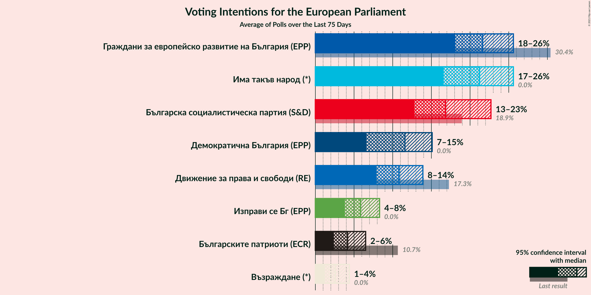

### Confidence Intervals

| Party | Last Result | Median | 80% Confidence Interval | 90% Confidence Interval | 95% Confidence Interval | 99% Confidence Interval |
|:-----:|:-----------:|:------:|:-----------------------:|:-----------------------:|:-----------------------:|:-----------------------:|
| <a href="#граждани-за-европейско-развитие-на-българия-(epp)">Граждани за европейско развитие на България (EPP)</a> | 30.4% | 21.6% | 19.3–24.2% |18.6–24.9% | 18.1–25.6% | 17.0–26.9% |
| <a href="#българска-социалистическа-партия-(s&d)">Българска социалистическа партия (S&D)</a> | 18.9% | 16.8% | 14.0–21.1% |13.3–22.0% | 12.8–22.7% | 11.7–23.8% |
| <a href="#движение-за-права-и-свободи-(re)">Движение за права и свободи (RE)</a> | 17.3% | 10.8% | 8.8–12.8% |8.3–13.4% | 7.9–13.9% | 7.1–15.0% |
| <a href="#обединени-патриоти-(ecr)">Обединени Патриоти (ECR)</a> | 10.7% | N/A | N/A |N/A | N/A | N/A |
| <a href="#вмро–българско-национално-движение-(ecr)">ВМРО–Българско Национално Движение (ECR)</a> | 10.7% | N/A | N/A |N/A | N/A | N/A |
| <a href="#национален-фронт-за-спасение-на-българия-(*)">Национален фронт за спасение на България (*)</a> | 10.7% | N/A | N/A |N/A | N/A | N/A |
| <a href="#атака-(ni)">Атака (NI)</a> | 10.7% | N/A | N/A |N/A | N/A | N/A |
| <a href="#воля–национален-фронт-за-спасение-на-българия-(id)">Воля–Национален фронт за спасение на България (ID)</a> | 10.7% | N/A | N/A |N/A | N/A | N/A |
| <a href="#българските-патриоти-(ecr)">Българските патриоти (ECR)</a> | 10.7% | 4.2% | 2.9–5.7% |2.6–6.1% | 2.4–6.5% | 2.0–7.3% |
| <a href="#реформаторски-блок-(epp)">Реформаторски блок (EPP)</a> | 6.4% | N/A | N/A |N/A | N/A | N/A |
| <a href="#воля-(id)">Воля (ID)</a> | 0.0% | N/A | N/A |N/A | N/A | N/A |
| <a href="#демократична-българия-(epp)">Демократична България (EPP)</a> | 0.0% | 11.6% | 7.7–13.9% |7.0–14.5% | 6.6–15.1% | 5.9–16.2% |
| <a href="#демократи-за-силна-българия-(epp)">Демократи за силна България (EPP)</a> | 0.0% | N/A | N/A |N/A | N/A | N/A |
| <a href="#да,-българия!-(*)">Да, България! (*)</a> | 0.0% | N/A | N/A |N/A | N/A | N/A |
| <a href="#алтернатива-за-българско-възраждане-(s&d)">Алтернатива за българско възраждане (S&D)</a> | 0.0% | N/A | N/A |N/A | N/A | N/A |
| <a href="#има-такъв-народ-(*)">Има такъв народ (*)</a> | 0.0% | 21.2% | 18.2–24.3% |17.3–25.0% | 16.6–25.6% | 15.4–26.8% |
| <a href="#възраждане-(*)">Възраждане (*)</a> | 0.0% | 2.6% | 1.5–3.7% |1.3–4.0% | 1.2–4.4% | 0.9–5.0% |
| <a href="#изправи-се-бг-(epp)">Изправи се Бг (EPP)</a> | 0.0% | 5.8% | 4.4–7.4% |4.1–7.9% | 3.8–8.3% | 3.3–9.0% |
| <a href="#републиканци-за-българия-(*)">Републиканци за България (*)</a> | 0.0% | N/A | N/A |N/A | N/A | N/A |

### Граждани за европейско развитие на България (EPP)

*For a full overview of the results for this party, see the [Граждани за европейско развитие на България (EPP)](party-гражданизаевропейскоразвитиенабългарияepp.html) page.*

| Voting Intentions | Probability | Accumulated | Special Marks |
|:-----------------:|:-----------:|:-----------:|:-------------:|
| 14.5–15.5% | 0% | 100% |  |
| 15.5–16.5% | 0.2% | 100% |  |
| 16.5–17.5% | 0.9% | 99.8% |  |
| 17.5–18.5% | 3% | 98.8% |  |
| 18.5–19.5% | 8% | 96% |  |
| 19.5–20.5% | 15% | 87% |  |
| 20.5–21.5% | 21% | 72% |  |
| 21.5–22.5% | 20% | 52% | Median |
| 22.5–23.5% | 15% | 31% |  |
| 23.5–24.5% | 9% | 16% |  |
| 24.5–25.5% | 4% | 7% |  |
| 25.5–26.5% | 2% | 3% |  |
| 26.5–27.5% | 0.6% | 0.8% |  |
| 27.5–28.5% | 0.1% | 0.2% |  |
| 28.5–29.5% | 0% | 0% |  |
| 29.5–30.5% | 0% | 0% | Last Result |

### Българска социалистическа партия (S&D)

*For a full overview of the results for this party, see the [Българска социалистическа партия (S&D)](party-българскасоциалистическапартияsd.html) page.*

| Voting Intentions | Probability | Accumulated | Special Marks |
|:-----------------:|:-----------:|:-----------:|:-------------:|
| 9.5–10.5% | 0% | 100% |  |
| 10.5–11.5% | 0.3% | 100% |  |
| 11.5–12.5% | 1.5% | 99.7% |  |
| 12.5–13.5% | 4% | 98% |  |
| 13.5–14.5% | 9% | 94% |  |
| 14.5–15.5% | 14% | 84% |  |
| 15.5–16.5% | 17% | 71% |  |
| 16.5–17.5% | 15% | 54% | Median |
| 17.5–18.5% | 11% | 39% |  |
| 18.5–19.5% | 8% | 28% | Last Result |
| 19.5–20.5% | 6% | 20% |  |
| 20.5–21.5% | 6% | 14% |  |
| 21.5–22.5% | 5% | 7% |  |
| 22.5–23.5% | 2% | 3% |  |
| 23.5–24.5% | 0.7% | 0.8% |  |
| 24.5–25.5% | 0.1% | 0.1% |  |
| 25.5–26.5% | 0% | 0% |  |

### Движение за права и свободи (RE)

*For a full overview of the results for this party, see the [Движение за права и свободи (RE)](party-движениезаправаисвободиre.html) page.*

| Voting Intentions | Probability | Accumulated | Special Marks |
|:-----------------:|:-----------:|:-----------:|:-------------:|
| 4.5–5.5% | 0% | 100% |  |
| 5.5–6.5% | 0.1% | 100% |  |
| 6.5–7.5% | 1.2% | 99.9% |  |
| 7.5–8.5% | 6% | 98.7% |  |
| 8.5–9.5% | 14% | 93% |  |
| 9.5–10.5% | 22% | 79% |  |
| 10.5–11.5% | 25% | 57% | Median |
| 11.5–12.5% | 18% | 32% |  |
| 12.5–13.5% | 9% | 13% |  |
| 13.5–14.5% | 3% | 4% |  |
| 14.5–15.5% | 0.8% | 1.0% |  |
| 15.5–16.5% | 0.2% | 0.2% |  |
| 16.5–17.5% | 0% | 0% | Last Result |

### Българските патриоти (ECR)

*For a full overview of the results for this party, see the [Българските патриоти (ECR)](party-българскитепатриотиecr.html) page.*

| Voting Intentions | Probability | Accumulated | Special Marks |
|:-----------------:|:-----------:|:-----------:|:-------------:|
| 0.5–1.5% | 0% | 100% |  |
| 1.5–2.5% | 4% | 100% |  |
| 2.5–3.5% | 25% | 96% |  |
| 3.5–4.5% | 34% | 71% | Median |
| 4.5–5.5% | 25% | 37% |  |
| 5.5–6.5% | 10% | 12% |  |
| 6.5–7.5% | 2% | 2% |  |
| 7.5–8.5% | 0.2% | 0.3% |  |
| 8.5–9.5% | 0% | 0% |  |
| 9.5–10.5% | 0% | 0% |  |
| 10.5–11.5% | 0% | 0% | Last Result |

### Демократична България (EPP)

*For a full overview of the results for this party, see the [Демократична България (EPP)](party-демократичнабългарияepp.html) page.*

| Voting Intentions | Probability | Accumulated | Special Marks |
|:-----------------:|:-----------:|:-----------:|:-------------:|
| 0.0–0.5% | 0% | 100% | Last Result |
| 0.5–1.5% | 0% | 100% |  |
| 1.5–2.5% | 0% | 100% |  |
| 2.5–3.5% | 0% | 100% |  |
| 3.5–4.5% | 0% | 100% |  |
| 4.5–5.5% | 0.1% | 100% |  |
| 5.5–6.5% | 2% | 99.9% |  |
| 6.5–7.5% | 6% | 98% |  |
| 7.5–8.5% | 5% | 91% |  |
| 8.5–9.5% | 5% | 86% |  |
| 9.5–10.5% | 11% | 81% |  |
| 10.5–11.5% | 19% | 70% |  |
| 11.5–12.5% | 21% | 50% | Median |
| 12.5–13.5% | 16% | 30% |  |
| 13.5–14.5% | 9% | 14% |  |
| 14.5–15.5% | 4% | 5% |  |
| 15.5–16.5% | 1.1% | 1.3% |  |
| 16.5–17.5% | 0.2% | 0.3% |  |
| 17.5–18.5% | 0% | 0% |  |

### Има такъв народ (*)

*For a full overview of the results for this party, see the [Има такъв народ (*)](party-иматакъвнарод.html) page.*

| Voting Intentions | Probability | Accumulated | Special Marks |
|:-----------------:|:-----------:|:-----------:|:-------------:|
| 0.0–0.5% | 0% | 100% | Last Result |
| 0.5–1.5% | 0% | 100% |  |
| 1.5–2.5% | 0% | 100% |  |
| 2.5–3.5% | 0% | 100% |  |
| 3.5–4.5% | 0% | 100% |  |
| 4.5–5.5% | 0% | 100% |  |
| 5.5–6.5% | 0% | 100% |  |
| 6.5–7.5% | 0% | 100% |  |
| 7.5–8.5% | 0% | 100% |  |
| 8.5–9.5% | 0% | 100% |  |
| 9.5–10.5% | 0% | 100% |  |
| 10.5–11.5% | 0% | 100% |  |
| 11.5–12.5% | 0% | 100% |  |
| 12.5–13.5% | 0% | 100% |  |
| 13.5–14.5% | 0.1% | 100% |  |
| 14.5–15.5% | 0.5% | 99.9% |  |
| 15.5–16.5% | 2% | 99.4% |  |
| 16.5–17.5% | 4% | 98% |  |
| 17.5–18.5% | 7% | 94% |  |
| 18.5–19.5% | 11% | 87% |  |
| 19.5–20.5% | 14% | 76% |  |
| 20.5–21.5% | 16% | 61% | Median |
| 21.5–22.5% | 15% | 45% |  |
| 22.5–23.5% | 13% | 30% |  |
| 23.5–24.5% | 9% | 17% |  |
| 24.5–25.5% | 5% | 8% |  |
| 25.5–26.5% | 2% | 3% |  |
| 26.5–27.5% | 0.6% | 0.7% |  |
| 27.5–28.5% | 0.1% | 0.1% |  |
| 28.5–29.5% | 0% | 0% |  |

### Изправи се Бг (EPP)

*For a full overview of the results for this party, see the [Изправи се Бг (EPP)](party-изправисебгepp.html) page.*

| Voting Intentions | Probability | Accumulated | Special Marks |
|:-----------------:|:-----------:|:-----------:|:-------------:|
| 0.0–0.5% | 0% | 100% | Last Result |
| 0.5–1.5% | 0% | 100% |  |
| 1.5–2.5% | 0% | 100% |  |
| 2.5–3.5% | 1.3% | 100% |  |
| 3.5–4.5% | 12% | 98.7% |  |
| 4.5–5.5% | 27% | 87% |  |
| 5.5–6.5% | 31% | 60% | Median |
| 6.5–7.5% | 20% | 29% |  |
| 7.5–8.5% | 7% | 9% |  |
| 8.5–9.5% | 1.2% | 1.3% |  |
| 9.5–10.5% | 0.1% | 0.1% |  |
| 10.5–11.5% | 0% | 0% |  |

### Възраждане (*)

*For a full overview of the results for this party, see the [Възраждане (*)](party-възраждане.html) page.*

| Voting Intentions | Probability | Accumulated | Special Marks |
|:-----------------:|:-----------:|:-----------:|:-------------:|
| 0.0–0.5% | 0% | 100% | Last Result |
| 0.5–1.5% | 11% | 100% |  |
| 1.5–2.5% | 38% | 89% |  |
| 2.5–3.5% | 38% | 51% | Median |
| 3.5–4.5% | 12% | 13% |  |
| 4.5–5.5% | 1.4% | 1.5% |  |
| 5.5–6.5% | 0.1% | 0.1% |  |
| 6.5–7.5% | 0% | 0% |  |

## Seats

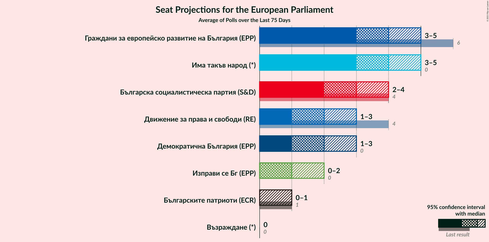

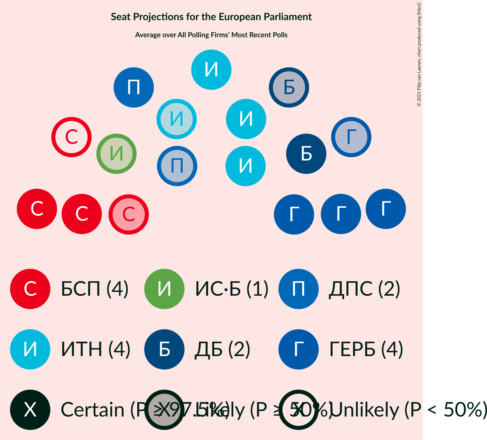

### Confidence Intervals

| Party | Last Result | Median | 80% Confidence Interval | 90% Confidence Interval | 95% Confidence Interval | 99% Confidence Interval |
|:-----:|:-----------:|:------:|:-----------------------:|:-----------------------:|:-----------------------:|:-----------------------:|
| <a href="#граждани-за-европейско-развитие-на-българия-(epp)">Граждани за европейско развитие на България (EPP)</a> | 6 | 4 | 3–4 |3–5 | 3–5 | 3–5 |
| <a href="#българска-социалистическа-партия-(s&d)">Българска социалистическа партия (S&D)</a> | 4 | 3 | 3–4 |2–4 | 2–4 | 2–4 |
| <a href="#движение-за-права-и-свободи-(re)">Движение за права и свободи (RE)</a> | 4 | 2 | 2 |2 | 1–3 | 1–3 |
| <a href="#обединени-патриоти-(ecr)">Обединени Патриоти (ECR)</a> | 2 | N/A | N/A |N/A | N/A | N/A |
| <a href="#вмро–българско-национално-движение-(ecr)">ВМРО–Българско Национално Движение (ECR)</a> | 1 | N/A | N/A |N/A | N/A | N/A |
| <a href="#национален-фронт-за-спасение-на-българия-(*)">Национален фронт за спасение на България (*)</a> | 1 | N/A | N/A |N/A | N/A | N/A |
| <a href="#атака-(ni)">Атака (NI)</a> | 0 | N/A | N/A |N/A | N/A | N/A |
| <a href="#воля–национален-фронт-за-спасение-на-българия-(id)">Воля–Национален фронт за спасение на България (ID)</a> | 1 | N/A | N/A |N/A | N/A | N/A |
| <a href="#българските-патриоти-(ecr)">Българските патриоти (ECR)</a> | 1 | 0 | 0–1 |0–1 | 0–1 | 0–1 |
| <a href="#реформаторски-блок-(epp)">Реформаторски блок (EPP)</a> | 1 | N/A | N/A |N/A | N/A | N/A |
| <a href="#воля-(id)">Воля (ID)</a> | 0 | N/A | N/A |N/A | N/A | N/A |
| <a href="#демократична-българия-(epp)">Демократична България (EPP)</a> | 0 | 2 | 1–3 |1–3 | 1–3 | 1–3 |
| <a href="#демократи-за-силна-българия-(epp)">Демократи за силна България (EPP)</a> | 0 | N/A | N/A |N/A | N/A | N/A |
| <a href="#да,-българия!-(*)">Да, България! (*)</a> | 0 | N/A | N/A |N/A | N/A | N/A |
| <a href="#алтернатива-за-българско-възраждане-(s&d)">Алтернатива за българско възраждане (S&D)</a> | 0 | N/A | N/A |N/A | N/A | N/A |
| <a href="#има-такъв-народ-(*)">Има такъв народ (*)</a> | 0 | 4 | 3–4 |3–5 | 3–5 | 3–5 |
| <a href="#възраждане-(*)">Възраждане (*)</a> | 0 | 0 | 0 |0 | 0 | 0 |
| <a href="#изправи-се-бг-(epp)">Изправи се Бг (EPP)</a> | 0 | 1 | 0–1 |0–1 | 0–2 | 0–2 |
| <a href="#републиканци-за-българия-(*)">Републиканци за България (*)</a> | 0 | N/A | N/A |N/A | N/A | N/A |

### Граждани за европейско развитие на България (EPP)

*For a full overview of the results for this party, see the [Граждани за европейско развитие на България (EPP)](party-гражданизаевропейскоразвитиенабългарияepp.html) page.*

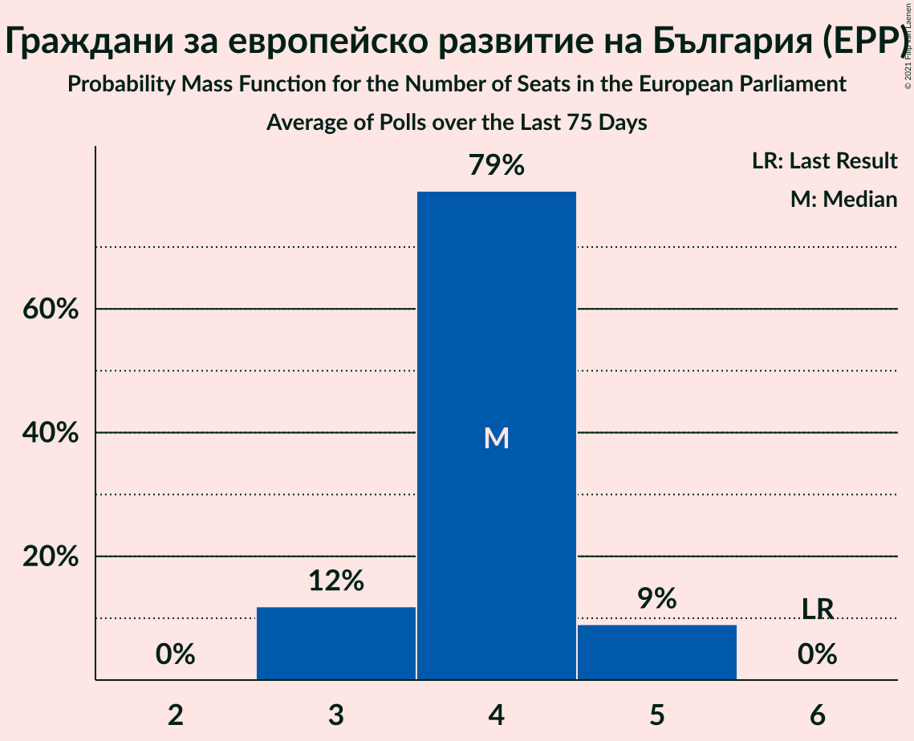

| Number of Seats | Probability | Accumulated | Special Marks |
|:---------------:|:-----------:|:-----------:|:-------------:|
| 3 | 12% | 100% |  |
| 4 | 79% | 88% | Median |
| 5 | 9% | 9% |  |
| 6 | 0% | 0% | Last Result |

### Българска социалистическа партия (S&D)

*For a full overview of the results for this party, see the [Българска социалистическа партия (S&D)](party-българскасоциалистическапартияsd.html) page.*

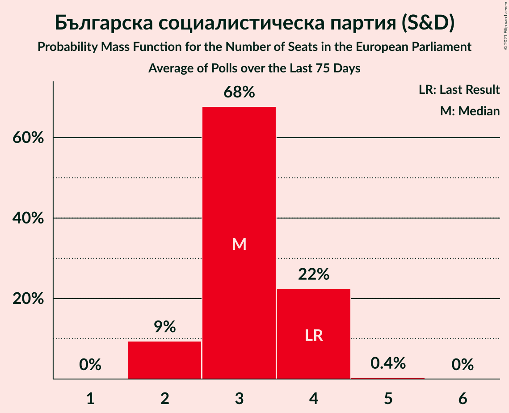

| Number of Seats | Probability | Accumulated | Special Marks |
|:---------------:|:-----------:|:-----------:|:-------------:|
| 2 | 9% | 100% |  |
| 3 | 68% | 91% | Median |
| 4 | 22% | 23% | Last Result |
| 5 | 0.4% | 0.4% |  |
| 6 | 0% | 0% |  |

### Движение за права и свободи (RE)

*For a full overview of the results for this party, see the [Движение за права и свободи (RE)](party-движениезаправаисвободиre.html) page.*

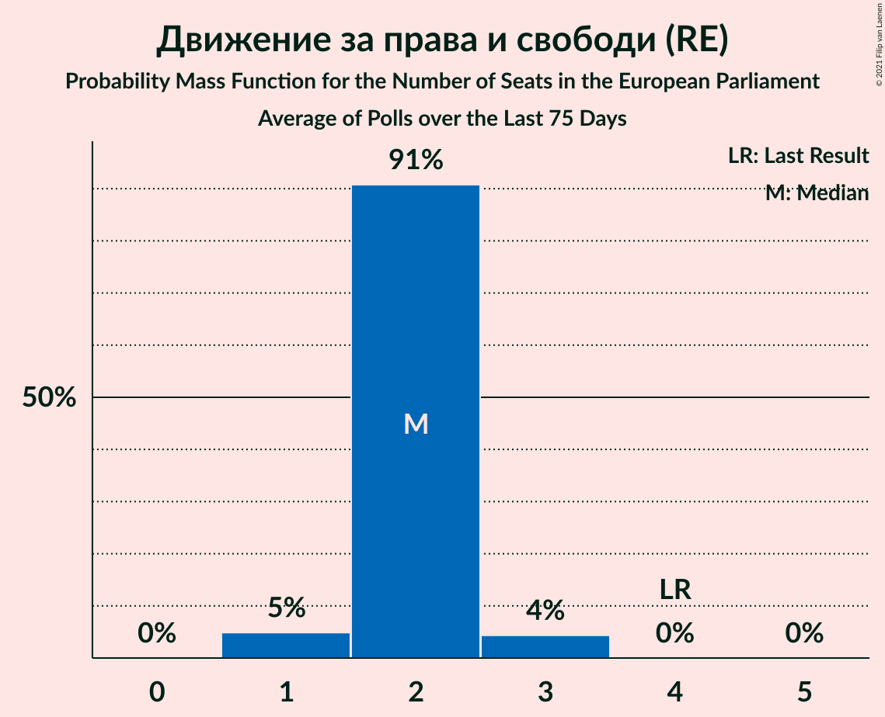

| Number of Seats | Probability | Accumulated | Special Marks |
|:---------------:|:-----------:|:-----------:|:-------------:|
| 1 | 5% | 100% |  |
| 2 | 91% | 95% | Median |
| 3 | 4% | 4% |  |
| 4 | 0% | 0% | Last Result |

### Обединени Патриоти (ECR)

*For a full overview of the results for this party, see the [Обединени Патриоти (ECR)](party-обединенипатриотиecr.html) page.*

### ВМРО–Българско Национално Движение (ECR)

*For a full overview of the results for this party, see the [ВМРО–Българско Национално Движение (ECR)](party-вмро–българсконационалнодвижениеecr.html) page.*

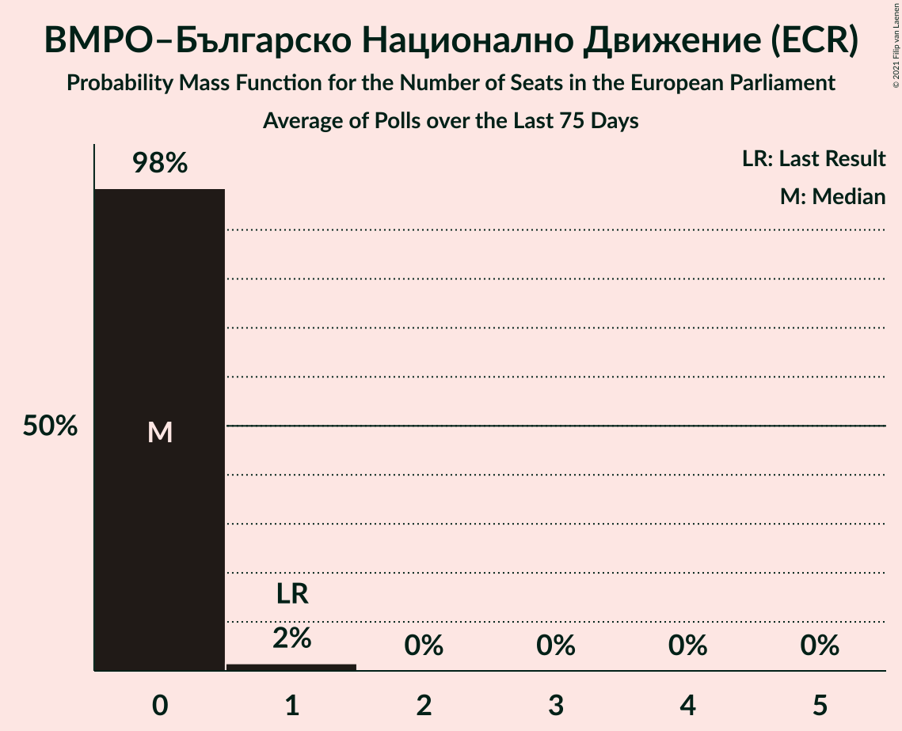

### Национален фронт за спасение на България (*)

*For a full overview of the results for this party, see the [Национален фронт за спасение на България (*)](party-националенфронтзаспасениенабългария.html) page.*

### Атака (NI)

*For a full overview of the results for this party, see the [Атака (NI)](party-атакаni.html) page.*

### Воля–Национален фронт за спасение на България (ID)

*For a full overview of the results for this party, see the [Воля–Национален фронт за спасение на България (ID)](party-воля–националенфронтзаспасениенабългарияid.html) page.*

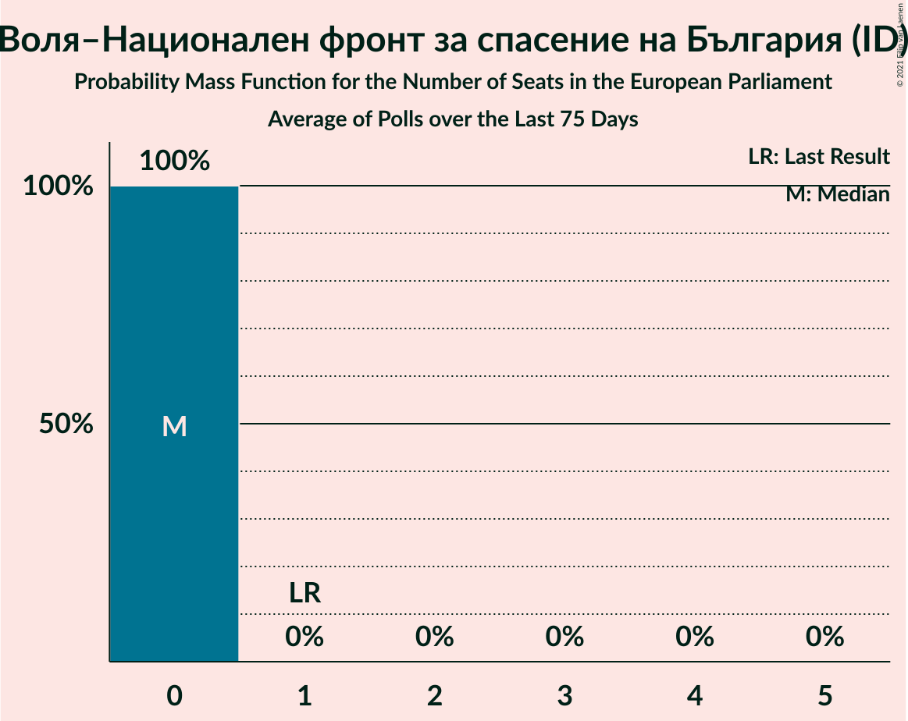

### Българските патриоти (ECR)

*For a full overview of the results for this party, see the [Българските патриоти (ECR)](party-българскитепатриотиecr.html) page.*

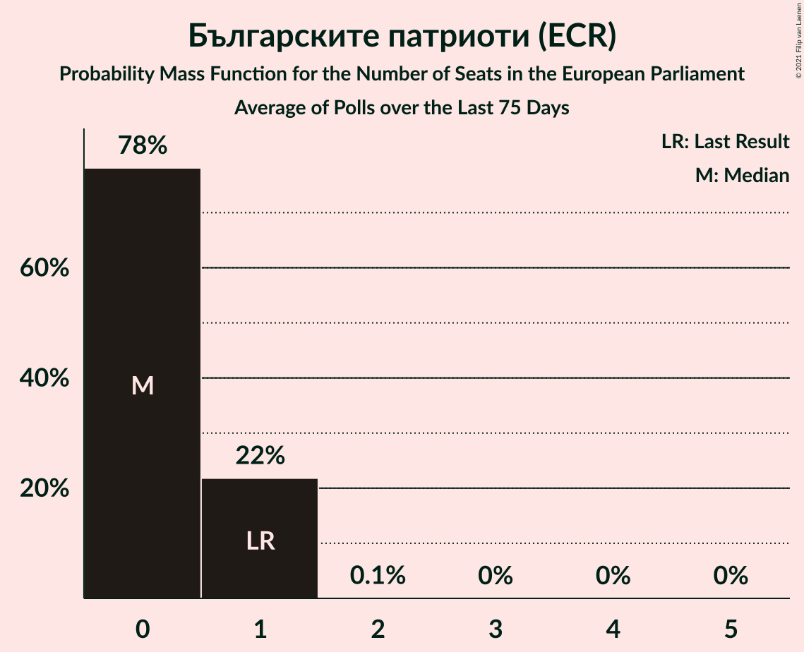

| Number of Seats | Probability | Accumulated | Special Marks |
|:---------------:|:-----------:|:-----------:|:-------------:|
| 0 | 78% | 100% | Median |
| 1 | 22% | 22% | Last Result |
| 2 | 0.1% | 0.1% |  |
| 3 | 0% | 0% |  |

### Реформаторски блок (EPP)

*For a full overview of the results for this party, see the [Реформаторски блок (EPP)](party-реформаторскиблокepp.html) page.*

### Воля (ID)

*For a full overview of the results for this party, see the [Воля (ID)](party-воляid.html) page.*

### Демократична България (EPP)

*For a full overview of the results for this party, see the [Демократична България (EPP)](party-демократичнабългарияepp.html) page.*

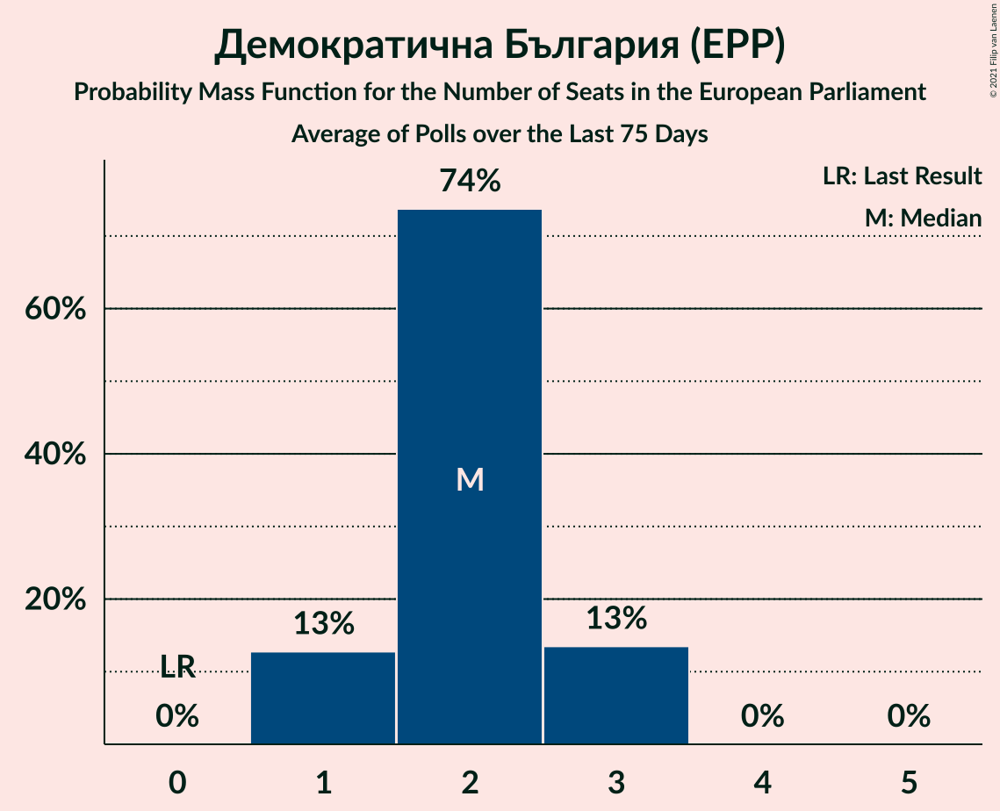

| Number of Seats | Probability | Accumulated | Special Marks |
|:---------------:|:-----------:|:-----------:|:-------------:|
| 0 | 0% | 100% | Last Result |
| 1 | 13% | 100% |  |
| 2 | 74% | 87% | Median |
| 3 | 13% | 13% |  |
| 4 | 0% | 0% |  |

### Демократи за силна България (EPP)

*For a full overview of the results for this party, see the [Демократи за силна България (EPP)](party-демократизасилнабългарияepp.html) page.*

### Да, България! (*)

*For a full overview of the results for this party, see the [Да, България! (*)](party-дабългария.html) page.*

### Алтернатива за българско възраждане (S&D)

*For a full overview of the results for this party, see the [Алтернатива за българско възраждане (S&D)](party-алтернативазабългарсковъзражданеsd.html) page.*

### Има такъв народ (*)

*For a full overview of the results for this party, see the [Има такъв народ (*)](party-иматакъвнарод.html) page.*

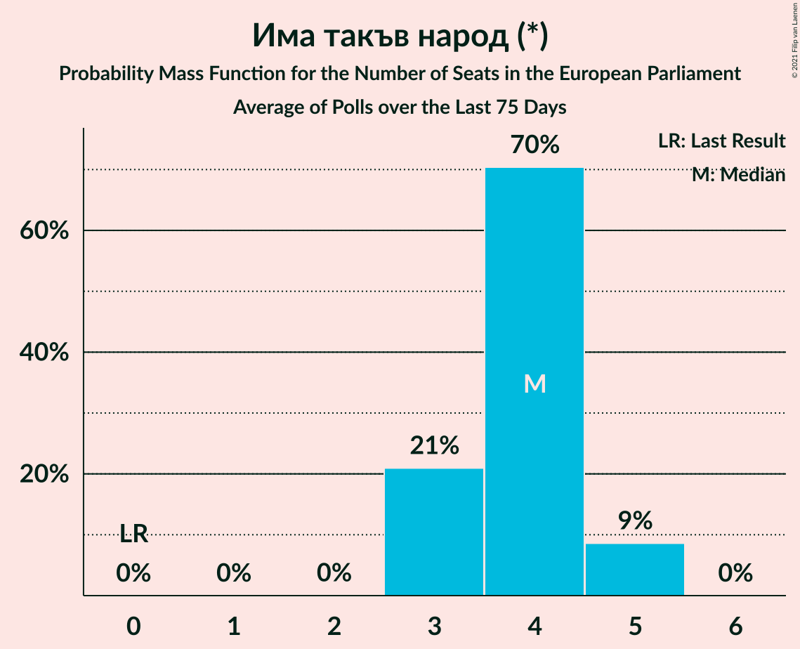

| Number of Seats | Probability | Accumulated | Special Marks |
|:---------------:|:-----------:|:-----------:|:-------------:|
| 0 | 0% | 100% | Last Result |
| 1 | 0% | 100% |  |
| 2 | 0% | 100% |  |
| 3 | 21% | 100% |  |
| 4 | 70% | 79% | Median |
| 5 | 9% | 9% |  |
| 6 | 0% | 0% |  |

### Възраждане (*)

*For a full overview of the results for this party, see the [Възраждане (*)](party-възраждане.html) page.*

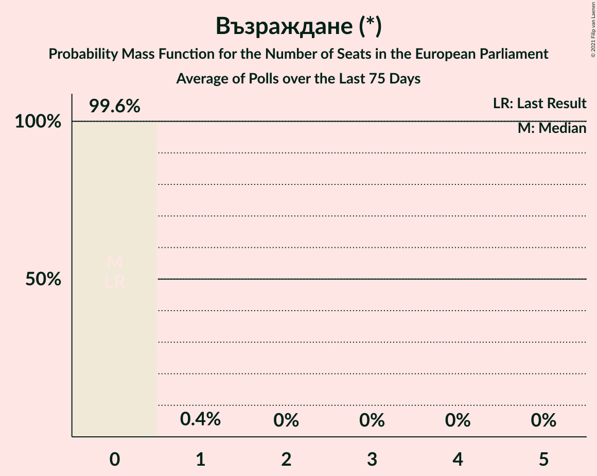

| Number of Seats | Probability | Accumulated | Special Marks |
|:---------------:|:-----------:|:-----------:|:-------------:|
| 0 | 99.6% | 100% | Last Result, Median |
| 1 | 0.4% | 0.4% |  |
| 2 | 0% | 0% |  |

### Изправи се Бг (EPP)

*For a full overview of the results for this party, see the [Изправи се Бг (EPP)](party-изправисебгepp.html) page.*

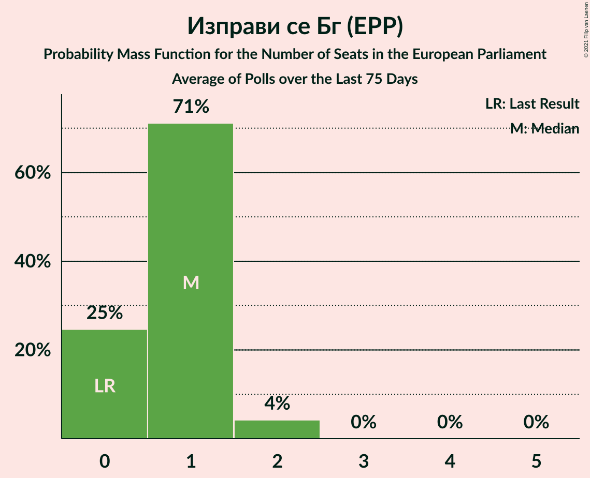

| Number of Seats | Probability | Accumulated | Special Marks |
|:---------------:|:-----------:|:-----------:|:-------------:|
| 0 | 25% | 100% | Last Result |
| 1 | 71% | 75% | Median |
| 2 | 4% | 4% |  |
| 3 | 0% | 0% |  |

### Републиканци за България (*)

*For a full overview of the results for this party, see the [Републиканци за България (*)](party-републиканцизабългария.html) page.*

## Coalitions

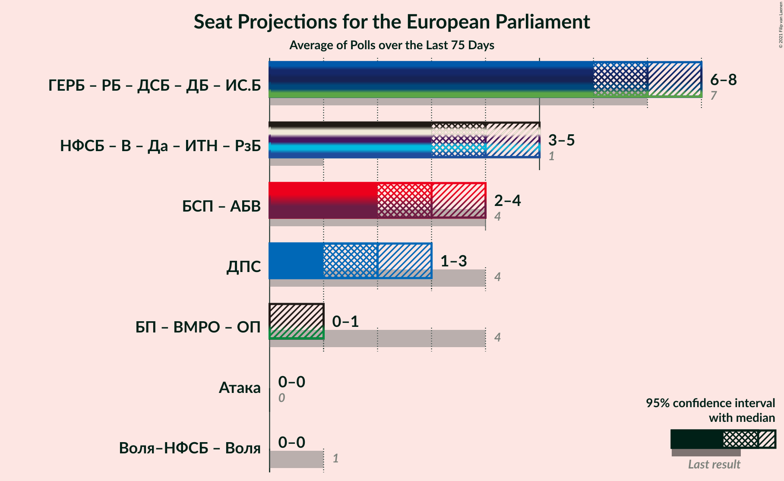

### Confidence Intervals

| Coalition | Last Result | Median | Majority? | 80% Confidence Interval | 90% Confidence Interval | 95% Confidence Interval | 99% Confidence Interval |
|:---------:|:-----------:|:------:|:---------:|:-----------------------:|:-----------------------:|:-----------------------:|:-----------------------:|
| Граждани за европейско развитие на България (EPP) – Реформаторски блок (EPP) – Демократи за силна България (EPP) – Демократична България (EPP) – Изправи се Бг (EPP) | 7 | 7 | 1.2% | 6–8 | 6–8 | 6–8 | 5–9 |
| Национален фронт за спасение на България (*) – Възраждане (*) – Да, България! (*) – Има такъв народ (*) – Републиканци за България (*) | 1 | 4 | 0% | 3–4 | 3–5 | 3–5 | 3–5 |
| Българска социалистическа партия (S&D) – Алтернатива за българско възраждане (S&D) | 4 | 3 | 0% | 3–4 | 2–4 | 2–4 | 2–4 |
| Движение за права и свободи (RE) | 4 | 2 | 0% | 2 | 2 | 1–3 | 1–3 |
| Българските патриоти (ECR) – ВМРО–Българско Национално Движение (ECR) – Обединени Патриоти (ECR) | 4 | 0 | 0% | 0–1 | 0–1 | 0–1 | 0–1 |
| Атака (NI) | 0 | 0 | 0% | 0 | 0 | 0 | 0 |
| Воля–Национален фронт за спасение на България (ID) – Воля (ID) | 1 | 0 | 0% | 0 | 0 | 0 | 0 |

### Граждани за европейско развитие на България (EPP) – Реформаторски блок (EPP) – Демократи за силна България (EPP) – Демократична България (EPP) – Изправи се Бг (EPP)

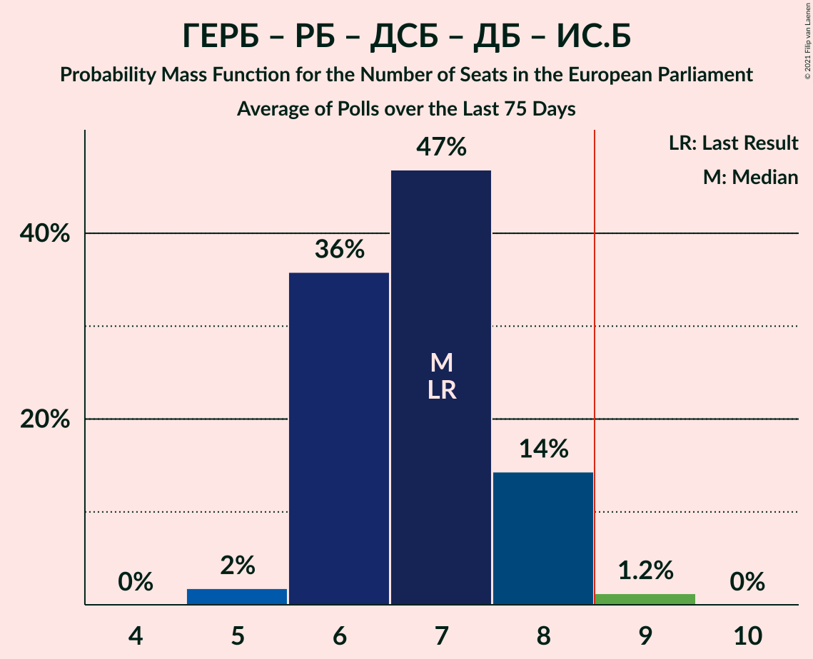

| Number of Seats | Probability | Accumulated | Special Marks |
|:---------------:|:-----------:|:-----------:|:-------------:|
| 5 | 2% | 100% |  |
| 6 | 36% | 98% |  |
| 7 | 47% | 62% | Last Result, Median |
| 8 | 14% | 16% |  |
| 9 | 1.2% | 1.2% | Majority |
| 10 | 0% | 0% |  |

### Национален фронт за спасение на България (*) – Възраждане (*) – Да, България! (*) – Има такъв народ (*) – Републиканци за България (*)

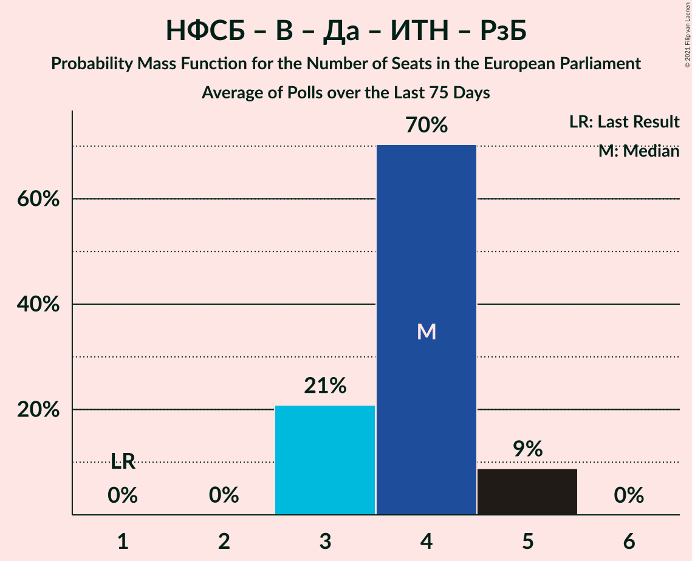

| Number of Seats | Probability | Accumulated | Special Marks |
|:---------------:|:-----------:|:-----------:|:-------------:|
| 1 | 0% | 100% | Last Result |
| 2 | 0% | 100% |  |
| 3 | 21% | 100% |  |
| 4 | 70% | 79% | Median |
| 5 | 9% | 9% |  |
| 6 | 0% | 0% |  |

### Българска социалистическа партия (S&D) – Алтернатива за българско възраждане (S&D)

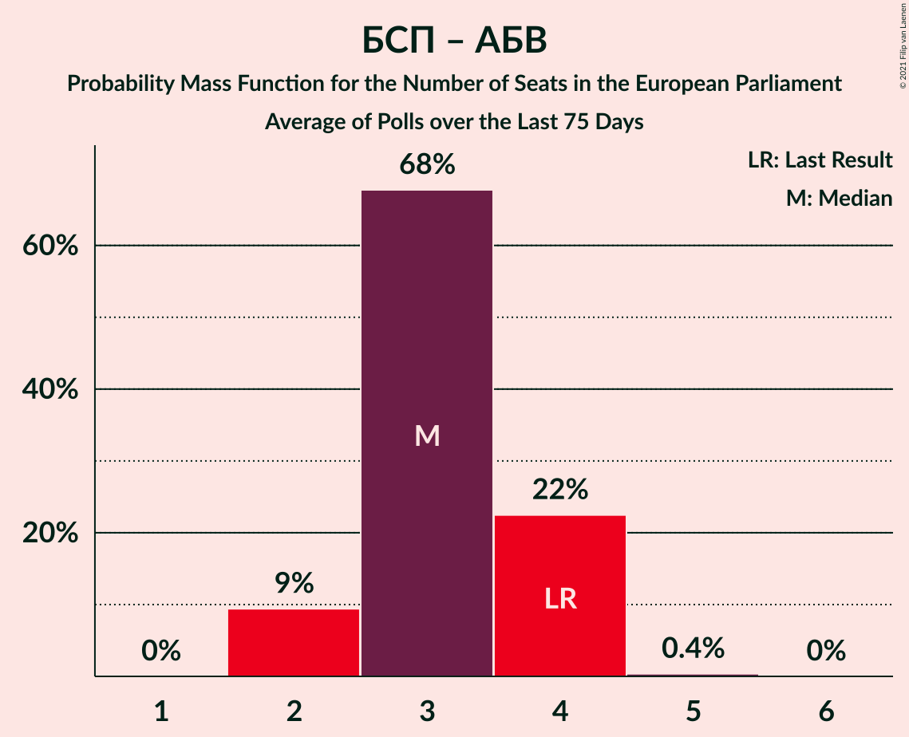

| Number of Seats | Probability | Accumulated | Special Marks |
|:---------------:|:-----------:|:-----------:|:-------------:|
| 2 | 9% | 100% |  |
| 3 | 68% | 91% | Median |
| 4 | 22% | 23% | Last Result |
| 5 | 0.4% | 0.4% |  |
| 6 | 0% | 0% |  |

### Движение за права и свободи (RE)

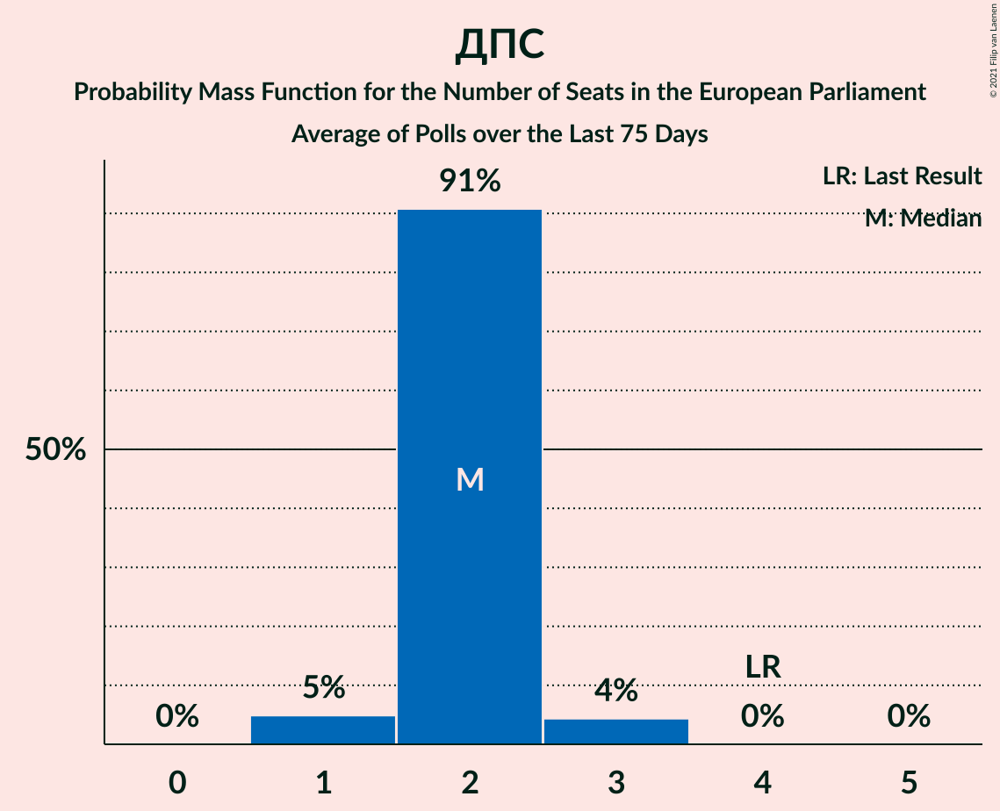

| Number of Seats | Probability | Accumulated | Special Marks |
|:---------------:|:-----------:|:-----------:|:-------------:|
| 1 | 5% | 100% |  |
| 2 | 91% | 95% | Median |
| 3 | 4% | 4% |  |
| 4 | 0% | 0% | Last Result |

### Българските патриоти (ECR) – ВМРО–Българско Национално Движение (ECR) – Обединени Патриоти (ECR)

| Number of Seats | Probability | Accumulated | Special Marks |
|:---------------:|:-----------:|:-----------:|:-------------:|
| 0 | 78% | 100% | Median |
| 1 | 22% | 22% |  |
| 2 | 0.1% | 0.1% |  |
| 3 | 0% | 0% |  |
| 4 | 0% | 0% | Last Result |

### Атака (NI)

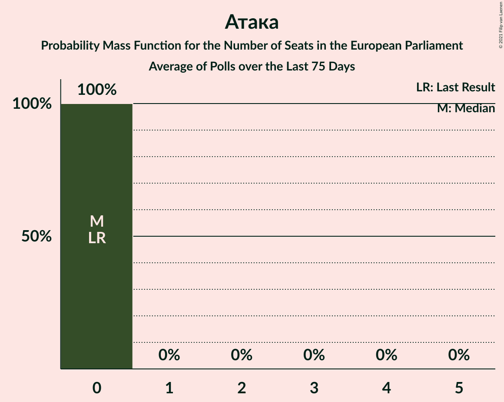

| Number of Seats | Probability | Accumulated | Special Marks |
|:---------------:|:-----------:|:-----------:|:-------------:|
| 0 | 100% | 100% | Last Result, Median |

### Воля–Национален фронт за спасение на България (ID) – Воля (ID)

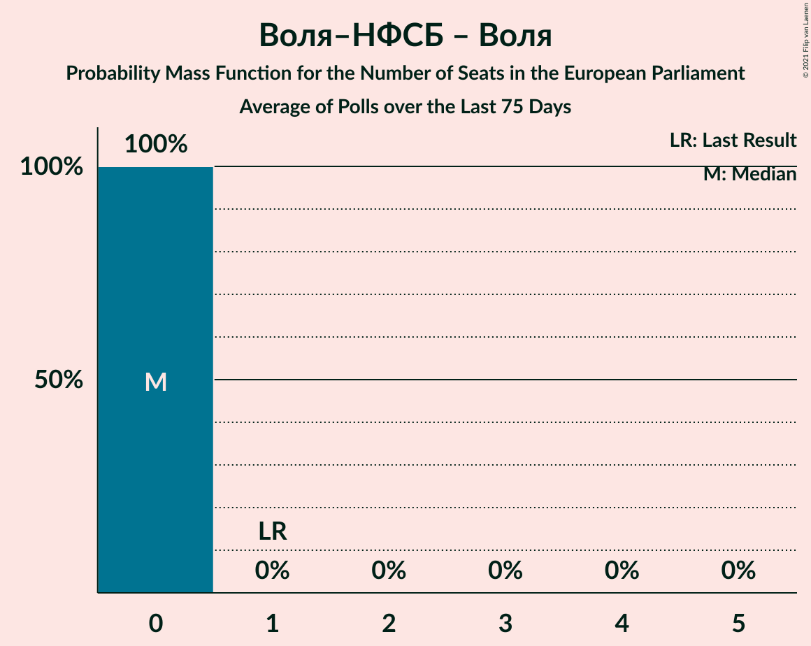

| Number of Seats | Probability | Accumulated | Special Marks |
|:---------------:|:-----------:|:-----------:|:-------------:|
| 0 | 100% | 100% | Median |
| 1 | 0% | 0% | Last Result |

## Technical Information

+ **Number of polls included in this average:** 7
+ **Lowest number of simulations done in a poll included in this average:** 1,048,576
+ **Total number of simulations done in the polls included in this average:** 7,340,032
+ **Error estimate:** 3.26%
