# Poll Average

<a href="#voting-intentions">Voting Intentions</a> | <a href="#seats">Seats</a> | <a href="#coalitions">Coalitions</a> | <a href="#technical-information">Technical Information</a>

## Summary

The table below lists the polls on which the average is based. They are the most recent polls (less than 90 days old) registered and analyzed so far.

| Period     | Polling firm/Commissioner(s) | ГЕРБ | БСП | ДПС | ОП | ВМРО | НФСБ | Атака | РБ | Воля | ДБ | ДСБ | Да | АБВ | ИТН | В | ИС.Б | РзБ | Воля–НФСБ |
|:----------:|:----------------------------:|:--:|:--:|:--:|:--:|:--:|:--:|:--:|:--:|:--:|:--:|:--:|:--:|:--:|:--:|:--:|:--:|:--:|:--:|
| 26 May 2019 | General Election | 30.4%   6 | 18.9%   4 | 17.3%   4 | 10.7%   2 | 10.7%   1 | 10.7%   1 | 10.7%   0 | 6.4%   1 | 0.0%   0 | 0.0%   0 | 0.0%   0 | 0.0%   0 | 0.0%   0 | 0.0%   0 | 0.0%   0 | 0.0%   0 | 0.0%   0 | 10.7%   1 |
| N/A | Poll Average | 23–33%   4–7 | 17–29%   3–6 | 8–16%   2–3 | N/A   N/A | 2–7%   0–1 | N/A   N/A | 0–3%   0 | N/A   N/A | N/A   N/A | 4–9%   0–2 | N/A   N/A | N/A   N/A | 0–3%   0 | 10–18%   2–4 | 0–4%   0 | 3–8%   0–2 | 0–3%   0 | 1–5%   0–1 |
| [24–31 March 2021](2021-03-31-Gallup.html) | Gallup   BNR | 24–33%   4–7 | 17–25%   3–5 | 10–16%   2–3 | N/A   N/A | 3–7%   0–2 | N/A   N/A | 0–2%   0 | N/A   N/A | N/A   N/A | 4–9%   0–2 | N/A   N/A | N/A   N/A | 1–3%   0 | 10–16%   2–3 | 1–3%   0 | 3–8%   0–2 | 1–3%   0 | 2–5%   0–1 |
| [26–30 March 2021](2021-03-30-Тренд.html) | Тренд   Nova | 25–33%   5–7 | 18–26%   4–5 | 10–16%   2–3 | N/A   N/A | 3–6%   0–1 | N/A   N/A | N/A   N/A | N/A   N/A | N/A   N/A | 4–8%   0–2 | N/A   N/A | N/A   N/A | 0–2%   0 | 10–16%   2–3 | 1–3%   0 | 3–7%   0–2 | 0–2%   0 | 2–5%   0 |
| [27–30 March 2021](2021-03-30-ПИК.html) | ПИК | 24–34%   5–7 | 16–24%   3–5 | 10–17%   2–4 | N/A   N/A | 3–7%   0–1 | N/A   N/A | 0–3%   0 | N/A   N/A | N/A   N/A | 4–9%   0–2 | N/A   N/A | N/A   N/A | 0–3%   0 | 9–17%   2–3 | 1–4%   0 | 3–7%   0–1 | 0–3%   0 | 1–5%   0 |
| [27–30 March 2021](2021-03-30-Алфарисърч.html) | Алфа рисърч | 24–32%   5–7 | 17–24%   3–5 | 10–16%   2–3 | N/A   N/A | 3–6%   0–1 | N/A   N/A | 1–3%   0 | N/A   N/A | N/A   N/A | 4–9%   0–2 | N/A   N/A | N/A   N/A | 0–2%   0 | 10–16%   2–3 | 1–3%   0 | 4–8%   0–2 | 0–2%   0 | 2–5%   0 |
| [26–30 March 2021](2021-03-30-AFIS.html) | AFIS | 24–33%   5–7 | 17–25%   3–5 | 10–17%   2–3 | N/A   N/A | 3–7%   0–1 | N/A   N/A | N/A   N/A | N/A   N/A | N/A   N/A | 4–9%   0–2 | N/A   N/A | N/A   N/A | 1–3%   0 | 11–18%   2–4 | 1–4%   0 | 3–8%   0–2 | N/A   N/A | 2–5%   0 |
| [23–29 March 2021](2021-03-29-Exacta.html) | Exacta | 25–33%   4–6 | 16–24%   3–4 | 10–16%   2–3 | N/A   N/A | 3–6%   0–1 | N/A   N/A | N/A   N/A | N/A   N/A | N/A   N/A | 5–9%   0–2 | N/A   N/A | N/A   N/A | N/A   N/A | 10–16%   2–3 | N/A   N/A | 3–6%   0–1 | N/A   N/A | N/A   N/A |
| [25–28 March 2021](2021-03-28-Рего.html) | Рего | 22–29%   4–6 | 25–31%   5–6 | 7–11%   1–2 | N/A   N/A | 2–5%   0 | N/A   N/A | N/A   N/A | N/A   N/A | N/A   N/A | 4–7%   0–1 | N/A   N/A | N/A   N/A | N/A   N/A | 13–18%   2–4 | 1–3%   0 | 5–9%   1–2 | N/A   N/A | 1–3%   0 |
| [16–23 March 2021](2021-03-23-Медиана.html) | Медиана | 24–31%   5–6 | 20–26%   4–5 | 9–14%   2–3 | N/A   N/A | 3–6%   0–1 | N/A   N/A | N/A   N/A | N/A   N/A | N/A   N/A | 3–7%   0–1 | N/A   N/A | N/A   N/A | 1–3%   0 | 11–16%   2–3 | 1–3%   0 | 5–9%   0–2 | N/A   N/A | 3–6%   0–1 |
| [18–23 March 2021](2021-03-23-МаркетЛИНКС.html) | Маркет ЛИНКС   bTV | 22–30%   4–5 | 19–26%   3–5 | 9–15%   2–3 | N/A   N/A | 2–6%   0–1 | N/A   N/A | N/A   N/A | N/A   N/A | N/A   N/A | 5–10%   1–2 | N/A   N/A | N/A   N/A | N/A   N/A | 13–20%   2–4 | N/A   N/A | 4–8%   0–1 | N/A   N/A | N/A   N/A |
| [11–16 March 2021](2021-03-16-SovaHarris.html) | Sova Harris   Trud | 27–35%   5–7 | 20–28%   4–5 | 9–15%   2–3 | N/A   N/A | 3–7%   0–1 | N/A   N/A | 0–1%   0 | N/A   N/A | N/A   N/A | 4–8%   0–1 | N/A   N/A | N/A   N/A | 1–3%   0 | 9–15%   2–3 | 0–2%   0 | 3–7%   0–1 | 1–3%   0 | 1–4%   0 |
| 26 May 2019 | General Election | 30.4%   6 | 18.9%   4 | 17.3%   4 | 10.7%   2 | 10.7%   1 | 10.7%   1 | 10.7%   0 | 6.4%   1 | 0.0%   0 | 0.0%   0 | 0.0%   0 | 0.0%   0 | 0.0%   0 | 0.0%   0 | 0.0%   0 | 0.0%   0 | 0.0%   0 | 10.7%   1 |

Only polls for which at least the sample size has been published are included in the table above.

**Legend:**
+ **Top half of each row:** Voting intentions (95% confidence interval)
+ **Bottom half of each row:** Seat projections for the European Parliament (95% confidence interval)
+ **ГЕРБ:** Граждани за европейско развитие на България (EPP)
+ **БСП:** Българска социалистическа партия (S&D)
+ **ДПС:** Движение за права и свободи (RE)
+ **ОП:** Обединени Патриоти (ECR)
+ **ВМРО:** ВМРО–Българско Национално Движение (ECR)
+ **НФСБ:** Национален фронт за спасение на България (*)
+ **Атака:** Атака (NI)
+ **РБ:** Реформаторски блок (EPP)
+ **Воля:** Воля (ID)
+ **ДБ:** Демократична България (EPP)
+ **ДСБ:** Демократи за силна България (EPP)
+ **Да:** Да, България! (*)
+ **АБВ:** Алтернатива за българско възраждане (S&D)
+ **ИТН:** Има такъв народ (*)
+ **В:** Възраждане (*)
+ **ИС.Б:** Изправи се Бг (*)
+ **РзБ:** Републиканци за България (*)
+ **Воля–НФСБ:** Воля–Национален фронт за спасение на България (ID)
+ **N/A (single party):** Party not included the published results
+ **N/A (entire row):** Calculation for this opinion poll not started yet

## Voting Intentions

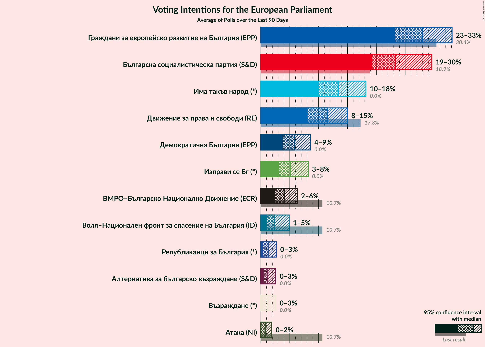

### Confidence Intervals

| Party | Last Result | Median | 80% Confidence Interval | 90% Confidence Interval | 95% Confidence Interval | 99% Confidence Interval |
|:-----:|:-----------:|:------:|:-----------------------:|:-----------------------:|:-----------------------:|:-----------------------:|
| <a href="#граждани-за-европейско-развитие-на-българия-(epp)">Граждани за европейско развитие на България (EPP)</a> | 30.4% | 27.9% | 24.8–31.3% |24.0–32.4% | 23.3–33.2% | 22.0–34.9% |
| <a href="#българска-социалистическа-партия-(s&d)">Българска социалистическа партия (S&D)</a> | 18.9% | 21.7% | 18.4–26.6% |17.7–28.3% | 17.0–29.3% | 15.7–31.0% |
| <a href="#движение-за-права-и-свободи-(re)">Движение за права и свободи (RE)</a> | 17.3% | 12.1% | 9.5–14.5% |8.8–15.3% | 8.3–15.9% | 7.4–17.3% |
| <a href="#обединени-патриоти-(ecr)">Обединени Патриоти (ECR)</a> | 10.7% | N/A | N/A |N/A | N/A | N/A |
| <a href="#вмро–българско-национално-движение-(ecr)">ВМРО–Българско Национално Движение (ECR)</a> | 10.7% | 4.3% | 3.1–5.8% |2.8–6.3% | 2.5–6.7% | 2.1–7.6% |
| <a href="#национален-фронт-за-спасение-на-българия-(*)">Национален фронт за спасение на България (*)</a> | 10.7% | N/A | N/A |N/A | N/A | N/A |
| <a href="#атака-(ni)">Атака (NI)</a> | 10.7% | 0.9% | 0.3–1.9% |0.2–2.3% | 0.1–2.6% | 0.1–3.3% |
| <a href="#воля–национален-фронт-за-спасение-на-българия-(id)">Воля–Национален фронт за спасение на България (ID)</a> | 10.7% | 3.0% | 1.6–4.4% |1.3–4.8% | 1.2–5.2% | 0.9–5.9% |
| <a href="#реформаторски-блок-(epp)">Реформаторски блок (EPP)</a> | 6.4% | N/A | N/A |N/A | N/A | N/A |
| <a href="#воля-(id)">Воля (ID)</a> | 0.0% | N/A | N/A |N/A | N/A | N/A |
| <a href="#демократична-българия-(epp)">Демократична България (EPP)</a> | 0.0% | 6.1% | 4.5–7.9% |4.2–8.4% | 3.9–8.9% | 3.3–9.9% |
| <a href="#демократи-за-силна-българия-(epp)">Демократи за силна България (EPP)</a> | 0.0% | N/A | N/A |N/A | N/A | N/A |
| <a href="#да,-българия!-(*)">Да, България! (*)</a> | 0.0% | N/A | N/A |N/A | N/A | N/A |
| <a href="#алтернатива-за-българско-възраждане-(s&d)">Алтернатива за българско възраждане (S&D)</a> | 0.0% | 1.4% | 0.8–2.3% |0.6–2.6% | 0.5–2.9% | 0.4–3.5% |
| <a href="#има-такъв-народ-(*)">Има такъв народ (*)</a> | 0.0% | 13.5% | 11.1–16.5% |10.5–17.4% | 10.0–18.1% | 9.1–19.5% |
| <a href="#възраждане-(*)">Възраждане (*)</a> | 0.0% | 1.7% | 0.9–2.8% |0.7–3.1% | 0.5–3.5% | 0.3–4.2% |
| <a href="#изправи-се-бг-(*)">Изправи се Бг (*)</a> | 0.0% | 5.5% | 3.9–7.3% |3.5–7.8% | 3.2–8.3% | 2.7–9.1% |
| <a href="#републиканци-за-българия-(*)">Републиканци за България (*)</a> | 0.0% | 1.3% | 0.6–2.2% |0.5–2.5% | 0.4–2.8% | 0.3–3.5% |

### Граждани за европейско развитие на България (EPP)

*For a full overview of the results for this party, see the [Граждани за европейско развитие на България (EPP)](party-гражданизаевропейскоразвитиенабългарияepp.html) page.*

| Voting Intentions | Probability | Accumulated | Special Marks |
|:-----------------:|:-----------:|:-----------:|:-------------:|
| 19.5–20.5% | 0% | 100% |  |
| 20.5–21.5% | 0.2% | 100% |  |
| 21.5–22.5% | 0.8% | 99.8% |  |
| 22.5–23.5% | 2% | 99.0% |  |
| 23.5–24.5% | 5% | 97% |  |
| 24.5–25.5% | 9% | 92% |  |
| 25.5–26.5% | 13% | 83% |  |
| 26.5–27.5% | 15% | 70% |  |
| 27.5–28.5% | 15% | 55% | Median |
| 28.5–29.5% | 14% | 40% |  |
| 29.5–30.5% | 11% | 27% | Last Result |
| 30.5–31.5% | 7% | 16% |  |
| 31.5–32.5% | 4% | 9% |  |
| 32.5–33.5% | 2% | 4% |  |
| 33.5–34.5% | 1.2% | 2% |  |
| 34.5–35.5% | 0.5% | 0.7% |  |
| 35.5–36.5% | 0.2% | 0.3% |  |
| 36.5–37.5% | 0.1% | 0.1% |  |
| 37.5–38.5% | 0% | 0% |  |

### Българска социалистическа партия (S&D)

*For a full overview of the results for this party, see the [Българска социалистическа партия (S&D)](party-българскасоциалистическапартияsd.html) page.*

| Voting Intentions | Probability | Accumulated | Special Marks |
|:-----------------:|:-----------:|:-----------:|:-------------:|
| 12.5–13.5% | 0% | 100% |  |
| 13.5–14.5% | 0.1% | 100% |  |
| 14.5–15.5% | 0.3% | 99.9% |  |
| 15.5–16.5% | 1.1% | 99.6% |  |
| 16.5–17.5% | 3% | 98% |  |
| 17.5–18.5% | 6% | 96% |  |
| 18.5–19.5% | 10% | 89% | Last Result |
| 19.5–20.5% | 13% | 79% |  |
| 20.5–21.5% | 15% | 66% |  |
| 21.5–22.5% | 14% | 51% | Median |
| 22.5–23.5% | 11% | 38% |  |
| 23.5–24.5% | 8% | 27% |  |
| 24.5–25.5% | 5% | 19% |  |
| 25.5–26.5% | 3% | 14% |  |
| 26.5–27.5% | 3% | 10% |  |
| 27.5–28.5% | 3% | 7% |  |
| 28.5–29.5% | 2% | 4% |  |
| 29.5–30.5% | 1.3% | 2% |  |
| 30.5–31.5% | 0.6% | 0.8% |  |
| 31.5–32.5% | 0.2% | 0.2% |  |
| 32.5–33.5% | 0% | 0% |  |
| 33.5–34.5% | 0% | 0% |  |

### Движение за права и свободи (RE)

*For a full overview of the results for this party, see the [Движение за права и свободи (RE)](party-движениезаправаисвободиre.html) page.*

| Voting Intentions | Probability | Accumulated | Special Marks |
|:-----------------:|:-----------:|:-----------:|:-------------:|
| 5.5–6.5% | 0% | 100% |  |
| 6.5–7.5% | 0.6% | 100% |  |
| 7.5–8.5% | 3% | 99.3% |  |
| 8.5–9.5% | 6% | 96% |  |
| 9.5–10.5% | 11% | 90% |  |
| 10.5–11.5% | 18% | 79% |  |
| 11.5–12.5% | 21% | 61% | Median |
| 12.5–13.5% | 18% | 40% |  |
| 13.5–14.5% | 12% | 22% |  |
| 14.5–15.5% | 6% | 10% |  |
| 15.5–16.5% | 3% | 4% |  |
| 16.5–17.5% | 0.9% | 1.2% | Last Result |
| 17.5–18.5% | 0.3% | 0.4% |  |
| 18.5–19.5% | 0.1% | 0.1% |  |
| 19.5–20.5% | 0% | 0% |  |

### ВМРО–Българско Национално Движение (ECR)

*For a full overview of the results for this party, see the [ВМРО–Българско Национално Движение (ECR)](party-вмро–българсконационалнодвижениеecr.html) page.*

| Voting Intentions | Probability | Accumulated | Special Marks |
|:-----------------:|:-----------:|:-----------:|:-------------:|
| 0.5–1.5% | 0% | 100% |  |
| 1.5–2.5% | 3% | 100% |  |
| 2.5–3.5% | 21% | 97% |  |
| 3.5–4.5% | 36% | 77% | Median |
| 4.5–5.5% | 27% | 40% |  |
| 5.5–6.5% | 11% | 14% |  |
| 6.5–7.5% | 3% | 3% |  |
| 7.5–8.5% | 0.5% | 0.6% |  |
| 8.5–9.5% | 0.1% | 0.1% |  |
| 9.5–10.5% | 0% | 0% |  |
| 10.5–11.5% | 0% | 0% | Last Result |

### Атака (NI)

*For a full overview of the results for this party, see the [Атака (NI)](party-атакаni.html) page.*

| Voting Intentions | Probability | Accumulated | Special Marks |
|:-----------------:|:-----------:|:-----------:|:-------------:|
| 0.0–0.5% | 28% | 100% |  |
| 0.5–1.5% | 52% | 72% | Median |
| 1.5–2.5% | 17% | 20% |  |
| 2.5–3.5% | 2% | 3% |  |
| 3.5–4.5% | 0.2% | 0.3% |  |
| 4.5–5.5% | 0% | 0% |  |
| 5.5–6.5% | 0% | 0% |  |
| 6.5–7.5% | 0% | 0% |  |
| 7.5–8.5% | 0% | 0% |  |
| 8.5–9.5% | 0% | 0% |  |
| 9.5–10.5% | 0% | 0% |  |
| 10.5–11.5% | 0% | 0% | Last Result |

### Воля–Национален фронт за спасение на България (ID)

*For a full overview of the results for this party, see the [Воля–Национален фронт за спасение на България (ID)](party-воля–националенфронтзаспасениенабългарияid.html) page.*

| Voting Intentions | Probability | Accumulated | Special Marks |
|:-----------------:|:-----------:|:-----------:|:-------------:|
| 0.0–0.5% | 0% | 100% |  |
| 0.5–1.5% | 8% | 100% |  |
| 1.5–2.5% | 27% | 92% |  |
| 2.5–3.5% | 35% | 65% | Median |
| 3.5–4.5% | 22% | 30% |  |
| 4.5–5.5% | 7% | 8% |  |
| 5.5–6.5% | 1.1% | 1.2% |  |
| 6.5–7.5% | 0.1% | 0.1% |  |
| 7.5–8.5% | 0% | 0% |  |
| 8.5–9.5% | 0% | 0% |  |
| 9.5–10.5% | 0% | 0% |  |
| 10.5–11.5% | 0% | 0% | Last Result |

### Алтернатива за българско възраждане (S&D)

*For a full overview of the results for this party, see the [Алтернатива за българско възраждане (S&D)](party-алтернативазабългарсковъзражданеsd.html) page.*

| Voting Intentions | Probability | Accumulated | Special Marks |
|:-----------------:|:-----------:|:-----------:|:-------------:|
| 0.0–0.5% | 3% | 100% | Last Result |
| 0.5–1.5% | 56% | 97% | Median |
| 1.5–2.5% | 35% | 41% |  |
| 2.5–3.5% | 6% | 6% |  |
| 3.5–4.5% | 0.4% | 0.5% |  |
| 4.5–5.5% | 0% | 0% |  |

### Демократична България (EPP)

*For a full overview of the results for this party, see the [Демократична България (EPP)](party-демократичнабългарияepp.html) page.*

| Voting Intentions | Probability | Accumulated | Special Marks |
|:-----------------:|:-----------:|:-----------:|:-------------:|
| 0.0–0.5% | 0% | 100% | Last Result |
| 0.5–1.5% | 0% | 100% |  |
| 1.5–2.5% | 0% | 100% |  |
| 2.5–3.5% | 1.0% | 100% |  |
| 3.5–4.5% | 9% | 98.9% |  |
| 4.5–5.5% | 24% | 90% |  |
| 5.5–6.5% | 30% | 66% | Median |
| 6.5–7.5% | 21% | 36% |  |
| 7.5–8.5% | 10% | 15% |  |
| 8.5–9.5% | 3% | 4% |  |
| 9.5–10.5% | 0.8% | 0.9% |  |
| 10.5–11.5% | 0.1% | 0.2% |  |
| 11.5–12.5% | 0% | 0% |  |

### Има такъв народ (*)

*For a full overview of the results for this party, see the [Има такъв народ (*)](party-иматакъвнарод.html) page.*

| Voting Intentions | Probability | Accumulated | Special Marks |
|:-----------------:|:-----------:|:-----------:|:-------------:|
| 0.0–0.5% | 0% | 100% | Last Result |
| 0.5–1.5% | 0% | 100% |  |
| 1.5–2.5% | 0% | 100% |  |
| 2.5–3.5% | 0% | 100% |  |
| 3.5–4.5% | 0% | 100% |  |
| 4.5–5.5% | 0% | 100% |  |
| 5.5–6.5% | 0% | 100% |  |
| 6.5–7.5% | 0% | 100% |  |
| 7.5–8.5% | 0.2% | 100% |  |
| 8.5–9.5% | 1.1% | 99.8% |  |
| 9.5–10.5% | 4% | 98.8% |  |
| 10.5–11.5% | 10% | 95% |  |
| 11.5–12.5% | 16% | 85% |  |
| 12.5–13.5% | 19% | 68% |  |
| 13.5–14.5% | 17% | 49% | Median |
| 14.5–15.5% | 13% | 32% |  |
| 15.5–16.5% | 9% | 19% |  |
| 16.5–17.5% | 5% | 10% |  |
| 17.5–18.5% | 3% | 4% |  |
| 18.5–19.5% | 1.1% | 2% |  |
| 19.5–20.5% | 0.3% | 0.5% |  |
| 20.5–21.5% | 0.1% | 0.1% |  |
| 21.5–22.5% | 0% | 0% |  |

### Изправи се Бг (*)

*For a full overview of the results for this party, see the [Изправи се Бг (*)](party-изправисебг.html) page.*

| Voting Intentions | Probability | Accumulated | Special Marks |
|:-----------------:|:-----------:|:-----------:|:-------------:|
| 0.0–0.5% | 0% | 100% | Last Result |
| 0.5–1.5% | 0% | 100% |  |
| 1.5–2.5% | 0.3% | 100% |  |
| 2.5–3.5% | 5% | 99.7% |  |
| 3.5–4.5% | 18% | 95% |  |
| 4.5–5.5% | 27% | 76% |  |
| 5.5–6.5% | 25% | 49% | Median |
| 6.5–7.5% | 16% | 23% |  |
| 7.5–8.5% | 6% | 8% |  |
| 8.5–9.5% | 1.3% | 1.5% |  |
| 9.5–10.5% | 0.2% | 0.2% |  |
| 10.5–11.5% | 0% | 0% |  |

### Възраждане (*)

*For a full overview of the results for this party, see the [Възраждане (*)](party-възраждане.html) page.*

| Voting Intentions | Probability | Accumulated | Special Marks |
|:-----------------:|:-----------:|:-----------:|:-------------:|
| 0.0–0.5% | 3% | 100% | Last Result |
| 0.5–1.5% | 37% | 97% |  |
| 1.5–2.5% | 46% | 60% | Median |
| 2.5–3.5% | 13% | 15% |  |
| 3.5–4.5% | 2% | 2% |  |
| 4.5–5.5% | 0.2% | 0.2% |  |
| 5.5–6.5% | 0% | 0% |  |

### Републиканци за България (*)

*For a full overview of the results for this party, see the [Републиканци за България (*)](party-републиканцизабългария.html) page.*

| Voting Intentions | Probability | Accumulated | Special Marks |
|:-----------------:|:-----------:|:-----------:|:-------------:|
| 0.0–0.5% | 7% | 100% | Last Result |
| 0.5–1.5% | 60% | 93% | Median |
| 1.5–2.5% | 28% | 33% |  |
| 2.5–3.5% | 5% | 5% |  |
| 3.5–4.5% | 0.4% | 0.4% |  |
| 4.5–5.5% | 0% | 0% |  |

## Seats

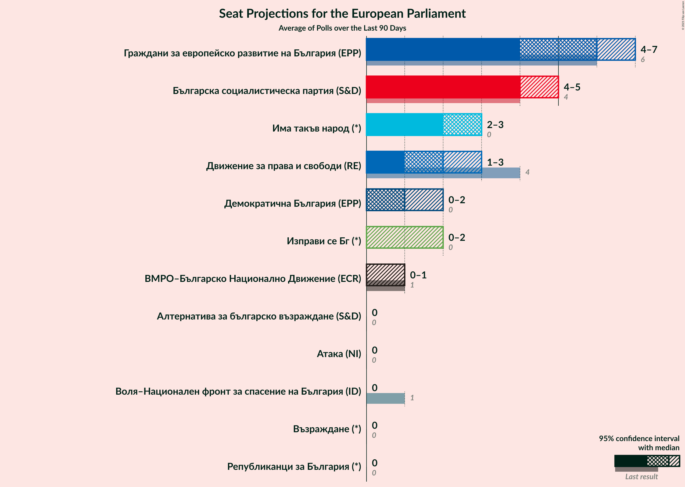

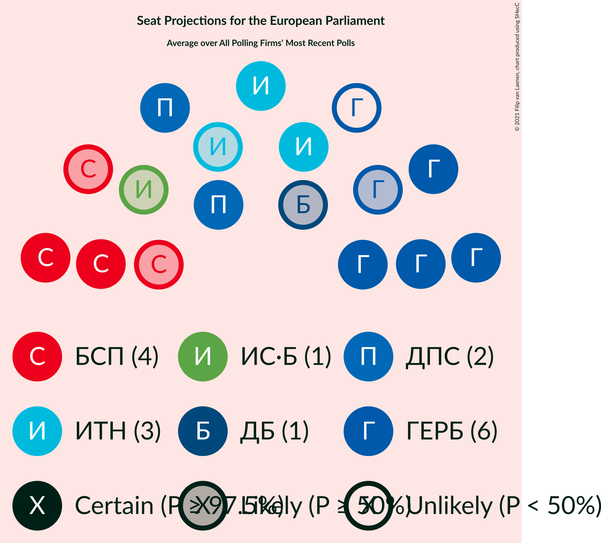

### Confidence Intervals

| Party | Last Result | Median | 80% Confidence Interval | 90% Confidence Interval | 95% Confidence Interval | 99% Confidence Interval |
|:-----:|:-----------:|:------:|:-----------------------:|:-----------------------:|:-----------------------:|:-----------------------:|
| <a href="#граждани-за-европейско-развитие-на-българия-(epp)">Граждани за европейско развитие на България (EPP)</a> | 6 | 5 | 5–6 |4–6 | 4–7 | 4–7 |
| <a href="#българска-социалистическа-партия-(s&d)">Българска социалистическа партия (S&D)</a> | 4 | 4 | 4–5 |3–5 | 3–6 | 3–6 |
| <a href="#движение-за-права-и-свободи-(re)">Движение за права и свободи (RE)</a> | 4 | 2 | 2–3 |2–3 | 2–3 | 1–4 |
| <a href="#обединени-патриоти-(ecr)">Обединени Патриоти (ECR)</a> | 2 | N/A | N/A |N/A | N/A | N/A |
| <a href="#вмро–българско-национално-движение-(ecr)">ВМРО–Българско Национално Движение (ECR)</a> | 1 | 0 | 0–1 |0–1 | 0–1 | 0–2 |
| <a href="#национален-фронт-за-спасение-на-българия-(*)">Национален фронт за спасение на България (*)</a> | 1 | N/A | N/A |N/A | N/A | N/A |
| <a href="#атака-(ni)">Атака (NI)</a> | 0 | 0 | 0 |0 | 0 | 0 |
| <a href="#воля–национален-фронт-за-спасение-на-българия-(id)">Воля–Национален фронт за спасение на България (ID)</a> | 1 | 0 | 0 |0 | 0–1 | 0–1 |
| <a href="#реформаторски-блок-(epp)">Реформаторски блок (EPP)</a> | 1 | N/A | N/A |N/A | N/A | N/A |
| <a href="#воля-(id)">Воля (ID)</a> | 0 | N/A | N/A |N/A | N/A | N/A |
| <a href="#демократична-българия-(epp)">Демократична България (EPP)</a> | 0 | 1 | 0–2 |0–2 | 0–2 | 0–2 |
| <a href="#демократи-за-силна-българия-(epp)">Демократи за силна България (EPP)</a> | 0 | N/A | N/A |N/A | N/A | N/A |
| <a href="#да,-българия!-(*)">Да, България! (*)</a> | 0 | N/A | N/A |N/A | N/A | N/A |
| <a href="#алтернатива-за-българско-възраждане-(s&d)">Алтернатива за българско възраждане (S&D)</a> | 0 | 0 | 0 |0 | 0 | 0 |
| <a href="#има-такъв-народ-(*)">Има такъв народ (*)</a> | 0 | 3 | 2–3 |2–3 | 2–4 | 2–4 |
| <a href="#възраждане-(*)">Възраждане (*)</a> | 0 | 0 | 0 |0 | 0 | 0 |
| <a href="#изправи-се-бг-(*)">Изправи се Бг (*)</a> | 0 | 1 | 0–1 |0–2 | 0–2 | 0–2 |
| <a href="#републиканци-за-българия-(*)">Републиканци за България (*)</a> | 0 | 0 | 0 |0 | 0 | 0 |

### Граждани за европейско развитие на България (EPP)

*For a full overview of the results for this party, see the [Граждани за европейско развитие на България (EPP)](party-гражданизаевропейскоразвитиенабългарияepp.html) page.*

| Number of Seats | Probability | Accumulated | Special Marks |
|:---------------:|:-----------:|:-----------:|:-------------:|
| 4 | 8% | 100% |  |
| 5 | 46% | 92% | Median |
| 6 | 43% | 46% | Last Result |
| 7 | 3% | 3% |  |
| 8 | 0% | 0% |  |

### Българска социалистическа партия (S&D)

*For a full overview of the results for this party, see the [Българска социалистическа партия (S&D)](party-българскасоциалистическапартияsd.html) page.*

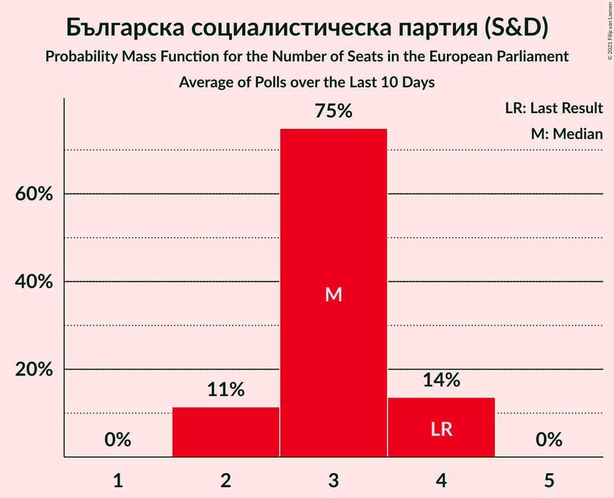

| Number of Seats | Probability | Accumulated | Special Marks |
|:---------------:|:-----------:|:-----------:|:-------------:|
| 3 | 9% | 100% |  |
| 4 | 56% | 91% | Last Result, Median |
| 5 | 31% | 35% |  |
| 6 | 4% | 4% |  |
| 7 | 0% | 0% |  |

### Движение за права и свободи (RE)

*For a full overview of the results for this party, see the [Движение за права и свободи (RE)](party-движениезаправаисвободиre.html) page.*

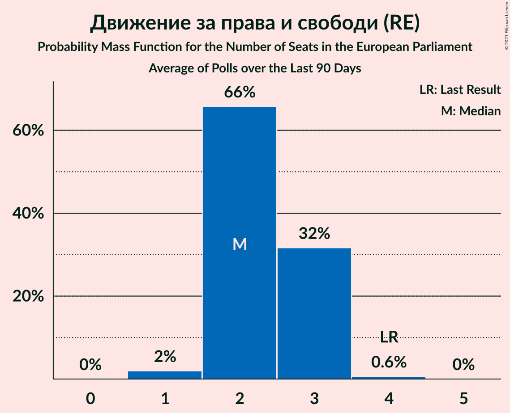

| Number of Seats | Probability | Accumulated | Special Marks |
|:---------------:|:-----------:|:-----------:|:-------------:|
| 1 | 1.5% | 100% |  |
| 2 | 61% | 98.5% | Median |
| 3 | 36% | 37% |  |
| 4 | 0.8% | 0.8% | Last Result |
| 5 | 0% | 0% |  |

### Обединени Патриоти (ECR)

*For a full overview of the results for this party, see the [Обединени Патриоти (ECR)](party-обединенипатриотиecr.html) page.*

### ВМРО–Българско Национално Движение (ECR)

*For a full overview of the results for this party, see the [ВМРО–Българско Национално Движение (ECR)](party-вмро–българсконационалнодвижениеecr.html) page.*

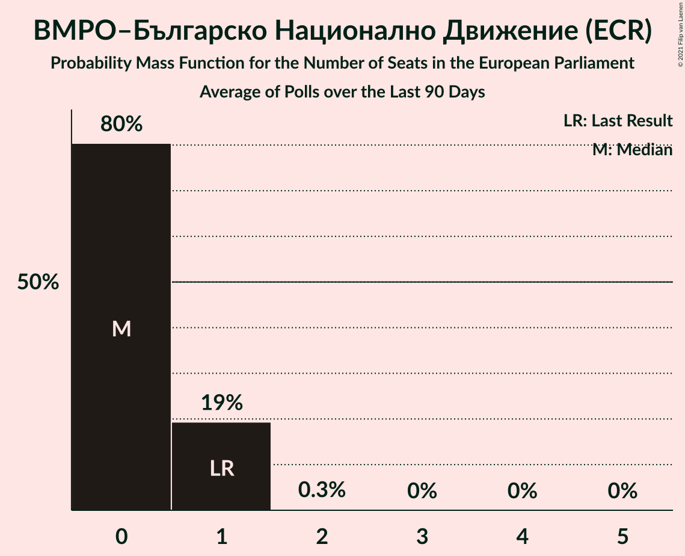

| Number of Seats | Probability | Accumulated | Special Marks |
|:---------------:|:-----------:|:-----------:|:-------------:|
| 0 | 78% | 100% | Median |
| 1 | 21% | 22% | Last Result |
| 2 | 0.8% | 0.8% |  |
| 3 | 0% | 0% |  |

### Национален фронт за спасение на България (*)

*For a full overview of the results for this party, see the [Национален фронт за спасение на България (*)](party-националенфронтзаспасениенабългария.html) page.*

### Атака (NI)

*For a full overview of the results for this party, see the [Атака (NI)](party-атакаni.html) page.*

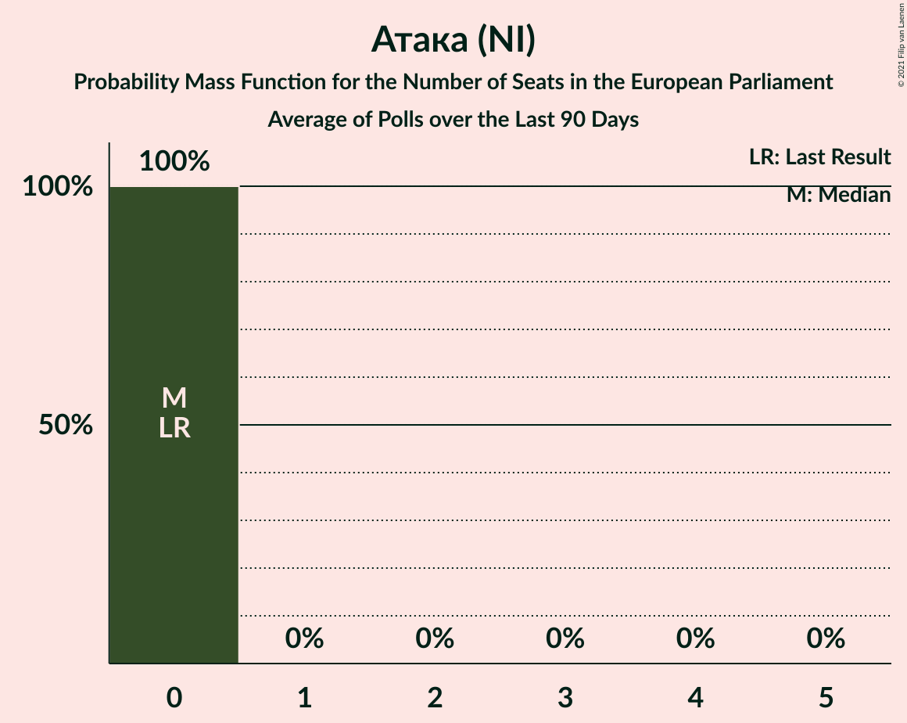

| Number of Seats | Probability | Accumulated | Special Marks |
|:---------------:|:-----------:|:-----------:|:-------------:|
| 0 | 100% | 100% | Last Result, Median |

### Воля–Национален фронт за спасение на България (ID)

*For a full overview of the results for this party, see the [Воля–Национален фронт за спасение на България (ID)](party-воля–националенфронтзаспасениенабългарияid.html) page.*

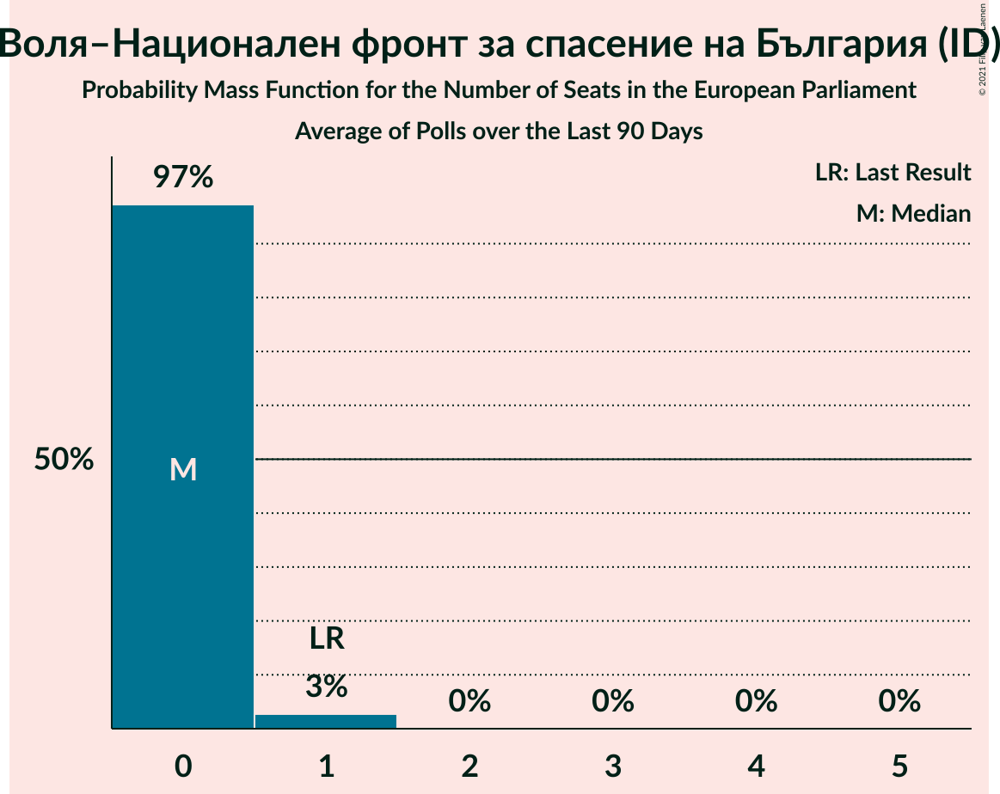

| Number of Seats | Probability | Accumulated | Special Marks |
|:---------------:|:-----------:|:-----------:|:-------------:|
| 0 | 97% | 100% | Median |
| 1 | 3% | 3% | Last Result |
| 2 | 0% | 0% |  |

### Реформаторски блок (EPP)

*For a full overview of the results for this party, see the [Реформаторски блок (EPP)](party-реформаторскиблокepp.html) page.*

### Воля (ID)

*For a full overview of the results for this party, see the [Воля (ID)](party-воляid.html) page.*

### Демократична България (EPP)

*For a full overview of the results for this party, see the [Демократична България (EPP)](party-демократичнабългарияepp.html) page.*

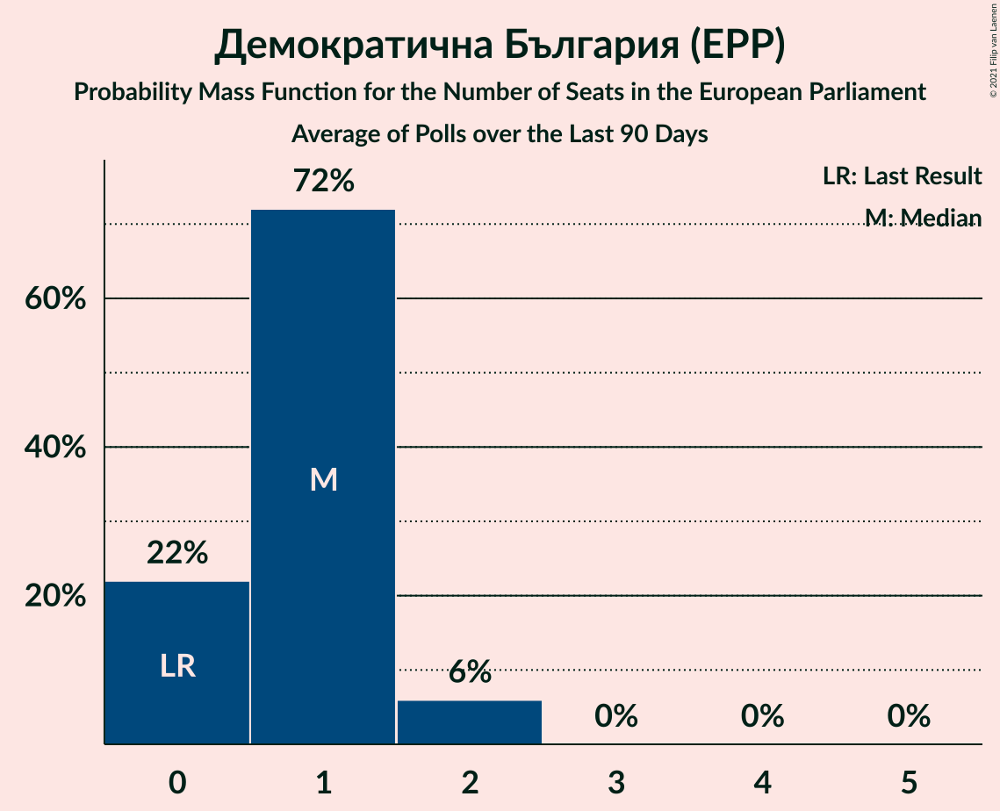

| Number of Seats | Probability | Accumulated | Special Marks |
|:---------------:|:-----------:|:-----------:|:-------------:|
| 0 | 20% | 100% | Last Result |
| 1 | 63% | 80% | Median |
| 2 | 17% | 17% |  |
| 3 | 0% | 0% |  |

### Демократи за силна България (EPP)

*For a full overview of the results for this party, see the [Демократи за силна България (EPP)](party-демократизасилнабългарияepp.html) page.*

### Да, България! (*)

*For a full overview of the results for this party, see the [Да, България! (*)](party-дабългария.html) page.*

### Алтернатива за българско възраждане (S&D)

*For a full overview of the results for this party, see the [Алтернатива за българско възраждане (S&D)](party-алтернативазабългарсковъзражданеsd.html) page.*

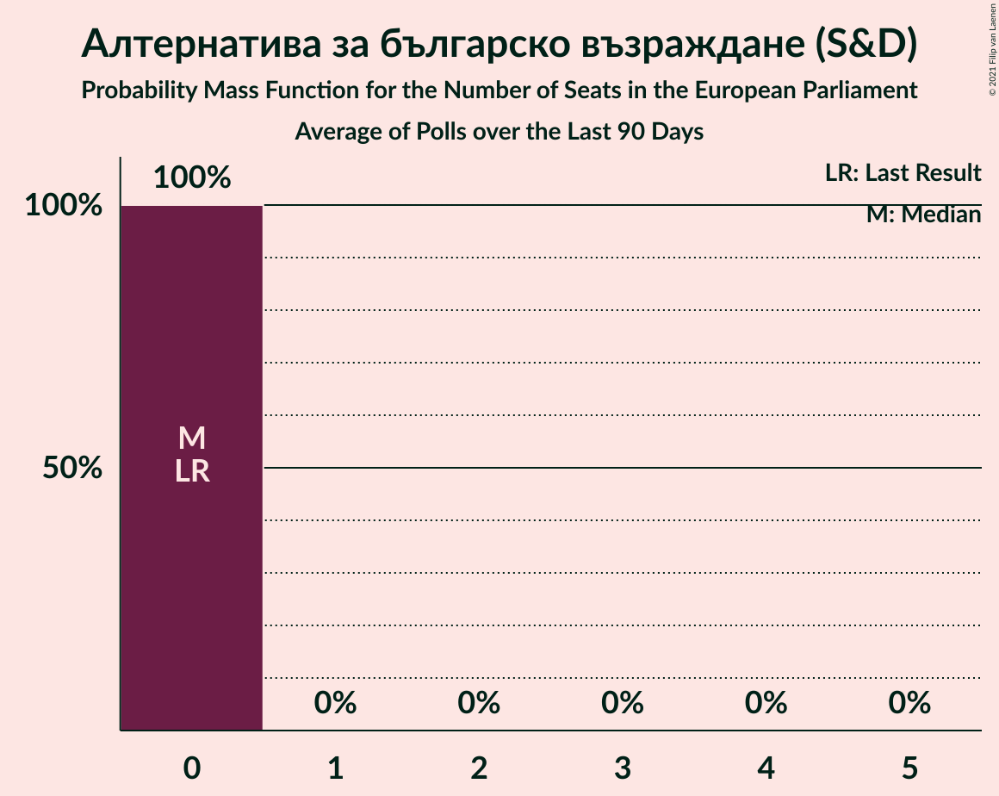

| Number of Seats | Probability | Accumulated | Special Marks |
|:---------------:|:-----------:|:-----------:|:-------------:|
| 0 | 100% | 100% | Last Result, Median |

### Има такъв народ (*)

*For a full overview of the results for this party, see the [Има такъв народ (*)](party-иматакъвнарод.html) page.*

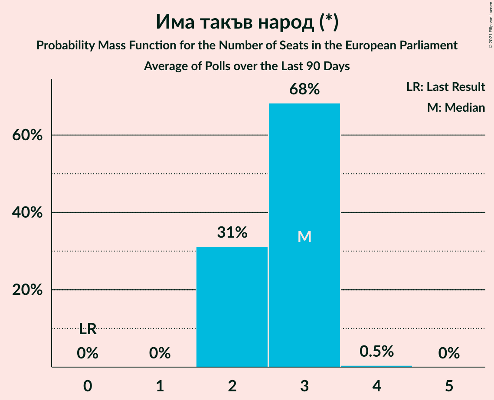

| Number of Seats | Probability | Accumulated | Special Marks |
|:---------------:|:-----------:|:-----------:|:-------------:|
| 0 | 0% | 100% | Last Result |
| 1 | 0% | 100% |  |
| 2 | 37% | 100% |  |
| 3 | 60% | 63% | Median |
| 4 | 3% | 3% |  |
| 5 | 0% | 0% |  |

### Възраждане (*)

*For a full overview of the results for this party, see the [Възраждане (*)](party-възраждане.html) page.*

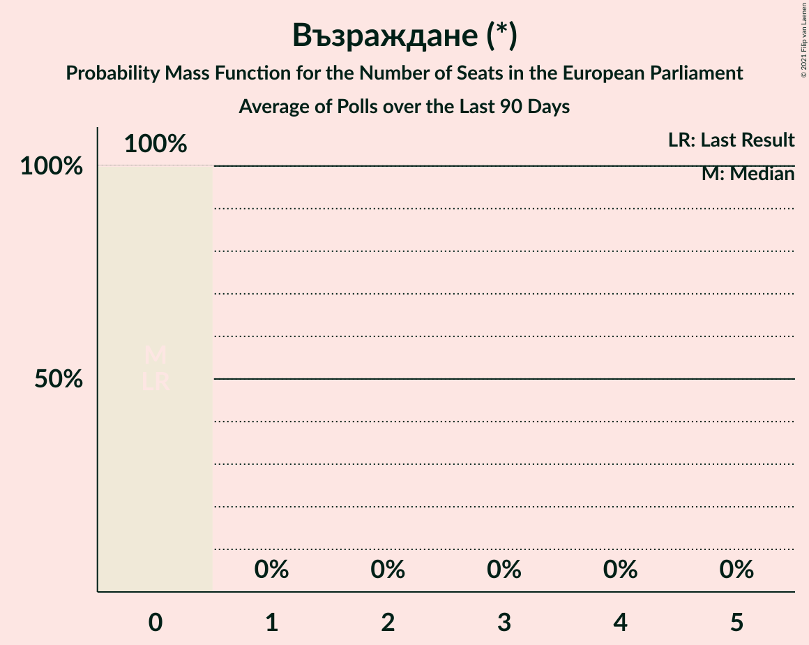

| Number of Seats | Probability | Accumulated | Special Marks |
|:---------------:|:-----------:|:-----------:|:-------------:|
| 0 | 100% | 100% | Last Result, Median |

### Изправи се Бг (*)

*For a full overview of the results for this party, see the [Изправи се Бг (*)](party-изправисебг.html) page.*

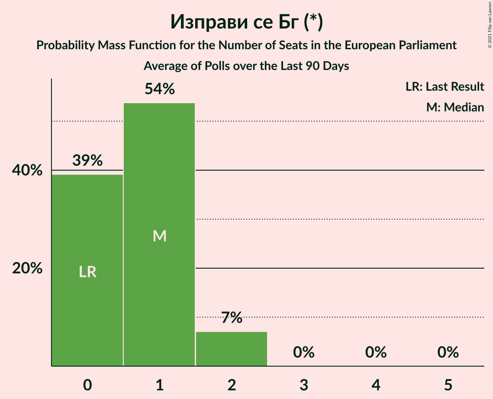

| Number of Seats | Probability | Accumulated | Special Marks |
|:---------------:|:-----------:|:-----------:|:-------------:|
| 0 | 40% | 100% | Last Result |
| 1 | 54% | 60% | Median |
| 2 | 7% | 7% |  |
| 3 | 0% | 0% |  |

### Републиканци за България (*)

*For a full overview of the results for this party, see the [Републиканци за България (*)](party-републиканцизабългария.html) page.*

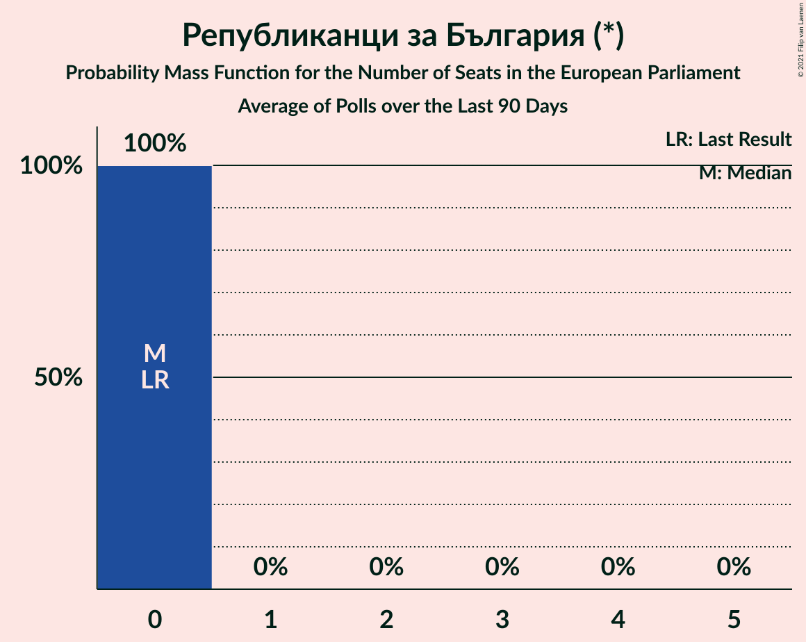

| Number of Seats | Probability | Accumulated | Special Marks |
|:---------------:|:-----------:|:-----------:|:-------------:|
| 0 | 100% | 100% | Last Result, Median |

## Coalitions

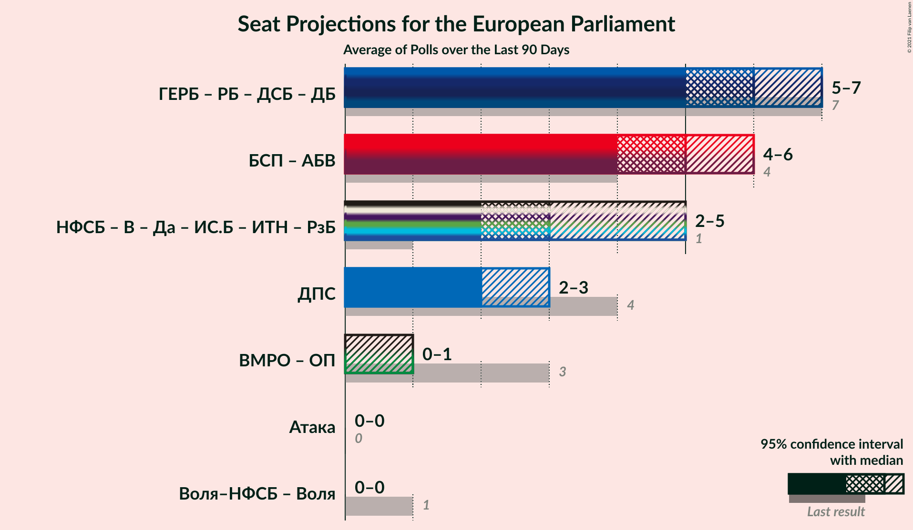

### Confidence Intervals

| Coalition | Last Result | Median | Majority? | 80% Confidence Interval | 90% Confidence Interval | 95% Confidence Interval | 99% Confidence Interval |
|:---------:|:-----------:|:------:|:---------:|:-----------------------:|:-----------------------:|:-----------------------:|:-----------------------:|
| Граждани за европейско развитие на България (EPP) – Реформаторски блок (EPP) – Демократи за силна България (EPP) – Демократична България (EPP) | 7 | 6 | 0.2% | 5–8 | 5–8 | 5–8 | 5–8 |
| Българска социалистическа партия (S&D) – Алтернатива за българско възраждане (S&D) | 4 | 4 | 0% | 4–5 | 3–5 | 3–6 | 3–6 |
| Национален фронт за спасение на България (*) – Възраждане (*) – Да, България! (*) – Изправи се Бг (*) – Има такъв народ (*) – Републиканци за България (*) | 1 | 3 | 0% | 2–4 | 2–5 | 2–5 | 2–5 |
| Движение за права и свободи (RE) | 4 | 2 | 0% | 2–3 | 2–3 | 2–3 | 1–4 |
| ВМРО–Българско Национално Движение (ECR) – Обединени Патриоти (ECR) | 3 | 0 | 0% | 0–1 | 0–1 | 0–1 | 0–2 |
| Атака (NI) | 0 | 0 | 0% | 0 | 0 | 0 | 0 |
| Воля–Национален фронт за спасение на България (ID) – Воля (ID) | 1 | 0 | 0% | 0 | 0 | 0 | 0–1 |

### Граждани за европейско развитие на България (EPP) – Реформаторски блок (EPP) – Демократи за силна България (EPP) – Демократична България (EPP)

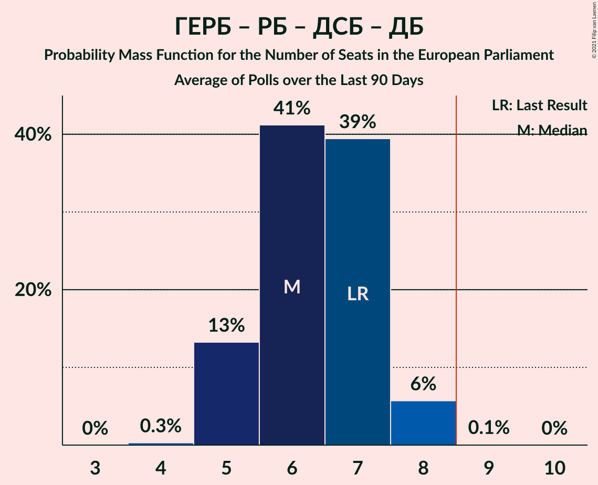

| Number of Seats | Probability | Accumulated | Special Marks |
|:---------------:|:-----------:|:-----------:|:-------------:|
| 4 | 0.3% | 100% |  |
| 5 | 13% | 99.7% |  |
| 6 | 45% | 87% | Median |
| 7 | 32% | 42% | Last Result |
| 8 | 10% | 11% |  |
| 9 | 0.2% | 0.2% | Majority |
| 10 | 0% | 0% |  |

### Българска социалистическа партия (S&D) – Алтернатива за българско възраждане (S&D)

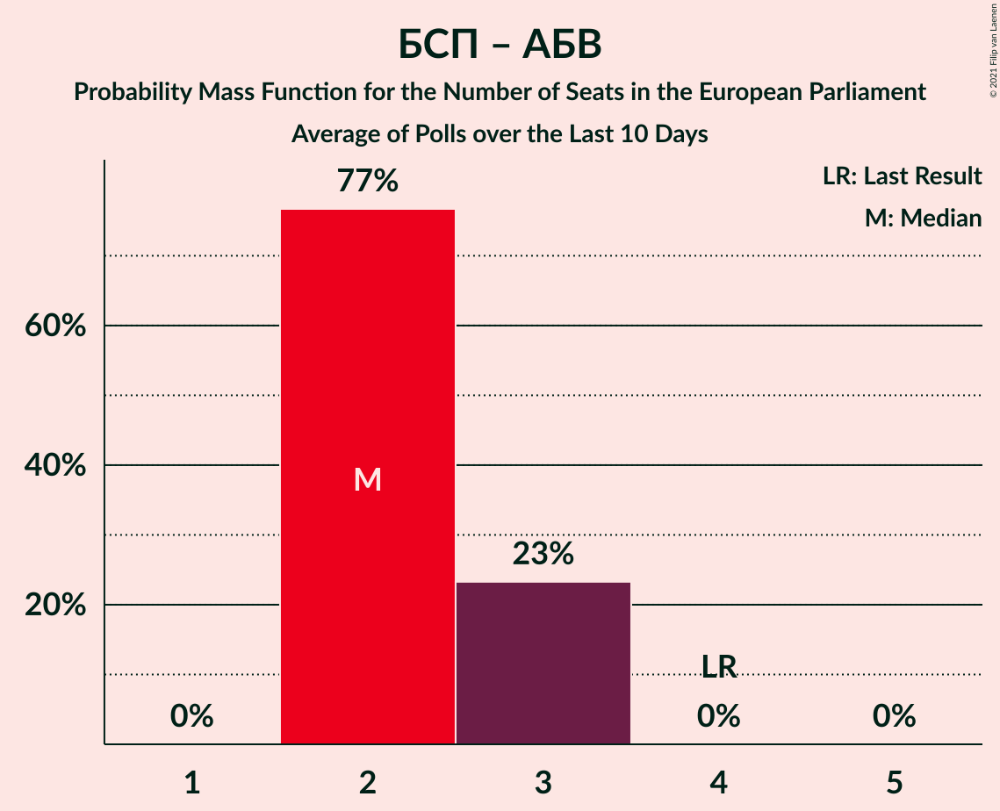

| Number of Seats | Probability | Accumulated | Special Marks |
|:---------------:|:-----------:|:-----------:|:-------------:|
| 3 | 9% | 100% |  |
| 4 | 56% | 91% | Last Result, Median |
| 5 | 31% | 35% |  |
| 6 | 4% | 4% |  |
| 7 | 0% | 0% |  |

### Национален фронт за спасение на България (*) – Възраждане (*) – Да, България! (*) – Изправи се Бг (*) – Има такъв народ (*) – Републиканци за България (*)

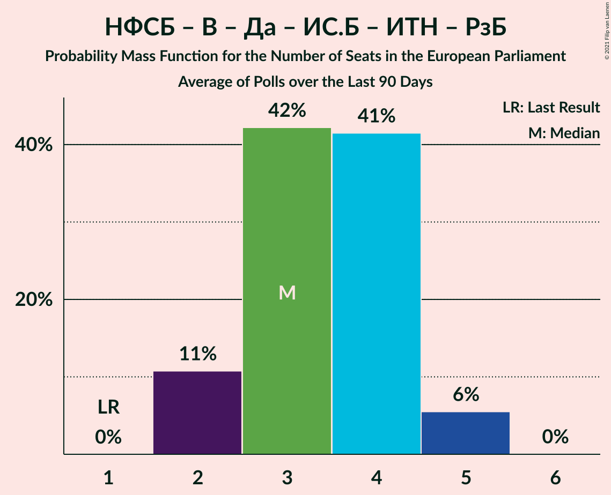

| Number of Seats | Probability | Accumulated | Special Marks |
|:---------------:|:-----------:|:-----------:|:-------------:|
| 1 | 0% | 100% | Last Result |
| 2 | 18% | 100% |  |
| 3 | 37% | 82% |  |
| 4 | 40% | 46% | Median |
| 5 | 5% | 5% |  |
| 6 | 0% | 0% |  |

### Движение за права и свободи (RE)

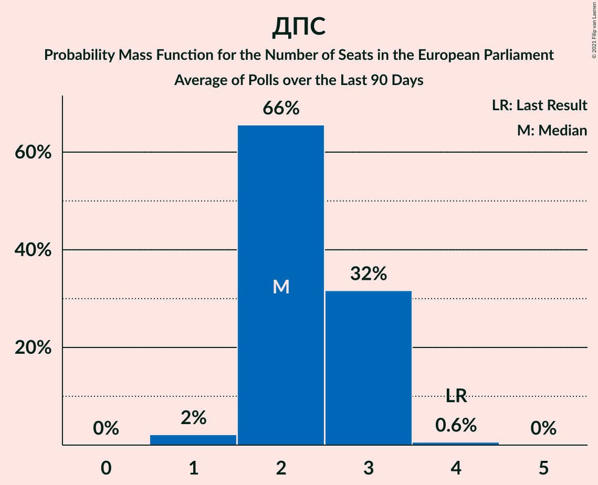

| Number of Seats | Probability | Accumulated | Special Marks |
|:---------------:|:-----------:|:-----------:|:-------------:|
| 1 | 1.5% | 100% |  |
| 2 | 61% | 98.5% | Median |
| 3 | 36% | 37% |  |
| 4 | 0.8% | 0.8% | Last Result |
| 5 | 0% | 0% |  |

### ВМРО–Българско Национално Движение (ECR) – Обединени Патриоти (ECR)

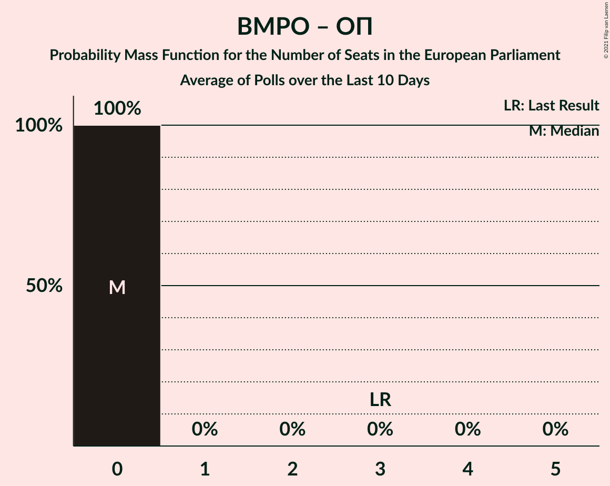

| Number of Seats | Probability | Accumulated | Special Marks |
|:---------------:|:-----------:|:-----------:|:-------------:|
| 0 | 78% | 100% | Median |
| 1 | 21% | 22% |  |
| 2 | 0.8% | 0.8% |  |
| 3 | 0% | 0% | Last Result |

### Атака (NI)

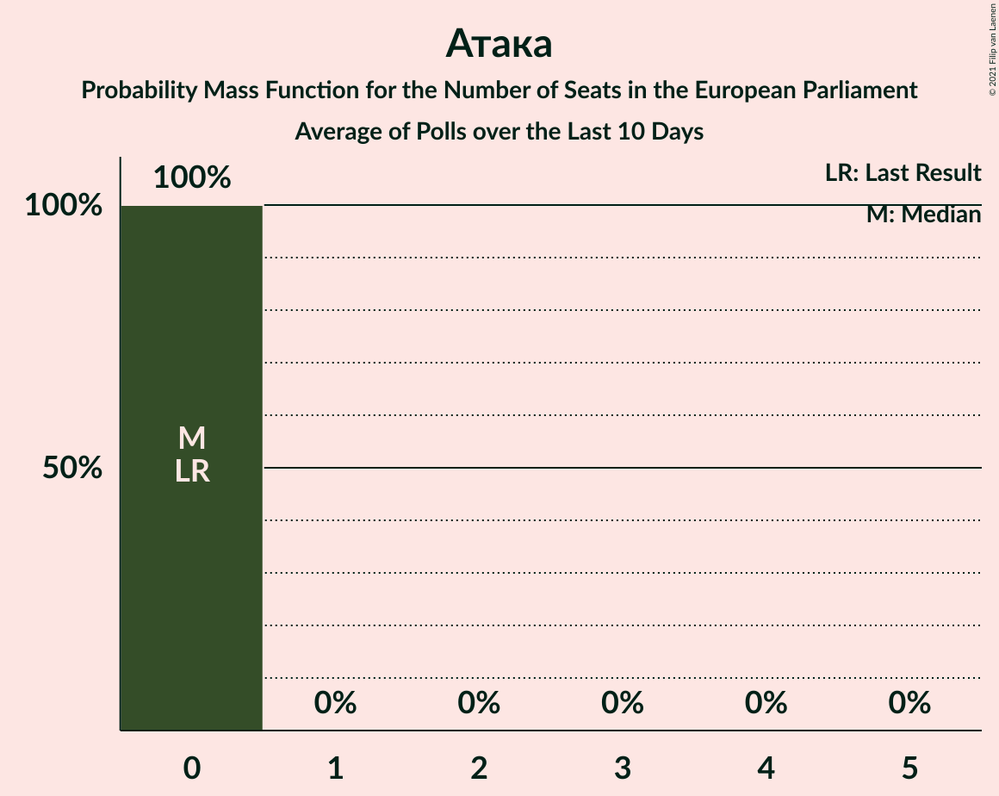

| Number of Seats | Probability | Accumulated | Special Marks |
|:---------------:|:-----------:|:-----------:|:-------------:|
| 0 | 100% | 100% | Last Result, Median |

### Воля–Национален фронт за спасение на България (ID) – Воля (ID)

| Number of Seats | Probability | Accumulated | Special Marks |
|:---------------:|:-----------:|:-----------:|:-------------:|
| 0 | 98% | 100% | Median |
| 1 | 2% | 2% | Last Result |
| 2 | 0% | 0% |  |

## Technical Information

+ **Number of polls included in this average:** 10
+ **Lowest number of simulations done in a poll included in this average:** 1,048,576
+ **Total number of simulations done in the polls included in this average:** 10,485,760
+ **Error estimate:** 4.01%
