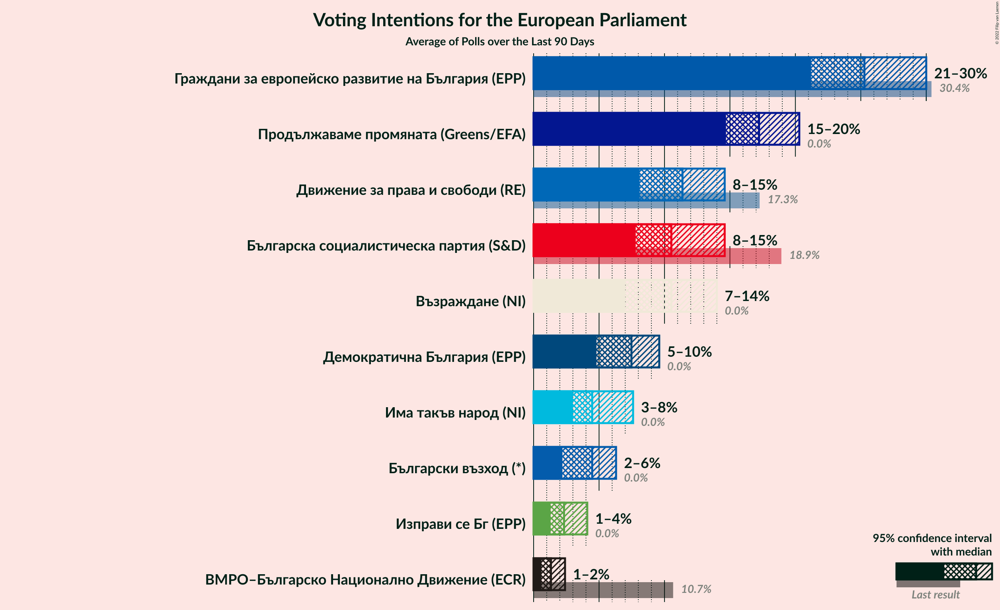

# Poll Average

<a href="#voting-intentions">Voting Intentions</a> | <a href="#seats">Seats</a> | <a href="#coalitions">Coalitions</a> | <a href="#technical-information">Technical Information</a>

## Summary

The table below lists the polls on which the average is based. They are the most recent polls (less than 90 days old) registered and analyzed so far.

| Period     | Polling firm/Commissioner(s) | ГЕРБ | БСП | ДПС | ОП | ВМРО | НФСБ | Атака | РБ | Воля | ДБ | ДСБ | Да | АБВ | ИТН | В | ИС.Б | РзБ | Воля–НФСБ | БП | ПП | БВ |
|:----------:|:----------------------------:|:--:|:--:|:--:|:--:|:--:|:--:|:--:|:--:|:--:|:--:|:--:|:--:|:--:|:--:|:--:|:--:|:--:|:--:|:--:|:--:|:--:|
| 26 May 2019 | General Election | 30.4%   6 | 18.9%   4 | 17.3%   4 | 10.7%   2 | 10.7%   1 | 10.7%   1 | 10.7%   0 | 6.4%   1 | 0.0%   0 | 0.0%   0 | 0.0%   0 | 0.0%   0 | 0.0%   0 | 0.0%   0 | 0.0%   0 | 0.0%   0 | 0.0%   0 | 10.7%   1 | 10.7%   1 | 0.0%   0 | 0.0%   0 |
| N/A | Poll Average | 21–30%   4–6 | 8–15%   1–3 | 8–15%   1–3 | N/A   N/A | 1–2%   0 | N/A   N/A | N/A   N/A | N/A   N/A | N/A   N/A | 5–10%   0–2 | N/A   N/A | N/A   N/A | N/A   N/A | 3–6%   0–1 | 9–14%   2–3 | 1–4%   0 | N/A   N/A | N/A   N/A | N/A   N/A | 15–20%   3–4 | 2–6%   0–1 |
| [27–29 September 2022](2022-09-29-Алфарисърч.html) | Алфа рисърч | 23–28%   4–6 | 9–12%   2 | 11–15%   2–3 | N/A   N/A | 1–3%   0 | N/A   N/A | N/A   N/A | N/A   N/A | N/A   N/A | 7–10%   1–2 | N/A   N/A | N/A   N/A | N/A   N/A | 3–5%   0–1 | 9–13%   2–3 | 1–3%   0 | N/A   N/A | N/A   N/A | N/A   N/A | 14–19%   3–4 | 3–6%   0–1 |
| [21–27 September 2022](2022-09-27-Тренд.html) | Тренд   24 chasa | 23–29%   4–5 | 7–11%   1–2 | 10–14%   2–3 | N/A   N/A | 1–2%   0 | N/A   N/A | N/A   N/A | N/A   N/A | N/A   N/A | 6–10%   1–2 | N/A   N/A | N/A   N/A | N/A   N/A | 3–6%   0–1 | 9–13%   2 | 1–3%   0 | N/A   N/A | N/A   N/A | N/A   N/A | 14–19%   3–4 | 3–6%   0–1 |
| [20–27 September 2022](2022-09-27-GallupInternational.html) | Gallup International | 23–29%   4–6 | 8–11%   1–2 | 11–16%   2–3 | N/A   N/A | 1–2%   0 | N/A   N/A | N/A   N/A | N/A   N/A | N/A   N/A | 6–10%   1–2 | N/A   N/A | N/A   N/A | N/A   N/A | 3–6%   N/A | 11–15%   N/A | 1–3%   0 | N/A   N/A | N/A   N/A | N/A   N/A | 14–19%   3–4 | 3–5%   0–1 |
| [17–23 September 2022](2022-09-23-MarketLinks.html) | Market Links   24 chasa | 21–26%   4–5 | 8–12%   2 | 10–14%   2–3 | N/A   N/A | N/A   N/A | N/A   N/A | N/A   N/A | N/A   N/A | N/A   N/A | 6–10%   1–2 | N/A   N/A | N/A   N/A | N/A   N/A | N/A   N/A | N/A   N/A | 2–4%   0 | N/A   N/A | N/A   N/A | N/A   N/A | 15–19%   3–4 | 2–4%   0 |
| [10–17 September 2022](2022-09-17-Exacta.html) | Exacta | 24–29%   4–5 | 11–15%   2–3 | 9–12%   2 | N/A   N/A | N/A   N/A | N/A   N/A | N/A   N/A | N/A   N/A | N/A   N/A | 6–9%   1–2 | N/A   N/A | N/A   N/A | N/A   N/A | N/A   N/A | N/A   N/A | N/A   N/A | N/A   N/A | N/A   N/A | N/A   N/A | 16–21%   3–4 | 3–5%   0–1 |
| [10–17 September 2022](2022-09-17-Estat.html) | Estat | 23–29%   4–5 | 8–11%   1–2 | 9–12%   2 | N/A   N/A | 1–2%   0 | N/A   N/A | N/A   N/A | N/A   N/A | N/A   N/A | 5–9%   1–2 | N/A   N/A | N/A   N/A | N/A   N/A | N/A   N/A | N/A   N/A | 1–3%   0 | N/A   N/A | N/A   N/A | N/A   N/A | 15–19%   3–4 | 4–6%   0–1 |
| [6–12 September 2022](2022-09-12-SovaHarris.html) | Sova Harris   Dir.bg | 26–32%   5–6 | 11–15%   2–3 | 7–11%   1–2 | N/A   N/A | 1–2%   0 | N/A   N/A | N/A   N/A | N/A   N/A | N/A   N/A | 4–8%   0–1 | N/A   N/A | N/A   N/A | N/A   N/A | N/A   N/A | N/A   N/A | 2–4%   0 | N/A   N/A | N/A   N/A | N/A   N/A | 16–22%   3–4 | 4–6%   0–1 |
| [29 August–4 September 2022](2022-09-04-Медиана.html) | Медиана | 20–26%   4–5 | 11–16%   2–3 | 9–13%   2–3 | N/A   N/A | N/A   N/A | N/A   N/A | N/A   N/A | N/A   N/A | N/A   N/A | 4–7%   0–1 | N/A   N/A | N/A   N/A | N/A   N/A | N/A   N/A | N/A   N/A | 2–5%   0 | N/A   N/A | N/A   N/A | N/A   N/A | 15–20%   3–4 | 4–7%   0–1 |
| [27 August–3 September 2022](2022-09-03-МаркетЛИНКС.html) | Маркет ЛИНКС   bTV | 20–25%   4–5 | 9–13%   2 | 9–13%   2 | N/A   N/A | N/A   N/A | N/A   N/A | N/A   N/A | N/A   N/A | N/A   N/A | 7–10%   1–2 | N/A   N/A | N/A   N/A | N/A   N/A | N/A   N/A | N/A   N/A | N/A   N/A | N/A   N/A | N/A   N/A | N/A   N/A | 16–20%   3–4 | 4–6%   0–1 |
| 26 May 2019 | General Election | 30.4%   6 | 18.9%   4 | 17.3%   4 | 10.7%   2 | 10.7%   1 | 10.7%   1 | 10.7%   0 | 6.4%   1 | 0.0%   0 | 0.0%   0 | 0.0%   0 | 0.0%   0 | 0.0%   0 | 0.0%   0 | 0.0%   0 | 0.0%   0 | 0.0%   0 | 10.7%   1 | 10.7%   1 | 0.0%   0 | 0.0%   0 |

Only polls for which at least the sample size has been published are included in the table above.

**Legend:**
+ **Top half of each row:** Voting intentions (95% confidence interval)
+ **Bottom half of each row:** Seat projections for the European Parliament (95% confidence interval)
+ **ГЕРБ:** Граждани за европейско развитие на България (EPP)
+ **БСП:** Българска социалистическа партия (S&D)
+ **ДПС:** Движение за права и свободи (RE)
+ **ОП:** Обединени Патриоти (ECR)
+ **ВМРО:** ВМРО–Българско Национално Движение (ECR)
+ **НФСБ:** Национален фронт за спасение на България (*)
+ **Атака:** Атака (NI)
+ **РБ:** Реформаторски блок (EPP)
+ **Воля:** Воля (ID)
+ **ДБ:** Демократична България (EPP)
+ **ДСБ:** Демократи за силна България (EPP)
+ **Да:** Да, България! (*)
+ **АБВ:** Алтернатива за българско възраждане (S&D)
+ **ИТН:** Има такъв народ (NI)
+ **В:** Възраждане (NI)
+ **ИС.Б:** Изправи се Бг (EPP)
+ **РзБ:** Републиканци за България (*)
+ **Воля–НФСБ:** Воля–Национален фронт за спасение на България (ID)
+ **БП:** Българските патриоти (ECR)
+ **ПП:** Продължаваме промяната (Greens/EFA)
+ **БВ:** Български възход (*)
+ **N/A (single party):** Party not included the published results
+ **N/A (entire row):** Calculation for this opinion poll not started yet

## Voting Intentions

### Confidence Intervals

| Party | Last Result | Median | 80% Confidence Interval | 90% Confidence Interval | 95% Confidence Interval | 99% Confidence Interval |
|:-----:|:-----------:|:------:|:-----------------------:|:-----------------------:|:-----------------------:|:-----------------------:|
| <a href="#граждани-за-европейско-развитие-на-българия-(epp)">Граждани за европейско развитие на България (EPP)</a> | 30.4% | 25.3% | 22.4–28.2% |21.8–29.2% | 21.2–30.0% | 20.3–31.5% |
| <a href="#българска-социалистическа-партия-(s&d)">Българска социалистическа партия (S&D)</a> | 18.9% | 10.5% | 8.6–13.5% |8.2–14.1% | 7.8–14.6% | 7.2–15.5% |
| <a href="#движение-за-права-и-свободи-(re)">Движение за права и свободи (RE)</a> | 17.3% | 11.4% | 9.2–13.6% |8.6–14.2% | 8.1–14.6% | 7.2–15.4% |
| <a href="#обединени-патриоти-(ecr)">Обединени Патриоти (ECR)</a> | 10.7% | N/A | N/A |N/A | N/A | N/A |
| <a href="#вмро–българско-национално-движение-(ecr)">ВМРО–Българско Национално Движение (ECR)</a> | 10.7% | 1.3% | 0.8–2.0% |0.7–2.2% | 0.6–2.4% | 0.5–2.8% |
| <a href="#национален-фронт-за-спасение-на-българия-(*)">Национален фронт за спасение на България (*)</a> | 10.7% | N/A | N/A |N/A | N/A | N/A |
| <a href="#атака-(ni)">Атака (NI)</a> | 10.7% | N/A | N/A |N/A | N/A | N/A |
| <a href="#воля–национален-фронт-за-спасение-на-българия-(id)">Воля–Национален фронт за спасение на България (ID)</a> | 10.7% | N/A | N/A |N/A | N/A | N/A |
| <a href="#българските-патриоти-(ecr)">Българските патриоти (ECR)</a> | 10.7% | N/A | N/A |N/A | N/A | N/A |
| <a href="#реформаторски-блок-(epp)">Реформаторски блок (EPP)</a> | 6.4% | N/A | N/A |N/A | N/A | N/A |
| <a href="#воля-(id)">Воля (ID)</a> | 0.0% | N/A | N/A |N/A | N/A | N/A |
| <a href="#демократична-българия-(epp)">Демократична България (EPP)</a> | 0.0% | 7.5% | 5.5–8.9% |5.1–9.3% | 4.8–9.6% | 4.3–10.3% |
| <a href="#демократи-за-силна-българия-(epp)">Демократи за силна България (EPP)</a> | 0.0% | N/A | N/A |N/A | N/A | N/A |
| <a href="#да,-българия!-(*)">Да, България! (*)</a> | 0.0% | N/A | N/A |N/A | N/A | N/A |
| <a href="#алтернатива-за-българско-възраждане-(s&d)">Алтернатива за българско възраждане (S&D)</a> | 0.0% | N/A | N/A |N/A | N/A | N/A |
| <a href="#има-такъв-народ-(ni)">Има такъв народ (NI)</a> | 0.0% | 4.2% | 3.4–5.0% |3.2–5.3% | 3.1–5.6% | 2.8–6.0% |
| <a href="#възраждане-(ni)">Възраждане (NI)</a> | 0.0% | 11.6% | 10.1–13.5% |9.7–13.9% | 9.4–14.5% | 8.9–15.3% |
| <a href="#изправи-се-бг-(epp)">Изправи се Бг (EPP)</a> | 0.0% | 2.3% | 1.6–3.5% |1.4–3.8% | 1.3–4.1% | 1.1–4.6% |
| <a href="#републиканци-за-българия-(*)">Републиканци за България (*)</a> | 0.0% | N/A | N/A |N/A | N/A | N/A |
| <a href="#продължаваме-промяната-(greens/efa)">Продължаваме промяната (Greens/EFA)</a> | 0.0% | 17.2% | 15.5–19.2% |15.1–19.8% | 14.7–20.3% | 14.0–21.3% |
| <a href="#български-възход-(*)">Български възход (*)</a> | 0.0% | 4.5% | 3.1–5.7% |2.5–6.0% | 2.2–6.3% | 1.9–6.9% |

