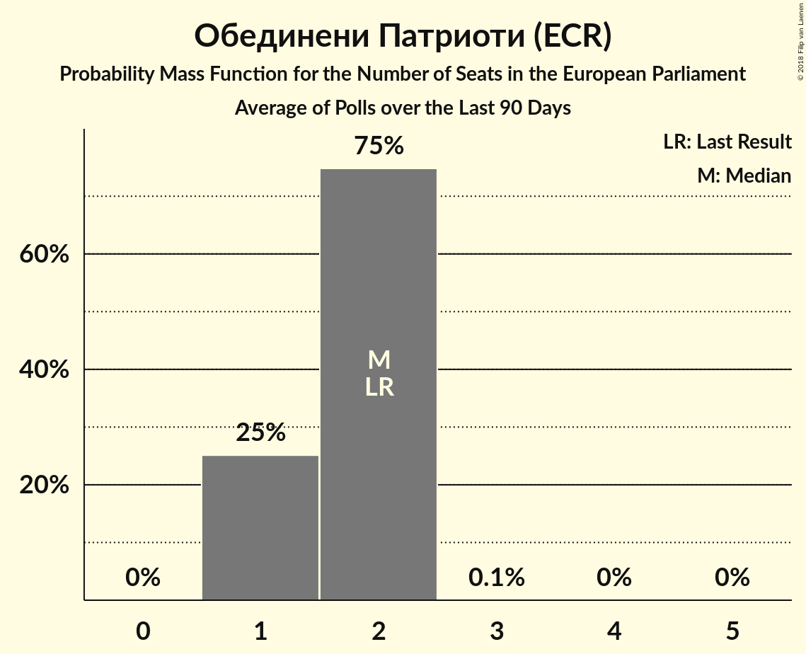

# Poll Average

<a href="#voting-intentions">Voting Intentions</a> | <a href="#seats">Seats</a> | <a href="#coalitions">Coalitions</a> | <a href="#technical-information">Technical Information</a>

## Summary

The table below lists the polls on which the average is based. They are the most recent polls (less than 90 days old) registered and analyzed so far.

| Period     | Polling firm/Commissioner(s) | ГЕРБ | БСП | ДПС | ОП | РБ | Воля | ДСБ | Да |
|:----------:|:----------------------------:|:--:|:--:|:--:|:--:|:--:|:--:|:--:|:--:|
| 25 May 2014 | General Election | 30.4%   6 | 18.9%   4 | 17.3%   4 | 10.7%   2 | 6.5%   1 | 0.0%   0 | 0.0%   0 | 0.0%   0 |
| N/A | Poll Average | 32–44%   6–8 | 27–34%   5–7 | 7–13%   1–3 | 7–11%   1–2 | 1–4%   0 | 2–4%   0 | 1–3%   0 | 1–4%   0 |
| [1–7 March 2018](2018-03-07-Тренд.html) | Тренд   24 часа | 31–39%   6–7 | 27–34%   5–7 | 9–14%   2–3 | 6–11%   1–2 | 2–4%   0 | 2–4%   0 | 1–3%   0 | 2–4%   0 |
| [7–13 December 2017](2017-12-13-Exacta.html) | Exacta | 38–45%   7–8 | 27–34%   5–6 | 7–11%   1–2 | 7–11%   1–2 | 1–3%   0 | 2–4%   0 | 1–3%   0 | 1–2%   0 |
| 25 May 2014 | General Election | 30.4%   6 | 18.9%   4 | 17.3%   4 | 10.7%   2 | 6.5%   1 | 0.0%   0 | 0.0%   0 | 0.0%   0 |

Only polls for which at least the sample size has been published are included in the table above.

**Legend:**
+ **Top half of each row:** Voting intentions (95% confidence interval)
+ **Bottom half of each row:** Seat projections for the European Parliament (95% confidence interval)
+ **ГЕРБ:** Граждани за европейско развитие на България (EPP)
+ **БСП:** Българска социалистическа партия (S&D)
+ **ДПС:** Движение за права и свободи (ALDE)
+ **ОП:** Обединени Патриоти (ECR)
+ **РБ:** Реформаторски блок (EPP)
+ **Воля:** Воля (*)
+ **ДСБ:** Демократи за силна България (EPP)
+ **Да:** Да, България! (*)
+ **N/A (single party):** Party not included the published results
+ **N/A (entire row):** Calculation for this opinion poll not started yet

## Voting Intentions

### Confidence Intervals

| Party | Last Result | Median | 80% Confidence Interval | 90% Confidence Interval | 95% Confidence Interval | 99% Confidence Interval |
|:-----:|:-----------:|:------:|:-----------------------:|:-----------------------:|:-----------------------:|:-----------------------:|
| <a href="#Граждани-за-европейско-развитие-на-България-(epp)">Граждани за европейско развитие на България (EPP)</a> | 30.4% | 38.2% | 33.4–42.9% |32.6–43.8% | 31.9–44.5% | 30.6–45.8% |
| <a href="#Българска-социалистическа-партия-(s&d)">Българска социалистическа партия (S&D)</a> | 18.9% | 30.6% | 28.3–33.0% |27.7–33.7% | 27.1–34.3% | 26.1–35.4% |
| <a href="#Движение-за-права-и-свободи-(alde)">Движение за права и свободи (ALDE)</a> | 17.3% | 9.7% | 7.6–12.1% |7.2–12.7% | 6.9–13.2% | 6.3–14.2% |
| <a href="#Обединени-Патриоти-(ecr)">Обединени Патриоти (ECR)</a> | 10.7% | 8.8% | 7.4–10.4% |7.0–10.8% | 6.7–11.2% | 6.1–12.0% |
| <a href="#Реформаторски-блок-(epp)">Реформаторски блок (EPP)</a> | 6.5% | 2.4% | 1.7–3.4% |1.5–3.7% | 1.3–4.0% | 1.1–4.6% |
| <a href="#Воля-(*)">Воля (*)</a> | 0.0% | 2.8% | 2.0–3.7% |1.8–4.0% | 1.7–4.2% | 1.4–4.7% |
| <a href="#Демократи-за-силна-България-(epp)">Демократи за силна България (EPP)</a> | 0.0% | 1.9% | 1.3–2.7% |1.1–2.9% | 1.0–3.2% | 0.8–3.6% |
| <a href="#Да,-България!-(*)">Да, България! (*)</a> | 0.0% | 1.8% | 0.8–3.2% |0.7–3.5% | 0.6–3.8% | 0.4–4.4% |

### Граждани за европейско развитие на България (EPP)

*For a full overview of the results for this party, see the [Граждани за европейско развитие на България (EPP)](party-ГражданизаевропейскоразвитиенаБългарияepp.html) page.*

| Voting Intentions | Probability | Accumulated | Special Marks |
|:-----------------:|:-----------:|:-----------:|:-------------:|
| 27.5–28.5% | 0% | 100% |  |
| 28.5–29.5% | 0.1% | 100% |  |
| 29.5–30.5% | 0.4% | 99.9% | Last Result |
| 30.5–31.5% | 1.3% | 99.5% |  |
| 31.5–32.5% | 3% | 98% |  |
| 32.5–33.5% | 6% | 95% |  |
| 33.5–34.5% | 9% | 89% |  |
| 34.5–35.5% | 10% | 80% |  |
| 35.5–36.5% | 9% | 70% |  |
| 36.5–37.5% | 7% | 61% |  |
| 37.5–38.5% | 5% | 54% | Median |
| 38.5–39.5% | 6% | 48% |  |
| 39.5–40.5% | 9% | 42% |  |
| 40.5–41.5% | 10% | 33% |  |
| 41.5–42.5% | 10% | 23% |  |
| 42.5–43.5% | 7% | 13% |  |
| 43.5–44.5% | 4% | 6% |  |
| 44.5–45.5% | 2% | 2% |  |
| 45.5–46.5% | 0.5% | 0.7% |  |
| 46.5–47.5% | 0.1% | 0.2% |  |
| 47.5–48.5% | 0% | 0% |  |

### Българска социалистическа партия (S&D)

*For a full overview of the results for this party, see the [Българска социалистическа партия (S&D)](party-Българскасоциалистическапартияsd.html) page.*

| Voting Intentions | Probability | Accumulated | Special Marks |
|:-----------------:|:-----------:|:-----------:|:-------------:|
| 18.5–19.5% | 0% | 100% | Last Result |
| 19.5–20.5% | 0% | 100% |  |
| 20.5–21.5% | 0% | 100% |  |
| 21.5–22.5% | 0% | 100% |  |
| 22.5–23.5% | 0% | 100% |  |
| 23.5–24.5% | 0% | 100% |  |
| 24.5–25.5% | 0.2% | 100% |  |
| 25.5–26.5% | 0.9% | 99.8% |  |
| 26.5–27.5% | 3% | 98.9% |  |
| 27.5–28.5% | 8% | 96% |  |
| 28.5–29.5% | 15% | 88% |  |
| 29.5–30.5% | 20% | 73% |  |
| 30.5–31.5% | 21% | 52% | Median |
| 31.5–32.5% | 16% | 31% |  |
| 32.5–33.5% | 9% | 15% |  |
| 33.5–34.5% | 4% | 6% |  |
| 34.5–35.5% | 1.3% | 2% |  |
| 35.5–36.5% | 0.4% | 0.4% |  |
| 36.5–37.5% | 0.1% | 0.1% |  |
| 37.5–38.5% | 0% | 0% |  |

### Движение за права и свободи (ALDE)

*For a full overview of the results for this party, see the [Движение за права и свободи (ALDE)](party-Движениезаправаисвободиalde.html) page.*

| Voting Intentions | Probability | Accumulated | Special Marks |
|:-----------------:|:-----------:|:-----------:|:-------------:|
| 4.5–5.5% | 0% | 100% |  |
| 5.5–6.5% | 1.1% | 100% |  |
| 6.5–7.5% | 7% | 98.8% |  |
| 7.5–8.5% | 18% | 91% |  |
| 8.5–9.5% | 21% | 74% |  |
| 9.5–10.5% | 19% | 53% | Median |
| 10.5–11.5% | 17% | 34% |  |
| 11.5–12.5% | 11% | 17% |  |
| 12.5–13.5% | 4% | 6% |  |
| 13.5–14.5% | 1.2% | 1.4% |  |
| 14.5–15.5% | 0.2% | 0.2% |  |
| 15.5–16.5% | 0% | 0% |  |
| 16.5–17.5% | 0% | 0% | Last Result |

### Обединени Патриоти (ECR)

*For a full overview of the results for this party, see the [Обединени Патриоти (ECR)](party-ОбединениПатриотиecr.html) page.*

| Voting Intentions | Probability | Accumulated | Special Marks |
|:-----------------:|:-----------:|:-----------:|:-------------:|
| 3.5–4.5% | 0% | 100% |  |
| 4.5–5.5% | 0.1% | 100% |  |
| 5.5–6.5% | 2% | 99.9% |  |
| 6.5–7.5% | 11% | 98% |  |
| 7.5–8.5% | 28% | 87% |  |
| 8.5–9.5% | 33% | 59% | Median |
| 9.5–10.5% | 19% | 27% |  |
| 10.5–11.5% | 6% | 8% | Last Result |
| 11.5–12.5% | 1.2% | 1.4% |  |
| 12.5–13.5% | 0.1% | 0.2% |  |
| 13.5–14.5% | 0% | 0% |  |

### Реформаторски блок (EPP)

*For a full overview of the results for this party, see the [Реформаторски блок (EPP)](party-Реформаторскиблокepp.html) page.*

| Voting Intentions | Probability | Accumulated | Special Marks |
|:-----------------:|:-----------:|:-----------:|:-------------:|
| 0.0–0.5% | 0% | 100% |  |
| 0.5–1.5% | 6% | 100% |  |
| 1.5–2.5% | 50% | 94% | Median |
| 2.5–3.5% | 37% | 44% |  |
| 3.5–4.5% | 7% | 7% |  |
| 4.5–5.5% | 0.5% | 0.5% |  |
| 5.5–6.5% | 0% | 0% | Last Result |

### Воля (*)

*For a full overview of the results for this party, see the [Воля (*)](party-Воля.html) page.*

| Voting Intentions | Probability | Accumulated | Special Marks |
|:-----------------:|:-----------:|:-----------:|:-------------:|
| 0.0–0.5% | 0% | 100% | Last Result |
| 0.5–1.5% | 1.3% | 100% |  |
| 1.5–2.5% | 36% | 98.7% |  |
| 2.5–3.5% | 50% | 63% | Median |
| 3.5–4.5% | 12% | 13% |  |
| 4.5–5.5% | 0.9% | 0.9% |  |
| 5.5–6.5% | 0% | 0% |  |

### Демократи за силна България (EPP)

*For a full overview of the results for this party, see the [Демократи за силна България (EPP)](party-ДемократизасилнаБългарияepp.html) page.*

| Voting Intentions | Probability | Accumulated | Special Marks |
|:-----------------:|:-----------:|:-----------:|:-------------:|
| 0.0–0.5% | 0% | 100% | Last Result |
| 0.5–1.5% | 26% | 100% |  |
| 1.5–2.5% | 60% | 74% | Median |
| 2.5–3.5% | 13% | 14% |  |
| 3.5–4.5% | 0.7% | 0.7% |  |
| 4.5–5.5% | 0% | 0% |  |

### Да, България! (*)

*For a full overview of the results for this party, see the [Да, България! (*)](party-ДаБългария.html) page.*

| Voting Intentions | Probability | Accumulated | Special Marks |
|:-----------------:|:-----------:|:-----------:|:-------------:|
| 0.0–0.5% | 2% | 100% | Last Result |
| 0.5–1.5% | 41% | 98% |  |
| 1.5–2.5% | 31% | 57% | Median |
| 2.5–3.5% | 22% | 26% |  |
| 3.5–4.5% | 4% | 4% |  |
| 4.5–5.5% | 0.3% | 0.3% |  |
| 5.5–6.5% | 0% | 0% |  |

## Seats

### Confidence Intervals

| Party | Last Result | Median | 80% Confidence Interval | 90% Confidence Interval | 95% Confidence Interval | 99% Confidence Interval |
|:-----:|:-----------:|:------:|:-----------------------:|:-----------------------:|:-----------------------:|:-----------------------:|
| <a href="#Граждани-за-европейско-развитие-на-България-(epp)">Граждани за европейско развитие на България (EPP)</a> | 6 | 7 | 6–8 |6–8 | 6–8 | 6–9 |
| <a href="#Българска-социалистическа-партия-(s&d)">Българска социалистическа партия (S&D)</a> | 4 | 6 | 5–6 |5–6 | 5–7 | 5–7 |
| <a href="#Движение-за-права-и-свободи-(alde)">Движение за права и свободи (ALDE)</a> | 4 | 2 | 1–2 |1–2 | 1–3 | 1–3 |
| <a href="#Обединени-Патриоти-(ecr)">Обединени Патриоти (ECR)</a> | 2 | 2 | 1–2 |1–2 | 1–2 | 1–2 |
| <a href="#Реформаторски-блок-(epp)">Реформаторски блок (EPP)</a> | 1 | 0 | 0 |0 | 0 | 0 |
| <a href="#Воля-(*)">Воля (*)</a> | 0 | 0 | 0 |0 | 0 | 0 |
| <a href="#Демократи-за-силна-България-(epp)">Демократи за силна България (EPP)</a> | 0 | 0 | 0 |0 | 0 | 0 |
| <a href="#Да,-България!-(*)">Да, България! (*)</a> | 0 | 0 | 0 |0 | 0 | 0 |

### Граждани за европейско развитие на България (EPP)

*For a full overview of the results for this party, see the [Граждани за европейско развитие на България (EPP)](party-ГражданизаевропейскоразвитиенаБългарияepp.html) page.*

| Number of Seats | Probability | Accumulated | Special Marks |
|:---------------:|:-----------:|:-----------:|:-------------:|
| 5 | 0.1% | 100% |  |
| 6 | 26% | 99.9% | Last Result |
| 7 | 34% | 74% | Median |
| 8 | 38% | 39% |  |
| 9 | 1.1% | 1.1% | Majority |
| 10 | 0% | 0% |  |

### Българска социалистическа партия (S&D)

*For a full overview of the results for this party, see the [Българска социалистическа партия (S&D)](party-Българскасоциалистическапартияsd.html) page.*

| Number of Seats | Probability | Accumulated | Special Marks |
|:---------------:|:-----------:|:-----------:|:-------------:|
| 4 | 0% | 100% | Last Result |
| 5 | 27% | 100% |  |
| 6 | 71% | 73% | Median |
| 7 | 3% | 3% |  |
| 8 | 0% | 0% |  |

### Движение за права и свободи (ALDE)

*For a full overview of the results for this party, see the [Движение за права и свободи (ALDE)](party-Движениезаправаисвободиalde.html) page.*

| Number of Seats | Probability | Accumulated | Special Marks |
|:---------------:|:-----------:|:-----------:|:-------------:|
| 1 | 16% | 100% |  |
| 2 | 81% | 84% | Median |
| 3 | 3% | 3% |  |
| 4 | 0% | 0% | Last Result |

### Обединени Патриоти (ECR)

*For a full overview of the results for this party, see the [Обединени Патриоти (ECR)](party-ОбединениПатриотиecr.html) page.*

| Number of Seats | Probability | Accumulated | Special Marks |
|:---------------:|:-----------:|:-----------:|:-------------:|
| 1 | 21% | 100% |  |
| 2 | 79% | 79% | Last Result, Median |
| 3 | 0.1% | 0.1% |  |
| 4 | 0% | 0% |  |

### Реформаторски блок (EPP)

*For a full overview of the results for this party, see the [Реформаторски блок (EPP)](party-Реформаторскиблокepp.html) page.*

| Number of Seats | Probability | Accumulated | Special Marks |
|:---------------:|:-----------:|:-----------:|:-------------:|
| 0 | 99.9% | 100% | Median |
| 1 | 0.1% | 0.1% | Last Result |
| 2 | 0% | 0% |  |

### Воля (*)

*For a full overview of the results for this party, see the [Воля (*)](party-Воля.html) page.*

| Number of Seats | Probability | Accumulated | Special Marks |
|:---------------:|:-----------:|:-----------:|:-------------:|
| 0 | 99.8% | 100% | Last Result, Median |
| 1 | 0.2% | 0.2% |  |
| 2 | 0% | 0% |  |

### Демократи за силна България (EPP)

*For a full overview of the results for this party, see the [Демократи за силна България (EPP)](party-ДемократизасилнаБългарияepp.html) page.*

| Number of Seats | Probability | Accumulated | Special Marks |
|:---------------:|:-----------:|:-----------:|:-------------:|
| 0 | 100% | 100% | Last Result, Median |

### Да, България! (*)

*For a full overview of the results for this party, see the [Да, България! (*)](party-ДаБългария.html) page.*

| Number of Seats | Probability | Accumulated | Special Marks |
|:---------------:|:-----------:|:-----------:|:-------------:|
| 0 | 100% | 100% | Last Result, Median |

## Coalitions

### Confidence Intervals

| Coalition | Last Result | Median | Majority? | 80% Confidence Interval | 90% Confidence Interval | 95% Confidence Interval | 99% Confidence Interval |
|:---------:|:-----------:|:------:|:---------:|:-----------------------:|:-----------------------:|:-----------------------:|:-----------------------:|
| Граждани за европейско развитие на България (EPP) – Реформаторски блок (EPP) – Демократи за силна България (EPP) | 7 | 7 | 1.1% | 6–8 | 6–8 | 6–8 | 6–9 |
| Българска социалистическа партия (S&D) | 4 | 6 | 0% | 5–6 | 5–6 | 5–7 | 5–7 |
| Движение за права и свободи (ALDE) | 4 | 2 | 0% | 1–2 | 1–2 | 1–3 | 1–3 |
| Обединени Патриоти (ECR) | 2 | 2 | 0% | 1–2 | 1–2 | 1–2 | 1–2 |
| Воля (*) – Да, България! (*) | 0 | 0 | 0% | 0 | 0 | 0 | 0 |

### Граждани за европейско развитие на България (EPP) – Реформаторски блок (EPP) – Демократи за силна България (EPP)

| Number of Seats | Probability | Accumulated | Special Marks |
|:---------------:|:-----------:|:-----------:|:-------------:|
| 5 | 0.1% | 100% |  |
| 6 | 26% | 99.9% |  |
| 7 | 34% | 74% | Last Result, Median |
| 8 | 38% | 39% |  |
| 9 | 1.1% | 1.1% | Majority |
| 10 | 0% | 0% |  |

### Българска социалистическа партия (S&D)

| Number of Seats | Probability | Accumulated | Special Marks |
|:---------------:|:-----------:|:-----------:|:-------------:|
| 4 | 0% | 100% | Last Result |
| 5 | 27% | 100% |  |
| 6 | 71% | 73% | Median |
| 7 | 3% | 3% |  |
| 8 | 0% | 0% |  |

### Движение за права и свободи (ALDE)

| Number of Seats | Probability | Accumulated | Special Marks |
|:---------------:|:-----------:|:-----------:|:-------------:|
| 1 | 16% | 100% |  |
| 2 | 81% | 84% | Median |
| 3 | 3% | 3% |  |
| 4 | 0% | 0% | Last Result |

### Обединени Патриоти (ECR)

| Number of Seats | Probability | Accumulated | Special Marks |
|:---------------:|:-----------:|:-----------:|:-------------:|
| 1 | 21% | 100% |  |
| 2 | 79% | 79% | Last Result, Median |
| 3 | 0.1% | 0.1% |  |
| 4 | 0% | 0% |  |

### Воля (*) – Да, България! (*)

| Number of Seats | Probability | Accumulated | Special Marks |
|:---------------:|:-----------:|:-----------:|:-------------:|
| 0 | 99.7% | 100% | Last Result, Median |
| 1 | 0.3% | 0.3% |  |
| 2 | 0% | 0% |  |

## Technical Information

