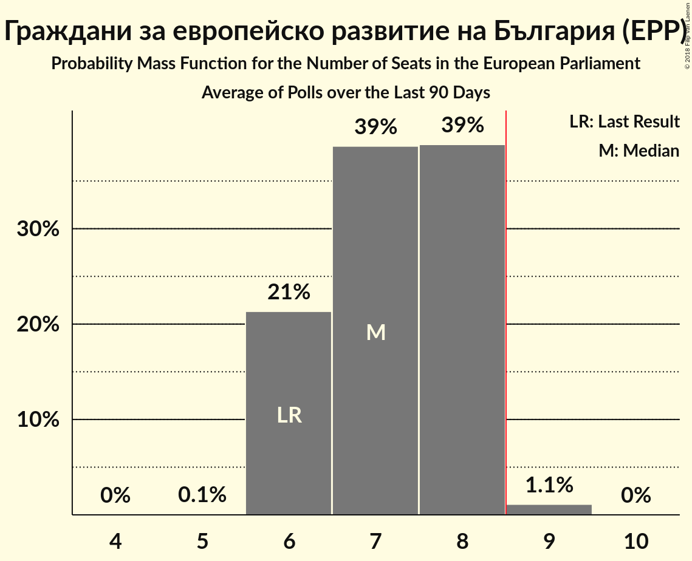

# Граждани за европейско развитие на България (EPP)

<a href="#voting-intentions">Voting Intentions</a> | <a href="#seats">Seats</a>

## Voting Intentions

Last result: **30.4%** (General Election of 25 May 2014)

### Confidence Intervals

| Period     | Polling firm/Commissioner(s) | Median | 80% Confidence Interval | 90% Confidence Interval | 95% Confidence Interval | 99% Confidence Interval |
|:----------:|:----------------:|:-----------:|:-----------------------:|:-----------------------:|:-----------------------:|:-----------------------:|
| N/A | [Poll Average](average.html) | 38.2% | 33.4–42.9% | 32.6–43.8% | 31.9–44.5% | 30.6–45.8% |
| [1–7 March 2018](2018-03-07-Тренд.html) | Тренд   24 часа | 35.0% | 32.6–37.5% | 31.9–38.2% | 31.3–38.9% | 30.1–40.1% |
| [10–18 January 2018](2018-01-18-Тренд.html) | Тренд   24 часа | 35.7% | 33.3–38.3% | 32.6–39.0% | 32.0–39.6% | 30.9–40.9% |
| [7–13 December 2017](2017-12-13-Exacta.html) | Exacta | 41.3% | 38.9–43.8% | 38.3–44.5% | 37.7–45.1% | 36.5–46.3% |

### Probability Mass Function

The following table shows the probability mass function per percentage block of voting intentions for the [poll average](average.html) for Граждани за европейско развитие на България (EPP).

| Voting Intentions | Probability | Accumulated | Special Marks |
|:-----------------:|:-----------:|:-----------:|:-------------:|
| 27.5–28.5% | 0% | 100% |  |
| 28.5–29.5% | 0.1% | 100% |  |
| 29.5–30.5% | 0.4% | 99.9% | Last Result |
| 30.5–31.5% | 1.3% | 99.5% |  |
| 31.5–32.5% | 3% | 98% |  |
| 32.5–33.5% | 6% | 95% |  |
| 33.5–34.5% | 9% | 89% |  |
| 34.5–35.5% | 10% | 80% |  |
| 35.5–36.5% | 9% | 70% |  |
| 36.5–37.5% | 7% | 61% |  |
| 37.5–38.5% | 5% | 54% | Median |
| 38.5–39.5% | 6% | 48% |  |
| 39.5–40.5% | 9% | 42% |  |
| 40.5–41.5% | 10% | 33% |  |
| 41.5–42.5% | 10% | 23% |  |
| 42.5–43.5% | 7% | 13% |  |
| 43.5–44.5% | 4% | 6% |  |
| 44.5–45.5% | 2% | 2% |  |
| 45.5–46.5% | 0.5% | 0.7% |  |
| 46.5–47.5% | 0.1% | 0.2% |  |
| 47.5–48.5% | 0% | 0% |  |

## Seats

Last result: **6** seats (General Election of 25 May 2014)

### Confidence Intervals

| Period     | Polling firm/Commissioner(s) | Median | 80% Confidence Interval | 90% Confidence Interval | 95% Confidence Interval | 99% Confidence Interval |
|:----------:|:----------------:|:------:|:-----------------------:|:-----------------------:|:-----------------------:|:-----------------------:|
| N/A | [Poll Average](average.html) | 7 | 6–8 | 6–8 | 6–8 | 6–9 |
| [1–7 March 2018](2018-03-07-Тренд.html) | Тренд   24 часа | 7 | 6–7 | 6–7 | 6–7 | 6–8 |
| [10–18 January 2018](2018-01-18-Тренд.html) | Тренд   24 часа | 7 | 6–7 | 6–7 | 6–8 | 6–8 |
| [7–13 December 2017](2017-12-13-Exacta.html) | Exacta | 8 | 7–8 | 7–8 | 7–8 | 7–9 |

### Probability Mass Function

The following table shows the probability mass function per seat for the [poll average](average.html) for Граждани за европейско развитие на България (EPP).

| Number of Seats | Probability | Accumulated | Special Marks |
|:---------------:|:-----------:|:-----------:|:-------------:|
| 5 | 0.1% | 100% |  |
| 6 | 21% | 99.9% | Last Result |
| 7 | 39% | 79% | Median |
| 8 | 39% | 40% |  |
| 9 | 1.1% | 1.1% | Majority |
| 10 | 0% | 0% |  |

