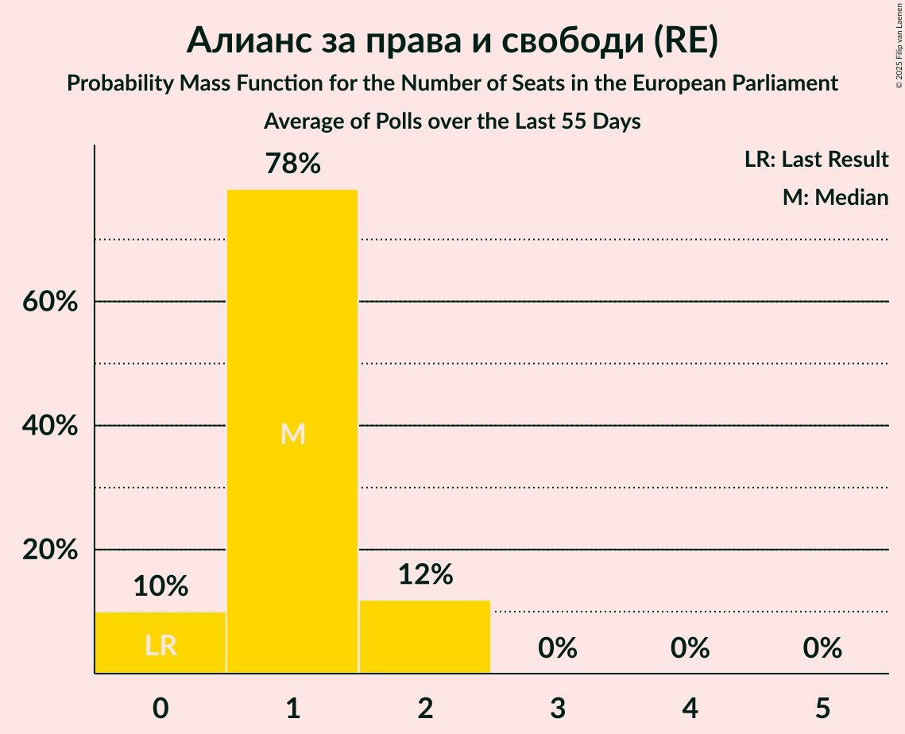

# Алианс за права и свободи (RE)

<a href="#voting-intentions">Voting Intentions</a> | <a href="#seats">Seats</a>

## Voting Intentions

Last result: **0.0%** (General Election of 9 June 2024)

### Confidence Intervals

| Period     | Polling firm/Commissioner(s) | Median | 80% Confidence Interval | 90% Confidence Interval | 95% Confidence Interval | 99% Confidence Interval |
|:----------:|:----------------:|:-----------:|:-----------------------:|:-----------------------:|:-----------------------:|:-----------------------:|
| N/A | [Poll Average](average.html) | 1.8% | 1.2–2.5% | 1.1–2.7% | 1.0–2.9% | 0.8–3.4% |
| [3–7 December 2025](2025-12-07-МаркетЛИНКС.html) | Маркет ЛИНКС   bTV | 1.7% | 1.2–2.5% | 1.1–2.7% | 1.0–2.9% | 0.8–3.4% |
| [29 September–12 October 2025](2025-10-12-GallupInternational.html) | Gallup International | 1.2% | N/A | N/A | N/A | N/A |
| [13–20 September 2025](2025-09-20-Тренд.html) | Тренд   24 часа | 2.5% | N/A | N/A | N/A | N/A |
| [4–12 September 2025](2025-09-12-Мяра.html) | Мяра | 2.6% | N/A | N/A | N/A | N/A |
| [11–23 July 2025](2025-07-23-GallupInternational.html) | Gallup International | 1.4% | N/A | N/A | N/A | N/A |
| [7–14 July 2025](2025-07-14-Алфарисърч.html) | Алфа рисърч | 3.0% | N/A | N/A | N/A | N/A |
| [9–11 June 2025](2025-06-11-SovaHarris.html) | Sova Harris | 5.9% | N/A | N/A | N/A | N/A |
| [28 May–4 June 2025](2025-06-04-GallupInternational.html) | Gallup International | 4.0% | N/A | N/A | N/A | N/A |
| [12–18 May 2025](2025-05-18-Тренд.html) | Тренд   24 часа | 5.8% | N/A | N/A | N/A | N/A |
| [18–30 April 2025](2025-04-30-МаркетЛИНКС.html) | Маркет ЛИНКС   bTV | 6.2% | N/A | N/A | N/A | N/A |
| [3–13 April 2025](2025-04-13-Мяра.html) | Мяра | 7.1% | N/A | N/A | N/A | N/A |
| [22–30 March 2025](2025-03-30-МаркетЛИНКС.html) | Маркет ЛИНКС   bTV | 7.4% | N/A | N/A | N/A | N/A |
| [19–30 March 2025](2025-03-30-GallupInternational.html) | Gallup International | 5.2% | N/A | N/A | N/A | N/A |
| [10–16 March 2025](2025-03-16-Тренд.html) | Тренд   24 часа | 6.7% | N/A | N/A | N/A | N/A |
| [22 February–2 March 2025](2025-03-02-МаркетЛИНКС.html) | Маркет ЛИНКС   bTV | 7.5% | N/A | N/A | N/A | N/A |
| [13–20 February 2025](2025-02-20-GallupInternational.html) | Gallup International | 6.2% | N/A | N/A | N/A | N/A |
| [6–16 February 2025](2025-02-16-Мяра.html) | Мяра | 6.9% | N/A | N/A | N/A | N/A |
| [25 January–3 February 2025](2025-02-03-МаркетЛИНКС.html) | Маркет ЛИНКС   bTV | 8.4% | N/A | N/A | N/A | N/A |
| [24–30 January 2025](2025-01-30-Тренд.html) | Тренд   24 часа | 7.1% | N/A | N/A | N/A | N/A |
| [15–20 January 2025](2025-01-20-Алфарисърч.html) | Алфа рисърч | 8.0% | N/A | N/A | N/A | N/A |
| [8–12 January 2025](2025-01-12-GallupInternational.html) | Gallup International | 6.8% | N/A | N/A | N/A | N/A |
| [12–20 December 2024](2024-12-20-МаркетЛИНКС.html) | Маркет ЛИНКС   bTV | 6.7% | N/A | N/A | N/A | N/A |
| [20–23 October 2024](2024-10-23-Алфарисърч.html) | Алфа рисърч | 7.9% | N/A | N/A | N/A | N/A |
| [16–22 October 2024](2024-10-22-Тренд.html) | Тренд   24 часа | 7.8% | N/A | N/A | N/A | N/A |
| [19–22 October 2024](2024-10-22-Exacta.html) | Exacta | 8.1% | N/A | N/A | N/A | N/A |
| [10–21 October 2024](2024-10-21-GallupInternational.html) | Gallup International   BNR | 7.8% | N/A | N/A | N/A | N/A |
| [15–20 October 2024](2024-10-20-МаркетЛИНКС.html) | Маркет ЛИНКС   bTV | 9.3% | N/A | N/A | N/A | N/A |
| [11–17 October 2024](2024-10-17-SovaHarris.html) | Sova Harris   ПИК | 8.8% | N/A | N/A | N/A | N/A |
| [8–13 October 2024](2024-10-13-Медиана.html) | Медиана | 9.8% | N/A | N/A | N/A | N/A |
| [28 September–6 October 2024](2024-10-06-GallupInternational.html) | Gallup International | 8.3% | N/A | N/A | N/A | N/A |
| [25 September–1 October 2024](2024-10-01-МаркетЛИНКС.html) | Маркет ЛИНКС   bTV | 9.9% | N/A | N/A | N/A | N/A |
| [17–24 September 2024](2024-09-24-Тренд.html) | Тренд   24 часа | 8.5% | N/A | N/A | N/A | N/A |
| [18–24 September 2024](2024-09-24-Алфарисърч.html) | Алфа рисърч | 8.6% | N/A | N/A | N/A | N/A |
| [14–23 August 2024](2024-08-23-МаркетЛИНКС.html) | Маркет ЛИНКС   bTV | 0.0% | N/A | N/A | N/A | N/A |
| [1–9 August 2024](2024-08-09-GallupInternational.html) | Gallup International   БНТ | 0.0% | N/A | N/A | N/A | N/A |
| [20–28 July 2024](2024-07-28-МаркетЛИНКС.html) | Маркет ЛИНКС | 0.0% | N/A | N/A | N/A | N/A |

### Probability Mass Function

The following table shows the probability mass function per percentage block of voting intentions for the [poll average](average.html) for Алианс за права и свободи (RE).

| Voting Intentions | Probability | Accumulated | Special Marks |
|:-----------------:|:-----------:|:-----------:|:-------------:|
| 0.0–0.5% | 0% | 100% | Last Result |
| 0.5–1.5% | 32% | 100% |  |
| 1.5–2.5% | 60% | 68% | Median |
| 2.5–3.5% | 8% | 8% |  |
| 3.5–4.5% | 0.2% | 0.2% |  |
| 4.5–5.5% | 0% | 0% |  |

## Seats

Last result: **0** seats (General Election of 9 June 2024)

### Confidence Intervals

| Period     | Polling firm/Commissioner(s) | Median | 80% Confidence Interval | 90% Confidence Interval | 95% Confidence Interval | 99% Confidence Interval |
|:----------:|:----------------:|:------:|:-----------------------:|:-----------------------:|:-----------------------:|:-----------------------:|
| N/A | [Poll Average](average.html) | 0 | 0 | 0 | 0 | 0 |
| [3–7 December 2025](2025-12-07-МаркетЛИНКС.html) | Маркет ЛИНКС   bTV | 0 | 0 | 0 | 0 | 0 |
| [29 September–12 October 2025](2025-10-12-GallupInternational.html) | Gallup International |  |  |  |  |  |
| [13–20 September 2025](2025-09-20-Тренд.html) | Тренд   24 часа |  |  |  |  |  |
| [4–12 September 2025](2025-09-12-Мяра.html) | Мяра |  |  |  |  |  |
| [11–23 July 2025](2025-07-23-GallupInternational.html) | Gallup International |  |  |  |  |  |
| [7–14 July 2025](2025-07-14-Алфарисърч.html) | Алфа рисърч |  |  |  |  |  |
| [9–11 June 2025](2025-06-11-SovaHarris.html) | Sova Harris |  |  |  |  |  |
| [28 May–4 June 2025](2025-06-04-GallupInternational.html) | Gallup International |  |  |  |  |  |
| [12–18 May 2025](2025-05-18-Тренд.html) | Тренд   24 часа |  |  |  |  |  |
| [18–30 April 2025](2025-04-30-МаркетЛИНКС.html) | Маркет ЛИНКС   bTV |  |  |  |  |  |
| [3–13 April 2025](2025-04-13-Мяра.html) | Мяра |  |  |  |  |  |
| [22–30 March 2025](2025-03-30-МаркетЛИНКС.html) | Маркет ЛИНКС   bTV |  |  |  |  |  |
| [19–30 March 2025](2025-03-30-GallupInternational.html) | Gallup International |  |  |  |  |  |
| [10–16 March 2025](2025-03-16-Тренд.html) | Тренд   24 часа |  |  |  |  |  |
| [22 February–2 March 2025](2025-03-02-МаркетЛИНКС.html) | Маркет ЛИНКС   bTV |  |  |  |  |  |
| [13–20 February 2025](2025-02-20-GallupInternational.html) | Gallup International |  |  |  |  |  |
| [6–16 February 2025](2025-02-16-Мяра.html) | Мяра |  |  |  |  |  |
| [25 January–3 February 2025](2025-02-03-МаркетЛИНКС.html) | Маркет ЛИНКС   bTV |  |  |  |  |  |
| [24–30 January 2025](2025-01-30-Тренд.html) | Тренд   24 часа |  |  |  |  |  |
| [15–20 January 2025](2025-01-20-Алфарисърч.html) | Алфа рисърч |  |  |  |  |  |
| [8–12 January 2025](2025-01-12-GallupInternational.html) | Gallup International |  |  |  |  |  |
| [12–20 December 2024](2024-12-20-МаркетЛИНКС.html) | Маркет ЛИНКС   bTV |  |  |  |  |  |
| [20–23 October 2024](2024-10-23-Алфарисърч.html) | Алфа рисърч |  |  |  |  |  |
| [16–22 October 2024](2024-10-22-Тренд.html) | Тренд   24 часа |  |  |  |  |  |
| [19–22 October 2024](2024-10-22-Exacta.html) | Exacta |  |  |  |  |  |
| [10–21 October 2024](2024-10-21-GallupInternational.html) | Gallup International   BNR |  |  |  |  |  |
| [15–20 October 2024](2024-10-20-МаркетЛИНКС.html) | Маркет ЛИНКС   bTV |  |  |  |  |  |
| [11–17 October 2024](2024-10-17-SovaHarris.html) | Sova Harris   ПИК |  |  |  |  |  |
| [8–13 October 2024](2024-10-13-Медиана.html) | Медиана |  |  |  |  |  |
| [28 September–6 October 2024](2024-10-06-GallupInternational.html) | Gallup International |  |  |  |  |  |
| [25 September–1 October 2024](2024-10-01-МаркетЛИНКС.html) | Маркет ЛИНКС   bTV |  |  |  |  |  |
| [17–24 September 2024](2024-09-24-Тренд.html) | Тренд   24 часа |  |  |  |  |  |
| [18–24 September 2024](2024-09-24-Алфарисърч.html) | Алфа рисърч |  |  |  |  |  |
| [14–23 August 2024](2024-08-23-МаркетЛИНКС.html) | Маркет ЛИНКС   bTV |  |  |  |  |  |
| [1–9 August 2024](2024-08-09-GallupInternational.html) | Gallup International   БНТ |  |  |  |  |  |
| [20–28 July 2024](2024-07-28-МаркетЛИНКС.html) | Маркет ЛИНКС |  |  |  |  |  |

### Probability Mass Function

The following table shows the probability mass function per seat for the [poll average](average.html) for Алианс за права и свободи (RE).

| Number of Seats | Probability | Accumulated | Special Marks |
|:---------------:|:-----------:|:-----------:|:-------------:|
| 0 | 100% | 100% | Last Result, Median |

