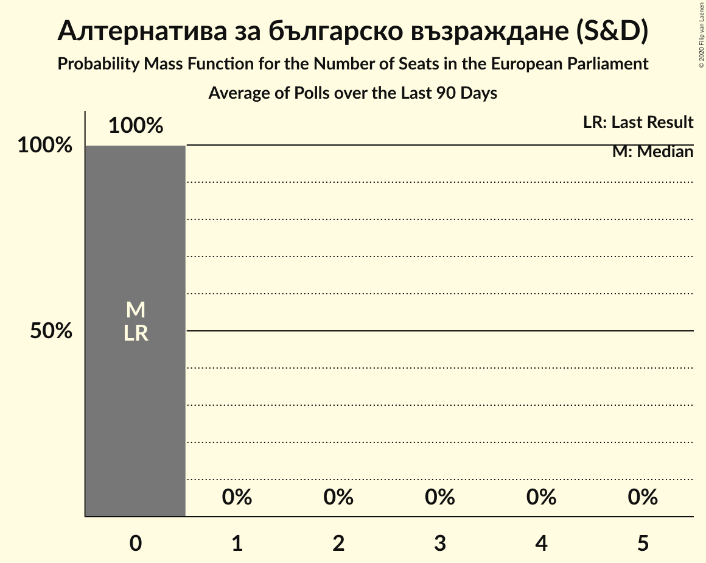

# Алтернатива за българско възраждане (S&D)

<a href="#voting-intentions">Voting Intentions</a> | <a href="#seats">Seats</a>

## Voting Intentions

Last result: **0.0%** (General Election of 26 May 2019)

### Confidence Intervals

| Period     | Polling firm/Commissioner(s) | Median | 80% Confidence Interval | 90% Confidence Interval | 95% Confidence Interval | 99% Confidence Interval |
|:----------:|:----------------:|:-----------:|:-----------------------:|:-----------------------:|:-----------------------:|:-----------------------:|
| N/A | [Poll Average](average.html) | 0.6% | 0.3–0.9% | 0.3–1.0% | 0.2–1.2% | 0.2–1.4% |
| [23–31 January 2021](2021-01-31-МаркетЛИНКС.html) | Маркет ЛИНКС | 0.0% | N/A | N/A | N/A | N/A |
| [12–19 January 2021](2021-01-19-Тренд.html) | Тренд   24 часа | 0.5% | 0.3–0.9% | 0.3–1.1% | 0.2–1.2% | 0.2–1.4% |
| [7–15 January 2021](2021-01-15-GallupInternational.html) | Gallup International | 0.0% | N/A | N/A | N/A | N/A |
| [15–21 December 2020](2020-12-21-Алфарисърч.html) | Алфа рисърч | 0.0% | N/A | N/A | N/A | N/A |
| [12–17 December 2020](2020-12-17-Медиана.html) | Медиана | 0.0% | N/A | N/A | N/A | N/A |
| [12–17 December 2020](2020-12-17-Mediana.html) | Mediana | 0.0% | N/A | N/A | N/A | N/A |
| [5–12 December 2020](2020-12-12-Exacta.html) | Exacta | 0.0% | N/A | N/A | N/A | N/A |
| [24–29 November 2020](2020-11-29-БарометърБългария.html) | Барометър България | 0.0% | N/A | N/A | N/A | N/A |
| [6–11 November 2020](2020-11-11-БарометърБългария.html) | Барометър България | 0.0% | N/A | N/A | N/A | N/A |
| [27 October–3 November 2020](2020-11-03-SovaHarris.html) | Sova Harris | 0.0% | N/A | N/A | N/A | N/A |
| [21–27 October 2020](2020-10-27-Рего.html) | Рего | 0.0% | N/A | N/A | N/A | N/A |
| [10–16 October 2020](2020-10-16-БарометърБългария.html) | Барометър България | 0.0% | N/A | N/A | N/A | N/A |
| [3–10 October 2020](2020-10-10-Тренд.html) | Тренд | 0.0% | N/A | N/A | N/A | N/A |
| [1–9 October 2020](2020-10-09-GallupInternational.html) | Gallup International | 0.0% | N/A | N/A | N/A | N/A |
| [21–30 September 2020](2020-09-30-Алфарисърч.html) | Алфа рисърч | 0.0% | N/A | N/A | N/A | N/A |
| [18–26 September 2020](2020-09-26-МаркетЛИНКС.html) | Маркет ЛИНКС | 0.0% | N/A | N/A | N/A | N/A |
| [3–11 September 2020](2020-09-11-GallupInternational.html) | Gallup International | 0.0% | N/A | N/A | N/A | N/A |
| [29 August–5 September 2020](2020-09-05-Тренд.html) | Тренд   24 часа | 0.2% | 0.1–0.5% | 0.1–0.6% | 0.1–0.7% | 0.0–0.9% |
| [19–25 August 2020](2020-08-25-SovaHarris.html) | Sova Harris | 1.1% | 0.7–1.8% | 0.6–2.0% | 0.5–2.2% | 0.4–2.7% |
| [3–11 August 2020](2020-08-11-БарометърБългария.html) | Барометър България | 0.0% | N/A | N/A | N/A | N/A |
| [3–10 August 2020](2020-08-10-Тренд.html) | Тренд   24 часа | 0.2% | 0.1–0.5% | 0.1–0.6% | 0.1–0.7% | 0.0–0.9% |
| [30 July–7 August 2020](2020-08-07-GallupInternational.html) | Gallup International | 0.0% | N/A | N/A | N/A | N/A |
| [1–5 August 2020](2020-08-05-ПИК.html) | ПИК | 0.0% | N/A | N/A | N/A | N/A |
| [28 July–3 August 2020](2020-08-03-МаркетЛИНКС.html) | Маркет ЛИНКС | 0.0% | N/A | N/A | N/A | N/A |
| [23–30 July 2020](2020-07-30-Алфарисърч.html) | Алфа рисърч   Дневник | 0.0% | N/A | N/A | N/A | N/A |
| [26 June–1 July 2020](2020-07-01-SovaHarris.html) | Sova Harris | 1.8% | 1.2–2.7% | 1.1–3.0% | 1.0–3.2% | 0.7–3.7% |
| [20–25 June 2020](2020-06-25-БарометърБългария.html) | Барометър България | 0.0% | N/A | N/A | N/A | N/A |
| [27 May–3 June 2020](2020-06-03-МаркетЛИНКС.html) | Маркет ЛИНКС | 0.0% | N/A | N/A | N/A | N/A |
| [28 April–5 May 2020](2020-05-05-Алфарисърч.html) | Алфа рисърч   Дневник | 0.0% | N/A | N/A | N/A | N/A |
| [21–28 February 2020](2020-02-28-Медиана.html) | Медиана | 0.0% | N/A | N/A | N/A | N/A |
| [21–28 February 2020](2020-02-28-Mediana.html) | Mediana | 0.0% | N/A | N/A | N/A | N/A |
| [3–10 February 2020](2020-02-10-Тренд.html) | Тренд   24 часа | 0.0% | N/A | N/A | N/A | N/A |
| [9–13 January 2020](2020-01-13-БарометърБългария.html) | Барометър България | 0.0% | N/A | N/A | N/A | N/A |
| [5–12 December 2019](2019-12-12-Алфарисърч.html) | Алфа рисърч   Дневник | 0.0% | N/A | N/A | N/A | N/A |
| [21–28 November 2019](2019-11-28-МаркетЛИНКС.html) | Маркет ЛИНКС | 0.0% | N/A | N/A | N/A | N/A |
| [7–15 November 2019](2019-11-15-Тренд.html) | Тренд   24 часа | 0.0% | N/A | N/A | N/A | N/A |
| [10–16 September 2019](2019-09-16-Алфарисърч.html) | Алфа рисърч   Дневник | 0.0% | N/A | N/A | N/A | N/A |
| [5–12 July 2019](2019-07-12-Тренд.html) | Тренд   24 часа | 0.0% | N/A | N/A | N/A | N/A |
| [11–19 June 2019](2019-06-19-МаркетЛИНКС.html) | Маркет ЛИНКС | 0.0% | N/A | N/A | N/A | N/A |
| [5–12 June 2019](2019-06-12-Тренд.html) | Тренд | 0.0% | N/A | N/A | N/A | N/A |

### Probability Mass Function

The following table shows the probability mass function per percentage block of voting intentions for the [poll average](average.html) for Алтернатива за българско възраждане (S&D).

| Voting Intentions | Probability | Accumulated | Special Marks |
|:-----------------:|:-----------:|:-----------:|:-------------:|
| 0.0–0.5% | 48% | 100% | Last Result |
| 0.5–1.5% | 52% | 52% | Median |
| 1.5–2.5% | 0.2% | 0.2% |  |
| 2.5–3.5% | 0% | 0% |  |

## Seats

Last result: **0** seats (General Election of 26 May 2019)

### Confidence Intervals

| Period     | Polling firm/Commissioner(s) | Median | 80% Confidence Interval | 90% Confidence Interval | 95% Confidence Interval | 99% Confidence Interval |
|:----------:|:----------------:|:------:|:-----------------------:|:-----------------------:|:-----------------------:|:-----------------------:|
| N/A | [Poll Average](average.html) | 0 | 0 | 0 | 0 | 0 |
| [23–31 January 2021](2021-01-31-МаркетЛИНКС.html) | Маркет ЛИНКС |  |  |  |  |  |
| [12–19 January 2021](2021-01-19-Тренд.html) | Тренд   24 часа | 0 | 0 | 0 | 0 | 0 |
| [7–15 January 2021](2021-01-15-GallupInternational.html) | Gallup International |  |  |  |  |  |
| [15–21 December 2020](2020-12-21-Алфарисърч.html) | Алфа рисърч |  |  |  |  |  |
| [12–17 December 2020](2020-12-17-Медиана.html) | Медиана |  |  |  |  |  |
| [12–17 December 2020](2020-12-17-Mediana.html) | Mediana |  |  |  |  |  |
| [5–12 December 2020](2020-12-12-Exacta.html) | Exacta |  |  |  |  |  |
| [24–29 November 2020](2020-11-29-БарометърБългария.html) | Барометър България |  |  |  |  |  |
| [6–11 November 2020](2020-11-11-БарометърБългария.html) | Барометър България |  |  |  |  |  |
| [27 October–3 November 2020](2020-11-03-SovaHarris.html) | Sova Harris |  |  |  |  |  |
| [21–27 October 2020](2020-10-27-Рего.html) | Рего |  |  |  |  |  |
| [10–16 October 2020](2020-10-16-БарометърБългария.html) | Барометър България |  |  |  |  |  |
| [3–10 October 2020](2020-10-10-Тренд.html) | Тренд |  |  |  |  |  |
| [1–9 October 2020](2020-10-09-GallupInternational.html) | Gallup International |  |  |  |  |  |
| [21–30 September 2020](2020-09-30-Алфарисърч.html) | Алфа рисърч |  |  |  |  |  |
| [18–26 September 2020](2020-09-26-МаркетЛИНКС.html) | Маркет ЛИНКС |  |  |  |  |  |
| [3–11 September 2020](2020-09-11-GallupInternational.html) | Gallup International |  |  |  |  |  |
| [29 August–5 September 2020](2020-09-05-Тренд.html) | Тренд   24 часа | 0 | 0 | 0 | 0 | 0 |
| [19–25 August 2020](2020-08-25-SovaHarris.html) | Sova Harris | 0 | 0 | 0 | 0 | 0 |
| [3–11 August 2020](2020-08-11-БарометърБългария.html) | Барометър България |  |  |  |  |  |
| [3–10 August 2020](2020-08-10-Тренд.html) | Тренд   24 часа | 0 | 0 | 0 | 0 | 0 |
| [30 July–7 August 2020](2020-08-07-GallupInternational.html) | Gallup International |  |  |  |  |  |
| [1–5 August 2020](2020-08-05-ПИК.html) | ПИК |  |  |  |  |  |
| [28 July–3 August 2020](2020-08-03-МаркетЛИНКС.html) | Маркет ЛИНКС |  |  |  |  |  |
| [23–30 July 2020](2020-07-30-Алфарисърч.html) | Алфа рисърч   Дневник |  |  |  |  |  |
| [26 June–1 July 2020](2020-07-01-SovaHarris.html) | Sova Harris | 0 | 0 | 0 | 0 | 0 |
| [20–25 June 2020](2020-06-25-БарометърБългария.html) | Барометър България |  |  |  |  |  |
| [27 May–3 June 2020](2020-06-03-МаркетЛИНКС.html) | Маркет ЛИНКС |  |  |  |  |  |
| [28 April–5 May 2020](2020-05-05-Алфарисърч.html) | Алфа рисърч   Дневник |  |  |  |  |  |
| [21–28 February 2020](2020-02-28-Медиана.html) | Медиана |  |  |  |  |  |
| [21–28 February 2020](2020-02-28-Mediana.html) | Mediana |  |  |  |  |  |
| [3–10 February 2020](2020-02-10-Тренд.html) | Тренд   24 часа |  |  |  |  |  |
| [9–13 January 2020](2020-01-13-БарометърБългария.html) | Барометър България |  |  |  |  |  |
| [5–12 December 2019](2019-12-12-Алфарисърч.html) | Алфа рисърч   Дневник |  |  |  |  |  |
| [21–28 November 2019](2019-11-28-МаркетЛИНКС.html) | Маркет ЛИНКС |  |  |  |  |  |
| [7–15 November 2019](2019-11-15-Тренд.html) | Тренд   24 часа |  |  |  |  |  |
| [10–16 September 2019](2019-09-16-Алфарисърч.html) | Алфа рисърч   Дневник |  |  |  |  |  |
| [5–12 July 2019](2019-07-12-Тренд.html) | Тренд   24 часа |  |  |  |  |  |
| [11–19 June 2019](2019-06-19-МаркетЛИНКС.html) | Маркет ЛИНКС |  |  |  |  |  |
| [5–12 June 2019](2019-06-12-Тренд.html) | Тренд |  |  |  |  |  |

### Probability Mass Function

The following table shows the probability mass function per seat for the [poll average](average.html) for Алтернатива за българско възраждане (S&D).

| Number of Seats | Probability | Accumulated | Special Marks |
|:---------------:|:-----------:|:-----------:|:-------------:|
| 0 | 100% | 100% | Last Result, Median |

