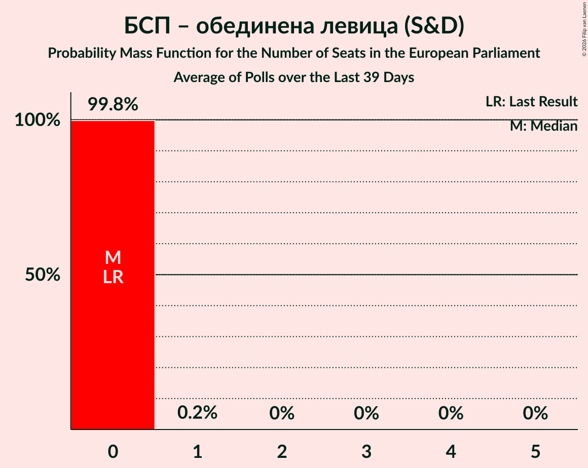

# БСП – обединена левица (S&D)

<a href="#voting-intentions">Voting Intentions</a> | <a href="#seats">Seats</a>

## Voting Intentions

Last result: **0.0%** (General Election of 9 June 2024)

### Confidence Intervals

| Period     | Polling firm/Commissioner(s) | Median | 80% Confidence Interval | 90% Confidence Interval | 95% Confidence Interval | 99% Confidence Interval |
|:----------:|:----------------:|:-----------:|:-----------------------:|:-----------------------:|:-----------------------:|:-----------------------:|
| N/A | [Poll Average](average.html) | 7.1% | 5.8–10.1% | 5.5–10.7% | 5.2–11.2% | 4.8–12.1% |
| [8–13 October 2024](2024-10-13-Медиана.html) | Медиана | 10.0% | 8.9–11.4% | 8.6–11.7% | 8.3–12.1% | 7.8–12.7% |
| [28 September–6 October 2024](2024-10-06-GallupInternational.html) | Gallup International | 7.1% | 6.0–8.4% | 5.7–8.7% | 5.5–9.1% | 5.0–9.7% |
| [25 September–1 October 2024](2024-10-01-МаркетЛИНКС.html) | Маркет ЛИНКС   bTV | 6.1% | 5.3–7.2% | 5.0–7.5% | 4.8–7.8% | 4.4–8.3% |
| [17–24 September 2024](2024-09-24-Тренд.html) | Тренд   24 часа | 6.9% | 5.9–8.0% | 5.7–8.3% | 5.5–8.6% | 5.1–9.2% |
| [18–24 September 2024](2024-09-24-Алфарисърч.html) | Алфа рисърч | 6.8% | 5.9–7.9% | 5.6–8.3% | 5.4–8.5% | 5.0–9.1% |
| [14–23 August 2024](2024-08-23-МаркетЛИНКС.html) | Маркет ЛИНКС   bTV | 0.0% | N/A | N/A | N/A | N/A |
| [1–9 August 2024](2024-08-09-GallupInternational.html) | Gallup International   БНТ | 0.0% | N/A | N/A | N/A | N/A |
| [20–28 July 2024](2024-07-28-МаркетЛИНКС.html) | Маркет ЛИНКС | 0.0% | N/A | N/A | N/A | N/A |

### Probability Mass Function

The following table shows the probability mass function per percentage block of voting intentions for the [poll average](average.html) for БСП – обединена левица (S&D).

| Voting Intentions | Probability | Accumulated | Special Marks |
|:-----------------:|:-----------:|:-----------:|:-------------:|
| 0.0–0.5% | 0% | 100% | Last Result |
| 0.5–1.5% | 0% | 100% |  |
| 1.5–2.5% | 0% | 100% |  |
| 2.5–3.5% | 0% | 100% |  |
| 3.5–4.5% | 0.2% | 100% |  |
| 4.5–5.5% | 6% | 99.8% |  |
| 5.5–6.5% | 26% | 94% |  |
| 6.5–7.5% | 32% | 68% | Median |
| 7.5–8.5% | 15% | 36% |  |
| 8.5–9.5% | 7% | 22% |  |
| 9.5–10.5% | 8% | 14% |  |
| 10.5–11.5% | 5% | 6% |  |
| 11.5–12.5% | 1.2% | 1.4% |  |
| 12.5–13.5% | 0.2% | 0.2% |  |
| 13.5–14.5% | 0% | 0% |  |

## Seats

Last result: **0** seats (General Election of 9 June 2024)

### Confidence Intervals

| Period     | Polling firm/Commissioner(s) | Median | 80% Confidence Interval | 90% Confidence Interval | 95% Confidence Interval | 99% Confidence Interval |
|:----------:|:----------------:|:------:|:-----------------------:|:-----------------------:|:-----------------------:|:-----------------------:|
| N/A | [Poll Average](average.html) | 1 | 0–2 | 0–2 | 0–2 | 0–2 |
| [8–13 October 2024](2024-10-13-Медиана.html) | Медиана | 2 | 2 | 2 | 2 | 1–3 |
| [28 September–6 October 2024](2024-10-06-GallupInternational.html) | Gallup International | 1 | 1–2 | 1–2 | 0–2 | 0–2 |
| [25 September–1 October 2024](2024-10-01-МаркетЛИНКС.html) | Маркет ЛИНКС   bTV | 1 | 0–1 | 0–1 | 0–1 | 0–2 |
| [17–24 September 2024](2024-09-24-Тренд.html) | Тренд   24 часа | 1 | 1–2 | 0–2 | 0–2 | 0–2 |
| [18–24 September 2024](2024-09-24-Алфарисърч.html) | Алфа рисърч | 1 | 0–2 | 0–2 | 0–2 | 0–2 |
| [14–23 August 2024](2024-08-23-МаркетЛИНКС.html) | Маркет ЛИНКС   bTV |  |  |  |  |  |
| [1–9 August 2024](2024-08-09-GallupInternational.html) | Gallup International   БНТ |  |  |  |  |  |
| [20–28 July 2024](2024-07-28-МаркетЛИНКС.html) | Маркет ЛИНКС |  |  |  |  |  |

### Probability Mass Function

The following table shows the probability mass function per seat for the [poll average](average.html) for БСП – обединена левица (S&D).

| Number of Seats | Probability | Accumulated | Special Marks |
|:---------------:|:-----------:|:-----------:|:-------------:|
| 0 | 13% | 100% | Last Result |
| 1 | 47% | 87% | Median |
| 2 | 40% | 40% |  |
| 3 | 0.2% | 0.2% |  |
| 4 | 0% | 0% |  |

