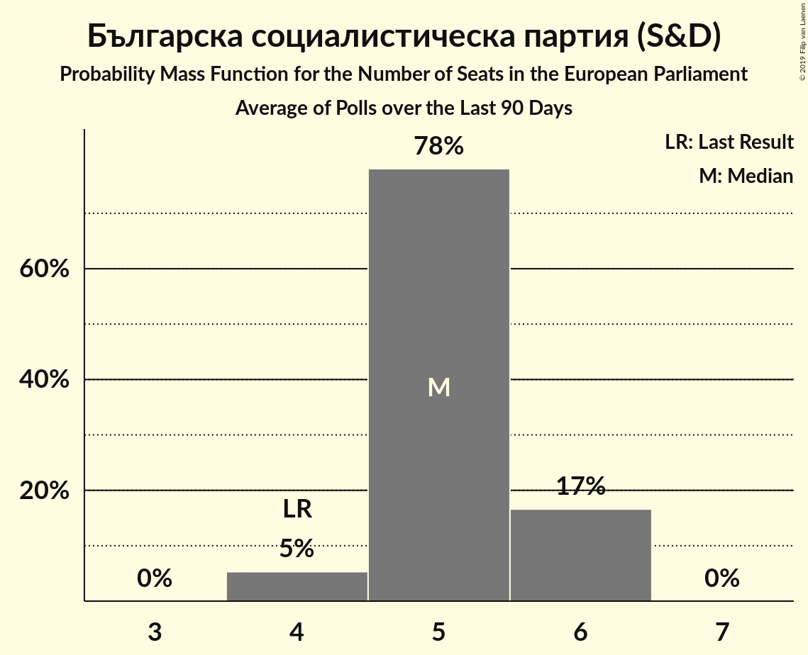

# Българска социалистическа партия (S&D)

<a href="#voting-intentions">Voting Intentions</a> | <a href="#seats">Seats</a>

## Voting Intentions

Last result: **18.9%** (General Election of 26 May 2019)

### Confidence Intervals

| Period     | Polling firm/Commissioner(s) | Median | 80% Confidence Interval | 90% Confidence Interval | 95% Confidence Interval | 99% Confidence Interval |
|:----------:|:----------------:|:-----------:|:-----------------------:|:-----------------------:|:-----------------------:|:-----------------------:|
| N/A | [Poll Average](average.html) | 10.1% | 8.2–11.6% | 7.5–12.1% | 7.0–12.5% | 6.0–13.3% |
| [1–7 March 2024](2024-03-07-Алфарисърч.html) | Алфа рисърч | 10.6% | 9.4–11.9% | 9.1–12.3% | 8.8–12.7% | 8.3–13.3% |
| [5 March 2024](2024-03-05-Ipsos.html) | Ipsos   Euronews | 8.9% | 7.2–11.3% | 6.7–11.9% | 6.3–12.5% | 5.5–13.7% |
| [24 February–3 March 2024](2024-03-03-МаркетЛИНКС.html) | Маркет ЛИНКС   bTV | 10.1% | 9.0–11.4% | 8.7–11.8% | 8.4–12.1% | 7.9–12.8% |
| [17–24 January 2024](2024-01-24-Тренд.html) | Тренд   24 часа | 10.4% | 9.2–11.8% | 8.9–12.1% | 8.6–12.5% | 8.0–13.2% |
| [7–13 December 2023](2023-12-13-Медиана.html) | Медиана | 12.6% | 11.3–14.2% | 10.9–14.6% | 10.6–15.0% | 10.0–15.7% |
| [22–30 November 2023](2023-11-30-Алфарисърч.html) | Алфа рисърч | 11.4% | 10.2–12.8% | 9.9–13.2% | 9.6–13.5% | 9.0–14.2% |
| [10–19 November 2023](2023-11-19-МаркетЛИНКС.html) | Маркет ЛИНКС   bTV | 11.0% | 9.8–12.4% | 9.5–12.8% | 9.2–13.2% | 8.7–13.8% |
| [11–18 November 2023](2023-11-18-Тренд.html) | Тренд   24 часа | 10.2% | 9.0–11.6% | 8.7–12.0% | 8.4–12.3% | 7.9–13.0% |
| [26 September–8 October 2023](2023-10-08-МаркетЛИНКС.html) | Маркет ЛИНКС   bTV | 9.8% | 8.6–11.1% | 8.3–11.5% | 8.0–11.8% | 7.5–12.5% |
| [2–8 September 2023](2023-09-08-Тренд.html) | Тренд   24 часа | 9.3% | 8.2–10.6% | 7.8–11.0% | 7.6–11.3% | 7.1–12.0% |
| [11–18 August 2023](2023-08-18-МаркетЛИНКС.html) | Маркет ЛИНКС   bTV | 8.6% | 7.5–9.8% | 7.2–10.2% | 7.0–10.5% | 6.5–11.1% |
| [18–24 July 2023](2023-07-24-Медиана.html) | Медиана | 9.9% | 8.8–11.3% | 8.5–11.6% | 8.2–12.0% | 7.7–12.7% |
| [4–11 July 2023](2023-07-11-Тренд.html) | Тренд   24 часа | 9.2% | 8.1–10.5% | 7.7–10.9% | 7.5–11.2% | 7.0–11.9% |
| [29 June–9 July 2023](2023-07-09-GallupInternational.html) | Gallup International | 9.6% | 8.4–11.1% | 8.1–11.5% | 7.8–11.9% | 7.2–12.6% |
| [3–7 July 2023](2023-07-07-Центързаанализиимаркетинг.html) | Център за анализи и маркетинг | 9.4% | 8.3–10.7% | 8.0–11.1% | 7.8–11.4% | 7.3–12.1% |
| [22 June–2 July 2023](2023-07-02-МаркетЛИНКС.html) | Маркет ЛИНКС   bTV | 9.3% | N/A | N/A | N/A | N/A |
| [20–26 June 2023](2023-06-26-Алфарисърч.html) | Алфа рисърч | 9.1% | 8.0–10.4% | 7.7–10.8% | 7.5–11.1% | 7.0–11.8% |
| [12–20 June 2023](2023-06-20-Exacta.html) | Exacta | 10.1% | 9.0–11.5% | 8.6–11.8% | 8.4–12.2% | 7.8–12.8% |
| [10–16 June 2023](2023-06-16-Тренд.html) | Тренд   24 часа | 9.5% | 8.4–10.8% | 8.0–11.2% | 7.8–11.5% | 7.3–12.2% |
| [27 April–5 May 2023](2023-05-05-GallupInternational.html) | Gallup International | 9.1% | 7.9–10.5% | 7.6–10.9% | 7.3–11.3% | 6.8–12.0% |
| [17–22 March 2023](2023-03-22-Медиана.html) | Медиана | 8.6% | 7.5–9.8% | 7.2–10.2% | 7.0–10.5% | 6.5–11.2% |
| [16–19 March 2023](2023-03-19-Центързаанализиимаркетинг.html) | Център за анализи и маркетинг | 8.1% | 7.1–9.3% | 6.8–9.7% | 6.6–10.0% | 6.1–10.6% |
| [7–14 March 2023](2023-03-14-Nasoca.html) | Nasoca | 6.5% | 5.6–7.5% | 5.4–7.8% | 5.2–8.0% | 4.8–8.6% |
| [6–12 March 2023](2023-03-12-Тренд.html) | Тренд   24 часа | 7.6% | 6.6–8.8% | 6.3–9.1% | 6.1–9.4% | 5.6–10.0% |
| [24 February–3 March 2023](2023-03-03-GallupInternational.html) | Gallup International | 7.3% | 6.4–8.5% | 6.1–8.8% | 5.9–9.1% | 5.5–9.7% |
| [21–27 February 2023](2023-02-27-Алфарисърч.html) | Алфа рисърч | 7.4% | 6.5–8.6% | 6.2–8.9% | 6.0–9.3% | 5.5–9.8% |
| [20–27 February 2023](2023-02-27-SovaHarris.html) | Sova Harris | 9.8% | 8.7–11.1% | 8.4–11.5% | 8.1–11.8% | 7.6–12.5% |
| [19–24 February 2023](2023-02-24-Медиана.html) | Медиана | 9.5% | 8.4–10.9% | 8.0–11.3% | 7.8–11.6% | 7.3–12.3% |
| [2–12 February 2023](2023-02-12-GallupInternational.html) | Gallup International | 8.5% | 7.4–9.9% | 7.1–10.3% | 6.8–10.7% | 6.3–11.4% |
| [4–11 February 2023](2023-02-11-Тренд.html) | Тренд   24 часа | 9.3% | 8.3–10.7% | 8.0–11.0% | 7.7–11.3% | 7.2–12.0% |
| [30 January–4 February 2023](2023-02-04-Exacta.html) | Exacta | 12.6% | 11.3–14.0% | 11.0–14.4% | 10.7–14.7% | 10.1–15.4% |
| [10–20 December 2022](2022-12-20-МаркетЛИНКС.html) | Маркет ЛИНКС   bTV | 9.6% | N/A | N/A | N/A | N/A |
| [1–13 December 2022](2022-12-13-Алфарисърч.html) | Алфа рисърч | 10.0% | 8.9–11.3% | 8.6–11.6% | 8.3–12.0% | 7.8–12.6% |
| [5–12 December 2022](2022-12-12-Exacta.html) | Exacta | 10.8% | 9.6–12.1% | 9.3–12.5% | 9.0–12.8% | 8.5–13.4% |
| [1–8 December 2022](2022-12-08-Тренд.html) | Тренд   24 часа | 9.0% | 7.9–10.2% | 7.6–10.6% | 7.3–10.9% | 6.9–11.5% |
| [27–29 September 2022](2022-09-29-Алфарисърч.html) | Алфа рисърч | 10.2% | 9.1–11.6% | 8.8–11.9% | 8.5–12.3% | 8.0–12.9% |
| [21–27 September 2022](2022-09-27-Тренд.html) | Тренд   24 часа | 8.7% | 7.7–10.0% | 7.4–10.4% | 7.2–10.7% | 6.7–11.3% |
| [20–27 September 2022](2022-09-27-GallupInternational.html) | Gallup International | 9.2% | 8.1–10.5% | 7.8–10.9% | 7.6–11.2% | 7.1–11.8% |
| [17–23 September 2022](2022-09-23-МаркетЛИНКС.html) | Маркет ЛИНКС   24 часа | 9.9% | N/A | N/A | N/A | N/A |
| [10–17 September 2022](2022-09-17-Exacta.html) | Exacta | 12.5% | 11.2–13.9% | 10.9–14.3% | 10.6–14.6% | 10.0–15.3% |
| [10–17 September 2022](2022-09-17-Estat.html) | Estat | 9.3% | 8.2–10.5% | 7.9–10.9% | 7.6–11.2% | 7.1–11.9% |
| [6–12 September 2022](2022-09-12-SovaHarris.html) | Sova Harris   Dir.bg | 12.7% | 11.3–14.3% | 10.9–14.7% | 10.6–15.1% | 10.0–15.9% |
| [2–10 September 2022](2022-09-10-GallupInternational.html) | Gallup International | 9.8% | 8.7–11.1% | 8.4–11.5% | 8.1–11.8% | 7.6–12.4% |
| [29 August–4 September 2022](2022-09-04-Медиана.html) | Медиана | 13.3% | 12.0–14.8% | 11.6–15.2% | 11.3–15.5% | 10.7–16.3% |
| [27 August–3 September 2022](2022-09-03-МаркетЛИНКС.html) | Маркет ЛИНКС   bTV | 10.9% | 9.7–12.2% | 9.4–12.6% | 9.1–12.9% | 8.6–13.5% |
| [27 August–2 September 2022](2022-09-02-Алфарисърч.html) | Алфа рисърч | 10.6% | 9.5–11.9% | 9.2–12.3% | 9.0–12.6% | 8.5–13.2% |
| [15–22 August 2022](2022-08-22-Тренд.html) | Тренд   24 часа | 8.6% | 7.6–9.9% | 7.3–10.2% | 7.1–10.5% | 6.6–11.2% |
| [30 July–5 August 2022](2022-08-05-МаркетЛИНКС.html) | Маркет ЛИНКС   bTV | 11.9% | 10.7–13.3% | 10.3–13.7% | 10.0–14.0% | 9.5–14.7% |
| [5–12 July 2022](2022-07-12-Тренд.html) | Тренд   24 часа | 10.6% | N/A | N/A | N/A | N/A |
| [2–10 July 2022](2022-07-10-МаркетЛИНКС.html) | Маркет ЛИНКС   bTV | 11.6% | 10.4–13.0% | 10.1–13.4% | 9.8–13.7% | 9.3–14.4% |
| [25 June–1 July 2022](2022-07-01-Алфарисърч.html) | Алфа рисърч | 12.8% | 11.5–14.2% | 11.2–14.6% | 10.9–15.0% | 10.3–15.7% |
| [4–11 May 2022](2022-05-11-Тренд.html) | Тренд   24 часа | 9.4% | N/A | N/A | N/A | N/A |
| [4–9 May 2022](2022-05-09-Центързаанализиимаркетинг.html) | Център за анализи и маркетинг | 11.8% | 10.5–13.4% | 10.1–13.8% | 9.8–14.2% | 9.2–15.0% |
| [29 April–8 May 2022](2022-05-08-МаркетЛИНКС.html) | Маркет ЛИНКС   bTV | 12.5% | 11.3–13.9% | 10.9–14.3% | 10.6–14.7% | 10.0–15.4% |
| [29 April–6 May 2022](2022-05-06-Gallup.html) | Gallup | 9.7% | 8.5–11.2% | 8.1–11.6% | 7.8–11.9% | 7.3–12.7% |
| [8–14 April 2022](2022-04-14-Алфарисърч.html) | Алфа рисърч | 11.7% | 10.5–13.0% | 10.1–13.4% | 9.8–13.8% | 9.3–14.4% |
| [6–13 April 2022](2022-04-13-Тренд.html) | Тренд   24 часа | 10.5% | N/A | N/A | N/A | N/A |
| [31 March–8 April 2022](2022-04-08-Gallup.html) | Gallup | 10.3% | N/A | N/A | N/A | N/A |
| [22–29 March 2022](2022-03-29-МаркетЛИНКС.html) | Маркет ЛИНКС   bTV | 11.6% | N/A | N/A | N/A | N/A |
| [5–12 March 2022](2022-03-12-Тренд.html) | Тренд   24 часа | 10.4% | N/A | N/A | N/A | N/A |
| [6–14 February 2022](2022-02-14-Алфарисърч.html) | Алфа рисърч | 12.0% | N/A | N/A | N/A | N/A |
| [3–11 February 2022](2022-02-11-Gallup.html) | Gallup | 8.5% | N/A | N/A | N/A | N/A |
| [12–19 January 2022](2022-01-19-Тренд.html) | Тренд   24 часа | 11.5% | N/A | N/A | N/A | N/A |
| [10–17 October 2021](2021-10-17-Gallup.html) | Gallup   BNR | 15.2% | N/A | N/A | N/A | N/A |
| [5–12 October 2021](2021-10-12-SovaHarris.html) | Sova Harris   Dir.bg | 19.4% | N/A | N/A | N/A | N/A |
| [6–12 October 2021](2021-10-12-Exacta.html) | Exacta | 14.9% | N/A | N/A | N/A | N/A |
| [6–10 October 2021](2021-10-10-Центързаанализиимаркетинг.html) | Център за анализи и маркетинг | 16.6% | N/A | N/A | N/A | N/A |
| [4–10 October 2021](2021-10-10-Алфарисърч.html) | Алфа рисърч | 16.8% | N/A | N/A | N/A | N/A |
| [21–26 September 2021](2021-09-26-Gallup.html) | Gallup | 13.4% | N/A | N/A | N/A | N/A |
| [14–20 September 2021](2021-09-20-МаркетЛИНКС.html) | Маркет ЛИНКС   bTV | 16.0% | N/A | N/A | N/A | N/A |
| [8–15 September 2021](2021-09-15-Тренд.html) | Тренд | 16.6% | N/A | N/A | N/A | N/A |
| [8–15 September 2021](2021-09-15-Алфарисърч.html) | Алфа рисърч | 18.1% | N/A | N/A | N/A | N/A |
| [2–10 September 2021](2021-09-10-Gallup.html) | Gallup | 16.0% | N/A | N/A | N/A | N/A |
| [13–22 August 2021](2021-08-22-МаркетЛИНКС.html) | Маркет ЛИНКС   bTV | 17.1% | N/A | N/A | N/A | N/A |
| [23–30 July 2021](2021-07-30-Тренд.html) | Тренд   24 часа | 14.5% | 13.5–15.5% | 13.2–15.8% | 13.0–16.1% | 12.5–16.6% |
| [21–28 July 2021](2021-07-28-МаркетЛИНКС.html) | Маркет ЛИНКС   bTV | 16.1% | N/A | N/A | N/A | N/A |
| [3–7 July 2021](2021-07-07-Тренд.html) | Тренд   Nova | 15.9% | 13.9–18.1% | 13.4–18.7% | 12.9–19.3% | 12.1–20.4% |
| [4–7 July 2021](2021-07-07-Алфарисърч.html) | Алфа рисърч | 16.4% | 14.4–18.7% | 13.8–19.4% | 13.3–20.0% | 12.4–21.2% |
| [30 June–7 July 2021](2021-07-07-Gallup.html) | Gallup   BNR | 15.8% | 13.9–18.1% | 13.4–18.7% | 12.9–19.3% | 12.0–20.4% |
| [2–6 July 2021](2021-07-06-SovaHarris.html) | Sova Harris   Dir.bg | 15.9% | 14.0–18.2% | 13.4–18.9% | 13.0–19.4% | 12.1–20.5% |
| [1–5 July 2021](2021-07-05-Exacta.html) | Exacta | 16.0% | 14.0–18.3% | 13.4–18.9% | 13.0–19.5% | 12.1–20.7% |
| [26 June–2 July 2021](2021-07-02-Медиана.html) | Медиана | 20.7% | 19.0–22.5% | 18.5–23.0% | 18.2–23.4% | 17.4–24.3% |
| [23–30 June 2021](2021-06-30-Nasoca.html) | Nasoca | 15.8% | 13.9–18.0% | 13.4–18.6% | 12.9–19.2% | 12.1–20.3% |
| [18–25 June 2021](2021-06-25-МаркетЛИНКС.html) | Маркет ЛИНКС   bTV | 17.1% | N/A | N/A | N/A | N/A |
| [11–18 June 2021](2021-06-18-Тренд.html) | Тренд   24 часа | 16.0% | 14.0–18.3% | 13.5–19.0% | 13.0–19.6% | 12.1–20.7% |
| [10–15 June 2021](2021-06-15-Медиана.html) | Медиана | 21.3% | 19.7–23.1% | 19.3–23.5% | 18.9–24.0% | 18.2–24.8% |
| [10–15 June 2021](2021-06-15-SovaHarris.html) | Sova Harris   Dir.bg | 18.8% | 16.7–21.2% | 16.1–21.9% | 15.6–22.5% | 14.6–23.7% |
| [3–11 June 2021](2021-06-11-Gallup.html) | Gallup   BNR | 16.0% | 14.2–18.0% | 13.7–18.6% | 13.2–19.1% | 12.4–20.2% |
| [30 May–7 June 2021](2021-06-07-Алфарисърч.html) | Алфа рисърч | 14.4% | 12.6–16.5% | 12.1–17.1% | 11.6–17.6% | 10.8–18.7% |
| [19–27 May 2021](2021-05-27-МаркетЛИНКС.html) | Маркет ЛИНКС   bTV | 19.3% | N/A | N/A | N/A | N/A |
| [14–21 May 2021](2021-05-21-Центързаанализиимаркетинг.html) | Център за анализи и маркетинг | 17.8% | N/A | N/A | N/A | N/A |
| [7–14 May 2021](2021-05-14-Gallup.html) | Gallup | 16.2% | 14.2–18.5% | 13.6–19.2% | 13.1–19.8% | 12.2–21.0% |
| [16–23 April 2021](2021-04-23-МаркетЛИНКС.html) | Маркет ЛИНКС   bTV | 18.0% | 16.2–20.1% | 15.7–20.7% | 15.2–21.2% | 14.4–22.3% |
| [24–31 March 2021](2021-03-31-Gallup.html) | Gallup   BNR | 20.7% | 18.3–23.5% | 17.6–24.3% | 17.1–25.0% | 16.0–26.3% |
| [27–30 March 2021](2021-03-30-Центързаанализиимаркетинг.html) | Център за анализи и маркетинг | 19.4% | N/A | N/A | N/A | N/A |
| [26–30 March 2021](2021-03-30-Тренд.html) | Тренд   Nova | 21.8% | 19.5–24.4% | 18.9–25.1% | 18.3–25.8% | 17.3–27.1% |
| [27–30 March 2021](2021-03-30-ПИК.html) | ПИК | 19.7% | 17.1–22.8% | 16.4–23.6% | 15.7–24.4% | 14.6–25.9% |
| [27–30 March 2021](2021-03-30-Алфарисърч.html) | Алфа рисърч | 19.8% | 17.7–22.3% | 17.1–22.9% | 16.6–23.5% | 15.7–24.7% |
| [26–30 March 2021](2021-03-30-AFIS.html) | AFIS | 20.3% | 17.8–23.1% | 17.1–23.9% | 16.5–24.6% | 15.4–26.0% |
| [23–29 March 2021](2021-03-29-Exacta.html) | Exacta | 19.9% | 17.7–22.5% | 17.0–23.2% | 16.5–23.9% | 15.5–25.1% |
| [25–28 March 2021](2021-03-28-Рего.html) | Рего | 28.2% | 26.1–30.3% | 25.5–31.0% | 25.0–31.5% | 24.1–32.6% |
| [19–23 March 2021](2021-03-23-Центързаанализиимаркетинг.html) | Център за анализи и маркетинг   Pik | 21.0% | N/A | N/A | N/A | N/A |
| [19–23 March 2021](2021-03-23-ПИК.html) | ПИК   Pik | 21.0% | 19.4–22.7% | 19.0–23.2% | 18.6–23.6% | 17.8–24.5% |
| [16–23 March 2021](2021-03-23-Медиана.html) | Медиана | 22.9% | 20.8–25.2% | 20.2–25.9% | 19.7–26.5% | 18.8–27.6% |
| [18–23 March 2021](2021-03-23-МаркетЛИНКС.html) | Маркет ЛИНКС   bTV | 22.0% | 19.7–24.6% | 19.1–25.4% | 18.5–26.0% | 17.5–27.3% |
| [11–16 March 2021](2021-03-16-SovaHarris.html) | Sova Harris   Trud | 24.0% | 21.5–26.7% | 20.8–27.5% | 20.1–28.2% | 19.0–29.6% |
| [9–14 March 2021](2021-03-14-Тренд.html) | Тренд   24 часа | 23.7% | 21.2–26.4% | 20.6–27.1% | 20.0–27.8% | 18.9–29.1% |
| [26 February–1 March 2021](2021-03-01-Алфарисърч.html) | Алфа рисърч   bTV | 23.1% | 20.9–25.6% | 20.3–26.3% | 19.7–26.9% | 18.7–28.1% |
| [22 February–1 March 2021](2021-03-01-Gallup.html) | Gallup   BNR/BNT | 23.2% | 21.0–25.7% | 20.4–26.4% | 19.8–27.0% | 18.8–28.2% |
| [22–26 February 2021](2021-02-26-Медиана.html) | Медиана | 24.2% | 22.0–26.6% | 21.4–27.3% | 20.9–27.8% | 19.8–29.0% |
| [17–24 February 2021](2021-02-24-МаркетЛИНКС.html) | Маркет ЛИНКС   bTV | 21.5% | 19.3–24.0% | 18.7–24.7% | 18.2–25.3% | 17.2–26.5% |
| [15–22 February 2021](2021-02-22-Exacta.html) | Exacta | 22.2% | 20.2–24.5% | 19.6–25.1% | 19.1–25.7% | 18.1–26.8% |
| [12–19 February 2021](2021-02-19-Тренд.html) | Тренд   24 часа/BNT | 24.1% | 21.7–26.7% | 21.0–27.5% | 20.4–28.1% | 19.3–29.4% |
| [12–17 February 2021](2021-02-17-AFIS.html) | AFIS | 22.6% | 20.1–25.3% | 19.5–26.0% | 18.9–26.7% | 17.8–28.0% |
| [4–12 February 2021](2021-02-12-Gallup.html) | Gallup | 21.8% | 19.4–24.5% | 18.8–25.3% | 18.2–26.0% | 17.1–27.3% |
| [23–31 January 2021](2021-01-31-МаркетЛИНКС.html) | Маркет ЛИНКС   bTV | 20.9% | 19.3–22.6% | 18.9–23.1% | 18.5–23.5% | 17.8–24.4% |
| [26 January 2020–31 January 2021](2021-01-31-SovaHarris.html) | Sova Harris | 24.9% | 23.2–26.7% | 22.7–27.2% | 22.3–27.6% | 21.5–28.5% |
| [12–19 January 2021](2021-01-19-Тренд.html) | Тренд   24 часа | 24.9% | 23.2–26.7% | 22.7–27.2% | 22.3–27.7% | 21.5–28.5% |
| [7–15 January 2021](2021-01-15-Gallup.html) | Gallup | 21.4% | 19.8–23.3% | 19.3–23.8% | 18.9–24.2% | 18.1–25.1% |
| [15–21 December 2020](2020-12-21-Алфарисърч.html) | Алфа рисърч | 26.3% | 23.7–29.2% | 23.0–30.0% | 22.3–30.7% | 21.1–32.1% |
| [12–17 December 2020](2020-12-17-Медиана.html) | Медиана | 25.7% | 23.7–27.9% | 23.2–28.5% | 22.7–29.0% | 21.7–30.1% |
| [5–12 December 2020](2020-12-12-Exacta.html) | Exacta | 25.6% | 23.5–27.8% | 22.9–28.5% | 22.4–29.0% | 21.4–30.1% |
| [27 October–3 November 2020](2020-11-03-SovaHarris.html) | Sova Harris | 25.1% | 23.4–26.9% | 22.9–27.4% | 22.5–27.9% | 21.7–28.8% |
| [21–27 October 2020](2020-10-27-Рего.html) | Рего | 26.3% | 25.1–27.6% | 24.7–28.0% | 24.4–28.3% | 23.8–28.9% |
| [3–10 October 2020](2020-10-10-Тренд.html) | Тренд   24 часа | 23.6% | 21.9–25.4% | 21.5–25.9% | 21.1–26.3% | 20.3–27.2% |
| [1–9 October 2020](2020-10-09-Gallup.html) | Gallup | 19.8% | 18.1–21.7% | 17.6–22.2% | 17.2–22.7% | 16.4–23.6% |
| [21–30 September 2020](2020-09-30-Алфарисърч.html) | Алфа рисърч | 21.8% | 20.2–23.5% | 19.8–24.0% | 19.4–24.5% | 18.7–25.3% |
| [18–26 September 2020](2020-09-26-МаркетЛИНКС.html) | Маркет ЛИНКС | 25.5% | 23.9–27.3% | 23.4–27.8% | 23.0–28.2% | 22.2–29.1% |
| [3–11 September 2020](2020-09-11-Gallup.html) | Gallup | 21.2% | 19.0–23.6% | 18.4–24.3% | 17.8–24.9% | 16.9–26.1% |
| [29 August–5 September 2020](2020-09-05-Тренд.html) | Тренд   24 часа | 23.4% | 21.8–25.2% | 21.3–25.7% | 20.9–26.1% | 20.1–27.0% |
| [19–25 August 2020](2020-08-25-SovaHarris.html) | Sova Harris | 24.5% | 22.5–26.9% | 21.9–27.5% | 21.4–28.1% | 20.5–29.2% |
| [3–10 August 2020](2020-08-10-Тренд.html) | Тренд   24 часа | 23.7% | 22.1–25.5% | 21.6–26.0% | 21.2–26.5% | 20.5–27.4% |
| [30 July–7 August 2020](2020-08-07-Gallup.html) | Gallup | 21.6% | 19.5–24.1% | 18.9–24.8% | 18.4–25.4% | 17.4–26.6% |
| [1–5 August 2020](2020-08-05-Центързаанализиимаркетинг.html) | Център за анализи и маркетинг | 19.7% | N/A | N/A | N/A | N/A |
| [1–5 August 2020](2020-08-05-ПИК.html) | ПИК | 19.7% | 18.2–21.4% | 17.7–21.8% | 17.4–22.3% | 16.6–23.1% |
| [28 July–3 August 2020](2020-08-03-МаркетЛИНКС.html) | Маркет ЛИНКС   bTV | 20.7% | 18.9–22.8% | 18.4–23.4% | 17.9–23.9% | 17.1–24.9% |
| [1–31 July 2020](2020-07-31-Gallup.html) | Gallup | 25.7% | N/A | N/A | N/A | N/A |
| [23–30 July 2020](2020-07-30-Алфарисърч.html) | Алфа рисърч   Дневник | 19.2% | 17.2–21.5% | 16.6–22.1% | 16.1–22.7% | 15.2–23.8% |
| [26 June–1 July 2020](2020-07-01-SovaHarris.html) | Sova Harris | 21.4% | 19.3–23.7% | 18.7–24.4% | 18.2–25.0% | 17.3–26.1% |
| [1–30 June 2020](2020-06-30-Gallup.html) | Gallup | 23.2% | N/A | N/A | N/A | N/A |
| [27 May–3 June 2020](2020-06-03-МаркетЛИНКС.html) | Маркет ЛИНКС   bTV | 25.6% | 23.7–27.6% | 23.2–28.2% | 22.7–28.7% | 21.9–29.7% |
| [28 April–5 May 2020](2020-05-05-Алфарисърч.html) | Алфа рисърч   Дневник | 19.6% | 17.7–21.8% | 17.1–22.4% | 16.7–22.9% | 15.8–24.0% |
| [21–28 February 2020](2020-02-28-Медиана.html) | Медиана | 25.7% | 24.0–27.5% | 23.5–28.0% | 23.1–28.5% | 22.3–29.4% |
| [3–10 February 2020](2020-02-10-Тренд.html) | Тренд   24 часа | 28.8% | 26.6–31.1% | 25.9–31.8% | 25.4–32.4% | 24.4–33.5% |
| [5–12 December 2019](2019-12-12-Алфарисърч.html) | Алфа рисърч   Дневник | 25.0% | 23.1–27.2% | 22.5–27.8% | 22.0–28.3% | 21.1–29.3% |
| [21–28 November 2019](2019-11-28-МаркетЛИНКС.html) | Маркет ЛИНКС   bTV | 25.8% | 23.6–28.1% | 23.0–28.8% | 22.5–29.4% | 21.5–30.5% |
| [7–15 November 2019](2019-11-15-Тренд.html) | Тренд   24 часа | 28.5% | 26.5–31.1% | 25.9–31.7% | 25.3–32.3% | 24.3–33.5% |
| [10–16 September 2019](2019-09-16-Алфарисърч.html) | Алфа рисърч   Дневник | 25.8% | 23.9–28.0% | 23.3–28.6% | 22.8–29.1% | 21.9–30.2% |
| [5–12 July 2019](2019-07-12-Тренд.html) | Тренд   24 часа | 30.2% | 27.9–32.6% | 27.3–33.3% | 26.7–33.9% | 25.6–35.0% |
| [11–19 June 2019](2019-06-19-МаркетЛИНКС.html) | Маркет ЛИНКС   bTV | 33.0% | 31.0–35.1% | 30.5–35.7% | 30.0–36.2% | 29.1–37.2% |
| [5–12 June 2019](2019-06-12-Тренд.html) | Тренд | 29.1% | 27.3–31.0% | 26.8–31.5% | 26.3–32.0% | 25.5–32.9% |

### Probability Mass Function

The following table shows the probability mass function per percentage block of voting intentions for the [poll average](average.html) for Българска социалистическа партия (S&D).

| Voting Intentions | Probability | Accumulated | Special Marks |
|:-----------------:|:-----------:|:-----------:|:-------------:|
| 3.5–4.5% | 0% | 100% |  |
| 4.5–5.5% | 0.2% | 100% |  |
| 5.5–6.5% | 1.1% | 99.8% |  |
| 6.5–7.5% | 4% | 98.7% |  |
| 7.5–8.5% | 9% | 95% |  |
| 8.5–9.5% | 19% | 86% |  |
| 9.5–10.5% | 31% | 67% | Median |
| 10.5–11.5% | 25% | 36% |  |
| 11.5–12.5% | 9% | 11% |  |
| 12.5–13.5% | 2% | 2% |  |
| 13.5–14.5% | 0.3% | 0.3% |  |
| 14.5–15.5% | 0% | 0.1% |  |
| 15.5–16.5% | 0% | 0% |  |
| 16.5–17.5% | 0% | 0% |  |
| 17.5–18.5% | 0% | 0% |  |
| 18.5–19.5% | 0% | 0% | Last Result |

## Seats

Last result: **4** seats (General Election of 26 May 2019)

### Confidence Intervals

| Period     | Polling firm/Commissioner(s) | Median | 80% Confidence Interval | 90% Confidence Interval | 95% Confidence Interval | 99% Confidence Interval |
|:----------:|:----------------:|:------:|:-----------------------:|:-----------------------:|:-----------------------:|:-----------------------:|
| N/A | [Poll Average](average.html) | 2 | 1–2 | 1–2 | 1–2 | 1–2 |
| [1–7 March 2024](2024-03-07-Алфарисърч.html) | Алфа рисърч | 2 | 2 | 1–2 | 1–2 | 1–2 |
| [5 March 2024](2024-03-05-Ipsos.html) | Ipsos   Euronews | 2 | 1–2 | 1–2 | 1–2 | 1–3 |
| [24 February–3 March 2024](2024-03-03-МаркетЛИНКС.html) | Маркет ЛИНКС   bTV | 2 | 2 | 2 | 1–2 | 1–2 |
| [17–24 January 2024](2024-01-24-Тренд.html) | Тренд   24 часа | 2 | 2 | 2 | 2–3 | 1–3 |
| [7–13 December 2023](2023-12-13-Медиана.html) | Медиана | 2 | 2–3 | 2–3 | 2–3 | 2–3 |
| [22–30 November 2023](2023-11-30-Алфарисърч.html) | Алфа рисърч | 2 | 2 | 2 | 2 | 2 |
| [10–19 November 2023](2023-11-19-МаркетЛИНКС.html) | Маркет ЛИНКС   bTV | 2 | 2 | 2 | 2 | 1–2 |
| [11–18 November 2023](2023-11-18-Тренд.html) | Тренд   24 часа | 2 | 2 | 2 | 2 | 1–3 |
| [26 September–8 October 2023](2023-10-08-МаркетЛИНКС.html) | Маркет ЛИНКС   bTV | 2 | 2 | 1–2 | 1–2 | 1–2 |
| [2–8 September 2023](2023-09-08-Тренд.html) | Тренд   24 часа | 2 | 2 | 1–2 | 1–2 | 1–2 |
| [11–18 August 2023](2023-08-18-МаркетЛИНКС.html) | Маркет ЛИНКС   bTV | 1 | 1–2 | 1–2 | 1–2 | 1–2 |
| [18–24 July 2023](2023-07-24-Медиана.html) | Медиана | 2 | 2 | 1–2 | 1–2 | 1–2 |
| [4–11 July 2023](2023-07-11-Тренд.html) | Тренд   24 часа | 2 | 1–2 | 1–2 | 1–2 | 1–2 |
| [29 June–9 July 2023](2023-07-09-GallupInternational.html) | Gallup International | 2 | 1–2 | 1–2 | 1–2 | 1–2 |
| [3–7 July 2023](2023-07-07-Центързаанализиимаркетинг.html) | Център за анализи и маркетинг | 2 | 2 | 1–2 | 1–2 | 1–2 |
| [22 June–2 July 2023](2023-07-02-МаркетЛИНКС.html) | Маркет ЛИНКС   bTV |  |  |  |  |  |
| [20–26 June 2023](2023-06-26-Алфарисърч.html) | Алфа рисърч | 2 | 1–2 | 1–2 | 1–2 | 1–2 |
| [12–20 June 2023](2023-06-20-Exacta.html) | Exacta | 2 | 2 | 2 | 1–2 | 1–2 |
| [10–16 June 2023](2023-06-16-Тренд.html) | Тренд   24 часа | 2 | 2 | 1–2 | 1–2 | 1–2 |
| [27 April–5 May 2023](2023-05-05-GallupInternational.html) | Gallup International | 2 | 1–2 | 1–2 | 1–2 | 1–2 |
| [17–22 March 2023](2023-03-22-Медиана.html) | Медиана | 2 | 1–2 | 1–2 | 1–2 | 1–2 |
| [16–19 March 2023](2023-03-19-Центързаанализиимаркетинг.html) | Център за анализи и маркетинг | 2 | 1–2 | 1–2 | 1–2 | 1–2 |
| [7–14 March 2023](2023-03-14-Nasoca.html) | Nasoca | 1 | 1 | 1–2 | 1–2 | 0–2 |
| [6–12 March 2023](2023-03-12-Тренд.html) | Тренд   24 часа | 1 | 1–2 | 1–2 | 1–2 | 1–2 |
| [24 February–3 March 2023](2023-03-03-GallupInternational.html) | Gallup International | 1 | 1–2 | 1–2 | 1–2 | 1–2 |
| [21–27 February 2023](2023-02-27-Алфарисърч.html) | Алфа рисърч | 2 | 1–2 | 1–2 | 1–2 | 1–2 |
| [20–27 February 2023](2023-02-27-SovaHarris.html) | Sova Harris | 2 | 2 | 2 | 2 | 1–2 |
| [19–24 February 2023](2023-02-24-Медиана.html) | Медиана | 2 | 2 | 2 | 1–2 | 1–2 |
| [2–12 February 2023](2023-02-12-GallupInternational.html) | Gallup International | 2 | 1–2 | 1–2 | 1–2 | 1–2 |
| [4–11 February 2023](2023-02-11-Тренд.html) | Тренд   24 часа | 2 | 2 | 1–2 | 1–2 | 1–2 |
| [30 January–4 February 2023](2023-02-04-Exacta.html) | Exacta | 3 | 2–3 | 2–3 | 2–3 | 2–3 |
| [10–20 December 2022](2022-12-20-МаркетЛИНКС.html) | Маркет ЛИНКС   bTV |  |  |  |  |  |
| [1–13 December 2022](2022-12-13-Алфарисърч.html) | Алфа рисърч | 2 | 2 | 2 | 1–2 | 1–2 |
| [5–12 December 2022](2022-12-12-Exacta.html) | Exacta | 2 | 2 | 2 | 2 | 1–3 |
| [1–8 December 2022](2022-12-08-Тренд.html) | Тренд   24 часа | 2 | 1–2 | 1–2 | 1–2 | 1–2 |
| [27–29 September 2022](2022-09-29-Алфарисърч.html) | Алфа рисърч | 2 | 2 | 2 | 2 | 2–3 |
| [21–27 September 2022](2022-09-27-Тренд.html) | Тренд   24 часа | 2 | 1–2 | 1–2 | 1–2 | 1–2 |
| [20–27 September 2022](2022-09-27-GallupInternational.html) | Gallup International | 2 | 2 | 2 | 1–2 | 1–2 |
| [17–23 September 2022](2022-09-23-МаркетЛИНКС.html) | Маркет ЛИНКС   24 часа |  |  |  |  |  |
| [10–17 September 2022](2022-09-17-Exacta.html) | Exacta | 2 | 2–3 | 2–3 | 2–3 | 2–3 |
| [10–17 September 2022](2022-09-17-Estat.html) | Estat | 2 | 1–2 | 1–2 | 1–2 | 1–2 |
| [6–12 September 2022](2022-09-12-SovaHarris.html) | Sova Harris   Dir.bg | 2 | 2–3 | 2–3 | 2–3 | 2–3 |
| [2–10 September 2022](2022-09-10-GallupInternational.html) | Gallup International | 2 | 2 | 2 | 1–2 | 1–3 |
| [29 August–4 September 2022](2022-09-04-Медиана.html) | Медиана | 3 | 2–3 | 2–3 | 2–3 | 2–3 |
| [27 August–3 September 2022](2022-09-03-МаркетЛИНКС.html) | Маркет ЛИНКС   bTV | 2 | 2 | 2 | 2 | 2–3 |
| [27 August–2 September 2022](2022-09-02-Алфарисърч.html) | Алфа рисърч | 2 | 2 | 2 | 2–3 | 2–3 |
| [15–22 August 2022](2022-08-22-Тренд.html) | Тренд   24 часа | 2 | 1–2 | 1–2 | 1–2 | 1–2 |
| [30 July–5 August 2022](2022-08-05-МаркетЛИНКС.html) | Маркет ЛИНКС   bTV | 2 | 2 | 2–3 | 2–3 | 2–3 |
| [5–12 July 2022](2022-07-12-Тренд.html) | Тренд   24 часа |  |  |  |  |  |
| [2–10 July 2022](2022-07-10-МаркетЛИНКС.html) | Маркет ЛИНКС   bTV | 2 | 2 | 2 | 2–3 | 2–3 |
| [25 June–1 July 2022](2022-07-01-Алфарисърч.html) | Алфа рисърч | 2 | 2–3 | 2–3 | 2–3 | 2–3 |
| [4–11 May 2022](2022-05-11-Тренд.html) | Тренд   24 часа |  |  |  |  |  |
| [4–9 May 2022](2022-05-09-Центързаанализиимаркетинг.html) | Център за анализи и маркетинг | 2 | 2 | 2–3 | 2–3 | 2–3 |
| [29 April–8 May 2022](2022-05-08-МаркетЛИНКС.html) | Маркет ЛИНКС   bTV | 2 | 2 | 2 | 2–3 | 2–3 |
| [29 April–6 May 2022](2022-05-06-Gallup.html) | Gallup | 2 | 2 | 1–2 | 1–2 | 1–2 |
| [8–14 April 2022](2022-04-14-Алфарисърч.html) | Алфа рисърч | 2 | 2 | 2 | 2 | 2–3 |
| [6–13 April 2022](2022-04-13-Тренд.html) | Тренд   24 часа |  |  |  |  |  |
| [31 March–8 April 2022](2022-04-08-Gallup.html) | Gallup |  |  |  |  |  |
| [22–29 March 2022](2022-03-29-МаркетЛИНКС.html) | Маркет ЛИНКС   bTV |  |  |  |  |  |
| [5–12 March 2022](2022-03-12-Тренд.html) | Тренд   24 часа |  |  |  |  |  |
| [6–14 February 2022](2022-02-14-Алфарисърч.html) | Алфа рисърч |  |  |  |  |  |
| [3–11 February 2022](2022-02-11-Gallup.html) | Gallup |  |  |  |  |  |
| [12–19 January 2022](2022-01-19-Тренд.html) | Тренд   24 часа |  |  |  |  |  |
| [10–17 October 2021](2021-10-17-Gallup.html) | Gallup   BNR |  |  |  |  |  |
| [5–12 October 2021](2021-10-12-SovaHarris.html) | Sova Harris   Dir.bg |  |  |  |  |  |
| [6–12 October 2021](2021-10-12-Exacta.html) | Exacta |  |  |  |  |  |
| [6–10 October 2021](2021-10-10-Центързаанализиимаркетинг.html) | Център за анализи и маркетинг |  |  |  |  |  |
| [4–10 October 2021](2021-10-10-Алфарисърч.html) | Алфа рисърч |  |  |  |  |  |
| [21–26 September 2021](2021-09-26-Gallup.html) | Gallup |  |  |  |  |  |
| [14–20 September 2021](2021-09-20-МаркетЛИНКС.html) | Маркет ЛИНКС   bTV |  |  |  |  |  |
| [8–15 September 2021](2021-09-15-Тренд.html) | Тренд |  |  |  |  |  |
| [8–15 September 2021](2021-09-15-Алфарисърч.html) | Алфа рисърч |  |  |  |  |  |
| [2–10 September 2021](2021-09-10-Gallup.html) | Gallup |  |  |  |  |  |
| [13–22 August 2021](2021-08-22-МаркетЛИНКС.html) | Маркет ЛИНКС   bTV |  |  |  |  |  |
| [23–30 July 2021](2021-07-30-Тренд.html) | Тренд   24 часа | 3 | 2–3 | 2–3 | 2–3 | 2–3 |
| [21–28 July 2021](2021-07-28-МаркетЛИНКС.html) | Маркет ЛИНКС   bTV |  |  |  |  |  |
| [3–7 July 2021](2021-07-07-Тренд.html) | Тренд   Nova | 3 | 3 | 2–4 | 2–4 | 2–4 |
| [4–7 July 2021](2021-07-07-Алфарисърч.html) | Алфа рисърч | 3 | 3–4 | 3–4 | 2–4 | 2–4 |
| [30 June–7 July 2021](2021-07-07-Gallup.html) | Gallup   BNR | 3 | 3 | 2–4 | 2–4 | 2–4 |
| [2–6 July 2021](2021-07-06-SovaHarris.html) | Sova Harris   Dir.bg | 3 | 2–3 | 2–3 | 2–3 | 2–4 |
| [1–5 July 2021](2021-07-05-Exacta.html) | Exacta | 3 | 3 | 2–4 | 2–4 | 2–4 |
| [26 June–2 July 2021](2021-07-02-Медиана.html) | Медиана | 4 | 3–4 | 3–4 | 3–4 | 3–5 |
| [23–30 June 2021](2021-06-30-Nasoca.html) | Nasoca | 3 | 2–3 | 2–3 | 2–4 | 2–4 |
| [18–25 June 2021](2021-06-25-МаркетЛИНКС.html) | Маркет ЛИНКС   bTV |  |  |  |  |  |
| [11–18 June 2021](2021-06-18-Тренд.html) | Тренд   24 часа | 3 | 2–3 | 2–3 | 2–4 | 2–4 |
| [10–15 June 2021](2021-06-15-Медиана.html) | Медиана | 4 | 4 | 3–4 | 3–4 | 3–5 |
| [10–15 June 2021](2021-06-15-SovaHarris.html) | Sova Harris   Dir.bg | 3 | 3–4 | 3–4 | 3–4 | 3–5 |
| [3–11 June 2021](2021-06-11-Gallup.html) | Gallup   BNR | 3 | 3 | 2–4 | 2–4 | 2–4 |
| [30 May–7 June 2021](2021-06-07-Алфарисърч.html) | Алфа рисърч | 3 | 2–3 | 2–3 | 2–3 | 2–3 |
| [19–27 May 2021](2021-05-27-МаркетЛИНКС.html) | Маркет ЛИНКС   bTV |  |  |  |  |  |
| [14–21 May 2021](2021-05-21-Центързаанализиимаркетинг.html) | Център за анализи и маркетинг |  |  |  |  |  |
| [7–14 May 2021](2021-05-14-Gallup.html) | Gallup | 3 | 3–4 | 3–4 | 2–4 | 2–4 |
| [16–23 April 2021](2021-04-23-МаркетЛИНКС.html) | Маркет ЛИНКС   bTV | 3 | 3–4 | 3–4 | 3–4 | 3–4 |
| [24–31 March 2021](2021-03-31-Gallup.html) | Gallup   BNR | 4 | 3–5 | 3–5 | 3–5 | 3–6 |
| [27–30 March 2021](2021-03-30-Центързаанализиимаркетинг.html) | Център за анализи и маркетинг |  |  |  |  |  |
| [26–30 March 2021](2021-03-30-Тренд.html) | Тренд   Nova | 5 | 4–5 | 4–5 | 4–5 | 3–6 |
| [27–30 March 2021](2021-03-30-ПИК.html) | ПИК | 4 | 4–5 | 3–5 | 3–5 | 3–5 |
| [27–30 March 2021](2021-03-30-Алфарисърч.html) | Алфа рисърч | 4 | 3–4 | 3–5 | 3–5 | 3–5 |
| [26–30 March 2021](2021-03-30-AFIS.html) | AFIS | 4 | 4–5 | 3–5 | 3–5 | 3–5 |
| [23–29 March 2021](2021-03-29-Exacta.html) | Exacta | 4 | 3–4 | 3–4 | 3–4 | 3–5 |
| [25–28 March 2021](2021-03-28-Рего.html) | Рего | 5 | 5–6 | 5–6 | 5–6 | 4–6 |
| [19–23 March 2021](2021-03-23-Центързаанализиимаркетинг.html) | Център за анализи и маркетинг   Pik |  |  |  |  |  |
| [19–23 March 2021](2021-03-23-ПИК.html) | ПИК   Pik | 4 | 4–5 | 4–5 | 4–5 | 4–5 |
| [16–23 March 2021](2021-03-23-Медиана.html) | Медиана | 5 | 4–5 | 4–5 | 4–5 | 4–6 |
| [18–23 March 2021](2021-03-23-МаркетЛИНКС.html) | Маркет ЛИНКС   bTV | 4 | 3–4 | 3–4 | 3–5 | 3–5 |
| [11–16 March 2021](2021-03-16-SovaHarris.html) | Sova Harris   Trud | 5 | 4–5 | 4–5 | 4–5 | 4–6 |
| [9–14 March 2021](2021-03-14-Тренд.html) | Тренд   24 часа | 5 | 4–5 | 4–5 | 4–5 | 4–6 |
| [26 February–1 March 2021](2021-03-01-Алфарисърч.html) | Алфа рисърч   bTV | 4 | 4–5 | 4–5 | 4–5 | 4–6 |
| [22 February–1 March 2021](2021-03-01-Gallup.html) | Gallup   BNR/BNT | 5 | 4–5 | 4–5 | 4–5 | 4–6 |
| [22–26 February 2021](2021-02-26-Медиана.html) | Медиана | 5 | 4–6 | 4–6 | 4–6 | 4–6 |
| [17–24 February 2021](2021-02-24-МаркетЛИНКС.html) | Маркет ЛИНКС   bTV | 4 | 3–4 | 3–4 | 3–5 | 3–5 |
| [15–22 February 2021](2021-02-22-Exacta.html) | Exacta | 4 | 3–4 | 3–4 | 3–5 | 3–5 |
| [12–19 February 2021](2021-02-19-Тренд.html) | Тренд   24 часа/BNT | 5 | 4–5 | 4–5 | 4–6 | 4–6 |
| [12–17 February 2021](2021-02-17-AFIS.html) | AFIS | 5 | 4–6 | 4–6 | 4–6 | 4–6 |
| [4–12 February 2021](2021-02-12-Gallup.html) | Gallup | 4 | 4–5 | 3–5 | 3–5 | 3–5 |
| [23–31 January 2021](2021-01-31-МаркетЛИНКС.html) | Маркет ЛИНКС   bTV | 4 | 4 | 3–4 | 3–4 | 3–5 |
| [26 January 2020–31 January 2021](2021-01-31-SovaHarris.html) | Sova Harris | 5 | 5–6 | 5–6 | 5–6 | 4–6 |
| [12–19 January 2021](2021-01-19-Тренд.html) | Тренд   24 часа | 5 | 4–5 | 4–5 | 4–5 | 4–6 |
| [7–15 January 2021](2021-01-15-Gallup.html) | Gallup | 4 | 4 | 4–5 | 3–5 | 3–5 |
| [15–21 December 2020](2020-12-21-Алфарисърч.html) | Алфа рисърч | 5 | 4–5 | 4–5 | 4–6 | 4–6 |
| [12–17 December 2020](2020-12-17-Медиана.html) | Медиана | 5 | 4–5 | 4–5 | 4–6 | 4–6 |
| [5–12 December 2020](2020-12-12-Exacta.html) | Exacta | 5 | 4–5 | 4–5 | 4–5 | 4–6 |
| [27 October–3 November 2020](2020-11-03-SovaHarris.html) | Sova Harris | 5 | 4–5 | 4–5 | 4–5 | 4–5 |
| [21–27 October 2020](2020-10-27-Рего.html) | Рего | 5 | 5 | 5 | 5 | 4–6 |
| [3–10 October 2020](2020-10-10-Тренд.html) | Тренд   24 часа | 4 | 4–5 | 4–5 | 4–5 | 4–5 |
| [1–9 October 2020](2020-10-09-Gallup.html) | Gallup | 4 | 3–4 | 3–4 | 3–4 | 3–4 |
| [21–30 September 2020](2020-09-30-Алфарисърч.html) | Алфа рисърч | 4 | 4 | 3–5 | 3–5 | 3–5 |
| [18–26 September 2020](2020-09-26-МаркетЛИНКС.html) | Маркет ЛИНКС | 5 | 4–5 | 4–5 | 4–5 | 4–6 |
| [3–11 September 2020](2020-09-11-Gallup.html) | Gallup | 4 | 4 | 3–5 | 3–5 | 3–5 |
| [29 August–5 September 2020](2020-09-05-Тренд.html) | Тренд   24 часа | 4 | 4–5 | 4–5 | 4–5 | 4–5 |
| [19–25 August 2020](2020-08-25-SovaHarris.html) | Sova Harris | 5 | 4–5 | 4–6 | 4–6 | 4–6 |
| [3–10 August 2020](2020-08-10-Тренд.html) | Тренд   24 часа | 5 | 4–5 | 4–5 | 4–5 | 4–5 |
| [30 July–7 August 2020](2020-08-07-Gallup.html) | Gallup | 4 | 3–4 | 3–4 | 3–5 | 3–5 |
| [1–5 August 2020](2020-08-05-Центързаанализиимаркетинг.html) | Център за анализи и маркетинг |  |  |  |  |  |
| [1–5 August 2020](2020-08-05-ПИК.html) | ПИК | 4 | 3–4 | 3–4 | 3–4 | 3–5 |
| [28 July–3 August 2020](2020-08-03-МаркетЛИНКС.html) | Маркет ЛИНКС   bTV | 4 | 3–4 | 3–4 | 3–5 | 3–5 |
| [1–31 July 2020](2020-07-31-Gallup.html) | Gallup |  |  |  |  |  |
| [23–30 July 2020](2020-07-30-Алфарисърч.html) | Алфа рисърч   Дневник | 4 | 3–4 | 3–4 | 3–4 | 3–5 |
| [26 June–1 July 2020](2020-07-01-SovaHarris.html) | Sova Harris | 5 | 4–5 | 4–5 | 4–5 | 3–5 |
| [1–30 June 2020](2020-06-30-Gallup.html) | Gallup |  |  |  |  |  |
| [27 May–3 June 2020](2020-06-03-МаркетЛИНКС.html) | Маркет ЛИНКС   bTV | 4 | 4–5 | 4–5 | 4–5 | 4–5 |
| [28 April–5 May 2020](2020-05-05-Алфарисърч.html) | Алфа рисърч   Дневник | 3 | 3–4 | 3–4 | 3–4 | 3–4 |
| [21–28 February 2020](2020-02-28-Медиана.html) | Медиана | 5 | 4–5 | 4–5 | 4–5 | 4–5 |
| [3–10 February 2020](2020-02-10-Тренд.html) | Тренд   24 часа | 6 | 5–6 | 5–6 | 5–6 | 5–6 |
| [5–12 December 2019](2019-12-12-Алфарисърч.html) | Алфа рисърч   Дневник | 5 | 4–5 | 4–5 | 4–5 | 4–5 |
| [21–28 November 2019](2019-11-28-МаркетЛИНКС.html) | Маркет ЛИНКС   bTV | 5 | 4–5 | 4–5 | 4–5 | 4–6 |
| [7–15 November 2019](2019-11-15-Тренд.html) | Тренд   24 часа | 5 | 5–6 | 5–6 | 5–6 | 4–7 |
| [10–16 September 2019](2019-09-16-Алфарисърч.html) | Алфа рисърч   Дневник | 5 | 4–5 | 4–6 | 4–6 | 4–6 |
| [5–12 July 2019](2019-07-12-Тренд.html) | Тренд   24 часа | 6 | 5–6 | 5–7 | 5–7 | 5–7 |
| [11–19 June 2019](2019-06-19-МаркетЛИНКС.html) | Маркет ЛИНКС   bTV | 6 | 5–6 | 5–6 | 5–7 | 5–7 |
| [5–12 June 2019](2019-06-12-Тренд.html) | Тренд | 5 | 5–6 | 5–6 | 5–6 | 4–6 |

### Probability Mass Function

The following table shows the probability mass function per seat for the [poll average](average.html) for Българска социалистическа партия (S&D).

| Number of Seats | Probability | Accumulated | Special Marks |
|:---------------:|:-----------:|:-----------:|:-------------:|
| 0 | 0.1% | 100% |  |
| 1 | 12% | 99.9% |  |
| 2 | 88% | 88% | Median |
| 3 | 0.2% | 0.2% |  |
| 4 | 0% | 0% | Last Result |

