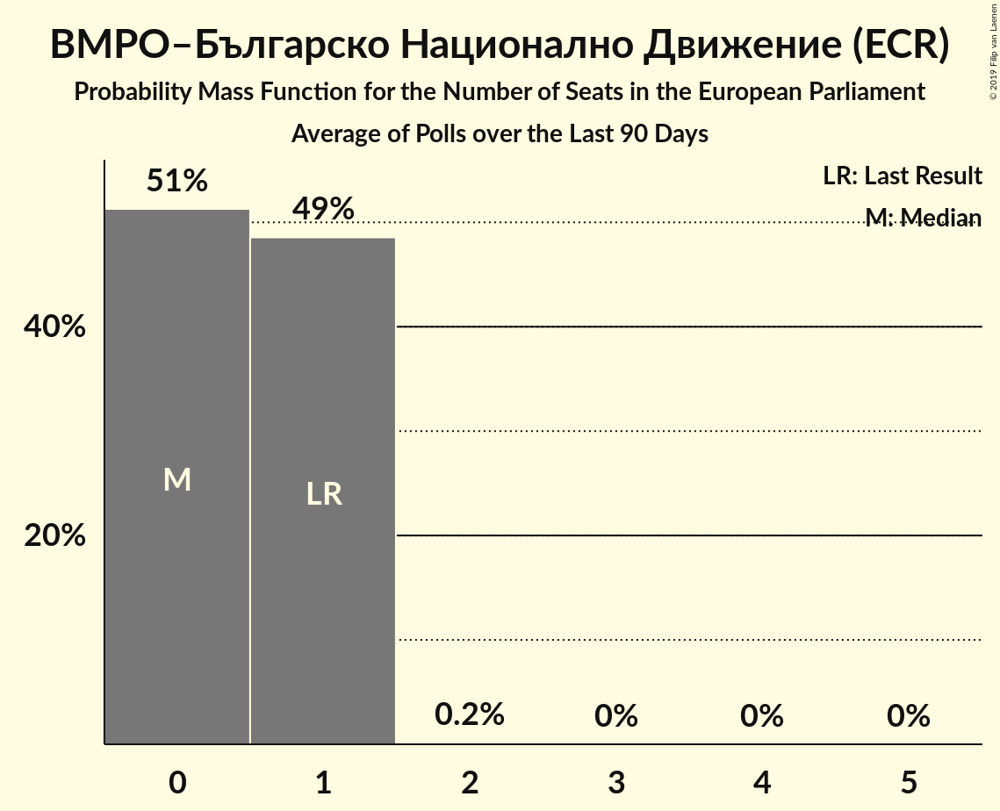

# ВМРО–Българско Национално Движение (ECR)

<a href="#voting-intentions">Voting Intentions</a> | <a href="#seats">Seats</a>

## Voting Intentions

Last result: **10.7%** (General Election of 26 May 2019)

### Confidence Intervals

| Period     | Polling firm/Commissioner(s) | Median | 80% Confidence Interval | 90% Confidence Interval | 95% Confidence Interval | 99% Confidence Interval |
|:----------:|:----------------:|:-----------:|:-----------------------:|:-----------------------:|:-----------------------:|:-----------------------:|
| N/A | [Poll Average](average.html) | 6.9% | 5.7–8.4% | 5.3–8.8% | 5.1–9.2% | 4.5–10.0% |
| [3–10 August 2020](2020-08-10-Тренд.html) | Тренд   24 часа | 0.0% | N/A | N/A | N/A | N/A |
| [30 July–7 August 2020](2020-08-07-GallupInternational.html) | Gallup International | 0.0% | N/A | N/A | N/A | N/A |
| [28 July–3 August 2020](2020-08-03-МаркетЛИНКС.html) | Маркет ЛИНКС | 0.0% | N/A | N/A | N/A | N/A |
| [23–30 July 2020](2020-07-30-Алфарисърч.html) | Алфа рисърч   Дневник | 0.0% | N/A | N/A | N/A | N/A |
| [26 June–1 July 2020](2020-07-01-SovaHarris.html) | Sova Harris | 6.8% | 5.7–8.4% | 5.3–8.8% | 5.0–9.2% | 4.5–10.0% |
| [27 May–3 June 2020](2020-06-03-МаркетЛИНКС.html) | Маркет ЛИНКС | 3.7% | 3.0–4.7% | 2.8–5.0% | 2.6–5.2% | 2.3–5.7% |
| [28 April–5 May 2020](2020-05-05-Алфарисърч.html) | Алфа рисърч   Дневник | 0.0% | N/A | N/A | N/A | N/A |
| [3–10 February 2020](2020-02-10-Тренд.html) | Тренд   24 часа | 4.2% | 3.3–5.4% | 3.1–5.7% | 2.9–6.1% | 2.5–6.7% |
| [5–12 December 2019](2019-12-12-Алфарисърч.html) | Алфа рисърч | 0.0% | N/A | N/A | N/A | N/A |
| [21–28 November 2019](2019-11-28-МаркетЛИНКС.html) | Маркет ЛИНКС | 0.0% | N/A | N/A | N/A | N/A |
| [7–15 November 2019](2019-11-15-Тренд.html) | Тренд | 5.2% | 4.3–6.6% | 4.0–6.9% | 3.8–7.3% | 3.4–7.9% |
| [10–16 September 2019](2019-09-16-Алфарисърч.html) | Алфа рисърч | 0.0% | N/A | N/A | N/A | N/A |
| [5–12 July 2019](2019-07-12-Тренд.html) | Тренд   24 часа | 5.9% | 4.8–7.3% | 4.5–7.7% | 4.3–8.0% | 3.8–8.7% |
| [11–19 June 2019](2019-06-19-МаркетЛИНКС.html) | Маркет ЛИНКС | 0.0% | N/A | N/A | N/A | N/A |

### Probability Mass Function

The following table shows the probability mass function per percentage block of voting intentions for the [poll average](average.html) for ВМРО–Българско Национално Движение (ECR).

| Voting Intentions | Probability | Accumulated | Special Marks |
|:-----------------:|:-----------:|:-----------:|:-------------:|
| 2.5–3.5% | 0% | 100% |  |
| 3.5–4.5% | 0.5% | 100% |  |
| 4.5–5.5% | 7% | 99.5% |  |
| 5.5–6.5% | 27% | 92% |  |
| 6.5–7.5% | 35% | 65% | Median |
| 7.5–8.5% | 21% | 29% |  |
| 8.5–9.5% | 7% | 8% |  |
| 9.5–10.5% | 1.2% | 1.3% |  |
| 10.5–11.5% | 0.1% | 0.1% | Last Result |
| 11.5–12.5% | 0% | 0% |  |

## Seats

Last result: **1** seats (General Election of 26 May 2019)

### Confidence Intervals

| Period     | Polling firm/Commissioner(s) | Median | 80% Confidence Interval | 90% Confidence Interval | 95% Confidence Interval | 99% Confidence Interval |
|:----------:|:----------------:|:------:|:-----------------------:|:-----------------------:|:-----------------------:|:-----------------------:|
| N/A | [Poll Average](average.html) | 2 | 1–2 | 1–2 | 1–2 | 0–2 |
| [3–10 August 2020](2020-08-10-Тренд.html) | Тренд   24 часа |  |  |  |  |  |
| [30 July–7 August 2020](2020-08-07-GallupInternational.html) | Gallup International |  |  |  |  |  |
| [28 July–3 August 2020](2020-08-03-МаркетЛИНКС.html) | Маркет ЛИНКС |  |  |  |  |  |
| [23–30 July 2020](2020-07-30-Алфарисърч.html) | Алфа рисърч   Дневник |  |  |  |  |  |
| [26 June–1 July 2020](2020-07-01-SovaHarris.html) | Sova Harris | 2 | 1–2 | 1–2 | 1–2 | 0–2 |
| [27 May–3 June 2020](2020-06-03-МаркетЛИНКС.html) | Маркет ЛИНКС | 0 | 0 | 0 | 0–1 | 0–1 |
| [28 April–5 May 2020](2020-05-05-Алфарисърч.html) | Алфа рисърч   Дневник |  |  |  |  |  |
| [3–10 February 2020](2020-02-10-Тренд.html) | Тренд   24 часа | 0 | 0–1 | 0–1 | 0–1 | 0–1 |
| [5–12 December 2019](2019-12-12-Алфарисърч.html) | Алфа рисърч |  |  |  |  |  |
| [21–28 November 2019](2019-11-28-МаркетЛИНКС.html) | Маркет ЛИНКС |  |  |  |  |  |
| [7–15 November 2019](2019-11-15-Тренд.html) | Тренд | 1 | 0–1 | 0–1 | 0–1 | 0–2 |
| [10–16 September 2019](2019-09-16-Алфарисърч.html) | Алфа рисърч |  |  |  |  |  |
| [5–12 July 2019](2019-07-12-Тренд.html) | Тренд   24 часа | 1 | 0–1 | 0–2 | 0–2 | 0–2 |
| [11–19 June 2019](2019-06-19-МаркетЛИНКС.html) | Маркет ЛИНКС |  |  |  |  |  |

### Probability Mass Function

The following table shows the probability mass function per seat for the [poll average](average.html) for ВМРО–Българско Национално Движение (ECR).

| Number of Seats | Probability | Accumulated | Special Marks |
|:---------------:|:-----------:|:-----------:|:-------------:|
| 0 | 2% | 100% |  |
| 1 | 38% | 98% | Last Result |
| 2 | 60% | 60% | Median |
| 3 | 0% | 0% |  |

