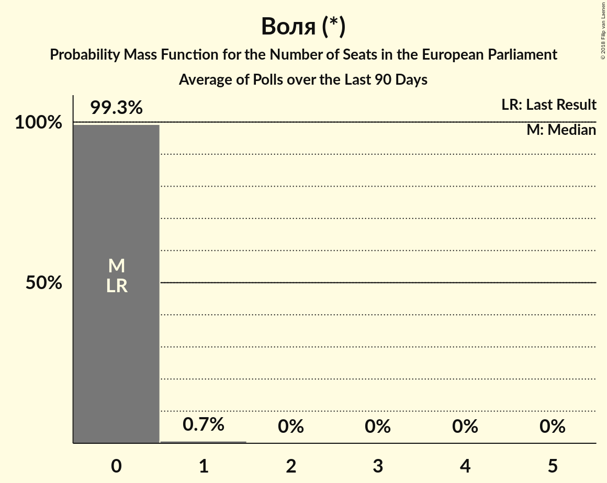

# Воля (*)

<a href="#voting-intentions">Voting Intentions</a> | <a href="#seats">Seats</a>

## Voting Intentions

Last result: **0.0%** (General Election of 25 May 2014)

### Confidence Intervals

| Period     | Polling firm/Commissioner(s) | Median | 80% Confidence Interval | 90% Confidence Interval | 95% Confidence Interval | 99% Confidence Interval |
|:----------:|:----------------:|:-----------:|:-----------------------:|:-----------------------:|:-----------------------:|:-----------------------:|
| N/A | [Poll Average](average.html) | 2.4% | 1.7–4.2% | 1.5–4.6% | 1.4–4.9% | 1.2–5.4% |
| [14–18 December 2018](2018-12-18-Алфарисърч.html) | Алфа рисърч | 4.0% | 3.3–4.9% | 3.1–5.2% | 3.0–5.4% | 2.7–5.8% |
| [16–25 November 2018](2018-11-25-МаркетЛИНКС.html) | Маркет ЛИНКС | 2.0% | 1.5–2.7% | 1.4–2.9% | 1.3–3.1% | 1.1–3.4% |
| [6–12 November 2018](2018-11-12-Тренд.html) | Тренд   24 часа | 2.3% | 1.7–3.3% | 1.5–3.6% | 1.4–3.9% | 1.1–4.4% |
| [25 September–5 October 2018](2018-10-05-Exacta.html) | Exacta | 2.0% | 1.5–2.7% | 1.4–2.9% | 1.3–3.1% | 1.1–3.4% |
| [23–30 September 2018](2018-09-30-Алфарисърч.html) | Алфа рисърч | 3.2% | 2.5–4.3% | 2.3–4.6% | 2.1–4.9% | 1.8–5.5% |
| [8–14 September 2018](2018-09-14-SovaHarris.html) | Sova Harris   БГНЕС | 2.0% | 1.5–2.7% | 1.4–2.9% | 1.3–3.1% | 1.1–3.4% |
| [4–11 September 2018](2018-09-11-Тренд.html) | Тренд   24 часа | 2.4% | 1.8–3.3% | 1.6–3.6% | 1.4–3.9% | 1.2–4.4% |
| [1–6 July 2018](2018-07-06-Медиана.html) | Медиана | 2.7% | 2.1–3.6% | 1.9–3.8% | 1.8–4.1% | 1.5–4.5% |
| [17 May–25 June 2018](2018-06-25-Алфарисърч.html) | Алфа рисърч | 3.3% | 2.6–4.4% | 2.4–4.7% | 2.2–5.0% | 1.9–5.5% |
| [1–9 June 2018](2018-06-09-Тренд.html) | Тренд   24 часа | 3.0% | 2.3–4.1% | 2.1–4.4% | 1.9–4.6% | 1.6–5.2% |
| [2–10 May 2018](2018-05-10-Тренд.html) | Тренд   24 часа | 2.7% | 2.1–3.8% | 1.9–4.1% | 1.7–4.3% | 1.4–4.9% |
| [1–7 March 2018](2018-03-07-Тренд.html) | Тренд   24 часа | 2.6% | 2.0–3.7% | 1.8–4.0% | 1.6–4.3% | 1.4–4.8% |
| [10–18 January 2018](2018-01-18-Тренд.html) | Тренд   24 часа | 2.6% | 2.0–3.7% | 1.8–4.0% | 1.6–4.2% | 1.4–4.8% |
| [7–13 December 2017](2017-12-13-Exacta.html) | Exacta | 2.7% | 2.0–3.7% | 1.8–3.9% | 1.7–4.2% | 1.4–4.7% |

### Probability Mass Function

The following table shows the probability mass function per percentage block of voting intentions for the [poll average](average.html) for Воля (*).

| Voting Intentions | Probability | Accumulated | Special Marks |
|:-----------------:|:-----------:|:-----------:|:-------------:|
| 0.0–0.5% | 0% | 100% | Last Result |
| 0.5–1.5% | 7% | 100% |  |
| 1.5–2.5% | 50% | 93% | Median |
| 2.5–3.5% | 22% | 44% |  |
| 3.5–4.5% | 16% | 22% |  |
| 4.5–5.5% | 5% | 5% |  |
| 5.5–6.5% | 0.3% | 0.4% |  |
| 6.5–7.5% | 0% | 0% |  |

## Seats

Last result: **0** seats (General Election of 25 May 2014)

### Confidence Intervals

| Period     | Polling firm/Commissioner(s) | Median | 80% Confidence Interval | 90% Confidence Interval | 95% Confidence Interval | 99% Confidence Interval |
|:----------:|:----------------:|:------:|:-----------------------:|:-----------------------:|:-----------------------:|:-----------------------:|
| N/A | [Poll Average](average.html) | 0 | 0 | 0 | 0 | 0–1 |
| [14–18 December 2018](2018-12-18-Алфарисърч.html) | Алфа рисърч | 0 | 0 | 0–1 | 0–1 | 0–1 |
| [16–25 November 2018](2018-11-25-МаркетЛИНКС.html) | Маркет ЛИНКС | 0 | 0 | 0 | 0 | 0 |
| [6–12 November 2018](2018-11-12-Тренд.html) | Тренд   24 часа | 0 | 0 | 0 | 0 | 0 |
| [25 September–5 October 2018](2018-10-05-Exacta.html) | Exacta | 0 | 0 | 0 | 0 | 0 |
| [23–30 September 2018](2018-09-30-Алфарисърч.html) | Алфа рисърч | 0 | 0 | 0 | 0 | 0–1 |
| [8–14 September 2018](2018-09-14-SovaHarris.html) | Sova Harris   БГНЕС | 0 | 0 | 0 | 0 | 0 |
| [4–11 September 2018](2018-09-11-Тренд.html) | Тренд   24 часа | 0 | 0 | 0 | 0 | 0 |
| [1–6 July 2018](2018-07-06-Медиана.html) | Медиана | 0 | 0 | 0 | 0 | 0 |
| [17 May–25 June 2018](2018-06-25-Алфарисърч.html) | Алфа рисърч | 0 | 0 | 0 | 0 | 0–1 |
| [1–9 June 2018](2018-06-09-Тренд.html) | Тренд   24 часа | 0 | 0 | 0 | 0 | 0–1 |
| [2–10 May 2018](2018-05-10-Тренд.html) | Тренд   24 часа | 0 | 0 | 0 | 0 | 0 |
| [1–7 March 2018](2018-03-07-Тренд.html) | Тренд   24 часа | 0 | 0 | 0 | 0 | 0 |
| [10–18 January 2018](2018-01-18-Тренд.html) | Тренд   24 часа | 0 | 0 | 0 | 0 | 0 |
| [7–13 December 2017](2017-12-13-Exacta.html) | Exacta | 0 | 0 | 0 | 0 | 0 |

### Probability Mass Function

The following table shows the probability mass function per seat for the [poll average](average.html) for Воля (*).

| Number of Seats | Probability | Accumulated | Special Marks |
|:---------------:|:-----------:|:-----------:|:-------------:|
| 0 | 98% | 100% | Last Result, Median |
| 1 | 2% | 2% |  |
| 2 | 0% | 0% |  |

