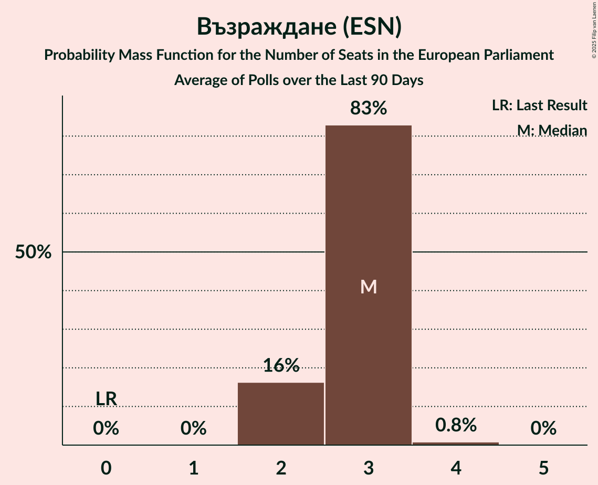

# Възраждане (ESN)

<a href="#voting-intentions">Voting Intentions</a> | <a href="#seats">Seats</a>

## Voting Intentions

Last result: **0.0%** (General Election of 9 June 2024)

### Confidence Intervals

| Period     | Polling firm/Commissioner(s) | Median | 80% Confidence Interval | 90% Confidence Interval | 95% Confidence Interval | 99% Confidence Interval |
|:----------:|:----------------:|:-----------:|:-----------------------:|:-----------------------:|:-----------------------:|:-----------------------:|
| N/A | [Poll Average](average.html) | 14.2% | 12.7–15.8% | 12.3–16.3% | 11.9–16.7% | 11.3–17.6% |
| [8–12 January 2025](2025-01-12-GallupInternational.html) | Gallup International | 14.2% | 12.8–15.9% | 12.3–16.4% | 12.0–16.9% | 11.3–17.7% |
| [12–20 December 2024](2024-12-20-МаркетЛИНКС.html) | Маркет ЛИНКС   bTV | 14.1% | 12.7–15.7% | 12.2–16.2% | 11.9–16.6% | 11.2–17.4% |
| [20–23 October 2024](2024-10-23-Алфарисърч.html) | Алфа рисърч | 14.2% | 12.9–15.7% | 12.5–16.1% | 12.2–16.5% | 11.6–17.3% |
| [16–22 October 2024](2024-10-22-Тренд.html) | Тренд   24 часа | 15.2% | 13.8–16.7% | 13.4–17.1% | 13.1–17.5% | 12.4–18.3% |
| [19–22 October 2024](2024-10-22-Exacta.html) | Exacta | 14.3% | 13.0–15.8% | 12.6–16.2% | 12.3–16.5% | 11.7–17.3% |
| [10–21 October 2024](2024-10-21-GallupInternational.html) | Gallup International   BNR | 14.9% | 13.5–16.4% | 13.2–16.9% | 12.8–17.2% | 12.2–18.0% |
| [15–20 October 2024](2024-10-20-МаркетЛИНКС.html) | Маркет ЛИНКС   bTV | 14.9% | 13.5–16.4% | 13.2–16.8% | 12.8–17.2% | 12.2–18.0% |
| [11–17 October 2024](2024-10-17-SovaHarris.html) | Sova Harris   ПИК | 14.5% | 13.0–16.2% | 12.6–16.7% | 12.2–17.1% | 11.5–18.0% |
| [8–13 October 2024](2024-10-13-Медиана.html) | Медиана | 15.4% | 14.0–17.0% | 13.6–17.5% | 13.3–17.8% | 12.7–18.6% |
| [28 September–6 October 2024](2024-10-06-GallupInternational.html) | Gallup International | 15.4% | 13.9–17.1% | 13.4–17.6% | 13.0–18.0% | 12.3–18.9% |
| [25 September–1 October 2024](2024-10-01-МаркетЛИНКС.html) | Маркет ЛИНКС   bTV | 15.5% | 14.1–17.1% | 13.7–17.5% | 13.4–17.9% | 12.8–18.7% |
| [17–24 September 2024](2024-09-24-Тренд.html) | Тренд   24 часа | 15.6% | 14.2–17.1% | 13.8–17.5% | 13.4–17.9% | 12.8–18.7% |
| [18–24 September 2024](2024-09-24-Алфарисърч.html) | Алфа рисърч | 15.4% | 14.0–16.9% | 13.6–17.4% | 13.3–17.8% | 12.7–18.5% |
| [14–23 August 2024](2024-08-23-МаркетЛИНКС.html) | Маркет ЛИНКС   bTV | 13.7% | 12.4–15.1% | 12.0–15.5% | 11.7–15.9% | 11.1–16.6% |
| [1–9 August 2024](2024-08-09-GallupInternational.html) | Gallup International   БНТ | 14.2% | 12.7–15.9% | 12.3–16.4% | 12.0–16.8% | 11.3–17.6% |
| [20–28 July 2024](2024-07-28-МаркетЛИНКС.html) | Маркет ЛИНКС | 11.0% | N/A | N/A | N/A | N/A |

### Probability Mass Function

The following table shows the probability mass function per percentage block of voting intentions for the [poll average](average.html) for Възраждане (ESN).

| Voting Intentions | Probability | Accumulated | Special Marks |
|:-----------------:|:-----------:|:-----------:|:-------------:|
| 0.0–0.5% | 0% | 100% | Last Result |
| 0.5–1.5% | 0% | 100% |  |
| 1.5–2.5% | 0% | 100% |  |
| 2.5–3.5% | 0% | 100% |  |
| 3.5–4.5% | 0% | 100% |  |
| 4.5–5.5% | 0% | 100% |  |
| 5.5–6.5% | 0% | 100% |  |
| 6.5–7.5% | 0% | 100% |  |
| 7.5–8.5% | 0% | 100% |  |
| 8.5–9.5% | 0% | 100% |  |
| 9.5–10.5% | 0.1% | 100% |  |
| 10.5–11.5% | 1.0% | 99.9% |  |
| 11.5–12.5% | 7% | 99.0% |  |
| 12.5–13.5% | 21% | 92% |  |
| 13.5–14.5% | 32% | 71% | Median |
| 14.5–15.5% | 25% | 39% |  |
| 15.5–16.5% | 11% | 15% |  |
| 16.5–17.5% | 3% | 3% |  |
| 17.5–18.5% | 0.5% | 0.5% |  |
| 18.5–19.5% | 0% | 0.1% |  |
| 19.5–20.5% | 0% | 0% |  |

## Seats

Last result: **0** seats (General Election of 9 June 2024)

### Confidence Intervals

| Period     | Polling firm/Commissioner(s) | Median | 80% Confidence Interval | 90% Confidence Interval | 95% Confidence Interval | 99% Confidence Interval |
|:----------:|:----------------:|:------:|:-----------------------:|:-----------------------:|:-----------------------:|:-----------------------:|
| N/A | [Poll Average](average.html) | 3 | 2–3 | 2–3 | 2–3 | 2–4 |
| [8–12 January 2025](2025-01-12-GallupInternational.html) | Gallup International | 3 | 3 | 2–3 | 2–4 | 2–4 |
| [12–20 December 2024](2024-12-20-МаркетЛИНКС.html) | Маркет ЛИНКС   bTV | 3 | 2–3 | 2–3 | 2–3 | 2–3 |
| [20–23 October 2024](2024-10-23-Алфарисърч.html) | Алфа рисърч | 3 | 2–3 | 2–3 | 2–3 | 2–4 |
| [16–22 October 2024](2024-10-22-Тренд.html) | Тренд   24 часа | 3 | 3 | 3 | 3–4 | 2–4 |
| [19–22 October 2024](2024-10-22-Exacta.html) | Exacta | 3 | 2–3 | 2–3 | 2–3 | 2–4 |
| [10–21 October 2024](2024-10-21-GallupInternational.html) | Gallup International   BNR | 3 | 3 | 3 | 3 | 2–4 |
| [15–20 October 2024](2024-10-20-МаркетЛИНКС.html) | Маркет ЛИНКС   bTV | 3 | 3 | 3 | 3 | 2–4 |
| [11–17 October 2024](2024-10-17-SovaHarris.html) | Sova Harris   ПИК | 3 | 3 | 2–3 | 2–3 | 2–4 |
| [8–13 October 2024](2024-10-13-Медиана.html) | Медиана | 3 | 3 | 3 | 2–4 | 2–4 |
| [28 September–6 October 2024](2024-10-06-GallupInternational.html) | Gallup International | 3 | 3–4 | 3–4 | 3–4 | 2–4 |
| [25 September–1 October 2024](2024-10-01-МаркетЛИНКС.html) | Маркет ЛИНКС   bTV | 3 | 3 | 3 | 3 | 2–4 |
| [17–24 September 2024](2024-09-24-Тренд.html) | Тренд   24 часа | 3 | 3 | 3–4 | 3–4 | 2–4 |
| [18–24 September 2024](2024-09-24-Алфарисърч.html) | Алфа рисърч | 3 | 3–4 | 3–4 | 3–4 | 3–4 |
| [14–23 August 2024](2024-08-23-МаркетЛИНКС.html) | Маркет ЛИНКС   bTV | 3 | 2–3 | 2–3 | 2–3 | 2–3 |
| [1–9 August 2024](2024-08-09-GallupInternational.html) | Gallup International   БНТ | 3 | 2–3 | 2–3 | 2–3 | 2–3 |
| [20–28 July 2024](2024-07-28-МаркетЛИНКС.html) | Маркет ЛИНКС |  |  |  |  |  |

### Probability Mass Function

The following table shows the probability mass function per seat for the [poll average](average.html) for Възраждане (ESN).

| Number of Seats | Probability | Accumulated | Special Marks |
|:---------------:|:-----------:|:-----------:|:-------------:|
| 0 | 0% | 100% | Last Result |
| 1 | 0% | 100% |  |
| 2 | 21% | 100% |  |
| 3 | 77% | 79% | Median |
| 4 | 2% | 2% |  |
| 5 | 0% | 0% |  |

