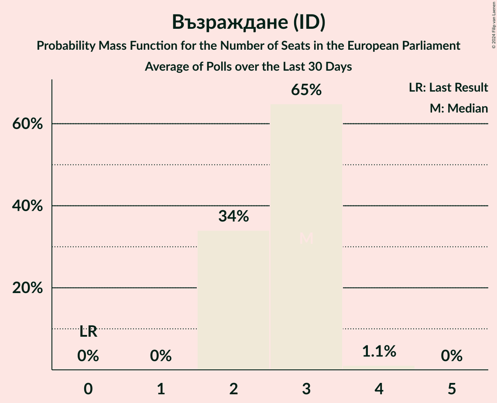

# Възраждане (ID)

<a href="#voting-intentions">Voting Intentions</a> | <a href="#seats">Seats</a>

## Voting Intentions

Last result: **0.0%** (General Election of 26 May 2019)

### Confidence Intervals

| Period     | Polling firm/Commissioner(s) | Median | 80% Confidence Interval | 90% Confidence Interval | 95% Confidence Interval | 99% Confidence Interval |
|:----------:|:----------------:|:-----------:|:-----------------------:|:-----------------------:|:-----------------------:|:-----------------------:|
| N/A | [Poll Average](average.html) | 13.7% | 12.3–15.1% | 11.9–15.6% | 11.6–15.9% | 11.0–16.7% |
| [26 September–8 October 2023](2023-10-08-МаркетЛИНКС.html) | Маркет ЛИНКС   bTV | 13.6% | 12.3–15.1% | 11.9–15.6% | 11.6–15.9% | 11.0–16.7% |
| [2–8 September 2023](2023-09-08-Тренд.html) | Тренд   24 часа | 17.2% | 15.7–18.9% | 15.3–19.3% | 14.9–19.7% | 14.2–20.6% |
| [11–18 August 2023](2023-08-18-МаркетЛИНКС.html) | Маркет ЛИНКС   bTV | 13.2% | 11.9–14.7% | 11.6–15.1% | 11.3–15.5% | 10.7–16.2% |
| [18–24 July 2023](2023-07-24-Медиана.html) | Медиана | 17.0% | 15.5–18.6% | 15.1–19.1% | 14.8–19.5% | 14.1–20.3% |
| [4–11 July 2023](2023-07-11-Тренд.html) | Тренд   24 часа | 16.5% | 15.0–18.2% | 14.6–18.6% | 14.3–19.1% | 13.6–19.9% |
| [29 June–9 July 2023](2023-07-09-GallupInternational.html) | Gallup International | 15.0% | 13.4–16.7% | 13.0–17.2% | 12.7–17.6% | 12.0–18.4% |
| [3–7 July 2023](2023-07-07-Центързаанализиимаркетинг.html) | Център за анализи и маркетинг | 15.1% | 13.7–16.6% | 13.3–17.1% | 13.0–17.5% | 12.3–18.2% |
| [22 June–2 July 2023](2023-07-02-МаркетЛИНКС.html) | Маркет ЛИНКС   bTV | 14.5% | N/A | N/A | N/A | N/A |
| [20–26 June 2023](2023-06-26-Алфарисърч.html) | Алфа рисърч | 16.0% | 14.5–17.6% | 14.1–18.0% | 13.8–18.4% | 13.1–19.2% |
| [12–20 June 2023](2023-06-20-Exacta.html) | Exacta | 15.7% | 14.3–17.3% | 13.9–17.8% | 13.6–18.2% | 12.9–18.9% |
| [10–16 June 2023](2023-06-16-Тренд.html) | Тренд   24 часа | 16.3% | 14.9–17.9% | 14.4–18.4% | 14.1–18.8% | 13.4–19.6% |
| [27 April–5 May 2023](2023-05-05-GallupInternational.html) | Gallup International | 14.7% | 13.2–16.4% | 12.8–16.9% | 12.4–17.3% | 11.7–18.2% |
| [17–22 March 2023](2023-03-22-Медиана.html) | Медиана | 14.5% | 13.2–16.1% | 12.8–16.5% | 12.5–16.9% | 11.8–17.6% |
| [16–19 March 2023](2023-03-19-Центързаанализиимаркетинг.html) | Център за анализи и маркетинг | 12.6% | 11.3–14.0% | 10.9–14.4% | 10.6–14.8% | 10.0–15.5% |
| [7–14 March 2023](2023-03-14-Nasoca.html) | Nasoca | 12.8% | 11.6–14.1% | 11.2–14.5% | 10.9–14.8% | 10.4–15.5% |
| [6–12 March 2023](2023-03-12-Тренд.html) | Тренд   24 часа | 12.9% | 11.6–14.4% | 11.2–14.8% | 10.9–15.2% | 10.3–16.0% |
| [24 February–3 March 2023](2023-03-03-GallupInternational.html) | Gallup International | 12.3% | 11.1–13.7% | 10.7–14.1% | 10.4–14.5% | 9.8–15.2% |
| [21–27 February 2023](2023-02-27-Алфарисърч.html) | Алфа рисърч | 11.3% | 10.1–12.7% | 9.8–13.1% | 9.5–13.4% | 9.0–14.1% |
| [20–27 February 2023](2023-02-27-SovaHarris.html) | Sova Harris | 10.7% | 9.5–12.1% | 9.2–12.4% | 8.9–12.8% | 8.4–13.5% |
| [19–24 February 2023](2023-02-24-Медиана.html) | Медиана | 13.3% | 12.0–14.9% | 11.6–15.3% | 11.3–15.7% | 10.7–16.5% |
| [2–12 February 2023](2023-02-12-GallupInternational.html) | Gallup International | 12.3% | 10.9–13.9% | 10.5–14.3% | 10.2–14.7% | 9.5–15.5% |
| [4–11 February 2023](2023-02-11-Тренд.html) | Тренд   24 часа | 12.5% | 11.2–13.9% | 10.9–14.3% | 10.6–14.7% | 10.0–15.4% |
| [30 January–4 February 2023](2023-02-04-Exacta.html) | Exacta | 10.3% | 9.2–11.6% | 8.9–11.9% | 8.6–12.3% | 8.1–12.9% |
| [10–20 December 2022](2022-12-20-МаркетЛИНКС.html) | Маркет ЛИНКС   bTV | 10.0% | N/A | N/A | N/A | N/A |
| [1–13 December 2022](2022-12-13-Алфарисърч.html) | Алфа рисърч | 11.8% | 10.6–13.2% | 10.3–13.6% | 10.0–14.0% | 9.4–14.6% |
| [5–12 December 2022](2022-12-12-Exacta.html) | Exacta | 9.4% | 8.4–10.7% | 8.1–11.0% | 7.8–11.4% | 7.3–12.0% |
| [1–8 December 2022](2022-12-08-Тренд.html) | Тренд   24 часа | 11.3% | 10.2–12.7% | 9.8–13.1% | 9.5–13.5% | 9.0–14.1% |
| [27–29 September 2022](2022-09-29-Алфарисърч.html) | Алфа рисърч | 11.0% | 9.9–12.4% | 9.5–12.8% | 9.3–13.1% | 8.7–13.8% |
| [21–27 September 2022](2022-09-27-Тренд.html) | Тренд   24 часа | 11.1% | 9.9–12.5% | 9.6–12.8% | 9.3–13.2% | 8.7–13.9% |
| [20–27 September 2022](2022-09-27-GallupInternational.html) | Gallup International | 12.8% | 11.5–14.2% | 11.2–14.6% | 10.9–15.0% | 10.3–15.7% |
| [17–23 September 2022](2022-09-23-МаркетЛИНКС.html) | Маркет ЛИНКС   24 часа | 8.7% | N/A | N/A | N/A | N/A |
| [10–17 September 2022](2022-09-17-Exacta.html) | Exacta | 9.5% | 8.4–10.8% | 8.1–11.1% | 7.9–11.5% | 7.4–12.1% |
| [10–17 September 2022](2022-09-17-Estat.html) | Estat | 10.1% | 9.0–11.5% | 8.7–11.8% | 8.4–12.2% | 7.9–12.8% |
| [6–12 September 2022](2022-09-12-SovaHarris.html) | Sova Harris   Dir.bg | 10.4% | 9.2–11.9% | 8.8–12.3% | 8.5–12.7% | 8.0–13.4% |
| [2–10 September 2022](2022-09-10-GallupInternational.html) | Gallup International | 11.3% | 10.1–12.7% | 9.7–13.0% | 9.5–13.4% | 8.9–14.1% |
| [29 August–4 September 2022](2022-09-04-Медиана.html) | Медиана | 12.5% | 11.2–13.9% | 10.9–14.3% | 10.6–14.7% | 10.0–15.4% |
| [27 August–3 September 2022](2022-09-03-МаркетЛИНКС.html) | Маркет ЛИНКС   bTV | 7.6% | 6.6–8.7% | 6.4–9.1% | 6.1–9.3% | 5.7–9.9% |
| [27 August–2 September 2022](2022-09-02-Алфарисърч.html) | Алфа рисърч | 10.3% | 9.2–11.6% | 8.9–11.9% | 8.6–12.2% | 8.2–12.8% |
| [15–22 August 2022](2022-08-22-Тренд.html) | Тренд   24 часа | 10.3% | 9.2–11.7% | 8.9–12.0% | 8.6–12.4% | 8.1–13.0% |
| [30 July–5 August 2022](2022-08-05-МаркетЛИНКС.html) | Маркет ЛИНКС   bTV | 9.1% | 8.0–10.4% | 7.8–10.7% | 7.5–11.1% | 7.0–11.7% |
| [5–12 July 2022](2022-07-12-Тренд.html) | Тренд   24 часа | 9.6% | N/A | N/A | N/A | N/A |
| [2–10 July 2022](2022-07-10-МаркетЛИНКС.html) | Маркет ЛИНКС   bTV | 7.6% | 6.6–8.8% | 6.4–9.1% | 6.1–9.4% | 5.7–10.0% |
| [25 June–1 July 2022](2022-07-01-Алфарисърч.html) | Алфа рисърч | 8.8% | 7.7–10.0% | 7.4–10.3% | 7.2–10.7% | 6.7–11.3% |
| [4–11 May 2022](2022-05-11-Тренд.html) | Тренд   24 часа | 10.0% | N/A | N/A | N/A | N/A |
| [4–9 May 2022](2022-05-09-Центързаанализиимаркетинг.html) | Център за анализи и маркетинг | 8.6% | 7.5–10.0% | 7.2–10.4% | 6.9–10.8% | 6.4–11.5% |
| [29 April–8 May 2022](2022-05-08-МаркетЛИНКС.html) | Маркет ЛИНКС   bTV | 9.7% | 8.6–11.1% | 8.3–11.4% | 8.1–11.7% | 7.6–12.4% |
| [29 April–6 May 2022](2022-05-06-Gallup.html) | Gallup | 10.6% | 9.3–12.1% | 8.9–12.5% | 8.6–12.9% | 8.0–13.6% |
| [8–14 April 2022](2022-04-14-Алфарисърч.html) | Алфа рисърч | 10.8% | 9.6–12.1% | 9.3–12.5% | 9.1–12.8% | 8.5–13.5% |
| [6–13 April 2022](2022-04-13-Тренд.html) | Тренд   24 часа | 9.3% | N/A | N/A | N/A | N/A |
| [31 March–8 April 2022](2022-04-08-Gallup.html) | Gallup | 7.9% | N/A | N/A | N/A | N/A |
| [22–29 March 2022](2022-03-29-МаркетЛИНКС.html) | Маркет ЛИНКС   bTV | 8.2% | N/A | N/A | N/A | N/A |
| [5–12 March 2022](2022-03-12-Тренд.html) | Тренд   24 часа | 7.3% | N/A | N/A | N/A | N/A |
| [6–14 February 2022](2022-02-14-Алфарисърч.html) | Алфа рисърч | 6.4% | N/A | N/A | N/A | N/A |
| [3–11 February 2022](2022-02-11-Gallup.html) | Gallup | 3.9% | N/A | N/A | N/A | N/A |
| [12–19 January 2022](2022-01-19-Тренд.html) | Тренд   24 часа | 6.0% | N/A | N/A | N/A | N/A |
| [10–17 October 2021](2021-10-17-Gallup.html) | Gallup   BNR | 2.9% | N/A | N/A | N/A | N/A |
| [5–12 October 2021](2021-10-12-SovaHarris.html) | Sova Harris   Dir.bg | 2.0% | N/A | N/A | N/A | N/A |
| [6–12 October 2021](2021-10-12-Exacta.html) | Exacta | 1.8% | N/A | N/A | N/A | N/A |
| [6–10 October 2021](2021-10-10-Центързаанализиимаркетинг.html) | Център за анализи и маркетинг | 1.8% | N/A | N/A | N/A | N/A |
| [4–10 October 2021](2021-10-10-Алфарисърч.html) | Алфа рисърч | 3.0% | N/A | N/A | N/A | N/A |
| [21–26 September 2021](2021-09-26-Gallup.html) | Gallup | 3.3% | N/A | N/A | N/A | N/A |
| [14–20 September 2021](2021-09-20-МаркетЛИНКС.html) | Маркет ЛИНКС   bTV | 3.4% | N/A | N/A | N/A | N/A |
| [8–15 September 2021](2021-09-15-Тренд.html) | Тренд | 3.0% | N/A | N/A | N/A | N/A |
| [8–15 September 2021](2021-09-15-Алфарисърч.html) | Алфа рисърч | 3.8% | N/A | N/A | N/A | N/A |
| [2–10 September 2021](2021-09-10-Gallup.html) | Gallup | 3.2% | N/A | N/A | N/A | N/A |
| [13–22 August 2021](2021-08-22-МаркетЛИНКС.html) | Маркет ЛИНКС   bTV | 4.7% | N/A | N/A | N/A | N/A |
| [23–30 July 2021](2021-07-30-Тренд.html) | Тренд   24 часа | 2.9% | 2.5–3.5% | 2.3–3.6% | 2.3–3.7% | 2.1–4.0% |
| [21–28 July 2021](2021-07-28-МаркетЛИНКС.html) | Маркет ЛИНКС   bTV | 4.3% | N/A | N/A | N/A | N/A |
| [3–7 July 2021](2021-07-07-Тренд.html) | Тренд   Nova | 3.1% | 2.3–4.4% | 2.1–4.7% | 1.9–5.0% | 1.6–5.7% |
| [4–7 July 2021](2021-07-07-Алфарисърч.html) | Алфа рисърч | 3.2% | 2.3–4.4% | 2.1–4.8% | 1.9–5.1% | 1.6–5.8% |
| [30 June–7 July 2021](2021-07-07-Gallup.html) | Gallup   BNR | 3.2% | 2.4–4.4% | 2.1–4.8% | 2.0–5.1% | 1.6–5.8% |
| [2–6 July 2021](2021-07-06-SovaHarris.html) | Sova Harris   Dir.bg | 0.0% | N/A | N/A | N/A | N/A |
| [1–5 July 2021](2021-07-05-Exacta.html) | Exacta | 2.7% | 2.0–3.9% | 1.8–4.3% | 1.6–4.6% | 1.3–5.2% |
| [26 June–2 July 2021](2021-07-02-Медиана.html) | Медиана | 2.2% | 1.7–2.9% | 1.5–3.1% | 1.4–3.3% | 1.2–3.7% |
| [23–30 June 2021](2021-06-30-Nasoca.html) | Nasoca | 2.3% | 1.6–3.4% | 1.5–3.7% | 1.3–4.0% | 1.1–4.5% |
| [18–25 June 2021](2021-06-25-МаркетЛИНКС.html) | Маркет ЛИНКС   bTV | 3.0% | N/A | N/A | N/A | N/A |
| [11–18 June 2021](2021-06-18-Тренд.html) | Тренд   24 часа | 2.3% | 1.6–3.4% | 1.4–3.7% | 1.3–4.1% | 1.0–4.7% |
| [10–15 June 2021](2021-06-15-Медиана.html) | Медиана | 1.5% | 1.1–2.1% | 1.0–2.3% | 0.9–2.5% | 0.7–2.8% |
| [10–15 June 2021](2021-06-15-SovaHarris.html) | Sova Harris   Dir.bg | 0.0% | N/A | N/A | N/A | N/A |
| [3–11 June 2021](2021-06-11-Gallup.html) | Gallup   BNR | 2.7% | 2.0–3.8% | 1.8–4.1% | 1.7–4.4% | 1.4–5.0% |
| [30 May–7 June 2021](2021-06-07-Алфарисърч.html) | Алфа рисърч | 2.8% | 2.1–3.9% | 1.9–4.3% | 1.7–4.6% | 1.4–5.2% |
| [19–27 May 2021](2021-05-27-МаркетЛИНКС.html) | Маркет ЛИНКС   bTV | 1.9% | N/A | N/A | N/A | N/A |
| [14–21 May 2021](2021-05-21-Центързаанализиимаркетинг.html) | Център за анализи и маркетинг | 1.8% | N/A | N/A | N/A | N/A |
| [7–14 May 2021](2021-05-14-Gallup.html) | Gallup | 2.6% | 1.8–3.8% | 1.6–4.1% | 1.5–4.4% | 1.2–5.1% |
| [16–23 April 2021](2021-04-23-МаркетЛИНКС.html) | Маркет ЛИНКС   bTV | 1.9% | 1.4–2.8% | 1.2–3.1% | 1.1–3.3% | 0.9–3.8% |
| [24–31 March 2021](2021-03-31-Gallup.html) | Gallup   BNR | 1.5% | 1.0–2.6% | 0.8–2.9% | 0.7–3.2% | 0.5–3.8% |
| [27–30 March 2021](2021-03-30-Центързаанализиимаркетинг.html) | Център за анализи и маркетинг | 1.8% | N/A | N/A | N/A | N/A |
| [26–30 March 2021](2021-03-30-Тренд.html) | Тренд   Nova | 1.7% | 1.1–2.7% | 1.0–3.0% | 0.9–3.3% | 0.7–3.9% |
| [27–30 March 2021](2021-03-30-ПИК.html) | ПИК | 0.0% | 1.2–3.2% | 1.0–3.6% | 0.9–4.0% | 0.6–4.7% |
| [27–30 March 2021](2021-03-30-Алфарисърч.html) | Алфа рисърч | 1.8% | 1.2–2.8% | 1.1–3.0% | 0.9–3.3% | 0.7–3.9% |
| [26–30 March 2021](2021-03-30-AFIS.html) | AFIS | 2.1% | 1.4–3.4% | 1.2–3.8% | 1.1–4.1% | 0.8–4.8% |
| [23–29 March 2021](2021-03-29-Exacta.html) | Exacta | 0.0% | N/A | N/A | N/A | N/A |
| [25–28 March 2021](2021-03-28-Рего.html) | Рего | 1.6% | 1.2–2.4% | 1.0–2.6% | 0.9–2.8% | 0.7–3.2% |
| [19–23 March 2021](2021-03-23-Центързаанализиимаркетинг.html) | Център за анализи и маркетинг   Pik | 1.2% | N/A | N/A | N/A | N/A |
| [19–23 March 2021](2021-03-23-ПИК.html) | ПИК   Pik | 0.0% | 0.9–1.8% | 0.8–1.9% | 0.7–2.1% | 0.5–2.4% |
| [16–23 March 2021](2021-03-23-Медиана.html) | Медиана | 1.5% | 1.0–2.3% | 0.9–2.6% | 0.8–2.8% | 0.6–3.3% |
| [18–23 March 2021](2021-03-23-МаркетЛИНКС.html) | Маркет ЛИНКС   bTV | 0.0% | N/A | N/A | N/A | N/A |
| [11–16 March 2021](2021-03-16-SovaHarris.html) | Sova Harris   Trud | 0.7% | 0.4–1.6% | 0.3–1.8% | 0.2–2.0% | 0.2–2.5% |
| [9–14 March 2021](2021-03-14-Тренд.html) | Тренд   24 часа | 1.1% | 0.7–2.0% | 0.6–2.3% | 0.5–2.6% | 0.3–3.1% |
| [26 February–1 March 2021](2021-03-01-Алфарисърч.html) | Алфа рисърч   bTV | 0.8% | 0.4–1.5% | 0.4–1.7% | 0.3–1.9% | 0.2–2.3% |
| [22 February–1 March 2021](2021-03-01-Gallup.html) | Gallup   BNR/BNT | 1.3% | 0.9–2.2% | 0.7–2.5% | 0.6–2.7% | 0.5–3.2% |
| [22–26 February 2021](2021-02-26-Медиана.html) | Медиана | 0.0% | N/A | N/A | N/A | N/A |
| [17–24 February 2021](2021-02-24-МаркетЛИНКС.html) | Маркет ЛИНКС   bTV | 0.0% | N/A | N/A | N/A | N/A |
| [15–22 February 2021](2021-02-22-Exacta.html) | Exacta | 0.0% | N/A | N/A | N/A | N/A |
| [12–19 February 2021](2021-02-19-Тренд.html) | Тренд   24 часа/BNT | 1.1% | 0.7–2.0% | 0.5–2.2% | 0.5–2.5% | 0.3–3.0% |
| [12–17 February 2021](2021-02-17-AFIS.html) | AFIS | 2.3% | 1.6–3.5% | 1.4–3.8% | 1.2–4.1% | 1.0–4.8% |
| [4–12 February 2021](2021-02-12-Gallup.html) | Gallup | 0.0% | N/A | N/A | N/A | N/A |
| [23–31 January 2021](2021-01-31-МаркетЛИНКС.html) | Маркет ЛИНКС   bTV | 0.0% | N/A | N/A | N/A | N/A |
| [26 January 2020–31 January 2021](2021-01-31-SovaHarris.html) | Sova Harris | 1.1% | 0.8–1.7% | 0.7–1.8% | 0.6–2.0% | 0.5–2.3% |
| [12–19 January 2021](2021-01-19-Тренд.html) | Тренд   24 часа | 1.1% | 0.8–1.6% | 0.7–1.8% | 0.6–2.0% | 0.5–2.3% |
| [7–15 January 2021](2021-01-15-Gallup.html) | Gallup | 1.5% | 1.1–2.2% | 1.0–2.4% | 0.9–2.6% | 0.8–2.9% |
| [15–21 December 2020](2020-12-21-Алфарисърч.html) | Алфа рисърч | 0.7% | 0.4–1.6% | 0.3–1.8% | 0.2–2.1% | 0.2–2.6% |
| [12–17 December 2020](2020-12-17-Медиана.html) | Медиана | 0.0% | N/A | N/A | N/A | N/A |
| [5–12 December 2020](2020-12-12-Exacta.html) | Exacta | 0.0% | N/A | N/A | N/A | N/A |
| [27 October–3 November 2020](2020-11-03-SovaHarris.html) | Sova Harris | 0.0% | N/A | N/A | N/A | N/A |
| [21–27 October 2020](2020-10-27-Рего.html) | Рего | 0.0% | N/A | N/A | N/A | N/A |
| [3–10 October 2020](2020-10-10-Тренд.html) | Тренд   24 часа | 0.0% | N/A | N/A | N/A | N/A |
| [1–9 October 2020](2020-10-09-Gallup.html) | Gallup | 0.0% | N/A | N/A | N/A | N/A |
| [21–30 September 2020](2020-09-30-Алфарисърч.html) | Алфа рисърч | 0.9% | 0.6–1.4% | 0.5–1.5% | 0.5–1.7% | 0.4–1.9% |
| [18–26 September 2020](2020-09-26-МаркетЛИНКС.html) | Маркет ЛИНКС | 0.0% | N/A | N/A | N/A | N/A |
| [3–11 September 2020](2020-09-11-Gallup.html) | Gallup | 0.0% | N/A | N/A | N/A | N/A |
| [29 August–5 September 2020](2020-09-05-Тренд.html) | Тренд   24 часа | 1.2% | 0.9–1.8% | 0.8–1.9% | 0.7–2.1% | 0.5–2.4% |
| [19–25 August 2020](2020-08-25-SovaHarris.html) | Sova Harris | 0.6% | 0.4–1.2% | 0.3–1.4% | 0.2–1.6% | 0.2–2.0% |
| [3–10 August 2020](2020-08-10-Тренд.html) | Тренд   24 часа | 0.8% | 0.5–1.3% | 0.5–1.4% | 0.4–1.6% | 0.3–1.8% |
| [30 July–7 August 2020](2020-08-07-Gallup.html) | Gallup | 0.0% | N/A | N/A | N/A | N/A |
| [1–5 August 2020](2020-08-05-Центързаанализиимаркетинг.html) | Център за анализи и маркетинг | 0.0% | N/A | N/A | N/A | N/A |
| [1–5 August 2020](2020-08-05-ПИК.html) | ПИК | 0.0% | N/A | N/A | N/A | N/A |
| [28 July–3 August 2020](2020-08-03-МаркетЛИНКС.html) | Маркет ЛИНКС   bTV | 0.0% | N/A | N/A | N/A | N/A |
| [1–31 July 2020](2020-07-31-Gallup.html) | Gallup | 0.0% | N/A | N/A | N/A | N/A |
| [23–30 July 2020](2020-07-30-Алфарисърч.html) | Алфа рисърч   Дневник | 0.5% | 0.3–1.2% | 0.2–1.4% | 0.2–1.6% | 0.1–2.0% |
| [26 June–1 July 2020](2020-07-01-SovaHarris.html) | Sova Harris | 2.8% | 2.1–3.9% | 1.9–4.2% | 1.7–4.5% | 1.4–5.1% |
| [1–30 June 2020](2020-06-30-Gallup.html) | Gallup | 0.0% | N/A | N/A | N/A | N/A |
| [27 May–3 June 2020](2020-06-03-МаркетЛИНКС.html) | Маркет ЛИНКС   bTV | 0.0% | N/A | N/A | N/A | N/A |
| [28 April–5 May 2020](2020-05-05-Алфарисърч.html) | Алфа рисърч   Дневник | 0.0% | N/A | N/A | N/A | N/A |
| [21–28 February 2020](2020-02-28-Медиана.html) | Медиана | 0.0% | N/A | N/A | N/A | N/A |
| [3–10 February 2020](2020-02-10-Тренд.html) | Тренд   24 часа | 0.0% | N/A | N/A | N/A | N/A |
| [5–12 December 2019](2019-12-12-Алфарисърч.html) | Алфа рисърч   Дневник | 0.0% | N/A | N/A | N/A | N/A |
| [21–28 November 2019](2019-11-28-МаркетЛИНКС.html) | Маркет ЛИНКС   bTV | 0.0% | N/A | N/A | N/A | N/A |
| [7–15 November 2019](2019-11-15-Тренд.html) | Тренд   24 часа | 0.0% | N/A | N/A | N/A | N/A |
| [10–16 September 2019](2019-09-16-Алфарисърч.html) | Алфа рисърч   Дневник | 0.0% | N/A | N/A | N/A | N/A |
| [5–12 July 2019](2019-07-12-Тренд.html) | Тренд   24 часа | 0.0% | N/A | N/A | N/A | N/A |
| [11–19 June 2019](2019-06-19-МаркетЛИНКС.html) | Маркет ЛИНКС   bTV | 0.0% | N/A | N/A | N/A | N/A |
| [5–12 June 2019](2019-06-12-Тренд.html) | Тренд | 0.0% | N/A | N/A | N/A | N/A |

### Probability Mass Function

The following table shows the probability mass function per percentage block of voting intentions for the [poll average](average.html) for Възраждане (ID).

| Voting Intentions | Probability | Accumulated | Special Marks |
|:-----------------:|:-----------:|:-----------:|:-------------:|
| 0.0–0.5% | 0% | 100% | Last Result |
| 0.5–1.5% | 0% | 100% |  |
| 1.5–2.5% | 0% | 100% |  |
| 2.5–3.5% | 0% | 100% |  |
| 3.5–4.5% | 0% | 100% |  |
| 4.5–5.5% | 0% | 100% |  |
| 5.5–6.5% | 0% | 100% |  |
| 6.5–7.5% | 0% | 100% |  |
| 7.5–8.5% | 0% | 100% |  |
| 8.5–9.5% | 0% | 100% |  |
| 9.5–10.5% | 0.1% | 100% |  |
| 10.5–11.5% | 2% | 99.9% |  |
| 11.5–12.5% | 13% | 98% |  |
| 12.5–13.5% | 31% | 85% |  |
| 13.5–14.5% | 33% | 54% | Median |
| 14.5–15.5% | 16% | 22% |  |
| 15.5–16.5% | 4% | 5% |  |
| 16.5–17.5% | 0.6% | 0.7% |  |
| 17.5–18.5% | 0.1% | 0.1% |  |
| 18.5–19.5% | 0% | 0% |  |

## Seats

Last result: **0** seats (General Election of 26 May 2019)

### Confidence Intervals

| Period     | Polling firm/Commissioner(s) | Median | 80% Confidence Interval | 90% Confidence Interval | 95% Confidence Interval | 99% Confidence Interval |
|:----------:|:----------------:|:------:|:-----------------------:|:-----------------------:|:-----------------------:|:-----------------------:|
| N/A | [Poll Average](average.html) | 2 | 2–3 | 2–3 | 2–3 | 2–3 |
| [26 September–8 October 2023](2023-10-08-МаркетЛИНКС.html) | Маркет ЛИНКС   bTV | 2 | 2–3 | 2–3 | 2–3 | 2–3 |
| [2–8 September 2023](2023-09-08-Тренд.html) | Тренд   24 часа | 3 | 3–4 | 3–4 | 3–4 | 3–4 |
| [11–18 August 2023](2023-08-18-МаркетЛИНКС.html) | Маркет ЛИНКС   bTV | 2 | 2–3 | 2–3 | 2–3 | 2–3 |
| [18–24 July 2023](2023-07-24-Медиана.html) | Медиана | 3 | 3 | 3 | 3–4 | 2–4 |
| [4–11 July 2023](2023-07-11-Тренд.html) | Тренд   24 часа | 3 | 3 | 3–4 | 3–4 | 2–4 |
| [29 June–9 July 2023](2023-07-09-GallupInternational.html) | Gallup International | 3 | 2–3 | 2–3 | 2–3 | 2–3 |
| [3–7 July 2023](2023-07-07-Центързаанализиимаркетинг.html) | Център за анализи и маркетинг | 3 | 3 | 2–3 | 2–3 | 2–3 |
| [22 June–2 July 2023](2023-07-02-МаркетЛИНКС.html) | Маркет ЛИНКС   bTV |  |  |  |  |  |
| [20–26 June 2023](2023-06-26-Алфарисърч.html) | Алфа рисърч | 3 | 3 | 2–3 | 2–3 | 2–4 |
| [12–20 June 2023](2023-06-20-Exacta.html) | Exacta | 3 | 3 | 2–3 | 2–3 | 2–4 |
| [10–16 June 2023](2023-06-16-Тренд.html) | Тренд   24 часа | 3 | 3 | 3 | 3–4 | 2–4 |
| [27 April–5 May 2023](2023-05-05-GallupInternational.html) | Gallup International | 3 | 2–3 | 2–3 | 2–3 | 2–3 |
| [17–22 March 2023](2023-03-22-Медиана.html) | Медиана | 3 | 3 | 2–3 | 2–3 | 2–3 |
| [16–19 March 2023](2023-03-19-Центързаанализиимаркетинг.html) | Център за анализи и маркетинг | 2 | 2–3 | 2–3 | 2–3 | 2–3 |
| [7–14 March 2023](2023-03-14-Nasoca.html) | Nasoca | 3 | 2–3 | 2–3 | 2–3 | 2–3 |
| [6–12 March 2023](2023-03-12-Тренд.html) | Тренд   24 часа | 3 | 2–3 | 2–3 | 2–3 | 2–3 |
| [24 February–3 March 2023](2023-03-03-GallupInternational.html) | Gallup International | 2 | 2–3 | 2–3 | 2–3 | 2–3 |
| [21–27 February 2023](2023-02-27-Алфарисърч.html) | Алфа рисърч | 2 | 2–3 | 2–3 | 2–3 | 2–3 |
| [20–27 February 2023](2023-02-27-SovaHarris.html) | Sova Harris | 2 | 2 | 2 | 2–3 | 2–3 |
| [19–24 February 2023](2023-02-24-Медиана.html) | Медиана | 3 | 2–3 | 2–3 | 2–3 | 2–3 |
| [2–12 February 2023](2023-02-12-GallupInternational.html) | Gallup International | 2 | 2–3 | 2–3 | 2–3 | 2–3 |
| [4–11 February 2023](2023-02-11-Тренд.html) | Тренд   24 часа | 2 | 2–3 | 2–3 | 2–3 | 2–3 |
| [30 January–4 February 2023](2023-02-04-Exacta.html) | Exacta | 2 | 2 | 2 | 2 | 2 |
| [10–20 December 2022](2022-12-20-МаркетЛИНКС.html) | Маркет ЛИНКС   bTV |  |  |  |  |  |
| [1–13 December 2022](2022-12-13-Алфарисърч.html) | Алфа рисърч | 2 | 2 | 2 | 2–3 | 2–3 |
| [5–12 December 2022](2022-12-12-Exacta.html) | Exacta | 2 | 1–2 | 1–2 | 1–2 | 1–2 |
| [1–8 December 2022](2022-12-08-Тренд.html) | Тренд   24 часа | 2 | 2 | 2 | 2 | 2–3 |
| [27–29 September 2022](2022-09-29-Алфарисърч.html) | Алфа рисърч | 2 | 2–3 | 2–3 | 2–3 | 2–3 |
| [21–27 September 2022](2022-09-27-Тренд.html) | Тренд   24 часа | 2 | 2 | 2 | 2 | 2–3 |
| [20–27 September 2022](2022-09-27-GallupInternational.html) | Gallup International | 2 | 2–3 | 2–3 | 2–3 | 2–3 |
| [17–23 September 2022](2022-09-23-МаркетЛИНКС.html) | Маркет ЛИНКС   24 часа |  |  |  |  |  |
| [10–17 September 2022](2022-09-17-Exacta.html) | Exacta | 2 | 2 | 1–2 | 1–2 | 1–2 |
| [10–17 September 2022](2022-09-17-Estat.html) | Estat | 2 | 2 | 2 | 2 | 1–2 |
| [6–12 September 2022](2022-09-12-SovaHarris.html) | Sova Harris   Dir.bg | 2 | 2 | 2 | 2 | 1–3 |
| [2–10 September 2022](2022-09-10-GallupInternational.html) | Gallup International | 2 | 2–3 | 2–3 | 2–3 | 2–3 |
| [29 August–4 September 2022](2022-09-04-Медиана.html) | Медиана | 2 | 2–3 | 2–3 | 2–3 | 2–3 |
| [27 August–3 September 2022](2022-09-03-МаркетЛИНКС.html) | Маркет ЛИНКС   bTV | 1 | 1–2 | 1–2 | 1–2 | 1–2 |
| [27 August–2 September 2022](2022-09-02-Алфарисърч.html) | Алфа рисърч | 2 | 2 | 2 | 2 | 1–3 |
| [15–22 August 2022](2022-08-22-Тренд.html) | Тренд   24 часа | 2 | 2 | 2 | 2 | 1–2 |
| [30 July–5 August 2022](2022-08-05-МаркетЛИНКС.html) | Маркет ЛИНКС   bTV | 2 | 1–2 | 1–2 | 1–2 | 1–2 |
| [5–12 July 2022](2022-07-12-Тренд.html) | Тренд   24 часа |  |  |  |  |  |
| [2–10 July 2022](2022-07-10-МаркетЛИНКС.html) | Маркет ЛИНКС   bTV | 1 | 1–2 | 1–2 | 1–2 | 1–2 |
| [25 June–1 July 2022](2022-07-01-Алфарисърч.html) | Алфа рисърч | 2 | 1–2 | 1–2 | 1–2 | 1–2 |
| [4–11 May 2022](2022-05-11-Тренд.html) | Тренд   24 часа |  |  |  |  |  |
| [4–9 May 2022](2022-05-09-Центързаанализиимаркетинг.html) | Център за анализи и маркетинг | 2 | 1–2 | 1–2 | 1–2 | 1–2 |
| [29 April–8 May 2022](2022-05-08-МаркетЛИНКС.html) | Маркет ЛИНКС   bTV | 2 | 2 | 1–2 | 1–2 | 1–2 |
| [29 April–6 May 2022](2022-05-06-Gallup.html) | Gallup | 2 | 2 | 2 | 2–3 | 1–3 |
| [8–14 April 2022](2022-04-14-Алфарисърч.html) | Алфа рисърч | 2 | 2 | 2 | 2 | 1–2 |
| [6–13 April 2022](2022-04-13-Тренд.html) | Тренд   24 часа |  |  |  |  |  |
| [31 March–8 April 2022](2022-04-08-Gallup.html) | Gallup |  |  |  |  |  |
| [22–29 March 2022](2022-03-29-МаркетЛИНКС.html) | Маркет ЛИНКС   bTV |  |  |  |  |  |
| [5–12 March 2022](2022-03-12-Тренд.html) | Тренд   24 часа |  |  |  |  |  |
| [6–14 February 2022](2022-02-14-Алфарисърч.html) | Алфа рисърч |  |  |  |  |  |
| [3–11 February 2022](2022-02-11-Gallup.html) | Gallup |  |  |  |  |  |
| [12–19 January 2022](2022-01-19-Тренд.html) | Тренд   24 часа |  |  |  |  |  |
| [10–17 October 2021](2021-10-17-Gallup.html) | Gallup   BNR |  |  |  |  |  |
| [5–12 October 2021](2021-10-12-SovaHarris.html) | Sova Harris   Dir.bg |  |  |  |  |  |
| [6–12 October 2021](2021-10-12-Exacta.html) | Exacta |  |  |  |  |  |
| [6–10 October 2021](2021-10-10-Центързаанализиимаркетинг.html) | Център за анализи и маркетинг |  |  |  |  |  |
| [4–10 October 2021](2021-10-10-Алфарисърч.html) | Алфа рисърч |  |  |  |  |  |
| [21–26 September 2021](2021-09-26-Gallup.html) | Gallup |  |  |  |  |  |
| [14–20 September 2021](2021-09-20-МаркетЛИНКС.html) | Маркет ЛИНКС   bTV |  |  |  |  |  |
| [8–15 September 2021](2021-09-15-Тренд.html) | Тренд |  |  |  |  |  |
| [8–15 September 2021](2021-09-15-Алфарисърч.html) | Алфа рисърч |  |  |  |  |  |
| [2–10 September 2021](2021-09-10-Gallup.html) | Gallup |  |  |  |  |  |
| [13–22 August 2021](2021-08-22-МаркетЛИНКС.html) | Маркет ЛИНКС   bTV |  |  |  |  |  |
| [23–30 July 2021](2021-07-30-Тренд.html) | Тренд   24 часа | 0 | 0 | 0 | 0 | 0 |
| [21–28 July 2021](2021-07-28-МаркетЛИНКС.html) | Маркет ЛИНКС   bTV |  |  |  |  |  |
| [3–7 July 2021](2021-07-07-Тренд.html) | Тренд   Nova | 0 | 0 | 0 | 0 | 0–1 |
| [4–7 July 2021](2021-07-07-Алфарисърч.html) | Алфа рисърч | 0 | 0 | 0 | 0–1 | 0–1 |
| [30 June–7 July 2021](2021-07-07-Gallup.html) | Gallup   BNR | 0 | 0 | 0 | 0–1 | 0–1 |
| [2–6 July 2021](2021-07-06-SovaHarris.html) | Sova Harris   Dir.bg |  |  |  |  |  |
| [1–5 July 2021](2021-07-05-Exacta.html) | Exacta | 0 | 0 | 0 | 0 | 0–1 |
| [26 June–2 July 2021](2021-07-02-Медиана.html) | Медиана | 0 | 0 | 0 | 0 | 0 |
| [23–30 June 2021](2021-06-30-Nasoca.html) | Nasoca | 0 | 0 | 0 | 0 | 0 |
| [18–25 June 2021](2021-06-25-МаркетЛИНКС.html) | Маркет ЛИНКС   bTV |  |  |  |  |  |
| [11–18 June 2021](2021-06-18-Тренд.html) | Тренд   24 часа | 0 | 0 | 0 | 0 | 0 |
| [10–15 June 2021](2021-06-15-Медиана.html) | Медиана | 0 | 0 | 0 | 0 | 0 |
| [10–15 June 2021](2021-06-15-SovaHarris.html) | Sova Harris   Dir.bg |  |  |  |  |  |
| [3–11 June 2021](2021-06-11-Gallup.html) | Gallup   BNR | 0 | 0 | 0 | 0 | 0–1 |
| [30 May–7 June 2021](2021-06-07-Алфарисърч.html) | Алфа рисърч | 0 | 0 | 0 | 0 | 0–1 |
| [19–27 May 2021](2021-05-27-МаркетЛИНКС.html) | Маркет ЛИНКС   bTV |  |  |  |  |  |
| [14–21 May 2021](2021-05-21-Центързаанализиимаркетинг.html) | Център за анализи и маркетинг |  |  |  |  |  |
| [7–14 May 2021](2021-05-14-Gallup.html) | Gallup | 0 | 0 | 0 | 0 | 0 |
| [16–23 April 2021](2021-04-23-МаркетЛИНКС.html) | Маркет ЛИНКС   bTV | 0 | 0 | 0 | 0 | 0 |
| [24–31 March 2021](2021-03-31-Gallup.html) | Gallup   BNR | 0 | 0 | 0 | 0 | 0 |
| [27–30 March 2021](2021-03-30-Центързаанализиимаркетинг.html) | Център за анализи и маркетинг |  |  |  |  |  |
| [26–30 March 2021](2021-03-30-Тренд.html) | Тренд   Nova | 0 | 0 | 0 | 0 | 0 |
| [27–30 March 2021](2021-03-30-ПИК.html) | ПИК | 0 | 0 | 0 | 0 | 0 |
| [27–30 March 2021](2021-03-30-Алфарисърч.html) | Алфа рисърч | 0 | 0 | 0 | 0 | 0 |
| [26–30 March 2021](2021-03-30-AFIS.html) | AFIS | 0 | 0 | 0 | 0 | 0 |
| [23–29 March 2021](2021-03-29-Exacta.html) | Exacta |  |  |  |  |  |
| [25–28 March 2021](2021-03-28-Рего.html) | Рего | 0 | 0 | 0 | 0 | 0 |
| [19–23 March 2021](2021-03-23-Центързаанализиимаркетинг.html) | Център за анализи и маркетинг   Pik |  |  |  |  |  |
| [19–23 March 2021](2021-03-23-ПИК.html) | ПИК   Pik | 0 | 0 | 0 | 0 | 0 |
| [16–23 March 2021](2021-03-23-Медиана.html) | Медиана | 0 | 0 | 0 | 0 | 0 |
| [18–23 March 2021](2021-03-23-МаркетЛИНКС.html) | Маркет ЛИНКС   bTV |  |  |  |  |  |
| [11–16 March 2021](2021-03-16-SovaHarris.html) | Sova Harris   Trud | 0 | 0 | 0 | 0 | 0 |
| [9–14 March 2021](2021-03-14-Тренд.html) | Тренд   24 часа | 0 | 0 | 0 | 0 | 0 |
| [26 February–1 March 2021](2021-03-01-Алфарисърч.html) | Алфа рисърч   bTV | 0 | 0 | 0 | 0 | 0 |
| [22 February–1 March 2021](2021-03-01-Gallup.html) | Gallup   BNR/BNT | 0 | 0 | 0 | 0 | 0 |
| [22–26 February 2021](2021-02-26-Медиана.html) | Медиана |  |  |  |  |  |
| [17–24 February 2021](2021-02-24-МаркетЛИНКС.html) | Маркет ЛИНКС   bTV |  |  |  |  |  |
| [15–22 February 2021](2021-02-22-Exacta.html) | Exacta |  |  |  |  |  |
| [12–19 February 2021](2021-02-19-Тренд.html) | Тренд   24 часа/BNT | 0 | 0 | 0 | 0 | 0 |
| [12–17 February 2021](2021-02-17-AFIS.html) | AFIS | 0 | 0 | 0 | 0 | 0 |
| [4–12 February 2021](2021-02-12-Gallup.html) | Gallup |  |  |  |  |  |
| [23–31 January 2021](2021-01-31-МаркетЛИНКС.html) | Маркет ЛИНКС   bTV |  |  |  |  |  |
| [26 January 2020–31 January 2021](2021-01-31-SovaHarris.html) | Sova Harris | 0 | 0 | 0 | 0 | 0 |
| [12–19 January 2021](2021-01-19-Тренд.html) | Тренд   24 часа | 0 | 0 | 0 | 0 | 0 |
| [7–15 January 2021](2021-01-15-Gallup.html) | Gallup | 0 | 0 | 0 | 0 | 0 |
| [15–21 December 2020](2020-12-21-Алфарисърч.html) | Алфа рисърч | 0 | 0 | 0 | 0 | 0 |
| [12–17 December 2020](2020-12-17-Медиана.html) | Медиана |  |  |  |  |  |
| [5–12 December 2020](2020-12-12-Exacta.html) | Exacta |  |  |  |  |  |
| [27 October–3 November 2020](2020-11-03-SovaHarris.html) | Sova Harris |  |  |  |  |  |
| [21–27 October 2020](2020-10-27-Рего.html) | Рего |  |  |  |  |  |
| [3–10 October 2020](2020-10-10-Тренд.html) | Тренд   24 часа |  |  |  |  |  |
| [1–9 October 2020](2020-10-09-Gallup.html) | Gallup |  |  |  |  |  |
| [21–30 September 2020](2020-09-30-Алфарисърч.html) | Алфа рисърч | 0 | 0 | 0 | 0 | 0 |
| [18–26 September 2020](2020-09-26-МаркетЛИНКС.html) | Маркет ЛИНКС |  |  |  |  |  |
| [3–11 September 2020](2020-09-11-Gallup.html) | Gallup |  |  |  |  |  |
| [29 August–5 September 2020](2020-09-05-Тренд.html) | Тренд   24 часа | 0 | 0 | 0 | 0 | 0 |
| [19–25 August 2020](2020-08-25-SovaHarris.html) | Sova Harris | 0 | 0 | 0 | 0 | 0 |
| [3–10 August 2020](2020-08-10-Тренд.html) | Тренд   24 часа | 0 | 0 | 0 | 0 | 0 |
| [30 July–7 August 2020](2020-08-07-Gallup.html) | Gallup |  |  |  |  |  |
| [1–5 August 2020](2020-08-05-Центързаанализиимаркетинг.html) | Център за анализи и маркетинг |  |  |  |  |  |
| [1–5 August 2020](2020-08-05-ПИК.html) | ПИК |  |  |  |  |  |
| [28 July–3 August 2020](2020-08-03-МаркетЛИНКС.html) | Маркет ЛИНКС   bTV |  |  |  |  |  |
| [1–31 July 2020](2020-07-31-Gallup.html) | Gallup |  |  |  |  |  |
| [23–30 July 2020](2020-07-30-Алфарисърч.html) | Алфа рисърч   Дневник | 0 | 0 | 0 | 0 | 0 |
| [26 June–1 July 2020](2020-07-01-SovaHarris.html) | Sova Harris | 0 | 0 | 0 | 0 | 0 |
| [1–30 June 2020](2020-06-30-Gallup.html) | Gallup |  |  |  |  |  |
| [27 May–3 June 2020](2020-06-03-МаркетЛИНКС.html) | Маркет ЛИНКС   bTV |  |  |  |  |  |
| [28 April–5 May 2020](2020-05-05-Алфарисърч.html) | Алфа рисърч   Дневник |  |  |  |  |  |
| [21–28 February 2020](2020-02-28-Медиана.html) | Медиана |  |  |  |  |  |
| [3–10 February 2020](2020-02-10-Тренд.html) | Тренд   24 часа |  |  |  |  |  |
| [5–12 December 2019](2019-12-12-Алфарисърч.html) | Алфа рисърч   Дневник |  |  |  |  |  |
| [21–28 November 2019](2019-11-28-МаркетЛИНКС.html) | Маркет ЛИНКС   bTV |  |  |  |  |  |
| [7–15 November 2019](2019-11-15-Тренд.html) | Тренд   24 часа |  |  |  |  |  |
| [10–16 September 2019](2019-09-16-Алфарисърч.html) | Алфа рисърч   Дневник |  |  |  |  |  |
| [5–12 July 2019](2019-07-12-Тренд.html) | Тренд   24 часа |  |  |  |  |  |
| [11–19 June 2019](2019-06-19-МаркетЛИНКС.html) | Маркет ЛИНКС   bTV |  |  |  |  |  |
| [5–12 June 2019](2019-06-12-Тренд.html) | Тренд |  |  |  |  |  |

### Probability Mass Function

The following table shows the probability mass function per seat for the [poll average](average.html) for Възраждане (ID).

| Number of Seats | Probability | Accumulated | Special Marks |
|:---------------:|:-----------:|:-----------:|:-------------:|
| 0 | 0% | 100% | Last Result |
| 1 | 0% | 100% |  |
| 2 | 60% | 100% | Median |
| 3 | 40% | 40% |  |
| 4 | 0% | 0% |  |

