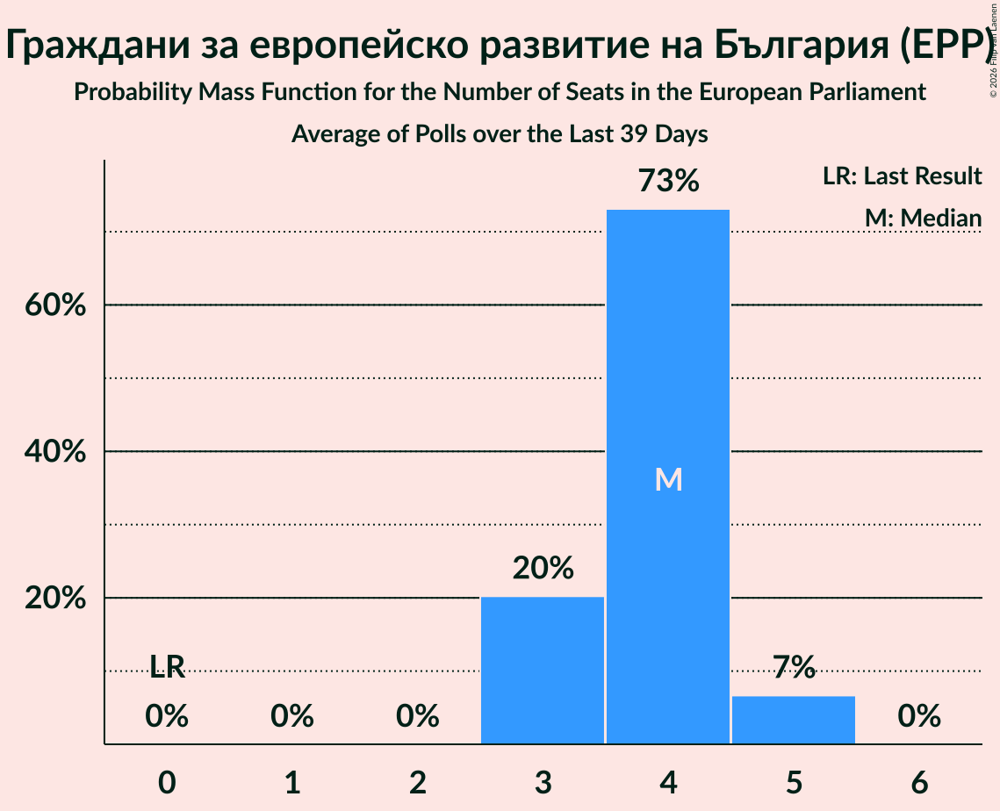

# Граждани за европейско развитие на България (EPP)

<a href="#voting-intentions">Voting Intentions</a> | <a href="#seats">Seats</a>

## Voting Intentions

Last result: **30.4%** (General Election of 26 May 2019)

### Confidence Intervals

| Period     | Polling firm/Commissioner(s) | Median | 80% Confidence Interval | 90% Confidence Interval | 95% Confidence Interval | 99% Confidence Interval |
|:----------:|:----------------:|:-----------:|:-----------------------:|:-----------------------:|:-----------------------:|:-----------------------:|
| N/A | [Poll Average](average.html) | 21.4% | 19.2–23.7% | 18.6–24.3% | 18.1–24.9% | 17.1–26.1% |
| [13–22 August 2021](2021-08-22-MarketLinks.html) | Market Links   bTV | 21.3% | 19.2–23.7% | 18.6–24.4% | 18.1–24.9% | 17.1–26.1% |
| [23–30 July 2021](2021-07-30-Тренд.html) | Тренд   24 часа | 22.4% | 20.7–24.1% | 20.3–24.6% | 19.9–25.1% | 19.1–25.9% |
| [21–28 July 2021](2021-07-28-MarketLinks.html) | Market Links   bTV | 19.7% | 17.6–22.1% | 17.0–22.8% | 16.5–23.4% | 15.5–24.6% |
| [3–7 July 2021](2021-07-07-Тренд.html) | Тренд   Nova | 20.5% | 18.4–23.0% | 17.8–23.7% | 17.3–24.3% | 16.3–25.5% |
| [4–7 July 2021](2021-07-07-Алфарисърч.html) | Алфа рисърч | 21.4% | 19.2–24.0% | 18.5–24.7% | 18.0–25.3% | 16.9–26.6% |
| [30 June–7 July 2021](2021-07-07-Gallup.html) | Gallup   BNR | 20.4% | 18.2–22.8% | 17.6–23.5% | 17.1–24.1% | 16.1–25.3% |
| [2–6 July 2021](2021-07-06-SovaHarris.html) | Sova Harris   Dir.bg | 22.6% | 20.3–25.1% | 19.7–25.8% | 19.1–26.5% | 18.1–27.7% |
| [1–5 July 2021](2021-07-05-Exacta.html) | Exacta | 21.4% | 19.1–23.9% | 18.5–24.6% | 17.9–25.3% | 16.9–26.5% |
| [26 June–2 July 2021](2021-07-02-Медиана.html) | Медиана | 22.5% | 20.8–24.3% | 20.3–24.9% | 19.9–25.3% | 19.1–26.2% |
| [23–30 June 2021](2021-06-30-Nasoca.html) | Nasoca | 21.3% | 19.2–23.8% | 18.6–24.4% | 18.0–25.1% | 17.0–26.2% |
| [18–25 June 2021](2021-06-25-MarketLinks.html) | Market Links   bTV | 23.1% | 21.0–25.3% | 20.4–26.0% | 19.9–26.6% | 19.0–27.7% |
| [11–18 June 2021](2021-06-18-Тренд.html) | Тренд   24 часа | 21.6% | 19.4–24.2% | 18.7–24.9% | 18.2–25.5% | 17.1–26.8% |
| [10–15 June 2021](2021-06-15-Медиана.html) | Медиана | 21.4% | 19.8–23.2% | 19.4–23.7% | 19.0–24.1% | 18.3–24.9% |
| [10–15 June 2021](2021-06-15-SovaHarris.html) | Sova Harris   Dir.bg | 22.3% | 20.0–24.9% | 19.4–25.6% | 18.8–26.2% | 17.8–27.5% |
| [3–11 June 2021](2021-06-11-Gallup.html) | Gallup   BNR | 21.1% | 19.0–23.3% | 18.4–24.0% | 18.0–24.5% | 17.0–25.7% |
| [30 May–7 June 2021](2021-06-07-Алфарисърч.html) | Алфа рисърч | 20.3% | 18.2–22.7% | 17.6–23.4% | 17.1–24.0% | 16.2–25.1% |
| [19–27 May 2021](2021-05-27-MarketLinks.html) | Market Links   bTV | 23.7% | 21.6–25.9% | 21.1–26.5% | 20.6–27.0% | 19.7–28.1% |
| [7–14 May 2021](2021-05-14-Gallup.html) | Gallup | 22.8% | 20.4–25.4% | 19.8–26.1% | 19.2–26.8% | 18.1–28.1% |
| [16–23 April 2021](2021-04-23-МаркетЛИНКС.html) | Маркет ЛИНКС   bTV | 23.1% | 21.0–25.4% | 20.5–26.0% | 20.0–26.6% | 19.0–27.7% |
| [24–31 March 2021](2021-03-31-Gallup.html) | Gallup   BNR | 28.1% | 25.4–31.1% | 24.6–32.0% | 24.0–32.7% | 22.7–34.2% |
| [26–30 March 2021](2021-03-30-Тренд.html) | Тренд   Nova | 28.6% | 26.0–31.4% | 25.3–32.2% | 24.7–32.8% | 23.5–34.2% |
| [27–30 March 2021](2021-03-30-ПИК.html) | ПИК | 28.6% | 25.6–32.0% | 24.7–32.9% | 24.0–33.8% | 22.6–35.4% |
| [27–30 March 2021](2021-03-30-Алфарисърч.html) | Алфа рисърч | 28.0% | 25.6–30.7% | 24.9–31.4% | 24.3–32.1% | 23.2–33.3% |
| [26–30 March 2021](2021-03-30-AFIS.html) | AFIS | 28.2% | 25.3–31.3% | 24.5–32.1% | 23.9–32.9% | 22.6–34.4% |
| [23–29 March 2021](2021-03-29-Exacta.html) | Exacta | 28.5% | 25.9–31.4% | 25.2–32.2% | 24.6–32.9% | 23.4–34.3% |
| [25–28 March 2021](2021-03-28-Рего.html) | Рего | 25.5% | 23.5–27.6% | 22.9–28.2% | 22.5–28.7% | 21.6–29.8% |
| [19–23 March 2021](2021-03-23-ПИК.html) | ПИК   Pik | 29.9% | 28.1–31.8% | 27.6–32.3% | 27.1–32.8% | 26.3–33.7% |
| [16–23 March 2021](2021-03-23-Медиана.html) | Медиана | 27.1% | 24.8–29.5% | 24.2–30.2% | 23.7–30.8% | 22.6–31.9% |
| [18–23 March 2021](2021-03-23-МаркетЛИНКС.html) | Маркет ЛИНКС   bTV | 25.6% | 23.2–28.3% | 22.5–29.1% | 21.9–29.8% | 20.8–31.1% |
| [11–16 March 2021](2021-03-16-SovaHarris.html) | Sova Harris   Trud | 30.7% | 28.0–33.7% | 27.2–34.5% | 26.5–35.2% | 25.2–36.7% |
| [9–14 March 2021](2021-03-14-Тренд.html) | Тренд   24 часа | 28.8% | 26.1–31.6% | 25.4–32.4% | 24.8–33.1% | 23.6–34.5% |
| [26 February–1 March 2021](2021-03-01-Алфарисърч.html) | Алфа рисърч   bTV | 28.6% | 26.2–31.2% | 25.5–31.9% | 24.9–32.6% | 23.8–33.8% |
| [22 February–1 March 2021](2021-03-01-Gallup.html) | Gallup   BNR/BNT | 27.5% | 25.1–30.1% | 24.5–30.8% | 23.9–31.5% | 22.8–32.7% |
| [22–26 February 2021](2021-02-26-Медиана.html) | Медиана | 27.5% | 25.2–30.0% | 24.5–30.7% | 24.0–31.3% | 22.9–32.5% |
| [17–24 February 2021](2021-02-24-МаркетЛИНКС.html) | Маркет ЛИНКС   bTV | 26.6% | 24.2–29.2% | 23.5–29.9% | 22.9–30.5% | 21.8–31.8% |
| [15–22 February 2021](2021-02-22-Exacta.html) | Exacta | 26.4% | 24.2–28.8% | 23.5–29.4% | 23.0–30.0% | 22.0–31.2% |
| [12–19 February 2021](2021-02-19-Тренд.html) | Тренд   24 часа/BNT | 28.9% | 26.3–31.7% | 25.6–32.5% | 25.0–33.2% | 23.8–34.5% |
| [12–17 February 2021](2021-02-17-AFIS.html) | AFIS | 25.3% | 22.8–28.1% | 22.1–28.9% | 21.4–29.6% | 20.3–30.9% |
| [4–12 February 2021](2021-02-12-Gallup.html) | Gallup | 25.7% | 23.2–28.6% | 22.5–29.4% | 21.9–30.1% | 20.7–31.4% |
| [23–31 January 2021](2021-01-31-МаркетЛИНКС.html) | Маркет ЛИНКС   bTV | 28.6% | 26.8–30.5% | 26.3–31.0% | 25.9–31.5% | 25.0–32.4% |
| [26 January 2020–31 January 2021](2021-01-31-SovaHarris.html) | Sova Harris | 27.0% | 25.3–28.9% | 24.8–29.4% | 24.4–29.9% | 23.6–30.8% |
| [12–19 January 2021](2021-01-19-Тренд.html) | Тренд   24 часа | 27.6% | 25.8–29.4% | 25.3–30.0% | 24.9–30.4% | 24.1–31.3% |
| [7–15 January 2021](2021-01-15-Gallup.html) | Gallup | 25.6% | 23.8–27.6% | 23.3–28.1% | 22.9–28.6% | 22.1–29.5% |
| [15–21 December 2020](2020-12-21-Алфарисърч.html) | Алфа рисърч | 28.9% | 26.2–31.9% | 25.4–32.7% | 24.8–33.4% | 23.5–34.9% |
| [12–17 December 2020](2020-12-17-Медиана.html) | Медиана | 24.2% | 22.3–26.3% | 21.7–26.9% | 21.2–27.5% | 20.3–28.5% |
| [5–12 December 2020](2020-12-12-Exacta.html) | Exacta | 28.7% | 26.6–31.1% | 25.9–31.7% | 25.4–32.3% | 24.4–33.5% |
| [27 October–3 November 2020](2020-11-03-SovaHarris.html) | Sova Harris | 26.6% | 24.9–28.5% | 24.4–29.0% | 23.9–29.4% | 23.1–30.3% |
| [21–27 October 2020](2020-10-27-Рего.html) | Рего | 27.1% | 25.8–28.4% | 25.5–28.8% | 25.2–29.1% | 24.6–29.7% |
| [3–10 October 2020](2020-10-10-Тренд.html) | Тренд   24 часа | 24.1% | 22.4–25.9% | 22.0–26.4% | 21.6–26.9% | 20.8–27.7% |
| [1–9 October 2020](2020-10-09-Gallup.html) | Gallup | 19.1% | 17.4–20.9% | 16.9–21.5% | 16.5–21.9% | 15.7–22.8% |
| [21–30 September 2020](2020-09-30-Алфарисърч.html) | Алфа рисърч | 22.8% | 21.2–24.5% | 20.7–25.0% | 20.3–25.5% | 19.6–26.3% |
| [18–26 September 2020](2020-09-26-МаркетЛИНКС.html) | Маркет ЛИНКС | 24.6% | 22.9–26.3% | 22.5–26.8% | 22.1–27.3% | 21.3–28.1% |
| [3–11 September 2020](2020-09-11-Gallup.html) | Gallup | 20.8% | 18.6–23.2% | 18.0–23.9% | 17.5–24.5% | 16.5–25.7% |
| [29 August–5 September 2020](2020-09-05-Тренд.html) | Тренд   24 часа | 23.8% | 22.1–25.6% | 21.7–26.1% | 21.3–26.6% | 20.5–27.4% |
| [19–25 August 2020](2020-08-25-SovaHarris.html) | Sova Harris | 27.9% | 25.7–30.2% | 25.1–30.9% | 24.5–31.5% | 23.5–32.6% |
| [3–10 August 2020](2020-08-10-Тренд.html) | Тренд   24 часа | 25.0% | 23.4–26.9% | 22.9–27.4% | 22.5–27.8% | 21.7–28.7% |
| [30 July–7 August 2020](2020-08-07-Gallup.html) | Gallup | 22.6% | 20.4–25.1% | 19.8–25.8% | 19.3–26.4% | 18.3–27.6% |
| [1–5 August 2020](2020-08-05-ПИК.html) | ПИК | 30.2% | 28.4–32.1% | 27.9–32.6% | 27.4–33.1% | 26.6–34.0% |
| [28 July–3 August 2020](2020-08-03-МаркетЛИНКС.html) | Маркет ЛИНКС   bTV | 23.2% | 21.3–25.4% | 20.8–26.0% | 20.3–26.5% | 19.4–27.5% |
| [23–30 July 2020](2020-07-30-Алфарисърч.html) | Алфа рисърч   Дневник | 26.6% | 24.3–29.1% | 23.7–29.9% | 23.1–30.5% | 22.0–31.7% |
| [26 June–1 July 2020](2020-07-01-SovaHarris.html) | Sova Harris | 37.4% | 34.8–40.0% | 34.1–40.8% | 33.5–41.4% | 32.3–42.7% |
| [27 May–3 June 2020](2020-06-03-МаркетЛИНКС.html) | Маркет ЛИНКС   bTV | 34.1% | 32.0–36.2% | 31.4–36.9% | 30.9–37.4% | 29.9–38.5% |
| [28 April–5 May 2020](2020-05-05-Алфарисърч.html) | Алфа рисърч   Дневник | 33.4% | 31.1–35.9% | 30.4–36.6% | 29.8–37.3% | 28.7–38.5% |
| [21–28 February 2020](2020-02-28-Медиана.html) | Медиана | 29.4% | 27.6–31.3% | 27.1–31.8% | 26.6–32.3% | 25.8–33.2% |
| [3–10 February 2020](2020-02-10-Тренд.html) | Тренд   24 часа | 32.3% | 30.0–34.8% | 29.4–35.5% | 28.8–36.1% | 27.8–37.3% |
| [5–12 December 2019](2019-12-12-Алфарисърч.html) | Алфа рисърч   Дневник | 29.8% | 27.7–32.0% | 27.1–32.6% | 26.6–33.2% | 25.6–34.2% |
| [21–28 November 2019](2019-11-28-МаркетЛИНКС.html) | Маркет ЛИНКС   bTV | 29.0% | 26.7–31.4% | 26.1–32.1% | 25.6–32.7% | 24.5–33.9% |
| [7–15 November 2019](2019-11-15-Тренд.html) | Тренд   24 часа | 37.0% | 34.6–39.5% | 34.0–40.2% | 33.4–40.8% | 32.3–42.0% |
| [10–16 September 2019](2019-09-16-Алфарисърч.html) | Алфа рисърч   Дневник | 29.6% | 27.5–31.8% | 26.9–32.4% | 26.4–33.0% | 25.5–34.1% |
| [5–12 July 2019](2019-07-12-Тренд.html) | Тренд   24 часа | 38.1% | 35.7–40.6% | 35.0–41.3% | 34.4–42.0% | 33.2–43.2% |
| [11–19 June 2019](2019-06-19-МаркетЛИНКС.html) | Маркет ЛИНКС   bTV | 34.9% | 32.8–37.0% | 32.3–37.6% | 31.8–38.1% | 30.8–39.1% |
| [5–12 June 2019](2019-06-12-Тренд.html) | Тренд | 36.7% | 34.8–38.7% | 34.2–39.2% | 33.8–39.7% | 32.9–40.7% |

### Probability Mass Function

The following table shows the probability mass function per percentage block of voting intentions for the [poll average](average.html) for Граждани за европейско развитие на България (EPP).

| Voting Intentions | Probability | Accumulated | Special Marks |
|:-----------------:|:-----------:|:-----------:|:-------------:|
| 14.5–15.5% | 0% | 100% |  |
| 15.5–16.5% | 0.1% | 100% |  |
| 16.5–17.5% | 0.9% | 99.8% |  |
| 17.5–18.5% | 4% | 98.9% |  |
| 18.5–19.5% | 10% | 95% |  |
| 19.5–20.5% | 17% | 86% |  |
| 20.5–21.5% | 22% | 69% | Median |
| 21.5–22.5% | 21% | 46% |  |
| 22.5–23.5% | 14% | 25% |  |
| 23.5–24.5% | 7% | 11% |  |
| 24.5–25.5% | 3% | 4% |  |
| 25.5–26.5% | 0.9% | 1.1% |  |
| 26.5–27.5% | 0.2% | 0.2% |  |
| 27.5–28.5% | 0% | 0% |  |
| 28.5–29.5% | 0% | 0% |  |
| 29.5–30.5% | 0% | 0% | Last Result |

## Seats

Last result: **6** seats (General Election of 26 May 2019)

### Confidence Intervals

| Period     | Polling firm/Commissioner(s) | Median | 80% Confidence Interval | 90% Confidence Interval | 95% Confidence Interval | 99% Confidence Interval |
|:----------:|:----------------:|:------:|:-----------------------:|:-----------------------:|:-----------------------:|:-----------------------:|
| N/A | [Poll Average](average.html) | 4 | 3–4 | 3–4 | 3–5 | 3–5 |
| [13–22 August 2021](2021-08-22-MarketLinks.html) | Market Links   bTV | 4 | 3–4 | 3–4 | 3–5 | 3–5 |
| [23–30 July 2021](2021-07-30-Тренд.html) | Тренд   24 часа | 4 | 4 | 4 | 4–5 | 3–5 |
| [21–28 July 2021](2021-07-28-MarketLinks.html) | Market Links   bTV | 4 | 3–4 | 3–4 | 3–4 | 3–5 |
| [3–7 July 2021](2021-07-07-Тренд.html) | Тренд   Nova | 4 | 3–4 | 3–4 | 3–5 | 3–5 |
| [4–7 July 2021](2021-07-07-Алфарисърч.html) | Алфа рисърч | 4 | 4–5 | 3–5 | 3–5 | 3–5 |
| [30 June–7 July 2021](2021-07-07-Gallup.html) | Gallup   BNR | 4 | 3–4 | 3–4 | 3–5 | 3–5 |
| [2–6 July 2021](2021-07-06-SovaHarris.html) | Sova Harris   Dir.bg | 4 | 4 | 3–5 | 3–5 | 3–5 |
| [1–5 July 2021](2021-07-05-Exacta.html) | Exacta | 4 | 3–5 | 3–5 | 3–5 | 3–5 |
| [26 June–2 July 2021](2021-07-02-Медиана.html) | Медиана | 4 | 4–5 | 4–5 | 3–5 | 3–5 |
| [23–30 June 2021](2021-06-30-Nasoca.html) | Nasoca | 4 | 3–4 | 3–4 | 3–5 | 3–5 |
| [18–25 June 2021](2021-06-25-MarketLinks.html) | Market Links   bTV | 4 | 4–5 | 4–5 | 4–5 | 3–5 |
| [11–18 June 2021](2021-06-18-Тренд.html) | Тренд   24 часа | 4 | 3–4 | 3–5 | 3–5 | 3–5 |
| [10–15 June 2021](2021-06-15-Медиана.html) | Медиана | 4 | 4 | 3–4 | 3–4 | 3–5 |
| [10–15 June 2021](2021-06-15-SovaHarris.html) | Sova Harris   Dir.bg | 4 | 4–5 | 3–5 | 3–5 | 3–5 |
| [3–11 June 2021](2021-06-11-Gallup.html) | Gallup   BNR | 4 | 3–4 | 3–5 | 3–5 | 3–5 |
| [30 May–7 June 2021](2021-06-07-Алфарисърч.html) | Алфа рисърч | 4 | 3–4 | 3–4 | 3–4 | 3–5 |
| [19–27 May 2021](2021-05-27-MarketLinks.html) | Market Links   bTV | 5 | 4–5 | 4–5 | 4–5 | 4–6 |
| [7–14 May 2021](2021-05-14-Gallup.html) | Gallup | 4 | 4–5 | 4–5 | 4–5 | 3–5 |
| [16–23 April 2021](2021-04-23-МаркетЛИНКС.html) | Маркет ЛИНКС   bTV | 4 | 4–5 | 4–5 | 4–5 | 3–5 |
| [24–31 March 2021](2021-03-31-Gallup.html) | Gallup   BNR | 6 | 5–6 | 5–6 | 4–7 | 4–7 |
| [26–30 March 2021](2021-03-30-Тренд.html) | Тренд   Nova | 6 | 5–6 | 5–7 | 5–7 | 4–7 |
| [27–30 March 2021](2021-03-30-ПИК.html) | ПИК | 6 | 6 | 5–7 | 5–7 | 5–7 |
| [27–30 March 2021](2021-03-30-Алфарисърч.html) | Алфа рисърч | 5 | 5–6 | 5–7 | 5–7 | 4–7 |
| [26–30 March 2021](2021-03-30-AFIS.html) | AFIS | 6 | 5–6 | 5–6 | 5–7 | 4–7 |
| [23–29 March 2021](2021-03-29-Exacta.html) | Exacta | 5 | 5–6 | 4–6 | 4–6 | 4–6 |
| [25–28 March 2021](2021-03-28-Рего.html) | Рего | 5 | 4–5 | 4–5 | 4–6 | 4–6 |
| [19–23 March 2021](2021-03-23-ПИК.html) | ПИК   Pik | 6 | 6 | 6–7 | 6–7 | 5–7 |
| [16–23 March 2021](2021-03-23-Медиана.html) | Медиана | 5 | 5–6 | 5–6 | 5–6 | 4–7 |
| [18–23 March 2021](2021-03-23-МаркетЛИНКС.html) | Маркет ЛИНКС   bTV | 5 | 4–5 | 4–5 | 4–5 | 4–6 |
| [11–16 March 2021](2021-03-16-SovaHarris.html) | Sova Harris   Trud | 6 | 5–6 | 5–6 | 5–7 | 5–7 |
| [9–14 March 2021](2021-03-14-Тренд.html) | Тренд   24 часа | 6 | 5–6 | 5–6 | 5–6 | 5–7 |
| [26 February–1 March 2021](2021-03-01-Алфарисърч.html) | Алфа рисърч   bTV | 6 | 5–6 | 5–7 | 5–7 | 5–7 |
| [22 February–1 March 2021](2021-03-01-Gallup.html) | Gallup   BNR/BNT | 5 | 5–6 | 5–6 | 5–6 | 4–7 |
| [22–26 February 2021](2021-02-26-Медиана.html) | Медиана | 6 | 5–6 | 5–6 | 5–6 | 4–7 |
| [17–24 February 2021](2021-02-24-МаркетЛИНКС.html) | Маркет ЛИНКС   bTV | 5 | 4–5 | 4–5 | 4–6 | 4–6 |
| [15–22 February 2021](2021-02-22-Exacta.html) | Exacta | 5 | 4–5 | 4–5 | 4–5 | 4–6 |
| [12–19 February 2021](2021-02-19-Тренд.html) | Тренд   24 часа/BNT | 6 | 5–6 | 5–6 | 5–7 | 4–7 |
| [12–17 February 2021](2021-02-17-AFIS.html) | AFIS | 5 | 5–6 | 5–6 | 4–6 | 4–7 |
| [4–12 February 2021](2021-02-12-Gallup.html) | Gallup | 5 | 4–5 | 4–6 | 4–6 | 4–6 |
| [23–31 January 2021](2021-01-31-МаркетЛИНКС.html) | Маркет ЛИНКС   bTV | 5 | 5–6 | 5–6 | 5–6 | 5–6 |
| [26 January 2020–31 January 2021](2021-01-31-SovaHarris.html) | Sova Harris | 6 | 5–6 | 5–6 | 5–6 | 5–7 |
| [12–19 January 2021](2021-01-19-Тренд.html) | Тренд   24 часа | 5 | 5–6 | 5–6 | 5–6 | 4–6 |
| [7–15 January 2021](2021-01-15-Gallup.html) | Gallup | 5 | 4–5 | 4–5 | 4–6 | 4–6 |
| [15–21 December 2020](2020-12-21-Алфарисърч.html) | Алфа рисърч | 5 | 5–6 | 4–6 | 4–6 | 4–6 |
| [12–17 December 2020](2020-12-17-Медиана.html) | Медиана | 5 | 4–5 | 4–5 | 4–5 | 4–6 |
| [5–12 December 2020](2020-12-12-Exacta.html) | Exacta | 5 | 5–6 | 5–6 | 4–6 | 4–6 |
| [27 October–3 November 2020](2020-11-03-SovaHarris.html) | Sova Harris | 5 | 4–5 | 4–5 | 4–5 | 4–6 |
| [21–27 October 2020](2020-10-27-Рего.html) | Рего | 5 | 5 | 5–6 | 5–6 | 5–6 |
| [3–10 October 2020](2020-10-10-Тренд.html) | Тренд   24 часа | 4 | 4–5 | 4–5 | 4–5 | 4–5 |
| [1–9 October 2020](2020-10-09-Gallup.html) | Gallup | 4 | 3–4 | 3–4 | 3–4 | 3–4 |
| [21–30 September 2020](2020-09-30-Алфарисърч.html) | Алфа рисърч | 4 | 4–5 | 4–5 | 4–5 | 3–5 |
| [18–26 September 2020](2020-09-26-МаркетЛИНКС.html) | Маркет ЛИНКС | 5 | 4–5 | 4–5 | 4–5 | 4–5 |
| [3–11 September 2020](2020-09-11-Gallup.html) | Gallup | 4 | 3–4 | 3–5 | 3–5 | 3–5 |
| [29 August–5 September 2020](2020-09-05-Тренд.html) | Тренд   24 часа | 5 | 4–5 | 4–5 | 4–5 | 4–5 |
| [19–25 August 2020](2020-08-25-SovaHarris.html) | Sova Harris | 6 | 5–6 | 5–6 | 5–6 | 5–6 |
| [3–10 August 2020](2020-08-10-Тренд.html) | Тренд   24 часа | 5 | 4–5 | 4–5 | 4–6 | 4–6 |
| [30 July–7 August 2020](2020-08-07-Gallup.html) | Gallup | 4 | 4–5 | 4–5 | 3–5 | 3–5 |
| [1–5 August 2020](2020-08-05-ПИК.html) | ПИК | 6 | 5–6 | 5–6 | 5–6 | 5–7 |
| [28 July–3 August 2020](2020-08-03-МаркетЛИНКС.html) | Маркет ЛИНКС   bTV | 4 | 4–5 | 4–5 | 4–5 | 3–5 |
| [23–30 July 2020](2020-07-30-Алфарисърч.html) | Алфа рисърч   Дневник | 5 | 4–5 | 4–6 | 4–6 | 4–6 |
| [26 June–1 July 2020](2020-07-01-SovaHarris.html) | Sova Harris | 7 | 7–8 | 7–8 | 7–8 | 6–9 |
| [27 May–3 June 2020](2020-06-03-МаркетЛИНКС.html) | Маркет ЛИНКС   bTV | 6 | 6 | 5–6 | 5–7 | 5–7 |
| [28 April–5 May 2020](2020-05-05-Алфарисърч.html) | Алфа рисърч   Дневник | 6 | 5–6 | 5–7 | 5–7 | 5–7 |
| [21–28 February 2020](2020-02-28-Медиана.html) | Медиана | 5 | 5–6 | 5–6 | 5–6 | 5–6 |
| [3–10 February 2020](2020-02-10-Тренд.html) | Тренд   24 часа | 6 | 6–7 | 5–7 | 5–7 | 5–7 |
| [5–12 December 2019](2019-12-12-Алфарисърч.html) | Алфа рисърч   Дневник | 5 | 5–6 | 5–6 | 5–6 | 5–6 |
| [21–28 November 2019](2019-11-28-МаркетЛИНКС.html) | Маркет ЛИНКС   bTV | 5 | 5–6 | 5–6 | 5–6 | 4–6 |
| [7–15 November 2019](2019-11-15-Тренд.html) | Тренд   24 часа | 7 | 6–8 | 6–8 | 6–8 | 6–8 |
| [10–16 September 2019](2019-09-16-Алфарисърч.html) | Алфа рисърч   Дневник | 6 | 5–6 | 5–6 | 5–6 | 5–7 |
| [5–12 July 2019](2019-07-12-Тренд.html) | Тренд   24 часа | 7 | 7–8 | 7–8 | 7–8 | 6–9 |
| [11–19 June 2019](2019-06-19-МаркетЛИНКС.html) | Маркет ЛИНКС   bTV | 6 | 6–7 | 6–7 | 6–7 | 5–7 |
| [5–12 June 2019](2019-06-12-Тренд.html) | Тренд | 6 | 6–7 | 6–7 | 6–7 | 6–7 |

### Probability Mass Function

The following table shows the probability mass function per seat for the [poll average](average.html) for Граждани за европейско развитие на България (EPP).

| Number of Seats | Probability | Accumulated | Special Marks |
|:---------------:|:-----------:|:-----------:|:-------------:|
| 3 | 12% | 100% |  |
| 4 | 84% | 88% | Median |
| 5 | 4% | 4% |  |
| 6 | 0% | 0% | Last Result |

