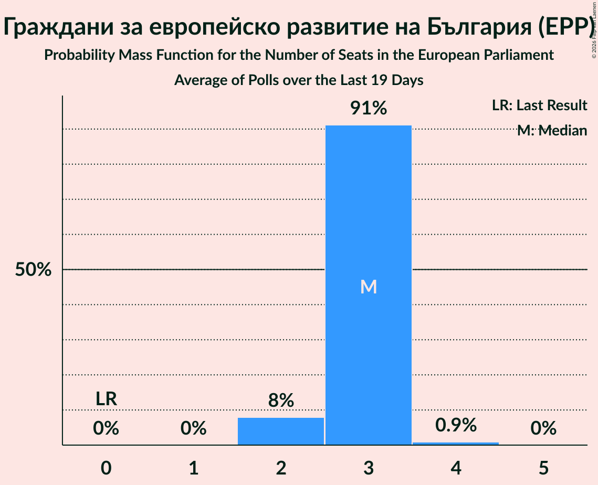

# Граждани за европейско развитие на България (EPP)

<a href="#voting-intentions">Voting Intentions</a> | <a href="#seats">Seats</a>

## Voting Intentions

Last result: **0.0%** (General Election of 9 June 2024)

### Confidence Intervals

| Period     | Polling firm/Commissioner(s) | Median | 80% Confidence Interval | 90% Confidence Interval | 95% Confidence Interval | 99% Confidence Interval |
|:----------:|:----------------:|:-----------:|:-----------------------:|:-----------------------:|:-----------------------:|:-----------------------:|
| N/A | [Poll Average](average.html) | 20.7% | 18.4–23.8% | 17.8–24.5% | 17.4–25.2% | 16.5–26.4% |
| [20–30 March 2026](2026-03-30-GallupInternational.html) | Gallup International | 23.4% | 21.6–25.4% | 21.0–26.0% | 20.6–26.5% | 19.7–27.5% |
| [19–26 March 2026](2026-03-26-Алфарисърч.html) | Алфа рисърч   BNR | 21.2% | 19.6–22.9% | 19.2–23.4% | 18.8–23.9% | 18.0–24.7% |
| [17–21 March 2026](2026-03-21-МаркетЛИНКС.html) | Маркет ЛИНКС   bTV | 22.2% | 20.5–24.1% | 20.0–24.7% | 19.5–25.1% | 18.7–26.1% |
| [12–20 March 2026](2026-03-20-Алфарисърч.html) | Алфа рисърч   bTV | 20.7% | N/A | N/A | N/A | N/A |
| [13–19 March 2026](2026-03-19-Тренд.html) | Тренд   24 часа | 19.7% | 18.1–21.4% | 17.7–21.8% | 17.3–22.3% | 16.6–23.1% |
| [7–16 March 2026](2026-03-16-Мяра.html) | Мяра | 19.3% | 17.6–21.2% | 17.1–21.7% | 16.7–22.1% | 15.9–23.1% |
| [7–15 March 2026](2026-03-15-МаркетЛИНКС.html) | Маркет ЛИНКС   bTV | 23.5% | N/A | N/A | N/A | N/A |
| [7–12 March 2026](2026-03-12-SovaHarris.html) | Sova Harris   Trud | 19.3% | 17.8–21.0% | 17.3–21.5% | 17.0–21.9% | 16.3–22.7% |
| [23 February–2 March 2026](2026-03-02-Алфарисърч.html) | Алфа рисърч | 19.7% | N/A | N/A | N/A | N/A |
| [10–28 February 2026](2026-02-28-GallupInternational.html) | Gallup International | 20.2% | N/A | N/A | N/A | N/A |
| [17–24 February 2026](2026-02-24-Центързаанализиимаркетинг.html) | Център за анализи и маркетинг | 19.8% | 18.2–21.5% | 17.8–22.0% | 17.4–22.5% | 16.6–23.3% |
| [12–18 February 2026](2026-02-18-Тренд.html) | Тренд   24 часа | 20.4% | N/A | N/A | N/A | N/A |
| [9–15 February 2026](2026-02-15-Мяра.html) | Мяра | 18.8% | N/A | N/A | N/A | N/A |
| [7–13 February 2026](2026-02-13-МаркетЛИНКС.html) | Маркет ЛИНКС   bTV | 19.3% | N/A | N/A | N/A | N/A |
| [18–29 December 2025](2025-12-29-МаркетЛИНКС.html) | Маркет ЛИНКС   bTV | 24.2% | N/A | N/A | N/A | N/A |
| [5–12 December 2025](2025-12-12-Алфарисърч.html) | Алфа рисърч | 24.7% | N/A | N/A | N/A | N/A |
| [3–7 December 2025](2025-12-07-МаркетЛИНКС.html) | Маркет ЛИНКС   bTV | 24.2% | N/A | N/A | N/A | N/A |
| [29 September–12 October 2025](2025-10-12-GallupInternational.html) | Gallup International | 27.4% | N/A | N/A | N/A | N/A |
| [13–20 September 2025](2025-09-20-Тренд.html) | Тренд   24 часа | 26.4% | N/A | N/A | N/A | N/A |
| [4–12 September 2025](2025-09-12-Мяра.html) | Мяра | 26.9% | N/A | N/A | N/A | N/A |
| [11–23 July 2025](2025-07-23-GallupInternational.html) | Gallup International | 26.2% | N/A | N/A | N/A | N/A |
| [7–14 July 2025](2025-07-14-Алфарисърч.html) | Алфа рисърч | 27.2% | N/A | N/A | N/A | N/A |
| [9–11 June 2025](2025-06-11-SovaHarris.html) | Sova Harris | 25.0% | N/A | N/A | N/A | N/A |
| [28 May–4 June 2025](2025-06-04-GallupInternational.html) | Gallup International | 25.1% | N/A | N/A | N/A | N/A |
| [12–18 May 2025](2025-05-18-Тренд.html) | Тренд   24 часа | 26.2% | N/A | N/A | N/A | N/A |
| [18–30 April 2025](2025-04-30-МаркетЛИНКС.html) | Маркет ЛИНКС   bTV | 25.4% | N/A | N/A | N/A | N/A |
| [3–13 April 2025](2025-04-13-Мяра.html) | Мяра | 26.4% | N/A | N/A | N/A | N/A |
| [22–30 March 2025](2025-03-30-МаркетЛИНКС.html) | Маркет ЛИНКС   bTV | 26.3% | N/A | N/A | N/A | N/A |
| [19–30 March 2025](2025-03-30-GallupInternational.html) | Gallup International | 25.6% | N/A | N/A | N/A | N/A |
| [10–16 March 2025](2025-03-16-Тренд.html) | Тренд   24 часа | 26.7% | N/A | N/A | N/A | N/A |
| [22 February–2 March 2025](2025-03-02-МаркетЛИНКС.html) | Маркет ЛИНКС   bTV | 25.7% | N/A | N/A | N/A | N/A |
| [13–20 February 2025](2025-02-20-GallupInternational.html) | Gallup International | 27.8% | N/A | N/A | N/A | N/A |
| [6–16 February 2025](2025-02-16-Мяра.html) | Мяра | 26.5% | N/A | N/A | N/A | N/A |
| [25 January–3 February 2025](2025-02-03-МаркетЛИНКС.html) | Маркет ЛИНКС   bTV | 27.5% | N/A | N/A | N/A | N/A |
| [24–30 January 2025](2025-01-30-Тренд.html) | Тренд   24 часа | 26.6% | N/A | N/A | N/A | N/A |
| [15–20 January 2025](2025-01-20-Алфарисърч.html) | Алфа рисърч | 27.7% | N/A | N/A | N/A | N/A |
| [8–12 January 2025](2025-01-12-GallupInternational.html) | Gallup International | 26.6% | N/A | N/A | N/A | N/A |
| [12–20 December 2024](2024-12-20-МаркетЛИНКС.html) | Маркет ЛИНКС   bTV | 27.6% | N/A | N/A | N/A | N/A |
| [20–23 October 2024](2024-10-23-Алфарисърч.html) | Алфа рисърч | 26.5% | N/A | N/A | N/A | N/A |
| [16–22 October 2024](2024-10-22-Тренд.html) | Тренд   24 часа | 24.9% | N/A | N/A | N/A | N/A |
| [19–22 October 2024](2024-10-22-Exacta.html) | Exacta | 26.7% | N/A | N/A | N/A | N/A |
| [10–21 October 2024](2024-10-21-GallupInternational.html) | Gallup International   BNR | 26.1% | N/A | N/A | N/A | N/A |
| [15–20 October 2024](2024-10-20-МаркетЛИНКС.html) | Маркет ЛИНКС   bTV | 27.2% | N/A | N/A | N/A | N/A |
| [11–17 October 2024](2024-10-17-SovaHarris.html) | Sova Harris   ПИК | 25.6% | N/A | N/A | N/A | N/A |
| [8–13 October 2024](2024-10-13-Медиана.html) | Медиана | 27.6% | N/A | N/A | N/A | N/A |
| [28 September–6 October 2024](2024-10-06-GallupInternational.html) | Gallup International | 25.7% | N/A | N/A | N/A | N/A |
| [25 September–1 October 2024](2024-10-01-МаркетЛИНКС.html) | Маркет ЛИНКС   bTV | 27.0% | N/A | N/A | N/A | N/A |
| [17–24 September 2024](2024-09-24-Тренд.html) | Тренд   24 часа | 24.8% | N/A | N/A | N/A | N/A |
| [18–24 September 2024](2024-09-24-Алфарисърч.html) | Алфа рисърч | 26.0% | N/A | N/A | N/A | N/A |
| [14–23 August 2024](2024-08-23-МаркетЛИНКС.html) | Маркет ЛИНКС   bTV | 27.0% | N/A | N/A | N/A | N/A |
| [1–9 August 2024](2024-08-09-GallupInternational.html) | Gallup International   БНТ | 25.2% | N/A | N/A | N/A | N/A |
| [20–28 July 2024](2024-07-28-МаркетЛИНКС.html) | Маркет ЛИНКС | 27.4% | N/A | N/A | N/A | N/A |

### Probability Mass Function

The following table shows the probability mass function per percentage block of voting intentions for the [poll average](average.html) for Граждани за европейско развитие на България (EPP).

| Voting Intentions | Probability | Accumulated | Special Marks |
|:-----------------:|:-----------:|:-----------:|:-------------:|
| 0.0–0.5% | 0% | 100% | Last Result |
| 0.5–1.5% | 0% | 100% |  |
| 1.5–2.5% | 0% | 100% |  |
| 2.5–3.5% | 0% | 100% |  |
| 3.5–4.5% | 0% | 100% |  |
| 4.5–5.5% | 0% | 100% |  |
| 5.5–6.5% | 0% | 100% |  |
| 6.5–7.5% | 0% | 100% |  |
| 7.5–8.5% | 0% | 100% |  |
| 8.5–9.5% | 0% | 100% |  |
| 9.5–10.5% | 0% | 100% |  |
| 10.5–11.5% | 0% | 100% |  |
| 11.5–12.5% | 0% | 100% |  |
| 12.5–13.5% | 0% | 100% |  |
| 13.5–14.5% | 0% | 100% |  |
| 14.5–15.5% | 0% | 100% |  |
| 15.5–16.5% | 0.5% | 100% |  |
| 16.5–17.5% | 3% | 99.5% |  |
| 17.5–18.5% | 9% | 97% |  |
| 18.5–19.5% | 16% | 88% |  |
| 19.5–20.5% | 18% | 72% |  |
| 20.5–21.5% | 17% | 53% | Median |
| 21.5–22.5% | 14% | 36% |  |
| 22.5–23.5% | 10% | 22% |  |
| 23.5–24.5% | 7% | 12% |  |
| 24.5–25.5% | 3% | 5% |  |
| 25.5–26.5% | 1.2% | 2% |  |
| 26.5–27.5% | 0.3% | 0.4% |  |
| 27.5–28.5% | 0.1% | 0.1% |  |
| 28.5–29.5% | 0% | 0% |  |

## Seats

Last result: **0** seats (General Election of 9 June 2024)

### Confidence Intervals

| Period     | Polling firm/Commissioner(s) | Median | 80% Confidence Interval | 90% Confidence Interval | 95% Confidence Interval | 99% Confidence Interval |
|:----------:|:----------------:|:------:|:-----------------------:|:-----------------------:|:-----------------------:|:-----------------------:|
| N/A | [Poll Average](average.html) | 4 | 4–5 | 4–6 | 4–6 | 3–6 |
| [20–30 March 2026](2026-03-30-GallupInternational.html) | Gallup International | 5 | 4–5 | 4–5 | 4–6 | 4–6 |
| [19–26 March 2026](2026-03-26-Алфарисърч.html) | Алфа рисърч   BNR | 5 | 4–5 | 4–5 | 4–5 | 4–5 |
| [17–21 March 2026](2026-03-21-МаркетЛИНКС.html) | Маркет ЛИНКС   bTV | 5 | 4–6 | 4–6 | 4–6 | 4–6 |
| [12–20 March 2026](2026-03-20-Алфарисърч.html) | Алфа рисърч   bTV |  |  |  |  |  |
| [13–19 March 2026](2026-03-19-Тренд.html) | Тренд   24 часа | 4 | 4 | 4 | 4–5 | 3–5 |
| [7–16 March 2026](2026-03-16-Мяра.html) | Мяра | 4 | 4 | 4 | 3–4 | 3–5 |
| [7–15 March 2026](2026-03-15-МаркетЛИНКС.html) | Маркет ЛИНКС   bTV |  |  |  |  |  |
| [7–12 March 2026](2026-03-12-SovaHarris.html) | Sova Harris   Trud | 4 | 4 | 4–5 | 4–5 | 3–5 |
| [23 February–2 March 2026](2026-03-02-Алфарисърч.html) | Алфа рисърч |  |  |  |  |  |
| [10–28 February 2026](2026-02-28-GallupInternational.html) | Gallup International |  |  |  |  |  |
| [17–24 February 2026](2026-02-24-Центързаанализиимаркетинг.html) | Център за анализи и маркетинг | 3 | 3–4 | 3–4 | 3–4 | 3–4 |
| [12–18 February 2026](2026-02-18-Тренд.html) | Тренд   24 часа |  |  |  |  |  |
| [9–15 February 2026](2026-02-15-Мяра.html) | Мяра |  |  |  |  |  |
| [7–13 February 2026](2026-02-13-МаркетЛИНКС.html) | Маркет ЛИНКС   bTV |  |  |  |  |  |
| [18–29 December 2025](2025-12-29-МаркетЛИНКС.html) | Маркет ЛИНКС   bTV |  |  |  |  |  |
| [5–12 December 2025](2025-12-12-Алфарисърч.html) | Алфа рисърч |  |  |  |  |  |
| [3–7 December 2025](2025-12-07-МаркетЛИНКС.html) | Маркет ЛИНКС   bTV |  |  |  |  |  |
| [29 September–12 October 2025](2025-10-12-GallupInternational.html) | Gallup International |  |  |  |  |  |
| [13–20 September 2025](2025-09-20-Тренд.html) | Тренд   24 часа |  |  |  |  |  |
| [4–12 September 2025](2025-09-12-Мяра.html) | Мяра |  |  |  |  |  |
| [11–23 July 2025](2025-07-23-GallupInternational.html) | Gallup International |  |  |  |  |  |
| [7–14 July 2025](2025-07-14-Алфарисърч.html) | Алфа рисърч |  |  |  |  |  |
| [9–11 June 2025](2025-06-11-SovaHarris.html) | Sova Harris |  |  |  |  |  |
| [28 May–4 June 2025](2025-06-04-GallupInternational.html) | Gallup International |  |  |  |  |  |
| [12–18 May 2025](2025-05-18-Тренд.html) | Тренд   24 часа |  |  |  |  |  |
| [18–30 April 2025](2025-04-30-МаркетЛИНКС.html) | Маркет ЛИНКС   bTV |  |  |  |  |  |
| [3–13 April 2025](2025-04-13-Мяра.html) | Мяра |  |  |  |  |  |
| [22–30 March 2025](2025-03-30-МаркетЛИНКС.html) | Маркет ЛИНКС   bTV |  |  |  |  |  |
| [19–30 March 2025](2025-03-30-GallupInternational.html) | Gallup International |  |  |  |  |  |
| [10–16 March 2025](2025-03-16-Тренд.html) | Тренд   24 часа |  |  |  |  |  |
| [22 February–2 March 2025](2025-03-02-МаркетЛИНКС.html) | Маркет ЛИНКС   bTV |  |  |  |  |  |
| [13–20 February 2025](2025-02-20-GallupInternational.html) | Gallup International |  |  |  |  |  |
| [6–16 February 2025](2025-02-16-Мяра.html) | Мяра |  |  |  |  |  |
| [25 January–3 February 2025](2025-02-03-МаркетЛИНКС.html) | Маркет ЛИНКС   bTV |  |  |  |  |  |
| [24–30 January 2025](2025-01-30-Тренд.html) | Тренд   24 часа |  |  |  |  |  |
| [15–20 January 2025](2025-01-20-Алфарисърч.html) | Алфа рисърч |  |  |  |  |  |
| [8–12 January 2025](2025-01-12-GallupInternational.html) | Gallup International |  |  |  |  |  |
| [12–20 December 2024](2024-12-20-МаркетЛИНКС.html) | Маркет ЛИНКС   bTV |  |  |  |  |  |
| [20–23 October 2024](2024-10-23-Алфарисърч.html) | Алфа рисърч |  |  |  |  |  |
| [16–22 October 2024](2024-10-22-Тренд.html) | Тренд   24 часа |  |  |  |  |  |
| [19–22 October 2024](2024-10-22-Exacta.html) | Exacta |  |  |  |  |  |
| [10–21 October 2024](2024-10-21-GallupInternational.html) | Gallup International   BNR |  |  |  |  |  |
| [15–20 October 2024](2024-10-20-МаркетЛИНКС.html) | Маркет ЛИНКС   bTV |  |  |  |  |  |
| [11–17 October 2024](2024-10-17-SovaHarris.html) | Sova Harris   ПИК |  |  |  |  |  |
| [8–13 October 2024](2024-10-13-Медиана.html) | Медиана |  |  |  |  |  |
| [28 September–6 October 2024](2024-10-06-GallupInternational.html) | Gallup International |  |  |  |  |  |
| [25 September–1 October 2024](2024-10-01-МаркетЛИНКС.html) | Маркет ЛИНКС   bTV |  |  |  |  |  |
| [17–24 September 2024](2024-09-24-Тренд.html) | Тренд   24 часа |  |  |  |  |  |
| [18–24 September 2024](2024-09-24-Алфарисърч.html) | Алфа рисърч |  |  |  |  |  |
| [14–23 August 2024](2024-08-23-МаркетЛИНКС.html) | Маркет ЛИНКС   bTV |  |  |  |  |  |
| [1–9 August 2024](2024-08-09-GallupInternational.html) | Gallup International   БНТ |  |  |  |  |  |
| [20–28 July 2024](2024-07-28-МаркетЛИНКС.html) | Маркет ЛИНКС |  |  |  |  |  |

### Probability Mass Function

The following table shows the probability mass function per seat for the [poll average](average.html) for Граждани за европейско развитие на България (EPP).

| Number of Seats | Probability | Accumulated | Special Marks |
|:---------------:|:-----------:|:-----------:|:-------------:|
| 0 | 0% | 100% | Last Result |
| 1 | 0% | 100% |  |
| 2 | 0% | 100% |  |
| 3 | 0.8% | 100% |  |
| 4 | 53% | 99.2% | Median |
| 5 | 41% | 46% |  |
| 6 | 5% | 5% |  |
| 7 | 0% | 0% |  |

