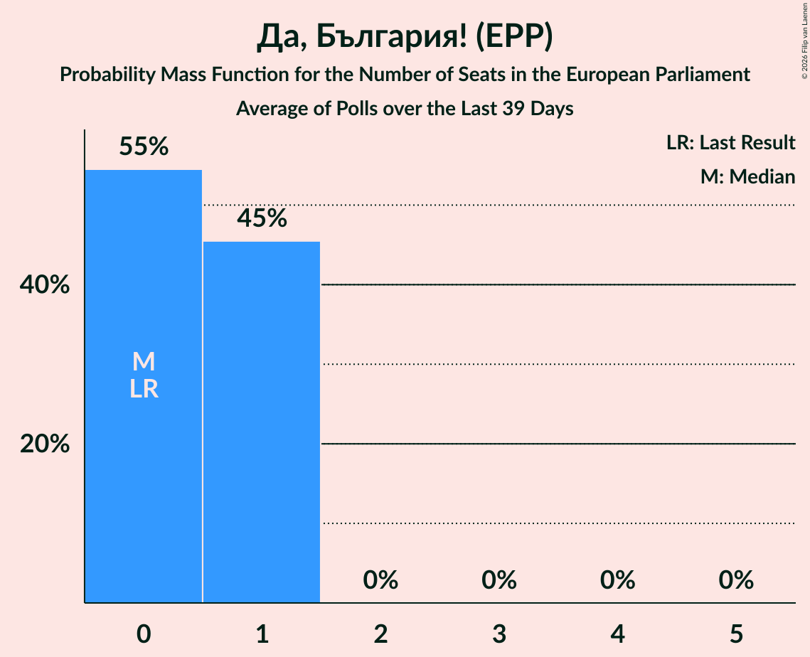

# Да, България! (EPP)

<a href="#voting-intentions">Voting Intentions</a> | <a href="#seats">Seats</a>

## Voting Intentions

Last result: **0.0%** (General Election of 9 June 2024)

### Confidence Intervals

| Period     | Polling firm/Commissioner(s) | Median | 80% Confidence Interval | 90% Confidence Interval | 95% Confidence Interval | 99% Confidence Interval |
|:----------:|:----------------:|:-----------:|:-----------------------:|:-----------------------:|:-----------------------:|:-----------------------:|
| N/A | [Poll Average](average.html) | 3.6% | 2.9–4.5% | 2.7–4.8% | 2.5–5.1% | 2.2–5.6% |
| [8–13 October 2024](2024-10-13-Медиана.html) | Медиана | 3.2% | 2.6–4.0% | 2.4–4.3% | 2.2–4.5% | 2.0–4.9% |
| [28 September–6 October 2024](2024-10-06-GallupInternational.html) | Gallup International | 3.8% | 3.1–4.9% | 2.9–5.2% | 2.7–5.4% | 2.4–5.9% |
| [25 September–1 October 2024](2024-10-01-МаркетЛИНКС.html) | Маркет ЛИНКС   bTV | 3.8% | 3.1–4.6% | 2.9–4.9% | 2.7–5.1% | 2.5–5.6% |
| [17–24 September 2024](2024-09-24-Тренд.html) | Тренд   24 часа | 3.5% | 2.9–4.4% | 2.7–4.6% | 2.5–4.8% | 2.2–5.3% |
| [18–24 September 2024](2024-09-24-Алфарисърч.html) | Алфа рисърч | 3.6% | 2.9–4.5% | 2.8–4.7% | 2.6–5.0% | 2.3–5.4% |
| [14–23 August 2024](2024-08-23-МаркетЛИНКС.html) | Маркет ЛИНКС   bTV | 3.9% | 3.3–4.8% | 3.1–5.1% | 2.9–5.3% | 2.6–5.8% |
| [1–9 August 2024](2024-08-09-GallupInternational.html) | Gallup International   БНТ | 3.5% | 2.8–4.5% | 2.6–4.8% | 2.4–5.0% | 2.1–5.5% |
| [20–28 July 2024](2024-07-28-МаркетЛИНКС.html) | Маркет ЛИНКС | 3.5% | N/A | N/A | N/A | N/A |

### Probability Mass Function

The following table shows the probability mass function per percentage block of voting intentions for the [poll average](average.html) for Да, България! (EPP).

| Voting Intentions | Probability | Accumulated | Special Marks |
|:-----------------:|:-----------:|:-----------:|:-------------:|
| 0.0–0.5% | 0% | 100% | Last Result |
| 0.5–1.5% | 0% | 100% |  |
| 1.5–2.5% | 3% | 100% |  |
| 2.5–3.5% | 42% | 97% |  |
| 3.5–4.5% | 46% | 55% | Median |
| 4.5–5.5% | 9% | 9% |  |
| 5.5–6.5% | 0.5% | 0.5% |  |
| 6.5–7.5% | 0% | 0% |  |

## Seats

Last result: **0** seats (General Election of 9 June 2024)

### Confidence Intervals

| Period     | Polling firm/Commissioner(s) | Median | 80% Confidence Interval | 90% Confidence Interval | 95% Confidence Interval | 99% Confidence Interval |
|:----------:|:----------------:|:------:|:-----------------------:|:-----------------------:|:-----------------------:|:-----------------------:|
| N/A | [Poll Average](average.html) | 1 | 0–1 | 0–1 | 0–1 | 0–1 |
| [8–13 October 2024](2024-10-13-Медиана.html) | Медиана | 1 | 0–1 | 0–1 | 0–1 | 0–1 |
| [28 September–6 October 2024](2024-10-06-GallupInternational.html) | Gallup International | 1 | 0–1 | 0–1 | 0–1 | 0–2 |
| [25 September–1 October 2024](2024-10-01-МаркетЛИНКС.html) | Маркет ЛИНКС   bTV | 1 | 0–1 | 0–1 | 0–1 | 0–1 |
| [17–24 September 2024](2024-09-24-Тренд.html) | Тренд   24 часа | 1 | 0–1 | 0–1 | 0–1 | 0–1 |
| [18–24 September 2024](2024-09-24-Алфарисърч.html) | Алфа рисърч | 1 | 0–1 | 0–1 | 0–1 | 0–1 |
| [14–23 August 2024](2024-08-23-МаркетЛИНКС.html) | Маркет ЛИНКС   bTV | 1 | 0–1 | 0–1 | 0–1 | 0–1 |
| [1–9 August 2024](2024-08-09-GallupInternational.html) | Gallup International   БНТ | 1 | 0–1 | 0–1 | 0–1 | 0–1 |
| [20–28 July 2024](2024-07-28-МаркетЛИНКС.html) | Маркет ЛИНКС |  |  |  |  |  |

### Probability Mass Function

The following table shows the probability mass function per seat for the [poll average](average.html) for Да, България! (EPP).

| Number of Seats | Probability | Accumulated | Special Marks |
|:---------------:|:-----------:|:-----------:|:-------------:|
| 0 | 28% | 100% | Last Result |
| 1 | 72% | 72% | Median |
| 2 | 0.1% | 0.1% |  |
| 3 | 0% | 0% |  |

