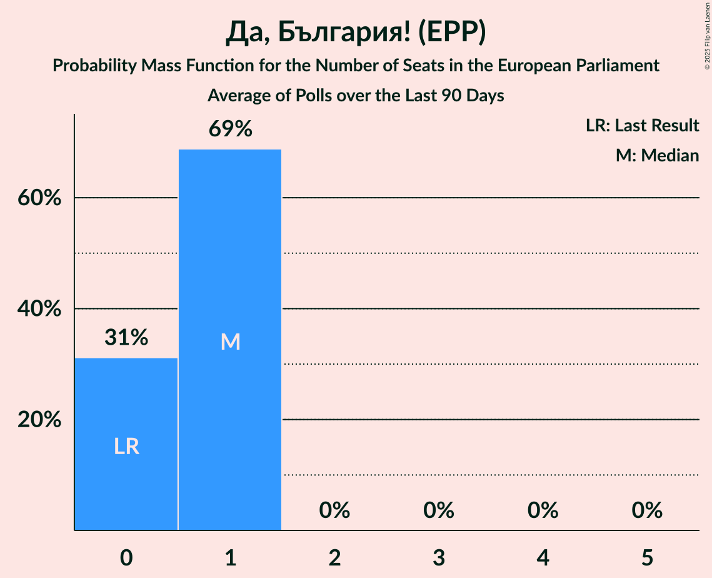

# Да, България! (EPP)

<a href="#voting-intentions">Voting Intentions</a> | <a href="#seats">Seats</a>

## Voting Intentions

Last result: **0.0%** (General Election of 26 May 2019)

### Confidence Intervals

| Period     | Polling firm/Commissioner(s) | Median | 80% Confidence Interval | 90% Confidence Interval | 95% Confidence Interval | 99% Confidence Interval |
|:----------:|:----------------:|:-----------:|:-----------------------:|:-----------------------:|:-----------------------:|:-----------------------:|
| N/A | [Poll Average](average.html) | 4.9% | 3.6–6.2% | 3.3–6.5% | 3.1–6.8% | 2.7–7.4% |
| [28 March–5 April 2024](2024-04-05-GallupInternational.html) | Gallup International   БНТ | 4.1% | 3.3–5.2% | 3.1–5.4% | 2.9–5.7% | 2.6–6.2% |
| [1–7 March 2024](2024-03-07-Алфарисърч.html) | Алфа рисърч | 5.5% | 4.7–6.5% | 4.4–6.8% | 4.3–7.1% | 3.9–7.6% |
| [5 March 2024](2024-03-05-Ipsos.html) | Ipsos   Euronews | 4.9% | 3.7–6.8% | 3.3–7.4% | 3.1–7.8% | 2.6–8.9% |
| [24 February–3 March 2024](2024-03-03-МаркетЛИНКС.html) | Маркет ЛИНКС   bTV | 5.4% | 4.6–6.4% | 4.4–6.7% | 4.2–7.0% | 3.8–7.5% |
| [17–24 January 2024](2024-01-24-Тренд.html) | Тренд   24 часа | 4.4% | 3.7–5.4% | 3.5–5.7% | 3.3–6.0% | 3.0–6.5% |
| [7–13 December 2023](2023-12-13-Медиана.html) | Медиана | 4.0% | 3.2–5.0% | 3.0–5.2% | 2.9–5.5% | 2.6–6.0% |
| [22–30 November 2023](2023-11-30-Алфарисърч.html) | Алфа рисърч | 4.9% | 4.1–5.9% | 3.9–6.2% | 3.7–6.4% | 3.4–6.9% |
| [10–19 November 2023](2023-11-19-МаркетЛИНКС.html) | Маркет ЛИНКС   bTV | 4.8% | 4.1–5.9% | 3.8–6.1% | 3.7–6.4% | 3.3–6.9% |
| [11–18 November 2023](2023-11-18-Тренд.html) | Тренд   24 часа | 4.4% | 3.6–5.4% | 3.4–5.7% | 3.3–5.9% | 2.9–6.4% |
| [26 September–8 October 2023](2023-10-08-МаркетЛИНКС.html) | Маркет ЛИНКС   bTV | 5.0% | 4.2–6.0% | 4.0–6.3% | 3.8–6.6% | 3.4–7.1% |
| [2–8 September 2023](2023-09-08-Тренд.html) | Тренд   24 часа | 4.5% | 3.7–5.5% | 3.5–5.8% | 3.3–6.0% | 3.0–6.5% |
| [11–18 August 2023](2023-08-18-МаркетЛИНКС.html) | Маркет ЛИНКС   bTV | 5.2% | 4.4–6.2% | 4.2–6.5% | 4.0–6.8% | 3.6–7.3% |
| [18–24 July 2023](2023-07-24-Медиана.html) | Медиана | 4.6% | N/A | N/A | N/A | N/A |
| [4–11 July 2023](2023-07-11-Тренд.html) | Тренд   24 часа | 4.7% | N/A | N/A | N/A | N/A |
| [29 June–9 July 2023](2023-07-09-GallupInternational.html) | Gallup International | 5.1% | N/A | N/A | N/A | N/A |
| [3–7 July 2023](2023-07-07-Центързаанализиимаркетинг.html) | Център за анализи и маркетинг | 5.1% | N/A | N/A | N/A | N/A |
| [22 June–2 July 2023](2023-07-02-МаркетЛИНКС.html) | Маркет ЛИНКС   bTV | 5.1% | N/A | N/A | N/A | N/A |
| [20–26 June 2023](2023-06-26-Алфарисърч.html) | Алфа рисърч | 4.9% | N/A | N/A | N/A | N/A |
| [12–20 June 2023](2023-06-20-Exacta.html) | Exacta | 4.9% | N/A | N/A | N/A | N/A |
| [10–16 June 2023](2023-06-16-Тренд.html) | Тренд   24 часа | 4.8% | N/A | N/A | N/A | N/A |
| [27 April–5 May 2023](2023-05-05-GallupInternational.html) | Gallup International | 5.6% | N/A | N/A | N/A | N/A |
| [17–22 March 2023](2023-03-22-Медиана.html) | Медиана | 5.3% | N/A | N/A | N/A | N/A |
| [16–19 March 2023](2023-03-19-Центързаанализиимаркетинг.html) | Център за анализи и маркетинг | 5.9% | N/A | N/A | N/A | N/A |
| [7–14 March 2023](2023-03-14-Nasoca.html) | Nasoca | 5.9% | N/A | N/A | N/A | N/A |
| [6–12 March 2023](2023-03-12-Тренд.html) | Тренд   24 часа | 6.1% | N/A | N/A | N/A | N/A |
| [24 February–3 March 2023](2023-03-03-GallupInternational.html) | Gallup International | 6.2% | N/A | N/A | N/A | N/A |
| [21–27 February 2023](2023-02-27-Алфарисърч.html) | Алфа рисърч | 6.1% | N/A | N/A | N/A | N/A |
| [20–27 February 2023](2023-02-27-SovaHarris.html) | Sova Harris | 6.0% | N/A | N/A | N/A | N/A |
| [19–24 February 2023](2023-02-24-Медиана.html) | Медиана | 5.6% | N/A | N/A | N/A | N/A |
| [2–12 February 2023](2023-02-12-GallupInternational.html) | Gallup International | 6.2% | N/A | N/A | N/A | N/A |
| [4–11 February 2023](2023-02-11-Тренд.html) | Тренд   24 часа | 6.0% | N/A | N/A | N/A | N/A |
| [30 January–4 February 2023](2023-02-04-Exacta.html) | Exacta | 0.0% | N/A | N/A | N/A | N/A |
| [10–20 December 2022](2022-12-20-МаркетЛИНКС.html) | Маркет ЛИНКС   bTV | 0.0% | N/A | N/A | N/A | N/A |
| [1–13 December 2022](2022-12-13-Алфарисърч.html) | Алфа рисърч | 0.0% | N/A | N/A | N/A | N/A |
| [5–12 December 2022](2022-12-12-Exacta.html) | Exacta | 0.0% | N/A | N/A | N/A | N/A |
| [1–8 December 2022](2022-12-08-Тренд.html) | Тренд   24 часа | 0.0% | N/A | N/A | N/A | N/A |
| [27–29 September 2022](2022-09-29-Алфарисърч.html) | Алфа рисърч | 0.0% | N/A | N/A | N/A | N/A |
| [21–27 September 2022](2022-09-27-Тренд.html) | Тренд   24 часа | 0.0% | N/A | N/A | N/A | N/A |
| [20–27 September 2022](2022-09-27-GallupInternational.html) | Gallup International | 0.0% | N/A | N/A | N/A | N/A |
| [17–23 September 2022](2022-09-23-МаркетЛИНКС.html) | Маркет ЛИНКС   24 часа | 0.0% | N/A | N/A | N/A | N/A |
| [10–17 September 2022](2022-09-17-Exacta.html) | Exacta | 0.0% | N/A | N/A | N/A | N/A |
| [10–17 September 2022](2022-09-17-Estat.html) | Estat | 0.0% | N/A | N/A | N/A | N/A |
| [6–12 September 2022](2022-09-12-SovaHarris.html) | Sova Harris   Dir.bg | 0.0% | N/A | N/A | N/A | N/A |
| [2–10 September 2022](2022-09-10-GallupInternational.html) | Gallup International | 0.0% | N/A | N/A | N/A | N/A |
| [29 August–4 September 2022](2022-09-04-Медиана.html) | Медиана | 0.0% | N/A | N/A | N/A | N/A |
| [27 August–3 September 2022](2022-09-03-МаркетЛИНКС.html) | Маркет ЛИНКС   bTV | 0.0% | N/A | N/A | N/A | N/A |
| [27 August–2 September 2022](2022-09-02-Алфарисърч.html) | Алфа рисърч | 0.0% | N/A | N/A | N/A | N/A |
| [15–22 August 2022](2022-08-22-Тренд.html) | Тренд   24 часа | 0.0% | N/A | N/A | N/A | N/A |
| [30 July–5 August 2022](2022-08-05-МаркетЛИНКС.html) | Маркет ЛИНКС   bTV | 0.0% | N/A | N/A | N/A | N/A |
| [5–12 July 2022](2022-07-12-Тренд.html) | Тренд   24 часа | 0.0% | N/A | N/A | N/A | N/A |
| [2–10 July 2022](2022-07-10-МаркетЛИНКС.html) | Маркет ЛИНКС   bTV | 0.0% | N/A | N/A | N/A | N/A |
| [25 June–1 July 2022](2022-07-01-Алфарисърч.html) | Алфа рисърч | 0.0% | N/A | N/A | N/A | N/A |
| [4–11 May 2022](2022-05-11-Тренд.html) | Тренд   24 часа | 0.0% | N/A | N/A | N/A | N/A |
| [4–9 May 2022](2022-05-09-Центързаанализиимаркетинг.html) | Център за анализи и маркетинг | 0.0% | N/A | N/A | N/A | N/A |
| [29 April–8 May 2022](2022-05-08-МаркетЛИНКС.html) | Маркет ЛИНКС   bTV | 0.0% | N/A | N/A | N/A | N/A |
| [29 April–6 May 2022](2022-05-06-Gallup.html) | Gallup | 0.0% | N/A | N/A | N/A | N/A |
| [8–14 April 2022](2022-04-14-Алфарисърч.html) | Алфа рисърч | 0.0% | N/A | N/A | N/A | N/A |
| [6–13 April 2022](2022-04-13-Тренд.html) | Тренд   24 часа | 0.0% | N/A | N/A | N/A | N/A |
| [31 March–8 April 2022](2022-04-08-Gallup.html) | Gallup | 0.0% | N/A | N/A | N/A | N/A |
| [22–29 March 2022](2022-03-29-МаркетЛИНКС.html) | Маркет ЛИНКС   bTV | 0.0% | N/A | N/A | N/A | N/A |
| [5–12 March 2022](2022-03-12-Тренд.html) | Тренд   24 часа | 0.0% | N/A | N/A | N/A | N/A |
| [6–14 February 2022](2022-02-14-Алфарисърч.html) | Алфа рисърч | 0.0% | N/A | N/A | N/A | N/A |
| [3–11 February 2022](2022-02-11-Gallup.html) | Gallup | 0.0% | N/A | N/A | N/A | N/A |
| [12–19 January 2022](2022-01-19-Тренд.html) | Тренд   24 часа | 0.0% | N/A | N/A | N/A | N/A |
| [10–17 October 2021](2021-10-17-Gallup.html) | Gallup   BNR | 0.0% | N/A | N/A | N/A | N/A |
| [5–12 October 2021](2021-10-12-SovaHarris.html) | Sova Harris   Dir.bg | 0.0% | N/A | N/A | N/A | N/A |
| [6–12 October 2021](2021-10-12-Exacta.html) | Exacta | 0.0% | N/A | N/A | N/A | N/A |
| [6–10 October 2021](2021-10-10-Центързаанализиимаркетинг.html) | Център за анализи и маркетинг | 0.0% | N/A | N/A | N/A | N/A |
| [4–10 October 2021](2021-10-10-Алфарисърч.html) | Алфа рисърч | 0.0% | N/A | N/A | N/A | N/A |
| [21–26 September 2021](2021-09-26-Gallup.html) | Gallup | 0.0% | N/A | N/A | N/A | N/A |
| [14–20 September 2021](2021-09-20-МаркетЛИНКС.html) | Маркет ЛИНКС   bTV | 0.0% | N/A | N/A | N/A | N/A |
| [8–15 September 2021](2021-09-15-Тренд.html) | Тренд | 0.0% | N/A | N/A | N/A | N/A |
| [8–15 September 2021](2021-09-15-Алфарисърч.html) | Алфа рисърч | 0.0% | N/A | N/A | N/A | N/A |
| [2–10 September 2021](2021-09-10-Gallup.html) | Gallup | 0.0% | N/A | N/A | N/A | N/A |
| [13–22 August 2021](2021-08-22-МаркетЛИНКС.html) | Маркет ЛИНКС   bTV | 0.0% | N/A | N/A | N/A | N/A |
| [23–30 July 2021](2021-07-30-Тренд.html) | Тренд   24 часа | 0.0% | N/A | N/A | N/A | N/A |
| [21–28 July 2021](2021-07-28-МаркетЛИНКС.html) | Маркет ЛИНКС   bTV | 0.0% | N/A | N/A | N/A | N/A |
| [3–7 July 2021](2021-07-07-Тренд.html) | Тренд   Nova | 0.0% | N/A | N/A | N/A | N/A |
| [4–7 July 2021](2021-07-07-Алфарисърч.html) | Алфа рисърч | 0.0% | N/A | N/A | N/A | N/A |
| [30 June–7 July 2021](2021-07-07-Gallup.html) | Gallup   BNR | 0.0% | N/A | N/A | N/A | N/A |
| [2–6 July 2021](2021-07-06-SovaHarris.html) | Sova Harris   Dir.bg | 0.0% | N/A | N/A | N/A | N/A |
| [1–5 July 2021](2021-07-05-Exacta.html) | Exacta | 0.0% | N/A | N/A | N/A | N/A |
| [26 June–2 July 2021](2021-07-02-Медиана.html) | Медиана | 0.0% | N/A | N/A | N/A | N/A |
| [23–30 June 2021](2021-06-30-Nasoca.html) | Nasoca | 0.0% | N/A | N/A | N/A | N/A |
| [18–25 June 2021](2021-06-25-МаркетЛИНКС.html) | Маркет ЛИНКС   bTV | 0.0% | N/A | N/A | N/A | N/A |
| [11–18 June 2021](2021-06-18-Тренд.html) | Тренд   24 часа | 0.0% | N/A | N/A | N/A | N/A |
| [10–15 June 2021](2021-06-15-Медиана.html) | Медиана | 0.0% | N/A | N/A | N/A | N/A |
| [10–15 June 2021](2021-06-15-SovaHarris.html) | Sova Harris   Dir.bg | 0.0% | N/A | N/A | N/A | N/A |
| [3–11 June 2021](2021-06-11-Gallup.html) | Gallup   BNR | 0.0% | N/A | N/A | N/A | N/A |
| [30 May–7 June 2021](2021-06-07-Алфарисърч.html) | Алфа рисърч | 0.0% | N/A | N/A | N/A | N/A |
| [19–27 May 2021](2021-05-27-МаркетЛИНКС.html) | Маркет ЛИНКС   bTV | 0.0% | N/A | N/A | N/A | N/A |
| [14–21 May 2021](2021-05-21-Центързаанализиимаркетинг.html) | Център за анализи и маркетинг | 0.0% | N/A | N/A | N/A | N/A |
| [7–14 May 2021](2021-05-14-Gallup.html) | Gallup | 0.0% | N/A | N/A | N/A | N/A |
| [16–23 April 2021](2021-04-23-МаркетЛИНКС.html) | Маркет ЛИНКС   bTV | 0.0% | N/A | N/A | N/A | N/A |
| [24–31 March 2021](2021-03-31-Gallup.html) | Gallup   BNR | 0.0% | N/A | N/A | N/A | N/A |
| [27–30 March 2021](2021-03-30-Центързаанализиимаркетинг.html) | Център за анализи и маркетинг | 0.0% | N/A | N/A | N/A | N/A |
| [26–30 March 2021](2021-03-30-Тренд.html) | Тренд   Nova | 0.0% | N/A | N/A | N/A | N/A |
| [27–30 March 2021](2021-03-30-ПИК.html) | ПИК | 0.0% | N/A | N/A | N/A | N/A |
| [27–30 March 2021](2021-03-30-Алфарисърч.html) | Алфа рисърч | 0.0% | N/A | N/A | N/A | N/A |
| [26–30 March 2021](2021-03-30-AFIS.html) | AFIS | 0.0% | N/A | N/A | N/A | N/A |
| [23–29 March 2021](2021-03-29-Exacta.html) | Exacta | 0.0% | N/A | N/A | N/A | N/A |
| [25–28 March 2021](2021-03-28-Рего.html) | Рего | 0.0% | N/A | N/A | N/A | N/A |
| [19–23 March 2021](2021-03-23-Центързаанализиимаркетинг.html) | Център за анализи и маркетинг   Pik | 0.0% | N/A | N/A | N/A | N/A |
| [19–23 March 2021](2021-03-23-ПИК.html) | ПИК   Pik | 0.0% | N/A | N/A | N/A | N/A |
| [16–23 March 2021](2021-03-23-Медиана.html) | Медиана | 0.0% | N/A | N/A | N/A | N/A |
| [18–23 March 2021](2021-03-23-МаркетЛИНКС.html) | Маркет ЛИНКС   bTV | 0.0% | N/A | N/A | N/A | N/A |
| [11–16 March 2021](2021-03-16-SovaHarris.html) | Sova Harris   Trud | 0.0% | N/A | N/A | N/A | N/A |
| [9–14 March 2021](2021-03-14-Тренд.html) | Тренд   24 часа | 0.0% | N/A | N/A | N/A | N/A |
| [26 February–1 March 2021](2021-03-01-Алфарисърч.html) | Алфа рисърч   bTV | 0.0% | N/A | N/A | N/A | N/A |
| [22 February–1 March 2021](2021-03-01-Gallup.html) | Gallup   BNR/BNT | 0.0% | N/A | N/A | N/A | N/A |
| [22–26 February 2021](2021-02-26-Медиана.html) | Медиана | 0.0% | N/A | N/A | N/A | N/A |
| [17–24 February 2021](2021-02-24-МаркетЛИНКС.html) | Маркет ЛИНКС   bTV | 0.0% | N/A | N/A | N/A | N/A |
| [15–22 February 2021](2021-02-22-Exacta.html) | Exacta | 0.0% | N/A | N/A | N/A | N/A |
| [12–19 February 2021](2021-02-19-Тренд.html) | Тренд   24 часа/BNT | 0.0% | N/A | N/A | N/A | N/A |
| [12–17 February 2021](2021-02-17-AFIS.html) | AFIS | 0.0% | N/A | N/A | N/A | N/A |
| [4–12 February 2021](2021-02-12-Gallup.html) | Gallup | 0.0% | N/A | N/A | N/A | N/A |
| [23–31 January 2021](2021-01-31-МаркетЛИНКС.html) | Маркет ЛИНКС   bTV | 0.0% | N/A | N/A | N/A | N/A |
| [26 January 2020–31 January 2021](2021-01-31-SovaHarris.html) | Sova Harris | 0.0% | N/A | N/A | N/A | N/A |
| [12–19 January 2021](2021-01-19-Тренд.html) | Тренд   24 часа | 0.0% | N/A | N/A | N/A | N/A |
| [7–15 January 2021](2021-01-15-Gallup.html) | Gallup | 0.0% | N/A | N/A | N/A | N/A |
| [15–21 December 2020](2020-12-21-Алфарисърч.html) | Алфа рисърч | 0.0% | N/A | N/A | N/A | N/A |
| [12–17 December 2020](2020-12-17-Медиана.html) | Медиана | 0.0% | N/A | N/A | N/A | N/A |
| [5–12 December 2020](2020-12-12-Exacta.html) | Exacta | 0.0% | N/A | N/A | N/A | N/A |
| [27 October–3 November 2020](2020-11-03-SovaHarris.html) | Sova Harris | 0.0% | N/A | N/A | N/A | N/A |
| [21–27 October 2020](2020-10-27-Рего.html) | Рего | 0.0% | N/A | N/A | N/A | N/A |
| [3–10 October 2020](2020-10-10-Тренд.html) | Тренд   24 часа | 0.0% | N/A | N/A | N/A | N/A |
| [1–9 October 2020](2020-10-09-Gallup.html) | Gallup | 0.0% | N/A | N/A | N/A | N/A |
| [21–30 September 2020](2020-09-30-Алфарисърч.html) | Алфа рисърч | 0.0% | N/A | N/A | N/A | N/A |
| [18–26 September 2020](2020-09-26-МаркетЛИНКС.html) | Маркет ЛИНКС | 0.0% | N/A | N/A | N/A | N/A |
| [3–11 September 2020](2020-09-11-Gallup.html) | Gallup | 0.0% | N/A | N/A | N/A | N/A |
| [29 August–5 September 2020](2020-09-05-Тренд.html) | Тренд   24 часа | 0.0% | N/A | N/A | N/A | N/A |
| [19–25 August 2020](2020-08-25-SovaHarris.html) | Sova Harris | 0.0% | N/A | N/A | N/A | N/A |
| [3–10 August 2020](2020-08-10-Тренд.html) | Тренд   24 часа | 0.0% | N/A | N/A | N/A | N/A |
| [30 July–7 August 2020](2020-08-07-Gallup.html) | Gallup | 0.0% | N/A | N/A | N/A | N/A |
| [1–5 August 2020](2020-08-05-Центързаанализиимаркетинг.html) | Център за анализи и маркетинг | 0.0% | N/A | N/A | N/A | N/A |
| [1–5 August 2020](2020-08-05-ПИК.html) | ПИК | 0.0% | N/A | N/A | N/A | N/A |
| [28 July–3 August 2020](2020-08-03-МаркетЛИНКС.html) | Маркет ЛИНКС   bTV | 0.0% | N/A | N/A | N/A | N/A |
| [1–31 July 2020](2020-07-31-Gallup.html) | Gallup | 0.0% | N/A | N/A | N/A | N/A |
| [23–30 July 2020](2020-07-30-Алфарисърч.html) | Алфа рисърч   Дневник | 0.0% | N/A | N/A | N/A | N/A |
| [26 June–1 July 2020](2020-07-01-SovaHarris.html) | Sova Harris | 0.0% | N/A | N/A | N/A | N/A |
| [1–30 June 2020](2020-06-30-Gallup.html) | Gallup | 0.0% | N/A | N/A | N/A | N/A |
| [27 May–3 June 2020](2020-06-03-МаркетЛИНКС.html) | Маркет ЛИНКС   bTV | 0.0% | N/A | N/A | N/A | N/A |
| [28 April–5 May 2020](2020-05-05-Алфарисърч.html) | Алфа рисърч   Дневник | 0.0% | N/A | N/A | N/A | N/A |
| [21–28 February 2020](2020-02-28-Медиана.html) | Медиана | 0.0% | N/A | N/A | N/A | N/A |
| [3–10 February 2020](2020-02-10-Тренд.html) | Тренд   24 часа | 0.0% | N/A | N/A | N/A | N/A |
| [5–12 December 2019](2019-12-12-Алфарисърч.html) | Алфа рисърч   Дневник | 0.0% | N/A | N/A | N/A | N/A |
| [21–28 November 2019](2019-11-28-МаркетЛИНКС.html) | Маркет ЛИНКС   bTV | 0.0% | N/A | N/A | N/A | N/A |
| [7–15 November 2019](2019-11-15-Тренд.html) | Тренд   24 часа | 0.0% | N/A | N/A | N/A | N/A |
| [10–16 September 2019](2019-09-16-Алфарисърч.html) | Алфа рисърч   Дневник | 0.0% | N/A | N/A | N/A | N/A |
| [5–12 July 2019](2019-07-12-Тренд.html) | Тренд   24 часа | 0.0% | N/A | N/A | N/A | N/A |
| [11–19 June 2019](2019-06-19-МаркетЛИНКС.html) | Маркет ЛИНКС   bTV | 0.0% | N/A | N/A | N/A | N/A |
| [5–12 June 2019](2019-06-12-Тренд.html) | Тренд | 0.0% | N/A | N/A | N/A | N/A |

### Probability Mass Function

The following table shows the probability mass function per percentage block of voting intentions for the [poll average](average.html) for Да, България! (EPP).

| Voting Intentions | Probability | Accumulated | Special Marks |
|:-----------------:|:-----------:|:-----------:|:-------------:|
| 0.0–0.5% | 0% | 100% | Last Result |
| 0.5–1.5% | 0% | 100% |  |
| 1.5–2.5% | 0.2% | 100% |  |
| 2.5–3.5% | 9% | 99.8% |  |
| 3.5–4.5% | 30% | 91% |  |
| 4.5–5.5% | 34% | 61% | Median |
| 5.5–6.5% | 22% | 27% |  |
| 6.5–7.5% | 5% | 5% |  |
| 7.5–8.5% | 0.3% | 0.3% |  |
| 8.5–9.5% | 0% | 0% |  |

## Seats

Last result: **0** seats (General Election of 26 May 2019)

### Confidence Intervals

| Period     | Polling firm/Commissioner(s) | Median | 80% Confidence Interval | 90% Confidence Interval | 95% Confidence Interval | 99% Confidence Interval |
|:----------:|:----------------:|:------:|:-----------------------:|:-----------------------:|:-----------------------:|:-----------------------:|
| N/A | [Poll Average](average.html) | 1 | 0–1 | 0–1 | 0–1 | 0–1 |
| [28 March–5 April 2024](2024-04-05-GallupInternational.html) | Gallup International   БНТ | 1 | 0–1 | 0–1 | 0–1 | 0–1 |
| [1–7 March 2024](2024-03-07-Алфарисърч.html) | Алфа рисърч | 1 | 1 | 1 | 0–1 | 0–1 |
| [5 March 2024](2024-03-05-Ipsos.html) | Ipsos   Euronews | 1 | 0–1 | 0–1 | 0–2 | 0–2 |
| [24 February–3 March 2024](2024-03-03-МаркетЛИНКС.html) | Маркет ЛИНКС   bTV | 1 | 1 | 0–1 | 0–1 | 0–1 |
| [17–24 January 2024](2024-01-24-Тренд.html) | Тренд   24 часа | 1 | 0–1 | 0–1 | 0–1 | 0–1 |
| [7–13 December 2023](2023-12-13-Медиана.html) | Медиана | 1 | 0–1 | 0–1 | 0–1 | 0–1 |
| [22–30 November 2023](2023-11-30-Алфарисърч.html) | Алфа рисърч | 1 | 1 | 0–1 | 0–1 | 0–1 |
| [10–19 November 2023](2023-11-19-МаркетЛИНКС.html) | Маркет ЛИНКС   bTV | 1 | 1 | 0–1 | 0–1 | 0–1 |
| [11–18 November 2023](2023-11-18-Тренд.html) | Тренд   24 часа | 1 | 0–1 | 0–1 | 0–1 | 0–1 |
| [26 September–8 October 2023](2023-10-08-МаркетЛИНКС.html) | Маркет ЛИНКС   bTV | 0 | 0–1 | 0–1 | 0–1 | 0–1 |
| [2–8 September 2023](2023-09-08-Тренд.html) | Тренд   24 часа | 0 | 0–1 | 0–1 | 0–1 | 0–1 |
| [11–18 August 2023](2023-08-18-МаркетЛИНКС.html) | Маркет ЛИНКС   bTV | 1 | 1 | 0–1 | 0–1 | 0–1 |
| [18–24 July 2023](2023-07-24-Медиана.html) | Медиана |  |  |  |  |  |
| [4–11 July 2023](2023-07-11-Тренд.html) | Тренд   24 часа |  |  |  |  |  |
| [29 June–9 July 2023](2023-07-09-GallupInternational.html) | Gallup International |  |  |  |  |  |
| [3–7 July 2023](2023-07-07-Центързаанализиимаркетинг.html) | Център за анализи и маркетинг |  |  |  |  |  |
| [22 June–2 July 2023](2023-07-02-МаркетЛИНКС.html) | Маркет ЛИНКС   bTV |  |  |  |  |  |
| [20–26 June 2023](2023-06-26-Алфарисърч.html) | Алфа рисърч |  |  |  |  |  |
| [12–20 June 2023](2023-06-20-Exacta.html) | Exacta |  |  |  |  |  |
| [10–16 June 2023](2023-06-16-Тренд.html) | Тренд   24 часа |  |  |  |  |  |
| [27 April–5 May 2023](2023-05-05-GallupInternational.html) | Gallup International |  |  |  |  |  |
| [17–22 March 2023](2023-03-22-Медиана.html) | Медиана |  |  |  |  |  |
| [16–19 March 2023](2023-03-19-Центързаанализиимаркетинг.html) | Център за анализи и маркетинг |  |  |  |  |  |
| [7–14 March 2023](2023-03-14-Nasoca.html) | Nasoca |  |  |  |  |  |
| [6–12 March 2023](2023-03-12-Тренд.html) | Тренд   24 часа |  |  |  |  |  |
| [24 February–3 March 2023](2023-03-03-GallupInternational.html) | Gallup International |  |  |  |  |  |
| [21–27 February 2023](2023-02-27-Алфарисърч.html) | Алфа рисърч |  |  |  |  |  |
| [20–27 February 2023](2023-02-27-SovaHarris.html) | Sova Harris |  |  |  |  |  |
| [19–24 February 2023](2023-02-24-Медиана.html) | Медиана |  |  |  |  |  |
| [2–12 February 2023](2023-02-12-GallupInternational.html) | Gallup International |  |  |  |  |  |
| [4–11 February 2023](2023-02-11-Тренд.html) | Тренд   24 часа |  |  |  |  |  |
| [30 January–4 February 2023](2023-02-04-Exacta.html) | Exacta |  |  |  |  |  |
| [10–20 December 2022](2022-12-20-МаркетЛИНКС.html) | Маркет ЛИНКС   bTV |  |  |  |  |  |
| [1–13 December 2022](2022-12-13-Алфарисърч.html) | Алфа рисърч |  |  |  |  |  |
| [5–12 December 2022](2022-12-12-Exacta.html) | Exacta |  |  |  |  |  |
| [1–8 December 2022](2022-12-08-Тренд.html) | Тренд   24 часа |  |  |  |  |  |
| [27–29 September 2022](2022-09-29-Алфарисърч.html) | Алфа рисърч |  |  |  |  |  |
| [21–27 September 2022](2022-09-27-Тренд.html) | Тренд   24 часа |  |  |  |  |  |
| [20–27 September 2022](2022-09-27-GallupInternational.html) | Gallup International |  |  |  |  |  |
| [17–23 September 2022](2022-09-23-МаркетЛИНКС.html) | Маркет ЛИНКС   24 часа |  |  |  |  |  |
| [10–17 September 2022](2022-09-17-Exacta.html) | Exacta |  |  |  |  |  |
| [10–17 September 2022](2022-09-17-Estat.html) | Estat |  |  |  |  |  |
| [6–12 September 2022](2022-09-12-SovaHarris.html) | Sova Harris   Dir.bg |  |  |  |  |  |
| [2–10 September 2022](2022-09-10-GallupInternational.html) | Gallup International |  |  |  |  |  |
| [29 August–4 September 2022](2022-09-04-Медиана.html) | Медиана |  |  |  |  |  |
| [27 August–3 September 2022](2022-09-03-МаркетЛИНКС.html) | Маркет ЛИНКС   bTV |  |  |  |  |  |
| [27 August–2 September 2022](2022-09-02-Алфарисърч.html) | Алфа рисърч |  |  |  |  |  |
| [15–22 August 2022](2022-08-22-Тренд.html) | Тренд   24 часа |  |  |  |  |  |
| [30 July–5 August 2022](2022-08-05-МаркетЛИНКС.html) | Маркет ЛИНКС   bTV |  |  |  |  |  |
| [5–12 July 2022](2022-07-12-Тренд.html) | Тренд   24 часа |  |  |  |  |  |
| [2–10 July 2022](2022-07-10-МаркетЛИНКС.html) | Маркет ЛИНКС   bTV |  |  |  |  |  |
| [25 June–1 July 2022](2022-07-01-Алфарисърч.html) | Алфа рисърч |  |  |  |  |  |
| [4–11 May 2022](2022-05-11-Тренд.html) | Тренд   24 часа |  |  |  |  |  |
| [4–9 May 2022](2022-05-09-Центързаанализиимаркетинг.html) | Център за анализи и маркетинг |  |  |  |  |  |
| [29 April–8 May 2022](2022-05-08-МаркетЛИНКС.html) | Маркет ЛИНКС   bTV |  |  |  |  |  |
| [29 April–6 May 2022](2022-05-06-Gallup.html) | Gallup |  |  |  |  |  |
| [8–14 April 2022](2022-04-14-Алфарисърч.html) | Алфа рисърч |  |  |  |  |  |
| [6–13 April 2022](2022-04-13-Тренд.html) | Тренд   24 часа |  |  |  |  |  |
| [31 March–8 April 2022](2022-04-08-Gallup.html) | Gallup |  |  |  |  |  |
| [22–29 March 2022](2022-03-29-МаркетЛИНКС.html) | Маркет ЛИНКС   bTV |  |  |  |  |  |
| [5–12 March 2022](2022-03-12-Тренд.html) | Тренд   24 часа |  |  |  |  |  |
| [6–14 February 2022](2022-02-14-Алфарисърч.html) | Алфа рисърч |  |  |  |  |  |
| [3–11 February 2022](2022-02-11-Gallup.html) | Gallup |  |  |  |  |  |
| [12–19 January 2022](2022-01-19-Тренд.html) | Тренд   24 часа |  |  |  |  |  |
| [10–17 October 2021](2021-10-17-Gallup.html) | Gallup   BNR |  |  |  |  |  |
| [5–12 October 2021](2021-10-12-SovaHarris.html) | Sova Harris   Dir.bg |  |  |  |  |  |
| [6–12 October 2021](2021-10-12-Exacta.html) | Exacta |  |  |  |  |  |
| [6–10 October 2021](2021-10-10-Центързаанализиимаркетинг.html) | Център за анализи и маркетинг |  |  |  |  |  |
| [4–10 October 2021](2021-10-10-Алфарисърч.html) | Алфа рисърч |  |  |  |  |  |
| [21–26 September 2021](2021-09-26-Gallup.html) | Gallup |  |  |  |  |  |
| [14–20 September 2021](2021-09-20-МаркетЛИНКС.html) | Маркет ЛИНКС   bTV |  |  |  |  |  |
| [8–15 September 2021](2021-09-15-Тренд.html) | Тренд |  |  |  |  |  |
| [8–15 September 2021](2021-09-15-Алфарисърч.html) | Алфа рисърч |  |  |  |  |  |
| [2–10 September 2021](2021-09-10-Gallup.html) | Gallup |  |  |  |  |  |
| [13–22 August 2021](2021-08-22-МаркетЛИНКС.html) | Маркет ЛИНКС   bTV |  |  |  |  |  |
| [23–30 July 2021](2021-07-30-Тренд.html) | Тренд   24 часа |  |  |  |  |  |
| [21–28 July 2021](2021-07-28-МаркетЛИНКС.html) | Маркет ЛИНКС   bTV |  |  |  |  |  |
| [3–7 July 2021](2021-07-07-Тренд.html) | Тренд   Nova |  |  |  |  |  |
| [4–7 July 2021](2021-07-07-Алфарисърч.html) | Алфа рисърч |  |  |  |  |  |
| [30 June–7 July 2021](2021-07-07-Gallup.html) | Gallup   BNR |  |  |  |  |  |
| [2–6 July 2021](2021-07-06-SovaHarris.html) | Sova Harris   Dir.bg |  |  |  |  |  |
| [1–5 July 2021](2021-07-05-Exacta.html) | Exacta |  |  |  |  |  |
| [26 June–2 July 2021](2021-07-02-Медиана.html) | Медиана |  |  |  |  |  |
| [23–30 June 2021](2021-06-30-Nasoca.html) | Nasoca |  |  |  |  |  |
| [18–25 June 2021](2021-06-25-МаркетЛИНКС.html) | Маркет ЛИНКС   bTV |  |  |  |  |  |
| [11–18 June 2021](2021-06-18-Тренд.html) | Тренд   24 часа |  |  |  |  |  |
| [10–15 June 2021](2021-06-15-Медиана.html) | Медиана |  |  |  |  |  |
| [10–15 June 2021](2021-06-15-SovaHarris.html) | Sova Harris   Dir.bg |  |  |  |  |  |
| [3–11 June 2021](2021-06-11-Gallup.html) | Gallup   BNR |  |  |  |  |  |
| [30 May–7 June 2021](2021-06-07-Алфарисърч.html) | Алфа рисърч |  |  |  |  |  |
| [19–27 May 2021](2021-05-27-МаркетЛИНКС.html) | Маркет ЛИНКС   bTV |  |  |  |  |  |
| [14–21 May 2021](2021-05-21-Центързаанализиимаркетинг.html) | Център за анализи и маркетинг |  |  |  |  |  |
| [7–14 May 2021](2021-05-14-Gallup.html) | Gallup |  |  |  |  |  |
| [16–23 April 2021](2021-04-23-МаркетЛИНКС.html) | Маркет ЛИНКС   bTV |  |  |  |  |  |
| [24–31 March 2021](2021-03-31-Gallup.html) | Gallup   BNR |  |  |  |  |  |
| [27–30 March 2021](2021-03-30-Центързаанализиимаркетинг.html) | Център за анализи и маркетинг |  |  |  |  |  |
| [26–30 March 2021](2021-03-30-Тренд.html) | Тренд   Nova |  |  |  |  |  |
| [27–30 March 2021](2021-03-30-ПИК.html) | ПИК |  |  |  |  |  |
| [27–30 March 2021](2021-03-30-Алфарисърч.html) | Алфа рисърч |  |  |  |  |  |
| [26–30 March 2021](2021-03-30-AFIS.html) | AFIS |  |  |  |  |  |
| [23–29 March 2021](2021-03-29-Exacta.html) | Exacta |  |  |  |  |  |
| [25–28 March 2021](2021-03-28-Рего.html) | Рего |  |  |  |  |  |
| [19–23 March 2021](2021-03-23-Центързаанализиимаркетинг.html) | Център за анализи и маркетинг   Pik |  |  |  |  |  |
| [19–23 March 2021](2021-03-23-ПИК.html) | ПИК   Pik |  |  |  |  |  |
| [16–23 March 2021](2021-03-23-Медиана.html) | Медиана |  |  |  |  |  |
| [18–23 March 2021](2021-03-23-МаркетЛИНКС.html) | Маркет ЛИНКС   bTV |  |  |  |  |  |
| [11–16 March 2021](2021-03-16-SovaHarris.html) | Sova Harris   Trud |  |  |  |  |  |
| [9–14 March 2021](2021-03-14-Тренд.html) | Тренд   24 часа |  |  |  |  |  |
| [26 February–1 March 2021](2021-03-01-Алфарисърч.html) | Алфа рисърч   bTV |  |  |  |  |  |
| [22 February–1 March 2021](2021-03-01-Gallup.html) | Gallup   BNR/BNT |  |  |  |  |  |
| [22–26 February 2021](2021-02-26-Медиана.html) | Медиана |  |  |  |  |  |
| [17–24 February 2021](2021-02-24-МаркетЛИНКС.html) | Маркет ЛИНКС   bTV |  |  |  |  |  |
| [15–22 February 2021](2021-02-22-Exacta.html) | Exacta |  |  |  |  |  |
| [12–19 February 2021](2021-02-19-Тренд.html) | Тренд   24 часа/BNT |  |  |  |  |  |
| [12–17 February 2021](2021-02-17-AFIS.html) | AFIS |  |  |  |  |  |
| [4–12 February 2021](2021-02-12-Gallup.html) | Gallup |  |  |  |  |  |
| [23–31 January 2021](2021-01-31-МаркетЛИНКС.html) | Маркет ЛИНКС   bTV |  |  |  |  |  |
| [26 January 2020–31 January 2021](2021-01-31-SovaHarris.html) | Sova Harris |  |  |  |  |  |
| [12–19 January 2021](2021-01-19-Тренд.html) | Тренд   24 часа |  |  |  |  |  |
| [7–15 January 2021](2021-01-15-Gallup.html) | Gallup |  |  |  |  |  |
| [15–21 December 2020](2020-12-21-Алфарисърч.html) | Алфа рисърч |  |  |  |  |  |
| [12–17 December 2020](2020-12-17-Медиана.html) | Медиана |  |  |  |  |  |
| [5–12 December 2020](2020-12-12-Exacta.html) | Exacta |  |  |  |  |  |
| [27 October–3 November 2020](2020-11-03-SovaHarris.html) | Sova Harris |  |  |  |  |  |
| [21–27 October 2020](2020-10-27-Рего.html) | Рего |  |  |  |  |  |
| [3–10 October 2020](2020-10-10-Тренд.html) | Тренд   24 часа |  |  |  |  |  |
| [1–9 October 2020](2020-10-09-Gallup.html) | Gallup |  |  |  |  |  |
| [21–30 September 2020](2020-09-30-Алфарисърч.html) | Алфа рисърч |  |  |  |  |  |
| [18–26 September 2020](2020-09-26-МаркетЛИНКС.html) | Маркет ЛИНКС |  |  |  |  |  |
| [3–11 September 2020](2020-09-11-Gallup.html) | Gallup |  |  |  |  |  |
| [29 August–5 September 2020](2020-09-05-Тренд.html) | Тренд   24 часа |  |  |  |  |  |
| [19–25 August 2020](2020-08-25-SovaHarris.html) | Sova Harris |  |  |  |  |  |
| [3–10 August 2020](2020-08-10-Тренд.html) | Тренд   24 часа |  |  |  |  |  |
| [30 July–7 August 2020](2020-08-07-Gallup.html) | Gallup |  |  |  |  |  |
| [1–5 August 2020](2020-08-05-Центързаанализиимаркетинг.html) | Център за анализи и маркетинг |  |  |  |  |  |
| [1–5 August 2020](2020-08-05-ПИК.html) | ПИК |  |  |  |  |  |
| [28 July–3 August 2020](2020-08-03-МаркетЛИНКС.html) | Маркет ЛИНКС   bTV |  |  |  |  |  |
| [1–31 July 2020](2020-07-31-Gallup.html) | Gallup |  |  |  |  |  |
| [23–30 July 2020](2020-07-30-Алфарисърч.html) | Алфа рисърч   Дневник |  |  |  |  |  |
| [26 June–1 July 2020](2020-07-01-SovaHarris.html) | Sova Harris |  |  |  |  |  |
| [1–30 June 2020](2020-06-30-Gallup.html) | Gallup |  |  |  |  |  |
| [27 May–3 June 2020](2020-06-03-МаркетЛИНКС.html) | Маркет ЛИНКС   bTV |  |  |  |  |  |
| [28 April–5 May 2020](2020-05-05-Алфарисърч.html) | Алфа рисърч   Дневник |  |  |  |  |  |
| [21–28 February 2020](2020-02-28-Медиана.html) | Медиана |  |  |  |  |  |
| [3–10 February 2020](2020-02-10-Тренд.html) | Тренд   24 часа |  |  |  |  |  |
| [5–12 December 2019](2019-12-12-Алфарисърч.html) | Алфа рисърч   Дневник |  |  |  |  |  |
| [21–28 November 2019](2019-11-28-МаркетЛИНКС.html) | Маркет ЛИНКС   bTV |  |  |  |  |  |
| [7–15 November 2019](2019-11-15-Тренд.html) | Тренд   24 часа |  |  |  |  |  |
| [10–16 September 2019](2019-09-16-Алфарисърч.html) | Алфа рисърч   Дневник |  |  |  |  |  |
| [5–12 July 2019](2019-07-12-Тренд.html) | Тренд   24 часа |  |  |  |  |  |
| [11–19 June 2019](2019-06-19-МаркетЛИНКС.html) | Маркет ЛИНКС   bTV |  |  |  |  |  |
| [5–12 June 2019](2019-06-12-Тренд.html) | Тренд |  |  |  |  |  |

### Probability Mass Function

The following table shows the probability mass function per seat for the [poll average](average.html) for Да, България! (EPP).

| Number of Seats | Probability | Accumulated | Special Marks |
|:---------------:|:-----------:|:-----------:|:-------------:|
| 0 | 15% | 100% | Last Result |
| 1 | 85% | 85% | Median |
| 2 | 0% | 0% |  |

