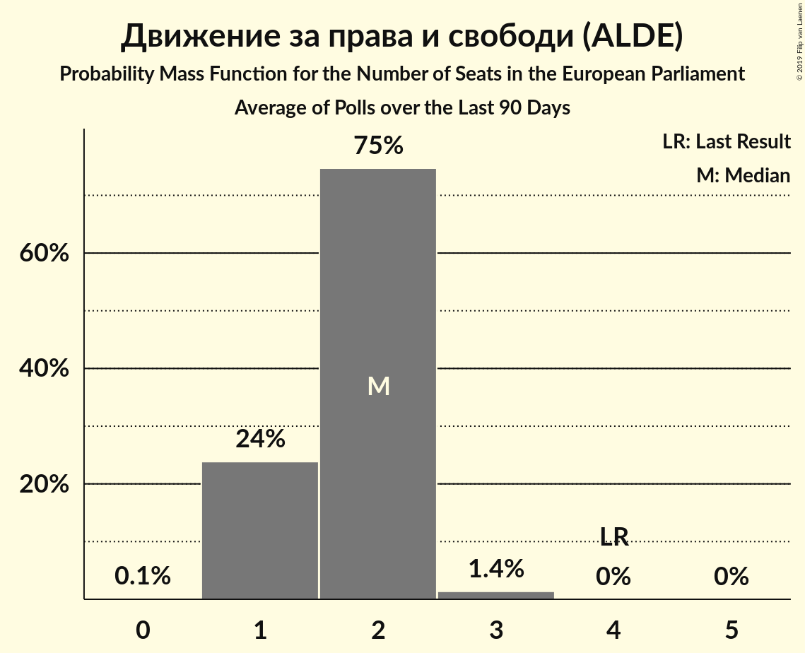

# Движение за права и свободи (ALDE)

<a href="#voting-intentions">Voting Intentions</a> | <a href="#seats">Seats</a>

## Voting Intentions

Last result: **17.3%** (General Election of 25 May 2014)

### Confidence Intervals

| Period     | Polling firm/Commissioner(s) | Median | 80% Confidence Interval | 90% Confidence Interval | 95% Confidence Interval | 99% Confidence Interval |
|:----------:|:----------------:|:-----------:|:-----------------------:|:-----------------------:|:-----------------------:|:-----------------------:|
| N/A | [Poll Average](average.html) | 9.7% | 7.1–11.8% | 6.6–12.3% | 6.2–12.7% | 5.6–13.5% |
| [4–11 September 2018](2018-09-11-Тренд.html) | Тренд   24 часа | 10.1% | 8.7–11.8% | 8.3–12.3% | 8.0–12.7% | 7.3–13.5% |
| [1–6 July 2018](2018-07-06-Медиана.html) | Медиана | 10.7% | 9.4–12.3% | 9.1–12.7% | 8.7–13.1% | 8.2–13.9% |
| [17 May–25 June 2018](2018-06-25-Алфарисърч.html) | Алфа рисърч | 7.5% | 6.4–9.0% | 6.0–9.4% | 5.7–9.8% | 5.2–10.5% |
| [1–9 June 2018](2018-06-09-Тренд.html) | Тренд   24 часа | 10.6% | 9.1–12.3% | 8.7–12.8% | 8.4–13.2% | 7.8–14.1% |
| [2–10 May 2018](2018-05-10-Тренд.html) | Тренд   24 часа | 10.5% | 9.0–12.2% | 8.6–12.7% | 8.3–13.1% | 7.7–14.0% |
| [1–7 March 2018](2018-03-07-Тренд.html) | Тренд   24 часа | 10.9% | 9.4–12.7% | 9.0–13.2% | 8.7–13.6% | 8.0–14.5% |
| [10–18 January 2018](2018-01-18-Тренд.html) | Тренд   24 часа | 10.0% | 8.6–11.7% | 8.2–12.2% | 7.9–12.7% | 7.2–13.5% |
| [7–13 December 2017](2017-12-13-Exacta.html) | Exacta | 8.4% | 7.2–10.0% | 6.9–10.4% | 6.6–10.8% | 6.0–11.6% |

### Probability Mass Function

The following table shows the probability mass function per percentage block of voting intentions for the [poll average](average.html) for Движение за права и свободи (ALDE).

| Voting Intentions | Probability | Accumulated | Special Marks |
|:-----------------:|:-----------:|:-----------:|:-------------:|
| 3.5–4.5% | 0% | 100% |  |
| 4.5–5.5% | 0.5% | 100% |  |
| 5.5–6.5% | 4% | 99.5% |  |
| 6.5–7.5% | 11% | 95% |  |
| 7.5–8.5% | 14% | 84% |  |
| 8.5–9.5% | 16% | 70% |  |
| 9.5–10.5% | 21% | 54% | Median |
| 10.5–11.5% | 20% | 32% |  |
| 11.5–12.5% | 10% | 13% |  |
| 12.5–13.5% | 3% | 3% |  |
| 13.5–14.5% | 0.4% | 0.5% |  |
| 14.5–15.5% | 0% | 0% |  |
| 15.5–16.5% | 0% | 0% |  |
| 16.5–17.5% | 0% | 0% | Last Result |

## Seats

Last result: **4** seats (General Election of 25 May 2014)

### Confidence Intervals

| Period     | Polling firm/Commissioner(s) | Median | 80% Confidence Interval | 90% Confidence Interval | 95% Confidence Interval | 99% Confidence Interval |
|:----------:|:----------------:|:------:|:-----------------------:|:-----------------------:|:-----------------------:|:-----------------------:|
| N/A | [Poll Average](average.html) | 2 | 1–2 | 1–2 | 1–2 | 1–2 |
| [4–11 September 2018](2018-09-11-Тренд.html) | Тренд   24 часа | 2 | 2 | 1–2 | 1–2 | 1–3 |
| [1–6 July 2018](2018-07-06-Медиана.html) | Медиана | 2 | 2 | 2 | 1–2 | 1–2 |
| [17 May–25 June 2018](2018-06-25-Алфарисърч.html) | Алфа рисърч | 1 | 1–2 | 1–2 | 1–2 | 1–2 |
| [1–9 June 2018](2018-06-09-Тренд.html) | Тренд   24 часа | 2 | 2 | 2 | 2–3 | 1–3 |
| [2–10 May 2018](2018-05-10-Тренд.html) | Тренд   24 часа | 2 | 2 | 2 | 2–3 | 1–3 |
| [1–7 March 2018](2018-03-07-Тренд.html) | Тренд   24 часа | 2 | 2 | 2–3 | 2–3 | 1–3 |
| [10–18 January 2018](2018-01-18-Тренд.html) | Тренд   24 часа | 2 | 2 | 2 | 1–2 | 1–3 |
| [7–13 December 2017](2017-12-13-Exacta.html) | Exacta | 2 | 1–2 | 1–2 | 1–2 | 1–2 |

### Probability Mass Function

The following table shows the probability mass function per seat for the [poll average](average.html) for Движение за права и свободи (ALDE).

| Number of Seats | Probability | Accumulated | Special Marks |
|:---------------:|:-----------:|:-----------:|:-------------:|
| 0 | 0.1% | 100% |  |
| 1 | 27% | 99.9% |  |
| 2 | 73% | 73% | Median |
| 3 | 0.3% | 0.3% |  |
| 4 | 0% | 0% | Last Result |

