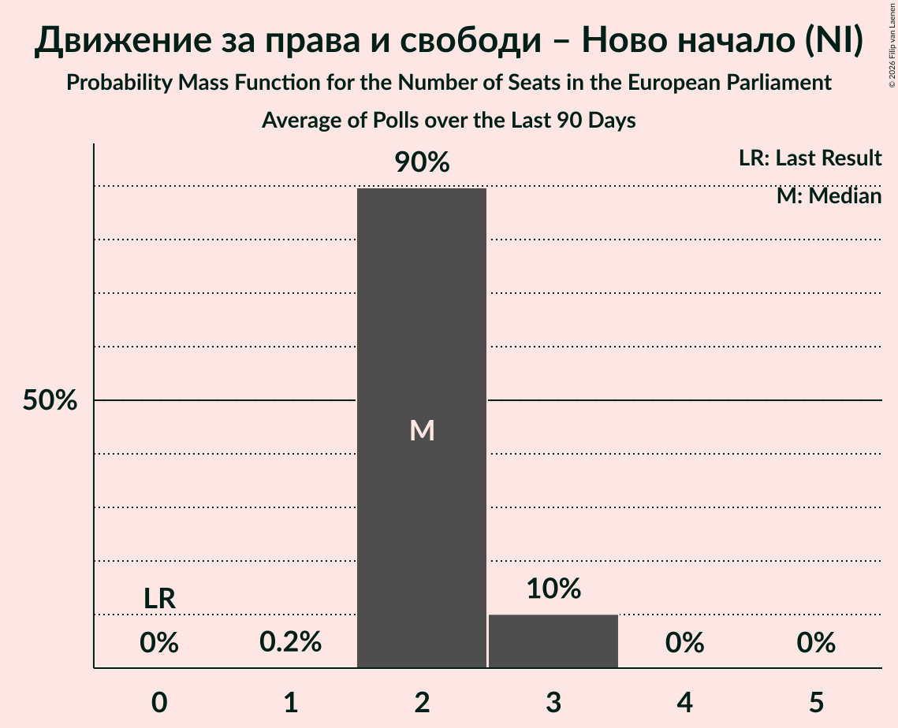

# Движение за права и свободи – Ново начало (NI)

<a href="#voting-intentions">Voting Intentions</a> | <a href="#seats">Seats</a>

## Voting Intentions

Last result: **0.0%** (General Election of 9 June 2024)

### Confidence Intervals

| Period     | Polling firm/Commissioner(s) | Median | 80% Confidence Interval | 90% Confidence Interval | 95% Confidence Interval | 99% Confidence Interval |
|:----------:|:----------------:|:-----------:|:-----------------------:|:-----------------------:|:-----------------------:|:-----------------------:|
| N/A | [Poll Average](average.html) | 10.9% | 9.3–13.2% | 8.9–13.9% | 8.5–14.5% | 7.9–15.5% |
| [23 February–2 March 2026](2026-03-02-Алфарисърч.html) | Алфа рисърч | 9.6% | 8.5–10.9% | 8.2–11.3% | 7.9–11.6% | 7.4–12.2% |
| [10–28 February 2026](2026-02-28-GallupInternational.html) | Gallup International | 11.2% | 9.8–12.8% | 9.5–13.2% | 9.1–13.6% | 8.6–14.4% |
| [17–24 February 2026](2026-02-24-Центързаанализиимаркетинг.html) | Център за анализи и маркетинг | 10.8% | 9.6–12.2% | 9.3–12.6% | 9.0–13.0% | 8.5–13.7% |
| [12–18 February 2026](2026-02-18-Тренд.html) | Тренд   24 часа | 10.5% | 9.3–11.8% | 9.0–12.2% | 8.7–12.5% | 8.2–13.2% |
| [9–15 February 2026](2026-02-15-Мяра.html) | Мяра | 10.7% | 9.4–12.2% | 9.1–12.7% | 8.8–13.0% | 8.2–13.8% |
| [7–13 February 2026](2026-02-13-МаркетЛИНКС.html) | Маркет ЛИНКС   bTV | 13.1% | 11.7–14.8% | 11.3–15.2% | 11.0–15.7% | 10.3–16.5% |
| [18–29 December 2025](2025-12-29-МаркетЛИНКС.html) | Маркет ЛИНКС   bTV | 12.3% | N/A | N/A | N/A | N/A |
| [5–12 December 2025](2025-12-12-Алфарисърч.html) | Алфа рисърч | 10.8% | 9.6–12.3% | 9.2–12.7% | 8.9–13.1% | 8.4–13.8% |
| [3–7 December 2025](2025-12-07-МаркетЛИНКС.html) | Маркет ЛИНКС   bTV | 12.9% | N/A | N/A | N/A | N/A |
| [29 September–12 October 2025](2025-10-12-GallupInternational.html) | Gallup International | 17.5% | N/A | N/A | N/A | N/A |
| [13–20 September 2025](2025-09-20-Тренд.html) | Тренд   24 часа | 13.5% | N/A | N/A | N/A | N/A |
| [4–12 September 2025](2025-09-12-Мяра.html) | Мяра | 13.6% | N/A | N/A | N/A | N/A |
| [11–23 July 2025](2025-07-23-GallupInternational.html) | Gallup International | 18.0% | N/A | N/A | N/A | N/A |
| [7–14 July 2025](2025-07-14-Алфарисърч.html) | Алфа рисърч | 14.0% | N/A | N/A | N/A | N/A |
| [9–11 June 2025](2025-06-11-SovaHarris.html) | Sova Harris | 8.7% | N/A | N/A | N/A | N/A |
| [28 May–4 June 2025](2025-06-04-GallupInternational.html) | Gallup International | 16.1% | N/A | N/A | N/A | N/A |
| [12–18 May 2025](2025-05-18-Тренд.html) | Тренд   24 часа | 11.6% | N/A | N/A | N/A | N/A |
| [18–30 April 2025](2025-04-30-МаркетЛИНКС.html) | Маркет ЛИНКС   bTV | 12.8% | N/A | N/A | N/A | N/A |
| [3–13 April 2025](2025-04-13-Мяра.html) | Мяра | 10.3% | N/A | N/A | N/A | N/A |
| [22–30 March 2025](2025-03-30-МаркетЛИНКС.html) | Маркет ЛИНКС   bTV | 12.8% | N/A | N/A | N/A | N/A |
| [19–30 March 2025](2025-03-30-GallupInternational.html) | Gallup International | 16.0% | N/A | N/A | N/A | N/A |
| [10–16 March 2025](2025-03-16-Тренд.html) | Тренд   24 часа | 10.9% | N/A | N/A | N/A | N/A |
| [22 February–2 March 2025](2025-03-02-МаркетЛИНКС.html) | Маркет ЛИНКС   bTV | 13.4% | N/A | N/A | N/A | N/A |
| [13–20 February 2025](2025-02-20-GallupInternational.html) | Gallup International | 13.1% | N/A | N/A | N/A | N/A |
| [6–16 February 2025](2025-02-16-Мяра.html) | Мяра | 10.2% | N/A | N/A | N/A | N/A |
| [25 January–3 February 2025](2025-02-03-МаркетЛИНКС.html) | Маркет ЛИНКС   bTV | 11.0% | N/A | N/A | N/A | N/A |
| [24–30 January 2025](2025-01-30-Тренд.html) | Тренд   24 часа | 10.3% | N/A | N/A | N/A | N/A |
| [15–20 January 2025](2025-01-20-Алфарисърч.html) | Алфа рисърч | 11.5% | N/A | N/A | N/A | N/A |
| [8–12 January 2025](2025-01-12-GallupInternational.html) | Gallup International | 14.1% | N/A | N/A | N/A | N/A |
| [12–20 December 2024](2024-12-20-МаркетЛИНКС.html) | Маркет ЛИНКС   bTV | 12.5% | N/A | N/A | N/A | N/A |
| [20–23 October 2024](2024-10-23-Алфарисърч.html) | Алфа рисърч | 7.4% | N/A | N/A | N/A | N/A |
| [16–22 October 2024](2024-10-22-Тренд.html) | Тренд   24 часа | 7.0% | N/A | N/A | N/A | N/A |
| [19–22 October 2024](2024-10-22-Exacta.html) | Exacta | 7.3% | N/A | N/A | N/A | N/A |
| [10–21 October 2024](2024-10-21-GallupInternational.html) | Gallup International   BNR | 7.6% | N/A | N/A | N/A | N/A |
| [15–20 October 2024](2024-10-20-МаркетЛИНКС.html) | Маркет ЛИНКС   bTV | 8.1% | N/A | N/A | N/A | N/A |
| [11–17 October 2024](2024-10-17-SovaHarris.html) | Sova Harris   ПИК | 6.5% | N/A | N/A | N/A | N/A |
| [8–13 October 2024](2024-10-13-Медиана.html) | Медиана | 5.6% | N/A | N/A | N/A | N/A |
| [28 September–6 October 2024](2024-10-06-GallupInternational.html) | Gallup International | 6.9% | N/A | N/A | N/A | N/A |
| [25 September–1 October 2024](2024-10-01-МаркетЛИНКС.html) | Маркет ЛИНКС   bTV | 7.5% | N/A | N/A | N/A | N/A |
| [17–24 September 2024](2024-09-24-Тренд.html) | Тренд   24 часа | 5.8% | N/A | N/A | N/A | N/A |
| [18–24 September 2024](2024-09-24-Алфарисърч.html) | Алфа рисърч | 6.6% | N/A | N/A | N/A | N/A |
| [14–23 August 2024](2024-08-23-МаркетЛИНКС.html) | Маркет ЛИНКС   bTV | 0.0% | N/A | N/A | N/A | N/A |
| [1–9 August 2024](2024-08-09-GallupInternational.html) | Gallup International   БНТ | 0.0% | N/A | N/A | N/A | N/A |
| [20–28 July 2024](2024-07-28-МаркетЛИНКС.html) | Маркет ЛИНКС | 0.0% | N/A | N/A | N/A | N/A |

### Probability Mass Function

The following table shows the probability mass function per percentage block of voting intentions for the [poll average](average.html) for Движение за права и свободи – Ново начало (NI).

| Voting Intentions | Probability | Accumulated | Special Marks |
|:-----------------:|:-----------:|:-----------:|:-------------:|
| 0.0–0.5% | 0% | 100% | Last Result |
| 0.5–1.5% | 0% | 100% |  |
| 1.5–2.5% | 0% | 100% |  |
| 2.5–3.5% | 0% | 100% |  |
| 3.5–4.5% | 0% | 100% |  |
| 4.5–5.5% | 0% | 100% |  |
| 5.5–6.5% | 0% | 100% |  |
| 6.5–7.5% | 0.1% | 100% |  |
| 7.5–8.5% | 2% | 99.9% |  |
| 8.5–9.5% | 12% | 97% |  |
| 9.5–10.5% | 25% | 85% |  |
| 10.5–11.5% | 27% | 60% | Median |
| 11.5–12.5% | 17% | 33% |  |
| 12.5–13.5% | 9% | 17% |  |
| 13.5–14.5% | 5% | 7% |  |
| 14.5–15.5% | 2% | 2% |  |
| 15.5–16.5% | 0.4% | 0.5% |  |
| 16.5–17.5% | 0.1% | 0.1% |  |
| 17.5–18.5% | 0% | 0% |  |

## Seats

Last result: **0** seats (General Election of 9 June 2024)

### Confidence Intervals

| Period     | Polling firm/Commissioner(s) | Median | 80% Confidence Interval | 90% Confidence Interval | 95% Confidence Interval | 99% Confidence Interval |
|:----------:|:----------------:|:------:|:-----------------------:|:-----------------------:|:-----------------------:|:-----------------------:|
| N/A | [Poll Average](average.html) | 2 | 2–3 | 2–3 | 2–3 | 1–3 |
| [23 February–2 March 2026](2026-03-02-Алфарисърч.html) | Алфа рисърч | 2 | 2 | 2 | 1–2 | 1–2 |
| [10–28 February 2026](2026-02-28-GallupInternational.html) | Gallup International | 2 | 2–3 | 2–3 | 2–3 | 2–3 |
| [17–24 February 2026](2026-02-24-Центързаанализиимаркетинг.html) | Център за анализи и маркетинг | 2 | 2 | 2 | 2 | 2–3 |
| [12–18 February 2026](2026-02-18-Тренд.html) | Тренд   24 часа | 2 | 2 | 2 | 2–3 | 2–3 |
| [9–15 February 2026](2026-02-15-Мяра.html) | Мяра | 2 | 2–3 | 2–3 | 2–3 | 2–3 |
| [7–13 February 2026](2026-02-13-МаркетЛИНКС.html) | Маркет ЛИНКС   bTV | 3 | 2–3 | 2–3 | 2–3 | 2–3 |
| [18–29 December 2025](2025-12-29-МаркетЛИНКС.html) | Маркет ЛИНКС   bTV |  |  |  |  |  |
| [5–12 December 2025](2025-12-12-Алфарисърч.html) | Алфа рисърч | 2 | 2 | 2–3 | 2–3 | 2–3 |
| [3–7 December 2025](2025-12-07-МаркетЛИНКС.html) | Маркет ЛИНКС   bTV |  |  |  |  |  |
| [29 September–12 October 2025](2025-10-12-GallupInternational.html) | Gallup International |  |  |  |  |  |
| [13–20 September 2025](2025-09-20-Тренд.html) | Тренд   24 часа |  |  |  |  |  |
| [4–12 September 2025](2025-09-12-Мяра.html) | Мяра |  |  |  |  |  |
| [11–23 July 2025](2025-07-23-GallupInternational.html) | Gallup International |  |  |  |  |  |
| [7–14 July 2025](2025-07-14-Алфарисърч.html) | Алфа рисърч |  |  |  |  |  |
| [9–11 June 2025](2025-06-11-SovaHarris.html) | Sova Harris |  |  |  |  |  |
| [28 May–4 June 2025](2025-06-04-GallupInternational.html) | Gallup International |  |  |  |  |  |
| [12–18 May 2025](2025-05-18-Тренд.html) | Тренд   24 часа |  |  |  |  |  |
| [18–30 April 2025](2025-04-30-МаркетЛИНКС.html) | Маркет ЛИНКС   bTV |  |  |  |  |  |
| [3–13 April 2025](2025-04-13-Мяра.html) | Мяра |  |  |  |  |  |
| [22–30 March 2025](2025-03-30-МаркетЛИНКС.html) | Маркет ЛИНКС   bTV |  |  |  |  |  |
| [19–30 March 2025](2025-03-30-GallupInternational.html) | Gallup International |  |  |  |  |  |
| [10–16 March 2025](2025-03-16-Тренд.html) | Тренд   24 часа |  |  |  |  |  |
| [22 February–2 March 2025](2025-03-02-МаркетЛИНКС.html) | Маркет ЛИНКС   bTV |  |  |  |  |  |
| [13–20 February 2025](2025-02-20-GallupInternational.html) | Gallup International |  |  |  |  |  |
| [6–16 February 2025](2025-02-16-Мяра.html) | Мяра |  |  |  |  |  |
| [25 January–3 February 2025](2025-02-03-МаркетЛИНКС.html) | Маркет ЛИНКС   bTV |  |  |  |  |  |
| [24–30 January 2025](2025-01-30-Тренд.html) | Тренд   24 часа |  |  |  |  |  |
| [15–20 January 2025](2025-01-20-Алфарисърч.html) | Алфа рисърч |  |  |  |  |  |
| [8–12 January 2025](2025-01-12-GallupInternational.html) | Gallup International |  |  |  |  |  |
| [12–20 December 2024](2024-12-20-МаркетЛИНКС.html) | Маркет ЛИНКС   bTV |  |  |  |  |  |
| [20–23 October 2024](2024-10-23-Алфарисърч.html) | Алфа рисърч |  |  |  |  |  |
| [16–22 October 2024](2024-10-22-Тренд.html) | Тренд   24 часа |  |  |  |  |  |
| [19–22 October 2024](2024-10-22-Exacta.html) | Exacta |  |  |  |  |  |
| [10–21 October 2024](2024-10-21-GallupInternational.html) | Gallup International   BNR |  |  |  |  |  |
| [15–20 October 2024](2024-10-20-МаркетЛИНКС.html) | Маркет ЛИНКС   bTV |  |  |  |  |  |
| [11–17 October 2024](2024-10-17-SovaHarris.html) | Sova Harris   ПИК |  |  |  |  |  |
| [8–13 October 2024](2024-10-13-Медиана.html) | Медиана |  |  |  |  |  |
| [28 September–6 October 2024](2024-10-06-GallupInternational.html) | Gallup International |  |  |  |  |  |
| [25 September–1 October 2024](2024-10-01-МаркетЛИНКС.html) | Маркет ЛИНКС   bTV |  |  |  |  |  |
| [17–24 September 2024](2024-09-24-Тренд.html) | Тренд   24 часа |  |  |  |  |  |
| [18–24 September 2024](2024-09-24-Алфарисърч.html) | Алфа рисърч |  |  |  |  |  |
| [14–23 August 2024](2024-08-23-МаркетЛИНКС.html) | Маркет ЛИНКС   bTV |  |  |  |  |  |
| [1–9 August 2024](2024-08-09-GallupInternational.html) | Gallup International   БНТ |  |  |  |  |  |
| [20–28 July 2024](2024-07-28-МаркетЛИНКС.html) | Маркет ЛИНКС |  |  |  |  |  |

### Probability Mass Function

The following table shows the probability mass function per seat for the [poll average](average.html) for Движение за права и свободи – Ново начало (NI).

| Number of Seats | Probability | Accumulated | Special Marks |
|:---------------:|:-----------:|:-----------:|:-------------:|
| 0 | 0% | 100% | Last Result |
| 1 | 0.6% | 100% |  |
| 2 | 80% | 99.4% | Median |
| 3 | 19% | 19% |  |
| 4 | 0% | 0% |  |

