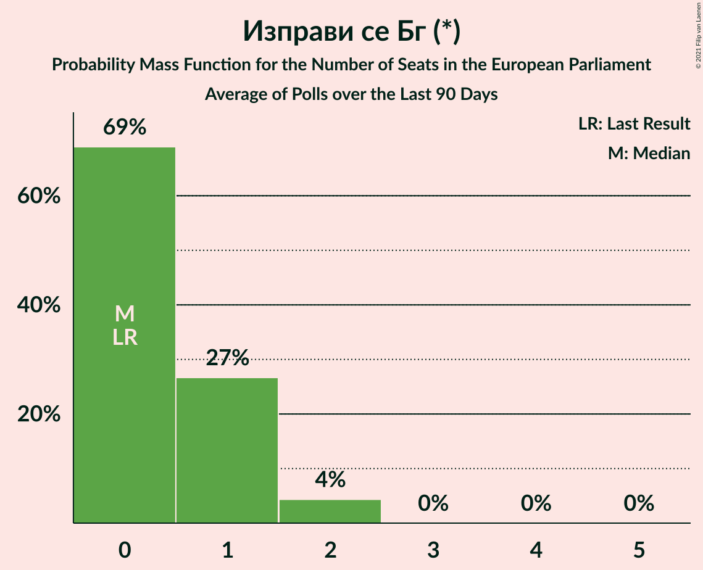

# Изправи се Бг (*)

<a href="#voting-intentions">Voting Intentions</a> | <a href="#seats">Seats</a>

## Voting Intentions

Last result: **0.0%** (General Election of 26 May 2019)

### Confidence Intervals

| Period     | Polling firm/Commissioner(s) | Median | 80% Confidence Interval | 90% Confidence Interval | 95% Confidence Interval | 99% Confidence Interval |
|:----------:|:----------------:|:-----------:|:-----------------------:|:-----------------------:|:-----------------------:|:-----------------------:|
| N/A | [Poll Average](average.html) | 4.3% | 2.1–5.5% | 1.7–5.8% | 1.5–6.1% | 1.2–6.7% |
| [3–11 September 2020](2020-09-11-GallupInternational.html) | Gallup International | 4.1% | 3.2–5.4% | 2.9–5.8% | 2.7–6.2% | 2.3–6.9% |
| [29 August–5 September 2020](2020-09-05-Тренд.html) | Тренд   24 часа | 4.0% | 3.3–4.9% | 3.1–5.1% | 2.9–5.4% | 2.6–5.8% |
| [19–25 August 2020](2020-08-25-SovaHarris.html) | Sova Harris | 4.5% | 3.6–5.8% | 3.4–6.1% | 3.2–6.4% | 2.8–7.1% |
| [3–11 August 2020](2020-08-11-БарометърБългария.html) | Барометър България | 1.9% | 1.4–2.7% | 1.3–2.9% | 1.2–3.1% | 1.0–3.5% |
| [3–10 August 2020](2020-08-10-Тренд.html) | Тренд   24 часа | 4.6% | 3.8–5.5% | 3.6–5.8% | 3.4–6.0% | 3.1–6.5% |
| [30 July–7 August 2020](2020-08-07-GallupInternational.html) | Gallup International | 3.7% | 2.9–5.0% | 2.6–5.4% | 2.4–5.7% | 2.1–6.4% |
| [1–5 August 2020](2020-08-05-ПИК.html) | ПИК | 5.0% | 4.2–6.0% | 4.0–6.3% | 3.8–6.5% | 3.5–7.0% |
| [28 July–3 August 2020](2020-08-03-МаркетЛИНКС.html) | Маркет ЛИНКС | 4.1% | 3.3–5.2% | 3.0–5.5% | 2.8–5.8% | 2.5–6.4% |
| [23–30 July 2020](2020-07-30-Алфарисърч.html) | Алфа рисърч   Дневник | 6.0% | 4.9–7.5% | 4.5–7.9% | 4.3–8.3% | 3.8–9.1% |
| [26 June–1 July 2020](2020-07-01-SovaHarris.html) | Sova Harris | 2.6% | 2.0–3.7% | 1.8–4.0% | 1.6–4.3% | 1.3–4.9% |
| [20–25 June 2020](2020-06-25-БарометърБългария.html) | Барометър България | 1.6% | 1.1–2.3% | 1.0–2.5% | 0.9–2.7% | 0.7–3.1% |
| [27 May–3 June 2020](2020-06-03-МаркетЛИНКС.html) | Маркет ЛИНКС | 0.0% | N/A | N/A | N/A | N/A |
| [28 April–5 May 2020](2020-05-05-Алфарисърч.html) | Алфа рисърч   Дневник | 0.0% | N/A | N/A | N/A | N/A |
| [3–10 February 2020](2020-02-10-Тренд.html) | Тренд   24 часа | 0.0% | N/A | N/A | N/A | N/A |
| [9–13 January 2020](2020-01-13-БарометърБългария.html) | Барометър България | 0.0% | N/A | N/A | N/A | N/A |
| [5–12 December 2019](2019-12-12-Алфарисърч.html) | Алфа рисърч | 0.0% | N/A | N/A | N/A | N/A |
| [21–28 November 2019](2019-11-28-МаркетЛИНКС.html) | Маркет ЛИНКС | 0.0% | N/A | N/A | N/A | N/A |
| [7–15 November 2019](2019-11-15-Тренд.html) | Тренд | 0.0% | N/A | N/A | N/A | N/A |
| [10–16 September 2019](2019-09-16-Алфарисърч.html) | Алфа рисърч | 0.0% | N/A | N/A | N/A | N/A |
| [5–12 July 2019](2019-07-12-Тренд.html) | Тренд   24 часа | 0.0% | N/A | N/A | N/A | N/A |
| [11–19 June 2019](2019-06-19-МаркетЛИНКС.html) | Маркет ЛИНКС | 0.0% | N/A | N/A | N/A | N/A |

### Probability Mass Function

The following table shows the probability mass function per percentage block of voting intentions for the [poll average](average.html) for Изправи се Бг (*).

| Voting Intentions | Probability | Accumulated | Special Marks |
|:-----------------:|:-----------:|:-----------:|:-------------:|
| 0.0–0.5% | 0% | 100% | Last Result |
| 0.5–1.5% | 3% | 100% |  |
| 1.5–2.5% | 12% | 97% |  |
| 2.5–3.5% | 13% | 85% |  |
| 3.5–4.5% | 33% | 72% | Median |
| 4.5–5.5% | 30% | 39% |  |
| 5.5–6.5% | 8% | 9% |  |
| 6.5–7.5% | 0.8% | 0.8% |  |
| 7.5–8.5% | 0% | 0% |  |

## Seats

Last result: **0** seats (General Election of 26 May 2019)

### Confidence Intervals

| Period     | Polling firm/Commissioner(s) | Median | 80% Confidence Interval | 90% Confidence Interval | 95% Confidence Interval | 99% Confidence Interval |
|:----------:|:----------------:|:------:|:-----------------------:|:-----------------------:|:-----------------------:|:-----------------------:|
| N/A | [Poll Average](average.html) | 0 | 0–1 | 0–1 | 0–1 | 0–1 |
| [3–11 September 2020](2020-09-11-GallupInternational.html) | Gallup International | 0 | 0–1 | 0–1 | 0–1 | 0–1 |
| [29 August–5 September 2020](2020-09-05-Тренд.html) | Тренд   24 часа | 0 | 0 | 0 | 0–1 | 0–1 |
| [19–25 August 2020](2020-08-25-SovaHarris.html) | Sova Harris | 0 | 0–1 | 0–1 | 0–1 | 0–1 |
| [3–11 August 2020](2020-08-11-БарометърБългария.html) | Барометър България | 0 | 0 | 0 | 0 | 0 |
| [3–10 August 2020](2020-08-10-Тренд.html) | Тренд   24 часа | 0 | 0–1 | 0–1 | 0–1 | 0–1 |
| [30 July–7 August 2020](2020-08-07-GallupInternational.html) | Gallup International | 0 | 0 | 0–1 | 0–1 | 0–1 |
| [1–5 August 2020](2020-08-05-ПИК.html) | ПИК | 0 | 0–1 | 0–1 | 0–1 | 0–1 |
| [28 July–3 August 2020](2020-08-03-МаркетЛИНКС.html) | Маркет ЛИНКС | 0 | 0–1 | 0–1 | 0–1 | 0–1 |
| [23–30 July 2020](2020-07-30-Алфарисърч.html) | Алфа рисърч   Дневник | 1 | 0–1 | 0–1 | 0–2 | 0–2 |
| [26 June–1 July 2020](2020-07-01-SovaHarris.html) | Sova Harris | 0 | 0 | 0 | 0 | 0 |
| [20–25 June 2020](2020-06-25-БарометърБългария.html) | Барометър България | 0 | 0 | 0 | 0 | 0 |
| [27 May–3 June 2020](2020-06-03-МаркетЛИНКС.html) | Маркет ЛИНКС |  |  |  |  |  |
| [28 April–5 May 2020](2020-05-05-Алфарисърч.html) | Алфа рисърч   Дневник |  |  |  |  |  |
| [3–10 February 2020](2020-02-10-Тренд.html) | Тренд   24 часа |  |  |  |  |  |
| [9–13 January 2020](2020-01-13-БарометърБългария.html) | Барометър България |  |  |  |  |  |
| [5–12 December 2019](2019-12-12-Алфарисърч.html) | Алфа рисърч |  |  |  |  |  |
| [21–28 November 2019](2019-11-28-МаркетЛИНКС.html) | Маркет ЛИНКС |  |  |  |  |  |
| [7–15 November 2019](2019-11-15-Тренд.html) | Тренд |  |  |  |  |  |
| [10–16 September 2019](2019-09-16-Алфарисърч.html) | Алфа рисърч |  |  |  |  |  |
| [5–12 July 2019](2019-07-12-Тренд.html) | Тренд   24 часа |  |  |  |  |  |
| [11–19 June 2019](2019-06-19-МаркетЛИНКС.html) | Маркет ЛИНКС |  |  |  |  |  |

### Probability Mass Function

The following table shows the probability mass function per seat for the [poll average](average.html) for Изправи се Бг (*).

| Number of Seats | Probability | Accumulated | Special Marks |
|:---------------:|:-----------:|:-----------:|:-------------:|
| 0 | 82% | 100% | Last Result, Median |
| 1 | 18% | 18% |  |
| 2 | 0% | 0% |  |

