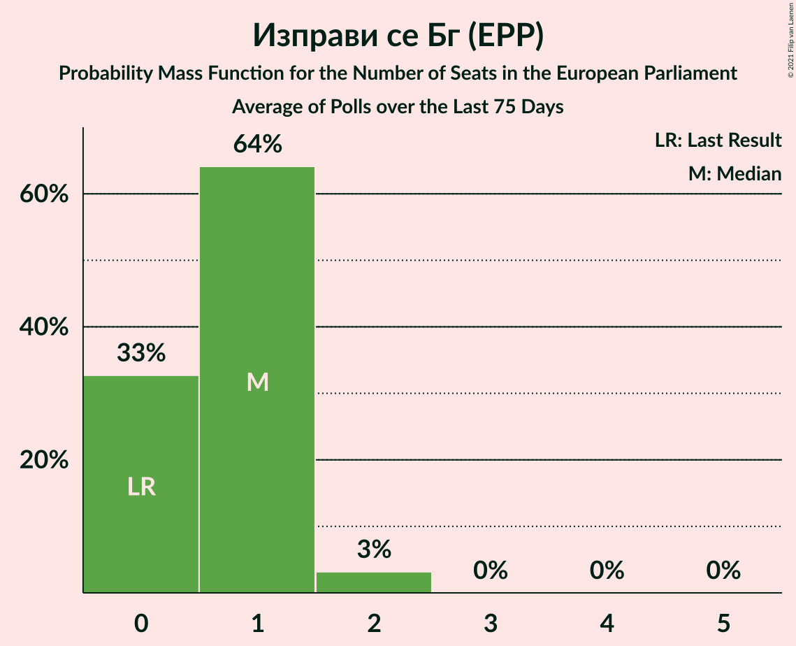

# Изправи се Бг (EPP)

<a href="#voting-intentions">Voting Intentions</a> | <a href="#seats">Seats</a>

## Voting Intentions

Last result: **0.0%** (General Election of 26 May 2019)

### Confidence Intervals

| Period     | Polling firm/Commissioner(s) | Median | 80% Confidence Interval | 90% Confidence Interval | 95% Confidence Interval | 99% Confidence Interval |
|:----------:|:----------------:|:-----------:|:-----------------------:|:-----------------------:|:-----------------------:|:-----------------------:|
| N/A | [Poll Average](average.html) | 5.5% | 4.2–7.1% | 3.9–7.6% | 3.6–8.1% | 3.1–8.9% |
| [4–7 July 2021](2021-07-07-Алфарисърч.html) | Алфа рисърч | 5.5% | 4.3–7.0% | 4.0–7.5% | 3.7–7.9% | 3.3–8.7% |
| [30 June–7 July 2021](2021-07-07-Gallup.html) | Gallup   BNR | 6.1% | 5.0–7.7% | 4.6–8.2% | 4.4–8.6% | 3.9–9.4% |
| [2–6 July 2021](2021-07-06-SovaHarris.html) | Sova Harris   Dir.bg | 5.2% | 4.2–6.8% | 3.9–7.2% | 3.6–7.6% | 3.1–8.4% |
| [1–5 July 2021](2021-07-05-Exacta.html) | Exacta | 4.8% | 3.7–6.3% | 3.4–6.7% | 3.2–7.1% | 2.8–7.8% |
| [26 June–2 July 2021](2021-07-02-Медиана.html) | Медиана | 5.1% | 4.3–6.2% | 4.1–6.5% | 3.9–6.7% | 3.5–7.3% |
| [23–30 June 2021](2021-06-30-Nasoca.html) | Nasoca | 5.3% | 4.3–6.8% | 4.0–7.2% | 3.7–7.6% | 3.3–8.4% |
| [18–25 June 2021](2021-06-25-MarketLinks.html) | Market Links   bTV | 6.6% | 5.5–8.0% | 5.1–8.4% | 4.9–8.8% | 4.4–9.5% |
| [11–18 June 2021](2021-06-18-Тренд.html) | Тренд   24 часа | 5.0% | 3.9–6.5% | 3.6–6.9% | 3.4–7.3% | 2.9–8.1% |
| [10–15 June 2021](2021-06-15-Медиана.html) | Медиана | 6.9% | 6.0–8.1% | 5.7–8.4% | 5.5–8.7% | 5.1–9.3% |
| [10–15 June 2021](2021-06-15-SovaHarris.html) | Sova Harris   Dir.bg | 5.4% | 4.3–6.9% | 3.9–7.4% | 3.7–7.8% | 3.2–8.6% |
| [3–11 June 2021](2021-06-11-Gallup.html) | Gallup   BNR | 5.8% | 4.7–7.2% | 4.4–7.6% | 4.2–8.0% | 3.7–8.7% |
| [30 May–7 June 2021](2021-06-07-Алфарисърч.html) | Алфа рисърч | 5.2% | 4.2–6.7% | 3.9–7.1% | 3.6–7.5% | 3.2–8.2% |
| [19–27 May 2021](2021-05-27-MarketLinks.html) | Market Links   bTV | 4.8% | 3.9–6.0% | 3.6–6.3% | 3.4–6.7% | 3.0–7.3% |
| [7–14 May 2021](2021-05-14-Gallup.html) | Gallup | 5.5% | 4.4–7.1% | 4.1–7.6% | 3.8–8.0% | 3.3–8.8% |
| [16–23 April 2021](2021-04-23-МаркетЛИНКС.html) | Маркет ЛИНКС   bTV | 6.5% | 5.4–7.9% | 5.1–8.3% | 4.8–8.7% | 4.3–9.4% |
| [24–31 March 2021](2021-03-31-Gallup.html) | Gallup   BNR | 5.2% | 4.0–6.9% | 3.7–7.4% | 3.4–7.8% | 2.9–8.7% |
| [26–30 March 2021](2021-03-30-Тренд.html) | Тренд   Nova | 4.9% | 3.8–6.4% | 3.5–6.8% | 3.3–7.2% | 2.8–8.0% |
| [27–30 March 2021](2021-03-30-ПИК.html) | ПИК | 4.6% | 3.4–6.5% | 3.1–7.0% | 2.8–7.5% | 2.3–8.5% |
| [27–30 March 2021](2021-03-30-Алфарисърч.html) | Алфа рисърч | 6.0% | 4.9–7.6% | 4.6–8.0% | 4.3–8.4% | 3.8–9.3% |
| [26–30 March 2021](2021-03-30-AFIS.html) | AFIS | 5.0% | 3.8–6.7% | 3.5–7.2% | 3.2–7.7% | 2.7–8.6% |
| [23–29 March 2021](2021-03-29-Exacta.html) | Exacta | 4.2% | 3.2–5.7% | 2.9–6.1% | 2.7–6.5% | 2.3–7.3% |
| [25–28 March 2021](2021-03-28-Рего.html) | Рего | 6.8% | 5.8–8.2% | 5.5–8.6% | 5.2–8.9% | 4.8–9.6% |
| [19–23 March 2021](2021-03-23-ПИК.html) | ПИК   Pik | 4.3% | 3.6–5.2% | 3.4–5.5% | 3.2–5.7% | 2.9–6.2% |
| [16–23 March 2021](2021-03-23-Медиана.html) | Медиана | 6.6% | 5.5–8.1% | 5.2–8.6% | 4.9–8.9% | 4.4–9.7% |
| [18–23 March 2021](2021-03-23-МаркетЛИНКС.html) | Маркет ЛИНКС   bTV | 5.5% | 4.4–7.1% | 4.1–7.6% | 3.8–8.0% | 3.3–8.8% |
| [11–16 March 2021](2021-03-16-SovaHarris.html) | Sova Harris   Trud | 4.9% | 3.8–6.5% | 3.5–7.0% | 3.2–7.4% | 2.8–8.2% |
| [9–14 March 2021](2021-03-14-Тренд.html) | Тренд   24 часа | 4.2% | 3.2–5.7% | 2.9–6.1% | 2.7–6.5% | 2.3–7.3% |
| [26 February–1 March 2021](2021-03-01-Алфарисърч.html) | Алфа рисърч   bTV | 4.5% | 3.6–5.9% | 3.3–6.3% | 3.0–6.6% | 2.6–7.3% |
| [22 February–1 March 2021](2021-03-01-Gallup.html) | Gallup   BNR/BNT | 4.5% | 3.5–5.9% | 3.3–6.3% | 3.0–6.6% | 2.6–7.3% |
| [22–26 February 2021](2021-02-26-Медиана.html) | Медиана | 5.0% | 4.0–6.4% | 3.8–6.8% | 3.5–7.2% | 3.1–7.9% |
| [17–24 February 2021](2021-02-24-МаркетЛИНКС.html) | Маркет ЛИНКС   bTV | 5.2% | 4.2–6.7% | 3.9–7.1% | 3.6–7.5% | 3.2–8.3% |
| [15–22 February 2021](2021-02-22-Exacta.html) | Exacta | 0.0% | N/A | N/A | N/A | N/A |
| [12–19 February 2021](2021-02-19-Тренд.html) | Тренд   24 часа/BNT | 4.0% | 3.1–5.4% | 2.8–5.8% | 2.6–6.2% | 2.2–6.9% |
| [12–17 February 2021](2021-02-17-AFIS.html) | AFIS | 4.1% | 3.1–5.6% | 2.8–6.0% | 2.6–6.4% | 2.2–7.2% |
| [4–12 February 2021](2021-02-12-Gallup.html) | Gallup | 4.6% | 3.5–6.2% | 3.2–6.6% | 3.0–7.0% | 2.6–7.8% |
| [23–31 January 2021](2021-01-31-МаркетЛИНКС.html) | Маркет ЛИНКС   bTV | 5.3% | 4.5–6.3% | 4.3–6.6% | 4.1–6.9% | 3.7–7.4% |
| [26 January 2020–31 January 2021](2021-01-31-SovaHarris.html) | Sova Harris | 4.7% | 3.9–5.7% | 3.7–5.9% | 3.5–6.2% | 3.2–6.7% |
| [12–19 January 2021](2021-01-19-Тренд.html) | Тренд   24 часа | 4.1% | 3.4–5.0% | 3.2–5.2% | 3.0–5.5% | 2.7–5.9% |
| [7–15 January 2021](2021-01-15-Gallup.html) | Gallup | 5.0% | 4.2–6.0% | 3.9–6.3% | 3.7–6.6% | 3.4–7.1% |
| [15–21 December 2020](2020-12-21-Алфарисърч.html) | Алфа рисърч | 5.9% | 4.7–7.7% | 4.3–8.2% | 4.0–8.6% | 3.5–9.5% |
| [12–17 December 2020](2020-12-17-Медиана.html) | Медиана | 4.8% | 3.9–6.0% | 3.7–6.3% | 3.5–6.6% | 3.1–7.2% |
| [5–12 December 2020](2020-12-12-Exacta.html) | Exacta | 3.6% | 2.9–4.8% | 2.6–5.1% | 2.5–5.3% | 2.1–5.9% |
| [27 October–3 November 2020](2020-11-03-SovaHarris.html) | Sova Harris | 5.7% | 4.9–6.8% | 4.6–7.1% | 4.4–7.3% | 4.1–7.9% |
| [21–27 October 2020](2020-10-27-Рего.html) | Рего | 3.9% | 3.4–4.5% | 3.2–4.7% | 3.1–4.8% | 2.9–5.2% |
| [3–10 October 2020](2020-10-10-Тренд.html) | Тренд   24 часа | 3.9% | 3.2–4.8% | 3.0–5.0% | 2.8–5.3% | 2.5–5.7% |
| [1–9 October 2020](2020-10-09-Gallup.html) | Gallup | 3.7% | 3.0–4.8% | 2.8–5.0% | 2.6–5.3% | 2.3–5.8% |
| [21–30 September 2020](2020-09-30-Алфарисърч.html) | Алфа рисърч | 5.1% | 4.4–6.1% | 4.1–6.4% | 3.9–6.7% | 3.6–7.2% |
| [18–26 September 2020](2020-09-26-МаркетЛИНКС.html) | Маркет ЛИНКС | 4.2% | 3.5–5.1% | 3.3–5.3% | 3.1–5.5% | 2.8–6.0% |
| [3–11 September 2020](2020-09-11-Gallup.html) | Gallup | 4.1% | 3.2–5.4% | 2.9–5.8% | 2.7–6.2% | 2.3–6.9% |
| [29 August–5 September 2020](2020-09-05-Тренд.html) | Тренд   24 часа | 4.0% | 3.3–4.9% | 3.1–5.1% | 2.9–5.4% | 2.6–5.8% |
| [19–25 August 2020](2020-08-25-SovaHarris.html) | Sova Harris | 4.5% | 3.6–5.8% | 3.4–6.1% | 3.2–6.4% | 2.8–7.1% |
| [3–10 August 2020](2020-08-10-Тренд.html) | Тренд   24 часа | 4.6% | 3.8–5.5% | 3.6–5.8% | 3.4–6.0% | 3.1–6.5% |
| [30 July–7 August 2020](2020-08-07-Gallup.html) | Gallup | 3.7% | 2.9–5.0% | 2.6–5.4% | 2.4–5.7% | 2.1–6.4% |
| [1–5 August 2020](2020-08-05-ПИК.html) | ПИК | 5.0% | 4.2–6.0% | 4.0–6.3% | 3.8–6.5% | 3.5–7.0% |
| [28 July–3 August 2020](2020-08-03-МаркетЛИНКС.html) | Маркет ЛИНКС   bTV | 4.1% | 3.3–5.2% | 3.0–5.5% | 2.8–5.8% | 2.5–6.4% |
| [23–30 July 2020](2020-07-30-Алфарисърч.html) | Алфа рисърч   Дневник | 6.0% | 4.9–7.5% | 4.5–7.9% | 4.3–8.3% | 3.8–9.1% |
| [26 June–1 July 2020](2020-07-01-SovaHarris.html) | Sova Harris | 2.6% | 2.0–3.7% | 1.8–4.0% | 1.6–4.3% | 1.3–4.9% |
| [27 May–3 June 2020](2020-06-03-МаркетЛИНКС.html) | Маркет ЛИНКС   bTV | 0.0% | N/A | N/A | N/A | N/A |
| [28 April–5 May 2020](2020-05-05-Алфарисърч.html) | Алфа рисърч   Дневник | 0.0% | N/A | N/A | N/A | N/A |
| [21–28 February 2020](2020-02-28-Медиана.html) | Медиана | 0.0% | N/A | N/A | N/A | N/A |
| [3–10 February 2020](2020-02-10-Тренд.html) | Тренд   24 часа | 0.0% | N/A | N/A | N/A | N/A |
| [5–12 December 2019](2019-12-12-Алфарисърч.html) | Алфа рисърч   Дневник | 0.0% | N/A | N/A | N/A | N/A |
| [21–28 November 2019](2019-11-28-МаркетЛИНКС.html) | Маркет ЛИНКС   bTV | 0.0% | N/A | N/A | N/A | N/A |
| [7–15 November 2019](2019-11-15-Тренд.html) | Тренд   24 часа | 0.0% | N/A | N/A | N/A | N/A |
| [10–16 September 2019](2019-09-16-Алфарисърч.html) | Алфа рисърч   Дневник | 0.0% | N/A | N/A | N/A | N/A |
| [5–12 July 2019](2019-07-12-Тренд.html) | Тренд   24 часа | 0.0% | N/A | N/A | N/A | N/A |
| [11–19 June 2019](2019-06-19-МаркетЛИНКС.html) | Маркет ЛИНКС   bTV | 0.0% | N/A | N/A | N/A | N/A |
| [5–12 June 2019](2019-06-12-Тренд.html) | Тренд | 0.0% | N/A | N/A | N/A | N/A |

### Probability Mass Function

The following table shows the probability mass function per percentage block of voting intentions for the [poll average](average.html) for Изправи се Бг (EPP).

| Voting Intentions | Probability | Accumulated | Special Marks |
|:-----------------:|:-----------:|:-----------:|:-------------:|
| 0.0–0.5% | 0% | 100% | Last Result |
| 0.5–1.5% | 0% | 100% |  |
| 1.5–2.5% | 0% | 100% |  |
| 2.5–3.5% | 2% | 100% |  |
| 3.5–4.5% | 16% | 98% |  |
| 4.5–5.5% | 33% | 82% |  |
| 5.5–6.5% | 29% | 49% | Median |
| 6.5–7.5% | 14% | 20% |  |
| 7.5–8.5% | 5% | 6% |  |
| 8.5–9.5% | 0.9% | 1.0% |  |
| 9.5–10.5% | 0.1% | 0.1% |  |
| 10.5–11.5% | 0% | 0% |  |

## Seats

Last result: **0** seats (General Election of 26 May 2019)

### Confidence Intervals

| Period     | Polling firm/Commissioner(s) | Median | 80% Confidence Interval | 90% Confidence Interval | 95% Confidence Interval | 99% Confidence Interval |
|:----------:|:----------------:|:------:|:-----------------------:|:-----------------------:|:-----------------------:|:-----------------------:|
| N/A | [Poll Average](average.html) | 1 | 0–1 | 0–1 | 0–2 | 0–2 |
| [4–7 July 2021](2021-07-07-Алфарисърч.html) | Алфа рисърч | 1 | 0–1 | 0–1 | 0–2 | 0–2 |
| [30 June–7 July 2021](2021-07-07-Gallup.html) | Gallup   BNR | 1 | 0–1 | 0–2 | 0–2 | 0–2 |
| [2–6 July 2021](2021-07-06-SovaHarris.html) | Sova Harris   Dir.bg | 1 | 0–1 | 0–1 | 0–1 | 0–1 |
| [1–5 July 2021](2021-07-05-Exacta.html) | Exacta | 0 | 0–1 | 0–1 | 0–1 | 0–1 |
| [26 June–2 July 2021](2021-07-02-Медиана.html) | Медиана | 1 | 0–1 | 0–1 | 0–1 | 0–1 |
| [23–30 June 2021](2021-06-30-Nasoca.html) | Nasoca | 1 | 0–1 | 0–1 | 0–1 | 0–2 |
| [18–25 June 2021](2021-06-25-MarketLinks.html) | Market Links   bTV | 1 | 1–2 | 1–2 | 0–2 | 0–2 |
| [11–18 June 2021](2021-06-18-Тренд.html) | Тренд   24 часа | 0 | 0–1 | 0–1 | 0–1 | 0–1 |
| [10–15 June 2021](2021-06-15-Медиана.html) | Медиана | 1 | 1–2 | 1–2 | 1–2 | 1–2 |
| [10–15 June 2021](2021-06-15-SovaHarris.html) | Sova Harris   Dir.bg | 1 | 0–1 | 0–1 | 0–1 | 0–2 |
| [3–11 June 2021](2021-06-11-Gallup.html) | Gallup   BNR | 1 | 0–1 | 0–1 | 0–2 | 0–2 |
| [30 May–7 June 2021](2021-06-07-Алфарисърч.html) | Алфа рисърч | 1 | 0–1 | 0–1 | 0–1 | 0–2 |
| [19–27 May 2021](2021-05-27-MarketLinks.html) | Market Links   bTV | 0 | 0–1 | 0–1 | 0–1 | 0–1 |
| [7–14 May 2021](2021-05-14-Gallup.html) | Gallup | 1 | 0–1 | 0–1 | 0–2 | 0–2 |
| [16–23 April 2021](2021-04-23-МаркетЛИНКС.html) | Маркет ЛИНКС   bTV | 1 | 1 | 1–2 | 0–2 | 0–2 |
| [24–31 March 2021](2021-03-31-Gallup.html) | Gallup   BNR | 1 | 0–1 | 0–2 | 0–2 | 0–2 |
| [26–30 March 2021](2021-03-30-Тренд.html) | Тренд   Nova | 0 | 0–1 | 0–1 | 0–2 | 0–2 |
| [27–30 March 2021](2021-03-30-ПИК.html) | ПИК | 0 | 0–1 | 0–1 | 0–1 | 0–2 |
| [27–30 March 2021](2021-03-30-Алфарисърч.html) | Алфа рисърч | 1 | 0–1 | 0–2 | 0–2 | 0–2 |
| [26–30 March 2021](2021-03-30-AFIS.html) | AFIS | 1 | 0–1 | 0–1 | 0–2 | 0–2 |
| [23–29 March 2021](2021-03-29-Exacta.html) | Exacta | 0 | 0–1 | 0–1 | 0–1 | 0–1 |
| [25–28 March 2021](2021-03-28-Рего.html) | Рего | 1 | 1–2 | 1–2 | 1–2 | 0–2 |
| [19–23 March 2021](2021-03-23-ПИК.html) | ПИК   Pik | 0 | 0 | 0 | 0–1 | 0–1 |
| [16–23 March 2021](2021-03-23-Медиана.html) | Медиана | 1 | 1–2 | 1–2 | 0–2 | 0–2 |
| [18–23 March 2021](2021-03-23-МаркетЛИНКС.html) | Маркет ЛИНКС   bTV | 1 | 0–1 | 0–1 | 0–1 | 0–1 |
| [11–16 March 2021](2021-03-16-SovaHarris.html) | Sova Harris   Trud | 0 | 0–1 | 0–1 | 0–1 | 0–1 |
| [9–14 March 2021](2021-03-14-Тренд.html) | Тренд   24 часа | 0 | 0 | 0–1 | 0–1 | 0–1 |
| [26 February–1 March 2021](2021-03-01-Алфарисърч.html) | Алфа рисърч   bTV | 0 | 0–1 | 0–1 | 0–1 | 0–2 |
| [22 February–1 March 2021](2021-03-01-Gallup.html) | Gallup   BNR/BNT | 0 | 0–1 | 0–1 | 0–1 | 0–1 |
| [22–26 February 2021](2021-02-26-Медиана.html) | Медиана | 1 | 0–1 | 0–1 | 0–1 | 0–2 |
| [17–24 February 2021](2021-02-24-МаркетЛИНКС.html) | Маркет ЛИНКС   bTV | 1 | 0–1 | 0–1 | 0–1 | 0–1 |
| [15–22 February 2021](2021-02-22-Exacta.html) | Exacta |  |  |  |  |  |
| [12–19 February 2021](2021-02-19-Тренд.html) | Тренд   24 часа/BNT | 0 | 0–1 | 0–1 | 0–1 | 0–1 |
| [12–17 February 2021](2021-02-17-AFIS.html) | AFIS | 0 | 0–1 | 0–1 | 0–1 | 0–2 |
| [4–12 February 2021](2021-02-12-Gallup.html) | Gallup | 0 | 0–1 | 0–1 | 0–1 | 0–1 |
| [23–31 January 2021](2021-01-31-МаркетЛИНКС.html) | Маркет ЛИНКС   bTV | 1 | 0–1 | 0–1 | 0–1 | 0–1 |
| [26 January 2020–31 January 2021](2021-01-31-SovaHarris.html) | Sova Harris | 0 | 0 | 0–1 | 0–1 | 0–1 |
| [12–19 January 2021](2021-01-19-Тренд.html) | Тренд   24 часа | 0 | 0–1 | 0–1 | 0–1 | 0–1 |
| [7–15 January 2021](2021-01-15-Gallup.html) | Gallup | 1 | 0–1 | 0–1 | 0–1 | 0–1 |
| [15–21 December 2020](2020-12-21-Алфарисърч.html) | Алфа рисърч | 1 | 0–1 | 0–1 | 0–2 | 0–2 |
| [12–17 December 2020](2020-12-17-Медиана.html) | Медиана | 0 | 0–1 | 0–1 | 0–1 | 0–1 |
| [5–12 December 2020](2020-12-12-Exacta.html) | Exacta | 0 | 0 | 0–1 | 0–1 | 0–1 |
| [27 October–3 November 2020](2020-11-03-SovaHarris.html) | Sova Harris | 1 | 0–1 | 0–1 | 0–1 | 0–1 |
| [21–27 October 2020](2020-10-27-Рего.html) | Рего | 0 | 0 | 0 | 0 | 0–1 |
| [3–10 October 2020](2020-10-10-Тренд.html) | Тренд   24 часа | 0 | 0 | 0–1 | 0–1 | 0–1 |
| [1–9 October 2020](2020-10-09-Gallup.html) | Gallup | 0 | 0 | 0–1 | 0–1 | 0–1 |
| [21–30 September 2020](2020-09-30-Алфарисърч.html) | Алфа рисърч | 1 | 0–1 | 0–1 | 0–1 | 0–1 |
| [18–26 September 2020](2020-09-26-МаркетЛИНКС.html) | Маркет ЛИНКС | 0 | 0–1 | 0–1 | 0–1 | 0–1 |
| [3–11 September 2020](2020-09-11-Gallup.html) | Gallup | 0 | 0–1 | 0–1 | 0–1 | 0–1 |
| [29 August–5 September 2020](2020-09-05-Тренд.html) | Тренд   24 часа | 0 | 0 | 0 | 0–1 | 0–1 |
| [19–25 August 2020](2020-08-25-SovaHarris.html) | Sova Harris | 0 | 0–1 | 0–1 | 0–1 | 0–1 |
| [3–10 August 2020](2020-08-10-Тренд.html) | Тренд   24 часа | 0 | 0–1 | 0–1 | 0–1 | 0–1 |
| [30 July–7 August 2020](2020-08-07-Gallup.html) | Gallup | 0 | 0 | 0–1 | 0–1 | 0–1 |
| [1–5 August 2020](2020-08-05-ПИК.html) | ПИК | 0 | 0–1 | 0–1 | 0–1 | 0–1 |
| [28 July–3 August 2020](2020-08-03-МаркетЛИНКС.html) | Маркет ЛИНКС   bTV | 0 | 0–1 | 0–1 | 0–1 | 0–1 |
| [23–30 July 2020](2020-07-30-Алфарисърч.html) | Алфа рисърч   Дневник | 1 | 0–1 | 0–1 | 0–2 | 0–2 |
| [26 June–1 July 2020](2020-07-01-SovaHarris.html) | Sova Harris | 0 | 0 | 0 | 0 | 0 |
| [27 May–3 June 2020](2020-06-03-МаркетЛИНКС.html) | Маркет ЛИНКС   bTV |  |  |  |  |  |
| [28 April–5 May 2020](2020-05-05-Алфарисърч.html) | Алфа рисърч   Дневник |  |  |  |  |  |
| [21–28 February 2020](2020-02-28-Медиана.html) | Медиана |  |  |  |  |  |
| [3–10 February 2020](2020-02-10-Тренд.html) | Тренд   24 часа |  |  |  |  |  |
| [5–12 December 2019](2019-12-12-Алфарисърч.html) | Алфа рисърч   Дневник |  |  |  |  |  |
| [21–28 November 2019](2019-11-28-МаркетЛИНКС.html) | Маркет ЛИНКС   bTV |  |  |  |  |  |
| [7–15 November 2019](2019-11-15-Тренд.html) | Тренд   24 часа |  |  |  |  |  |
| [10–16 September 2019](2019-09-16-Алфарисърч.html) | Алфа рисърч   Дневник |  |  |  |  |  |
| [5–12 July 2019](2019-07-12-Тренд.html) | Тренд   24 часа |  |  |  |  |  |
| [11–19 June 2019](2019-06-19-МаркетЛИНКС.html) | Маркет ЛИНКС   bTV |  |  |  |  |  |
| [5–12 June 2019](2019-06-12-Тренд.html) | Тренд |  |  |  |  |  |

### Probability Mass Function

The following table shows the probability mass function per seat for the [poll average](average.html) for Изправи се Бг (EPP).

| Number of Seats | Probability | Accumulated | Special Marks |
|:---------------:|:-----------:|:-----------:|:-------------:|
| 0 | 34% | 100% | Last Result |
| 1 | 63% | 66% | Median |
| 2 | 3% | 3% |  |
| 3 | 0% | 0% |  |

