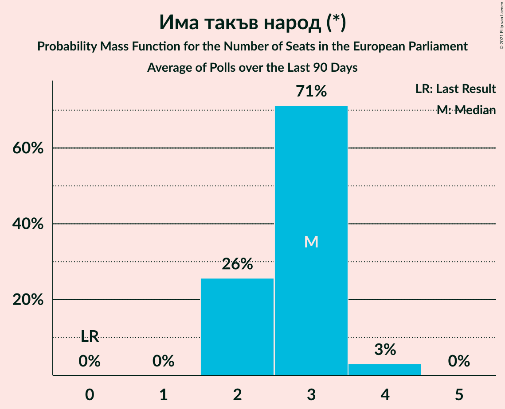

# Има такъв народ (*)

<a href="#voting-intentions">Voting Intentions</a> | <a href="#seats">Seats</a>

## Voting Intentions

Last result: **0.0%** (General Election of 26 May 2019)

### Confidence Intervals

| Period     | Polling firm/Commissioner(s) | Median | 80% Confidence Interval | 90% Confidence Interval | 95% Confidence Interval | 99% Confidence Interval |
|:----------:|:----------------:|:-----------:|:-----------------------:|:-----------------------:|:-----------------------:|:-----------------------:|
| N/A | [Poll Average](average.html) | 13.5% | 11.3–15.9% | 10.7–16.6% | 10.2–17.2% | 9.2–18.4% |
| [11–16 March 2021](2021-03-16-SovaHarris.html) | Sova Harris   Trud | 11.9% | 10.1–14.1% | 9.6–14.7% | 9.1–15.3% | 8.3–16.4% |
| [9–14 March 2021](2021-03-14-Тренд.html) | Тренд   24 часа | 12.6% | 10.8–14.8% | 10.3–15.4% | 9.9–16.0% | 9.1–17.1% |
| [26 February–1 March 2021](2021-03-01-Алфарисърч.html) | Алфа рисърч   bTV | 13.3% | 11.6–15.4% | 11.1–16.0% | 10.7–16.5% | 9.9–17.5% |
| [22 February–1 March 2021](2021-03-01-GallupInternational.html) | Gallup International   BNR/BNT | 13.3% | 11.6–15.3% | 11.1–15.9% | 10.7–16.4% | 9.9–17.5% |
| [22–26 February 2021](2021-02-26-Медиана.html) | Медиана | 15.1% | 13.4–17.2% | 12.8–17.8% | 12.4–18.3% | 11.6–19.3% |
| [15–22 February 2021](2021-02-22-Exacta.html) | Exacta | 13.4% | 11.8–15.4% | 11.3–15.9% | 10.9–16.4% | 10.2–17.4% |
| [12–19 February 2021](2021-02-19-Тренд.html) | Тренд   24 часа/BNT | 12.9% | 11.1–15.0% | 10.6–15.7% | 10.2–16.2% | 9.3–17.3% |
| [12–17 February 2021](2021-02-17-AFIS.html) | AFIS | 14.1% | 12.2–16.5% | 11.6–17.1% | 11.2–17.7% | 10.3–18.9% |
| [4–12 February 2021](2021-02-12-GallupInternational.html) | Gallup International | 13.1% | 11.2–15.4% | 10.7–16.0% | 10.3–16.6% | 9.4–17.8% |
| [23–31 January 2021](2021-01-31-МаркетЛИНКС.html) | Маркет ЛИНКС | 15.5% | 14.1–17.1% | 13.7–17.5% | 13.4–17.9% | 12.7–18.7% |
| [26 January 2020–31 January 2021](2021-01-31-SovaHarris.html) | Sova Harris | 15.5% | 14.1–17.0% | 13.7–17.5% | 13.4–17.8% | 12.7–18.6% |
| [12–19 January 2021](2021-01-19-Тренд.html) | Тренд   24 часа | 11.8% | 10.6–13.2% | 10.2–13.6% | 10.0–13.9% | 9.4–14.6% |
| [7–15 January 2021](2021-01-15-GallupInternational.html) | Gallup International | 13.8% | 12.4–15.4% | 12.0–15.8% | 11.7–16.2% | 11.1–17.0% |
| [15–21 December 2020](2020-12-21-Алфарисърч.html) | Алфа рисърч | 12.1% | 10.3–14.3% | 9.7–15.0% | 9.3–15.5% | 8.5–16.7% |
| [12–17 December 2020](2020-12-17-Медиана.html) | Медиана | 17.0% | 15.3–18.9% | 14.8–19.4% | 14.4–19.9% | 13.6–20.8% |
| [12–17 December 2020](2020-12-17-Mediana.html) | Mediana | 17.0% | 15.3–18.9% | 14.8–19.4% | 14.4–19.9% | 13.6–20.8% |
| [5–12 December 2020](2020-12-12-Exacta.html) | Exacta | 14.1% | 12.5–15.9% | 12.0–16.5% | 11.6–16.9% | 10.9–17.9% |
| [24–29 November 2020](2020-11-29-БарометърБългария.html) | Барометър България | 6.1% | 5.2–7.3% | 4.9–7.7% | 4.7–8.0% | 4.3–8.6% |
| [6–11 November 2020](2020-11-11-БарометърБългария.html) | Барометър България | 6.1% | 5.2–7.3% | 4.9–7.6% | 4.7–7.9% | 4.3–8.5% |
| [27 October–3 November 2020](2020-11-03-SovaHarris.html) | Sova Harris | 11.4% | 10.2–12.8% | 9.9–13.2% | 9.6–13.5% | 9.0–14.2% |
| [21–27 October 2020](2020-10-27-Рего.html) | Рего | 18.6% | 17.5–19.8% | 17.2–20.1% | 16.9–20.4% | 16.4–20.9% |
| [10–16 October 2020](2020-10-16-БарометърБългария.html) | Барометър България | 6.1% | 5.2–7.3% | 4.9–7.6% | 4.7–7.9% | 4.3–8.5% |
| [3–10 October 2020](2020-10-10-Тренд.html) | Тренд | 15.9% | 14.5–17.4% | 14.1–17.9% | 13.7–18.3% | 13.1–19.0% |
| [1–9 October 2020](2020-10-09-GallupInternational.html) | Gallup International | 12.6% | 11.2–14.2% | 10.8–14.7% | 10.5–15.1% | 9.8–15.9% |
| [21–30 September 2020](2020-09-30-Алфарисърч.html) | Алфа рисърч | 16.6% | 15.2–18.2% | 14.8–18.6% | 14.4–19.0% | 13.8–19.8% |
| [18–26 September 2020](2020-09-26-МаркетЛИНКС.html) | Маркет ЛИНКС | 13.4% | 11.7–15.5% | 11.2–16.0% | 10.8–16.6% | 10.0–17.6% |
| [3–11 September 2020](2020-09-11-GallupInternational.html) | Gallup International | 16.3% | 14.4–18.6% | 13.8–19.2% | 13.4–19.8% | 12.5–20.9% |
| [29 August–5 September 2020](2020-09-05-Тренд.html) | Тренд   24 часа | 15.9% | 14.5–17.4% | 14.1–17.9% | 13.7–18.3% | 13.1–19.0% |
| [19–25 August 2020](2020-08-25-SovaHarris.html) | Sova Harris | 15.7% | 14.0–17.7% | 13.5–18.3% | 13.1–18.8% | 12.3–19.7% |
| [3–11 August 2020](2020-08-11-БарометърБългария.html) | Барометър България | 5.3% | 4.5–6.5% | 4.2–6.8% | 4.0–7.1% | 3.6–7.7% |
| [3–10 August 2020](2020-08-10-Тренд.html) | Тренд   24 часа | 15.4% | 14.1–17.0% | 13.7–17.4% | 13.3–17.8% | 12.7–18.6% |
| [30 July–7 August 2020](2020-08-07-GallupInternational.html) | Gallup International | 12.3% | 10.7–14.3% | 10.2–14.9% | 9.8–15.4% | 9.1–16.4% |
| [1–5 August 2020](2020-08-05-ПИК.html) | ПИК | 13.9% | 12.6–15.4% | 12.2–15.8% | 11.9–16.2% | 11.3–16.9% |
| [28 July–3 August 2020](2020-08-03-МаркетЛИНКС.html) | Маркет ЛИНКС | 23.0% | 21.0–25.1% | 20.5–25.7% | 20.0–26.2% | 19.1–27.2% |
| [23–30 July 2020](2020-07-30-Алфарисърч.html) | Алфа рисърч   Дневник | 18.8% | 16.8–21.1% | 16.3–21.8% | 15.8–22.3% | 14.9–23.4% |
| [26 June–1 July 2020](2020-07-01-SovaHarris.html) | Sova Harris | 9.1% | 7.7–10.9% | 7.3–11.3% | 7.0–11.8% | 6.4–12.7% |
| [20–25 June 2020](2020-06-25-БарометърБългария.html) | Барометър България | 3.7% | 3.0–4.7% | 2.8–5.0% | 2.7–5.3% | 2.3–5.8% |
| [27 May–3 June 2020](2020-06-03-МаркетЛИНКС.html) | Маркет ЛИНКС | 9.8% | 8.6–11.3% | 8.2–11.7% | 7.9–12.0% | 7.4–12.8% |
| [28 April–5 May 2020](2020-05-05-Алфарисърч.html) | Алфа рисърч   Дневник | 14.6% | 12.9–16.6% | 12.5–17.1% | 12.1–17.6% | 11.3–18.6% |
| [21–28 February 2020](2020-02-28-Медиана.html) | Медиана | 12.9% | 11.6–14.3% | 11.3–14.8% | 11.0–15.1% | 10.4–15.8% |
| [21–28 February 2020](2020-02-28-Mediana.html) | Mediana | 12.9% | 11.6–14.3% | 11.3–14.8% | 11.0–15.1% | 10.4–15.8% |
| [3–10 February 2020](2020-02-10-Тренд.html) | Тренд   24 часа | 11.4% | 9.9–13.1% | 9.5–13.6% | 9.1–14.1% | 8.5–14.9% |
| [9–13 January 2020](2020-01-13-БарометърБългария.html) | Барометър България | 3.6% | 2.9–4.5% | 2.7–4.8% | 2.5–5.0% | 2.2–5.5% |
| [5–12 December 2019](2019-12-12-Алфарисърч.html) | Алфа рисърч   Дневник | 11.8% | 10.4–13.4% | 10.0–13.9% | 9.6–14.3% | 9.0–15.1% |
| [21–28 November 2019](2019-11-28-МаркетЛИНКС.html) | Маркет ЛИНКС | 13.0% | 11.4–14.9% | 10.9–15.4% | 10.5–15.9% | 9.8–16.8% |
| [7–15 November 2019](2019-11-15-Тренд.html) | Тренд   24 часа | 7.9% | 6.7–9.4% | 6.3–9.8% | 6.0–10.2% | 5.5–11.0% |
| [10–16 September 2019](2019-09-16-Алфарисърч.html) | Алфа рисърч   Дневник | 11.4% | 10.1–13.1% | 9.7–13.5% | 9.3–13.9% | 8.7–14.8% |
| [5–12 July 2019](2019-07-12-Тренд.html) | Тренд   24 часа | 0.0% | N/A | N/A | N/A | N/A |
| [11–19 June 2019](2019-06-19-МаркетЛИНКС.html) | Маркет ЛИНКС | 0.0% | N/A | N/A | N/A | N/A |
| [5–12 June 2019](2019-06-12-Тренд.html) | Тренд | 0.0% | N/A | N/A | N/A | N/A |

### Probability Mass Function

The following table shows the probability mass function per percentage block of voting intentions for the [poll average](average.html) for Има такъв народ (*).

| Voting Intentions | Probability | Accumulated | Special Marks |
|:-----------------:|:-----------:|:-----------:|:-------------:|
| 0.0–0.5% | 0% | 100% | Last Result |
| 0.5–1.5% | 0% | 100% |  |
| 1.5–2.5% | 0% | 100% |  |
| 2.5–3.5% | 0% | 100% |  |
| 3.5–4.5% | 0% | 100% |  |
| 4.5–5.5% | 0% | 100% |  |
| 5.5–6.5% | 0% | 100% |  |
| 6.5–7.5% | 0% | 100% |  |
| 7.5–8.5% | 0.1% | 100% |  |
| 8.5–9.5% | 0.8% | 99.9% |  |
| 9.5–10.5% | 3% | 99.0% |  |
| 10.5–11.5% | 9% | 96% |  |
| 11.5–12.5% | 16% | 87% |  |
| 12.5–13.5% | 22% | 71% | Median |
| 13.5–14.5% | 21% | 49% |  |
| 14.5–15.5% | 15% | 28% |  |
| 15.5–16.5% | 8% | 13% |  |
| 16.5–17.5% | 4% | 5% |  |
| 17.5–18.5% | 1.2% | 2% |  |
| 18.5–19.5% | 0.3% | 0.4% |  |
| 19.5–20.5% | 0.1% | 0.1% |  |
| 20.5–21.5% | 0% | 0% |  |

## Seats

Last result: **0** seats (General Election of 26 May 2019)

### Confidence Intervals

| Period     | Polling firm/Commissioner(s) | Median | 80% Confidence Interval | 90% Confidence Interval | 95% Confidence Interval | 99% Confidence Interval |
|:----------:|:----------------:|:------:|:-----------------------:|:-----------------------:|:-----------------------:|:-----------------------:|
| N/A | [Poll Average](average.html) | 3 | 2–3 | 2–3 | 2–4 | 2–4 |
| [11–16 March 2021](2021-03-16-SovaHarris.html) | Sova Harris   Trud | 3 | 2–3 | 2–3 | 2–3 | 2–3 |
| [9–14 March 2021](2021-03-14-Тренд.html) | Тренд   24 часа | 3 | 2–3 | 2–3 | 2–3 | 2–3 |
| [26 February–1 March 2021](2021-03-01-Алфарисърч.html) | Алфа рисърч   bTV | 3 | 2–3 | 2–3 | 2–3 | 2–3 |
| [22 February–1 March 2021](2021-03-01-GallupInternational.html) | Gallup International   BNR/BNT | 3 | 2–3 | 2–3 | 2–3 | 2–4 |
| [22–26 February 2021](2021-02-26-Медиана.html) | Медиана | 3 | 3–4 | 2–4 | 2–4 | 2–4 |
| [15–22 February 2021](2021-02-22-Exacta.html) | Exacta | 2 | 2–3 | 2–3 | 2–3 | 2–3 |
| [12–19 February 2021](2021-02-19-Тренд.html) | Тренд   24 часа/BNT | 3 | 2–3 | 2–3 | 2–3 | 2–3 |
| [12–17 February 2021](2021-02-17-AFIS.html) | AFIS | 3 | 2–3 | 2–4 | 2–4 | 2–4 |
| [4–12 February 2021](2021-02-12-GallupInternational.html) | Gallup International | 2 | 2–3 | 2–3 | 2–3 | 2–3 |
| [23–31 January 2021](2021-01-31-МаркетЛИНКС.html) | Маркет ЛИНКС | 3 | 3 | 3 | 2–3 | 2–4 |
| [26 January 2020–31 January 2021](2021-01-31-SovaHarris.html) | Sova Harris | 3 | 3–4 | 3–4 | 3–4 | 3–4 |
| [12–19 January 2021](2021-01-19-Тренд.html) | Тренд   24 часа | 2 | 2–3 | 2–3 | 2–3 | 2–3 |
| [7–15 January 2021](2021-01-15-GallupInternational.html) | Gallup International | 3 | 2–3 | 2–3 | 2–3 | 2–3 |
| [15–21 December 2020](2020-12-21-Алфарисърч.html) | Алфа рисърч | 2 | 2–3 | 2–3 | 2–3 | 1–3 |
| [12–17 December 2020](2020-12-17-Медиана.html) | Медиана | 3 | 3–4 | 3–4 | 3–4 | 3–4 |
| [12–17 December 2020](2020-12-17-Mediana.html) | Mediana | 3 | 3–4 | 3–4 | 3–4 | 3–4 |
| [5–12 December 2020](2020-12-12-Exacta.html) | Exacta | 3 | 2–3 | 2–3 | 2–3 | 2–3 |
| [24–29 November 2020](2020-11-29-БарометърБългария.html) | Барометър България | 1 | 1 | 0–1 | 0–2 | 0–2 |
| [6–11 November 2020](2020-11-11-БарометърБългария.html) | Барометър България | 1 | 1 | 0–1 | 0–2 | 0–2 |
| [27 October–3 November 2020](2020-11-03-SovaHarris.html) | Sova Harris | 2 | 2 | 2 | 2–3 | 2–3 |
| [21–27 October 2020](2020-10-27-Рего.html) | Рего | 4 | 3–4 | 3–4 | 3–4 | 3–4 |
| [10–16 October 2020](2020-10-16-БарометърБългария.html) | Барометър България | 1 | 1 | 0–1 | 0–2 | 0–2 |
| [3–10 October 2020](2020-10-10-Тренд.html) | Тренд | 3 | 3 | 3 | 2–3 | 2–4 |
| [1–9 October 2020](2020-10-09-GallupInternational.html) | Gallup International | 2 | 2–3 | 2–3 | 2–3 | 2–3 |
| [21–30 September 2020](2020-09-30-Алфарисърч.html) | Алфа рисърч | 3 | 3 | 3 | 3–4 | 2–4 |
| [18–26 September 2020](2020-09-26-МаркетЛИНКС.html) | Маркет ЛИНКС | 2 | 2–3 | 2–3 | 2–3 | 2–3 |
| [3–11 September 2020](2020-09-11-GallupInternational.html) | Gallup International | 3 | 3 | 3–4 | 2–4 | 2–4 |
| [29 August–5 September 2020](2020-09-05-Тренд.html) | Тренд   24 часа | 3 | 3 | 3–4 | 3–4 | 2–4 |
| [19–25 August 2020](2020-08-25-SovaHarris.html) | Sova Harris | 3 | 3 | 3 | 3–4 | 2–4 |
| [3–11 August 2020](2020-08-11-БарометърБългария.html) | Барометър България | 1 | 0–1 | 0–1 | 0–1 | 0–2 |
| [3–10 August 2020](2020-08-10-Тренд.html) | Тренд   24 часа | 3 | 3–4 | 3–4 | 2–4 | 2–4 |
| [30 July–7 August 2020](2020-08-07-GallupInternational.html) | Gallup International | 2 | 2–3 | 2–3 | 2–3 | 2–3 |
| [1–5 August 2020](2020-08-05-ПИК.html) | ПИК | 3 | 2–3 | 2–3 | 2–3 | 2–3 |
| [28 July–3 August 2020](2020-08-03-МаркетЛИНКС.html) | Маркет ЛИНКС | 4 | 4–5 | 4–5 | 4–5 | 3–5 |
| [23–30 July 2020](2020-07-30-Алфарисърч.html) | Алфа рисърч   Дневник | 4 | 3–4 | 3–4 | 3–4 | 3–4 |
| [26 June–1 July 2020](2020-07-01-SovaHarris.html) | Sova Harris | 2 | 2 | 1–2 | 1–2 | 1–2 |
| [20–25 June 2020](2020-06-25-БарометърБългария.html) | Барометър България | 0 | 0 | 0 | 0–1 | 0–1 |
| [27 May–3 June 2020](2020-06-03-МаркетЛИНКС.html) | Маркет ЛИНКС | 2 | 1–2 | 1–2 | 1–2 | 1–2 |
| [28 April–5 May 2020](2020-05-05-Алфарисърч.html) | Алфа рисърч   Дневник | 3 | 2–3 | 2–3 | 2–3 | 2–3 |
| [21–28 February 2020](2020-02-28-Медиана.html) | Медиана | 2 | 2–3 | 2–3 | 2–3 | 2–3 |
| [21–28 February 2020](2020-02-28-Mediana.html) | Mediana | 2 | 2–3 | 2–3 | 2–3 | 2–3 |
| [3–10 February 2020](2020-02-10-Тренд.html) | Тренд   24 часа | 2 | 2–3 | 2–3 | 2–3 | 2–3 |
| [9–13 January 2020](2020-01-13-БарометърБългария.html) | Барометър България | 0 | 0 | 0 | 0 | 0–1 |
| [5–12 December 2019](2019-12-12-Алфарисърч.html) | Алфа рисърч   Дневник | 2 | 2–3 | 2–3 | 2–3 | 2–3 |
| [21–28 November 2019](2019-11-28-МаркетЛИНКС.html) | Маркет ЛИНКС | 2 | 2–3 | 2–3 | 2–3 | 2–3 |
| [7–15 November 2019](2019-11-15-Тренд.html) | Тренд   24 часа | 2 | 1–2 | 1–2 | 1–2 | 1–2 |
| [10–16 September 2019](2019-09-16-Алфарисърч.html) | Алфа рисърч   Дневник | 2 | 2–3 | 2–3 | 2–3 | 2–3 |
| [5–12 July 2019](2019-07-12-Тренд.html) | Тренд   24 часа |  |  |  |  |  |
| [11–19 June 2019](2019-06-19-МаркетЛИНКС.html) | Маркет ЛИНКС |  |  |  |  |  |
| [5–12 June 2019](2019-06-12-Тренд.html) | Тренд |  |  |  |  |  |

### Probability Mass Function

The following table shows the probability mass function per seat for the [poll average](average.html) for Има такъв народ (*).

| Number of Seats | Probability | Accumulated | Special Marks |
|:---------------:|:-----------:|:-----------:|:-------------:|
| 0 | 0% | 100% | Last Result |
| 1 | 0% | 100% |  |
| 2 | 24% | 100% |  |
| 3 | 73% | 76% | Median |
| 4 | 3% | 3% |  |
| 5 | 0% | 0% |  |

