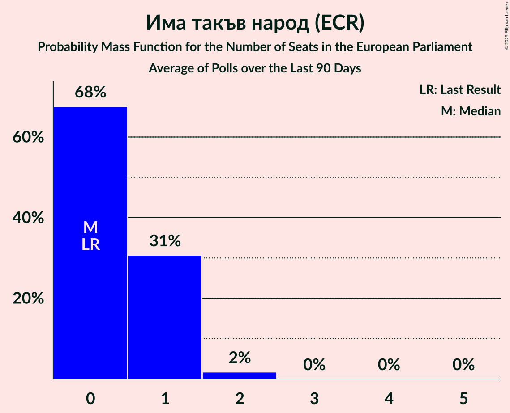

# Има такъв народ (ECR)

<a href="#voting-intentions">Voting Intentions</a> | <a href="#seats">Seats</a>

## Voting Intentions

Last result: **0.0%** (General Election of 9 June 2024)

### Confidence Intervals

| Period     | Polling firm/Commissioner(s) | Median | 80% Confidence Interval | 90% Confidence Interval | 95% Confidence Interval | 99% Confidence Interval |
|:----------:|:----------------:|:-----------:|:-----------------------:|:-----------------------:|:-----------------------:|:-----------------------:|
| N/A | [Poll Average](average.html) | 6.4% | 4.0–8.2% | 3.6–8.6% | 3.3–9.0% | 2.9–9.7% |
| [8–13 October 2024](2024-10-13-Медиана.html) | Медиана | 7.9% | 6.9–9.1% | 6.6–9.4% | 6.3–9.7% | 5.9–10.3% |
| [28 September–6 October 2024](2024-10-06-GallupInternational.html) | Gallup International | 6.3% | 5.3–7.6% | 5.1–7.9% | 4.8–8.2% | 4.4–8.9% |
| [25 September–1 October 2024](2024-10-01-МаркетЛИНКС.html) | Маркет ЛИНКС   bTV | 4.0% | 3.3–4.9% | 3.1–5.1% | 2.9–5.3% | 2.6–5.8% |
| [17–24 September 2024](2024-09-24-Тренд.html) | Тренд   24 часа | 6.9% | 5.9–8.0% | 5.7–8.3% | 5.5–8.6% | 5.1–9.2% |
| [18–24 September 2024](2024-09-24-Алфарисърч.html) | Алфа рисърч | 5.9% | 5.0–7.0% | 4.8–7.3% | 4.6–7.5% | 4.2–8.1% |
| [14–23 August 2024](2024-08-23-МаркетЛИНКС.html) | Маркет ЛИНКС   bTV | 3.8% | 3.1–4.6% | 2.9–4.9% | 2.8–5.1% | 2.5–5.5% |
| [1–9 August 2024](2024-08-09-GallupInternational.html) | Gallup International   БНТ | 6.2% | 5.3–7.5% | 5.0–7.8% | 4.8–8.1% | 4.3–8.8% |
| [20–28 July 2024](2024-07-28-МаркетЛИНКС.html) | Маркет ЛИНКС | 5.2% | N/A | N/A | N/A | N/A |

### Probability Mass Function

The following table shows the probability mass function per percentage block of voting intentions for the [poll average](average.html) for Има такъв народ (ECR).

| Voting Intentions | Probability | Accumulated | Special Marks |
|:-----------------:|:-----------:|:-----------:|:-------------:|
| 0.0–0.5% | 0% | 100% | Last Result |
| 0.5–1.5% | 0% | 100% |  |
| 1.5–2.5% | 0.1% | 100% |  |
| 2.5–3.5% | 4% | 99.9% |  |
| 3.5–4.5% | 12% | 96% |  |
| 4.5–5.5% | 13% | 83% |  |
| 5.5–6.5% | 25% | 71% | Median |
| 6.5–7.5% | 25% | 46% |  |
| 7.5–8.5% | 15% | 21% |  |
| 8.5–9.5% | 5% | 6% |  |
| 9.5–10.5% | 0.7% | 0.8% |  |
| 10.5–11.5% | 0.1% | 0.1% |  |
| 11.5–12.5% | 0% | 0% |  |

## Seats

Last result: **0** seats (General Election of 9 June 2024)

### Confidence Intervals

| Period     | Polling firm/Commissioner(s) | Median | 80% Confidence Interval | 90% Confidence Interval | 95% Confidence Interval | 99% Confidence Interval |
|:----------:|:----------------:|:------:|:-----------------------:|:-----------------------:|:-----------------------:|:-----------------------:|
| N/A | [Poll Average](average.html) | 1 | 0–2 | 0–2 | 0–2 | 0–2 |
| [8–13 October 2024](2024-10-13-Медиана.html) | Медиана | 2 | 1–2 | 1–2 | 1–2 | 0–2 |
| [28 September–6 October 2024](2024-10-06-GallupInternational.html) | Gallup International | 1 | 0–1 | 0–2 | 0–2 | 0–2 |
| [25 September–1 October 2024](2024-10-01-МаркетЛИНКС.html) | Маркет ЛИНКС   bTV | 0 | 0 | 0 | 0 | 0 |
| [17–24 September 2024](2024-09-24-Тренд.html) | Тренд   24 часа | 1 | 0–2 | 0–2 | 0–2 | 0–2 |
| [18–24 September 2024](2024-09-24-Алфарисърч.html) | Алфа рисърч | 1 | 0–1 | 0–1 | 0–1 | 0–2 |
| [14–23 August 2024](2024-08-23-МаркетЛИНКС.html) | Маркет ЛИНКС   bTV | 0 | 0 | 0 | 0 | 0 |
| [1–9 August 2024](2024-08-09-GallupInternational.html) | Gallup International   БНТ | 1 | 0–1 | 0–1 | 0–1 | 0–2 |
| [20–28 July 2024](2024-07-28-МаркетЛИНКС.html) | Маркет ЛИНКС |  |  |  |  |  |

### Probability Mass Function

The following table shows the probability mass function per seat for the [poll average](average.html) for Има такъв народ (ECR).

| Number of Seats | Probability | Accumulated | Special Marks |
|:---------------:|:-----------:|:-----------:|:-------------:|
| 0 | 39% | 100% | Last Result |
| 1 | 42% | 61% | Median |
| 2 | 19% | 19% |  |
| 3 | 0% | 0% |  |

