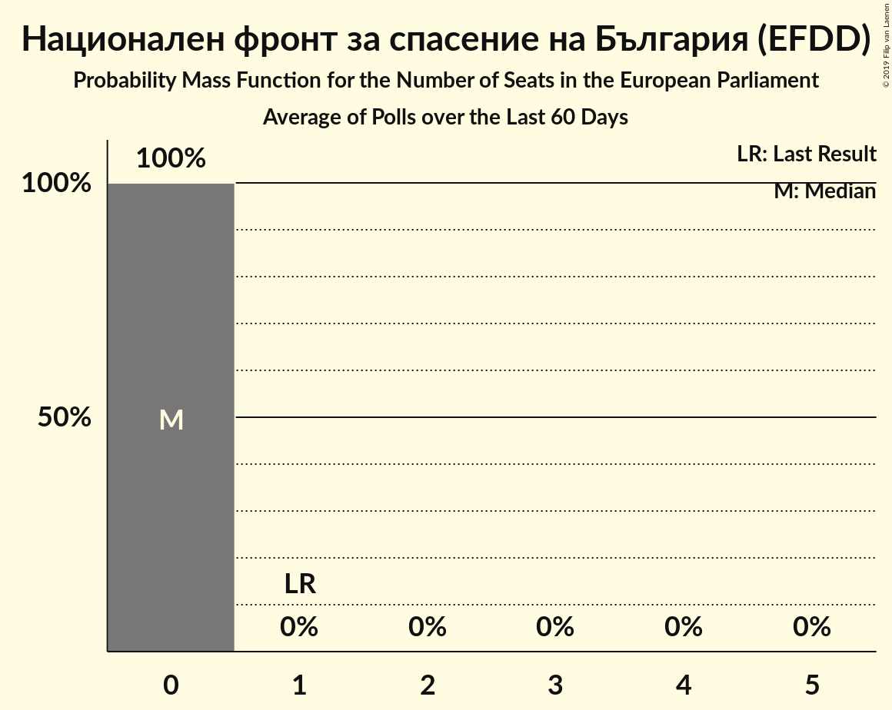

# Национален фронт за спасение на България (EFDD)

<a href="#voting-intentions">Voting Intentions</a> | <a href="#seats">Seats</a>

## Voting Intentions

Last result: **10.7%** (General Election of 25 May 2014)

### Confidence Intervals

| Period     | Polling firm/Commissioner(s) | Median | 80% Confidence Interval | 90% Confidence Interval | 95% Confidence Interval | 99% Confidence Interval |
|:----------:|:----------------:|:-----------:|:-----------------------:|:-----------------------:|:-----------------------:|:-----------------------:|
| N/A | [Poll Average](average.html) | 1.6% | 1.0–2.3% | 0.9–2.6% | 0.8–2.8% | 0.7–3.1% |
| [2–7 May 2019](2019-05-07-Mediana.html) | Mediana | 4.0% | 3.3–4.9% | 3.1–5.1% | 2.9–5.4% | 2.6–5.8% |
| [20–30 April 2019](2019-04-30-Алфарисърч.html) | Алфа рисърч | 2.0% | 1.5–2.7% | 1.4–2.9% | 1.3–3.0% | 1.1–3.4% |
| [12–22 April 2019](2019-04-22-МаркетЛИНКС.html) | Маркет ЛИНКС | 0.0% | N/A | N/A | N/A | N/A |
| [5–12 April 2019](2019-04-12-Тренд.html) | Тренд | 1.3% | 0.9–1.9% | 0.8–2.0% | 0.7–2.2% | 0.6–2.5% |
| [5–11 April 2019](2019-04-11-Gallup.html) | Gallup | 1.4% | 1.0–2.0% | 0.9–2.1% | 0.8–2.3% | 0.7–2.6% |
| [22–26 March 2019](2019-03-26-Алфарисърч.html) | Алфа рисърч | 2.2% | 1.7–2.9% | 1.6–3.1% | 1.4–3.3% | 1.2–3.7% |
| [6–13 March 2019](2019-03-13-Тренд.html) | Тренд | 1.8% | 1.4–2.5% | 1.2–2.7% | 1.1–2.8% | 1.0–3.2% |
| [6–11 March 2019](2019-03-11-SovaHarris.html) | Sova Harris | 1.3% | 0.9–1.9% | 0.8–2.1% | 0.8–2.2% | 0.6–2.5% |
| [19–28 February 2019](2019-02-28-Exacta.html) | Exacta | 0.0% | N/A | N/A | N/A | N/A |
| [22–28 February 2019](2019-02-28-AFIS.html) | AFIS | 0.0% | N/A | N/A | N/A | N/A |
| [15–25 February 2019](2019-02-25-МаркетЛИНКС.html) | Маркет ЛИНКС | 0.0% | N/A | N/A | N/A | N/A |
| [5–13 February 2019](2019-02-13-Тренд.html) | Тренд | 0.0% | N/A | N/A | N/A | N/A |
| [12–21 January 2019](2019-01-21-МаркетЛИНКС.html) | Маркет ЛИНКС | 0.0% | N/A | N/A | N/A | N/A |
| [19–21 January 2019](2019-01-21-SovaHarris.html) | Sova Harris | 0.0% | N/A | N/A | N/A | N/A |
| [14–19 January 2019](2019-01-19-AFIS.html) | AFIS | 0.0% | N/A | N/A | N/A | N/A |
| [14–18 December 2018](2018-12-18-Алфарисърч.html) | Алфа рисърч | 0.0% | N/A | N/A | N/A | N/A |
| [10–17 December 2018](2018-12-17-Exacta.html) | Exacta | 0.0% | N/A | N/A | N/A | N/A |
| [16–25 November 2018](2018-11-25-МаркетЛИНКС.html) | Маркет ЛИНКС | 0.0% | N/A | N/A | N/A | N/A |
| [6–12 November 2018](2018-11-12-Тренд.html) | Тренд   24 часа | 0.0% | N/A | N/A | N/A | N/A |
| [25 September–5 October 2018](2018-10-05-Exacta.html) | Exacta | 0.0% | N/A | N/A | N/A | N/A |
| [23–30 September 2018](2018-09-30-Алфарисърч.html) | Алфа рисърч | 0.0% | N/A | N/A | N/A | N/A |
| [8–14 September 2018](2018-09-14-SovaHarris.html) | Sova Harris   БГНЕС | 0.0% | N/A | N/A | N/A | N/A |
| [4–11 September 2018](2018-09-11-Тренд.html) | Тренд   24 часа | 0.0% | N/A | N/A | N/A | N/A |
| [1–6 July 2018](2018-07-06-Медиана.html) | Медиана | 0.0% | N/A | N/A | N/A | N/A |
| [17 May–25 June 2018](2018-06-25-Алфарисърч.html) | Алфа рисърч | 0.0% | N/A | N/A | N/A | N/A |
| [1–9 June 2018](2018-06-09-Тренд.html) | Тренд   24 часа | 0.0% | N/A | N/A | N/A | N/A |
| [2–10 May 2018](2018-05-10-Тренд.html) | Тренд   24 часа | 0.0% | N/A | N/A | N/A | N/A |
| [1–7 March 2018](2018-03-07-Тренд.html) | Тренд   24 часа | 0.0% | N/A | N/A | N/A | N/A |
| [10–18 January 2018](2018-01-18-Тренд.html) | Тренд   24 часа | 0.0% | N/A | N/A | N/A | N/A |
| [7–13 December 2017](2017-12-13-Exacta.html) | Exacta | 0.0% | N/A | N/A | N/A | N/A |
| [10 January 2019–17 January 2010](2010-01-17-Тренд.html) | Тренд   24 часа | 0.0% | N/A | N/A | N/A | N/A |

### Probability Mass Function

The following table shows the probability mass function per percentage block of voting intentions for the [poll average](average.html) for Национален фронт за спасение на България (EFDD).

| Voting Intentions | Probability | Accumulated | Special Marks |
|:-----------------:|:-----------:|:-----------:|:-------------:|
| 0.0–0.5% | 0.1% | 100% |  |
| 0.5–1.5% | 48% | 99.9% |  |
| 1.5–2.5% | 47% | 52% | Median |
| 2.5–3.5% | 5% | 5% |  |
| 3.5–4.5% | 0.1% | 0.1% |  |
| 4.5–5.5% | 0% | 0% |  |
| 5.5–6.5% | 0% | 0% |  |
| 6.5–7.5% | 0% | 0% |  |
| 7.5–8.5% | 0% | 0% |  |
| 8.5–9.5% | 0% | 0% |  |
| 9.5–10.5% | 0% | 0% |  |
| 10.5–11.5% | 0% | 0% | Last Result |

## Seats

Last result: **1** seats (General Election of 25 May 2014)

### Confidence Intervals

| Period     | Polling firm/Commissioner(s) | Median | 80% Confidence Interval | 90% Confidence Interval | 95% Confidence Interval | 99% Confidence Interval |
|:----------:|:----------------:|:------:|:-----------------------:|:-----------------------:|:-----------------------:|:-----------------------:|
| N/A | [Poll Average](average.html) | 0 | 0 | 0 | 0 | 0 |
| [2–7 May 2019](2019-05-07-Mediana.html) | Mediana | 0 | 0 | 0 | 0–1 | 0–1 |
| [20–30 April 2019](2019-04-30-Алфарисърч.html) | Алфа рисърч | 0 | 0 | 0 | 0 | 0 |
| [12–22 April 2019](2019-04-22-МаркетЛИНКС.html) | Маркет ЛИНКС |  |  |  |  |  |
| [5–12 April 2019](2019-04-12-Тренд.html) | Тренд | 0 | 0 | 0 | 0 | 0 |
| [5–11 April 2019](2019-04-11-Gallup.html) | Gallup | 0 | 0 | 0 | 0 | 0 |
| [22–26 March 2019](2019-03-26-Алфарисърч.html) | Алфа рисърч | 0 | 0 | 0 | 0 | 0 |
| [6–13 March 2019](2019-03-13-Тренд.html) | Тренд | 0 | 0 | 0 | 0 | 0 |
| [6–11 March 2019](2019-03-11-SovaHarris.html) | Sova Harris | 0 | 0 | 0 | 0 | 0 |
| [19–28 February 2019](2019-02-28-Exacta.html) | Exacta |  |  |  |  |  |
| [22–28 February 2019](2019-02-28-AFIS.html) | AFIS |  |  |  |  |  |
| [15–25 February 2019](2019-02-25-МаркетЛИНКС.html) | Маркет ЛИНКС |  |  |  |  |  |
| [5–13 February 2019](2019-02-13-Тренд.html) | Тренд |  |  |  |  |  |
| [12–21 January 2019](2019-01-21-МаркетЛИНКС.html) | Маркет ЛИНКС |  |  |  |  |  |
| [19–21 January 2019](2019-01-21-SovaHarris.html) | Sova Harris |  |  |  |  |  |
| [14–19 January 2019](2019-01-19-AFIS.html) | AFIS |  |  |  |  |  |
| [14–18 December 2018](2018-12-18-Алфарисърч.html) | Алфа рисърч |  |  |  |  |  |
| [10–17 December 2018](2018-12-17-Exacta.html) | Exacta |  |  |  |  |  |
| [16–25 November 2018](2018-11-25-МаркетЛИНКС.html) | Маркет ЛИНКС |  |  |  |  |  |
| [6–12 November 2018](2018-11-12-Тренд.html) | Тренд   24 часа |  |  |  |  |  |
| [25 September–5 October 2018](2018-10-05-Exacta.html) | Exacta |  |  |  |  |  |
| [23–30 September 2018](2018-09-30-Алфарисърч.html) | Алфа рисърч |  |  |  |  |  |
| [8–14 September 2018](2018-09-14-SovaHarris.html) | Sova Harris   БГНЕС |  |  |  |  |  |
| [4–11 September 2018](2018-09-11-Тренд.html) | Тренд   24 часа |  |  |  |  |  |
| [1–6 July 2018](2018-07-06-Медиана.html) | Медиана |  |  |  |  |  |
| [17 May–25 June 2018](2018-06-25-Алфарисърч.html) | Алфа рисърч |  |  |  |  |  |
| [1–9 June 2018](2018-06-09-Тренд.html) | Тренд   24 часа |  |  |  |  |  |
| [2–10 May 2018](2018-05-10-Тренд.html) | Тренд   24 часа |  |  |  |  |  |
| [1–7 March 2018](2018-03-07-Тренд.html) | Тренд   24 часа |  |  |  |  |  |
| [10–18 January 2018](2018-01-18-Тренд.html) | Тренд   24 часа |  |  |  |  |  |
| [7–13 December 2017](2017-12-13-Exacta.html) | Exacta |  |  |  |  |  |
| [10 January 2019–17 January 2010](2010-01-17-Тренд.html) | Тренд   24 часа |  |  |  |  |  |

### Probability Mass Function

The following table shows the probability mass function per seat for the [poll average](average.html) for Национален фронт за спасение на България (EFDD).

| Number of Seats | Probability | Accumulated | Special Marks |
|:---------------:|:-----------:|:-----------:|:-------------:|
| 0 | 100% | 100% | Median |
| 1 | 0% | 0% | Last Result |

