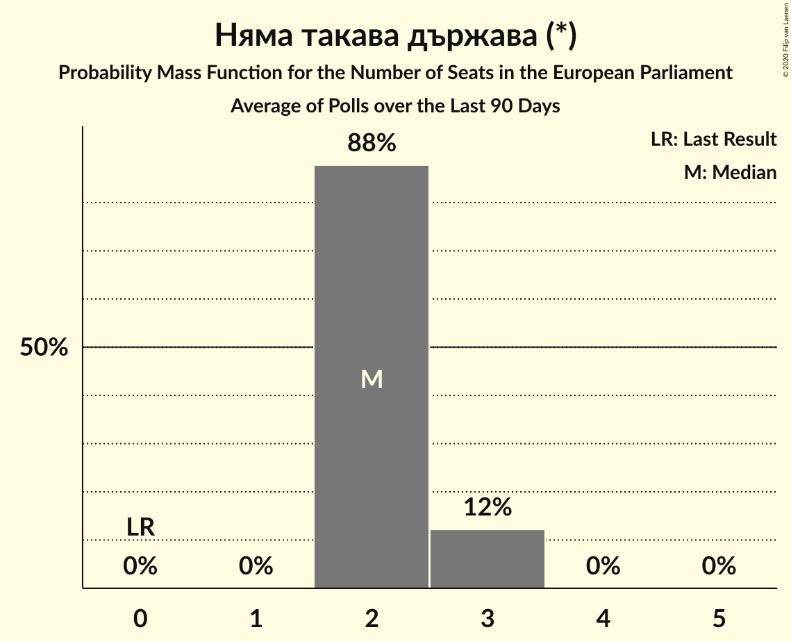

# Няма такава държава (*)

<a href="#voting-intentions">Voting Intentions</a> | <a href="#seats">Seats</a>

## Voting Intentions

Last result: **0.0%** (General Election of 26 May 2019)

### Confidence Intervals

| Period     | Polling firm/Commissioner(s) | Median | 80% Confidence Interval | 90% Confidence Interval | 95% Confidence Interval | 99% Confidence Interval |
|:----------:|:----------------:|:-----------:|:-----------------------:|:-----------------------:|:-----------------------:|:-----------------------:|
| N/A | [Poll Average](average.html) | 11.8% | 7.6–13.8% | 7.2–14.2% | 6.9–14.7% | 6.4–15.5% |
| [5–12 December 2019](2019-12-12-Алфарисърч.html) | Алфа рисърч | 12.0% | 10.8–13.4% | 10.4–13.8% | 10.1–14.1% | 9.6–14.8% |
| [21–28 November 2019](2019-11-28-МаркетЛИНКС.html) | Маркет ЛИНКС | 13.0% | 11.7–14.4% | 11.3–14.8% | 11.0–15.2% | 10.4–15.9% |
| [7–15 November 2019](2019-11-15-Тренд.html) | Тренд | 8.0% | 7.0–9.2% | 6.8–9.6% | 6.5–9.9% | 6.1–10.5% |
| [10–16 September 2019](2019-09-16-Алфарисърч.html) | Алфа рисърч | 11.2% | 10.1–12.6% | 9.7–13.0% | 9.4–13.3% | 8.9–14.0% |
| [5–12 July 2019](2019-07-12-Тренд.html) | Тренд   24 часа | 0.0% | N/A | N/A | N/A | N/A |

### Probability Mass Function

The following table shows the probability mass function per percentage block of voting intentions for the [poll average](average.html) for Няма такава държава (*).

| Voting Intentions | Probability | Accumulated | Special Marks |
|:-----------------:|:-----------:|:-----------:|:-------------:|
| 0.0–0.5% | 0% | 100% | Last Result |
| 0.5–1.5% | 0% | 100% |  |
| 1.5–2.5% | 0% | 100% |  |
| 2.5–3.5% | 0% | 100% |  |
| 3.5–4.5% | 0% | 100% |  |
| 4.5–5.5% | 0% | 100% |  |
| 5.5–6.5% | 0.9% | 100% |  |
| 6.5–7.5% | 8% | 99.1% |  |
| 7.5–8.5% | 15% | 91% |  |
| 8.5–9.5% | 8% | 77% |  |
| 9.5–10.5% | 4% | 68% |  |
| 10.5–11.5% | 11% | 64% |  |
| 11.5–12.5% | 21% | 54% | Median |
| 12.5–13.5% | 20% | 33% |  |
| 13.5–14.5% | 10% | 13% |  |
| 14.5–15.5% | 3% | 3% |  |
| 15.5–16.5% | 0.4% | 0.4% |  |
| 16.5–17.5% | 0% | 0% |  |

## Seats

Last result: **0** seats (General Election of 26 May 2019)

### Confidence Intervals

| Period     | Polling firm/Commissioner(s) | Median | 80% Confidence Interval | 90% Confidence Interval | 95% Confidence Interval | 99% Confidence Interval |
|:----------:|:----------------:|:------:|:-----------------------:|:-----------------------:|:-----------------------:|:-----------------------:|
| N/A | [Poll Average](average.html) | 2 | 1–2 | 1–3 | 1–3 | 1–3 |
| [5–12 December 2019](2019-12-12-Алфарисърч.html) | Алфа рисърч | 2 | 2–3 | 2–3 | 2–3 | 2–3 |
| [21–28 November 2019](2019-11-28-МаркетЛИНКС.html) | Маркет ЛИНКС | 2 | 2–3 | 2–3 | 2–3 | 2–3 |
| [7–15 November 2019](2019-11-15-Тренд.html) | Тренд | 2 | 1–2 | 1–2 | 1–2 | 1–2 |
| [10–16 September 2019](2019-09-16-Алфарисърч.html) | Алфа рисърч | 2 | 2–3 | 2–3 | 2–3 | 2–3 |
| [5–12 July 2019](2019-07-12-Тренд.html) | Тренд   24 часа |  |  |  |  |  |

### Probability Mass Function

The following table shows the probability mass function per seat for the [poll average](average.html) for Няма такава държава (*).

| Number of Seats | Probability | Accumulated | Special Marks |
|:---------------:|:-----------:|:-----------:|:-------------:|
| 0 | 0% | 100% | Last Result |
| 1 | 12% | 100% |  |
| 2 | 79% | 88% | Median |
| 3 | 9% | 9% |  |
| 4 | 0% | 0% |  |

