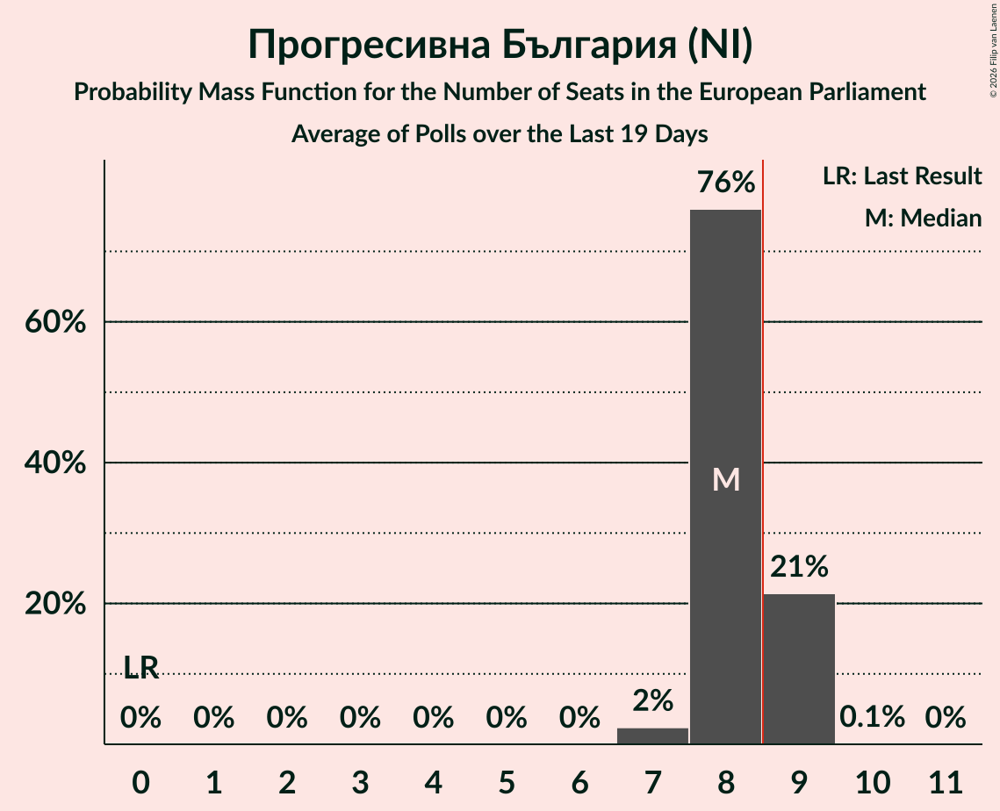

# Прогресивна България (NI)

<a href="#voting-intentions">Voting Intentions</a> | <a href="#seats">Seats</a>

## Voting Intentions

Last result: **0.0%** (General Election of 9 June 2024)

### Confidence Intervals

| Period     | Polling firm/Commissioner(s) | Median | 80% Confidence Interval | 90% Confidence Interval | 95% Confidence Interval | 99% Confidence Interval |
|:----------:|:----------------:|:-----------:|:-----------------------:|:-----------------------:|:-----------------------:|:-----------------------:|
| N/A | [Poll Average](average.html) | 47.2% | 45.0–49.4% | 44.3–50.0% | 43.8–50.6% | 42.8–51.6% |
| [13–21 June 2026](2026-06-21-МаркетЛИНКС.html) | Маркет ЛИНКС   bTV | 47.2% | 45.0–49.4% | 44.3–50.0% | 43.8–50.6% | 42.8–51.7% |
| [16–27 May 2026](2026-05-27-МаркетЛИНКС.html) | Маркет ЛИНКС   bTV | 46.1% | 43.9–48.4% | 43.2–49.0% | 42.7–49.6% | 41.6–50.6% |
| [13–16 April 2026](2026-04-16-Тренд.html) | Тренд   24 часа | 33.2% | 31.3–35.1% | 30.8–35.7% | 30.3–36.2% | 29.4–37.1% |
| [8–16 April 2026](2026-04-16-GallupInternational.html) | Gallup International | 31.5% | 29.4–33.7% | 28.8–34.3% | 28.3–34.8% | 27.4–35.9% |
| [13–15 April 2026](2026-04-15-Алфарисърч.html) | Алфа рисърч | 34.2% | 32.3–36.2% | 31.8–36.7% | 31.3–37.2% | 30.4–38.1% |
| [3–14 April 2026](2026-04-14-Центързаанализиимаркетинг.html) | Център за анализи и маркетинг | 32.1% | 30.3–34.1% | 29.8–34.6% | 29.3–35.1% | 28.5–36.0% |
| [7–14 April 2026](2026-04-14-МаркетЛИНКС.html) | Маркет ЛИНКС   bTV | 36.7% | N/A | N/A | N/A | N/A |
| [4–13 April 2026](2026-04-13-Мяра.html) | Мяра   BNR | 34.6% | 32.7–36.6% | 32.2–37.2% | 31.7–37.6% | 30.8–38.6% |
| [2–6 April 2026](2026-04-06-SovaHarris.html) | Sova Harris   Trud | 33.6% | 31.5–35.8% | 30.9–36.4% | 30.4–37.0% | 29.4–38.0% |
| [20–30 March 2026](2026-03-30-GallupInternational.html) | Gallup International | 28.4% | N/A | N/A | N/A | N/A |
| [19–26 March 2026](2026-03-26-Алфарисърч.html) | Алфа рисърч   BNR | 30.8% | N/A | N/A | N/A | N/A |
| [17–21 March 2026](2026-03-21-МаркетЛИНКС.html) | Маркет ЛИНКС   bTV | 29.1% | N/A | N/A | N/A | N/A |
| [12–20 March 2026](2026-03-20-Алфарисърч.html) | Алфа рисърч   bTV | 29.4% | N/A | N/A | N/A | N/A |
| [13–19 March 2026](2026-03-19-Тренд.html) | Тренд   24 часа | 31.1% | N/A | N/A | N/A | N/A |
| [7–16 March 2026](2026-03-16-Мяра.html) | Мяра | 30.8% | N/A | N/A | N/A | N/A |
| [7–15 March 2026](2026-03-15-МаркетЛИНКС.html) | Маркет ЛИНКС   bTV | 26.6% | N/A | N/A | N/A | N/A |
| [7–12 March 2026](2026-03-12-SovaHarris.html) | Sova Harris   Trud | 30.9% | N/A | N/A | N/A | N/A |
| [23 February–2 March 2026](2026-03-02-Алфарисърч.html) | Алфа рисърч | 32.6% | N/A | N/A | N/A | N/A |
| [10–28 February 2026](2026-02-28-GallupInternational.html) | Gallup International | 30.6% | N/A | N/A | N/A | N/A |
| [17–24 February 2026](2026-02-24-Центързаанализиимаркетинг.html) | Център за анализи и маркетинг | 35.4% | N/A | N/A | N/A | N/A |
| [12–18 February 2026](2026-02-18-Тренд.html) | Тренд   24 часа | 32.7% | N/A | N/A | N/A | N/A |
| [9–15 February 2026](2026-02-15-Мяра.html) | Мяра | 33.3% | N/A | N/A | N/A | N/A |
| [7–13 February 2026](2026-02-13-МаркетЛИНКС.html) | Маркет ЛИНКС   bTV | 32.1% | N/A | N/A | N/A | N/A |
| [18–29 December 2025](2025-12-29-МаркетЛИНКС.html) | Маркет ЛИНКС   bTV | 0.0% | N/A | N/A | N/A | N/A |
| [5–12 December 2025](2025-12-12-Алфарисърч.html) | Алфа рисърч | 0.0% | N/A | N/A | N/A | N/A |
| [3–7 December 2025](2025-12-07-МаркетЛИНКС.html) | Маркет ЛИНКС   bTV | 0.0% | N/A | N/A | N/A | N/A |
| [29 September–12 October 2025](2025-10-12-GallupInternational.html) | Gallup International | 0.0% | N/A | N/A | N/A | N/A |
| [13–20 September 2025](2025-09-20-Тренд.html) | Тренд   24 часа | 0.0% | N/A | N/A | N/A | N/A |
| [4–12 September 2025](2025-09-12-Мяра.html) | Мяра | 0.0% | N/A | N/A | N/A | N/A |
| [11–23 July 2025](2025-07-23-GallupInternational.html) | Gallup International | 0.0% | N/A | N/A | N/A | N/A |
| [7–14 July 2025](2025-07-14-Алфарисърч.html) | Алфа рисърч | 0.0% | N/A | N/A | N/A | N/A |
| [9–11 June 2025](2025-06-11-SovaHarris.html) | Sova Harris | 0.0% | N/A | N/A | N/A | N/A |
| [28 May–4 June 2025](2025-06-04-GallupInternational.html) | Gallup International | 0.0% | N/A | N/A | N/A | N/A |
| [12–18 May 2025](2025-05-18-Тренд.html) | Тренд   24 часа | 0.0% | N/A | N/A | N/A | N/A |
| [18–30 April 2025](2025-04-30-МаркетЛИНКС.html) | Маркет ЛИНКС   bTV | 0.0% | N/A | N/A | N/A | N/A |
| [3–13 April 2025](2025-04-13-Мяра.html) | Мяра | 0.0% | N/A | N/A | N/A | N/A |
| [22–30 March 2025](2025-03-30-МаркетЛИНКС.html) | Маркет ЛИНКС   bTV | 0.0% | N/A | N/A | N/A | N/A |
| [19–30 March 2025](2025-03-30-GallupInternational.html) | Gallup International | 0.0% | N/A | N/A | N/A | N/A |
| [10–16 March 2025](2025-03-16-Тренд.html) | Тренд   24 часа | 0.0% | N/A | N/A | N/A | N/A |
| [22 February–2 March 2025](2025-03-02-МаркетЛИНКС.html) | Маркет ЛИНКС   bTV | 0.0% | N/A | N/A | N/A | N/A |
| [13–20 February 2025](2025-02-20-GallupInternational.html) | Gallup International | 0.0% | N/A | N/A | N/A | N/A |
| [6–16 February 2025](2025-02-16-Мяра.html) | Мяра | 0.0% | N/A | N/A | N/A | N/A |
| [25 January–3 February 2025](2025-02-03-МаркетЛИНКС.html) | Маркет ЛИНКС   bTV | 0.0% | N/A | N/A | N/A | N/A |
| [24–30 January 2025](2025-01-30-Тренд.html) | Тренд   24 часа | 0.0% | N/A | N/A | N/A | N/A |
| [15–20 January 2025](2025-01-20-Алфарисърч.html) | Алфа рисърч | 0.0% | N/A | N/A | N/A | N/A |
| [8–12 January 2025](2025-01-12-GallupInternational.html) | Gallup International | 0.0% | N/A | N/A | N/A | N/A |
| [12–20 December 2024](2024-12-20-МаркетЛИНКС.html) | Маркет ЛИНКС   bTV | 0.0% | N/A | N/A | N/A | N/A |
| [20–23 October 2024](2024-10-23-Алфарисърч.html) | Алфа рисърч | 0.0% | N/A | N/A | N/A | N/A |
| [16–22 October 2024](2024-10-22-Тренд.html) | Тренд   24 часа | 0.0% | N/A | N/A | N/A | N/A |
| [19–22 October 2024](2024-10-22-Exacta.html) | Exacta | 0.0% | N/A | N/A | N/A | N/A |
| [10–21 October 2024](2024-10-21-GallupInternational.html) | Gallup International   BNR | 0.0% | N/A | N/A | N/A | N/A |
| [15–20 October 2024](2024-10-20-МаркетЛИНКС.html) | Маркет ЛИНКС   bTV | 0.0% | N/A | N/A | N/A | N/A |
| [11–17 October 2024](2024-10-17-SovaHarris.html) | Sova Harris   ПИК | 0.0% | N/A | N/A | N/A | N/A |
| [8–13 October 2024](2024-10-13-Медиана.html) | Медиана | 0.0% | N/A | N/A | N/A | N/A |
| [28 September–6 October 2024](2024-10-06-GallupInternational.html) | Gallup International | 0.0% | N/A | N/A | N/A | N/A |
| [25 September–1 October 2024](2024-10-01-МаркетЛИНКС.html) | Маркет ЛИНКС   bTV | 0.0% | N/A | N/A | N/A | N/A |
| [17–24 September 2024](2024-09-24-Тренд.html) | Тренд   24 часа | 0.0% | N/A | N/A | N/A | N/A |
| [18–24 September 2024](2024-09-24-Алфарисърч.html) | Алфа рисърч | 0.0% | N/A | N/A | N/A | N/A |
| [14–23 August 2024](2024-08-23-МаркетЛИНКС.html) | Маркет ЛИНКС   bTV | 0.0% | N/A | N/A | N/A | N/A |
| [1–9 August 2024](2024-08-09-GallupInternational.html) | Gallup International   БНТ | 0.0% | N/A | N/A | N/A | N/A |
| [20–28 July 2024](2024-07-28-МаркетЛИНКС.html) | Маркет ЛИНКС | 0.0% | N/A | N/A | N/A | N/A |

### Probability Mass Function

The following table shows the probability mass function per percentage block of voting intentions for the [poll average](average.html) for Прогресивна България (NI).

| Voting Intentions | Probability | Accumulated | Special Marks |
|:-----------------:|:-----------:|:-----------:|:-------------:|
| 0.0–0.5% | 0% | 100% | Last Result |
| 0.5–1.5% | 0% | 100% |  |
| 1.5–2.5% | 0% | 100% |  |
| 2.5–3.5% | 0% | 100% |  |
| 3.5–4.5% | 0% | 100% |  |
| 4.5–5.5% | 0% | 100% |  |
| 5.5–6.5% | 0% | 100% |  |
| 6.5–7.5% | 0% | 100% |  |
| 7.5–8.5% | 0% | 100% |  |
| 8.5–9.5% | 0% | 100% |  |
| 9.5–10.5% | 0% | 100% |  |
| 10.5–11.5% | 0% | 100% |  |
| 11.5–12.5% | 0% | 100% |  |
| 12.5–13.5% | 0% | 100% |  |
| 13.5–14.5% | 0% | 100% |  |
| 14.5–15.5% | 0% | 100% |  |
| 15.5–16.5% | 0% | 100% |  |
| 16.5–17.5% | 0% | 100% |  |
| 17.5–18.5% | 0% | 100% |  |
| 18.5–19.5% | 0% | 100% |  |
| 19.5–20.5% | 0% | 100% |  |
| 20.5–21.5% | 0% | 100% |  |
| 21.5–22.5% | 0% | 100% |  |
| 22.5–23.5% | 0% | 100% |  |
| 23.5–24.5% | 0% | 100% |  |
| 24.5–25.5% | 0% | 100% |  |
| 25.5–26.5% | 0% | 100% |  |
| 26.5–27.5% | 0% | 100% |  |
| 27.5–28.5% | 0% | 100% |  |
| 28.5–29.5% | 0% | 100% |  |
| 29.5–30.5% | 0% | 100% |  |
| 30.5–31.5% | 0% | 100% |  |
| 31.5–32.5% | 0% | 100% |  |
| 32.5–33.5% | 0% | 100% |  |
| 33.5–34.5% | 0% | 100% |  |
| 34.5–35.5% | 0% | 100% |  |
| 35.5–36.5% | 0% | 100% |  |
| 36.5–37.5% | 0% | 100% |  |
| 37.5–38.5% | 0% | 100% |  |
| 38.5–39.5% | 0% | 100% |  |
| 39.5–40.5% | 0% | 100% |  |
| 40.5–41.5% | 0% | 100% |  |
| 41.5–42.5% | 0.3% | 99.9% |  |
| 42.5–43.5% | 1.4% | 99.6% |  |
| 43.5–44.5% | 5% | 98% |  |
| 44.5–45.5% | 11% | 94% |  |
| 45.5–46.5% | 18% | 83% |  |
| 46.5–47.5% | 23% | 64% | Median |
| 47.5–48.5% | 20% | 42% |  |
| 48.5–49.5% | 13% | 22% |  |
| 49.5–50.5% | 6% | 9% |  |
| 50.5–51.5% | 2% | 3% |  |
| 51.5–52.5% | 0.5% | 0.6% |  |
| 52.5–53.5% | 0.1% | 0.1% |  |
| 53.5–54.5% | 0% | 0% |  |

## Seats

Last result: **0** seats (General Election of 9 June 2024)

### Confidence Intervals

| Period     | Polling firm/Commissioner(s) | Median | 80% Confidence Interval | 90% Confidence Interval | 95% Confidence Interval | 99% Confidence Interval |
|:----------:|:----------------:|:------:|:-----------------------:|:-----------------------:|:-----------------------:|:-----------------------:|
| N/A | [Poll Average](average.html) | 9 | 8–9 | 8–9 | 8–9 | 7–10 |
| [13–21 June 2026](2026-06-21-МаркетЛИНКС.html) | Маркет ЛИНКС   bTV | 9 | 8–9 | 8–9 | 8–9 | 7–10 |
| [16–27 May 2026](2026-05-27-МаркетЛИНКС.html) | Маркет ЛИНКС   bTV | 8 | 8–9 | 8–9 | 8–9 | 7–9 |
| [13–16 April 2026](2026-04-16-Тренд.html) | Тренд   24 часа | 7 | 7 | 7 | 6–8 | 6–8 |
| [8–16 April 2026](2026-04-16-GallupInternational.html) | Gallup International | 6 | 6–7 | 6–7 | 6–8 | 6–8 |
| [13–15 April 2026](2026-04-15-Алфарисърч.html) | Алфа рисърч | 8 | 7–8 | 7–8 | 7–8 | 6–8 |
| [3–14 April 2026](2026-04-14-Центързаанализиимаркетинг.html) | Център за анализи и маркетинг | 7 | 6–7 | 6–7 | 6–7 | 6–8 |
| [7–14 April 2026](2026-04-14-МаркетЛИНКС.html) | Маркет ЛИНКС   bTV |  |  |  |  |  |
| [4–13 April 2026](2026-04-13-Мяра.html) | Мяра   BNR | 7 | 7–8 | 7–8 | 7–8 | 6–8 |
| [2–6 April 2026](2026-04-06-SovaHarris.html) | Sova Harris   Trud | 7 | 6–7 | 6–7 | 6–8 | 6–8 |
| [20–30 March 2026](2026-03-30-GallupInternational.html) | Gallup International |  |  |  |  |  |
| [19–26 March 2026](2026-03-26-Алфарисърч.html) | Алфа рисърч   BNR |  |  |  |  |  |
| [17–21 March 2026](2026-03-21-МаркетЛИНКС.html) | Маркет ЛИНКС   bTV |  |  |  |  |  |
| [12–20 March 2026](2026-03-20-Алфарисърч.html) | Алфа рисърч   bTV |  |  |  |  |  |
| [13–19 March 2026](2026-03-19-Тренд.html) | Тренд   24 часа |  |  |  |  |  |
| [7–16 March 2026](2026-03-16-Мяра.html) | Мяра |  |  |  |  |  |
| [7–15 March 2026](2026-03-15-МаркетЛИНКС.html) | Маркет ЛИНКС   bTV |  |  |  |  |  |
| [7–12 March 2026](2026-03-12-SovaHarris.html) | Sova Harris   Trud |  |  |  |  |  |
| [23 February–2 March 2026](2026-03-02-Алфарисърч.html) | Алфа рисърч |  |  |  |  |  |
| [10–28 February 2026](2026-02-28-GallupInternational.html) | Gallup International |  |  |  |  |  |
| [17–24 February 2026](2026-02-24-Центързаанализиимаркетинг.html) | Център за анализи и маркетинг |  |  |  |  |  |
| [12–18 February 2026](2026-02-18-Тренд.html) | Тренд   24 часа |  |  |  |  |  |
| [9–15 February 2026](2026-02-15-Мяра.html) | Мяра |  |  |  |  |  |
| [7–13 February 2026](2026-02-13-МаркетЛИНКС.html) | Маркет ЛИНКС   bTV |  |  |  |  |  |
| [18–29 December 2025](2025-12-29-МаркетЛИНКС.html) | Маркет ЛИНКС   bTV |  |  |  |  |  |
| [5–12 December 2025](2025-12-12-Алфарисърч.html) | Алфа рисърч |  |  |  |  |  |
| [3–7 December 2025](2025-12-07-МаркетЛИНКС.html) | Маркет ЛИНКС   bTV |  |  |  |  |  |
| [29 September–12 October 2025](2025-10-12-GallupInternational.html) | Gallup International |  |  |  |  |  |
| [13–20 September 2025](2025-09-20-Тренд.html) | Тренд   24 часа |  |  |  |  |  |
| [4–12 September 2025](2025-09-12-Мяра.html) | Мяра |  |  |  |  |  |
| [11–23 July 2025](2025-07-23-GallupInternational.html) | Gallup International |  |  |  |  |  |
| [7–14 July 2025](2025-07-14-Алфарисърч.html) | Алфа рисърч |  |  |  |  |  |
| [9–11 June 2025](2025-06-11-SovaHarris.html) | Sova Harris |  |  |  |  |  |
| [28 May–4 June 2025](2025-06-04-GallupInternational.html) | Gallup International |  |  |  |  |  |
| [12–18 May 2025](2025-05-18-Тренд.html) | Тренд   24 часа |  |  |  |  |  |
| [18–30 April 2025](2025-04-30-МаркетЛИНКС.html) | Маркет ЛИНКС   bTV |  |  |  |  |  |
| [3–13 April 2025](2025-04-13-Мяра.html) | Мяра |  |  |  |  |  |
| [22–30 March 2025](2025-03-30-МаркетЛИНКС.html) | Маркет ЛИНКС   bTV |  |  |  |  |  |
| [19–30 March 2025](2025-03-30-GallupInternational.html) | Gallup International |  |  |  |  |  |
| [10–16 March 2025](2025-03-16-Тренд.html) | Тренд   24 часа |  |  |  |  |  |
| [22 February–2 March 2025](2025-03-02-МаркетЛИНКС.html) | Маркет ЛИНКС   bTV |  |  |  |  |  |
| [13–20 February 2025](2025-02-20-GallupInternational.html) | Gallup International |  |  |  |  |  |
| [6–16 February 2025](2025-02-16-Мяра.html) | Мяра |  |  |  |  |  |
| [25 January–3 February 2025](2025-02-03-МаркетЛИНКС.html) | Маркет ЛИНКС   bTV |  |  |  |  |  |
| [24–30 January 2025](2025-01-30-Тренд.html) | Тренд   24 часа |  |  |  |  |  |
| [15–20 January 2025](2025-01-20-Алфарисърч.html) | Алфа рисърч |  |  |  |  |  |
| [8–12 January 2025](2025-01-12-GallupInternational.html) | Gallup International |  |  |  |  |  |
| [12–20 December 2024](2024-12-20-МаркетЛИНКС.html) | Маркет ЛИНКС   bTV |  |  |  |  |  |
| [20–23 October 2024](2024-10-23-Алфарисърч.html) | Алфа рисърч |  |  |  |  |  |
| [16–22 October 2024](2024-10-22-Тренд.html) | Тренд   24 часа |  |  |  |  |  |
| [19–22 October 2024](2024-10-22-Exacta.html) | Exacta |  |  |  |  |  |
| [10–21 October 2024](2024-10-21-GallupInternational.html) | Gallup International   BNR |  |  |  |  |  |
| [15–20 October 2024](2024-10-20-МаркетЛИНКС.html) | Маркет ЛИНКС   bTV |  |  |  |  |  |
| [11–17 October 2024](2024-10-17-SovaHarris.html) | Sova Harris   ПИК |  |  |  |  |  |
| [8–13 October 2024](2024-10-13-Медиана.html) | Медиана |  |  |  |  |  |
| [28 September–6 October 2024](2024-10-06-GallupInternational.html) | Gallup International |  |  |  |  |  |
| [25 September–1 October 2024](2024-10-01-МаркетЛИНКС.html) | Маркет ЛИНКС   bTV |  |  |  |  |  |
| [17–24 September 2024](2024-09-24-Тренд.html) | Тренд   24 часа |  |  |  |  |  |
| [18–24 September 2024](2024-09-24-Алфарисърч.html) | Алфа рисърч |  |  |  |  |  |
| [14–23 August 2024](2024-08-23-МаркетЛИНКС.html) | Маркет ЛИНКС   bTV |  |  |  |  |  |
| [1–9 August 2024](2024-08-09-GallupInternational.html) | Gallup International   БНТ |  |  |  |  |  |
| [20–28 July 2024](2024-07-28-МаркетЛИНКС.html) | Маркет ЛИНКС |  |  |  |  |  |

### Probability Mass Function

The following table shows the probability mass function per seat for the [poll average](average.html) for Прогресивна България (NI).

| Number of Seats | Probability | Accumulated | Special Marks |
|:---------------:|:-----------:|:-----------:|:-------------:|
| 0 | 0% | 100% | Last Result |
| 1 | 0% | 100% |  |
| 2 | 0% | 100% |  |
| 3 | 0% | 100% |  |
| 4 | 0% | 100% |  |
| 5 | 0% | 100% |  |
| 6 | 0% | 100% |  |
| 7 | 1.0% | 100% |  |
| 8 | 44% | 99.0% |  |
| 9 | 53% | 55% | Median, Majority |
| 10 | 2% | 2% |  |
| 11 | 0% | 0% |  |

